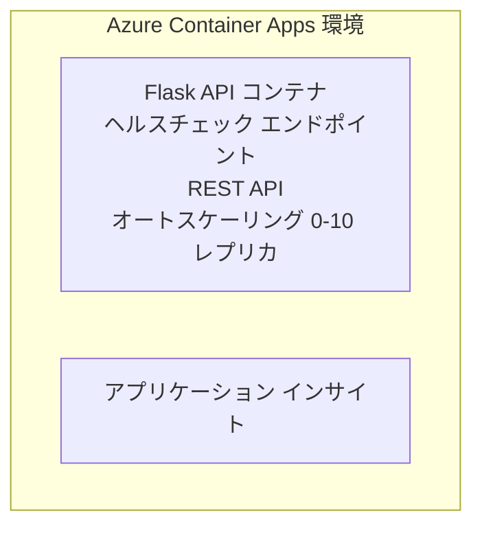

# シンプルな Flask API - Container App の例

**Learning Path:** 初心者 ⭐ | **Time:** 25-35 分 | **Cost:** $0-15/月

Azure Developer CLI (azd) を使用して Azure Container Apps にデプロイされた、完全に動作する Python Flask REST API の例です。この例では、コンテナーのデプロイ、オートスケーリング、および監視の基本を示します。

## 🎯 学べること

- コンテナー化された Python アプリケーションを Azure にデプロイする
- スケール・トゥ・ゼロを使用したオートスケーリングを設定する
- ヘルスプローブとレディネスチェックを実装する
- アプリケーションのログとメトリクスを監視する
- 素早いデプロイのために Azure Developer CLI を使用する

## 📦 含まれるもの

✅ **Flask アプリケーション** - CRUD 操作を含む完成した REST API (`src/app.py`)  
✅ **Dockerfile** - 本番対応のコンテナー設定  
✅ **Bicep インフラ** - Container Apps 環境と API のデプロイ  
✅ **AZD 構成** - ワンコマンドでのデプロイ設定  
✅ <strong>ヘルスプローブ</strong> - ライブネスおよびレディネスチェックが設定済み  
✅ <strong>オートスケーリング</strong> - HTTP ロードに基づく 0-10 レプリカ  

## Architecture



## 前提条件

### 必須
- **Azure Developer CLI (azd)** - [インストールガイド](https://learn.microsoft.com/azure/developer/azure-developer-cli/install-azd)
- **Azure subscription** - [無料アカウント](https://azure.microsoft.com/free/)
- **Docker Desktop** - [Docker をインストール](https://www.docker.com/products/docker-desktop/) (for local testing)

### 前提条件の確認

```bash
# azdのバージョンを確認する（1.5.0以上が必要）
azd version

# Azureへのログインを確認する
azd auth login

# Dockerを確認する（任意、ローカルテスト用）
docker --version
```

## ⏱️ デプロイのタイムライン

| フェーズ | 所要時間 | 内容 |
|-------|----------|--------------||
| 環境設定 | 30 秒 | azd 環境を作成 |
| コンテナーのビルド | 2-3 分 | Flask アプリを Docker ビルド |
| インフラのプロビジョニング | 3-5 分 | Container Apps、レジストリ、監視を作成 |
| アプリケーションのデプロイ | 2-3 分 | イメージをプッシュして Container Apps にデプロイ |
| <strong>合計</strong> | **8-12 分** | デプロイ完了、使用可能 |

## クイックスタート

```bash
# サンプルに移動する
cd examples/container-app/simple-flask-api

# 環境を初期化する（固有の名前を選択）
azd env new myflaskapi

# すべてをデプロイする（インフラとアプリケーション）
azd up
# 次の操作が求められます:
# 1. Azure サブスクリプションを選択する
# 2. リージョンを選択する（例: eastus2）
# 3. デプロイには8～12分かかります

# API エンドポイントを取得する
azd env get-values

# API をテストする
curl $(azd env get-value API_ENDPOINT)/health
```

**期待される出力:**
```json
{
  "status": "healthy",
  "timestamp": "2025-11-19T10:30:00Z",
  "service": "simple-flask-api",
  "version": "1.0.0"
}
```

## ✅ デプロイの確認

### ステップ 1: デプロイ状況を確認

```bash
# デプロイされたサービスを表示
azd show

# 期待される出力は次のとおり:
# - サービス: api
# - エンドポイント: https://ca-api-[env].xxx.azurecontainerapps.io
# - ステータス: 実行中
```

### ステップ 2: API エンドポイントをテスト

```bash
# API エンドポイントを取得する
API_URL=$(azd env get-value API_ENDPOINT)

# ヘルスチェックをテストする
curl $API_URL/health

# ルートエンドポイントをテストする
curl $API_URL/

# アイテムを作成する
curl -X POST $API_URL/api/items \
  -H "Content-Type: application/json" \
  -d '{"name": "Test Item", "description": "My first item"}'

# すべてのアイテムを取得する
curl $API_URL/api/items
```

**成功基準:**
- ✅ ヘルスエンドポイントが HTTP 200 を返す
- ✅ ルートエンドポイントが API 情報を表示する
- ✅ POST がアイテムを作成し HTTP 201 を返す
- ✅ GET が作成されたアイテムを返す

### ステップ 3: ログを表示

```bash
# azd monitor を使用してライブログをストリーミングする
azd monitor --logs

# または Azure CLI を使用する:
az containerapp logs show --name api --resource-group $RG_NAME --follow

# 次の内容が表示されます:
# - Gunicorn の起動メッセージ
# - HTTP リクエストログ
# - アプリケーションの情報ログ
```

## プロジェクト構成

```
simple-flask-api/
├── azure.yaml              # AZD configuration
├── infra/
│   ├── main.bicep         # Main infrastructure
│   ├── main.parameters.json
│   └── app/
│       ├── container-env.bicep
│       └── api.bicep
└── src/
    ├── app.py             # Flask application
    ├── requirements.txt
    └── Dockerfile
```

## API エンドポイント

| エンドポイント | メソッド | 説明 |
|----------|--------|-------------|
| `/health` | GET | ヘルスチェック |
| `/api/items` | GET | 全アイテムを一覧表示 |
| `/api/items` | POST | 新しいアイテムを作成 |
| `/api/items/{id}` | GET | 特定のアイテムを取得 |
| `/api/items/{id}` | PUT | アイテムを更新 |
| `/api/items/{id}` | DELETE | アイテムを削除 |

## 設定

### 環境変数

```bash
# カスタム構成を設定する
azd env set PORT 8000
azd env set LOG_LEVEL info
azd env set MAX_REPLICAS 20
```

### スケーリング構成

この API は HTTP トラフィックに基づいて自動的にスケールします:
- <strong>最小レプリカ数</strong>: 0（アイドル時にゼロにスケールします）
- <strong>最大レプリカ数</strong>: 10
- <strong>各レプリカあたりの同時リクエスト数</strong>: 50

## 開発

### ローカルで実行

```bash
# 依存関係をインストールする
cd src
pip install -r requirements.txt

# アプリを実行する
python app.py

# ローカルでテストする
curl http://localhost:8000/health
```

### コンテナーのビルドとテスト

```bash
# Dockerイメージをビルドする
docker build -t flask-api:local ./src

# ローカルでコンテナを実行する
docker run -p 8000:8000 flask-api:local

# コンテナをテストする
curl http://localhost:8000/health
```

## デプロイ

### フルデプロイ

```bash
# インフラとアプリケーションをデプロイする
azd up
```

### コードのみのデプロイ

```bash
# アプリケーションコードのみをデプロイする（インフラは変更しない）
azd deploy api
```

### 設定の更新

```bash
# 環境変数を更新する
azd env set API_KEY "new-api-key"

# 新しい構成で再デプロイする
azd deploy api
```

## 監視

### ログの表示

```bash
# azd monitor を使ってライブログをストリーミングする
azd monitor --logs

# または Container Apps 用の Azure CLI を使用する:
az containerapp logs show --name api --resource-group $RG_NAME --follow

# 最後の100行を表示
az containerapp logs show --name api --resource-group $RG_NAME --tail 100
```

### メトリクスの監視

```bash
# Azure Monitor のダッシュボードを開く
azd monitor --overview

# 特定のメトリックを表示する
az monitor metrics list \
  --resource $(azd show --output json | jq -r '.services.api.resourceId') \
  --metric "Requests,ResponseTime"
```

## テスト

### ヘルスチェック

```bash
curl $(azd show --output json | jq -r '.services.api.endpoint')/health
```

期待されるレスポンス:
```json
{
  "status": "healthy",
  "timestamp": "2025-11-19T10:30:00Z"
}
```

### アイテムの作成

```bash
curl -X POST $(azd show --output json | jq -r '.services.api.endpoint')/api/items \
  -H "Content-Type: application/json" \
  -d '{"name": "Test Item", "description": "A test item"}'
```

### 全アイテムの取得

```bash
curl $(azd show --output json | jq -r '.services.api.endpoint')/api/items
```

## コスト最適化

このデプロイはスケール・トゥ・ゼロを使用するため、API がリクエストを処理しているときのみ課金されます:

- <strong>アイドル時のコスト</strong>: 約 $0/月（ゼロにスケール）
- <strong>稼働時のコスト</strong>: 約 $0.000024/秒（レプリカあたり）
- <strong>想定月額コスト</strong>（軽い利用）: $5-15

### コストをさらに削減

```bash
# 開発環境のために最大レプリカ数を縮小する
azd env set MAX_REPLICAS 3

# アイドルタイムアウトを短くする
azd env set SCALE_TO_ZERO_TIMEOUT 300  # 5分
```

## トラブルシューティング

### コンテナーが起動しない

```bash
# Azure CLI を使用してコンテナーのログを確認する
az containerapp logs show --name api --resource-group $RG_NAME --tail 100

# Docker イメージがローカルでビルドされることを確認する
docker build -t test ./src
```

### API にアクセスできない

```bash
# ingressが外部向けであることを確認する
az containerapp show --name api --resource-group rg-simple-flask-api \
  --query properties.configuration.ingress.external
```

### 高い応答時間

```bash
# CPU/メモリ使用率を確認する
az monitor metrics list \
  --resource $(azd show --output json | jq -r '.services.api.resourceId') \
  --metric "CPUPercentage,MemoryPercentage"

# 必要に応じてリソースを拡張する
az containerapp update --name api --resource-group rg-simple-flask-api \
  --cpu 1.0 --memory 2Gi
```

## クリーンアップ

```bash
# すべてのリソースを削除する
azd down --force --purge
```

## 次のステップ

### この例を拡張する

1. <strong>データベースを追加</strong> - Azure Cosmos DB または SQL Database を統合する
   ```bash
   # infra/main.bicep に Cosmos DB モジュールを追加
   # app.py にデータベース接続を追加
   ```

2. <strong>認証を追加</strong> - Microsoft Entra ID または API キーを実装する
   ```python
   # app.py に認証ミドルウェアを追加する
   from functools import wraps
   ```

3. **CI/CD を設定** - GitHub Actions ワークフロー
   ```yaml
   # Create .github/workflows/deploy.yml
   name: Deploy to Azure
   on: [push]
   ```

4. **マネージドID を追加** - Azure サービスへのアクセスを保護する
   ```bicep
   # Update infra/app/api.bicep
   identity: { type: 'SystemAssigned' }
   ```

### 関連する例

- **[データベース アプリ](../../../../../examples/database-app)** - SQL Database を使った完全な例
- **[マイクロサービス](../../../../../examples/container-app/microservices)** - マルチサービスアーキテクチャ
- **[Container Apps マスターガイド](../README.md)** - すべてのコンテナパターン

### 学習リソース

- 📚 [AZD 初心者向けコース](../../../README.md) - コースのメインページ
- 📚 [Container Apps パターン](../README.md) - さらに多くのデプロイパターン
- 📚 [AZD テンプレート ギャラリー](https://azure.github.io/awesome-azd/) - コミュニティテンプレート

## 追加リソース

### ドキュメント
- **[Flask ドキュメント](https://flask.palletsprojects.com/)** - Flask フレームワークガイド
- **[Azure Container Apps](https://learn.microsoft.com/azure/container-apps/)** - 公式 Azure ドキュメント
- **[Azure Developer CLI](https://learn.microsoft.com/azure/developer/azure-developer-cli/)** - azd コマンドリファレンス

### チュートリアル
- **[Container Apps クイックスタート](https://learn.microsoft.com/azure/container-apps/quickstart-portal)** - 最初のアプリをデプロイ
- **[Python on Azure](https://learn.microsoft.com/azure/developer/python/)** - Python 開発ガイド
- **[Bicep 言語](https://learn.microsoft.com/azure/azure-resource-manager/bicep/)** - インフラストラクチャをコードで管理

### ツール
- **[Azure Portal](https://portal.azure.com)** - リソースを視覚的に管理
- **[VS Code Azure Extension](https://marketplace.visualstudio.com/items?itemName=ms-azuretools.vscode-azurecontainerapps)** - IDE 統合

---

**🎉 おめでとうございます！** オートスケーリングと監視を備えた本番対応の Flask API を Azure Container Apps にデプロイしました。

**ご質問は？** [Issue を開く](https://github.com/microsoft/AZD-for-beginners/issues) または [よくある質問](../../../resources/faq.md) を確認してください

---

<!-- CO-OP TRANSLATOR DISCLAIMER START -->
**免責事項**：
本書類は AI 翻訳サービス [Co-op Translator](https://github.com/Azure/co-op-translator) を使用して翻訳されています。正確性を期していますが、自動翻訳には誤りや不正確な部分が含まれる可能性があることをご承知おきください。原文の原語版が正式な情報源とみなされるべきです。重要な情報については、専門の人間による翻訳を推奨します。本翻訳の利用により生じたいかなる誤解や解釈違いについても、当方は責任を負いかねます。
<!-- CO-OP TRANSLATOR DISCLAIMER END -->