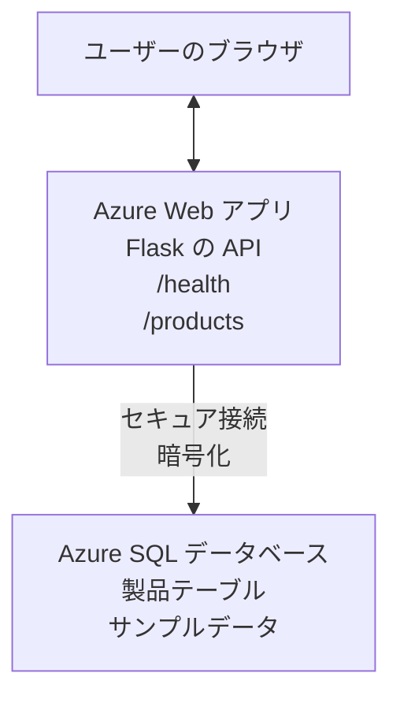

# AZD を使って Microsoft SQL データベースと Web アプリをデプロイ

⏱️ **所要時間（目安）**: 20-30 分 | 💰 <strong>推定費用</strong>: 約 $15-25/月 | ⭐ <strong>難易度</strong>: 中級

この <strong>完全に動作するサンプル</strong> は、[Azure Developer CLI (azd)](https://learn.microsoft.com/azure/developer/azure-developer-cli/) を使用して、Microsoft SQL Database を持つ Python Flask ウェブアプリを Azure にデプロイする方法を示します。すべてのコードが含まれており、テスト済みです—外部依存関係は不要です。

## 学べること

この例を完了すると、次のことができます:
- インフラストラクチャをコードとして定義してマルチティア アプリケーション（Web アプリ + データベース）をデプロイする
- シークレットをハードコーディングせずに安全なデータベース接続を構成する
- Application Insights でアプリケーションの健全性を監視する
- AZD CLI で Azure リソースを効率的に管理する
- セキュリティ、コスト最適化、および可観測性に関する Azure のベストプラクティスに従う

## シナリオ概要
- **Web アプリ**: データベース接続を持つ Python Flask REST API
- <strong>データベース</strong>: サンプルデータを含む Azure SQL Database
- <strong>インフラストラクチャ</strong>: Bicep（モジュール式で再利用可能なテンプレート）を使用してプロビジョニング
- <strong>デプロイ</strong>: `azd` コマンドで完全自動化
- <strong>監視</strong>: ログとテレメトリ用の Application Insights

## 前提条件

### 必要なツール

開始する前に、以下のツールがインストールされていることを確認してください:

1. **[Azure CLI](https://learn.microsoft.com/cli/azure/install-azure-cli)** (バージョン 2.50.0 以上)
   ```sh
   az --version
   # 期待される出力: azure-cli 2.50.0 以上
   ```

2. **[Azure Developer CLI (azd)](https://learn.microsoft.com/azure/developer/azure-developer-cli/install-azd)** (バージョン 1.0.0 以上)
   ```sh
   azd version
   # 期待される出力: azd バージョン 1.0.0 以上
   ```

3. **[Python 3.8+](https://www.python.org/downloads/)** (ローカル開発用)
   ```sh
   python --version
   # 期待される出力: Python 3.8 以上
   ```

4. **[Docker](https://www.docker.com/get-started)** (オプション、ローカルのコンテナ化された開発用)
   ```sh
   docker --version
   # 期待される出力: Docker のバージョン 20.10 以上
   ```

### Azure の要件

- アクティブな **Azure サブスクリプション** ([無料アカウントを作成](https://azure.microsoft.com/free/))
- サブスクリプションでリソースを作成する権限
- サブスクリプションまたはリソースグループに対する **Owner** または **Contributor** ロール

### 知識の前提

これは <strong>中級レベル</strong> の例です。次のことに慣れている必要があります:
- 基本的なコマンドライン操作
- クラウドの基本概念（リソース、リソースグループ）
- ウェブアプリケーションとデータベースの基本的な理解

**AZD が初めてですか？** まずは [入門ガイド](../../docs/chapter-01-foundation/azd-basics.md) を参照してください。

## アーキテクチャ

この例では、Web アプリケーションと SQL データベースからなる 2 層アーキテクチャをデプロイします:

**リソースのデプロイ:**
- **リソース グループ**: すべてのリソースを格納するコンテナ
- **App Service プラン**: Linux ベースのホスティング（コスト効率のため B1 ティア）
- **Web アプリ**: Flask アプリを動かす Python 3.11 ランタイム
- **SQL サーバー**: TLS 1.2 以上をサポートするマネージドデータベースサーバー
- **SQL データベース**: Basic ティア（2GB、開発/テスト向け）
- **Application Insights**: 監視とログ収集
- **Log Analytics Workspace**: ログの集中保存

<strong>例え</strong>: これをレストラン（Web アプリ）とウォークイン冷凍庫（データベース）のように考えてください。顧客はメニュー（API エンドポイント）から注文し、キッチン（Flask アプリ）が冷凍庫から材料（データ）を取り出します。レストランのマネージャー（Application Insights）が起きたすべてを追跡します。

## フォルダ構成

この例にはすべてのファイルが含まれており、外部依存関係は不要です:
```
examples/database-app/
│
├── README.md                    # This file
├── azure.yaml                   # AZD configuration file
├── .env.sample                  # Sample environment variables
├── .gitignore                   # Git ignore patterns
│
├── infra/                       # Infrastructure as Code (Bicep)
│   ├── main.bicep              # Main orchestration template
│   ├── abbreviations.json      # Azure naming conventions
│   └── resources/              # Modular resource templates
│       ├── sql-server.bicep    # SQL Server configuration
│       ├── sql-database.bicep  # Database configuration
│       ├── app-service-plan.bicep  # Hosting plan
│       ├── app-insights.bicep  # Monitoring setup
│       └── web-app.bicep       # Web application
│
└── src/
    └── web/                    # Application source code
        ├── app.py              # Flask REST API
        ├── requirements.txt    # Python dependencies
        └── Dockerfile          # Container definition
```

**各ファイルの役割:**
- **azure.yaml**: AZD に何をどこにデプロイするかを指示する
- **infra/main.bicep**: すべての Azure リソースをオーケストレーションする
- **infra/resources/*.bicep**: 各リソースの定義（再利用のためモジュール化）
- **src/web/app.py**: データベースロジックを含む Flask アプリケーション
- **requirements.txt**: Python パッケージの依存関係
- **Dockerfile**: デプロイのためのコンテナ化指示

## クイックスタート（ステップバイステップ）

### ステップ 1: クローンして移動

```sh
git clone https://github.com/microsoft/AZD-for-beginners.git
cd AZD-for-beginners/examples/database-app
```

**✓ 成功確認**: `azure.yaml` と `infra/` フォルダーがあることを確認してください:
```sh
ls
# 期待される: README.md、azure.yaml、infra/、src/
```

### ステップ 2: Azure に認証

```sh
azd auth login
```

これによりブラウザが開いて Azure 認証が行われます。Azure の資格情報でサインインしてください。

**✓ 成功確認**: 次のように表示されるはずです:
```
Logged in to Azure.
```

### ステップ 3: 環境の初期化

```sh
azd init
```

<strong>何が起こるか</strong>: AZD はデプロイ用のローカル構成を作成します。

<strong>表示されるプロンプト</strong>:
- <strong>環境名</strong>: 短い名前を入力してください（例: `dev`, `myapp`）
- **Azure サブスクリプション**: リストからサブスクリプションを選択
- **Azure の場所**: リージョンを選択してください（例: `eastus`, `westeurope`）

**✓ 成功確認**: 次のように表示されるはずです:
```
SUCCESS: New project initialized!
```

### ステップ 4: Azure リソースのプロビジョニング

```sh
azd provision
```

<strong>何が起こるか</strong>: AZD はすべてのインフラをデプロイします（所要時間 5-8 分）:
1. リソース グループを作成
2. SQL サーバーとデータベースを作成
3. App Service プランを作成
4. Web アプリを作成
5. Application Insights を作成
6. ネットワーキングとセキュリティを構成

<strong>以下を入力するよう求められます</strong>:
- **SQL 管理者ユーザー名**: ユーザー名を入力してください（例: `sqladmin`）
- **SQL 管理者パスワード**: 強力なパスワードを入力してください（保存してください！）

**✓ 成功確認**: 次のように表示されるはずです:
```
SUCCESS: Your application was provisioned in Azure in X minutes Y seconds.
You can view the resources created under the resource group rg-<env-name> in Azure Portal:
https://portal.azure.com/#@/resource/subscriptions/.../resourceGroups/rg-<env-name>
```

**⏱️ 時間**: 5-8 分

### ステップ 5: アプリケーションのデプロイ

```sh
azd deploy
```

<strong>何が起こるか</strong>: AZD は Flask アプリケーションをビルドしてデプロイします:
1. Python アプリケーションをパッケージ化
2. Docker コンテナをビルド
3. Azure Web App にプッシュ
4. データベースをサンプルデータで初期化
5. アプリケーションを起動

**✓ 成功確認**: 次のように表示されるはずです:
```
SUCCESS: Your application was deployed to Azure in X minutes Y seconds.
You can view the resources created under the resource group rg-<env-name> in Azure Portal:
https://portal.azure.com/#@/resource/subscriptions/.../resourceGroups/rg-<env-name>
```

**⏱️ 時間**: 3-5 分

### ステップ 6: アプリケーションをブラウズ

```sh
azd browse
```

これにより、デプロイされた Web アプリがブラウザで `https://app-<unique-id>.azurewebsites.net` に開きます

**✓ 成功確認**: JSON 出力が表示されるはずです:
```json
{
  "message": "Welcome to the Database App API",
  "endpoints": {
    "/": "This help message",
    "/health": "Health check endpoint",
    "/products": "List all products",
    "/products/<id>": "Get product by ID"
  }
}
```

### ステップ 7: API エンドポイントをテスト

<strong>ヘルスチェック</strong>（データベース接続を検証）:
```sh
curl https://app-<your-id>.azurewebsites.net/health
```

<strong>期待されるレスポンス</strong>:
```json
{
  "status": "healthy",
  "database": "connected"
}
```

<strong>製品一覧</strong>（サンプルデータ）:
```sh
curl https://app-<your-id>.azurewebsites.net/products
```

<strong>期待されるレスポンス</strong>:
```json
[
  {
    "id": 1,
    "name": "Laptop",
    "description": "High-performance laptop",
    "price": 1299.99,
    "created_at": "2025-11-19T10:30:00"
  },
  ...
]
```

<strong>単一製品の取得</strong>:
```sh
curl https://app-<your-id>.azurewebsites.net/products/1
```

**✓ 成功確認**: すべてのエンドポイントがエラーなく JSON データを返します。

---

**🎉 おめでとうございます！** AZD を使用してデータベース付きの Web アプリケーションを Azure に正常にデプロイしました。

## 設定の詳細

### 環境変数

シークレットは Azure App Service の設定を介して安全に管理されます—<strong>ソースコード内にハードコーディングしてはいけません</strong>。

**AZD によって自動的に設定される項目**:
- `SQL_CONNECTION_STRING`: 暗号化された資格情報を含むデータベース接続文字列
- `APPLICATIONINSIGHTS_CONNECTION_STRING`: モニタリング用テレメトリエンドポイント
- `SCM_DO_BUILD_DURING_DEPLOYMENT`: 自動依存関係インストールを有効にする

<strong>シークレットの保存先</strong>:
1. `azd provision` 実行時に、安全なプロンプトで SQL 資格情報を入力します
2. AZD はこれらをローカルの `.azure/<env-name>/.env` ファイルに保存します（git 管理外）
3. AZD はそれらを Azure App Service の設定に注入します（保存時に暗号化）
4. アプリケーションは実行時に `os.getenv()` でそれらを読み取ります

### ローカル開発

ローカルでテストするには、サンプルから `.env` ファイルを作成してください:
```sh
cp .env.sample .env
# ローカルのデータベース接続情報で .env を編集してください
```

<strong>ローカル開発のワークフロー</strong>:
```sh
# 依存関係をインストールする
cd src/web
pip install -r requirements.txt

# 環境変数を設定する
export SQL_CONNECTION_STRING="your-local-connection-string"

# アプリケーションを実行する
python app.py
```

<strong>ローカルでテスト</strong>:
```sh
curl http://localhost:8000/health
# 期待される: {"status": "healthy", "database": "connected"}
```

### インフラストラクチャーをコード化

すべての Azure リソースは **Bicep テンプレート**（`infra/` フォルダー）で定義されています:

- <strong>モジュール設計</strong>: 各リソースタイプは再利用のために個別ファイルになっています
- <strong>パラメータ化</strong>: SKU、リージョン、命名規則をカスタマイズ可能
- <strong>ベストプラクティス</strong>: Azure の命名規則とセキュリティ既定に従っています
- <strong>バージョン管理</strong>: インフラの変更は Git で追跡されます

<strong>カスタマイズ例</strong>:
データベースのティアを変更するには、`infra/resources/sql-database.bicep` を編集してください:
```bicep
sku: {
  name: 'Standard'  // Changed from 'Basic'
  tier: 'Standard'
  capacity: 10
}
```

## セキュリティのベストプラクティス

この例は Azure のセキュリティのベストプラクティスに従っています:

### 1. <strong>ソースコードにシークレットを含めない</strong>
- ✅ 資格情報は Azure App Service の設定に保存されます（暗号化）
- ✅ `.env` ファイルは `.gitignore` で Git から除外されています
- ✅ シークレットはプロビジョニング中に安全なパラメーターとして渡されます

### 2. <strong>暗号化された接続</strong>
- ✅ SQL サーバーに対して TLS 1.2 以上を使用
- ✅ Web アプリでは HTTPS のみを強制
- ✅ データベース接続は暗号化チャネルを使用

### 3. <strong>ネットワークセキュリティ</strong>
- ✅ SQL サーバーのファイアウォールは Azure サービスのみを許可するように設定
- ✅ パブリックネットワークアクセスは制限されています（Private Endpoint でさらに厳密にできます）
- ✅ Web アプリで FTPS を無効化

### 4. <strong>認証と認可</strong>
- ⚠️ <strong>現状</strong>: SQL 認証（ユーザー名/パスワード）
- ✅ <strong>本番推奨</strong>: パスワード不要の認証のために Azure Managed Identity を使用する

**Managed Identity への移行方法**（本番向け）:
1. Web アプリでマネージド ID を有効にする
2. ID に対して SQL の権限を付与する
3. 接続文字列をマネージド ID を使用するよう更新する
4. パスワードベースの認証を削除する

### 5. <strong>監査とコンプライアンス</strong>
- ✅ Application Insights はすべてのリクエストとエラーをログに記録します
- ✅ SQL データベースの監査が有効化されています（コンプライアンス用に構成可能）
- ✅ すべてのリソースにガバナンス用タグが付与されています

<strong>本番前のセキュリティチェックリスト</strong>:
- [ ] Azure Defender for SQL を有効にする
- [ ] SQL データベースの Private Endpoint を構成する
- [ ] Web Application Firewall (WAF) を有効にする
- [ ] シークレットローテーションのために Azure Key Vault を導入する
- [ ] Azure AD 認証を構成する
- [ ] すべてのリソースで診断ロギングを有効にする

## コスト最適化

<strong>推定月額費用</strong>（2025年11月時点）:

| リソース | SKU/ティア | 推定費用 |
|----------|----------|----------------|
| App Service Plan | B1 (Basic) | ~$13/month |
| SQL Database | Basic (2GB) | ~$5/month |
| Application Insights | Pay-as-you-go | ~$2/month (low traffic) |
| <strong>合計</strong> | | **~$20/month** |

**💡 コスト削減のヒント**:

1. <strong>学習目的で無料ティアを使う</strong>:
   - App Service: F1 ティア（無料、時間制限あり）
   - SQL Database: Azure SQL Database serverless を使用
   - Application Insights: 月 5GB の無料取り込み

2. <strong>使用していないときはリソースを停止する</strong>:
   ```sh
   # Webアプリを停止する（データベースは引き続き課金されます）
   az webapp stop --name <app-name> --resource-group <rg-name>
   
   # 必要に応じて再起動する
   az webapp start --name <app-name> --resource-group <rg-name>
   ```

3. <strong>テスト後にすべて削除する</strong>:
   ```sh
   azd down
   ```
   これにより、すべてのリソースが削除され、課金が停止します。

4. **開発と本番の SKU**:
   - <strong>開発</strong>: Basic ティア（この例で使用）
   - <strong>本番</strong>: 冗長性を持つ Standard/Premium ティア

<strong>コスト監視</strong>:
- [Azure Cost Management](https://portal.azure.com/#view/Microsoft_Azure_CostManagement) でコストを確認する
- 予期しない請求を避けるためにコストアラートを設定する
- トラッキングのためにすべてのリソースに `azd-env-name` タグを付与する

<strong>無料ティアの代替案</strong>:
学習用途の場合、`infra/resources/app-service-plan.bicep` を変更できます:
```bicep
sku: {
  name: 'F1'  // Free tier
  tier: 'Free'
}
```
<strong>注</strong>: 無料ティアには制限があります（CPU 60 分/日、常時オン不可）。

## 監視と可観測性

### Application Insights の統合

この例には包括的な監視のための **Application Insights** が含まれています:

<strong>監視項目</strong>:
- ✅ HTTP リクエスト（レイテンシ、ステータスコード、エンドポイント）
- ✅ アプリケーションのエラーと例外
- ✅ Flask アプリからのカスタムログ
- ✅ データベース接続の健全性
- ✅ パフォーマンス指標（CPU、メモリ）

**Application Insights へのアクセス**:
1. [Azure ポータル](https://portal.azure.com) を開く
2. リソース グループ（`rg-<env-name>`）に移動
3. Application Insights リソース（`appi-<unique-id>`）をクリック

<strong>便利なクエリ</strong>（Application Insights → Logs）:

<strong>すべてのリクエストを表示</strong>:
```kusto
requests
| where timestamp > ago(1h)
| order by timestamp desc
| project timestamp, name, url, resultCode, duration
```

<strong>エラーを探す</strong>:
```kusto
exceptions
| where timestamp > ago(24h)
| order by timestamp desc
| project timestamp, type, outerMessage, operation_Name
```

<strong>ヘルスエンドポイントを確認</strong>:
```kusto
requests
| where name contains "health"
| summarize count() by resultCode, bin(timestamp, 1h)
```

### SQL データベースの監査

**SQL データベースの監査が有効化されています**（追跡対象）:
- データベースアクセスパターン
- 失敗したログイン試行
- スキーマの変更
- データアクセス（コンプライアンス向け）

<strong>監査ログへのアクセス</strong>:
1. Azure ポータル → SQL Database → Auditing
2. Log Analytics ワークスペースでログを確認

### リアルタイム監視

**ライブ メトリクスを表示**:
1. Application Insights → Live Metrics
2. リアルタイムでリクエスト、失敗、パフォーマンスを確認

<strong>アラートの設定</strong>:
重要なイベントに対してアラートを作成する:
- 5 分で HTTP 500 エラーが 5 件を超える
- データベース接続の失敗
- 応答時間が長い（>2 秒）

<strong>アラート作成の例</strong>:
```sh
az monitor metrics alert create \
  --name "High-Response-Time" \
  --resource-group <rg-name> \
  --scopes <app-insights-resource-id> \
  --condition "avg requests/duration > 2000" \
  --description "Alert when response time exceeds 2 seconds"
```

## トラブルシューティング
### よくある問題とその解決策

#### 1. `azd provision` が "Location not available" と表示されて失敗する

<strong>症状</strong>:
```
Error: The subscription is not registered for the resource type 'components' in the location 'centralus'.
```

<strong>解決策</strong>:
別の Azure リージョンを選択するか、リソース プロバイダーを登録してください:
```sh
az provider register --namespace Microsoft.Insights
```

#### 2. SQL 接続がデプロイ中に失敗する

<strong>症状</strong>:
```
pyodbc.OperationalError: ('08001', '[08001] [Microsoft][ODBC Driver 18 for SQL Server]TCP Provider...')
```

<strong>解決策</strong>:
- SQL Server のファイアウォールが Azure サービスを許可していることを確認する（自動で構成されます）
- `azd provision` 実行時に SQL 管理者パスワードが正しく入力されたか確認する
- SQL Server が完全にプロビジョニングされていることを確認する（2〜3分かかることがあります）

<strong>接続を確認</strong>:
```sh
# Azure ポータルで、SQL データベース → クエリ エディターに移動します
# 資格情報を使って接続してみてください
```

#### 3. Web アプリが "Application Error" を表示する

<strong>症状</strong>:
ブラウザーに汎用のエラーページが表示されます。

<strong>解決策</strong>:
アプリケーションログを確認してください:
```sh
# 最近のログを表示
az webapp log tail --name <app-name> --resource-group <rg-name>
```

<strong>一般的な原因</strong>:
- 環境変数が不足している（App Service → 設定を確認）
- Python パッケージのインストールに失敗した（デプロイログを確認）
- データベース初期化エラー（SQL 接続性を確認）

#### 4. `azd deploy` が "Build Error" で失敗する

<strong>症状</strong>:
```
Error: Failed to build project
```

<strong>解決策</strong>:
- `requirements.txt` に構文エラーがないことを確認する
- `infra/resources/web-app.bicep` に Python 3.11 が指定されていることを確認する
- Dockerfile のベースイメージが正しいことを確認する

<strong>ローカルでデバッグ</strong>:
```sh
cd src/web
docker build -t test-app .
docker run -p 8000:8000 test-app
```

#### 5. AZD コマンド実行時に「Unauthorized」となる

<strong>症状</strong>:
```
ERROR: (Unauthorized) The client '<id>' with object id '<id>' does not have authorization
```

<strong>解決策</strong>:
Azure に再認証してください:
```sh
# AZD ワークフローに必要
azd auth login

# 直接 Azure CLI コマンドを使用している場合は任意
az login
```

サブスクリプション上で正しい権限（Contributor ロール）を持っていることを確認してください。

#### 6. データベースのコストが高い

<strong>症状</strong>:
予期しない Azure の請求。

<strong>解決策</strong>:
- テスト後に `azd down` を実行し忘れていないか確認する
- SQL Database が Basic テier を使用しているか確認する（Premium ではないこと）
- Azure Cost Management でコストを確認する
- コストアラートを設定する

### サポートを得る

**すべての AZD 環境変数を表示**:
```sh
azd env get-values
```

<strong>デプロイの状態を確認</strong>:
```sh
az webapp show --name <app-name> --resource-group <rg-name> --query state
```

<strong>アプリケーションログにアクセス</strong>:
```sh
az webapp log download --name <app-name> --resource-group <rg-name> --log-file app-logs.zip
```

**さらにサポートが必要ですか?**
- [AZD Troubleshooting Guide](../../docs/chapter-07-troubleshooting/common-issues.md)
- [Azure App Service Troubleshooting](https://learn.microsoft.com/azure/app-service/troubleshoot-diagnostic-logs)
- [Azure SQL Troubleshooting](https://learn.microsoft.com/azure/azure-sql/database/troubleshoot-common-errors-issues)

## 実践演習

### 演習 1: デプロイの検証（初心者）

<strong>目標</strong>: すべてのリソースがデプロイされ、アプリケーションが動作していることを確認する。

<strong>手順</strong>:
1. リソース グループ内のすべてのリソースを一覧表示してください:
   ```sh
   az resource list --resource-group rg-<env-name> --output table
   ```
   <strong>期待される結果</strong>: 6-7 個のリソース（Web App, SQL Server, SQL Database, App Service Plan, Application Insights, Log Analytics）

2. すべての API エンドポイントをテストしてください:
   ```sh
   curl https://app-<your-id>.azurewebsites.net/
   curl https://app-<your-id>.azurewebsites.net/health
   curl https://app-<your-id>.azurewebsites.net/products
   curl https://app-<your-id>.azurewebsites.net/products/1
   ```
   <strong>期待される結果</strong>: すべてがエラーなく有効な JSON を返す

3. Application Insights を確認:
   - Azure ポータルで Application Insights に移動
   - "Live Metrics" に移動
   - Web アプリのブラウザーをリフレッシュ
   <strong>期待される結果</strong>: リアルタイムでリクエストが表示されるのが確認できる

<strong>成功基準</strong>: 6-7 個のリソースがすべて存在し、すべてのエンドポイントがデータを返し、Live Metrics にアクティビティが表示されること。

---

### 演習 2: 新しい API エンドポイントを追加（中級）

<strong>目標</strong>: Flask アプリケーションに新しいエンドポイントを拡張する。

<strong>スターターコード</strong>: 現在のエンドポイントは `src/web/app.py`

<strong>手順</strong>:
1. `src/web/app.py` を編集し、`get_product()` 関数の後に新しいエンドポイントを追加してください:
   ```python
   @app.route('/products/search/<keyword>')
   def search_products(keyword):
       """Search products by name or description."""
       try:
           conn = get_db_connection()
           cursor = conn.cursor()
           cursor.execute(
               "SELECT id, name, description, price, created_at FROM products WHERE name LIKE ? OR description LIKE ?",
               (f'%{keyword}%', f'%{keyword}%')
           )
           
           products = []
           for row in cursor.fetchall():
               products.append({
                   'id': row[0],
                   'name': row[1],
                   'description': row[2],
                   'price': float(row[3]) if row[3] else None,
                   'created_at': row[4].isoformat() if row[4] else None
               })
           
           cursor.close()
           conn.close()
           
           logger.info(f"Search for '{keyword}' returned {len(products)} results")
           return jsonify(products), 200
           
       except Exception as e:
           logger.error(f"Error searching products: {str(e)}")
           return jsonify({'error': str(e)}), 500
   ```

2. 更新したアプリケーションをデプロイしてください:
   ```sh
   azd deploy
   ```

3. 新しいエンドポイントをテストしてください:
   ```sh
   curl https://app-<your-id>.azurewebsites.net/products/search/laptop
   ```
   <strong>期待される結果</strong>: "laptop" に一致する製品を返す

<strong>成功基準</strong>: 新しいエンドポイントが動作し、フィルタされた結果を返し、Application Insights のログに表示されること。

---

### 演習 3: 監視とアラートの追加（上級）

<strong>目標</strong>: アラートを含むプロアクティブな監視を設定する。

<strong>手順</strong>:
1. HTTP 500 エラー用のアラートを作成:
   ```sh
   # Application Insights リソースの ID を取得する
   AI_ID=$(az monitor app-insights component show \
     --app appi-<your-id> \
     --resource-group rg-<env-name> \
     --query id -o tsv)
   
   # アラートを作成する
   az monitor metrics alert create \
     --name "High-Error-Rate" \
     --resource-group rg-<env-name> \
     --scopes $AI_ID \
     --condition "count requests/failed > 5" \
     --window-size 5m \
     --evaluation-frequency 1m \
     --description "Alert when >5 failed requests in 5 minutes"
   ```

2. エラーを発生させてアラートをトリガー:
   ```sh
   # 存在しない製品を要求する
   for i in {1..10}; do curl https://app-<your-id>.azurewebsites.net/products/999; done
   ```

3. アラートが発火したか確認:
   - Azure ポータル → Alerts → Alert Rules
   - 設定してあればメールを確認

<strong>成功基準</strong>: アラート ルールが作成され、エラー時にトリガーされ、通知が受信されること。

---

### 演習 4: データベーススキーマの変更（上級）

<strong>目標</strong>: 新しいテーブルを追加し、アプリケーションをそれに対応させる。

<strong>手順</strong>:
1. Azure ポータルの Query Editor で SQL Database に接続

2. 新しい `categories` テーブルを作成:
   ```sql
   CREATE TABLE categories (
       id INT PRIMARY KEY IDENTITY(1,1),
       name NVARCHAR(50) NOT NULL,
       description NVARCHAR(200)
   );
   
   INSERT INTO categories (name, description) VALUES
   ('Electronics', 'Electronic devices and accessories'),
   ('Office Supplies', 'Office equipment and supplies');
   
   -- Add category to products table
   ALTER TABLE products ADD category_id INT;
   UPDATE products SET category_id = 1; -- Set all to Electronics
   ```

3. レスポンスにカテゴリ情報を含めるよう `src/web/app.py` を更新

4. デプロイしてテスト

<strong>成功基準</strong>: 新しいテーブルが存在し、製品にカテゴリ情報が表示され、アプリケーションが引き続き動作すること。

---

### 演習 5: キャッシュの実装（エキスパート）

<strong>目標</strong>: パフォーマンス向上のために Azure Redis Cache を追加する。

<strong>手順</strong>:
1. `infra/main.bicep` に Redis Cache を追加
2. `src/web/app.py` を更新して製品クエリをキャッシュする
3. Application Insights でパフォーマンス改善を測定
4. キャッシュ前後で応答時間を比較

<strong>成功基準</strong>: Redis がデプロイされ、キャッシュが機能し、応答時間が >50% 改善すること。

<strong>ヒント</strong>: [Azure Cache for Redis ドキュメント](https://learn.microsoft.com/azure/azure-cache-for-redis/) から始めてください。

---

## クリーンアップ

継続的な課金を避けるため、作業が終わったらすべてのリソースを削除してください:

```sh
azd down
```

<strong>確認プロンプト</strong>:
```
? Total resources to delete: 7, are you sure you want to continue? (y/N)
```

`y` を入力して確認してください。

**✓ 成功確認**: 
- Azure ポータルからすべてのリソースが削除されている
- 継続的な課金が発生していない
- ローカルの `.azure/<env-name>` フォルダーを削除できる

<strong>代替</strong>（インフラを維持し、データを削除）:
```sh
# リソースグループのみを削除する（AZD の設定は保持する）
az group delete --name rg-<env-name> --yes
```
## 詳細情報

### 関連ドキュメント
- [Azure Developer CLI ドキュメント](https://learn.microsoft.com/azure/developer/azure-developer-cli/)
- [Azure SQL Database ドキュメント](https://learn.microsoft.com/azure/azure-sql/database/)
- [Azure App Service ドキュメント](https://learn.microsoft.com/azure/app-service/)
- [Application Insights ドキュメント](https://learn.microsoft.com/azure/azure-monitor/app/app-insights-overview)
- [Bicep 言語リファレンス](https://learn.microsoft.com/azure/azure-resource-manager/bicep/)

### このコースの次のステップ
- **[Container Apps の例](../../../../examples/container-app)**: Azure Container Apps でマイクロサービスをデプロイ
- **[AI 統合ガイド](../../../../docs/ai-foundry)**: アプリに AI 機能を追加
- **[展開のベストプラクティス](../../docs/chapter-04-infrastructure/deployment-guide.md)**: 本番環境向けのデプロイパターン

### 上級トピック
- **Managed Identity**: パスワードを排除し Azure AD 認証を使用する
- **Private Endpoints**: 仮想ネットワーク内でデータベース接続を保護する
- **CI/CD Integration**: GitHub Actions や Azure DevOps でデプロイを自動化する
- **Multi-Environment**: 開発、ステージング、本番環境を設定する
- **Database Migrations**: スキーマバージョン管理に Alembic や Entity Framework を使用する

### 他のアプローチとの比較

**AZD vs. ARM Templates**:
- ✅ AZD: より高レベルの抽象化、より簡単なコマンド
- ⚠️ ARM: より冗長で詳細な制御

**AZD vs. Terraform**:
- ✅ AZD: Azure ネイティブ、Azure サービスと統合
- ⚠️ Terraform: マルチクラウド対応、より大きなエコシステム

**AZD vs. Azure Portal**:
- ✅ AZD: 再現可能、バージョン管理可能、自動化しやすい
- ⚠️ Portal: 手動操作が多く、再現が難しい

**AZD を考えると**: Azure 向けの Docker Compose — 複雑なデプロイの設定を簡素化するツール。

---

## よくある質問

**Q: 別のプログラミング言語を使用できますか？**  
A: はい！`src/web/` を Node.js、C#、Go、または任意の言語に置き換え、`azure.yaml` と Bicep を更新してください。

**Q: どのように複数のデータベースを追加しますか？**  
A: `infra/main.bicep` に別の SQL Database モジュールを追加するか、Azure Database サービスの PostgreSQL/MySQL を使用してください。

**Q: これを本番で使えますか？**  
A: これは出発点です。本番環境には、managed identity、private endpoints、冗長性、バックアップ戦略、WAF、強化された監視を追加してください。

**Q: コードデプロイの代わりにコンテナを使いたい場合は？**  
A: 全面で Docker コンテナを使用する [Container Apps の例](../../../../examples/container-app) をご覧ください。

**Q: ローカル マシンからデータベースに接続するには？**  
A: SQL Server のファイアウォールにあなたの IP を追加してください：
```sh
az sql server firewall-rule create \
  --resource-group rg-<env-name> \
  --server sql-<unique-id> \
  --name AllowMyIP \
  --start-ip-address <your-ip> \
  --end-ip-address <your-ip>
```

**Q: 新規作成の代わりに既存のデータベースを使えますか？**  
A: はい。`infra/main.bicep` を変更して既存の SQL Server を参照し、接続文字列のパラメーターを更新してください。

---

> **注:** この例は、AZD を使用してデータベースを伴う Web アプリをデプロイする際のベストプラクティスを示しています。動作するコード、包括的なドキュメント、および学習を強化する実践演習が含まれています。本番環境へのデプロイでは、組織固有のセキュリティ、スケーリング、コンプライアンス、およびコスト要件を確認してください。

**📚 コースナビゲーション:**
- ← 前へ: [Container Apps の例](../../../../examples/container-app)
- → 次へ: [AI 統合ガイド](../../../../docs/ai-foundry)
- 🏠 [コースホーム](../../README.md)

---

<!-- CO-OP TRANSLATOR DISCLAIMER START -->
**免責事項**:
本書はAI翻訳サービス [Co-op Translator](https://github.com/Azure/co-op-translator) を用いて翻訳されました。正確性には努めていますが、自動翻訳には誤りや不正確さが含まれる可能性があることをご承知ください。原文（原言語の文書）が権威ある出典とみなされるべきです。重要な情報については、専門の翻訳者による翻訳を推奨します。本翻訳の使用に起因するいかなる誤解や誤訳についても、当社は責任を負いません。
<!-- CO-OP TRANSLATOR DISCLAIMER END -->