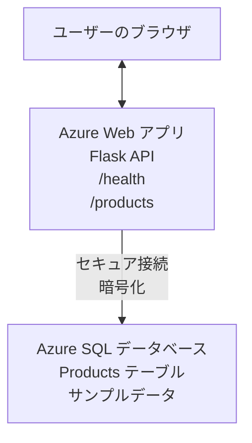

# AZDを使用したMicrosoft SQLデータベースとWebアプリのデプロイ

⏱️ <strong>推定時間</strong>: 20-30 分 | 💰 <strong>推定費用</strong>: ~$15-25/月 | ⭐ <strong>難易度</strong>: 中級

この <strong>完全な動作例</strong> は、[Azure Developer CLI (azd)](https://learn.microsoft.com/azure/developer/azure-developer-cli/) を使用して、Python Flask WebアプリケーションとMicrosoft SQLデータベースをAzureにデプロイする方法を示します。すべてのコードが含まれておりテスト済みです — 外部依存関係は不要です。

## この例で学べること

この例を完了することで、以下を学べます:
- インフラストラクチャをコードとして使用してマルチティアアプリケーション（Webアプリ + データベース）をデプロイする方法
- シークレットをハードコーディングせずに安全なデータベース接続を構成する方法
- Application Insights を使用したアプリケーションのヘルス監視
- AZD CLI を使用した Azure リソースの効率的な管理
- セキュリティ、コスト最適化、可観測性に関する Azure のベストプラクティスに従う方法

## シナリオ概要
- **Web App**: データベース接続を備えた Python Flask REST API
- **Database**: サンプルデータを含む Azure SQL データベース
- **Infrastructure**: Bicep を使用してプロビジョニング（モジュール化、再利用可能なテンプレート）
- **Deployment**: `azd` コマンドですべて自動化
- **Monitoring**: ログとテレメトリのための Application Insights

## 前提条件

### 必要なツール

開始する前に、以下のツールがインストールされていることを確認してください:

1. **[Azure CLI](https://learn.microsoft.com/cli/azure/install-azure-cli)** (バージョン 2.50.0 以上)
   ```sh
   az --version
   # 期待される出力: azure-cli 2.50.0 以上
   ```

2. **[Azure Developer CLI (azd)](https://learn.microsoft.com/azure/developer/azure-developer-cli/install-azd)** (バージョン 1.0.0 以上)
   ```sh
   azd version
   # 期待される出力: azd バージョン 1.0.0 以上
   ```

3. **[Python 3.8+](https://www.python.org/downloads/)** (ローカル開発用)
   ```sh
   python --version
   # 期待される出力: Python 3.8以上
   ```

4. **[Docker](https://www.docker.com/get-started)** (オプション、ローカルのコンテナ開発用)
   ```sh
   docker --version
   # 期待される出力: Docker のバージョンが20.10以上
   ```

### Azure の要件

- 有効な **Azure サブスクリプション** （[無料アカウントを作成](https://azure.microsoft.com/free/)）
- サブスクリプション内でリソースを作成する権限
- サブスクリプションまたはリソースグループに対する **Owner** または **Contributor** ロール

### 知識の前提

これは <strong>中級レベル</strong> の例です。以下の内容がわかっていることを想定します:
- 基本的なコマンドライン操作
- クラウドの基本概念（リソース、リソースグループ）
- Webアプリケーションとデータベースの基本的な理解

**AZDが初めてですか？** まずは [入門ガイド](../../docs/chapter-01-foundation/azd-basics.md) を参照してください。

## アーキテクチャ

この例は、Webアプリケーションと SQL データベースの二層アーキテクチャをデプロイします:



**リソースのデプロイ:**
- **Resource Group**: すべてのリソースを格納するコンテナ
- **App Service Plan**: Linux ベースのホスティング（コスト効率のため B1 ティア）
- **Web App**: Python 3.11 ランタイムと Flask アプリケーション
- **SQL Server**: TLS 1.2 以上を使用するマネージドデータベースサーバー
- **SQL Database**: 開発/テストに適した Basic ティア（2GB）
- **Application Insights**: モニタリングとログ取得
- **Log Analytics Workspace**: ログの集中管理

<strong>たとえ話</strong>: これはレストラン（Webアプリ）とウォークインフリーザー（データベース）のようなものです。顧客はメニュー（API エンドポイント）から注文し、キッチン（Flask アプリ）がフリーザーから食材（データ）を取り出します。レストランのマネージャー（Application Insights）はすべての出来事を追跡します。

## フォルダ構成

この例にはすべてのファイルが含まれており、外部依存関係は不要です:

```
examples/database-app/
│
├── README.md                    # This file
├── azure.yaml                   # AZD configuration file
├── .env.sample                  # Sample environment variables
├── .gitignore                   # Git ignore patterns
│
├── infra/                       # Infrastructure as Code (Bicep)
│   ├── main.bicep              # Main orchestration template
│   ├── abbreviations.json      # Azure naming conventions
│   └── resources/              # Modular resource templates
│       ├── sql-server.bicep    # SQL Server configuration
│       ├── sql-database.bicep  # Database configuration
│       ├── app-service-plan.bicep  # Hosting plan
│       ├── app-insights.bicep  # Monitoring setup
│       └── web-app.bicep       # Web application
│
└── src/
    └── web/                    # Application source code
        ├── app.py              # Flask REST API
        ├── requirements.txt    # Python dependencies
        └── Dockerfile          # Container definition
```

**各ファイルの説明:**
- **azure.yaml**: AZD に何をどこにデプロイするかを指示します
- **infra/main.bicep**: すべての Azure リソースをオーケストレーションします
- **infra/resources/*.bicep**: 個々のリソース定義（再利用のためにモジュール化）
- **src/web/app.py**: データベースロジックを含む Flask アプリケーション
- **requirements.txt**: Python パッケージ依存関係
- **Dockerfile**: デプロイ用のコンテナ化手順

## クイックスタート（ステップバイステップ）

### ステップ 1: クローンして移動

```sh
git clone https://github.com/microsoft/AZD-for-beginners.git
cd AZD-for-beginners/examples/database-app
```

**✓ 成功チェック**: `azure.yaml` と `infra/` フォルダーが表示されていることを確認してください:
```sh
ls
# 期待される: README.md, azure.yaml, infra/, src/
```

### ステップ 2: Azure に認証

```sh
azd auth login
```

これによりブラウザーが開き、Azure 認証が行われます。Azure の資格情報でサインインしてください。

**✓ 成功チェック**: 以下が表示されるはずです:
```
Logged in to Azure.
```

### ステップ 3: 環境の初期化

```sh
azd init
```

<strong>何が起きるか</strong>: AZD がデプロイ用のローカル構成を作成します。

**表示されるプロンプト:**
- **Environment name**: 短い名前を入力してください（例: `dev`, `myapp`）
- **Azure subscription**: リストからサブスクリプションを選択してください
- **Azure location**: リージョンを選択してください（例: `eastus`, `westeurope`）

**✓ 成功チェック**: 以下が表示されるはずです:
```
SUCCESS: New project initialized!
```

### ステップ 4: Azure リソースのプロビジョニング

```sh
azd provision
```

<strong>何が起きるか</strong>: AZD がすべてのインフラをデプロイします（所要時間: 5〜8 分）:
1. リソースグループを作成
2. SQL Server とデータベースを作成
3. App Service Plan を作成
4. Web App を作成
5. Application Insights を作成
6. ネットワーキングとセキュリティを構成

**要求される情報:**
- **SQL admin username**: ユーザー名を入力してください（例: `sqladmin`）
- **SQL admin password**: 強力なパスワードを入力してください（保存してください！）

**✓ 成功チェック**: 以下が表示されるはずです:
```
SUCCESS: Your application was provisioned in Azure in X minutes Y seconds.
You can view the resources created under the resource group rg-<env-name> in Azure Portal:
https://portal.azure.com/#@/resource/subscriptions/.../resourceGroups/rg-<env-name>
```

**⏱️ 時間**: 5-8 分

### ステップ 5: アプリケーションのデプロイ

```sh
azd deploy
```

<strong>何が起きるか</strong>: AZD が Flask アプリケーションをビルドしてデプロイします:
1. Python アプリケーションをパッケージ化
2. Docker コンテナをビルド
3. Azure Web App にプッシュ
4. サンプルデータでデータベースを初期化
5. アプリケーションを起動

**✓ 成功チェック**: 以下が表示されるはずです:
```
SUCCESS: Your application was deployed to Azure in X minutes Y seconds.
You can view the resources created under the resource group rg-<env-name> in Azure Portal:
https://portal.azure.com/#@/resource/subscriptions/.../resourceGroups/rg-<env-name>
```

**⏱️ 時間**: 3-5 分

### ステップ 6: アプリケーションをブラウズ

```sh
azd browse
```

これにより `https://app-<unique-id>.azurewebsites.net` にデプロイされた Web アプリがブラウザーで開きます

**✓ 成功チェック**: JSON 出力が表示されるはずです:
```json
{
  "message": "Welcome to the Database App API",
  "endpoints": {
    "/": "This help message",
    "/health": "Health check endpoint",
    "/products": "List all products",
    "/products/<id>": "Get product by ID"
  }
}
```

### ステップ 7: API エンドポイントのテスト

<strong>ヘルスチェック</strong>（データベース接続を確認）:
```sh
curl https://app-<your-id>.azurewebsites.net/health
```

<strong>期待される応答</strong>:
```json
{
  "status": "healthy",
  "database": "connected"
}
```

<strong>製品一覧取得</strong>（サンプルデータ）:
```sh
curl https://app-<your-id>.azurewebsites.net/products
```

<strong>期待される応答</strong>:
```json
[
  {
    "id": 1,
    "name": "Laptop",
    "description": "High-performance laptop",
    "price": 1299.99,
    "created_at": "2025-11-19T10:30:00"
  },
  ...
]
```

<strong>単一製品の取得</strong>:
```sh
curl https://app-<your-id>.azurewebsites.net/products/1
```

**✓ 成功チェック**: すべてのエンドポイントがエラーなく JSON データを返すことを確認してください。

---

**🎉 おめでとうございます！** AZD を使用して Web アプリケーションとデータベースを Azure に正常にデプロイできました。

## 構成の詳細

### 環境変数

シークレットは Azure App Service の構成で安全に管理されます — <strong>ソースコードにハードコーディングしないでください</strong>。

**AZD によって自動的に構成されるもの:**
- `SQL_CONNECTION_STRING`: 暗号化された認証情報を含むデータベース接続文字列
- `APPLICATIONINSIGHTS_CONNECTION_STRING`: モニタリング用テレメトリエンドポイント
- `SCM_DO_BUILD_DURING_DEPLOYMENT`: デプロイ時の自動依存関係インストールを有効にするフラグ

**シークレットの保存場所:**
1. `azd provision` 実行中に安全なプロンプトで SQL 資格情報を入力します
2. AZD はローカルの `.azure/<env-name>/.env` ファイルにこれらを保存します（Git で無視されます）
3. AZD はそれらを Azure App Service の構成に注入します（保存時に暗号化）
4. アプリケーションは実行時に `os.getenv()` を使ってそれらを読み取ります

### ローカル開発

ローカルでテストするには、サンプルから `.env` ファイルを作成してください:

```sh
cp .env.sample .env
# .env をローカルのデータベース接続情報で編集してください
```

<strong>ローカル開発ワークフロー</strong>:
```sh
# 依存関係をインストールする
cd src/web
pip install -r requirements.txt

# 環境変数を設定する
export SQL_CONNECTION_STRING="your-local-connection-string"

# アプリケーションを実行する
python app.py
```

<strong>ローカルでのテスト</strong>:
```sh
curl http://localhost:8000/health
# 期待される結果: {"status": "healthy", "database": "connected"}
```

### インフラストラクチャをコードで管理

すべての Azure リソースは **Bicep テンプレート**（`infra/` フォルダー）で定義されています:

- <strong>モジュール設計</strong>: 各リソース種別は再利用可能な個別ファイルを持ちます
- <strong>パラメータ化</strong>: SKU、リージョン、命名規則をカスタマイズ可能
- <strong>ベストプラクティス</strong>: Azure の命名基準とセキュリティデフォルトに従う
- <strong>バージョン管理</strong>: インフラの変更は Git で追跡されます

<strong>カスタマイズ例</strong>:
データベースのティアを変更するには、`infra/resources/sql-database.bicep` を編集してください:
```bicep
sku: {
  name: 'Standard'  // Changed from 'Basic'
  tier: 'Standard'
  capacity: 10
}
```

## セキュリティのベストプラクティス

この例は Azure のセキュリティベストプラクティスに従っています:

### 1. <strong>ソースコードに秘密情報を含めない</strong>
- ✅ 資格情報は Azure App Service の構成に保存（暗号化）
- ✅ `.env` ファイルは `.gitignore` により Git から除外
- ✅ プロビジョニング時にセキュアなパラメータでシークレットを渡す

### 2. <strong>接続の暗号化</strong>
- ✅ SQL Server は TLS 1.2 以上を使用
- ✅ Web App は HTTPS のみを強制
- ✅ データベース接続は暗号化チャネルを使用

### 3. <strong>ネットワークセキュリティ</strong>
- ✅ SQL Server のファイアウォールは Azure サービスのみ許可に設定
- ✅ パブリックネットワークアクセスは制限（Private Endpoint でさらにロックダウン可能）
- ✅ Web App の FTPS は無効化

### 4. <strong>認証と認可</strong>
- ⚠️ <strong>現在</strong>: SQL 認証（ユーザー名/パスワード）
- ✅ <strong>本番推奨</strong>: Azure Managed Identity を使用してパスワード不要の認証を行う

**Managed Identity にアップグレードする手順（本番向け）**:
1. Web App でマネージド ID を有効化
2. ID に SQL の権限を付与
3. 接続文字列をマネージド ID を使用するように更新
4. パスワードベースの認証を削除

### 5. <strong>監査とコンプライアンス</strong>
- ✅ Application Insights はすべてのリクエストとエラーをログに記録
- ✅ SQL Database の監査が有効（コンプライアンス向けに構成可能）
- ✅ すべてのリソースにタグ付けを行いガバナンスを適用

<strong>本番前のセキュリティチェックリスト</strong>:
- [ ] Azure Defender for SQL を有効化
- [ ] SQL Database の Private Endpoint を構成
- [ ] Web Application Firewall (WAF) を有効化
- [ ] シークレットローテーションのため Azure Key Vault を導入
- [ ] Microsoft Entra ID 認証を構成
- [ ] すべてのリソースで診断ログを有効化

## コスト最適化

<strong>推定月額費用</strong>（2025年11月時点）:

| リソース | SKU/ティア | 推定費用 |
|----------|------------|----------|
| App Service Plan | B1 (Basic) | ~$13/月 |
| SQL Database | Basic (2GB) | ~$5/月 |
| Application Insights | 従量課金 | ~$2/月（低トラフィック） |
| <strong>合計</strong> | | **~$20/月** |

**💡 コスト削減のヒント**:

1. <strong>学習用に無料ティアを使用する</strong>:
   - App Service: F1 ティア（無料、時間制限あり）
   - SQL Database: Azure SQL Database serverless を使用
   - Application Insights: 月 5GB の無料取り込み

2. <strong>使用していないときはリソースを停止する</strong>:
   ```sh
   # ウェブアプリを停止する（データベースは引き続き課金されます）
   az webapp stop --name <app-name> --resource-group <rg-name>
   
   # 必要に応じて再起動する
   az webapp start --name <app-name> --resource-group <rg-name>
   ```

3. <strong>テスト後はすべて削除する</strong>:
   ```sh
   azd down
   ```
   これによりすべてのリソースが削除され、課金が停止します。

4. **開発と本番での SKU の違い**:
   - <strong>開発</strong>: Basic ティア（この例で使用）
   - <strong>本番</strong>: 冗長性を備えた Standard/Premium ティア

<strong>コストの監視</strong>:
- [Azure コスト管理](https://portal.azure.com/#view/Microsoft_Azure_CostManagement) で費用を確認
- サプライズを防ぐためにコストアラートを設定
- トラッキングのためにすべてのリソースに `azd-env-name` タグを付与

<strong>フリーティアの代替案</strong>:
学習目的の場合は、`infra/resources/app-service-plan.bicep` を変更できます:
```bicep
sku: {
  name: 'F1'  // Free tier
  tier: 'Free'
}
```
<strong>注</strong>: フリーティアには制限があります（CPU 60 分/日、常時オン不可）。

## 監視と可観測性

### Application Insights の統合

この例には、包括的なモニタリングのための **Application Insights** が含まれます:

<strong>監視内容</strong>:
- ✅ HTTP リクエスト（レイテンシ、ステータスコード、エンドポイント）
- ✅ アプリケーションのエラーと例外
- ✅ Flask アプリからのカスタムログ
- ✅ データベース接続の健全性
- ✅ パフォーマンス指標（CPU、メモリ）

**Application Insights へのアクセス**:
1. [Azure ポータル](https://portal.azure.com) を開く
2. リソースグループ（`rg-<env-name>`）に移動
3. Application Insights リソース（`appi-<unique-id>`）をクリック

<strong>便利なクエリ</strong>（Application Insights → ログ）:

<strong>すべてのリクエストを表示</strong>:
```kusto
requests
| where timestamp > ago(1h)
| order by timestamp desc
| project timestamp, name, url, resultCode, duration
```

<strong>エラーを探す</strong>:
```kusto
exceptions
| where timestamp > ago(24h)
| order by timestamp desc
| project timestamp, type, outerMessage, operation_Name
```

<strong>ヘルスエンドポイントを確認</strong>:
```kusto
requests
| where name contains "health"
| summarize count() by resultCode, bin(timestamp, 1h)
```

### SQL データベースの監査

**SQL データベースの監査を有効にしています**。これにより以下を追跡できます:
- データベースへのアクセスパターン
- ログイン失敗の試行
- スキーマ変更
- データアクセス（コンプライアンス目的）

<strong>監査ログへのアクセス</strong>:
1. Azure ポータル → SQL Database → Auditing
2. Log Analytics ワークスペースでログを表示

### リアルタイム監視

<strong>ライブメトリクスの表示</strong>:
1. Application Insights → Live Metrics
2. リアルタイムでリクエスト、障害、パフォーマンスを確認

<strong>アラートの設定</strong>:
重要なイベントに対するアラートを作成:
- 5分間で HTTP 500 エラーが 5 件を超える
- データベース接続の失敗
- レスポンスタイムが高い（>2 秒）

<strong>アラート作成の例</strong>:
```sh
az monitor metrics alert create \
  --name "High-Response-Time" \
  --resource-group <rg-name> \
  --scopes <app-insights-resource-id> \
  --condition "avg requests/duration > 2000" \
  --description "Alert when response time exceeds 2 seconds"
```

## トラブルシューティング
### 一般的な問題とその解決策

#### 1. `azd provision` が "Location not available" で失敗する

<strong>症状</strong>:
```
Error: The subscription is not registered for the resource type 'components' in the location 'centralus'.
```

<strong>解決策</strong>:
別の Azure リージョンを選択するか、リソース プロバイダーを登録してください:
```sh
az provider register --namespace Microsoft.Insights
```

#### 2. デプロイ中に SQL 接続が失敗する

<strong>症状</strong>:
```
pyodbc.OperationalError: ('08001', '[08001] [Microsoft][ODBC Driver 18 for SQL Server]TCP Provider...')
```

<strong>解決策</strong>:
- SQL Server のファイアウォールが Azure サービスを許可していることを確認する（自動的に構成されます）
- `azd provision` 実行時に SQL 管理者パスワードが正しく入力されたか確認する
- SQL Server が完全にプロビジョニングされていることを確認する（2〜3 分かかる場合があります）

<strong>接続の確認</strong>:
```sh
# Azure ポータルから、SQL Database → クエリ エディターに移動します
# 資格情報を使って接続を試みてください
```

#### 3. Web アプリが "Application Error" を表示する

<strong>症状</strong>:
ブラウザーが一般的なエラーページを表示します。

<strong>解決策</strong>:
アプリケーションログを確認してください:
```sh
# 最近のログを表示
az webapp log tail --name <app-name> --resource-group <rg-name>
```

<strong>主な原因</strong>:
- 環境変数が不足している（App Service → Configuration を確認）
- Python パッケージのインストールに失敗した（デプロイメントログを確認）
- データベース初期化エラー（SQL 接続を確認）

#### 4. `azd deploy` が "Build Error" で失敗する

<strong>症状</strong>:
```
Error: Failed to build project
```

<strong>解決策</strong>:
- `requirements.txt` に構文エラーがないことを確認してください
- `infra/resources/web-app.bicep` で Python 3.11 が指定されていることを確認してください
- Dockerfile に正しいベースイメージがあることを確認してください

<strong>ローカルでデバッグ</strong>:
```sh
cd src/web
docker build -t test-app .
docker run -p 8000:8000 test-app
```

#### 5. AZD コマンド実行時に "Unauthorized"

<strong>症状</strong>:
```
ERROR: (Unauthorized) The client '<id>' with object id '<id>' does not have authorization
```

<strong>解決策</strong>:
Azure に再認証してください:
```sh
# AZD ワークフローで必要です
azd auth login

# Azure CLI コマンドを直接使用する場合は任意です
az login
```

サブスクリプションに対して正しい権限（Contributor ロール）があることを確認してください。

#### 6. データベースのコストが高い

<strong>症状</strong>:
予期しない Azure の請求。

<strong>解決策</strong>:
- テスト後に `azd down` を実行し忘れていないか確認する
- SQL Database が Basic ティアを使用しているか確認する（Premium ではない）
- Azure Cost Management でコストを見直す
- コストアラートを設定する

### ヘルプを得る

**すべての AZD 環境変数を表示**:
```sh
azd env get-values
```

<strong>デプロイ状況を確認</strong>:
```sh
az webapp show --name <app-name> --resource-group <rg-name> --query state
```

<strong>アプリケーションログにアクセス</strong>:
```sh
az webapp log download --name <app-name> --resource-group <rg-name> --log-file app-logs.zip
```

**もっとサポートが必要ですか？**
- [AZD トラブルシューティング ガイド](../../docs/chapter-07-troubleshooting/common-issues.md)
- [Azure App Service トラブルシューティング](https://learn.microsoft.com/azure/app-service/troubleshoot-diagnostic-logs)
- [Azure SQL トラブルシューティング](https://learn.microsoft.com/azure/azure-sql/database/troubleshoot-common-errors-issues)

## 実践演習

### 演習 1: デプロイを確認する（初級）

<strong>目的</strong>: すべてのリソースがデプロイされアプリケーションが動作していることを確認する。

<strong>手順</strong>:
1. リソースグループ内のすべてのリソースを一覧表示する:
   ```sh
   az resource list --resource-group rg-<env-name> --output table
   ```
   <strong>期待される結果</strong>: 6-7 のリソース（Web App, SQL Server, SQL Database, App Service Plan, Application Insights, Log Analytics）

2. すべての API エンドポイントをテストする:
   ```sh
   curl https://app-<your-id>.azurewebsites.net/
   curl https://app-<your-id>.azurewebsites.net/health
   curl https://app-<your-id>.azurewebsites.net/products
   curl https://app-<your-id>.azurewebsites.net/products/1
   ```
   <strong>期待される結果</strong>: すべてがエラーなく有効な JSON を返す

3. Application Insights を確認する:
   - Azure ポータルで Application Insights に移動する
   - "Live Metrics" に移動する
   - Web アプリでブラウザーをリロードする
   <strong>期待される結果</strong>: リアルタイムでリクエストが表示されるのを確認

<strong>成功基準</strong>: 6-7 のすべてのリソースが存在し、すべてのエンドポイントがデータを返し、Live Metrics に活動が表示されること。

---

### 演習 2: 新しい API エンドポイントを追加する（中級）

<strong>目標</strong>: Flask アプリケーションに新しいエンドポイントを追加する。

<strong>スターターコード</strong>: 現在のエンドポイントは `src/web/app.py`

<strong>手順</strong>:
1. `src/web/app.py` を編集し、`get_product()` 関数の後に新しいエンドポイントを追加する:
   ```python
   @app.route('/products/search/<keyword>')
   def search_products(keyword):
       """Search products by name or description."""
       try:
           conn = get_db_connection()
           cursor = conn.cursor()
           cursor.execute(
               "SELECT id, name, description, price, created_at FROM products WHERE name LIKE ? OR description LIKE ?",
               (f'%{keyword}%', f'%{keyword}%')
           )
           
           products = []
           for row in cursor.fetchall():
               products.append({
                   'id': row[0],
                   'name': row[1],
                   'description': row[2],
                   'price': float(row[3]) if row[3] else None,
                   'created_at': row[4].isoformat() if row[4] else None
               })
           
           cursor.close()
           conn.close()
           
           logger.info(f"Search for '{keyword}' returned {len(products)} results")
           return jsonify(products), 200
           
       except Exception as e:
           logger.error(f"Error searching products: {str(e)}")
           return jsonify({'error': str(e)}), 500
   ```

2. 更新したアプリケーションをデプロイする:
   ```sh
   azd deploy
   ```

3. 新しいエンドポイントをテストする:
   ```sh
   curl https://app-<your-id>.azurewebsites.net/products/search/laptop
   ```
   <strong>期待される結果</strong>: "laptop" に一致する製品を返す

<strong>成功基準</strong>: 新しいエンドポイントが動作し、フィルタされた結果を返し、Application Insights のログに表示されること。

---

### 演習 3: 監視とアラートを追加する（上級）

<strong>目標</strong>: アラートを用いて事前監視を設定する。

<strong>手順</strong>:
1. HTTP 500 エラー用のアラートを作成する:
   ```sh
   # Application Insights リソース ID を取得する
   AI_ID=$(az monitor app-insights component show \
     --app appi-<your-id> \
     --resource-group rg-<env-name> \
     --query id -o tsv)
   
   # アラートを作成する
   az monitor metrics alert create \
     --name "High-Error-Rate" \
     --resource-group rg-<env-name> \
     --scopes $AI_ID \
     --condition "count requests/failed > 5" \
     --window-size 5m \
     --evaluation-frequency 1m \
     --description "Alert when >5 failed requests in 5 minutes"
   ```

2. エラーを発生させてアラートをトリガーする:
   ```sh
   # 存在しない製品を要求する
   for i in {1..10}; do curl https://app-<your-id>.azurewebsites.net/products/999; done
   ```

3. アラートが発火したか確認する:
   - Azure ポータル → Alerts → Alert Rules
   - メールを確認する（設定している場合）

<strong>成功基準</strong>: アラートルールが作成され、エラーでトリガーされ、通知が受信されること。

---

### 演習 4: データベーススキーマの変更（上級）

<strong>目標</strong>: 新しいテーブルを追加し、アプリケーションをそれに合わせて変更する。

<strong>手順</strong>:
1. Azure ポータルのクエリエディターで SQL Database に接続する

2. 新しい `categories` テーブルを作成する:
   ```sql
   CREATE TABLE categories (
       id INT PRIMARY KEY IDENTITY(1,1),
       name NVARCHAR(50) NOT NULL,
       description NVARCHAR(200)
   );
   
   INSERT INTO categories (name, description) VALUES
   ('Electronics', 'Electronic devices and accessories'),
   ('Office Supplies', 'Office equipment and supplies');
   
   -- Add category to products table
   ALTER TABLE products ADD category_id INT;
   UPDATE products SET category_id = 1; -- Set all to Electronics
   ```

3. `src/web/app.py` を更新してレスポンスにカテゴリ情報を含める

4. デプロイしてテストする

<strong>成功基準</strong>: 新しいテーブルが存在し、製品にカテゴリ情報が表示され、アプリケーションが正常に動作すること。

---

### 演習 5: キャッシュを実装する（エキスパート）

<strong>目標</strong>: Azure Redis Cache を追加してパフォーマンスを改善する。

<strong>手順</strong>:
1. `infra/main.bicep` に Redis Cache を追加する
2. `src/web/app.py` を更新して製品クエリをキャッシュする
3. Application Insights でパフォーマンス改善を測定する
4. キャッシュ前後の応答時間を比較する

<strong>成功基準</strong>: Redis がデプロイされ、キャッシュが機能し、応答時間が 50% 以上改善すること。

<strong>ヒント</strong>: まずは [Azure Cache for Redis ドキュメント](https://learn.microsoft.com/azure/azure-cache-for-redis/) を参照してください。

---

## クリーンアップ

継続的な課金を避けるため、作業が終わったらすべてのリソースを削除してください：

```sh
azd down
```

<strong>確認プロンプト</strong>:
```
? Total resources to delete: 7, are you sure you want to continue? (y/N)
```

`y` と入力して確認してください。

**✓ 成功チェック**: 
- Azure ポータルからすべてのリソースが削除されている
- 継続的な課金がない
- ローカルの `.azure/<env-name>` フォルダーを削除できる

<strong>代替案</strong>（インフラを保持し、データを削除）:
```sh
# リソースグループのみを削除する（AZD 設定は保持する）
az group delete --name rg-<env-name> --yes
```
## 詳細情報

### 関連ドキュメント
- [Azure Developer CLI ドキュメント](https://learn.microsoft.com/azure/developer/azure-developer-cli/)
- [Azure SQL Database ドキュメント](https://learn.microsoft.com/azure/azure-sql/database/)
- [Azure App Service ドキュメント](https://learn.microsoft.com/azure/app-service/)
- [Application Insights ドキュメント](https://learn.microsoft.com/azure/azure-monitor/app/app-insights-overview)
- [Bicep 言語リファレンス](https://learn.microsoft.com/azure/azure-resource-manager/bicep/)

### このコースの次のステップ
- **[Container Apps の例](../../../../examples/container-app)**: Azure Container Apps でマイクロサービスをデプロイする
- **[AI 統合ガイド](../../../../docs/ai-foundry)**: アプリに AI 機能を追加する
- **[デプロイメントのベストプラクティス](../../docs/chapter-04-infrastructure/deployment-guide.md)**: 本番デプロイのパターン

### 高度なトピック
- **Managed Identity**: パスワードを廃止し Microsoft Entra ID 認証を使用する
- **Private Endpoints**: 仮想ネットワーク内でデータベース接続を保護する
- **CI/CD 統合**: GitHub Actions や Azure DevOps でデプロイを自動化する
- <strong>マルチ環境</strong>: 開発、ステージング、本番環境を設定する
- <strong>データベースマイグレーション</strong>: Alembic や Entity Framework を使用してスキーマのバージョン管理を行う

### 他のアプローチとの比較

**AZD vs. ARM Templates**:
- ✅ AZD: より高レベルな抽象化、より簡潔なコマンド
- ⚠️ ARM: より冗長で、詳細な制御

**AZD vs. Terraform**:
- ✅ AZD: Azure ネイティブ、Azure サービスと統合
- ⚠️ Terraform: マルチクラウド対応、より大きなエコシステム

**AZD vs. Azure Portal**:
- ✅ AZD: 再現可能、バージョン管理可能、自動化可能
- ⚠️ Portal: 手動操作が必要で、再現が難しい

**AZD を考えると**: Azure 向けの Docker Compose — 複雑なデプロイを簡素化する設定。

---

## よくある質問

**Q: 別のプログラミング言語を使用できますか？**  
A: はい！`src/web/` を Node.js、C#、Go、または任意の言語に置き換えてください。`azure.yaml` と Bicep を適宜更新します。

**Q: どうやってデータベースを追加しますか？**  
A: `infra/main.bicep` に別の SQL Database モジュールを追加するか、Azure Database の PostgreSQL/MySQL を使用します。

**Q: 本番環境で使えますか？**  
A: これは出発点です。本番用には次を追加してください: managed identity、private endpoints、冗長性、バックアップ戦略、WAF、強化された監視。

**Q: コードデプロイの代わりにコンテナを使いたい場合は？**  
A: Docker コンテナを全面的に使用する [Container Apps の例](../../../../examples/container-app) を参照してください。

**Q: ローカルマシンからデータベースに接続するには？**  
A: SQL Server のファイアウォールに自分の IP を追加する:
```sh
az sql server firewall-rule create \
  --resource-group rg-<env-name> \
  --server sql-<unique-id> \
  --name AllowMyIP \
  --start-ip-address <your-ip> \
  --end-ip-address <your-ip>
```

**Q: 新しいデータベースを作成する代わりに既存のデータベースを使用できますか？**  
A: はい。既存の SQL Server を参照するように `infra/main.bicep` を変更し、接続文字列のパラメーターを更新してください。

---

> **注:** この例は AZD を使用してデータベース付きの Web アプリをデプロイするためのベストプラクティスを示しています。動作するコード、包括的なドキュメント、および学習を強化する実践課題が含まれています。本番環境のデプロイについては、組織固有のセキュリティ、スケーリング、コンプライアンス、コスト要件を確認してください。

**📚 コースナビゲーション:**
- ← 前へ: [Container Apps の例](../../../../examples/container-app)
- → 次へ: [AI 統合ガイド](../../../../docs/ai-foundry)
- 🏠 [コースホーム](../../README.md)

---

<!-- CO-OP TRANSLATOR DISCLAIMER START -->
**免責事項**：
本書類は AI 翻訳サービス [Co-op Translator](https://github.com/Azure/co-op-translator) を使用して翻訳されています。正確性を期していますが、自動翻訳には誤りや不正確な部分が含まれる可能性があることをご承知おきください。原文の原語版が正式な情報源とみなされるべきです。重要な情報については、専門の人間による翻訳を推奨します。本翻訳の利用により生じたいかなる誤解や解釈違いについても、当方は責任を負いかねます。
<!-- CO-OP TRANSLATOR DISCLAIMER END -->