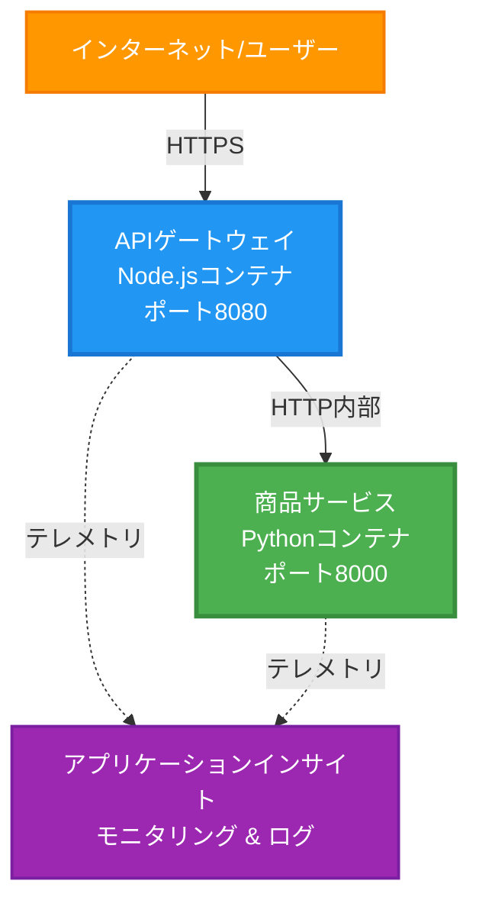
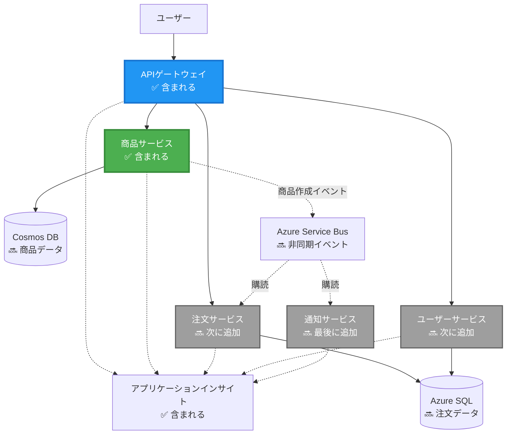
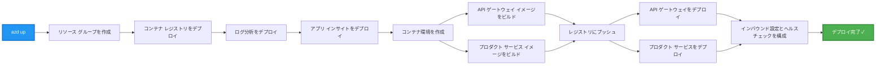
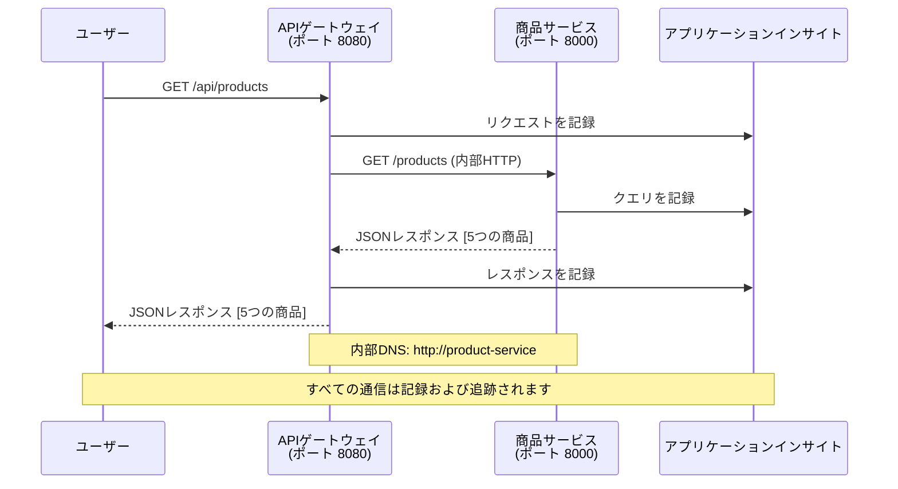

# マイクロサービスアーキテクチャ - コンテナアプリの例

⏱️ **所要時間の目安**: 25-35分 | 💰 **推定コスト**: ~$50-100/月 | ⭐ **難易度**: 上級

**📚 学習パス:**
- ← 前: [シンプルなFlask API](../../../../examples/container-app/simple-flask-api) - 単一コンテナの基礎
- 🎯 **現在地**: マイクロサービスアーキテクチャ (2サービスの基盤)
- → 次: [AI統合](../../../../docs/ai-foundry) - サービスにインテリジェンスを追加
- 🏠 [コースホーム](../../README.md)

---

**簡略化されつつも実用的な**マイクロサービスアーキテクチャを、AZD CLIを使用してAzure Container Appsにデプロイします。この例では、サービス間通信、コンテナオーケストレーション、モニタリングを実践的な2サービス構成で示します。

> **📚 学習アプローチ**: この例は、実際にデプロイして学べる最小限の2サービスアーキテクチャ（APIゲートウェイ + バックエンドサービス）から始めます。この基盤を習得した後、完全なマイクロサービスエコシステムへの拡張ガイドを提供します。

## 学べること

この例を完了することで、以下を学べます:
- 複数のコンテナをAzure Container Appsにデプロイする
- 内部ネットワーキングを使用したサービス間通信を実装する
- 環境ベースのスケーリングとヘルスチェックを設定する
- Application Insightsを使用して分散アプリケーションをモニタリングする
- マイクロサービスのデプロイパターンとベストプラクティスを理解する
- シンプルなアーキテクチャから複雑なアーキテクチャへの段階的な拡張を学ぶ

## アーキテクチャ

### フェーズ1: 構築するもの（この例に含まれる）


**コンポーネントの詳細:**

| コンポーネント | 目的 | アクセス | リソース |
|-----------|---------|--------|-----------|
| **APIゲートウェイ** | 外部リクエストをバックエンドサービスにルーティング | 公開 (HTTPS) | 1 vCPU, 2GB RAM, 2-20レプリカ |
| **プロダクトサービス** | メモリ内データで製品カタログを管理 | 内部のみ | 0.5 vCPU, 1GB RAM, 1-10レプリカ |
| **Application Insights** | 集中ログと分散トレース | Azureポータル | 1-2 GB/月のデータ取り込み |

**なぜシンプルに始めるのか？**
- ✅ 短時間でデプロイして理解できる (25-35分)
- ✅ 複雑さを排除してマイクロサービスの基本パターンを学べる
- ✅ 実験やカスタマイズが可能な動作するコード
- ✅ 学習コストが低い (~$50-100/月 vs $300-1400/月)
- ✅ データベースやメッセージキューを追加する前に自信をつける

**例え**: 運転を学ぶのと同じです。最初は空の駐車場（2サービス）で基本を習得し、その後都市の交通（5+サービスとデータベース）に進みます。

### フェーズ2: 将来の拡張（リファレンスアーキテクチャ）

2サービスアーキテクチャを習得したら、以下に拡張できます:


「拡張ガイド」セクションでステップバイステップの手順を確認してください。

## 含まれる機能

✅ **サービスディスカバリー**: コンテナ間の自動DNSベースのディスカバリー  
✅ **ロードバランシング**: レプリカ間の組み込みロードバランシング  
✅ **オートスケーリング**: HTTPリクエストに基づくサービスごとの独立スケーリング  
✅ **ヘルスモニタリング**: 両サービスのライブネスとレディネスプローブ  
✅ **分散ログ**: Application Insightsによる集中ログ  
✅ **内部ネットワーキング**: 安全なサービス間通信  
✅ **コンテナオーケストレーション**: 自動デプロイとスケーリング  
✅ **ゼロダウンタイム更新**: リビジョン管理によるローリングアップデート  

## 前提条件

### 必要なツール

開始する前に、以下のツールがインストールされていることを確認してください:

1. **[Azure Developer CLI (azd)](https://learn.microsoft.com/azure/developer/azure-developer-cli/install-azd)** (バージョン1.0.0以上)
   ```bash
   azd version
   # 期待される出力: azd バージョン 1.0.0 以上
   ```

2. **[Azure CLI](https://learn.microsoft.com/cli/azure/install-azure-cli)** (バージョン2.50.0以上)
   ```bash
   az --version
   # 期待される出力: azure-cli 2.50.0以上
   ```

3. **[Docker](https://www.docker.com/get-started)** (ローカル開発/テスト用 - オプション)
   ```bash
   docker --version
   # 期待される出力: Dockerバージョン20.10以上
   ```

### セットアップの確認

以下のコマンドを実行して準備が整っていることを確認してください:

```bash
# Azure Developer CLI を確認する
azd version
# ✅ 期待値: azd バージョン 1.0.0 以上

# Azure CLI を確認する
az --version
# ✅ 期待値: azure-cli 2.50.0 以上

# Docker を確認する (オプション)
docker --version
# ✅ 期待値: Docker バージョン 20.10 以上
```

**成功基準**: すべてのコマンドが最低バージョン以上のバージョン番号を返すこと。

### Azureの要件

- 有効な**Azureサブスクリプション** ([無料アカウントを作成](https://azure.microsoft.com/free/))
- サブスクリプション内でリソースを作成する権限
- サブスクリプションまたはリソースグループでの**共同作成者**ロール

### 知識の前提条件

これは**上級レベル**の例です。以下を理解している必要があります:
- [シンプルなFlask APIの例](../../../../examples/container-app/simple-flask-api)を完了している
- マイクロサービスアーキテクチャの基本的な理解
- REST APIとHTTPの基本的な知識
- コンテナの概念の理解

**Container Appsが初めてですか？** まず[シンプルなFlask APIの例](../../../../examples/container-app/simple-flask-api)から始めて基本を学びましょう。

## クイックスタート（ステップバイステップ）

### ステップ1: クローンと移動

```bash
git clone https://github.com/microsoft/AZD-for-beginners.git
cd AZD-for-beginners/examples/microservices
```

**✓ 成功確認**: `azure.yaml`が表示されることを確認してください:
```bash
ls
# 期待される: README.md, azure.yaml, infra/, src/
```

### ステップ2: Azureで認証

```bash
azd auth login
```

これにより、Azure認証用のブラウザが開きます。Azureの資格情報でサインインしてください。

**✓ 成功確認**: 以下が表示されるはずです:
```
Logged in to Azure.
```

### ステップ3: 環境の初期化

```bash
azd init
```

**表示されるプロンプト**:
- **環境名**: 短い名前を入力（例: `microservices-dev`）
- **Azureサブスクリプション**: サブスクリプションを選択
- **Azureロケーション**: リージョンを選択（例: `eastus`, `westeurope`）

**✓ 成功確認**: 以下が表示されるはずです:
```
SUCCESS: New project initialized!
```

### ステップ4: インフラとサービスのデプロイ

```bash
azd up
```

**実行内容**（8-12分かかります）:


**✓ 成功確認**: 以下が表示されるはずです:
```
SUCCESS: Your application was deployed to Azure in X minutes Y seconds.
Endpoint: https://api-gateway-<unique-id>.azurecontainerapps.io
```

**⏱️ 時間**: 8-12分

### ステップ5: デプロイのテスト

```bash
# ゲートウェイエンドポイントを取得する
GATEWAY_URL=$(azd env get-values | grep API_GATEWAY_URL | cut -d '=' -f2 | tr -d '"')

# APIゲートウェイのヘルスをテストする
curl $GATEWAY_URL/health
```

**✅ 期待される出力:**
```json
{
  "status": "healthy",
  "service": "api-gateway",
  "timestamp": "2025-11-19T10:30:00Z"
}
```

**ゲートウェイ経由でプロダクトサービスをテスト**:
```bash
# 製品を一覧表示
curl $GATEWAY_URL/api/products
```

**✅ 期待される出力:**
```json
[
  {"id":1,"name":"Laptop","price":999.99,"stock":50},
  {"id":2,"name":"Mouse","price":29.99,"stock":200},
  {"id":3,"name":"Keyboard","price":79.99,"stock":150}
]
```

**✓ 成功確認**: 両方のエンドポイントがエラーなしでJSONデータを返すこと。

---

**🎉 おめでとうございます！** Azureにマイクロサービスアーキテクチャをデプロイしました！

## プロジェクト構造

すべての実装ファイルが含まれています—これは完全で動作する例です:

```
microservices/
│
├── README.md                         # This file
├── azure.yaml                        # AZD configuration
├── .gitignore                        # Git ignore patterns
│
├── infra/                           # Infrastructure as Code (Bicep)
│   ├── main.bicep                   # Main orchestration
│   ├── abbreviations.json           # Naming conventions
│   ├── core/                        # Shared infrastructure
│   │   ├── container-apps-environment.bicep  # Container environment + registry
│   │   └── monitor.bicep            # Application Insights + Log Analytics
│   └── app/                         # Service definitions
│       ├── api-gateway.bicep        # API Gateway container app
│       └── product-service.bicep    # Product Service container app
│
└── src/                             # Application source code
    ├── api-gateway/                 # Node.js API Gateway
    │   ├── app.js                   # Express server with routing
    │   ├── package.json             # Node dependencies
    │   └── Dockerfile               # Container definition
    └── product-service/             # Python Product Service
        ├── main.py                  # Flask API with product data
        ├── requirements.txt         # Python dependencies
        └── Dockerfile               # Container definition
```

**各コンポーネントの役割:**

**インフラストラクチャ (infra/)**:
- `main.bicep`: すべてのAzureリソースとその依存関係をオーケストレーション
- `core/container-apps-environment.bicep`: Container Apps環境とAzure Container Registryを作成
- `core/monitor.bicep`: 分散ログ用のApplication Insightsを設定
- `app/*.bicep`: スケーリングとヘルスチェックを含む個々のコンテナアプリ定義

**APIゲートウェイ (src/api-gateway/)**:
- 外部向けサービスで、リクエストをバックエンドサービスにルーティング
- ログ、エラーハンドリング、リクエスト転送を実装
- サービス間のHTTP通信を示す

**プロダクトサービス (src/product-service/)**:
- メモリ内の製品カタログを持つ内部サービス
- ヘルスチェック付きのREST API
- バックエンドマイクロサービスパターンの例

## サービス概要

### APIゲートウェイ (Node.js/Express)

**ポート**: 8080  
**アクセス**: 公開 (外部イングレス)  
**目的**: 入ってくるリクエストを適切なバックエンドサービスにルーティング  

**エンドポイント**:
- `GET /` - サービス情報
- `GET /health` - ヘルスチェックエンドポイント
- `GET /api/products` - プロダクトサービスに転送（全リスト）
- `GET /api/products/:id` - プロダクトサービスに転送（IDで取得）

**主な機能**:
- axiosを使用したリクエストルーティング
- 集中ログ
- エラーハンドリングとタイムアウト管理
- 環境変数を介したサービスディスカバリー
- Application Insights統合

**コードハイライト** (`src/api-gateway/app.js`):
```javascript
// 内部サービス通信
app.get('/api/products', async (req, res) => {
  const response = await axios.get(`${PRODUCT_SERVICE_URL}/products`, {
    timeout: 5000
  });
  res.json(response.data);
});
```

### プロダクトサービス (Python/Flask)

**ポート**: 8000  
**アクセス**: 内部のみ (外部イングレスなし)  
**目的**: メモリ内データで製品カタログを管理  

**エンドポイント**:
- `GET /` - サービス情報
- `GET /health` - ヘルスチェックエンドポイント
- `GET /products` - 全製品をリスト
- `GET /products/<id>` - IDで製品を取得

**主な機能**:
- Flaskを使用したRESTful API
- メモリ内の製品ストア（シンプルでデータベース不要）
- プローブを使用したヘルスモニタリング
- 構造化ログ
- Application Insights統合

**データモデル**:
```python
{
  "id": 1,
  "name": "Laptop",
  "description": "High-performance laptop",
  "price": 999.99,
  "stock": 50
}
```

**なぜ内部のみなのか？**
プロダクトサービスは公開されていません。すべてのリクエストはAPIゲートウェイを通過する必要があります。これにより:
- セキュリティ: 制御されたアクセスポイント
- 柔軟性: クライアントに影響を与えずにバックエンドを変更可能
- モニタリング: 集中リクエストログ

## サービス間通信の理解

### サービス同士の通信方法


この例では、APIゲートウェイが**内部HTTPコール**を使用してプロダクトサービスと通信します:

```javascript
// APIゲートウェイ (src/api-gateway/app.js)
const PRODUCT_SERVICE_URL = process.env.PRODUCT_SERVICE_URL;

// 内部HTTPリクエストを作成する
const response = await axios.get(`${PRODUCT_SERVICE_URL}/products`);
```

**主なポイント**:

1. **DNSベースのディスカバリー**: Container Appsは内部サービス用のDNSを自動的に提供
   - プロダクトサービスFQDN: `product-service.internal.<environment>.azurecontainerapps.io`
   - 簡略化: `http://product-service`（Container Appsが解決）

2. **公開されない**: プロダクトサービスはBicepで`external: false`に設定
   - Container Apps環境内でのみアクセス可能
   - インターネットからは到達不可

3. **環境変数**: サービスURLはデプロイ時に注入
   - Bicepが内部FQDNをゲートウェイに渡す
   - アプリケーションコードにハードコードされたURLはなし

**例え**: これはオフィスの部屋のようなものです。APIゲートウェイは受付（公開）、プロダクトサービスはオフィスの部屋（内部のみ）。訪問者は受付を通じてしか部屋にアクセスできません。

## デプロイオプション

### フルデプロイ（推奨）

```bash
# インフラストラクチャと両方のサービスをデプロイする
azd up
```

これにより以下がデプロイされます:
1. Container Apps環境
2. Application Insights
3. Container Registry
4. APIゲートウェイコンテナ
5. プロダクトサービスコンテナ

**時間**: 8-12分

### 個別サービスのデプロイ

```bash
# 初期のazd upの後に1つのサービスのみをデプロイする
azd deploy api-gateway

# または製品サービスをデプロイする
azd deploy product-service
```

**使用例**: 1つのサービスのコードを更新し、そのサービスのみを再デプロイしたい場合。

### 設定の更新

```bash
# スケーリングパラメータを変更する
azd env set GATEWAY_MAX_REPLICAS 30

# 新しい構成で再デプロイする
azd up
```

## 設定

### スケーリング設定

両サービスはBicepファイルでHTTPベースのオートスケーリングが設定されています:

**APIゲートウェイ**:
- 最小レプリカ: 2（可用性のため常に2以上）
- 最大レプリカ: 20
- スケールトリガー: レプリカごとに50の同時リクエスト

**プロダクトサービス**:
- 最小レプリカ: 1（必要に応じてゼロまでスケール可能）
- 最大レプリカ: 10
- スケールトリガー: レプリカごとに100の同時リクエスト

**スケーリングのカスタマイズ** (`infra/app/*.bicep`内):
```bicep
scale: {
  minReplicas: 1
  maxReplicas: 10
  rules: [
    {
      name: 'http-scale-rule'
      http: {
        metadata: {
          concurrentRequests: '100'  // Adjust this
        }
      }
    }
  ]
}
```

### リソース割り当て

**APIゲートウェイ**:
- CPU: 1.0 vCPU
- メモリ: 2 GiB
- 理由: すべての外部トラフィックを処理

**プロダクトサービス**:
- CPU: 0.5 vCPU
- メモリ: 1 GiB
- 理由: 軽量なメモリ内操作

### ヘルスチェック

両サービスにはライブネスとレディネスプローブが含まれています:

```bicep
probes: [
  {
    type: 'Liveness'
    httpGet: {
      path: '/health'
      port: 8080
    }
    initialDelaySeconds: 10
    periodSeconds: 30
  }
  {
    type: 'Readiness'
    httpGet: {
      path: '/health'
      port: 8080
    }
    initialDelaySeconds: 5
    periodSeconds: 10
  }
]
```

**これが意味すること**:
- **ライブネス**: ヘルスチェックが失敗すると、Container Appsがコンテナを再起動
- **レディネス**: 準備ができていない場合、Container Appsはそのレプリカへのトラフィックを停止

## モニタリングと可観測性

### サービスログの表示

```bash
# API Gatewayからログをストリームする
azd logs api-gateway --follow

# 最近の製品サービスのログを表示する
azd logs product-service --tail 100

# 両方のサービスからすべてのログを表示する
azd logs --follow
```

**期待される出力**:
```
[api-gateway] API Gateway listening on port 8080
[api-gateway] Product Service URL: http://product-service
[api-gateway] GET /api/products 200 - 45ms
[product-service] Retrieved 5 products
```

### Application Insightsクエリ

AzureポータルでApplication Insightsにアクセスし、以下のクエリを実行:

**遅いリクエストを見つける**:
```kusto
requests
| where timestamp > ago(1h)
| where duration > 1000  // Requests taking >1 second
| summarize count() by name, cloud_RoleName
| order by count_ desc
```

**サービス間の呼び出しを追跡**:
```kusto
dependencies
| where timestamp > ago(1h)
| where type == "Http"
| project timestamp, name, target, duration, success
| order by timestamp desc
```

**サービスごとのエラー率**:
```kusto
exceptions
| where timestamp > ago(24h)
| summarize errorCount = count() by cloud_RoleName, type
| order by errorCount desc
```

**時間ごとのリクエスト量**:
```kusto
requests
| where timestamp > ago(1h)
| summarize requestCount = count() by bin(timestamp, 5m), cloud_RoleName
| render timechart
```

### モニタリングダッシュボードへのアクセス

```bash
# アプリケーションインサイトの詳細を取得する
azd env get-values | grep APPLICATIONINSIGHTS

# Azureポータルのモニタリングを開く
az monitor app-insights component show \
  --app $(azd env get-values | grep APPLICATIONINSIGHTS_CONNECTION_STRING | cut -d '=' -f2) \
  --resource-group $(azd env get-values | grep AZURE_RESOURCE_GROUP | cut -d '=' -f2) \
  --query "appId" -o tsv
```

### ライブメトリクス

1. AzureポータルでApplication Insightsに移動
2. 「ライブメトリクス」をクリック
3. リアルタイムのリクエスト、失敗、パフォーマンスを確認
4. 以下を実行してテスト: `curl $(azd env get-values | grep API_GATEWAY_URL | cut -d '=' -f2 | tr -d '"')/api/products`

## 実践的な演習

### 演習1: 新しいプロダクトエンドポイントを追加 ⭐ (簡単)

**目標**: 新しい製品を作成するPOSTエンドポイントを追加

**開始地点**: `src/product-service/main.py`

**手順**:

1. `main.py`の`get_product`関数の後に以下のエンドポイントを追加:

```python
@app.route('/products', methods=['POST'])
def create_product():
    """Create a new product"""
    data = request.get_json()
    
    # 必須フィールドを検証する
    if not data or 'name' not in data or 'price' not in data:
        return jsonify({'error': 'Missing required fields: name, price'}), 400
    
    new_id = max(p['id'] for p in products) + 1
    new_product = {
        'id': new_id,
        'name': data['name'],
        'description': data.get('description', ''),
        'price': float(data['price']),
        'stock': int(data.get('stock', 0))
    }
    products.append(new_product)
    logger.info(f"Created product {new_id}")
    return jsonify(new_product), 201
```

2. APIゲートウェイにPOSTルートを追加 (`src/api-gateway/app.js`):

```javascript
// これを GET /api/products ルートの後に追加してください
app.post('/api/products', async (req, res) => {
  try {
    console.log(`Forwarding POST request to ${PRODUCT_SERVICE_URL}/products`);
    const response = await axios.post(`${PRODUCT_SERVICE_URL}/products`, req.body, {
      timeout: 5000
    });
    res.status(201).json(response.data);
  } catch (error) {
    console.error('Error calling product service:', error.message);
    res.status(503).json({
      error: 'Product service unavailable',
      message: error.message
    });
  }
});
```

3. 両方のサービスを再デプロイします:

```bash
azd deploy product-service
azd deploy api-gateway
```

4. 新しいエンドポイントをテストします:

```bash
GATEWAY_URL=$(azd env get-values | grep API_GATEWAY_URL | cut -d '=' -f2 | tr -d '"')

# 新しい製品を作成する
curl -X POST $GATEWAY_URL/api/products \
  -H "Content-Type: application/json" \
  -d '{"name":"USB Cable","price":9.99,"stock":500}'
```

**✅ 期待される出力:**
```json
{"id":6,"name":"USB Cable","description":"","price":9.99,"stock":500}
```

5. リストに表示されることを確認します:

```bash
curl $GATEWAY_URL/api/products
# 現在、新しいUSBケーブルを含む6つの製品が表示されるはずです
```

**成功基準**:
- ✅ POSTリクエストがHTTP 201を返す
- ✅ 新しい商品がGET /api/productsリストに表示される
- ✅ 商品に自動インクリメントされたIDが付与される

**所要時間**: 10～15分

---

### 演習 2: オートスケーリングルールの変更 ⭐⭐ (中級)

**目標**: Product Serviceをより積極的にスケールするよう変更する

**開始地点**: `infra/app/product-service.bicep`

**手順**:

1. `infra/app/product-service.bicep`を開き、`scale`ブロックを探します (約95行目付近)

2. 以下を変更します:
```bicep
scale: {
  minReplicas: 1
  maxReplicas: 10
  rules: [
    {
      name: 'http-scale-rule'
      http: {
        metadata: {
          concurrentRequests: '100'  // OLD
        }
      }
    }
  ]
}
```

から:
```bicep
scale: {
  minReplicas: 2  // Always have 2 running
  maxReplicas: 20  // Allow more scaling
  rules: [
    {
      name: 'http-scale-rule'
      http: {
        metadata: {
          concurrentRequests: '20'  // Scale at lower threshold
        }
      }
    }
  ]
}
```

3. インフラを再デプロイします:

```bash
azd up
```

4. 新しいスケーリング設定を確認します:

```bash
az containerapp show \
  --name $(azd env get-values | grep PRODUCT_SERVICE | head -1 | cut -d '/' -f5) \
  --resource-group $(azd env get-values | grep AZURE_RESOURCE_GROUP | cut -d '=' -f2 | tr -d '"') \
  --query "properties.template.scale" -o json
```

**✅ 期待される出力:**
```json
{
  "minReplicas": 2,
  "maxReplicas": 20,
  "rules": [...]
}
```

5. 負荷をかけてオートスケーリングをテストします:

```bash
# 同時リクエストを生成する
for i in {1..500}; do curl $GATEWAY_URL/api/products & done

# スケーリングが発生するのを監視する
azd logs product-service --follow
# 次を探す: コンテナアプリのスケーリングイベント
```

**成功基準**:
- ✅ Product Serviceが常に最低2つのレプリカで稼働する
- ✅ 負荷がかかると2つ以上のレプリカにスケールする
- ✅ Azure Portalで新しいスケーリングルールが表示される

**所要時間**: 15～20分

---

### 演習 3: カスタムモニタリングクエリの追加 ⭐⭐ (中級)

**目標**: Product APIのパフォーマンスを追跡するカスタムApplication Insightsクエリを作成する

**手順**:

1. Azure PortalでApplication Insightsに移動します:
   - Azure Portalにアクセス
   - リソースグループ (rg-microservices-*) を見つける
   - Application Insightsリソースをクリック

2. 左メニューの「ログ」をクリック

3. 以下のクエリを作成します:

```kusto
requests
| where timestamp > ago(1h)
| where name contains "products"
| summarize 
    RequestCount = count(),
    AvgDuration = avg(duration),
    P95Duration = percentile(duration, 95),
    SuccessRate = 100.0 * countif(success == true) / count()
  by bin(timestamp, 5m)
| render timechart
```

4. 「実行」をクリックしてクエリを実行します

5. クエリを保存します:
   - 「保存」をクリック
   - 名前: "Product API Performance"
   - カテゴリ: "Performance"

6. テストトラフィックを生成します:

```bash
for i in {1..100}; do curl $GATEWAY_URL/api/products; sleep 1; done
```

7. クエリを更新してデータを確認します

**✅ 期待される出力:**
- 時間ごとのリクエスト数を示すチャート
- 平均応答時間 < 500ms
- 成功率 = 100%
- 5分間隔のタイムビン

**成功基準**:
- ✅ クエリが100件以上のリクエストを表示する
- ✅ 成功率が100%である
- ✅ 平均応答時間が500ms未満である
- ✅ チャートが5分間隔のタイムビンを表示する

**学習成果**: カスタムクエリを使用してサービスのパフォーマンスをモニタリングする方法を理解する

**所要時間**: 10～15分

---

### 演習 4: リトライロジックの実装 ⭐⭐⭐ (上級)

**目標**: Product Serviceが一時的に利用できない場合にAPI Gatewayにリトライロジックを追加する

**開始地点**: `src/api-gateway/app.js`

**手順**:

1. リトライライブラリをインストールします:

```bash
cd src/api-gateway
npm install axios-retry --save
cd ../..
```

2. `src/api-gateway/app.js`を更新します (axiosインポートの後に追加):

```javascript
const axiosRetry = require('axios-retry');

// リトライロジックを設定する
axiosRetry(axios, {
  retries: 3,
  retryDelay: (retryCount) => {
    return retryCount * 1000; // 1秒、2秒、3秒
  },
  retryCondition: (error) => {
    // ネットワークエラーまたは5xxレスポンスでリトライする
    return axiosRetry.isNetworkOrIdempotentRequestError(error) ||
           (error.response && error.response.status >= 500);
  }
});

console.log('Retry logic configured: 3 retries with exponential backoff');
```

3. API Gatewayを再デプロイします:

```bash
azd deploy api-gateway
```

4. サービス障害をシミュレーションしてリトライ動作をテストします:

```bash
# 製品サービスを0にスケールする（障害をシミュレート）
az containerapp update \
  --name $(azd env get-values | grep PRODUCT_SERVICE | head -1 | cut -d '/' -f5) \
  --resource-group $(azd env get-values | grep AZURE_RESOURCE_GROUP | cut -d '=' -f2 | tr -d '"') \
  --min-replicas 0 \
  --max-replicas 0

# 製品にアクセスしようとする（3回リトライする）
time curl -v $GATEWAY_URL/api/products
# 観察: 応答に約6秒かかる（1秒 + 2秒 + 3秒のリトライ）

# 製品サービスを復元する
az containerapp update \
  --name $(azd env get-values | grep PRODUCT_SERVICE | head -1 | cut -d '/' -f5) \
  --resource-group $(azd env get-values | grep AZURE_RESOURCE_GROUP | cut -d '=' -f2 | tr -d '"') \
  --min-replicas 1 \
  --max-replicas 10
```

5. リトライログを確認します:

```bash
azd logs api-gateway --tail 50
# 再試行試行メッセージを探す
```

**✅ 期待される動作:**
- リクエストが失敗する前に3回リトライされる
- 各リトライで待機時間が長くなる (1秒、2秒、3秒)
- サービス再起動後にリクエストが成功する
- ログにリトライ試行が表示される

**成功基準**:
- ✅ リクエストが失敗する前に3回リトライされる
- ✅ 各リトライで待機時間が長くなる (指数バックオフ)
- ✅ サービス再起動後にリクエストが成功する
- ✅ ログにリトライ試行が表示される

**学習成果**: マイクロサービスのレジリエンスパターン (サーキットブレーカー、リトライ、タイムアウト) を理解する

**所要時間**: 20～25分

---

## 知識チェックポイント

この例を完了した後、以下を確認してください:

### 1. サービス間通信 ✓

知識をテスト:
- [ ] API GatewayがProduct Serviceをどのように発見するか説明できますか? (DNSベースのサービス発見)
- [ ] Product Serviceがダウンした場合どうなりますか? (Gatewayが503エラーを返す)
- [ ] 第三のサービスを追加するにはどうすればよいですか? (新しいBicepファイルを作成し、main.bicepに追加、srcフォルダを作成)

**実践的な確認**:
```bash
# サービス障害をシミュレートする
az containerapp update --name <product-service-name> --min-replicas 0 --max-replicas 0
curl $GATEWAY_URL/api/products
# ✅ 期待値: 503 サービス利用不可

# サービスを復元する
az containerapp update --name <product-service-name> --min-replicas 1 --max-replicas 10
```

### 2. モニタリングと可観測性 ✓

知識をテスト:
- [ ] 分散ログはどこで確認できますか? (Azure PortalのApplication Insights)
- [ ] 遅いリクエストをどのように追跡しますか? (Kustoクエリ: `requests | where duration > 1000`)
- [ ] どのサービスがエラーを引き起こしたか特定できますか? (ログの`cloud_RoleName`フィールドを確認)

**実践的な確認**:
```bash
# 遅いリクエストのシミュレーションを生成する
curl "$GATEWAY_URL/api/products?delay=2000"

# 遅いリクエストをApplication Insightsでクエリする
# Azureポータル → Application Insights → ログに移動する
# 実行: requests | where duration > 1000 | project timestamp, name, duration, cloud_RoleName
```

### 3. スケーリングとパフォーマンス ✓

知識をテスト:
- [ ] オートスケーリングをトリガーする条件は何ですか? (HTTP同時リクエストルール: Gatewayは50、Productは100)
- [ ] 現在何個のレプリカが稼働していますか? (`az containerapp revision list`で確認)
- [ ] Product Serviceを5つのレプリカにスケールするにはどうすればよいですか? (BicepでminReplicasを更新)

**実践的な確認**:
```bash
# オートスケーリングをテストするための負荷を生成する
for i in {1..1000}; do curl $GATEWAY_URL/api/products & done

# レプリカが増加するのを監視する
azd logs api-gateway --follow
# ✅ 期待される結果: ログにスケーリングイベントが表示される
```

**成功基準**: すべての質問に答え、実践的なコマンドで確認できること

---

## コスト分析

### 推定月額コスト (この2サービス例の場合)

| リソース | 設定 | 推定コスト |
|----------|--------------|----------------|
| API Gateway | 2-20レプリカ、1 vCPU、2GB RAM | $30-150 |
| Product Service | 1-10レプリカ、0.5 vCPU、1GB RAM | $15-75 |
| Container Registry | Basic tier | $5 |
| Application Insights | 1-2 GB/月 | $5-10 |
| Log Analytics | 1 GB/月 | $3 |
| **合計** | | **$58-243/月** |

### 使用量別コスト内訳

**軽いトラフィック** (テスト/学習): 約$60/月
- API Gateway: 2レプリカ × 24/7 = $30
- Product Service: 1レプリカ × 24/7 = $15
- モニタリング + レジストリ = $13

**中程度のトラフィック** (小規模プロダクション): 約$120/月
- API Gateway: 平均5レプリカ = $75
- Product Service: 平均3レプリカ = $45
- モニタリング + レジストリ = $13

**高いトラフィック** (繁忙期): 約$240/月
- API Gateway: 平均15レプリカ = $225
- Product Service: 平均8レプリカ = $120
- モニタリング + レジストリ = $13

### コスト削減のヒント

1. **開発用にゼロスケール**:
   ```bicep
   scale: {
     minReplicas: 0  // Save $30-40/month when not in use
     maxReplicas: 10
   }
   ```

2. **Cosmos DBに消費プランを使用** (追加する場合):
   - 使用した分だけ支払う
   - 最低料金なし

3. **Application Insightsのサンプリングを設定**:
   ```javascript
   appInsights.defaultClient.config.samplingPercentage = 50; // リクエストの50％をサンプリングする
   ```

4. **不要なリソースを削除**:
   ```bash
   azd down --force --purge
   ```

### 無料プランオプション

学習/テスト用には以下を検討:
- ✅ Azureの無料クレジットを使用 ($200/最初の30日間、新規アカウント)
- ✅ 最小レプリカに抑える (コストを約50%節約)
- ✅ テスト後に削除 (継続的な料金なし)
- ✅ 学習セッション間でゼロスケール

**例**: この例を1日2時間 × 30日間実行 = 約$5/月 (通常$60/月の代わりに)

---

## トラブルシューティング簡易リファレンス

### 問題: `azd up`が"Subscription not found"で失敗する

**解決策**:
```bash
# 明示的なサブスクリプションで再ログイン
az account set --subscription <your-subscription-id>
azd env set AZURE_SUBSCRIPTION_ID <your-subscription-id>
azd up
```

### 問題: API Gatewayが503 "Product service unavailable"を返す

**診断**:
```bash
# 製品サービスのログを確認する
azd logs product-service --tail 50

# 製品サービスの状態を確認する
az containerapp show \
  --name $(azd env get-values | grep PRODUCT_SERVICE | head -1 | cut -d '/' -f5) \
  --resource-group $(azd env get-values | grep AZURE_RESOURCE_GROUP | cut -d '=' -f2 | tr -d '"') \
  --query "properties.runningStatus"
```

**一般的な原因**:
1. Product Serviceが起動していない (Pythonエラーのログを確認)
2. ヘルスチェックが失敗している (`/health`エンドポイントが動作するか確認)
3. コンテナイメージのビルドが失敗している (レジストリでイメージを確認)

### 問題: オートスケーリングが機能しない

**診断**:
```bash
# 現在のレプリカ数を確認する
az containerapp revision list \
  --name $(azd env get-values | grep API_GATEWAY | head -1 | cut -d '/' -f5) \
  --resource-group $(azd env get-values | grep AZURE_RESOURCE_GROUP | cut -d '=' -f2 | tr -d '"') \
  --query "[].properties.replicas"

# テスト用の負荷を生成する
for i in {1..1000}; do curl $GATEWAY_URL/api/products & done

# スケーリングイベントを監視する
azd logs api-gateway --follow | grep -i scale
```

**一般的な原因**:
1. スケールルールをトリガーする負荷が十分でない (50以上の同時リクエストが必要)
2. 最大レプリカ数に到達している (Bicep設定を確認)
3. Bicepでスケールルールが誤設定されている (concurrentRequests値を確認)

### 問題: Application Insightsがログを表示しない

**診断**:
```bash
# 接続文字列が設定されていることを確認する
azd env get-values | grep APPLICATIONINSIGHTS

# サービスがテレメトリを送信しているか確認する
az monitor app-insights component show \
  --app $(azd env get-values | grep APPLICATIONINSIGHTS_NAME | cut -d '=' -f2 | tr -d '"') \
  --resource-group $(azd env get-values | grep AZURE_RESOURCE_GROUP | cut -d '=' -f2 | tr -d '"') \
  --query "properties.InstrumentationKey"
```

**一般的な原因**:
1. コンテナに接続文字列が渡されていない (環境変数を確認)
2. Application Insights SDKが設定されていない (コード内のインポートを確認)
3. テレメトリをブロックするファイアウォール (稀、ネットワークルールを確認)

### 問題: Dockerのローカルビルドが失敗する

**診断**:
```bash
# APIゲートウェイのビルドをテストする
cd src/api-gateway
docker build -t test-gateway .

# 製品サービスのビルドをテストする
cd ../product-service
docker build -t test-product .
```

**一般的な原因**:
1. package.json/requirements.txtに依存関係が不足している
2. Dockerfileの構文エラー
3. 依存関係のダウンロード中のネットワーク問題

**まだ解決しない場合**: [一般的な問題ガイド](../../docs/troubleshooting/common-issues.md) または [Azure Container Appsトラブルシューティング](https://learn.microsoft.com/azure/container-apps/troubleshooting) を参照

---

## クリーンアップ

継続的な料金を避けるため、すべてのリソースを削除します:

```bash
azd down --force --purge
```

**確認プロンプト**:
```
? Total resources to delete: 6, are you sure you want to continue? (y/N)
```

`y`を入力して確認します。

**削除されるもの**:
- Container Apps Environment
- 両方のContainer Apps (Gateway & Product Service)
- Container Registry
- Application Insights
- Log Analytics Workspace
- Resource Group

**✓ クリーンアップ確認**:
```bash
az group list --query "[?starts_with(name,'rg-microservices')]" --output table
```

空の結果が返されるはずです。

---

## 拡張ガイド: 2サービスから5+サービスへ

この2サービスアーキテクチャを習得したら、以下の方法で拡張できます:

### フェーズ1: データベース永続化の追加 (次のステップ)

**Product ServiceにCosmos DBを追加**:

1. `infra/core/cosmos.bicep`を作成:
   ```bicep
   resource cosmosAccount 'Microsoft.DocumentDB/databaseAccounts@2023-04-15' = {
     name: name
     location: location
     kind: 'GlobalDocumentDB'
     properties: {
       databaseAccountOfferType: 'Standard'
       consistencyPolicy: { defaultConsistencyLevel: 'Session' }
       locations: [{ locationName: location, failoverPriority: 0 }]
     }
   }
   ```

2. Product ServiceをAzure Cosmos DB Python SDKを使用するよう更新 (インメモリデータの代わりに)

3. 推定追加コスト: 約$25/月 (サーバーレス)

### フェーズ2: 第三のサービスを追加 (注文管理)

**Order Serviceを作成**:

1. 新しいフォルダ: `src/order-service/` (Python/Node.js/C#)
2. 新しいBicep: `infra/app/order-service.bicep`
3. API Gatewayを更新して`/api/orders`をルーティング
4. 注文永続化のためにAzure SQL Databaseを追加

**アーキテクチャが以下のようになります**:
```
API Gateway → Product Service (Cosmos DB)
           → Order Service (Azure SQL)
```

### フェーズ3: 非同期通信の追加 (Service Bus)

**イベント駆動型アーキテクチャを実装**:

1. Azure Service Busを追加: `infra/core/servicebus.bicep`
2. Product Serviceが"ProductCreated"イベントを公開
3. Order Serviceが商品イベントを購読
4. Notification Serviceを追加してイベントを処理

**パターン**: リクエスト/レスポンス (HTTP) + イベント駆動型 (Service Bus)

### フェーズ4: ユーザー認証の追加

**User Serviceを実装**:

1. `src/user-service/`を作成 (Go/Node.js)
2. Azure AD B2CまたはカスタムJWT認証を追加
3. API Gatewayがトークンを検証してルーティング
4. サービスがユーザー権限を確認

### フェーズ5: 本番環境の準備

**以下のコンポーネントを追加**:
- ✅ Azure Front Door (グローバルロードバランシング)
- ✅ Azure Key Vault (シークレット管理)
- ✅ Azure Monitor Workbooks (カスタムダッシュボード)
- ✅ CI/CDパイプライン (GitHub Actions)
- ✅ ブルーグリーンデプロイメント
- ✅ 全サービスのManaged Identity

**完全な本番アーキテクチャコスト**: 約$300-1,400/月

---

## 詳細情報

### 関連ドキュメント
- [Azure Container Apps ドキュメント](https://learn.microsoft.com/azure/container-apps/)
- [マイクロサービスアーキテクチャガイド](https://learn.microsoft.com/azure/architecture/guide/architecture-styles/microservices)
- [分散トレーシングのためのApplication Insights](https://learn.microsoft.com/azure/azure-monitor/app/distributed-tracing)
- [Azure Developer CLI ドキュメント](https://learn.microsoft.com/azure/developer/azure-developer-cli/)

### このコースの次のステップ
- ← 前: [シンプルなFlask API](../../../../examples/container-app/simple-flask-api) - 初心者向け単一コンテナ例
- → 次: [AI統合ガイド](../../../../docs/ai-foundry) - AI機能を追加
- 🏠 [コースホーム](../../README.md)

### 比較: どれを使うべきか

| 特徴 | 単一コンテナ | マイクロサービス (今回) | Kubernetes (AKS) |
|---------|-----------------|---------------------|------------------|
| **ユースケース** | シンプルなアプリ | 複雑なアプリ | エンタープライズアプリ |
| **スケーラビリティ** | 単一サービス | サービスごとのスケーリング | 最大の柔軟性 |
| **複雑さ** | 低 | 中 | 高 |
| **チームサイズ** | 1-3人の開発者 | 3-10人の開発者 | 10人以上の開発者 |
| **コスト** | 約$15-50/月 | 約$60-250/月 | 約$150-500/月 |
| **デプロイ時間** | 5-10分 | 8-12分 | 15-30分 |
| **最適な用途** | MVP、プロトタイプ | 本番アプリ | マルチクラウド、高度なネットワーキング |

**推奨事項**: Container Apps（この例）から始め、Kubernetes固有の機能が必要な場合にのみAKSに移行してください。

---

## よくある質問

**Q: なぜ5つ以上ではなく2つのサービスだけなのですか？**  
A: 学習の進行を考慮しています。複雑さを増す前に、シンプルな例で基本（サービス間通信、モニタリング、スケーリング）を習得してください。ここで学ぶパターンは、100サービスのアーキテクチャにも応用できます。

**Q: 自分でサービスを追加できますか？**  
A: もちろんです！上記の拡張ガイドに従ってください。新しいサービスを追加する際は、srcフォルダを作成し、Bicepファイルを作成し、azure.yamlを更新してデプロイするという同じパターンに従います。

**Q: これは本番環境向けですか？**  
A: しっかりした基盤です。本番環境向けには、マネージドID、Key Vault、永続的なデータベース、CI/CDパイプライン、モニタリングアラート、バックアップ戦略を追加してください。

**Q: なぜDaprや他のサービスメッシュを使わないのですか？**  
A: 学習をシンプルに保つためです。Container Appsのネイティブなネットワーキングを理解した後で、Daprを追加して高度なシナリオ（状態管理、pub/sub、バインディング）に対応できます。

**Q: ローカルでデバッグするにはどうすればいいですか？**  
A: Dockerを使ってローカルでサービスを実行してください:  
```bash
cd src/api-gateway
docker build -t local-gateway .
docker run -p 8080:8080 -e PRODUCT_SERVICE_URL=http://localhost:8000 local-gateway
```


**Q: 異なるプログラミング言語を使えますか？**  
A: はい！この例ではNode.js（ゲートウェイ）とPython（商品サービス）を使用していますが、C#、Go、Java、Ruby、PHPなど、コンテナで動作する言語を混在させることができます。

**Q: Azureクレジットがない場合はどうすればいいですか？**  
A: Azureの無料枠を利用してください（新規アカウントは最初の30日間で200ドルのクレジットが付与されます）。または、短期間のテスト用にデプロイしてすぐに削除してください。この例のコストは約2ドル/日です。

**Q: Azure Kubernetes Service (AKS)とはどう違うのですか？**  
A: Container Appsはシンプルで（Kubernetesの知識は不要）、柔軟性は低いですが、AKSは完全なKubernetesの制御が可能で、より高度な専門知識が必要です。まずはContainer Appsから始め、必要に応じてAKSに進んでください。

**Q: 既存のAzureサービスと連携できますか？**  
A: はい！既存のデータベース、ストレージアカウント、Service Busなどに接続できます。新しいリソースを作成する代わりに、既存のリソースを参照するようにBicepファイルを更新してください。

---

> **🎓 学習パスのまとめ**: 自動スケーリング、内部ネットワーキング、集中モニタリング、本番環境向けパターンを備えたマルチサービスアーキテクチャをデプロイする方法を学びました。この基盤は、複雑な分散システムやエンタープライズ向けマイクロサービスアーキテクチャに備えるものです。

**📚 コースナビゲーション:**
- ← 前: [シンプルなFlask API](../../../../examples/container-app/simple-flask-api)
- → 次: [データベース統合の例](../../../../database-app)
- 🏠 [コースホーム](../../README.md)
- 📖 [Container Appsのベストプラクティス](../../docs/deployment/deployment-guide.md)

---

**✨ おめでとうございます！** マイクロサービスの例を完了しました。Azure Container Apps上で分散アプリケーションを構築、デプロイ、モニタリングする方法を理解しました。AI機能を追加する準備はできましたか？[AI統合ガイド](../../../../docs/ai-foundry)をご覧ください！

---

<!-- CO-OP TRANSLATOR DISCLAIMER START -->
**免責事項**:  
この文書は、AI翻訳サービス[Co-op Translator](https://github.com/Azure/co-op-translator)を使用して翻訳されています。正確性を期すよう努めておりますが、自動翻訳には誤りや不正確さが含まれる可能性があります。原文（元の言語で記載された文書）を公式な情報源としてご参照ください。重要な情報については、専門の人間による翻訳をお勧めします。本翻訳の使用に起因する誤解や誤認について、当方は一切の責任を負いかねます。
<!-- CO-OP TRANSLATOR DISCLAIMER END -->