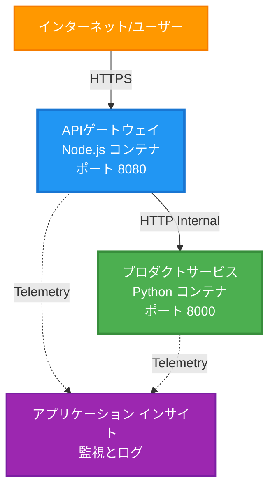
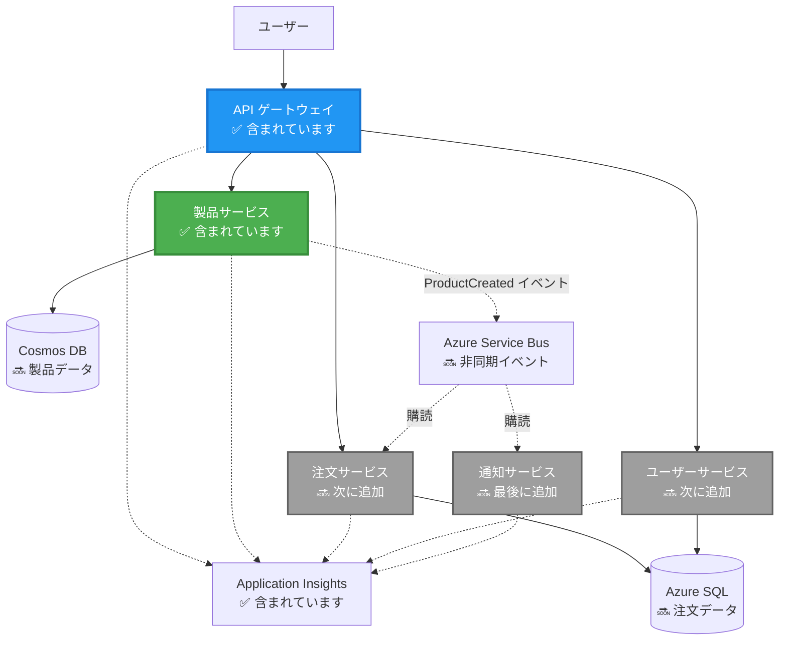
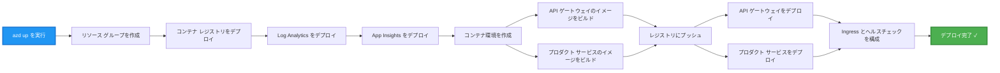
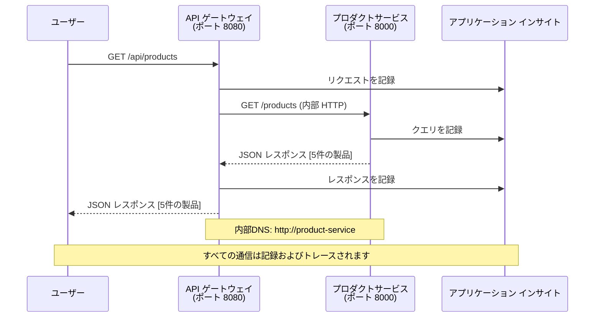

# マイクロサービスアーキテクチャ - Container App の例

⏱️ **推定時間**: 25-35 分 | 💰 **推定費用**: ~$50-100/月 | ⭐ **複雑さ**: 上級

**📚 学習パス:**
- ← Previous: [シンプルな Flask API](../../../../examples/container-app/simple-flask-api) - 単一コンテナの基本
- 🎯 **You Are Here**: マイクロサービスアーキテクチャ（2サービスの基盤）
- → Next: [AI 統合](../../../../docs/ai-foundry) - サービスにインテリジェンスを追加する
- 🏠 [コースホーム](../../README.md)

---

A **簡素だが実用的な**マイクロサービスアーキテクチャを AZD CLI を使用して Azure Container Apps にデプロイします。この例は、実践的な 2 サービス構成を用いてサービス間通信、コンテナオーケストレーション、および監視を示します。

> **📚 学習アプローチ**: この例は、実際にデプロイして学習できる最小限の 2 サービスアーキテクチャ（API Gateway + Backend Service）から始めます。この基礎を習得した後、完全なマイクロサービスエコシステムに拡張するためのガイダンスを提供します。

## 学習内容

この例を完了することで、次のことが学べます:
- 複数のコンテナを Azure Container Apps にデプロイする
- 内部ネットワーキングによるサービス間通信を実装する
- 環境ベースのスケーリングとヘルスチェックを構成する
- Application Insights による分散アプリケーションの監視
- マイクロサービスのデプロイパターンとベストプラクティスの理解
- シンプルなアーキテクチャから複雑なアーキテクチャへの段階的な拡張方法

## アーキテクチャ

### フェーズ 1: 作成するもの（この例に含まれる）


```mermaid
graph TB
    Internet[インターネット/ユーザー]
    Gateway[APIゲートウェイ<br/>Node.js コンテナ<br/>ポート 8080]
    Product[プロダクトサービス<br/>Python コンテナ<br/>ポート 8000]
    AppInsights[アプリケーション インサイト<br/>監視とログ]
    
    Internet -->|HTTPS| Gateway
    Gateway -->|HTTP Internal| Product
    Gateway -.->|Telemetry| AppInsights
    Product -.->|Telemetry| AppInsights
    
    style Gateway fill:#2196F3,stroke:#1976D2,stroke-width:3px,color:#fff
    style Product fill:#4CAF50,stroke:#388E3C,stroke-width:3px,color:#fff
    style Internet fill:#FF9800,stroke:#F57C00,stroke-width:2px,color:#fff
    style AppInsights fill:#9C27B0,stroke:#7B1FA2,stroke-width:2px,color:#fff
```
**コンポーネント詳細:**

| コンポーネント | 目的 | アクセス | リソース |
|-----------|---------|--------|-----------|
| **API Gateway** | 外部リクエストをバックエンドサービスにルーティング | 公開（HTTPS） | 1 vCPU、2GB RAM、2-20 レプリカ |
| **Product Service** | インメモリデータで製品カタログを管理 | 内部のみ | 0.5 vCPU、1GB RAM、1-10 レプリカ |
| **Application Insights** | 集中ログ収集と分散トレーシング | Azure ポータル | 1-2 GB/月のデータ取り込み |

**なぜシンプルに始めるのか？**
- ✅ すばやくデプロイして理解できる（25-35 分）
- ✅ 複雑さを排してコアなマイクロサービスパターンを学べる
- ✅ 変更して試せる動作するコードがある
- ✅ 学習コストが低い（約 $50-100/月 vs $300-1400/月）
- ✅ データベースやメッセージキューを追加する前に自信を構築できる

**例え**: これは運転を学ぶようなものです。空の駐車場（2サービス）から始めて基礎を習得し、次に市街地の交通（データベースを含む5以上のサービス）に進みます。

### フェーズ 2: 将来の拡張（参照アーキテクチャ）


```mermaid
graph TB
    User[ユーザー]
    Gateway[API ゲートウェイ<br/>✅ 含まれています]
    Product[製品サービス<br/>✅ 含まれています]
    Order[注文サービス<br/>🔜 次に追加]
    UserSvc[ユーザーサービス<br/>🔜 次に追加]
    Notify[通知サービス<br/>🔜 最後に追加]
    
    CosmosDB[(Cosmos DB<br/>🔜 製品データ)]
    AzureSQL[(Azure SQL<br/>🔜 注文データ)]
    ServiceBus[Azure Service Bus<br/>🔜 非同期イベント]
    AppInsights[Application Insights<br/>✅ 含まれています]
    
    User --> Gateway
    Gateway --> Product
    Gateway --> Order
    Gateway --> UserSvc
    
    Product --> CosmosDB
    Order --> AzureSQL
    UserSvc --> AzureSQL
    
    Product -.->|ProductCreated イベント| ServiceBus
    ServiceBus -.->|購読| Notify
    ServiceBus -.->|購読| Order
    
    Gateway -.-> AppInsights
    Product -.-> AppInsights
    Order -.-> AppInsights
    UserSvc -.-> AppInsights
    Notify -.-> AppInsights
    
    style Product fill:#4CAF50,stroke:#388E3C,stroke-width:3px,color:#fff
    style Gateway fill:#2196F3,stroke:#1976D2,stroke-width:3px,color:#fff
    style Order fill:#9E9E9E,stroke:#616161,stroke-width:2px,color:#fff
    style UserSvc fill:#9E9E9E,stroke:#616161,stroke-width:2px,color:#fff
    style Notify fill:#9E9E9E,stroke:#616161,stroke-width:2px,color:#fff
```
詳細な手順についてはドキュメント末尾の「拡張ガイド」セクションを参照してください。

## 含まれる機能

✅ **サービスディスカバリ**: コンテナ間の自動 DNS ベースの検出  
✅ **ロードバランシング**: レプリカ間の組み込みロードバランシング  
✅ **自動スケーリング**: HTTP リクエストに基づくサービスごとの独立したスケーリング  
✅ **ヘルスモニタリング**: 両サービスの liveness および readiness プローブ  
✅ **分散ログ**: Application Insights による集中ログ収集  
✅ **内部ネットワーキング**: 安全なサービス間通信  
✅ **コンテナオーケストレーション**: 自動デプロイとスケーリング  
✅ **ゼロダウンタイム更新**: リビジョン管理によるローリングアップデート  

## 前提条件

### 必要なツール

開始する前に、これらのツールがインストールされていることを確認してください:

1. **[Azure Developer CLI (azd)](https://learn.microsoft.com/azure/developer/azure-developer-cli/install-azd)**（バージョン 1.0.0 以上）
   ```bash
   azd version
   # 期待される出力: azd バージョン 1.0.0 以上
   ```

2. **[Azure CLI](https://learn.microsoft.com/cli/azure/install-azure-cli)**（バージョン 2.50.0 以上）
   ```bash
   az --version
   # 期待される出力: azure-cli 2.50.0 以上
   ```

3. **[Docker](https://www.docker.com/get-started)**（ローカル開発/テスト用 - 任意）
   ```bash
   docker --version
   # 期待される出力: Docker バージョン 20.10 以上
   ```

### セットアップの確認

準備ができていることを確認するために次のコマンドを実行してください:

```bash
# Azure Developer CLI を確認
azd version
# ✅ 期待値: azd バージョン 1.0.0 以上

# Azure CLI を確認
az --version
# ✅ 期待値: azure-cli 2.50.0 以上

# Docker（任意）を確認
docker --version
# ✅ 期待値: Docker バージョン 20.10 以上
```

**成功基準**: すべてのコマンドが最小バージョン以上のバージョン番号を返すこと。

### Azure の要件

- 有効な **Azure サブスクリプション**（[無料アカウントを作成](https://azure.microsoft.com/free/)）
- サブスクリプション内でリソースを作成する権限
- サブスクリプションまたはリソースグループに対する **Contributor** ロール

### 必要な知識

これは **上級レベル** の例です。次のことができることが望ましい:
- [Simple Flask API の例](../../../../examples/container-app/simple-flask-api) を完了している
- マイクロサービスアーキテクチャの基本的な理解
- REST API と HTTP の基本的な知識
- コンテナの概念の理解

**Container Apps が初めてですか？** 基本を学ぶにはまず [Simple Flask API の例](../../../../examples/container-app/simple-flask-api) を開始してください。

## クイックスタート（ステップごと）

### ステップ 1: クローンして移動

```bash
git clone https://github.com/microsoft/AZD-for-beginners.git
cd AZD-for-beginners/examples/microservices
```

**✓ 成功確認**: `azure.yaml` が表示されることを確認してください:
```bash
ls
# 期待される: README.md, azure.yaml, infra/, src/
```

### ステップ 2: Azure に認証

```bash
azd auth login
```

これによりブラウザが開き Azure の認証が行われます。Azure の資格情報でサインインしてください。

**✓ 成功確認**: 以下が表示されるはずです:
```
Logged in to Azure.
```

### ステップ 3: 環境の初期化

```bash
azd init
```

**表示されるプロンプト：**
- **Environment name**: 短い名前を入力してください（例: `microservices-dev`）
- **Azure subscription**: サブスクリプションを選択
- **Azure location**: リージョンを選択（例: `eastus`, `westeurope`）

**✓ 成功確認**: 以下が表示されるはずです:
```
SUCCESS: New project initialized!
```

### ステップ 4: インフラとサービスのデプロイ

```bash
azd up
```

**実行内容**（所要時間 8-12 分）:


```mermaid
graph LR
    A[azd up を実行] --> B[リソース グループを作成]
    B --> C[コンテナ レジストリをデプロイ]
    C --> D[Log Analytics をデプロイ]
    D --> E[App Insights をデプロイ]
    E --> F[コンテナ環境を作成]
    F --> G[API ゲートウェイのイメージをビルド]
    F --> H[プロダクト サービスのイメージをビルド]
    G --> I[レジストリにプッシュ]
    H --> I
    I --> J[API ゲートウェイをデプロイ]
    I --> K[プロダクト サービスをデプロイ]
    J --> L[Ingress とヘルスチェックを構成]
    K --> L
    L --> M[デプロイ完了 ✓]
    
    style A fill:#2196F3,stroke:#1976D2,stroke-width:3px,color:#fff
    style M fill:#4CAF50,stroke:#388E3C,stroke-width:3px,color:#fff
```
**✓ 成功確認**: 以下が表示されるはずです:
```
SUCCESS: Your application was deployed to Azure in X minutes Y seconds.
Endpoint: https://api-gateway-<unique-id>.azurecontainerapps.io
```

**⏱️ 時間**: 8-12 分

### ステップ 5: デプロイのテスト

```bash
# ゲートウェイのエンドポイントを取得する
GATEWAY_URL=$(azd env get-values | grep API_GATEWAY_URL | cut -d '=' -f2 | tr -d '"')

# API Gateway のヘルスチェックを実行する
curl $GATEWAY_URL/health
```

**✅ 期待される出力:**
```json
{
  "status": "healthy",
  "service": "api-gateway",
  "timestamp": "2025-11-19T10:30:00Z"
}
```

**ゲートウェイ経由で製品サービスをテスト**:
```bash
# 製品を一覧表示
curl $GATEWAY_URL/api/products
```

**✅ 期待される出力:**
```json
[
  {"id":1,"name":"Laptop","price":999.99,"stock":50},
  {"id":2,"name":"Mouse","price":29.99,"stock":200},
  {"id":3,"name":"Keyboard","price":79.99,"stock":150}
]
```

**✓ 成功確認**: 両方のエンドポイントがエラーなく JSON データを返すこと。

---

**🎉 おめでとうございます！** マイクロサービスアーキテクチャを Azure にデプロイしました！

## プロジェクト構成

すべての実装ファイルが含まれています—これは完全に動作する例です:

```
microservices/
│
├── README.md                         # This file
├── azure.yaml                        # AZD configuration
├── .gitignore                        # Git ignore patterns
│
├── infra/                           # Infrastructure as Code (Bicep)
│   ├── main.bicep                   # Main orchestration
│   ├── abbreviations.json           # Naming conventions
│   ├── core/                        # Shared infrastructure
│   │   ├── container-apps-environment.bicep  # Container environment + registry
│   │   └── monitor.bicep            # Application Insights + Log Analytics
│   └── app/                         # Service definitions
│       ├── api-gateway.bicep        # API Gateway container app
│       └── product-service.bicep    # Product Service container app
│
└── src/                             # Application source code
    ├── api-gateway/                 # Node.js API Gateway
    │   ├── app.js                   # Express server with routing
    │   ├── package.json             # Node dependencies
    │   └── Dockerfile               # Container definition
    └── product-service/             # Python Product Service
        ├── main.py                  # Flask API with product data
        ├── requirements.txt         # Python dependencies
        └── Dockerfile               # Container definition
```

**各コンポーネントの役割：**

**インフラストラクチャ (infra/)**:
- `main.bicep`: すべての Azure リソースとその依存関係をオーケストレーションします
- `core/container-apps-environment.bicep`: Container Apps 環境と Azure Container Registry を作成します
- `core/monitor.bicep`: 分散ログ収集のための Application Insights を設定します
- `app/*.bicep`: スケーリングおよびヘルスチェックを含む各コンテナアプリ定義

**API ゲートウェイ (src/api-gateway/)**:
- バックエンドサービスへリクエストをルーティングする公開サービス
- ロギング、エラーハンドリング、リクエスト転送を実装
- サービス間の HTTP 通信を実演

**Product Service (src/product-service/)**:
- 製品カタログを扱う内部サービス（簡易のためインメモリ）
- ヘルスチェックを備えた REST API
- バックエンドマイクロサービスパターンの例

## サービス概要

### API ゲートウェイ (Node.js/Express)

**Port**: 8080  
**アクセス**: 公開（外部イングレス）  
**目的**: 受信リクエストを適切なバックエンドサービスにルーティングする  

**エンドポイント**:
- `GET /` - サービス情報
- `GET /health` - ヘルスチェックエンドポイント
- `GET /api/products` - Product Service へ転送（一覧取得）
- `GET /api/products/:id` - Product Service へ転送（ID で取得）

**主な機能**:
- axios によるリクエストルーティング
- 集中ログ
- エラーハンドリングとタイムアウト管理
- 環境変数によるサービスディスカバリ
- Application Insights 統合

**コードのハイライト** (`src/api-gateway/app.js`):
```javascript
// 内部サービス間通信
app.get('/api/products', async (req, res) => {
  const response = await axios.get(`${PRODUCT_SERVICE_URL}/products`, {
    timeout: 5000
  });
  res.json(response.data);
});
```

### Product Service (Python/Flask)

**Port**: 8000  
**アクセス**: 内部のみ（外部イングレスなし）  
**目的**: インメモリデータで製品カタログを管理する  

**エンドポイント**:
- `GET /` - サービス情報
- `GET /health` - ヘルスチェックエンドポイント
- `GET /products` - すべての製品を一覧
- `GET /products/<id>` - ID で製品を取得

**主な機能**:
- Flask による RESTful API
- インメモリの製品ストア（シンプルでデータベース不要）
- プローブによるヘルス監視
- 構造化ログ
- Application Insights 統合

**データモデル**:
```python
{
  "id": 1,
  "name": "Laptop",
  "description": "High-performance laptop",
  "price": 999.99,
  "stock": 50
}
```

**なぜ内部のみか？**
Product Service は公開されていません。すべてのリクエストは API ゲートウェイを経由する必要があります。これにより:
- セキュリティ: 制御されたアクセスポイント
- 柔軟性: バックエンドを変更してもクライアントに影響を与えない
- 監視: 集中したリクエストログ

## サービス通信の理解

### サービス間の通信方法


```mermaid
sequenceDiagram
    participant User as ユーザー
    participant Gateway as API ゲートウェイ<br/>(ポート 8080)
    participant Product as プロダクトサービス<br/>(ポート 8000)
    participant AI as アプリケーション インサイト
    
    User->>Gateway: GET /api/products
    Gateway->>AI: リクエストを記録
    Gateway->>Product: GET /products (内部 HTTP)
    Product->>AI: クエリを記録
    Product-->>Gateway: JSON レスポンス [5件の製品]
    Gateway->>AI: レスポンスを記録
    Gateway-->>User: JSON レスポンス [5件の製品]
    
    Note over Gateway,Product: 内部DNS: http://product-service
    Note over User,AI: すべての通信は記録およびトレースされます
```
この例では、API ゲートウェイは **内部の HTTP 呼び出し** を使用して Product Service と通信します:

```javascript
// APIゲートウェイ (src/api-gateway/app.js)
const PRODUCT_SERVICE_URL = process.env.PRODUCT_SERVICE_URL;

// 内部のHTTPリクエストを行う
const response = await axios.get(`${PRODUCT_SERVICE_URL}/products`);
```

**重要なポイント**:

1. **DNS ベースのディスカバリ**: Container Apps は内部サービス向けに自動的に DNS を提供します
   - Product Service FQDN: `product-service.internal.<environment>.azurecontainerapps.io`
   - 簡略化すると: `http://product-service`（Container Apps が解決します）

2. **公開されない**: Product Service は Bicep で `external: false` に設定されています
   - Container Apps 環境内でのみアクセス可能
   - インターネットからは到達できません

3. **環境変数**: サービス URL はデプロイ時に注入されます
   - Bicep は内部 FQDN をゲートウェイに渡します
   - アプリケーションコードにハードコードされた URL はありません

**例え**: これはオフィスの部屋に例えられます。API ゲートウェイは受付（公開）、Product Service はオフィスの部屋（内部のみ）です。訪問者は受付を経由してから各オフィスに行く必要があります。

## デプロイオプション

### フルデプロイ（推奨）

```bash
# インフラと両方のサービスをデプロイする
azd up
```

これによりデプロイされます:
1. Container Apps 環境
2. Application Insights
3. Container Registry
4. API Gateway コンテナ
5. Product Service コンテナ

**時間**: 8-12 分

### 個別サービスのデプロイ

```bash
# 初回の azd up の後にサービスを1つだけデプロイする
azd deploy api-gateway

# または product サービスをデプロイする
azd deploy product-service
```

**ユースケース**: あるサービスのコードを更新し、そのサービスのみを再デプロイしたい場合。

### 構成の更新

```bash
# スケーリングパラメータを変更する
azd env set GATEWAY_MAX_REPLICAS 30

# 新しい構成で再デプロイする
azd up
```

## 構成

### スケーリング構成

両サービスは Bicep ファイル内で HTTP ベースのオートスケーリングが設定されています:

**API Gateway**:
- 最小レプリカ: 2（可用性のため常に最低 2）
- 最大レプリカ: 20
- スケールトリガー: レプリカあたり同時 50 リクエスト

**Product Service**:
- 最小レプリカ: 1（必要に応じてゼロまでスケール可能）
- 最大レプリカ: 10
- スケールトリガー: レプリカあたり同時 100 リクエスト

**スケーリングのカスタマイズ**（`infra/app/*.bicep` 内）:
```bicep
scale: {
  minReplicas: 1
  maxReplicas: 10
  rules: [
    {
      name: 'http-scale-rule'
      http: {
        metadata: {
          concurrentRequests: '100'  // Adjust this
        }
      }
    }
  ]
}
```

### リソース割り当て

**API Gateway**:
- CPU: 1.0 vCPU
- メモリ: 2 GiB
- 理由: すべての外部トラフィックを処理するため

**Product Service**:
- CPU: 0.5 vCPU
- メモリ: 1 GiB
- 理由: 軽量なインメモリ操作

### ヘルスチェック

両サービスには liveness と readiness プローブが含まれます:

```bicep
probes: [
  {
    type: 'Liveness'
    httpGet: {
      path: '/health'
      port: 8080
    }
    initialDelaySeconds: 10
    periodSeconds: 30
  }
  {
    type: 'Readiness'
    httpGet: {
      path: '/health'
      port: 8080
    }
    initialDelaySeconds: 5
    periodSeconds: 10
  }
]
```

**意味**:
- **Liveness**: ヘルスチェックが失敗した場合、Container Apps がコンテナを再起動します
- **Readiness**: 準備ができていない場合、Container Apps はそのレプリカへのトラフィックルーティングを停止します

## 監視と可観測性

### サービスログの表示

```bash
# azd monitor を使用してログを表示する
azd monitor --logs

# または特定の Container Apps に対して Azure CLI を使用する:
# API Gateway のログをストリーミングする
az containerapp logs show --name api-gateway --resource-group $RG_NAME --follow

# 最近の product サービスのログを表示する
az containerapp logs show --name product-service --resource-group $RG_NAME --tail 100
```

**期待される出力**:
```
[api-gateway] API Gateway listening on port 8080
[api-gateway] Product Service URL: http://product-service
[api-gateway] GET /api/products 200 - 45ms
[product-service] Retrieved 5 products
```

### Application Insights のクエリ

Azure ポータルで Application Insights にアクセスし、次のクエリを実行します:

**遅いリクエストを検索**:
```kusto
requests
| where timestamp > ago(1h)
| where duration > 1000  // Requests taking >1 second
| summarize count() by name, cloud_RoleName
| order by count_ desc
```

**サービス間呼び出しの追跡**:
```kusto
dependencies
| where timestamp > ago(1h)
| where type == "Http"
| project timestamp, name, target, duration, success
| order by timestamp desc
```

**サービス別エラー率**:
```kusto
exceptions
| where timestamp > ago(24h)
| summarize errorCount = count() by cloud_RoleName, type
| order by errorCount desc
```

**時間経過によるリクエスト量**:
```kusto
requests
| where timestamp > ago(1h)
| summarize requestCount = count() by bin(timestamp, 5m), cloud_RoleName
| render timechart
```

### 監視ダッシュボードへのアクセス

```bash
# Application Insights の詳細を取得
azd env get-values | grep APPLICATIONINSIGHTS

# Azure ポータルの監視を開く
az monitor app-insights component show \
  --app $(azd env get-values | grep APPLICATIONINSIGHTS_CONNECTION_STRING | cut -d '=' -f2) \
  --resource-group $(azd env get-values | grep AZURE_RESOURCE_GROUP | cut -d '=' -f2) \
  --query "appId" -o tsv
```

### ライブメトリクス

1. Azure ポータルで Application Insights に移動します  
2. 「Live Metrics」をクリックします  
3. リアルタイムのリクエスト、失敗、およびパフォーマンスを確認します  
4. 次を実行してテストします: `curl $(azd env get-values | grep API_GATEWAY_URL | cut -d '=' -f2 | tr -d '"')/api/products`

## 実践演習

### 演習 1: 新しい製品エンドポイントを追加 ⭐（簡単）

**目標**: 新しい製品を作成するための POST エンドポイントを追加する

**開始地点**: `src/product-service/main.py`

**手順**:

1. `main.py` の `get_product` 関数の後にこのエンドポイントを追加します:

```python
@app.route('/products', methods=['POST'])
def create_product():
    """Create a new product"""
    data = request.get_json()
    
    # 必須フィールドを検証する
    if not data or 'name' not in data or 'price' not in data:
        return jsonify({'error': 'Missing required fields: name, price'}), 400
    
    new_id = max(p['id'] for p in products) + 1
    new_product = {
        'id': new_id,
        'name': data['name'],
        'description': data.get('description', ''),
        'price': float(data['price']),
        'stock': int(data.get('stock', 0))
    }
    products.append(new_product)
    logger.info(f"Created product {new_id}")
    return jsonify(new_product), 201
```

2. API ゲートウェイ（`src/api-gateway/app.js`）に POST ルートを追加します:

```javascript
// GET /api/products ルートの後にこれを追加してください
app.post('/api/products', async (req, res) => {
  try {
    console.log(`Forwarding POST request to ${PRODUCT_SERVICE_URL}/products`);
    const response = await axios.post(`${PRODUCT_SERVICE_URL}/products`, req.body, {
      timeout: 5000
    });
    res.status(201).json(response.data);
  } catch (error) {
    console.error('Error calling product service:', error.message);
    res.status(503).json({
      error: 'Product service unavailable',
      message: error.message
    });
  }
});
```

3. 両方のサービスを再デプロイする：

```bash
azd deploy product-service
azd deploy api-gateway
```

4. 新しいエンドポイントをテストする：

```bash
GATEWAY_URL=$(azd env get-values | grep API_GATEWAY_URL | cut -d '=' -f2 | tr -d '"')

# 新しい製品を作成する
curl -X POST $GATEWAY_URL/api/products \
  -H "Content-Type: application/json" \
  -d '{"name":"USB Cable","price":9.99,"stock":500}'
```

**✅ 期待される出力:**
```json
{"id":6,"name":"USB Cable","description":"","price":9.99,"stock":500}
```

5. リストに表示されることを確認する：

```bash
curl $GATEWAY_URL/api/products
# 新しいUSBケーブルを含めて、合計6つの製品が表示されるはずです。
```

**成功基準**:
- ✅ POST リクエストが HTTP 201 を返す
- ✅ GET /api/products のリストに新しい製品が表示される
- ✅ 製品が自動インクリメントされた ID を持つ

**所要時間**: 10-15 分

---

### 演習 2: オートスケーリングルールを変更 ⭐⭐ (中級)

**目標**: Product Service をより積極的にスケールするように変更する

**Starting Point**: `infra/app/product-service.bicep`

**手順**:

1. `infra/app/product-service.bicep` を開き、`scale` ブロックを見つける（おおよそ95行目）

2. 次のように変更する：
```bicep
scale: {
  minReplicas: 1
  maxReplicas: 10
  rules: [
    {
      name: 'http-scale-rule'
      http: {
        metadata: {
          concurrentRequests: '100'  // OLD
        }
      }
    }
  ]
}
```

次のように：
```bicep
scale: {
  minReplicas: 2  // Always have 2 running
  maxReplicas: 20  // Allow more scaling
  rules: [
    {
      name: 'http-scale-rule'
      http: {
        metadata: {
          concurrentRequests: '20'  // Scale at lower threshold
        }
      }
    }
  ]
}
```

3. インフラストラクチャを再デプロイする：

```bash
azd up
```

4. 新しいスケーリング構成を確認する：

```bash
az containerapp show \
  --name $(azd env get-values | grep PRODUCT_SERVICE | head -1 | cut -d '/' -f5) \
  --resource-group $(azd env get-values | grep AZURE_RESOURCE_GROUP | cut -d '=' -f2 | tr -d '"') \
  --query "properties.template.scale" -o json
```

**✅ 期待される出力:**
```json
{
  "minReplicas": 2,
  "maxReplicas": 20,
  "rules": [...]
}
```

5. 負荷をかけてオートスケーリングをテストする：

```bash
# 同時リクエストを生成する
for i in {1..500}; do curl $GATEWAY_URL/api/products & done

# Azure CLI を使ってスケーリングの様子を監視する
az containerapp logs show --name product-service --resource-group $RG_NAME --follow
# Container Apps のスケーリングイベントを探す
```

**成功基準**:
- ✅ Product Service は常に最低2つのレプリカで稼働する
- ✅ 負荷時に2以上のレプリカにスケールする
- ✅ Azure ポータルに新しいスケーリングルールが表示される

**所要時間**: 15-20 分

---

### 演習 3: カスタム監視クエリを追加 ⭐⭐ (中級)

**目標**: 製品 API のパフォーマンスを追跡するカスタム Application Insights クエリを作成する

**手順**:

1. Azure ポータルで Application Insights に移動する:
   - Azure ポータルにアクセスする
   - リソースグループ (rg-microservices-*) を見つける
   - Application Insights リソースをクリックする

2. 左側のメニューで「Logs」をクリックする

3. 次のクエリを作成する：

```kusto
requests
| where timestamp > ago(1h)
| where name contains "products"
| summarize 
    RequestCount = count(),
    AvgDuration = avg(duration),
    P95Duration = percentile(duration, 95),
    SuccessRate = 100.0 * countif(success == true) / count()
  by bin(timestamp, 5m)
| render timechart
```

4. クエリを実行するには「Run」をクリックする

5. クエリを保存する:
   - 「Save」をクリックする
   - 名前: "Product API Performance"
   - カテゴリ: "Performance"

6. テストトラフィックを生成する：

```bash
for i in {1..100}; do curl $GATEWAY_URL/api/products; sleep 1; done
```

7. データを表示するためにクエリをリフレッシュする

**✅ 期待される出力:**
- 時間経過に伴うリクエスト数を示すチャート
- 平均処理時間 < 500ms
- 成功率 = 100%
- 5分ごとの時間ビン

**成功基準**:
- ✅ クエリが100件以上のリクエストを表示する
- ✅ 成功率が100%である
- ✅ 平均処理時間 < 500ms
- ✅ チャートが5分ごとの時間ビンを表示する

**学習成果**: カスタムクエリでサービスのパフォーマンスを監視する方法を理解する

**所要時間**: 10-15 分

---

### 演習 4: リトライロジックを実装 ⭐⭐⭐ (上級)

**目標**: Product Service が一時的に利用できない場合に API Gateway にリトライロジックを追加する

**Starting Point**: `src/api-gateway/app.js`

**手順**:

1. リトライライブラリをインストールする：

```bash
cd src/api-gateway
npm install axios-retry --save
cd ../..
```

2. `src/api-gateway/app.js` を更新する（axios の import の後に追加）：

```javascript
const axiosRetry = require('axios-retry');

// 再試行ロジックを構成する
axiosRetry(axios, {
  retries: 3,
  retryDelay: (retryCount) => {
    return retryCount * 1000; // 1秒、2秒、3秒
  },
  retryCondition: (error) => {
    // ネットワークエラーや5xxレスポンス時に再試行する
    return axiosRetry.isNetworkOrIdempotentRequestError(error) ||
           (error.response && error.response.status >= 500);
  }
});

console.log('Retry logic configured: 3 retries with exponential backoff');
```

3. API Gateway を再デプロイする：

```bash
azd deploy api-gateway
```

4. サービス障害をシミュレートしてリトライ動作をテストする：

```bash
# productサービスのレプリカ数を0にスケールする（障害をシミュレート）
az containerapp update \
  --name $(azd env get-values | grep PRODUCT_SERVICE | head -1 | cut -d '/' -f5) \
  --resource-group $(azd env get-values | grep AZURE_RESOURCE_GROUP | cut -d '=' -f2 | tr -d '"') \
  --min-replicas 0 \
  --max-replicas 0

# 製品にアクセスを試みる（3回再試行する）
time curl -v $GATEWAY_URL/api/products
# 観察: レスポンスに約6秒かかる（1秒 + 2秒 + 3秒の再試行）

# productサービスを復旧する
az containerapp update \
  --name $(azd env get-values | grep PRODUCT_SERVICE | head -1 | cut -d '/' -f5) \
  --resource-group $(azd env get-values | grep AZURE_RESOURCE_GROUP | cut -d '=' -f2 | tr -d '"') \
  --min-replicas 1 \
  --max-replicas 10
```

5. リトライログを確認する：

```bash
az containerapp logs show --name api-gateway --resource-group $RG_NAME --tail 50
# 探してください: 再試行に関するメッセージ
```

**✅ 期待される動作:**
- リクエストは失敗する前に3回リトライされる
- 各リトライはより長く待機する（1s、2s、3s）
- サービス再起動後にリクエストが成功する
- ログにリトライ試行が表示される

**成功基準**:
- ✅ リクエストは失敗する前に3回リトライされる
- ✅ 各リトライはより長く待機する（指数バックオフ）
- ✅ サービス再起動後にリクエストが成功する
- ✅ ログにリトライ試行が表示される

**学習成果**: マイクロサービスにおけるレジリエンスパターン（サーキットブレーカー、リトライ、タイムアウト）を理解する

**所要時間**: 20-25 分

---

## 知識チェックポイント

この例を完了したら、理解を確認してください：

### 1. サービス通信 ✓

知識を確認する:
- [ ] API Gateway が Product Service をどのように検出するか説明できますか？（DNS ベースのサービスディスカバリ）
- [ ] Product Service がダウンした場合、何が起きますか？（Gateway は 503 エラーを返す）
- [ ] 3つ目のサービスを追加するにはどうしますか？（新しい Bicep ファイルを作成し、main.bicep に追加し、src フォルダを作成する）

**ハンズオン検証:**
```bash
# サービス障害をシミュレートする
az containerapp update --name <product-service-name> --min-replicas 0 --max-replicas 0
curl $GATEWAY_URL/api/products
# ✅ 期待される結果: 503 サービス利用不可

# サービスを復旧する
az containerapp update --name <product-service-name> --min-replicas 1 --max-replicas 10
```

### 2. 監視と可観測性 ✓

知識を確認する:
- [ ] 分散ログはどこで確認しますか？（Azure ポータルの Application Insights）
- [ ] 遅いリクエストをどのように追跡しますか？（Kusto クエリ: `requests | where duration > 1000`）
- [ ] どのサービスがエラーを引き起こしたか特定できますか？（ログの `cloud_RoleName` フィールドを確認する）

**ハンズオン検証:**
```bash
# 遅いリクエストのシミュレーションを生成する
curl "$GATEWAY_URL/api/products?delay=2000"

# Application Insights で遅いリクエストをクエリする
# Azure ポータル → Application Insights → ログ に移動する
# 実行: requests | where duration > 1000 | project timestamp, name, duration, cloud_RoleName
```

### 3. スケーリングとパフォーマンス ✓

知識を確認する:
- [ ] オートスケーリングは何によってトリガーされますか？（HTTP 同時リクエストルール：gateway は50、product は100）
- [ ] 現在いくつのレプリカが稼働していますか？（`az containerapp revision list` で確認する）
- [ ] Product Service を5つのレプリカにスケールするにはどうしますか？（Bicep の minReplicas を更新する）

**ハンズオン検証:**
```bash
# オートスケーリングをテストするために負荷を発生させる
for i in {1..1000}; do curl $GATEWAY_URL/api/products & done

# Azure CLI を使ってレプリカ数が増えるのを監視する
az containerapp logs show --name api-gateway --resource-group $RG_NAME --follow
# ✅ 期待: ログにスケーリングイベントが表示される
```

**成功基準**: すべての質問に答え、ハンズオンコマンドで検証できること。

---

## コスト分析

### 推定月額コスト（この2サービスの例）

| リソース | 構成 | 推定コスト |
|----------|--------------|----------------|
| API Gateway | 2-20 レプリカ、1 vCPU、2GB RAM | $30-150 |
| Product Service | 1-10 レプリカ、0.5 vCPU、1GB RAM | $15-75 |
| Container Registry | ベーシック層 | $5 |
| Application Insights | 1-2 GB/月 | $5-10 |
| Log Analytics | 1 GB/月 | $3 |
| **合計** | | **$58-243/月** |

### 使用状況別コスト内訳

**軽負荷**（テスト/学習）：約 $60/月
- API Gateway：2 レプリカ × 24/7 = $30
- Product Service：1 レプリカ × 24/7 = $15
- 監視 + レジストリ = $13

**中程度のトラフィック**（小規模プロダクション）：約 $120/月
- API Gateway：平均5 レプリカ = $75
- Product Service：平均3 レプリカ = $45
- 監視 + レジストリ = $13

**高トラフィック**（繁忙期）：約 $240/月
- API Gateway：平均15 レプリカ = $225
- Product Service：平均8 レプリカ = $120
- 監視 + レジストリ = $13

### コスト最適化のヒント

1. **開発環境ではゼロスケールにする**：
   ```bicep
   scale: {
     minReplicas: 0  // Save $30-40/month when not in use
     maxReplicas: 10
   }
   ```

2. **Cosmos DB はコンシュンプションプランを使用する**（追加する場合）:
   - 使用した分だけ支払う
   - 最低料金なし

3. **Application Insights のサンプリングを設定する**：
   ```javascript
   appInsights.defaultClient.config.samplingPercentage = 50; // リクエストの50%をサンプリングする
   ```

4. **不要なときにクリーンアップする**：
   ```bash
   azd down --force --purge
   ```

### 無料枠のオプション

学習/テストの場合、次を検討してください:
- ✅ Azure の無料クレジットを使用する（新規アカウントは最初の30日で $200）
- ✅ レプリカ数を最小に保つ（コストを約50%節約）
- ✅ テスト後に削除する（継続的な料金なし）
- ✅ 学習セッションの間はゼロスケールにする

**例**: この例を 1日2時間 × 30日 実行すると、月約 $5（$60 の代わり）

---

## トラブルシューティング クイックリファレンス

### 問題：`azd up` が「Subscription not found」で失敗する

**解決策**:
```bash
# サブスクリプションを明示して再ログインする
az account set --subscription <your-subscription-id>
azd env set AZURE_SUBSCRIPTION_ID <your-subscription-id>
azd up
```

### 問題：API Gateway が 503 「Product service unavailable」を返す

**診断**:
```bash
# Azure CLI を使用して製品サービスのログを確認する
az containerapp logs show --name product-service --resource-group $RG_NAME --tail 50

# 製品サービスの稼働状況を確認する
az containerapp show \
  --name $(azd env get-values | grep PRODUCT_SERVICE | head -1 | cut -d '/' -f5) \
  --resource-group $(azd env get-values | grep AZURE_RESOURCE_GROUP | cut -d '=' -f2 | tr -d '"') \
  --query "properties.runningStatus"
```

**主な原因**:
1. Product service が起動していない（Python エラーのログを確認）
2. ヘルスチェックが失敗している（`/health` エンドポイントが機能しているか確認）
3. コンテナイメージのビルドに失敗した（レジストリでイメージを確認）

### 問題：オートスケーリングが機能しない

**診断**:
```bash
# 現在のレプリカ数を確認する
az containerapp revision list \
  --name $(azd env get-values | grep API_GATEWAY | head -1 | cut -d '/' -f5) \
  --resource-group $(azd env get-values | grep AZURE_RESOURCE_GROUP | cut -d '=' -f2 | tr -d '"') \
  --query "[].properties.replicas"

# テスト用に負荷を発生させる
for i in {1..1000}; do curl $GATEWAY_URL/api/products & done

# Azure CLI を使ってスケーリングイベントを監視する
az containerapp logs show --name api-gateway --resource-group $RG_NAME --follow | grep -i scale
```

**主な原因**:
1. スケールルールをトリガーするだけの負荷がない（>50 の同時リクエストが必要）
2. すでに最大レプリカ数に達している（Bicep の構成を確認）
3. Bicep のスケールルールが誤って構成されている（concurrentRequests の値を確認）

### 問題：Application Insights にログが表示されない

**診断**:
```bash
# 接続文字列が設定されているか確認する
azd env get-values | grep APPLICATIONINSIGHTS

# サービスがテレメトリを送信しているか確認する
az monitor app-insights component show \
  --app $(azd env get-values | grep APPLICATIONINSIGHTS_NAME | cut -d '=' -f2 | tr -d '"') \
  --resource-group $(azd env get-values | grep AZURE_RESOURCE_GROUP | cut -d '=' -f2 | tr -d '"') \
  --query "properties.InstrumentationKey"
```

**主な原因**:
1. コンテナに接続文字列が渡されていない（環境変数を確認）
2. Application Insights SDK が構成されていない（コードの import を確認）
3. テレメトリをファイアウォールがブロックしている（稀、ネットワークルールを確認）

### 問題：ローカルで Docker ビルドが失敗する

**診断**:
```bash
# APIゲートウェイのビルドをテスト
cd src/api-gateway
docker build -t test-gateway .

# プロダクトサービスのビルドをテスト
cd ../product-service
docker build -t test-product .
```

**主な原因**:
1. package.json / requirements.txt に依存関係が欠けている
2. Dockerfile の構文エラー
3. 依存関係のダウンロード時のネットワーク問題

**それでも解決しない場合?** 次を参照してください: [一般的な問題ガイド](../../docs/chapter-07-troubleshooting/common-issues.md) または [Azure Container Apps トラブルシューティング](https://learn.microsoft.com/azure/container-apps/troubleshooting)

---

## クリーンアップ

継続的な課金を避けるため、すべてのリソースを削除する:

```bash
azd down --force --purge
```

**確認プロンプト**:
```
? Total resources to delete: 6, are you sure you want to continue? (y/N)
```

Type `y` to confirm.

**削除されるもの**:
- Container Apps 環境
- 両方の Container Apps（gateway と product service）
- コンテナレジストリ
- Application Insights
- Log Analytics ワークスペース
- リソースグループ

**✓ クリーンアップの確認**:
```bash
az group list --query "[?starts_with(name,'rg-microservices')]" --output table
```

空であるべきです。

---

## 拡張ガイド：2サービスから5サービス以上へ

この2サービスアーキテクチャを習得したら、拡張する方法は次のとおりです：

### フェーズ1：データベース永続化を追加（次のステップ）

**Product Service に Cosmos DB を追加する**:

1. `infra/core/cosmos.bicep` を作成する：
   ```bicep
   resource cosmosAccount 'Microsoft.DocumentDB/databaseAccounts@2023-04-15' = {
     name: name
     location: location
     kind: 'GlobalDocumentDB'
     properties: {
       databaseAccountOfferType: 'Standard'
       consistencyPolicy: { defaultConsistencyLevel: 'Session' }
       locations: [{ locationName: location, failoverPriority: 0 }]
     }
   }
   ```

2. product service を更新し、インメモリデータの代わりに Azure Cosmos DB Python SDK を使用するようにする

3. 推定追加コスト：約 $25/月（サーバーレス）

### フェーズ2：3つ目のサービスを追加（注文管理）

**Order Service を作成する**:

1. 新しいフォルダ：`src/order-service/`（Python/Node.js/C#）
2. 新しい Bicep：`infra/app/order-service.bicep`
3. API Gateway を更新して `/api/orders` をルーティングする
4. 注文の永続化のために Azure SQL Database を追加する

**アーキテクチャは次のようになる**:
```
API Gateway → Product Service (Cosmos DB)
           → Order Service (Azure SQL)
```

### フェーズ3：非同期通信を追加（Service Bus）

**イベント駆動アーキテクチャを実装する**:

1. Azure Service Bus を追加する：`infra/core/servicebus.bicep`
2. Product Service が「ProductCreated」イベントを発行する
3. Order Service が製品イベントを購読する
4. イベントを処理する Notification Service を追加する

**パターン**：リクエスト/レスポンス（HTTP）＋イベント駆動（Service Bus）

### フェーズ4：ユーザー認証を追加

**User Service を実装する**:

1. `src/user-service/` を作成する（Go/Node.js）
2. Azure AD B2C またはカスタム JWT 認証を追加する
3. API Gateway がルーティング前にトークンを検証する
4. サービスがユーザー権限を確認する

### フェーズ5：本番準備

**次のコンポーネントを追加**:
- ✅ Azure Front Door（グローバル負荷分散）
- ✅ Azure Key Vault（シークレット管理）
- ✅ Azure Monitor Workbooks（カスタムダッシュボード）
- ✅ CI/CD パイプライン（GitHub Actions）
- ✅ ブルー/グリーンデプロイメント
- ✅ すべてのサービスに対するマネージドID

**本番用フルアーキテクチャのコスト**：約 $300-1,400/月

---

## 詳しく学ぶ

### 関連ドキュメント
- [Azure Container Apps ドキュメント](https://learn.microsoft.com/azure/container-apps/)
- [マイクロサービスアーキテクチャガイド](https://learn.microsoft.com/azure/architecture/guide/architecture-styles/microservices)
- [分散トレーシングのための Application Insights](https://learn.microsoft.com/azure/azure-monitor/app/distributed-tracing)
- [Azure Developer CLI ドキュメント](https://learn.microsoft.com/azure/developer/azure-developer-cli/)

### このコースの次のステップ
- ← 前へ: [Simple Flask API](../../../../examples/container-app/simple-flask-api) - 初心者向けの単一コンテナ例
- → 次へ: [AI 統合ガイド](../../../../docs/ai-foundry) - AI 機能を追加する
- 🏠 [コースホーム](../../README.md)

### 比較：何をいつ使うか

| 機能 | 単一コンテナ | マイクロサービス（本例） | Kubernetes (AKS) |
|---------|-----------------|---------------------|------------------|
| **ユースケース** | シンプルなアプリ | 複雑なアプリ | エンタープライズ向けアプリ |
| **スケーラビリティ** | 単一サービス | サービスごとのスケーリング | 最大の柔軟性 |
| **複雑さ** | 低 | 中 | 高 |
| **チーム規模** | 1-3 人の開発者 | 3-10 人の開発者 | 10+ 人の開発者 |
| **コスト** | 約 $15-50/月 | 約 $60-250/月 | 約 $150-500/月 |
| **デプロイ時間** | 5-10 分 | 8-12 分 | 15-30 分 |
| **最適な用途** | MVP、プロトタイプ | 本番アプリ | マルチクラウド、高度なネットワーキング |

**推奨**: まず Container Apps（この例）から始め、Kubernetes 固有の機能が必要な場合にのみ AKS に移行してください。

---

## よくある質問

**Q: なぜ5つ以上ではなく2つのサービスだけなのですか？**  
A: 教育的な進め方です。複雑化する前に、シンプルな例で基礎（サービス間通信、監視、スケーリング）を習得してください。ここで学ぶパターンは100サービスのアーキテクチャにも適用できます。

**Q: 自分でサービスを追加できますか？**  
A: もちろんです！上の拡張ガイドに従ってください。新しいサービスはすべて同じパターンに従います: srcフォルダーを作成し、Bicepファイルを作成し、azure.yamlを更新してデプロイします。

**Q: これは本番対応ですか？**  
A: しっかりした基盤です。本番環境では、マネージドID、Key Vault、永続データベース、CI/CD パイプライン、監視アラート、バックアップ戦略を追加してください。

**Q: Dapr や他のサービスメッシュを使わないのはなぜですか？**  
A: 学習を簡潔にするためです。ネイティブの Container Apps ネットワーキングを理解したら、Dapr を重ねて状態管理、pub/sub、バインディングなどの高度なシナリオに対応できます。

**Q: ローカルでデバッグするにはどうすればよいですか？**  
A: Docker を使ってローカルでサービスを実行します:  
```bash
cd src/api-gateway
docker build -t local-gateway .
docker run -p 8080:8080 -e PRODUCT_SERVICE_URL=http://localhost:8000 local-gateway
```

**Q: 別のプログラミング言語を使えますか？**  
A: はい！この例は Node.js（ゲートウェイ）+ Python（プロダクトサービス）を示しています。コンテナで動作する任意の言語を組み合わせられます: C#, Go, Java, Ruby, PHP など。

**Q: Azure クレジットがない場合はどうすればいいですか？**  
A: Azure のフリーティアを利用してください（新しいアカウントは最初の30日間で $200 のクレジットが付与されます）か、短期間のテスト用にデプロイしてすぐに削除してください。この例の費用は約 $2/日です。

**Q: これは Azure Kubernetes Service (AKS) とどう違いますか？**  
A: Container Apps はより簡単（Kubernetes の知識は不要）ですが柔軟性は低めです。AKS は完全な Kubernetes コントロールを提供しますが、より高度な専門知識が必要です。まずは Container Apps から始め、必要なら AKS に進んでください。

**Q: 既存の Azure サービスと一緒に使えますか？**  
A: はい！既存のデータベース、ストレージアカウント、Service Bus などに接続できます。新しいリソースを作成する代わりに、既存のリソースを参照するように Bicep ファイルを更新してください。

---

> **🎓 学習パスのまとめ**: マルチサービスのアーキテクチャを、自動スケーリング、内部ネットワーキング、集中監視、そして本番対応のパターンを備えてデプロイする方法を学びました。この基盤により、複雑な分散システムや企業向けマイクロサービスアーキテクチャに対応できるようになります。

**📚 コースナビゲーション:**
- ← 前へ: [シンプルな Flask API](../../../../examples/container-app/simple-flask-api)
- → 次へ: [データベース統合の例](../../../../database-app)
- 🏠 [コースホーム](../../README.md)
- 📖 [Container Apps ベストプラクティス](../../docs/chapter-04-infrastructure/deployment-guide.md)

---

**✨ おめでとうございます！** マイクロサービスの例を完了しました。Azure Container Apps 上で分散アプリケーションを構築、デプロイ、監視する方法を理解できました。AI 機能を追加する準備はできましたか？[AI 統合ガイド](../../../../docs/ai-foundry) をチェックしてください！

---

<!-- CO-OP TRANSLATOR DISCLAIMER START -->
免責事項：
本書はAI翻訳サービス「Co-op Translator」（https://github.com/Azure/co-op-translator）を使用して翻訳されました。正確性には努めていますが、自動翻訳には誤りや不正確な箇所が含まれる可能性があることをご了承ください。原文（原語版）を正式な情報源とみなしてください。重要な情報については、専門の翻訳者による翻訳を推奨します。本翻訳の利用に起因するいかなる誤解や解釈の相違についても責任を負いません。
<!-- CO-OP TRANSLATOR DISCLAIMER END -->