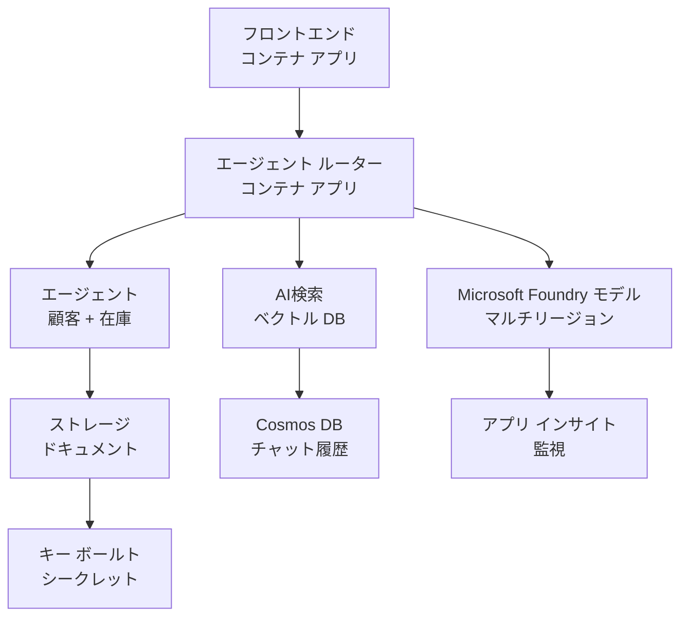

# Retail マルチエージェント ソリューション - インフラストラクチャ テンプレート

**第5章: 本番デプロイ パッケージ**
- **📚 コース ホーム**: [AZD 入門](../../README.md)
- **📖 関連章**: [第5章: マルチエージェント AI ソリューション](../../README.md#-chapter-5-multi-agent-ai-solutions-advanced)
- **📝 シナリオ ガイド**: [全体アーキテクチャ](../retail-scenario.md)
- **🎯 クイック デプロイ**: [ワンクリック デプロイ](#-quick-deployment)

> **⚠️ インフラストラクチャ テンプレートのみ**  
> この ARM テンプレートはマルチエージェント システム用の **Azure リソース** をデプロイします。  
>  
> **デプロイされるもの（15～25分）:**
> - ✅ Microsoft Foundry Models（gpt-4.1、gpt-4.1-mini、3リージョンにわたる埋め込みモデル）
> - ✅ AI Search サービス（空の状態、インデックス作成の準備完了）
> - ✅ Container Apps（プレースホルダーイメージ、あなたのコードの準備完了）
> - ✅ ストレージ、Cosmos DB、Key Vault、Application Insights
>  
> **含まれていないもの（開発が必要）:**
> - ❌ エージェント実装コード（Customer Agent、Inventory Agent）
> - ❌ ルーティングロジックと API エンドポイント
> - ❌ フロントエンドのチャット UI
> - ❌ 検索インデックススキーマとデータパイプライン
> - ❌ **推定開発工数: 80～120 時間**
>  
> **このテンプレートを使用する場合:**
> - ✅ マルチエージェント プロジェクト用の Azure インフラをプロビジョニングしたい
> - ✅ エージェント実装を別途開発する予定である
> - ✅ 本番対応のインフラ基盤が必要である
>  
> **使用しないでください:**
> - ❌ 即座に動作するマルチエージェント デモを期待している場合
> - ❌ 完全なアプリケーションコード例を探している場合

## 概要

このディレクトリには、マルチエージェント顧客サポートシステムの <strong>インフラ基盤</strong> をデプロイするための包括的な Azure Resource Manager (ARM) テンプレートが含まれています。テンプレートは、必要なすべての Azure サービスを適切に構成して相互接続し、アプリケーション開発の準備が整った状態でプロビジョニングします。

**デプロイ後に手に入るもの:** 本番対応の Azure インフラ  
**システムを完成させるために必要なもの:** エージェントコード、フロントエンド UI、データ構成（[アーキテクチャ ガイド](../retail-scenario.md) を参照）

## 🎯 デプロイされるもの

### コアインフラ（デプロイ後の状態）

✅ **Microsoft Foundry Models サービス**（API 呼び出し可能）
  - プライマリ リージョン: gpt-4.1 のデプロイ（20K TPM キャパシティ）
  - セカンダリ リージョン: gpt-4.1-mini のデプロイ（10K TPM キャパシティ）
  - ターシャリ リージョン: テキスト埋め込みモデル（30K TPM キャパシティ）
  - 評価リージョン: gpt-4.1 grader モデル（15K TPM キャパシティ）
  - **ステータス:** 完全に機能 - すぐに API 呼び出し可能

✅ **Azure AI Search**（空の状態 - 構成準備完了）
  - ベクトル検索機能が有効
  - Standard ティア、パーティション 1、レプリカ 1
  - **ステータス:** サービスは稼働中だがインデックス作成が必要
  - **対応:** スキーマに基づく検索インデックスを作成してください

✅ **Azure Storage アカウント**（空の状態 - アップロード準備完了）
  - Blob コンテナー: `documents`, `uploads`
  - セキュア設定（HTTPS のみ、パブリックアクセスなし）
  - **ステータス:** ファイル受け取り可能
  - **対応:** 製品データやドキュメントをアップロードしてください

⚠️ **Container Apps 環境**（プレースホルダーイメージをデプロイ）
  - エージェントルーターアプリ（nginx デフォルトイメージ）
  - フロントエンドアプリ（nginx デフォルトイメージ）
  - 自動スケーリング設定（0-10 インスタンス）
  - **ステータス:** プレースホルダーコンテナが稼働中
  - **対応:** エージェントアプリケーションをビルドしてデプロイしてください

✅ **Azure Cosmos DB**（空の状態 - データ準備完了）
  - データベースとコンテナーを事前構成
  - 低レイテンシ操作に最適化
  - TTL 有効化による自動クリーンアップ
  - **ステータス:** チャット履歴の保存準備完了

✅ **Azure Key Vault**（オプション - シークレット保存準備完了）
  - ソフトデリート有効
  - マネージド ID の RBAC 設定済み
  - **ステータス:** API キーや接続文字列の保存準備完了

✅ **Application Insights**（オプション - 監視アクティブ）
  - Log Analytics ワークスペースに接続
  - カスタムメトリクスとアラートを構成済み
  - **ステータス:** アプリからのテレメトリ受信準備完了

✅ **Document Intelligence**（API 呼び出し可能）
  - S0 ティアで本番ワークロード対応
  - **ステータス:** アップロードされたドキュメントの処理準備完了

✅ **Bing Search API**（API 呼び出し可能）
  - S1 ティアでリアルタイム検索対応
  - **ステータス:** Web 検索クエリの準備完了

### デプロイ モード

| モード | OpenAI キャパシティ | コンテナ インスタンス | Search ティア | ストレージ 冗長性 | 最適用途 |
|------|-----------------|---------------------|-------------|-------------------|----------|
| **Minimal** | 10K-20K TPM | 0-2 レプリカ | Basic | LRS (ローカル) | 開発/テスト、学習、概念実証 |
| **Standard** | 30K-60K TPM | 2-5 レプリカ | Standard | ZRS (ゾーン) | 本番、中程度のトラフィック（<10K ユーザー） |
| **Premium** | 80K-150K TPM | 5-10 レプリカ、ゾーン冗長 | Premium | GRS (ジオ) | エンタープライズ、高トラフィック（>10K ユーザー）、99.99% SLA |

**コストへの影響:**
- **Minimal → Standard:** コストが約4倍に増加 ($100-370/mo → $420-1,450/mo)
- **Standard → Premium:** コストが約3倍に増加 ($420-1,450/mo → $1,150-3,500/mo)
- **選択基準:** 想定負荷、SLA 要件、予算制約

**キャパシティ計画:**
- **TPM (Tokens Per Minute):** すべてのモデルデプロイにまたがる合計
- **コンテナ インスタンス:** オートスケール範囲（最小-最大レプリカ）
- **Search ティア:** クエリパフォーマンスとインデックスサイズ上限に影響

## 📋 前提条件

### 必須ツール
1. **Azure CLI** (version 2.50.0 or higher)
   ```bash
   az --version  # バージョンを確認する
   az login      # 認証する
   ```

2. **有効な Azure サブスクリプション**（Owner または Contributor のアクセス権）
   ```bash
   az account show  # 購読を確認する
   ```

### 必要な Azure クォータ

デプロイ前に、対象リージョンで十分なクォータがあることを確認してください:

```bash
# お使いの地域で Microsoft Foundry モデルが利用可能か確認する
az cognitiveservices account list-skus \
  --kind OpenAI \
  --location eastus2

# OpenAI のクォータを確認する（例: gpt-4.1）
az cognitiveservices usage list \
  --location eastus2 \
  --query "[?name.value=='OpenAI.Standard.gpt-4.1']"

# Container Apps のクォータを確認する
az provider show \
  --namespace Microsoft.App \
  --query "resourceTypes[?resourceType=='managedEnvironments'].locations"
```

**最小必要クォータ:**
- **Microsoft Foundry Models:** リージョンにまたがる 3～4 のモデルデプロイ
  - gpt-4.1: 20K TPM (Tokens Per Minute)
  - gpt-4.1-mini: 10K TPM
  - text-embedding-ada-002: 30K TPM
  - **注:** gpt-4.1 は一部リージョンでウェイトリストがある場合があります - [モデルの利用可能性](https://learn.microsoft.com/azure/ai-services/openai/concepts/models)
- **Container Apps:** マネージド環境 + 2-10 コンテナインスタンス
- **AI Search:** Standard ティア（ベクトル検索には Basic は不十分）
- **Cosmos DB:** Standard のプロビジョンド スループット

**クォータが不足している場合:**
1. Azure ポータル → Quotas → 増加をリクエスト
2. または Azure CLI を使用:
   ```bash
   az support tickets create \
     --ticket-name "OpenAI-Quota-Increase" \
     --severity "minimal" \
     --description "Request quota increase for Microsoft Foundry Models gpt-4.1 in eastus2"
   ```
3. 利用可能な別のリージョンを検討してください

## 🚀 クイック デプロイ

### オプション 1: Azure CLI を使用

```bash
# テンプレートファイルをクローンするかダウンロードする
git clone <repository-url>
cd examples/retail-multiagent-arm-template

# デプロイスクリプトを実行可能にする
chmod +x deploy.sh

# デフォルト設定でデプロイする
./deploy.sh -g myResourceGroup

# プレミアム機能を有効にして本番環境にデプロイする
./deploy.sh -g myProdRG -e prod -m premium -l eastus2
```

### オプション 2: Azure ポータルを使用

[](https://portal.azure.com/#create/Microsoft.Template/uri/https%3A%2F%2Fraw.githubusercontent.com%2Fmicrosoft%2Fazd-for-beginners%2Fmain%2Fexamples%2Fretail-multiagent-arm-template%2Fazuredeploy.json)

### オプション 3: 直接 Azure CLI を使用

```bash
# リソース グループを作成する
az group create --name myResourceGroup --location eastus2

# テンプレートをデプロイする
az deployment group create \
  --resource-group myResourceGroup \
  --template-file azuredeploy.json \
  --parameters azuredeploy.parameters.json
```

## ⏱️ デプロイ タイムライン

### 期待されること

| フェーズ | 期間 | 実施内容 |
|-------|----------|--------------||
| <strong>テンプレート検証</strong> | 30-60 秒 | Azure が ARM テンプレートの構文とパラメーターを検証 |
| <strong>リソースグループ設定</strong> | 10-20 秒 | リソースグループを作成（必要な場合） |
| **OpenAI プロビジョニング** | 5-8 分 | 3-4 の OpenAI アカウントを作成しモデルをデプロイ |
| **Container Apps** | 3-5 分 | 環境を作成しプレースホルダーコンテナをデプロイ |
| **Search & Storage** | 2-4 分 | AI Search サービスとストレージアカウントをプロビジョニング |
| **Cosmos DB** | 2-3 分 | データベース作成とコンテナの設定 |
| <strong>監視セットアップ</strong> | 2-3 分 | Application Insights と Log Analytics の設定 |
| **RBAC 設定** | 1-2 分 | マネージド ID と権限の構成 |
| <strong>合計デプロイ</strong> | **15-25 分** | インフラ全体の準備完了 |

**デプロイ後:**
- ✅ **インフラ準備完了:** すべての Azure サービスがプロビジョニングされ稼働中
- ⏱️ **アプリ開発:** 80-120 時間（あなたの責任）
- ⏱️ **インデックス構成:** 15-30 分（スキーマが必要）
- ⏱️ **データアップロード:** データセットのサイズにより変動
- ⏱️ **テスト & 検証:** 2-4 時間

---

## ✅ デプロイ成功の確認

### ステップ 1: リソースのプロビジョニングを確認 (2 分)

```bash
# すべてのリソースが正常にデプロイされたことを確認する
az resource list \
  --resource-group myResourceGroup \
  --query "[?provisioningState!='Succeeded'].{Name:name, Status:provisioningState, Type:type}" \
  --output table
```

**期待される結果:** 空のテーブル（すべてのリソースが "Succeeded" ステータスを表示）

### ステップ 2: Microsoft Foundry Models のデプロイを検証 (3 分)

```bash
# すべての OpenAI アカウントを一覧表示する
az cognitiveservices account list \
  --resource-group myResourceGroup \
  --query "[?kind=='OpenAI'].{Name:name, Location:location, Status:properties.provisioningState}" \
  --output table

# 主要リージョンのモデル展開を確認する
OPENAI_NAME=$(az cognitiveservices account list \
  --resource-group myResourceGroup \
  --query "[?kind=='OpenAI'] | [0].name" -o tsv)

az cognitiveservices account deployment list \
  --name $OPENAI_NAME \
  --resource-group myResourceGroup \
  --output table
```

**期待される結果:** 
- 3-4 の OpenAI アカウント（プライマリ、セカンダリ、ターシャリ、評価リージョン）
- 各アカウントにつき 1-2 のモデルデプロイ（gpt-4.1、gpt-4.1-mini、text-embedding-ada-002）

### ステップ 3: インフラストラクチャのエンドポイントをテスト (5 分)

```bash
# コンテナ アプリの URL を取得
az containerapp list \
  --resource-group myResourceGroup \
  --query "[].{Name:name, URL:properties.configuration.ingress.fqdn, Status:properties.runningStatus}" \
  --output table

# ルーターのエンドポイントをテストする（プレースホルダー画像が応答します）
ROUTER_URL=$(az containerapp show \
  --name retail-router \
  --resource-group myResourceGroup \
  --query "properties.configuration.ingress.fqdn" -o tsv)

echo "Testing: https://$ROUTER_URL"
curl -I https://$ROUTER_URL || echo "Container running (placeholder image - expected)"
```

**期待される結果:** 
- Container Apps が "Running" ステータスを表示
- プレースホルダー nginx が HTTP 200 または 404 を返す（アプリケーションコードは未配置）

### ステップ 4: Microsoft Foundry Models の API アクセスを確認 (3 分)

```bash
# OpenAI のエンドポイントとキーを取得する
OPENAI_ENDPOINT=$(az cognitiveservices account show \
  --name $OPENAI_NAME \
  --resource-group myResourceGroup \
  --query "properties.endpoint" -o tsv)

OPENAI_KEY=$(az cognitiveservices account keys list \
  --name $OPENAI_NAME \
  --resource-group myResourceGroup \
  --query "key1" -o tsv)

# gpt-4.1 のデプロイをテストする
curl "${OPENAI_ENDPOINT}openai/deployments/gpt-4.1/chat/completions?api-version=2024-08-01-preview" \
  -H "Content-Type: application/json" \
  -H "api-key: $OPENAI_KEY" \
  -d '{
    "messages": [{"role": "user", "content": "Say hello"}],
    "max_tokens": 10
  }'
```

**期待される結果:** チャット補完を含む JSON レスポンス（OpenAI が機能していることを確認）

### 動作しているもの vs. 動作していないもの

**✅ デプロイ後に動作しているもの:**
- Microsoft Foundry Models のモデルがデプロイされ API 呼び出しを受け付ける
- AI Search サービスは稼働中（空、インデックスなし）
- Container Apps は稼働中（プレースホルダー nginx イメージ）
- ストレージアカウントはアクセス可能でアップロード準備完了
- Cosmos DB はデータ操作の準備完了
- Application Insights はインフラのテレメトリを収集
- Key Vault はシークレット保存の準備完了

**❌ まだ動作していないもの（開発が必要）:**
- エージェントのエンドポイント（アプリケーションコード未配置）
- チャット機能（フロントエンド + バックエンドの実装が必要）
- 検索クエリ（検索インデックスが未作成）
- ドキュメント処理パイプライン（データ未アップロード）
- カスタムテレメトリ（アプリの計装が必要）

**次のステップ:** アプリケーションを開発してデプロイするために [デプロイ後の構成](#-post-deployment-next-steps) を参照してください

---

## ⚙️ 構成オプション

### テンプレート パラメーター

| Parameter | Type | Default | Description |
|-----------|------|---------|-------------|
| `projectName` | string | "retail" | すべてのリソース名のプレフィックス |
| `location` | string | Resource group location | プライマリデプロイリージョン |
| `secondaryLocation` | string | "westus2" | マルチリージョンデプロイのセカンダリリージョン |
| `tertiaryLocation` | string | "francecentral" | 埋め込みモデル用のリージョン |
| `environmentName` | string | "dev" | 環境指定（dev/staging/prod） |
| `deploymentMode` | string | "standard" | デプロイ構成（minimal/standard/premium） |
| `enableMultiRegion` | bool | true | マルチリージョンデプロイを有効化 |
| `enableMonitoring` | bool | true | Application Insights とロギングを有効化 |
| `enableSecurity` | bool | true | Key Vault と強化されたセキュリティを有効化 |

### パラメーターのカスタマイズ

`azuredeploy.parameters.json` を編集してください:

```json
{
  "$schema": "https://schema.management.azure.com/schemas/2019-04-01/deploymentParameters.json#",
  "contentVersion": "1.0.0.0",
  "parameters": {
    "projectName": {
      "value": "mycompany"
    },
    "environmentName": {
      "value": "prod"
    },
    "deploymentMode": {
      "value": "premium"
    },
    "location": {
      "value": "eastus2"
    }
  }
}
```

## 🏗️ アーキテクチャ概要


## 📖 デプロイ スクリプトの使用方法

`deploy.sh` スクリプトは対話的なデプロイ体験を提供します:

```bash
# ヘルプを表示
./deploy.sh --help

# 基本的なデプロイ
./deploy.sh -g myResourceGroup

# カスタム設定による高度なデプロイ
./deploy.sh \
  -g myProductionRG \
  -p companyname \
  -e prod \
  -m premium \
  -l eastus2

# マルチリージョンなしの開発用デプロイ
./deploy.sh \
  -g myDevRG \
  -e dev \
  -m minimal \
  --no-multi-region \
  --no-security
```

### スクリプトの機能

- ✅ <strong>前提条件の検証</strong>（Azure CLI、ログイン状態、テンプレートファイル）
- ✅ <strong>リソースグループ管理</strong>（存在しない場合は作成）
- ✅ <strong>デプロイ前のテンプレート検証</strong>
- ✅ <strong>進行状況の監視</strong>（カラー出力付き）
- ✅ <strong>デプロイ出力の表示</strong>
- ✅ <strong>デプロイ後のガイダンス</strong>

## 📊 デプロイの監視

### デプロイ状況の確認

```bash
# デプロイメントを一覧表示する
az deployment group list --resource-group myResourceGroup --output table

# デプロイメントの詳細を取得する
az deployment group show \
  --resource-group myResourceGroup \
  --name retail-deployment-YYYYMMDD-HHMMSS

# デプロイメントの進行状況を監視する
az deployment group create \
  --resource-group myResourceGroup \
  --template-file azuredeploy.json \
  --parameters azuredeploy.parameters.json \
  --verbose
```

### デプロイ出力

デプロイ成功後、次の出力が利用可能になります:

- **フロントエンド URL**: Web インターフェースの公開エンドポイント
- **ルーター URL**: エージェントルーターの API エンドポイント
- **OpenAI エンドポイント**: プライマリおよびセカンダリの OpenAI サービスエンドポイント
- **Search サービス**: Azure AI Search サービスのエンドポイント
- **ストレージ アカウント**: ドキュメント用ストレージアカウントの名前
- **Key Vault**: Key Vault の名前（有効化している場合）
- **Application Insights**: 監視サービスの名前（有効化している場合）

## 🔧 デプロイ後: 次のステップ
> **📝 重要:** インフラはデプロイ済みですが、アプリケーションコードの開発とデプロイは必要です。

### フェーズ 1: エージェントアプリケーションの開発（あなたの責任）

ARM テンプレートはプレースホルダの nginx イメージを使用した **空の Container Apps** を作成します。あなたが行う必要があるのは次のとおりです:

**必須開発:**
1. **エージェントの実装 (30-40時間)**
   - カスタマーサービスエージェント（gpt-4.1 統合）
   - 在庫エージェント（gpt-4.1-mini 統合）
   - エージェントルーティングロジック

2. **フロントエンド開発 (20-30時間)**
   - チャットインターフェース UI (React/Vue/Angular)
   - ファイルアップロード機能
   - レスポンスのレンダリングとフォーマット

3. **バックエンドサービス (12-16時間)**
   - FastAPI または Express ルーター
   - 認証ミドルウェア
   - テレメトリ統合

詳しい実装パターンとコード例は [アーキテクチャガイド](../retail-scenario.md) を参照してください

### フェーズ 2: AI 検索インデックスの構成（15-30分）

データモデルに一致する検索インデックスを作成してください:

```bash
# 検索サービスの詳細を取得する
SEARCH_NAME=$(az search service list \
  --resource-group myResourceGroup \
  --query "[0].name" -o tsv)

SEARCH_KEY=$(az search admin-key show \
  --service-name $SEARCH_NAME \
  --resource-group myResourceGroup \
  --query "primaryKey" -o tsv)

# スキーマを使用してインデックスを作成する（例）
curl -X POST "https://${SEARCH_NAME}.search.windows.net/indexes?api-version=2023-11-01" \
  -H "Content-Type: application/json" \
  -H "api-key: ${SEARCH_KEY}" \
  -d '{
    "name": "products",
    "fields": [
      {"name": "id", "type": "Edm.String", "key": true},
      {"name": "title", "type": "Edm.String", "searchable": true},
      {"name": "content", "type": "Edm.String", "searchable": true},
      {"name": "category", "type": "Edm.String", "filterable": true},
      {"name": "content_vector", "type": "Collection(Edm.Single)", 
       "searchable": true, "dimensions": 1536, "vectorSearchProfile": "default"}
    ],
    "vectorSearch": {
      "algorithms": [{"name": "default", "kind": "hnsw"}],
      "profiles": [{"name": "default", "algorithm": "default"}]
    }
  }'
```

**リソース:**
- [AI検索インデックススキーマ設計](https://learn.microsoft.com/azure/search/search-what-is-an-index)
- [ベクター検索の構成](https://learn.microsoft.com/azure/search/vector-search-how-to-create-index)

### フェーズ 3: データのアップロード（時間は変動します）

製品データとドキュメントが揃ったら:

```bash
# ストレージ アカウントの詳細を取得する
STORAGE_NAME=$(az storage account list \
  --resource-group myResourceGroup \
  --query "[0].name" -o tsv)

STORAGE_KEY=$(az storage account keys list \
  --account-name $STORAGE_NAME \
  --resource-group myResourceGroup \
  --query "[0].value" -o tsv)

# ドキュメントをアップロードする
az storage blob upload-batch \
  --destination documents \
  --source /path/to/your/product/docs \
  --account-name $STORAGE_NAME \
  --account-key $STORAGE_KEY

# 例: 単一ファイルをアップロードする
az storage blob upload \
  --container-name documents \
  --name "product-manual.pdf" \
  --file /path/to/product-manual.pdf \
  --account-name $STORAGE_NAME \
  --account-key $STORAGE_KEY
```

### フェーズ 4: アプリケーションのビルドとデプロイ（8-12時間）

エージェントコードを開発したら:

```bash
# 1. 必要に応じて Azure Container Registry を作成する
az acr create \
  --name myregistry \
  --resource-group myResourceGroup \
  --sku Basic

# 2. エージェントルーターのイメージをビルドしてプッシュする
docker build -t myregistry.azurecr.io/agent-router:v1 /path/to/your/router/code
az acr login --name myregistry
docker push myregistry.azurecr.io/agent-router:v1

# 3. フロントエンドのイメージをビルドしてプッシュする
docker build -t myregistry.azurecr.io/frontend:v1 /path/to/your/frontend/code
docker push myregistry.azurecr.io/frontend:v1

# 4. 自分のイメージで Container Apps を更新する
az containerapp update \
  --name retail-router \
  --resource-group myResourceGroup \
  --image myregistry.azurecr.io/agent-router:v1

az containerapp update \
  --name retail-frontend \
  --resource-group myResourceGroup \
  --image myregistry.azurecr.io/frontend:v1

# 5. 環境変数を設定する
az containerapp update \
  --name retail-router \
  --resource-group myResourceGroup \
  --set-env-vars \
    OPENAI_ENDPOINT=secretref:openai-endpoint \
    OPENAI_KEY=secretref:openai-key \
    SEARCH_ENDPOINT=secretref:search-endpoint \
    SEARCH_KEY=secretref:search-key
```

### フェーズ 5: アプリケーションのテスト（2-4時間）

```bash
# アプリケーションのURLを取得する
ROUTER_URL=$(az containerapp show \
  --name retail-router \
  --resource-group myResourceGroup \
  --query "properties.configuration.ingress.fqdn" -o tsv)

# エージェントのエンドポイントをテストする（コードをデプロイした後）
curl -X POST "https://${ROUTER_URL}/chat" \
  -H "Content-Type: application/json" \
  -d '{
    "message": "Hello, I need help with my order",
    "agent": "customer"
  }'

# アプリケーションのログを確認する
az containerapp logs show \
  --name retail-router \
  --resource-group myResourceGroup \
  --follow
```

### 実装リソース

**アーキテクチャと設計:**
- 📖 [完全なアーキテクチャガイド](../retail-scenario.md) - 詳細な実装パターン
- 📖 [マルチエージェント設計パターン](https://learn.microsoft.com/azure/architecture/ai-ml/guide/multi-agent-systems)

**コード例:**
- 🔗 [Microsoft Foundry Models チャットサンプル](https://github.com/Azure-Samples/azure-search-openai-demo) - RAG パターン
- 🔗 [Semantic Kernel](https://github.com/microsoft/semantic-kernel) - エージェントフレームワーク (C#)
- 🔗 [LangChain Azure](https://github.com/langchain-ai/langchain) - エージェントオーケストレーション (Python)
- 🔗 [AutoGen](https://github.com/microsoft/autogen) - マルチエージェント会話

**推定総工数:**
- インフラのデプロイ: 15-25分 (✅ 完了)
- アプリケーション開発: 80-120時間 (🔨 あなたの作業)
- テストと最適化: 15-25時間 (🔨 あなたの作業)

## 🛠️ トラブルシューティング

### よくある問題

#### 1. Microsoft Foundry Models のクォータ超過

```bash
# 現在のクォータ使用量を確認
az cognitiveservices usage list --location eastus2

# クォータの増加を申請
az support tickets create \
  --ticket-name "OpenAI-Quota-Increase" \
  --severity "minimal" \
  --description "Request quota increase for Microsoft Foundry Models in region X"
```

#### 2. Container Apps のデプロイ失敗

```bash
# コンテナアプリのログを確認する
az containerapp logs show \
  --name retail-router \
  --resource-group myResourceGroup \
  --follow

# コンテナアプリを再起動する
az containerapp revision restart \
  --name retail-router \
  --resource-group myResourceGroup
```

#### 3. 検索サービスの初期化

```bash
# 検索サービスのステータスを確認する
az search service show \
  --name <search-service-name> \
  --resource-group myResourceGroup

# 検索サービスへの接続をテストする
curl -X GET "https://<search-service-name>.search.windows.net/indexes?api-version=2023-11-01" \
  -H "api-key: <search-admin-key>"
```

### デプロイ検証

```bash
# すべてのリソースが作成されていることを検証する
az resource list \
  --resource-group myResourceGroup \
  --output table

# リソースの正常性を確認する
az resource list \
  --resource-group myResourceGroup \
  --query "[?provisioningState!='Succeeded'].{Name:name, Status:provisioningState, Type:type}" \
  --output table
```

## 🔐 セキュリティに関する考慮事項

### キー管理
- すべてのシークレットは Azure Key Vault に保存されます（有効な場合）
- コンテナーアプリは認証にマネージド ID を使用します
- ストレージアカウントは安全なデフォルト（HTTPS のみ、パブリックな Blob アクセスなし）

### ネットワークセキュリティ
- コンテナーアプリは可能な限り内部ネットワーキングを使用します
- 検索サービスはプライベートエンドポイントオプションで構成されています
- Cosmos DB は必要最小限の権限で構成されています

### RBAC の構成
```bash
# マネージドIDに必要なロールを割り当てる
az role assignment create \
  --assignee <container-app-managed-identity> \
  --role "Cognitive Services OpenAI User" \
  --scope <openai-resource-id>
```

## 💰 コスト最適化

### コスト見積もり（月額、米ドル）

| モード | OpenAI | コンテナーアプリ | 検索 | ストレージ | 合計推定額 |
|------|--------|----------------|--------|---------|------------|
| 最小 | $50-200 | $20-50 | $25-100 | $5-20 | $100-370 |
| 標準 | $200-800 | $100-300 | $100-300 | $20-50 | $420-1450 |
| プレミアム | $500-2000 | $300-800 | $300-600 | $50-100 | $1150-3500 |

### コスト監視

```bash
# 予算アラートを設定する
az consumption budget create \
  --account-name <subscription-id> \
  --budget-name "retail-budget" \
  --amount 500 \
  --time-grain Monthly \
  --start-date 2024-01-01 \
  --end-date 2024-12-31
```

## 🔄 更新と保守

### テンプレートの更新
- ARM テンプレートファイルをバージョン管理する
- まず開発環境で変更をテストする
- 更新にはインクリメンタルデプロイモードを使用する

### リソースの更新
```bash
# 新しいパラメータで更新
az deployment group create \
  --resource-group myResourceGroup \
  --template-file azuredeploy.json \
  --parameters azuredeploy.parameters.json \
  --mode Incremental
```

### バックアップと復旧
- Cosmos DB の自動バックアップが有効になっています
- Key Vault のソフトデリートが有効になっています
- ロールバック用にコンテナーアプリのリビジョンが維持されます

## 📞 サポート

- <strong>テンプレートの問題</strong>: [GitHub Issues](https://github.com/microsoft/azd-for-beginners/issues)
- **Azureサポート**: [Azure Support Portal](https://portal.azure.com/#blade/Microsoft_Azure_Support/HelpAndSupportBlade)
- <strong>コミュニティ</strong>: [Azure AI Discord](https://discord.gg/microsoft-azure)

---

**⚡ マルチエージェントソリューションをデプロイする準備はできましたか？**

開始するには: `./deploy.sh -g myResourceGroup`

---

<!-- CO-OP TRANSLATOR DISCLAIMER START -->
**免責事項**:
この文書は AI 翻訳サービス [Co-op Translator](https://github.com/Azure/co-op-translator) を使用して翻訳されました。正確性を期していますが、自動翻訳には誤りや不正確さが含まれる可能性があることにご注意ください。原文（原言語の文書）を信頼できる一次情報とみなしてください。重要な情報については、専門の人による翻訳を推奨します。本翻訳の使用により生じた誤解や誤訳については、一切の責任を負いません。
<!-- CO-OP TRANSLATOR DISCLAIMER END -->