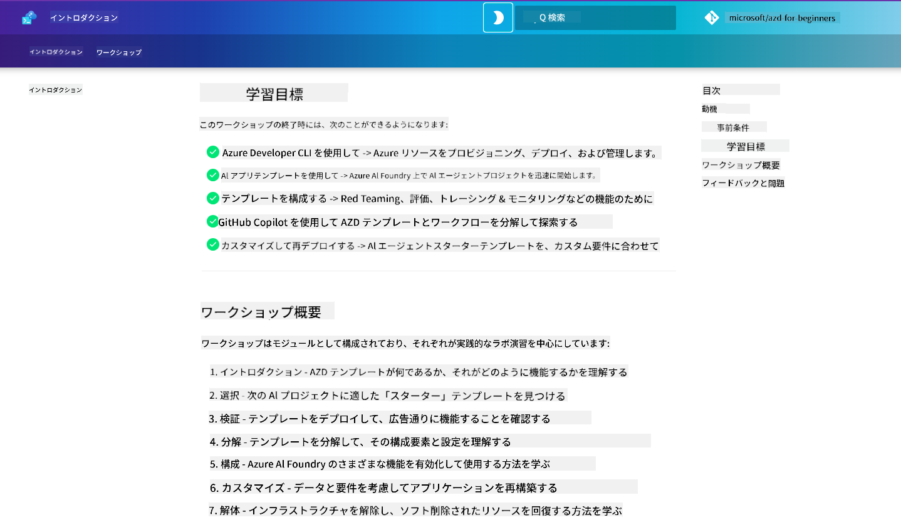

<!--
CO_OP_TRANSLATOR_METADATA:
{
  "original_hash": "9cc966416ab431c38b2ab863884b196c",
  "translation_date": "2025-09-24T09:41:59+00:00",
  "source_file": "workshop/README.md",
  "language_code": "ja"
}
-->
# AZD for AI Developers Workshop

Azure Developer CLI (AZD) を使用して AI アプリケーションをデプロイする方法を学ぶためのハンズオンワークショップへようこそ。このワークショップでは、以下の3つのステップで AZD テンプレートの実践的な理解を深めます：

1. **探索** - 自分に合ったテンプレートを見つける
1. **デプロイ** - デプロイして動作を確認する
1. **カスタマイズ** - 修正して自分仕様にする

ワークショップを通じて、開発者向けの主要なツールやワークフローも紹介し、エンドツーエンドの開発プロセスを効率化する方法を学びます。

<br/>

## ブラウザベースのガイド

ワークショップのレッスンは Markdown 形式で記載されています。GitHub 上で直接ナビゲートするか、以下のスクリーンショットのようにブラウザベースのプレビューを起動することができます。



このオプションを使用するには、リポジトリを自分のプロファイルにフォークし、GitHub Codespaces を起動します。VS Code のターミナルがアクティブになったら、以下のコマンドを入力してください：

```bash title="" linenums="0"
mkdocs serve > /dev/null 2>&1 &
```

数秒後にポップアップダイアログが表示されます。「ブラウザで開く」を選択してください。ウェブベースのガイドが新しいブラウザタブで開きます。このプレビューの利点は以下の通りです：

1. **組み込み検索** - キーワードやレッスンを素早く検索
1. **コピーアイコン** - コードブロックにカーソルを合わせると表示されます
1. **テーマ切り替え** - ダークテーマとライトテーマを切り替え可能
1. **ヘルプを得る** - フッターの Discord アイコンをクリックして参加！

<br/>

## ワークショップ概要

**所要時間:** 3～4時間  
**レベル:** 初級～中級  
**前提条件:** Azure、AI 概念、VS Code、コマンドラインツールの基本的な理解

このワークショップは実践型で、実際に手を動かして学びます。演習を完了した後は、セキュリティや生産性のベストプラクティスを学ぶために「AZD For Beginners」カリキュラムを確認することをお勧めします。

| 時間 | モジュール  | 目的 |
|:---|:---|:---|
| 15分 | [イントロダクション](docs/instructions/0-Introduction.md) | 目標を理解し、準備を整える |
| 30分 | [AI テンプレートを選択](docs/instructions/1-Select-AI-Template.md) | オプションを探索し、スターターを選ぶ | 
| 30分 | [AI テンプレートを検証](docs/instructions/2-Validate-AI-Template.md) | デフォルトソリューションを Azure にデプロイ |
| 30分 | [AI テンプレートを分解](docs/instructions/3-Deconstruct-AI-Template.md) | 構造と設定を探索 |
| 30分 | [AI テンプレートを設定](docs/instructions/4-Configure-AI-Template.md) | 利用可能な機能を有効化して試す |
| 30分 | [AI テンプレートをカスタマイズ](docs/instructions/5-Customize-AI-Template.md) | テンプレートを自分のニーズに合わせて調整 |
| 30分 | [インフラストラクチャを解体](docs/instructions/6-Teardown-Infrastructure.md) | クリーンアップしてリソースを解放 |
| 15分 | [まとめと次のステップ](docs/instructions/7-Wrap-up.md) | 学習リソースとワークショップチャレンジ |

<br/>

## 学べること

AZD テンプレートを学習のサンドボックスとして活用し、Azure AI Foundry を使ったエンドツーエンドの開発におけるさまざまな機能やツールを探索します。ワークショップ終了時には、これらのツールや概念について直感的な理解が得られるはずです。

| 概念  | 目的 |
|:---|:---|
| **Azure Developer CLI** | ツールのコマンドとワークフローを理解する |
| **AZD テンプレート**| プロジェクト構造と設定を理解する |
| **Azure AI Agent**| Azure AI Foundry プロジェクトをプロビジョニングしてデプロイ |
| **Azure AI Search**| エージェントを使ったコンテキストエンジニアリングを有効化 |
| **可観測性**| トレーシング、モニタリング、評価を探索 |
| **レッドチーミング**| 敵対的テストとその対策を探索 |

<br/>

## ワークショップ構成

このワークショップは、テンプレートの探索からデプロイ、分解、カスタマイズまでの旅を案内します。公式の [Getting Started with AI Agents](https://github.com/Azure-Samples/get-started-with-ai-agents) スターターテンプレートを基盤として使用します。

### [モジュール 1: AI テンプレートを選択](docs/instructions/1-Select-AI-Template.md) (30分)

- AI テンプレートとは何か？
- AI テンプレートはどこで見つけられるか？
- AI エージェントを構築するにはどう始めればいいか？
- **ラボ**: GitHub Codespaces を使ったクイックスタート

### [モジュール 2: AI テンプレートを検証](docs/instructions/2-Validate-AI-Template.md) (30分)

- AI テンプレートのアーキテクチャとは？
- AZD 開発ワークフローとは？
- AZD 開発でヘルプを得るには？
- **ラボ**: AI エージェントテンプレートをデプロイして検証

### [モジュール 3: AI テンプレートを分解](docs/instructions/3-Deconstruct-AI-Template.md) (30分)

- `.azure/` 内の環境を探索
- `infra/` 内のリソース設定を探索
- `azure.yaml` 内の AZD 設定を探索
- **ラボ**: 環境変数を修正して再デプロイ

### [モジュール 4: AI テンプレートを設定](docs/instructions/4-Configure-AI-Template.md) (30分)
- 探索: Retrieval Augmented Generation
- 探索: エージェント評価とレッドチーミング
- 探索: トレーシングとモニタリング
- **ラボ**: AI エージェント + 可観測性を探索

### [モジュール 5: AI テンプレートをカスタマイズ](docs/instructions/5-Customize-AI-Template.md) (30分)
- 定義: シナリオ要件を含む PRD
- 設定: AZD の環境変数
- 実装: 追加タスクのライフサイクルフック
- **ラボ**: 自分のシナリオに合わせてテンプレートをカスタマイズ

### [モジュール 6: インフラストラクチャを解体](docs/instructions/6-Teardown-Infrastructure.md) (30分)
- 再確認: AZD テンプレートとは？
- 再確認: Azure Developer CLI を使う理由
- 次のステップ: 別のテンプレートを試す！
- **ラボ**: インフラストラクチャを解体してクリーンアップ

<br/>

## ワークショップチャレンジ

さらに挑戦したいですか？以下のプロジェクト提案を参考にするか、あなたのアイデアを共有してください！

| プロジェクト | 説明 |
|:---|:---|
|1. **複雑な AI テンプレートを分解** | 提示されたワークフローとツールを使用して、別の AI ソリューションテンプレートをデプロイ、検証、カスタマイズしてみてください。 _何を学びましたか？_|
|2. **自分のシナリオでカスタマイズ**  | 別のシナリオのための PRD (製品要件文書) を作成してみてください。その後、テンプレートリポジトリで GitHub Copilot を使用し、エージェントモデルでカスタマイズワークフローを生成するよう依頼してください。 _何を学びましたか？これらの提案をどう改善できますか？_|
| | |

## フィードバックがありますか？

1. このリポジトリに Issue を投稿してください - `Workshop` タグを付けると便利です。
1. Azure AI Foundry Discord に参加して、仲間とつながりましょう！

| | | 
|:---|:---|
| **📚 コースホーム**| [AZD For Beginners](../README.md)|
| **📖 ドキュメント** | [AI テンプレートの使い方](https://learn.microsoft.com/en-us/azure/ai-foundry/how-to/develop/ai-template-get-started)|
| **🛠️AI テンプレート** | [Azure AI Foundry Templates](https://ai.azure.com/templates) |
|**🚀 次のステップ** | [チャレンジに挑戦](../../../workshop) |
| | |

<br/>

---

**前回:** [AI トラブルシューティングガイド](../docs/troubleshooting/ai-troubleshooting.md) | **次回:** [Lab 1: AZD の基本](../../../workshop/lab-1-azd-basics)

**AZD を使って AI アプリケーションの構築を始める準備はできましたか？**

[Lab 1: AZD の基礎を始める →](./lab-1-azd-basics/README.md)

---

