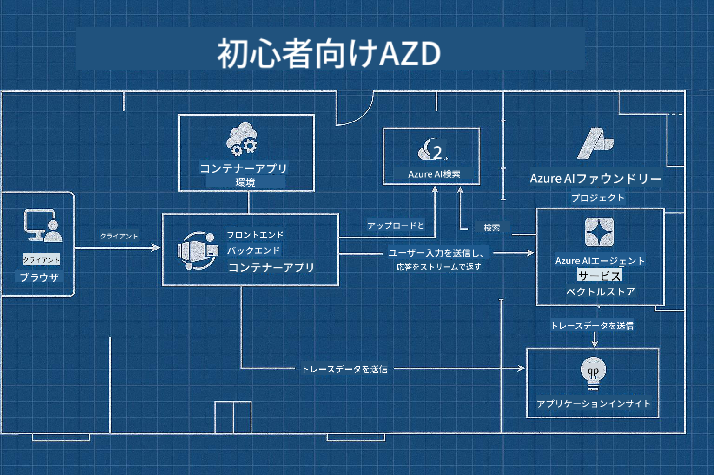

<!--
CO_OP_TRANSLATOR_METADATA:
{
  "original_hash": "245d24997bbcf2bae93bb2a503845d37",
  "translation_date": "2025-09-23T11:46:37+00:00",
  "source_file": "workshop/README.md",
  "language_code": "ja"
}
-->
# AZD for AI Developers Workshop

## AZDテンプレート

特定のシナリオに合わせたエンタープライズグレードのAIアプリケーションソリューションを構築することは、自分の家を建てることに似ています。自分で設計し、一つ一つレンガを積み上げ、すべてのガバナンスや開発ガイドラインを満たす責任を負うことができます。

**または....**

建築家と協力して、スターターホームの「設計図」を提供してもらい、それをあなたのニーズに合わせて「カスタマイズ」することもできます。この方法では、**あなたの家**を特別なものにすることに集中でき、配線や配管、その他の依存関係は専門家に任せることができます。

**これが[AI App Templates](https://ai.azure.com/templates)**のアプローチです。これは、コアニーズや依存関係に応じて、さまざまな種類のAIアプリケーション「ホーム」を構築するための設計図のシリーズです。

## テンプレートのカスタマイズ

テンプレートは[Azure AI Foundry](https://ai.azure.com)と連携するように設計されています。このプラットフォームを「建築業者」と考えてください。必要なリソース、ツール、専門知識にアクセスして作業を進めることができます！

まずは[スターターテンプレート](https://learn.microsoft.com/en-us/azure/ai-foundry/how-to/develop/ai-template-get-started)を選ぶだけです。例えば、_Get Started with AI Agents_ テンプレートを使用して、AI検索、レッドチーミング、評価、トレーシング、モニタリングなどの機能が備わった「エージェント型AIホーム」を構築します。



あとは、建築家と時間を予約して、カスタマイズプロセスを案内してもらうだけです。[GitHub Copilot for Azure](https://learn.microsoft.com/en-us/azure/developer/github-copilot-azure/get-started)がその案内役になります。「チャットするだけ」で以下のことができます：

- テンプレート内のAzure機能について学ぶ
- Azureリソースをデプロイする
- デプロイメントに関する情報を取得する
- 問題を診断し、トラブルシュートする！

このワークショップでは、既存のテンプレートを「分解」してその提供内容を学び、その後「カスタマイズ」して要件を満たす方法を一歩ずつ学びます。

AIテンプレートは**動作を可能にする**ものです。このワークショップを完了することで、**自分のものにする方法**を学びます。

----

**ワークショップナビゲーション**
- **📚 コースホーム**: [AZD For Beginners](../README.md)
- **📖 関連章**: [Chapter 1](../README.md#-chapter-1-foundation--quick-start), [Chapter 2](../README.md#-chapter-2-ai-first-development-recommended-for-ai-developers), [Chapter 5](../README.md#-chapter-5-multi-agent-ai-solutions-advanced)をカバー
- **🛠️ ハンズオンラボ**: [AI Workshop Lab](../docs/ai-foundry/ai-workshop-lab.md)
- **🚀 次のステップ**: [Workshop Lab Modules](../../../workshop)

Azure Developer CLI (AZD)を学び、AIアプリケーションのデプロイに焦点を当てたハンズオンワークショップへようこそ。このワークショップは、AZDの基本から、実運用可能なAIソリューションのデプロイまでを学ぶために設計されています。

## ワークショップ概要

**所要時間:** 2～3時間  
**レベル:** 初級～中級  
**前提条件:** Azure、コマンドラインツール、AI概念の基本知識

### 学べること

- **AZDの基本**: AZDを使ったインフラストラクチャコードの理解
- 🤖 **AIサービスの統合**: Azure OpenAI、AI検索、その他のAIサービスのデプロイ
- **コンテナデプロイ**: Azure Container Appsを使ったAIアプリケーションのデプロイ
- **セキュリティのベストプラクティス**: マネージドIDと安全な構成の実装
- **モニタリングと可観測性**: AIワークロード向けのApplication Insightsの設定
- **実運用パターン**: エンタープライズ対応のデプロイ戦略

## ワークショップ構成

### モジュール1: AZDの基礎 (30分)
- AZDのインストールと設定
- AZDプロジェクト構造の理解
- 初めてのAZDデプロイ
- **ラボ**: シンプルなWebアプリケーションをデプロイ

### モジュール2: Azure OpenAIの統合 (45分)
- Azure OpenAIリソースの設定
- モデルデプロイ戦略
- APIアクセスと認証の設定
- **ラボ**: GPT-4を使ったチャットアプリケーションをデプロイ

### モジュール3: RAGアプリケーション (45分)
- Azure AI検索の統合
- Azure Document Intelligenceを使ったドキュメント処理
- ベクトル埋め込みとセマンティック検索
- **ラボ**: ドキュメントQ&Aシステムを構築

### モジュール4: 実運用デプロイ (30分)
- コンテナアプリの設定
- スケーリングとパフォーマンス最適化
- モニタリングとログ記録
- **ラボ**: 可観測性を備えた実運用環境にデプロイ

### モジュール5: 高度なパターン (15分)
- 複数環境へのデプロイ
- CI/CDの統合
- コスト最適化戦略
- **まとめ**: 実運用準備チェックリスト

## 前提条件

### 必要なツール

ワークショップ前に以下のツールをインストールしてください：

```bash
# Azure Developer CLI
curl -fsSL https://aka.ms/install-azd.sh | bash

# Azure CLI
curl -sL https://aka.ms/InstallAzureCLIDeb | sudo bash

# Git
sudo apt-get install git

# Docker
curl -fsSL https://get.docker.com -o get-docker.sh
sudo sh get-docker.sh

# Python 3.10+
sudo apt-get install python3.10 python3.10-venv python3-pip
```

### Azureアカウントの設定

1. **Azureサブスクリプション**: [無料でサインアップ](https://azure.microsoft.com/free/)
2. **Azure OpenAIアクセス**: [アクセスをリクエスト](https://aka.ms/oai/access)
3. **必要な権限**:
   - サブスクリプションまたはリソースグループのContributorロール
   - RBAC割り当てのためのUser Access Administrator

### 前提条件の確認

以下のスクリプトを実行してセットアップを確認してください：

```bash
#!/bin/bash
echo "Verifying workshop prerequisites..."

# Check AZD installation
if command -v azd &> /dev/null; then
    echo "✅ Azure Developer CLI: $(azd --version)"
else
    echo "❌ Azure Developer CLI not found"
fi

# Check Azure CLI
if command -v az &> /dev/null; then
    echo "✅ Azure CLI: $(az --version | head -n1)"
else
    echo "❌ Azure CLI not found"
fi

# Check Docker
if command -v docker &> /dev/null; then
    echo "✅ Docker: $(docker --version)"
else
    echo "❌ Docker not found"
fi

# Check Python
if command -v python3 &> /dev/null; then
    echo "✅ Python: $(python3 --version)"
else
    echo "❌ Python 3 not found"
fi

# Check Azure login
if az account show &> /dev/null; then
    echo "✅ Azure: Logged in as $(az account show --query user.name -o tsv)"
else
    echo "❌ Azure: Not logged in (run 'az login')"
fi

echo "Setup verification complete!"
```

## ワークショップ資料

### ラボ演習

各モジュールには、スターターコードとステップバイステップの指示が含まれたハンズオンラボがあります：

- **[lab-1-azd-basics/](../../../workshop/lab-1-azd-basics)** - 初めてのAZDデプロイ
- **[lab-2-openai-chat/](../../../workshop/lab-2-openai-chat)** - Azure OpenAIを使ったチャットアプリケーション
- **[lab-3-rag-search/](../../../workshop/lab-3-rag-search)** - AI検索を使ったRAGアプリケーション
- **[lab-4-production/](../../../workshop/lab-4-production)** - 実運用デプロイパターン
- **[lab-5-advanced/](../../../workshop/lab-5-advanced)** - 高度なデプロイシナリオ

### 参考資料

- **[AI Foundry Integration Guide](../docs/ai-foundry/azure-ai-foundry-integration.md)** - 包括的な統合パターン
- **[AI Model Deployment Guide](../docs/ai-foundry/ai-model-deployment.md)** - モデルデプロイのベストプラクティス
- **[Production AI Practices](../docs/ai-foundry/production-ai-practices.md)** - エンタープライズデプロイパターン
- **[AI Troubleshooting Guide](../docs/troubleshooting/ai-troubleshooting.md)** - よくある問題と解決策

### サンプルテンプレート

一般的なAIシナリオ向けのクイックスタートテンプレート：

```
workshop/templates/
├── minimal-chat/          # Basic OpenAI chat app
├── rag-application/       # RAG with AI Search
├── multi-model/          # Multiple AI services
└── production-ready/     # Enterprise template
```

## 始め方

### オプション1: GitHub Codespaces (推奨)

ワークショップを始める最速の方法：

[](https://github.com/codespaces/new?hide_repo_select=true&ref=main&repo=YOUR_REPO_ID)

### オプション2: ローカル開発

1. **ワークショップリポジトリをクローンする:**
```bash
git clone https://github.com/YOUR_ORG/AZD-for-beginners.git
cd AZD-for-beginners/workshop
```

2. **Azureにログインする:**
```bash
az login
azd auth login
```

3. **ラボ1から始める:**
```bash
cd lab-1-azd-basics
cat README.md  # Follow the instructions
```

### オプション3: インストラクター主導のワークショップ

インストラクター主導のセッションに参加する場合：

- 🎥 **ワークショップ録画**: [オンデマンドで利用可能](https://aka.ms/azd-ai-workshop)
- 💬 **Discordコミュニティ**: [ライブサポートに参加](https://aka.ms/foundry/discord)
- **ワークショップフィードバック**: [体験を共有](https://aka.ms/azd-workshop-feedback)

## ワークショップタイムライン

### 自習形式 (3時間)

```
⏰ 00:00 - 00:30  Module 1: AZD Foundations
⏰ 00:30 - 01:15  Module 2: Azure OpenAI Integration
⏰ 01:15 - 02:00  Module 3: RAG Applications
⏰ 02:00 - 02:30  Module 4: Production Deployment
⏰ 02:30 - 02:45  Module 5: Advanced Patterns
⏰ 02:45 - 03:00  Q&A and Next Steps
```

### インストラクター主導セッション (2.5時間)

```
⏰ 00:00 - 00:15  Welcome & Prerequisites Check
⏰ 00:15 - 00:40  Module 1: Live Demo + Lab
⏰ 00:40 - 01:20  Module 2: OpenAI Integration
⏰ 01:20 - 01:30  Break
⏰ 01:30 - 02:10  Module 3: RAG Applications
⏰ 02:10 - 02:30  Module 4: Production Patterns
⏰ 02:30 - 02:45  Module 5: Advanced Topics
⏰ 02:45 - 03:00  Q&A and Resources
```

## 成功基準

ワークショップ終了時には以下ができるようになります：

✅ **AZDテンプレートを使用してAIアプリケーションをデプロイ**  
✅ **Azure OpenAIサービスを適切なセキュリティで構成**  
✅ **Azure AI検索統合を使ったRAGアプリケーションを構築**  
✅ **エンタープライズAIワークロード向けの実運用パターンを実装**  
✅ **AIアプリケーションデプロイをモニタリングし、トラブルシュート**  
✅ **AIワークロードのコスト最適化戦略を適用**  

## コミュニティとサポート

### ワークショップ中

- 🙋 **質問**: ワークショップチャットを使用するか、手を挙げてください
- 🐛 **問題**: [トラブルシューティングガイド](../docs/troubleshooting/ai-troubleshooting.md)を確認
- **ヒント**: 他の参加者と発見を共有してください

### ワークショップ後

- 💬 **Discord**: [Azure AI Foundryコミュニティ](https://aka.ms/foundry/discord)
- **GitHub Issues**: [テンプレートの問題を報告](https://github.com/YOUR_ORG/AZD-for-beginners/issues)
- 📧 **フィードバック**: [ワークショップ評価フォーム](https://aka.ms/azd-workshop-feedback)

## 次のステップ

### 学習を続ける

1. **高度なシナリオ**: [マルチリージョンデプロイ](../docs/ai-foundry/production-ai-practices.md#multi-region-deployment)を探索
2. **CI/CD統合**: [GitHub Actionsワークフロー](../docs/deployment/github-actions.md)を設定
3. **カスタムテンプレート**: [AZDテンプレート](../docs/getting-started/custom-templates.md)を作成

### プロジェクトに適用する

1. **評価**: [準備チェックリスト](./production-readiness-checklist.md)を使用
2. **テンプレート**: [AI専用テンプレート](../../../workshop/templates)から始める
3. **サポート**: [Azure AI Foundry Discord](https://aka.ms/foundry/discord)に参加

### 成果を共有する

- ⭐ **リポジトリにスターを付ける**: このワークショップが役立った場合
- 🐦 **ソーシャルメディアで共有**: #AzureDeveloperCLI #AzureAI
- 📝 **ブログ投稿を書く**: AIデプロイの旅について

---

## ワークショップフィードバック

フィードバックはワークショップ体験の改善に役立ちます：

| 項目 | 評価 (1-5) | コメント |
|------|------------|----------|
| コンテンツの質 | ⭐⭐⭐⭐⭐ | |
| ハンズオンラボ | ⭐⭐⭐⭐⭐ | |
| ドキュメント | ⭐⭐⭐⭐⭐ | |
| 難易度 | ⭐⭐⭐⭐⭐ | |
| 全体的な体験 | ⭐⭐⭐⭐⭐ | |

**フィードバックを送信**: [ワークショップ評価フォーム](https://aka.ms/azd-workshop-feedback)

---

**前へ:** [AI Troubleshooting Guide](../docs/troubleshooting/ai-troubleshooting.md) | **次へ:** [Lab 1: AZD Basics](../../../workshop/lab-1-azd-basics)を開始

**AZDを使ってAIアプリケーションを構築する準備はできましたか？**

[Lab 1: AZD Foundations →](./lab-1-azd-basics/README.md)

---

