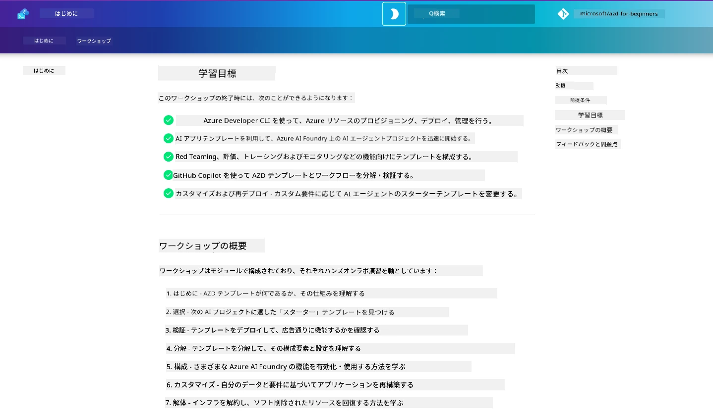

<div align="center">
  <div style="background: linear-gradient(135deg, #0078d4, #106ebe); border-radius: 10px; padding: 20px; margin: 20px 0; box-shadow: 0 4px 15px rgba(0, 120, 212, 0.3); border: 2px solid #005a9e;">
    <h2 style="color: white; margin: 0; font-size: 24px; text-shadow: 1px 1px 2px rgba(0,0,0,0.3);">
      🎯 AI 開発者向け AZD ワークショップ
    </h2>
    <p style="color: white; margin: 10px 0 0 0; font-size: 16px; text-shadow: 1px 1px 2px rgba(0,0,0,0.3);">
      <strong>Azure Developer CLI を使って AI アプリケーションを構築するためのハンズオンワークショップです。</strong><br>
      AZD テンプレートと AI デプロイワークフローを習得するための 7 モジュールを完了してください。
    </p>
    <div style="margin-top: 15px;">
      <span style="background: rgba(255,255,255,0.2); padding: 5px 10px; border-radius: 15px; color: white; font-size: 14px;">
        📅 最終更新: 2026年3月
      </span>
    </div>
  </div>
</div>

# AI 開発者向け AZD ワークショップ

Azure Developer CLI (AZD) を学ぶハンズオンワークショップへようこそ。AI アプリケーションのデプロイに重点を置いた内容です。このワークショップでは AZD テンプレートを適用的に理解するための 3 つのステップを提供します:

1. <strong>探索</strong> - 自分に合ったテンプレートを見つける。
1. <strong>デプロイ</strong> - デプロイして正常に動作することを検証する
1. <strong>カスタマイズ</strong> - 修正と反復を行い、自分のものにする！

このワークショップを通じて、エンドツーエンドの開発を効率化するためのコアな開発ツールとワークフローについても紹介します。

<br/>

## ブラウザベースのガイド

ワークショップのレッスンは Markdown で記載されています。GitHub 上で直接ナビゲートすることも、下のスクリーンショットのようにブラウザベースのプレビューを起動することもできます。



このオプションを使用するには、リポジトリを自分のプロフィールにフォークし、GitHub Codespaces を起動してください。VS Code のターミナルがアクティブになったら、次のコマンドを入力します:

This browser preview works in GitHub Codespaces, dev containers, or a local clone with Python and MkDocs installed.

```bash title="" linenums="0"
mkdocs serve > /dev/null 2>&1 &
```

In a few seconds, you will see a pop-up dialog. Select the option to `ブラウザで開く`. The web-based guide will now open in a new browser tab. Some benefits of this preview:

1. <strong>組み込み検索</strong> - キーワードやレッスンを素早く見つける
1. <strong>コピーアイコン</strong> - コードブロックにカーソルを合わせるとこのオプションが表示されます
1. <strong>テーマ切替</strong> - ダークとライトテーマを切り替えられます
1. <strong>ヘルプを得る</strong> - フッターの Discord アイコンをクリックして参加できます！

<br/>

## ワークショップ概要

**所要時間:** 3-4 時間  
**レベル:** 初級〜中級  
**前提条件:** Azure、AI の概念、VS Code、およびコマンドラインツールに慣れていること。

これは実際に手を動かして学ぶハンズオンワークショップです。演習を終えたら、セキュリティや生産性のベストプラクティスに関する学習を続けるために、AZD For Beginners カリキュラムを確認することをお勧めします。

| Time| Module  | Objective |
|:---|:---|:---|
| 15 mins | [導入](docs/instructions/0-Introduction.md) | 背景を説明し、目標を理解する |
| 30 mins | [AI テンプレートを選択](docs/instructions/1-Select-AI-Template.md) | オプションを探り、スターターを選ぶ | 
| 30 mins | [AI テンプレートを検証](docs/instructions/2-Validate-AI-Template.md) | デフォルトのソリューションを Azure にデプロイする |
| 30 mins | [AI テンプレートを分解](docs/instructions/3-Deconstruct-AI-Template.md) | 構造と設定を調査する |
| 30 mins | [AI テンプレートを構成](docs/instructions/4-Configure-AI-Template.md) | 機能を有効化して試す |
| 30 mins | [AI テンプレートをカスタマイズ](docs/instructions/5-Customize-AI-Template.md) | テンプレートをあなたのニーズに合わせて調整する |
| 30 mins | [インフラを撤去](docs/instructions/6-Teardown-Infrastructure.md) | クリーンアップしてリソースを解放する |
| 15 mins | [まとめと次のステップ](docs/instructions/7-Wrap-up.md) | 学習リソース、ワークショップの課題 |

<br/>

## 学べること

AZD テンプレートを、Microsoft Foundry 上でのエンドツーエンド開発のさまざまな機能やツールを探索するための学習サンドボックスと考えてください。本ワークショップ終了時には、この文脈でのさまざまなツールや概念について直感的な理解が得られるはずです。

| Concept  | Objective |
|:---|:---|
| **Azure Developer CLI** | ツールのコマンドとワークフローを理解する|
| **AZD テンプレート**| プロジェクト構成と設定を理解する|
| **Azure AI Agent**| Microsoft Foundry プロジェクトのプロビジョニングとデプロイ  |
| **Azure AI Search**| エージェントによるコンテキストエンジニアリングを有効にする |
| <strong>可観測性</strong>| トレーシング、モニタリング、および評価を調査する |
| <strong>レッドチーミング</strong>| 攻撃的テストと緩和策を探る |

<br/>

## ワークショップ構成

このワークショップは、テンプレートの探索からデプロイ、分解、カスタマイズへと進む旅程に構成されています。公式の [AI エージェント入門](https://github.com/Azure-Samples/get-started-with-ai-agents) スターターテンプレートを基礎として使用します。

### [モジュール 1: AI テンプレートを選択](docs/instructions/1-Select-AI-Template.md) (30 分)

- AI テンプレートとは何か？
- AI テンプレートはどこで見つけられるか？
- AI エージェントの構築をどう始めるか？
- <strong>ラボ</strong>: Codespaces または dev コンテナでのクイックスタート

### [モジュール 2: AI テンプレートを検証](docs/instructions/2-Validate-AI-Template.md) (30 分)

- AI テンプレートのアーキテクチャとは？
- AZD の開発ワークフローとは？
- AZD 開発でどうやってヘルプを得られるか？
- <strong>ラボ</strong>: AI エージェントテンプレートをデプロイして検証

### [モジュール 3: AI テンプレートを分解](docs/instructions/3-Deconstruct-AI-Template.md) (30 分)

- `.azure/` 内の環境を調査する 
- `infra/` にあるリソース構成を調査する 
- AZD の設定を `azure.yaml`s で調査する
- <strong>ラボ</strong>: 環境変数を変更して再デプロイ

### [モジュール 4: AI テンプレートを構成](docs/instructions/4-Configure-AI-Template.md) (30 分)
- 探索: Retrieval Augmented Generation
- 探索: エージェント評価とレッドチーミング
- 探索: トレースとモニタリング
- <strong>ラボ</strong>: AI エージェントと可観測性を探索 

### [モジュール 5: AI テンプレートをカスタマイズ](docs/instructions/5-Customize-AI-Template.md) (30 分)
- 定義: シナリオ要件を含む PRD
- 構成: AZD のための環境変数
- 実装: 追加タスクのためのライフサイクルフック
- <strong>ラボ</strong>: 自分のシナリオ向けにテンプレートをカスタマイズ

### [モジュール 6: インフラを撤去](docs/instructions/6-Teardown-Infrastructure.md) (30 分)
- 振り返り: AZD テンプレートとは何か？
- 振り返り: なぜ Azure Developer CLI を使うのか？
- 次のステップ: 別のテンプレートに挑戦！
- <strong>ラボ</strong>: インフラのプロビジョニング解除とクリーンアップ

<br/>

## ワークショップチャレンジ

さらに挑戦したいですか？ 以下はプロジェクト提案です — またはアイデアを共有してください!!

| Project | Description |
|:---|:---|
|1. **複雑な AI テンプレートを分解する** | ここで示したワークフローとツールを使って、別の AI ソリューションテンプレートをデプロイ、検証、カスタマイズできるか試してみてください。 _何を学びましたか?_|
|2. <strong>自分のシナリオでカスタマイズする</strong>  | 別のシナリオ用に PRD (Product Requirements Document) を作成してみてください。その後、テンプレートリポジトリ内で Agent Model の GitHub Copilot を使用し、カスタマイズワークフローを生成するように依頼してください。 _何を学びましたか？これらの提案をどのように改善できますか？_|
| | |

## フィードバックはありますか？

1. このリポジトリに issue を投稿してください - 便宜上 `Workshop` タグを付けてください。
1. Microsoft Foundry の Discord に参加して、仲間とつながりましょう！


| | | 
|:---|:---|
| **📚 コースホーム**| [AZD 入門](../README.md)|
| **📖 ドキュメント** | [AI テンプレートの始め方](https://learn.microsoft.com/en-us/azure/ai-foundry/how-to/develop/ai-template-get-started)|
| **🛠️AI テンプレート** | [Microsoft Foundry テンプレート](https://ai.azure.com/templates) |
|**🚀 次のステップ** | [ワークショップ開始](#ワークショップ概要) |
| | |

<br/>

---

**ナビゲーション：** [メインコース](../README.md) | [導入](docs/instructions/0-Introduction.md) | [モジュール 1: テンプレートを選択](docs/instructions/1-Select-AI-Template.md)

**AZD で AI アプリケーションの構築を始める準備はできましたか？**

[ワークショップ開始: 導入 →](docs/instructions/0-Introduction.md)

---

<!-- CO-OP TRANSLATOR DISCLAIMER START -->
**免責事項**:
この文書は AI 翻訳サービス [Co-op Translator](https://github.com/Azure/co-op-translator) を使用して翻訳されました。正確性を期していますが、自動翻訳には誤りや不正確な箇所が含まれる可能性があることにご注意ください。原文は当該言語での文書を権威ある出典と見なすべきです。重要な情報については、専門の人間による翻訳を推奨します。本翻訳の使用に起因する誤解や誤った解釈について、当社は責任を負いません。
<!-- CO-OP TRANSLATOR DISCLAIMER END -->