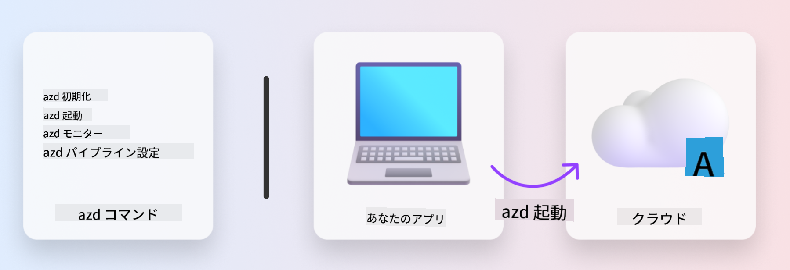
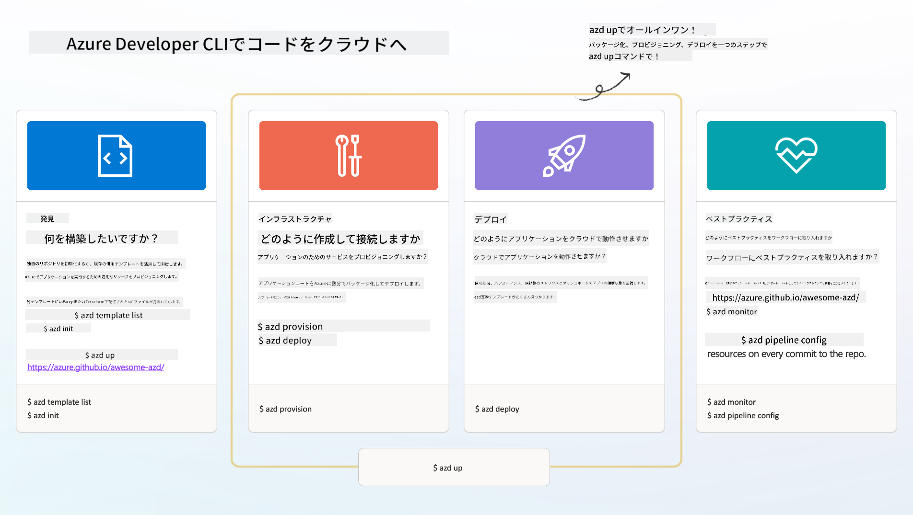

<!--
CO_OP_TRANSLATOR_METADATA:
{
  "original_hash": "06d6207eff634aefcaa41739490a5324",
  "translation_date": "2025-09-24T09:59:22+00:00",
  "source_file": "workshop/docs/instructions/1-Select-AI-Template.md",
  "language_code": "ja"
}
-->
# 1. テンプレートを選択

!!! tip "このモジュールの終了時には以下ができるようになります"

    - [ ] AZDテンプレートとは何かを説明できる
    - [ ] AI向けのAZDテンプレートを発見し、使用できる
    - [ ] AI Agentsテンプレートを使い始める
    - [ ] **ラボ1:** GitHub Codespacesを使ったAZDクイックスタート

---

## 1. ビルダーの例え

ゼロからモダンなエンタープライズ対応のAIアプリケーションを構築するのは気が遠くなるような作業です。それは、自分でレンガを積み上げて新しい家を建てるようなものです。もちろん可能ですが、望む結果を得るための最も効率的な方法ではありません！

その代わりに、通常は既存の「設計図」を使い、それを自分の要件に合わせてカスタマイズするために建築家と協力します。これは、インテリジェントなアプリケーションを構築する際のアプローチと同じです。まず、自分の問題領域に合った優れた設計アーキテクチャを見つけます。そして、ソリューションアーキテクトと協力して、特定のシナリオに合わせてカスタマイズし、開発します。

では、これらの設計図はどこで見つけられるのでしょうか？また、これらの設計図を自分でカスタマイズして展開する方法を教えてくれるアーキテクトはどこにいるのでしょうか？このワークショップでは、以下の3つの技術を紹介しながらこれらの質問に答えます：

1. [Azure Developer CLI](https://aka.ms/azd) - ローカル開発（ビルド）からクラウド展開（出荷）までの開発者の道を加速するオープンソースツール。
1. [Azure AI Foundry Templates](https://ai.azure.com/templates) - AIソリューションアーキテクチャを展開するためのサンプルコード、インフラストラクチャ、設定ファイルを含む標準化されたオープンソースリポジトリ。
1. [GitHub Copilot Agent Mode](https://code.visualstudio.com/docs/copilot/chat/chat-agent-mode) - Azureの知識に基づいたコーディングエージェントで、コードベースをナビゲートし、自然言語を使って変更を加える方法を案内してくれる。

これらのツールを手に入れれば、適切なテンプレートを「発見」し、それを「展開」して動作を確認し、特定のシナリオに合わせて「カスタマイズ」することができます。それでは、これらのツールの使い方を学んでいきましょう。

---

## 2. Azure Developer CLI

[Azure Developer CLI](https://learn.microsoft.com/en-us/azure/developer/azure-developer-cli/)（または`azd`）は、開発環境（IDE）とCI/CD（DevOps）環境の両方で一貫して動作する開発者向けコマンドを提供し、コードからクラウドへの旅を加速するオープンソースのコマンドラインツールです。

`azd`を使えば、展開のプロセスは以下のようにシンプルになります：

- `azd init` - 既存のAZDテンプレートから新しいAIプロジェクトを初期化。
- `azd up` - インフラストラクチャをプロビジョニングし、アプリケーションを一度に展開。
- `azd monitor` - 展開されたアプリケーションのリアルタイムモニタリングと診断を取得。
- `azd pipeline config` - Azureへの展開を自動化するCI/CDパイプラインを設定。

**🎯 | 演習**: <br/> GitHub Codespaces環境で`azd`コマンドラインツールを試してみましょう。まず以下のコマンドを入力して、ツールが何をできるか確認してください：

```bash title="" linenums="0"
azd help
```



---

## 3. AZDテンプレート

`azd`がこれを実現するためには、プロビジョニングするインフラストラクチャ、適用する設定、展開するアプリケーションを知る必要があります。ここで[AZDテンプレート](https://learn.microsoft.com/en-us/azure/developer/azure-developer-cli/azd-templates?tabs=csharp)が登場します。

AZDテンプレートは、ソリューションアーキテクチャを展開するために必要なサンプルコード、インフラストラクチャ、設定ファイルを組み合わせたオープンソースリポジトリです。
_インフラストラクチャコード_（IaC）アプローチを使用することで、テンプレートのリソース定義と設定をアプリケーションのソースコードと同様にバージョン管理することができ、プロジェクトのユーザー間で再利用可能で一貫性のあるワークフローを作成します。

自分のシナリオに合わせてAZDテンプレートを作成または再利用する際には、以下の質問を考慮してください：

1. 何を構築しているのか？ → そのシナリオに対応するスターターコードを持つテンプレートはあるか？
1. ソリューションのアーキテクチャはどうなっているか？ → 必要なリソースを持つテンプレートはあるか？
1. ソリューションはどのように展開されるか？ → `azd deploy`と事前/事後処理フックを考慮！
1. さらに最適化する方法は？ → 組み込みのモニタリングと自動化パイプラインを考慮！

**🎯 | 演習**: <br/> 
[Awesome AZD](https://azure.github.io/awesome-azd/)ギャラリーを訪問し、フィルターを使って現在利用可能な250以上のテンプレートを探索してください。自分のシナリオ要件に合うものを見つけられるか試してみましょう。



---

## 4. AIアプリテンプレート

---

