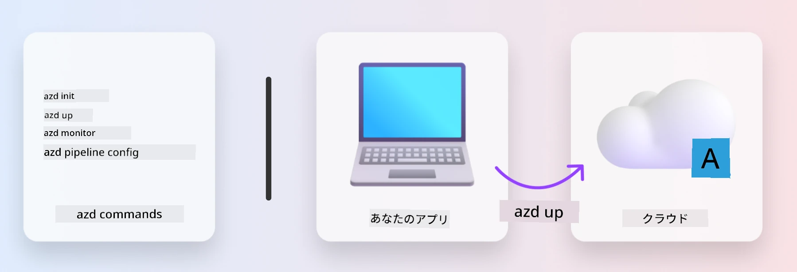
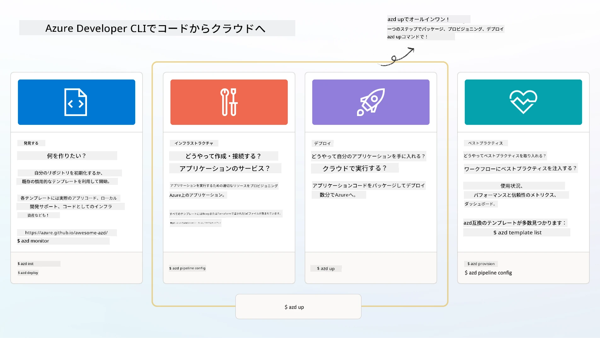

# 1. テンプレートを選択

!!! tip "BY THE END OF THIS MODULE YOU WILL BE ABLE TO"

    - [ ] AZD テンプレートとは何かを説明する
    - [ ] AI 向けの AZD テンプレートを見つけて使用する
    - [ ] AI Agents テンプレートを使い始める
    - [ ] **Lab 1:** GitHub Codespaces を使った AZD クイックスタート

---

## 1. ビルダーのたとえ

現代のエンタープライズ対応の AI アプリケーションを_ゼロから_構築するのは気が遠くなることがあります。これは、新しい家を自分で一つ一つレンガを積んで建てるようなものです。確かに可能ですが、望む結果を得るための最も効果的な方法とは言えません。

代わりに、既存の_設計図_を出発点にして、建築家と協力して自分の要件に合わせてカスタマイズすることがよくあります。そして、インテリジェントなアプリケーションを構築する際にもまさに同じアプローチを取ります。まず、自分の問題領域に適した優れた設計アーキテクチャを見つけます。次に、ソリューションアーキテクトと協力して特定のシナリオ向けにソリューションをカスタマイズおよび開発します。

しかし、これらの設計図はどこで見つければよいのでしょうか？そして、それらの設計図を自分でカスタマイズしてデプロイする方法を教えてくれるアーキテクトはどのように見つければよいのでしょうか？このワークショップでは、次の三つの技術を紹介することで、それらの疑問に答えます。

1. [Azure Developer CLI](https://aka.ms/azd) - ローカル開発（ビルド）からクラウドへのデプロイ（シップ）までの開発者の道のりを加速するオープンソースツールです。
1. [Microsoft Foundry Templates](https://ai.azure.com/templates) - サンプルコード、インフラストラクチャ、構成ファイルを含む、AI ソリューションアーキテクチャをデプロイするための標準化されたオープンソースリポジトリです。
1. [GitHub Copilot Agent Mode](https://code.visualstudio.com/docs/copilot/chat/chat-agent-mode) - Azure の知識に基づいたコーディングエージェントで、ナチュラルランゲージを用いてコードベースのナビゲーションや変更の支援を行います。

これらのツールを手にすれば、適切なテンプレートを_発見_し、それが動作するかを_デプロイ_して検証し、特定のシナリオに合わせて_カスタマイズ_することができます。それでは、これらの仕組みを詳しく見ていきましょう。

---

## 2. Azure Developer CLI

The [Azure Developer CLI](https://learn.microsoft.com/en-us/azure/developer/azure-developer-cli/) (or `azd`) は、IDE（開発）や CI/CD（DevOps）環境全体で一貫して動作する、開発者向けのコマンド群を備えたオープンソースのコマンドラインツールで、コードからクラウドへの道のりを高速化します。

`azd` を使えば、デプロイの流れは次のようにシンプルにできます:

- `azd init` - 既存の AZD テンプレートから新しい AI プロジェクトを初期化します。
- `azd up` - インフラをプロビジョニングし、アプリケーションをワンステップでデプロイします。
- `azd monitor` - デプロイされたアプリケーションのリアルタイム監視と診断情報を取得します。
- `azd pipeline config` - Azure へのデプロイを自動化する CI/CD パイプラインを設定します。

**🎯 | EXERCISE**: <br/> 今すぐ GitHub Codespaces の環境で `azd` コマンドラインツールを調べてみましょう。ツールの機能を確認するために、まず次のコマンドを入力してみてください:

```bash title="" linenums="0"
azd help
```



---

## 3. The AZD Template

`azd` がこれを実現するためには、プロビジョニングするインフラ、適用する設定、そしてデプロイするアプリケーションを把握する必要があります。ここで登場するのが [AZD templates](https://learn.microsoft.com/en-us/azure/developer/azure-developer-cli/azd-templates?tabs=csharp) です。

AZD テンプレートは、サンプルコードとソリューションアーキテクチャをデプロイするために必要なインフラおよび構成ファイルを組み合わせたオープンソースのリポジトリです。_Infrastructure-as-Code_（IaC）アプローチを採用することで、テンプレートのリソース定義や設定をアプリのソースコードと同様にバージョン管理できるようになり、そのプロジェクトの利用者間で再利用可能で一貫したワークフローを作成します。

あなたのシナリオ向けに AZD テンプレートを作成または再利用する際は、次の点を考慮してください:

1. 何を構築していますか？ → そのシナリオ向けのスターターコードを含むテンプレートはありますか？
1. ソリューションはどのようにアーキテクトされていますか？ → 必要なリソースを含むテンプレートはありますか？
1. ソリューションはどのようにデプロイされますか？ → 事前/事後処理のフックを持つ `azd deploy` を考えてみてください！
1. さらにどう最適化できますか？ → 組み込みの監視や自動化パイプラインを検討しましょう！

**🎯 | EXERCISE**: <br/> 
[Awesome AZD](https://azure.github.io/awesome-azd/) ギャラリーにアクセスし、フィルターを使って現在利用可能な 250+ のテンプレートを探索してみてください。あなたのシナリオ要件に合うものが見つかるか確認してみましょう。



---

## 4. AI App Templates

AI 搭載アプリケーション向けに、Microsoft は **Microsoft Foundry** と **Foundry Agents** を特徴とする専門的なテンプレートを提供しています。これらのテンプレートは、インテリジェントで本番対応のアプリケーションを構築する道のりを加速します。

### Microsoft Foundry & Foundry Agents Templates

下のテンプレートからデプロイするテンプレートを選択してください。各テンプレートは [Awesome AZD](https://azure.github.io/awesome-azd/) で利用可能で、単一のコマンドで初期化できます。

| テンプレート | 説明 | デプロイ コマンド |
|----------|-------------|----------------|
| **[AI Chat with RAG](https://azure.github.io/awesome-azd/?tags=ai&tags=rag)** | Microsoft Foundry を用いた Retrieval Augmented Generation を活用するチャットアプリケーション | `azd init -t azure-samples/azure-search-openai-demo` |
| **[Foundry Agent Service Starter](https://azure.github.io/awesome-azd/?tags=ai&tags=agents)** | 自律的なタスク実行のために Foundry Agents を使用して AI エージェントを構築するスターター | `azd init -t azure-samples/foundry-agent-service-starter` |
| **[Multi-Agent Orchestration](https://azure.github.io/awesome-azd/?tags=ai&tags=agents)** | 複雑なワークフローのために複数の Foundry Agents を調整するオーケストレーション | `azd init -t azure-samples/multi-agent-orchestration` |
| **[AI Document Intelligence](https://azure.github.io/awesome-azd/?tags=ai&tags=document)** | Microsoft Foundry モデルでドキュメントを抽出・解析する | `azd init -t azure-samples/ai-document-processing` |
| **[Conversational AI Bot](https://azure.github.io/awesome-azd/?tags=ai&tags=bot)** | Microsoft Foundry と統合したインテリジェントなチャットボットを構築する | `azd init -t azure-samples/ai-chat-protocol` |
| **[AI Image Generation](https://azure.github.io/awesome-azd/?tags=ai&tags=dalle)** | Microsoft Foundry を介して DALL-E を使用して画像を生成する | `azd init -t azure-samples/ai-image-generation` |
| **[Semantic Kernel Agent](https://azure.github.io/awesome-azd/?tags=ai&tags=semantic-kernel)** | Foundry Agents と共に Semantic Kernel を使用する AI エージェント | `azd init -t azure-samples/semantic-kernel-agent` |
| **[AutoGen Multi-Agent](https://azure.github.io/awesome-azd/?tags=ai&tags=autogen)** | AutoGen フレームワークを使用したマルチエージェントシステム | `azd init -t azure-samples/autogen-multi-agent` |

### クイックスタート

1. **テンプレートを参照**: [https://azure.github.io/awesome-azd/](https://azure.github.io/awesome-azd/) にアクセスし、`AI`、`Agents`、または `Microsoft Foundry` でフィルターします
2. **テンプレートを選択**: 自分のユースケースに合うものを選びます
3. **初期化**: 選んだテンプレートに対して `azd init` コマンドを実行します
4. **デプロイ**: `azd up` を実行してプロビジョニングとデプロイを行います

**🎯 | EXERCISE**: <br/>
上記のテンプレートから、ご自身のシナリオに基づいて 1 つ選択してください:

- **チャットボットを構築しますか？** → **AI Chat with RAG** または **Conversational AI Bot** から始めましょう
- **自律エージェントが必要ですか？** → **Foundry Agent Service Starter** または **Multi-Agent Orchestration** を試してください
- **ドキュメントを処理しますか？** → **AI Document Intelligence** を使用してください
- **AI によるコーディング支援が欲しいですか？** → **Semantic Kernel Agent** または **AutoGen Multi-Agent** を探索してください

```bash title="Example: Deploy the AI Chat with RAG template" linenums="0"
azd init -t azure-samples/azure-search-openai-demo
azd up
```

!!! info "Explore More Templates"
    The [Awesome AZD Gallery](https://azure.github.io/awesome-azd/) contains 250+ templates. Use the filters to find templates matching your specific requirements for language, framework, and Azure services.

---

<!-- CO-OP TRANSLATOR DISCLAIMER START -->
免責事項：
この文書は AI 翻訳サービス「Co-op Translator」（https://github.com/Azure/co-op-translator）を使用して翻訳されました。正確性の確保に努めていますが、自動翻訳には誤りや不正確な箇所が含まれる可能性があることをご承知ください。重要な情報については原文（原言語の文書）を正式な情報源としてご参照ください。重要な内容については、専門の人による翻訳を推奨します。本翻訳の利用により生じたいかなる誤解や誤訳についても、当方は責任を負いません。
<!-- CO-OP TRANSLATOR DISCLAIMER END -->