# 2. テンプレートの検証

!!! tip "このモジュールの終了時にできるようになること"

    - [ ] AIソリューションアーキテクチャを分析する
    - [ ] AZDデプロイメントワークフローを理解する
    - [ ] GitHub Copilotを使用してAZDの使い方をサポートを受ける
    - [ ] **Lab 2:** AIエージェントテンプレートをデプロイして検証する

---

## 1. はじめに

[Azure Developer CLI](https://learn.microsoft.com/en-us/azure/developer/azure-developer-cli/)、または`azd`は、Azureにアプリケーションを構築・デプロイする際の開発者ワークフローを簡素化するオープンソースのコマンドラインツールです。

[AZDテンプレート](https://learn.microsoft.com/azure/developer/azure-developer-cli/azd-templates)は、サンプルアプリケーションコード、_インフラストラクチャコード_資産、そして`azd`構成ファイルを含む標準化されたリポジトリで、統合されたソリューションアーキテクチャを提供します。インフラストラクチャのプロビジョニングは`azd provision`コマンドで簡単に行え、`azd up`を使用すればインフラストラクチャのプロビジョニングとアプリケーションのデプロイを一度に行うことができます。

その結果、アプリケーション開発プロセスを迅速に開始するには、自分のアプリケーションとインフラストラクチャのニーズに最も近い_AZDスターターテンプレート_を見つけ、それをカスタマイズしてシナリオ要件に合わせるだけで済みます。

始める前に、Azure Developer CLIがインストールされていることを確認しましょう。

1. VS Codeのターミナルを開き、次のコマンドを入力してください:

      ```bash title="" linenums="0"
      azd version
      ```

1. 以下のような出力が表示されるはずです！

      ```bash title="" linenums="0"
      azd version 1.19.0 (commit b3d68cea969b2bfbaa7b7fa289424428edb93e97)
      ```

**これでテンプレートを選択してazdでデプロイする準備が整いました**

---

## 2. テンプレートの選択

Azure AI Foundryプラットフォームには、_マルチエージェントワークフローの自動化_や_マルチモーダルコンテンツ処理_などの人気のあるソリューションシナリオをカバーする[推奨AZDテンプレートのセット](https://learn.microsoft.com/en-us/azure/ai-foundry/how-to/develop/ai-template-get-started)が用意されています。これらのテンプレートはAzure AI Foundryポータルで確認することもできます。

1. [https://ai.azure.com/templates](https://ai.azure.com/templates)にアクセスしてください。
1. Azure AI Foundryポータルにログインを求められたらログインしてください。以下のような画面が表示されます。

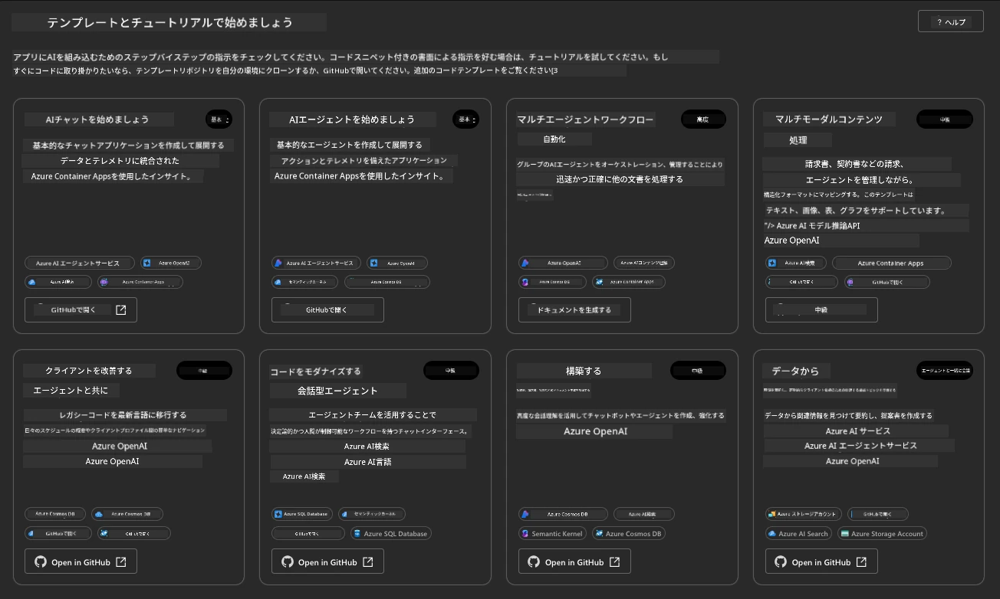

**Basic**オプションはスターターテンプレートです:

1. [ ] [Get Started with AI Chat](https://github.com/Azure-Samples/get-started-with-ai-chat)は、基本的なチャットアプリケーションをAzure Container Appsにデプロイします。基本的なAIチャットボットシナリオを探索するのに適しています。
1. [X] [Get Started with AI Agents](https://github.com/Azure-Samples/get-started-with-ai-agents)は、標準的なAIエージェント（Azure AI Agent Serviceを使用）をデプロイします。ツールやモデルを含むエージェント型AIソリューションに慣れるのに適しています。

新しいブラウザタブで2番目のリンクを開くか、関連カードの`Open in GitHub`をクリックしてください。このAZDテンプレートのリポジトリが表示されます。READMEを少し探索してみてください。アプリケーションアーキテクチャは以下のようになっています:

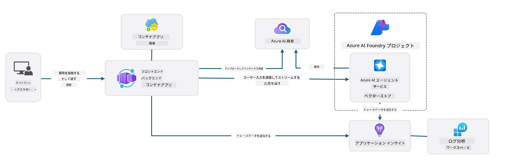

---

## 3. テンプレートのアクティベーション

このテンプレートをデプロイして有効であることを確認してみましょう。[Getting Started](https://github.com/Azure-Samples/get-started-with-ai-agents?tab=readme-ov-file#getting-started)セクションのガイドラインに従います。

1. [このリンク](https://github.com/codespaces/new/Azure-Samples/get-started-with-ai-agents)をクリックし、`Create codespace`のデフォルトアクションを確認してください。
1. 新しいブラウザタブが開きます。GitHub Codespacesセッションの読み込みが完了するまで待ちます。
1. CodespacesでVS Codeターミナルを開き、次のコマンドを入力してください:

   ```bash title="" linenums="0"
   azd up
   ```

このコマンドがトリガーするワークフローステップを完了してください:

1. Azureへのログインを求められます。指示に従って認証してください。
1. ユニークな環境名を入力してください。例: `nitya-mshack-azd`を使用しました。
1. `.azure/`フォルダが作成されます。環境名のサブフォルダが表示されます。
1. サブスクリプション名を選択するよう求められます。デフォルトを選択してください。
1. ロケーションを選択するよう求められます。`East US 2`を使用してください。

プロビジョニングが完了するまで待ちます。**これには10〜15分かかります**

1. 完了すると、コンソールに以下のようなSUCCESSメッセージが表示されます:
      ```bash title="" linenums="0"
      SUCCESS: Your up workflow to provision and deploy to Azure completed in 10 minutes 17 seconds.
      ```

1. Azureポータルには、環境名を持つプロビジョニングされたリソースグループが表示されます:

      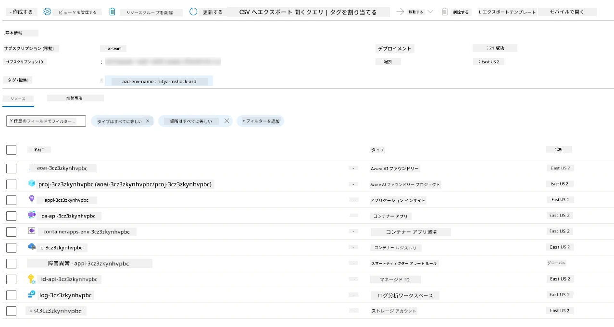

1. **これでデプロイされたインフラストラクチャとアプリケーションを検証する準備が整いました**。

---

## 4. テンプレートの検証

1. Azureポータルの[Resource Groups](https://portal.azure.com/#browse/resourcegroups)ページにアクセスし、ログインを求められたらログインしてください。
1. 環境名のRGをクリックすると、上記のページが表示されます。

      - Azure Container Appsリソースをクリックします。
      - _Essentials_セクション（右上）のApplication Urlをクリックします。

1. 以下のようなホストされたアプリケーションのフロントエンドUIが表示されるはずです:

   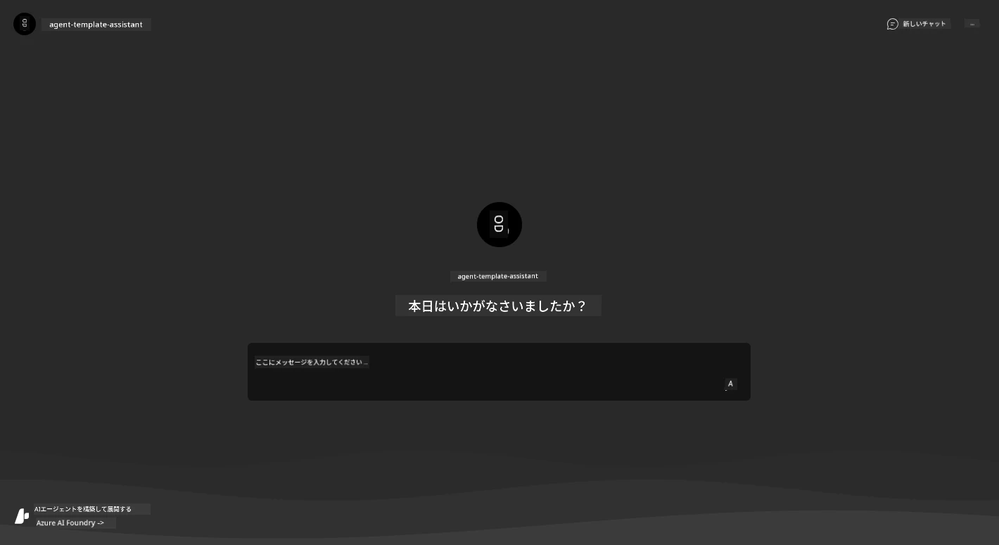

1. [サンプル質問](https://github.com/Azure-Samples/get-started-with-ai-agents/blob/main/docs/sample_questions.md)をいくつか試してみてください。

      1. 質問: ```What is the capital of France?``` 
      1. 質問: ```What's the best tent under $200 for two people, and what features does it include?```

1. 以下のような回答が得られるはずです。_でも、これがどう動作しているのでしょうか？_

      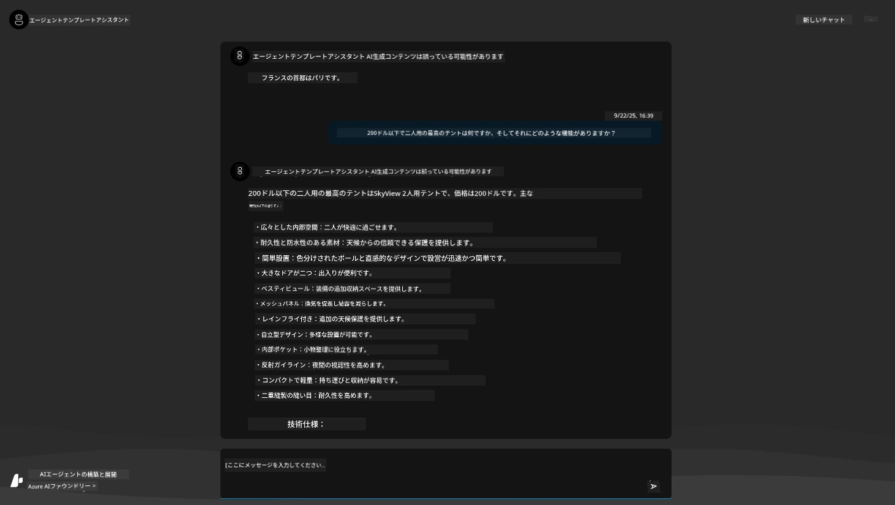

---

## 5. エージェントの検証

Azure Container Appは、Azure AI Foundryプロジェクトでこのテンプレート用にプロビジョニングされたAIエージェントに接続するエンドポイントをデプロイします。それが何を意味するのか見てみましょう。

1. Azureポータルのリソースグループの_概要_ページに戻ります。

1. リスト内の`Azure AI Foundry`リソースをクリックします。

1. 以下の画面が表示されます。`Go to Azure AI Foundry Portal`ボタンをクリックしてください。
   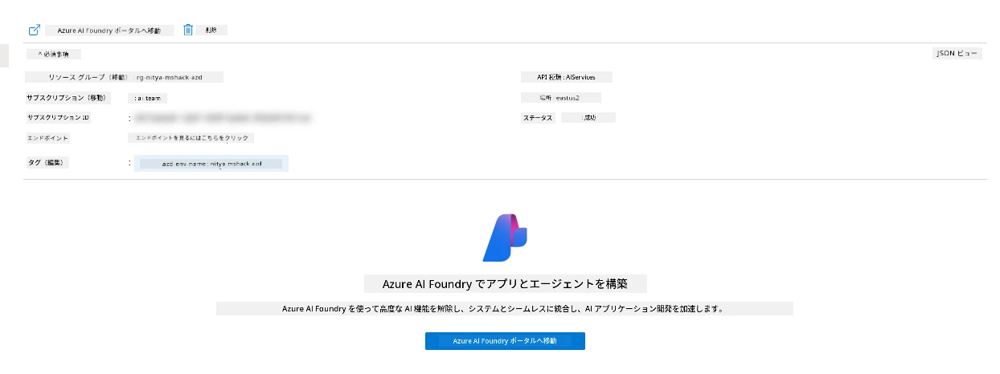

1. AIアプリケーション用のFoundryプロジェクトページが表示されます。
   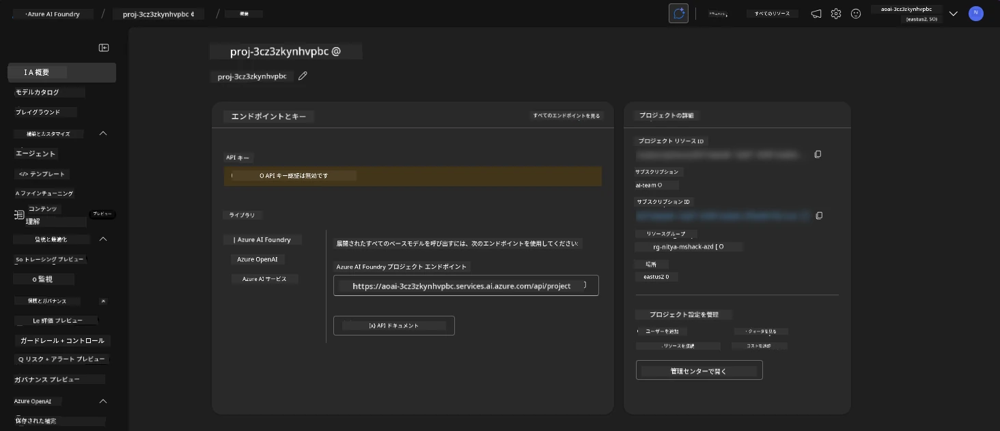

1. `Agents`をクリックすると、プロジェクト内でプロビジョニングされたデフォルトのエージェントが表示されます。
   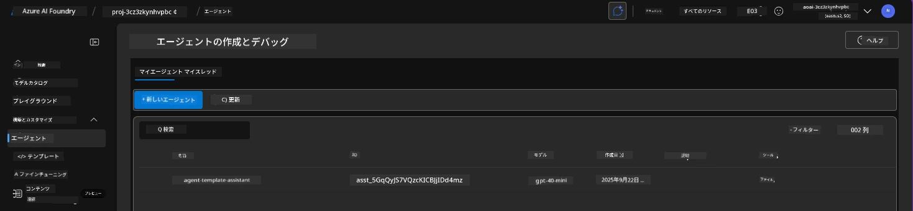

1. それを選択すると、エージェントの詳細が表示されます。以下を確認してください:

      - エージェントはデフォルトでFile Searchを使用しています（常に）。
      - エージェントの`Knowledge`には32個のファイルがアップロードされていることが示されています（ファイル検索用）。
      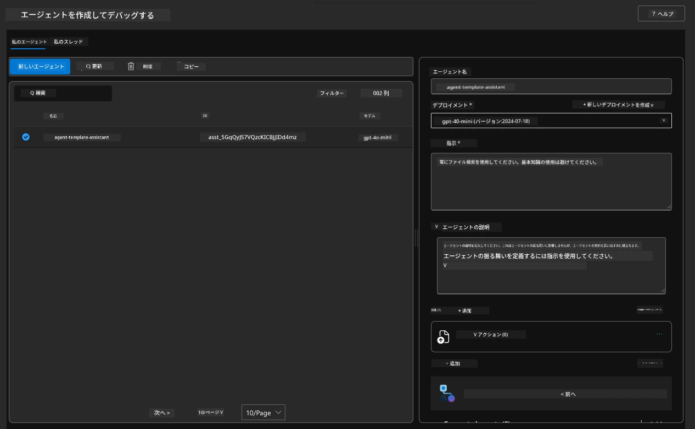

1. 左側のメニューで`Data+indexes`オプションを探し、詳細をクリックしてください。

      - 知識用にアップロードされた32個のデータファイルが表示されます。
      - これらは`src/files`内の12個の顧客ファイルと20個の製品ファイルに対応します。
      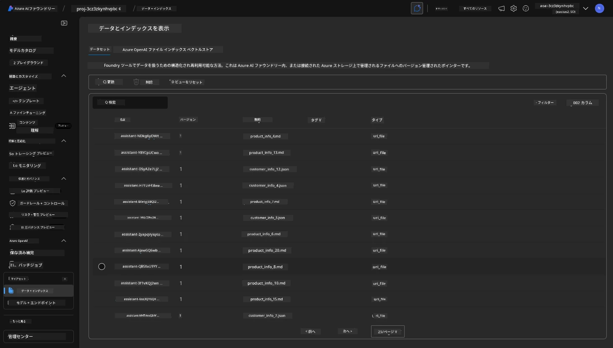

**エージェントの動作を検証しました！**

1. エージェントの回答はこれらのファイルの知識に基づいています。
1. これでそのデータに関連する質問を行い、根拠のある回答を得ることができます。
1. 例: `customer_info_10.json`には"Amanda Perez"が行った3つの購入が記載されています。

Container Appエンドポイントのブラウザタブに戻り、次の質問をしてください: `What products does Amanda Perez own?`。以下のような回答が表示されるはずです:

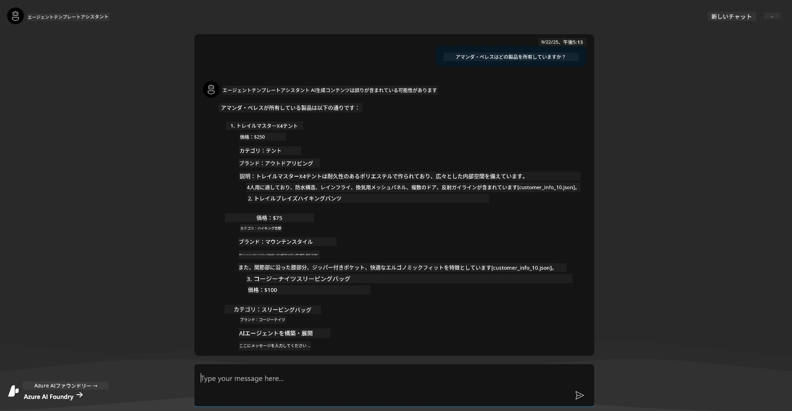

---

## 6. エージェントプレイグラウンド

Azure AI Foundryの機能についてもう少し直感をつかむために、エージェントをプレイグラウンドで試してみましょう。

1. Azure AI Foundryの`Agents`ページに戻り、デフォルトのエージェントを選択します。
1. `Try in Playground`オプションをクリックすると、以下のようなプレイグラウンドUIが表示されます。
1. 同じ質問をしてください: `What products does Amanda Perez own?`

    

同じ（または類似の）回答が得られますが、さらに以下の情報も表示されます。これにより、エージェント型アプリの品質、コスト、パフォーマンスを理解するのに役立ちます。例えば:

1. 回答が引用するデータファイルが表示されます。
1. これらのファイルラベルにカーソルを合わせてみてください。クエリと表示された回答が一致しているか確認してください。

また、回答の下に_統計_行が表示されます。

1. 任意のメトリックにカーソルを合わせてみてください。例えば、安全性。以下のような表示がされます。
1. 評価された安全性のレベルが回答の安全性に対する直感と一致しているか確認してください。

      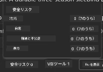

---x

## 7. 組み込みの可観測性

可観測性とは、アプリケーションを計測して、その動作を理解、デバッグ、最適化するためのデータを生成することです。これを理解するために:

1. `View Run Info`ボタンをクリックすると、以下のビューが表示されます。これは[エージェントトレーシング](https://learn.microsoft.com/en-us/azure/ai-foundry/how-to/develop/trace-agents-sdk#view-trace-results-in-the-azure-ai-foundry-agents-playground)の例です。_トップレベルメニューのThread Logsをクリックしてもこのビューを取得できます_。

   - エージェントが実行したステップと使用したツールを確認します。
   - 応答に使用されたトークン数（vs.出力トークン使用量）を理解します。
   - 実行中に時間が費やされた場所とレイテンシを理解します。

      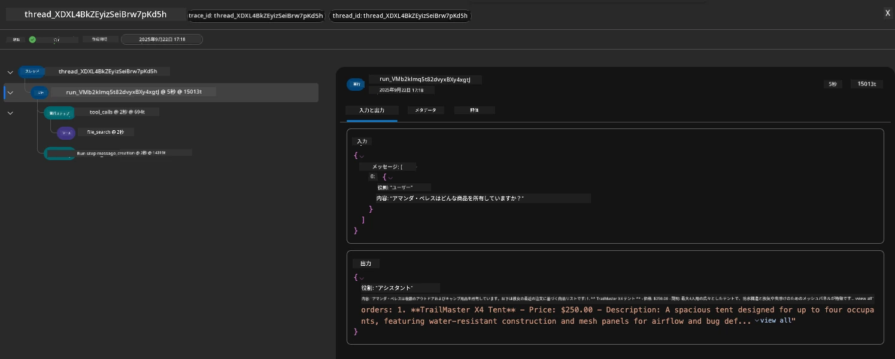

1. `Metadata`タブをクリックすると、後で問題をデバッグする際に役立つコンテキストを提供する実行の追加属性が表示されます。

      

1. `Evaluations`タブをクリックすると、エージェントの回答に対して行われた自動評価が表示されます。これには安全性評価（例: 自傷行為）やエージェント固有の評価（例: 意図解決、タスク遵守）が含まれます。

      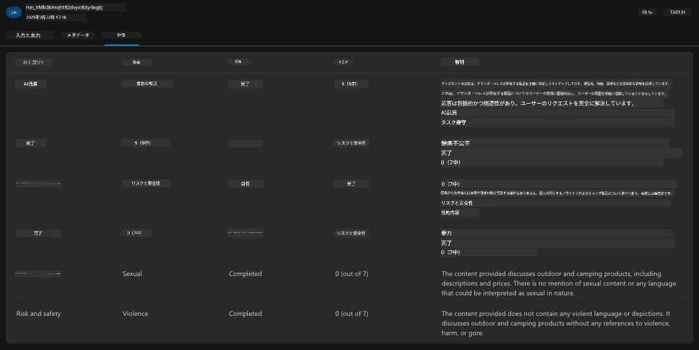

1. 最後に、サイドバーメニューの`Monitoring`タブをクリックしてください。

      - 表示されたページで`Resource usage`タブを選択し、メトリクスを確認します。
      - コスト（トークン）と負荷（リクエスト）の観点からアプリケーション使用状況を追跡します。
      - 最初のバイト（入力処理）と最後のバイト（出力）のレイテンシを追跡します。

      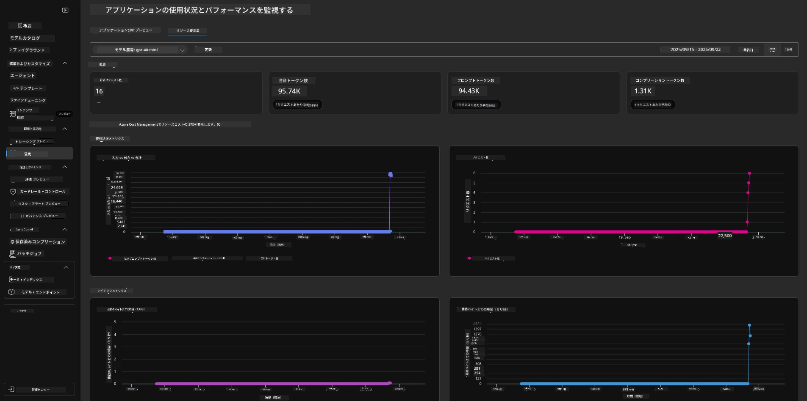

---

## 8. 環境変数

これまで、ブラウザでデプロイメントを進めてきましたが、インフラストラクチャがプロビジョニングされ、アプリケーションが動作していることを検証しました。しかし、アプリケーションを_コードファースト_で操作するには、これらのリソースに関連する変数を設定してローカル開発環境を構成する必要があります。`azd`を使用するとこれが簡単に行えます。

1. Azure Developer CLIは[環境変数を使用](https://learn.microsoft.com/en-us/azure/developer/azure-developer-cli/manage-environment-variables?tabs=bash)して、アプリケーションデプロイメントの構成設定を保存および管理します。

1. 環境変数は`.azure/<env-name>/.env`に保存されます。これにより、デプロイメント時に使用された`env-name`環境にスコープされ、同じリポジトリ内の異なるデプロイメントターゲット間で環境を分離するのに役立ちます。

1. 環境変数は、`azd`コマンドが特定のコマンド（例: `azd up`）を実行するたびに自動的に読み込まれます。`azd`は_オペレーティングシステムレベル_の環境変数（例: シェルで設定されたもの）を自動的に読み取ることはありません。その代わりに、`azd set env`や`azd get env`を使用してスクリプト内で情報を転送します。

いくつかのコマンドを試してみましょう:

1. この環境で`azd`に設定されたすべての環境変数を取得します:

      ```bash title="" linenums="0"
      azd env get-values
      ```
      
      以下のような出力が表示されます:

      ```bash title="" linenums="0"
      AZURE_AI_AGENT_DEPLOYMENT_NAME="gpt-4o-mini"
      AZURE_AI_AGENT_NAME="agent-template-assistant"
      AZURE_AI_EMBED_DEPLOYMENT_NAME="text-embedding-3-small"
      AZURE_AI_EMBED_DIMENSIONS=100
      ...
      ```

1. 特定の値を取得します。例: `AZURE_AI_AGENT_MODEL_NAME`値が設定されているか確認したい場合

      ```bash title="" linenums="0"
      azd env get-value AZURE_AI_AGENT_MODEL_NAME 
      ```
      
      以下のような出力が表示されます - デフォルトでは設定されていませんでした！

      ```bash title="" linenums="0"
      ERROR: key 'AZURE_AI_AGENT_MODEL_NAME' not found in the environment values
      ```

1. `azd`の新しい環境変数を設定します。ここでは、エージェントモデル名を更新します。_注意: 変更はすぐに`.azure/<env-name>/.env`ファイルに反映されます。

      ```bash title="" linenums="0"
      azd env set AZURE_AI_AGENT_MODEL_NAME gpt-4.1
      azd env set AZURE_AI_AGENT_MODEL_VERSION 2025-04-14
      azd env set AZURE_AI_AGENT_DEPLOYMENT_CAPACITY 150
      ```

      これで値が設定されているはずです:

      ```bash title="" linenums="0"
      azd env get-value AZURE_AI_AGENT_MODEL_NAME 
      ```

1. 一部のリソース（例: モデルデプロイメント）は永続的であり、再デプロイを強制するには単なる`azd up`以上の操作が必要です。元のデプロイメントを削除し、変更された環境変数で再デプロイしてみましょう。

1. **リフレッシュ** 以前にazdテンプレートを使用してインフラストラクチャをデプロイした場合、次のコマンドを使用してAzureデプロイメントの現在の状態に基づいてローカル環境変数の状態を_リフレッシュ_できます:
      ```bash title="" linenums="0"
      azd env refresh
      ```

      これは、複数のローカル開発環境（例: 複数の開発者がいるチーム）間で環境変数を同期する強力な方法です。デプロイされたインフラストラクチャが環境変数の状態の基準として機能します。チームメンバーは変数を単にリフレッシュするだけで同期を取り戻すことができます。

---

## 9. おめでとうございます 🏆

あなたは以下の手順を含む、エンドツーエンドのワークフローを完了しました:

- [X] 使用したいAZDテンプレートを選択
- [X] GitHub Codespacesでテンプレートを起動
- [X] テンプレートをデプロイし、動作を確認

---

