# 2. テンプレートの検証

!!! tip "このモジュールの終了時には次のことができるようになります"

    - [ ] AIソリューションアーキテクチャを分析する
    - [ ] AZD のデプロイワークフローを理解する
    - [ ] GitHub Copilot を使用して AZD の使用方法を支援する
    - [ ] **Lab 2:** AI Agents テンプレートをデプロイして検証する

---


## 1. はじめに

The [Azure Developer CLI](https://learn.microsoft.com/en-us/azure/developer/azure-developer-cli/) or `azd` は、Azure にアプリケーションを構築およびデプロイする際の開発者ワークフローを簡素化するオープンソースのコマンドラインツールです。 

[AZD テンプレート](https://learn.microsoft.com/azure/developer/azure-developer-cli/azd-templates) は、サンプルアプリケーションコード、インフラストラクチャ as code 資産、および一貫したソリューションアーキテクチャのための `azd` 構成ファイルを含む標準化されたリポジトリです。インフラのプロビジョニングは `azd provision` コマンドと同じくらい簡単になり、`azd up` を使用するとインフラをプロビジョニングすると同時にアプリケーションを一度にデプロイできます。

その結果、アプリケーション開発プロセスの開始は、アプリケーションとインフラの要件に最も近い _AZD スタートテンプレート_ を見つけて、リポジトリをシナリオ要件に合わせてカスタマイズするだけで済みます。

始める前に、Azure Developer CLI がインストールされていることを確認しましょう。

1. VS Code のターミナルを開き、次のコマンドを入力します:

      ```bash title="" linenums="0"
      azd version
      ```

1. 次のような表示がされるはずです!

      ```bash title="" linenums="0"
      azd version 1.19.0 (commit b3d68cea969b2bfbaa7b7fa289424428edb93e97)
      ```

**これで `azd` を使用してテンプレートを選択してデプロイする準備が整いました**

---

## 2. テンプレートの選択

Microsoft Foundry プラットフォームには、_マルチエージェントワークフローの自動化_ や _マルチモーダルコンテンツ処理_ のような一般的なソリューションシナリオをカバーする [推奨 AZD テンプレートのセット](https://learn.microsoft.com/en-us/azure/ai-foundry/how-to/develop/ai-template-get-started) が用意されています。これらのテンプレートは Microsoft Foundry ポータルからも見つけることができます。

1. Visit [https://ai.azure.com/templates](https://ai.azure.com/templates)
1. プロンプトが表示されたら Microsoft Foundry ポータルにログインします - 次のような表示がされます。

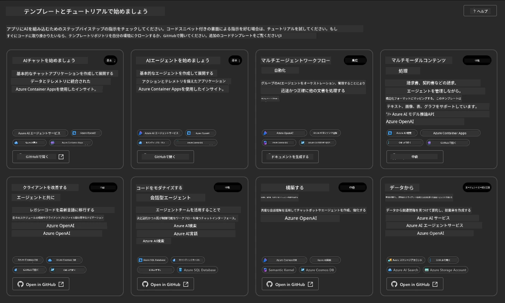


**Basic** オプションはスターターテンプレートです:

1. [ ] [Get Started with AI Chat](https://github.com/Azure-Samples/get-started-with-ai-chat) は基本的なチャットアプリケーションをあなたのデータとともに Azure Container Apps にデプロイします。基本的な AI チャットボットシナリオを調査するためにこれを使用します。
1. [X] [Get Started with AI Agents](https://github.com/Azure-Samples/get-started-with-ai-agents) は Foundry Agents を使用した標準的な AI エージェントもデプロイします。ツールとモデルを含むエージェント型 AI ソリューションに慣れるためにこれを使用してください。

2番目のリンクを新しいブラウザタブで開く（または関連カードの `Open in GitHub` をクリック）と、この AZD テンプレートのリポジトリが表示されます。README を少し確認してください。アプリケーションアーキテクチャは次のようになっています:

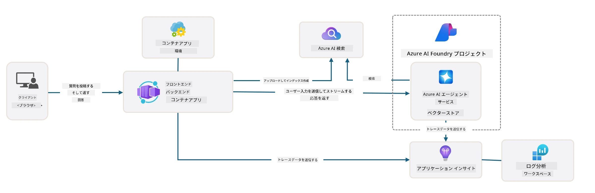

---

## 3. テンプレートのアクティベーション

このテンプレートをデプロイして有効であることを確認してみましょう。[Getting Started](https://github.com/Azure-Samples/get-started-with-ai-agents?tab=readme-ov-file#getting-started) セクションのガイドラインに従います。

1. [このリンク](https://github.com/codespaces/new/Azure-Samples/get-started-with-ai-agents) をクリック - デフォルトのアクションで `Create codespace` を確認します
1. 新しいブラウザタブが開きます - GitHub Codespaces セッションの読み込みが完了するのを待ちます
1. Codespaces の VS Code ターミナルを開き、次のコマンドを入力します:

   ```bash title="" linenums="0"
   azd up
   ```

このコマンドがトリガーするワークフローステップを完了してください:

1. Azure へのログインが求められます - 指示に従って認証します
1. ユニークな環境名を入力します - 例: 私は `nitya-mshack-azd` を使用しました
1. これにより `.azure/` フォルダーが作成されます - 環境名のサブフォルダーが作成されているのが見えます
1. サブスクリプション名の選択を求められます - デフォルトを選択してください
1. ロケーションの選択を求められます - `East US 2` を使用してください

プロビジョニングが完了するのを待ちます。**これには 10〜15 分かかります**

1. 完了すると、コンソールに次のような SUCCESS メッセージが表示されます:
      ```bash title="" linenums="0"
      SUCCESS: Your up workflow to provision and deploy to Azure completed in 10 minutes 17 seconds.
      ```
1. Azure ポータルには、その環境名のプロビジョニング済みリソースグループが表示されます:

      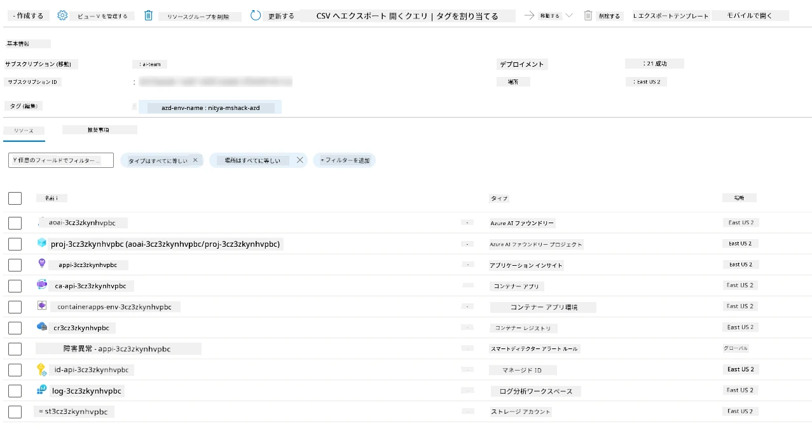

1. **これでデプロイされたインフラストラクチャとアプリケーションを検証する準備が整いました**。

---

## 4. テンプレートの検証

1. Azure ポータルの [Resource Groups](https://portal.azure.com/#browse/resourcegroups) ページにアクセス - プロンプトが表示されたらログインします
1. 環境名の RG をクリック - 上記のページが表示されます

      - Azure Container Apps リソースをクリックします
      - _Essentials_ セクション（右上）の Application Url をクリックします

1. 次のようなホストされたアプリケーションのフロントエンド UI が表示されるはずです:

   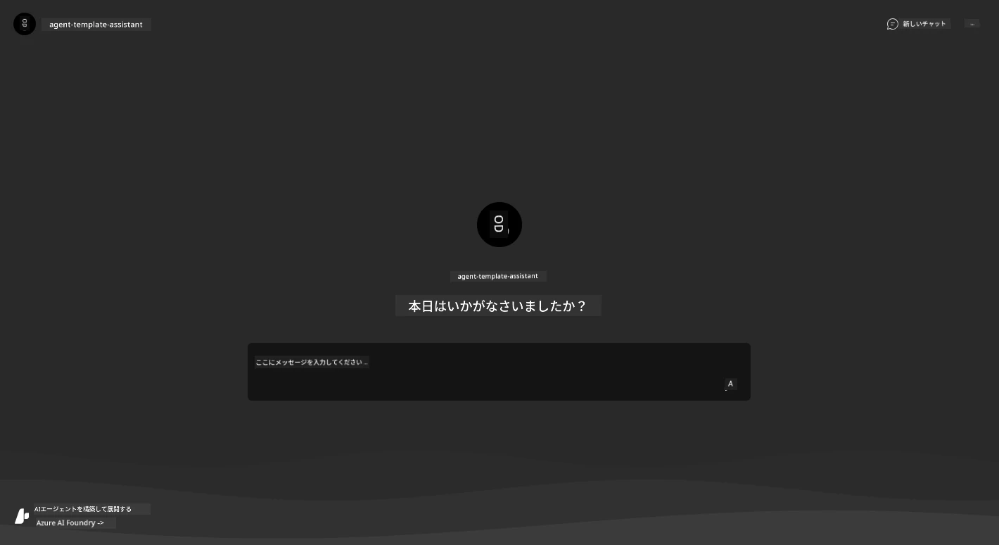

1. [サンプル質問](https://github.com/Azure-Samples/get-started-with-ai-agents/blob/main/docs/sample_questions.md) をいくつか試してみてください

      1. Ask: ```What is the capital of France?``` 
      1. Ask: ```What's the best tent under $200 for two people, and what features does it include?```

1. 以下に示すような回答が得られるはずです。_しかし、これはどのように動作するのでしょうか?_ 

      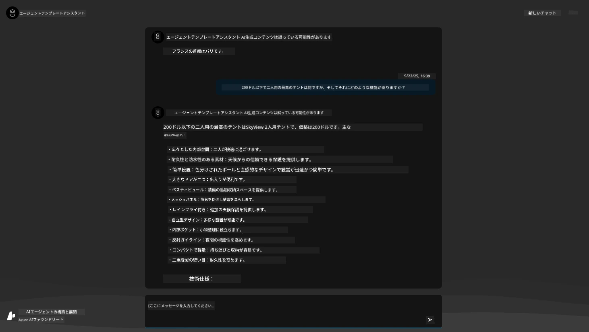

---

## 5. エージェントの検証

Azure Container App は、このテンプレート用に Microsoft Foundry プロジェクトでプロビジョニングされた AI エージェントに接続するエンドポイントをデプロイします。これが何を意味するのか見てみましょう。

1. リソースグループの Azure ポータル _Overview_ ページに戻ります

1. リスト内の `Microsoft Foundry` リソースをクリックします

1. 次のような画面が表示されます。`Go to Microsoft Foundry Portal` ボタンをクリックします。 
   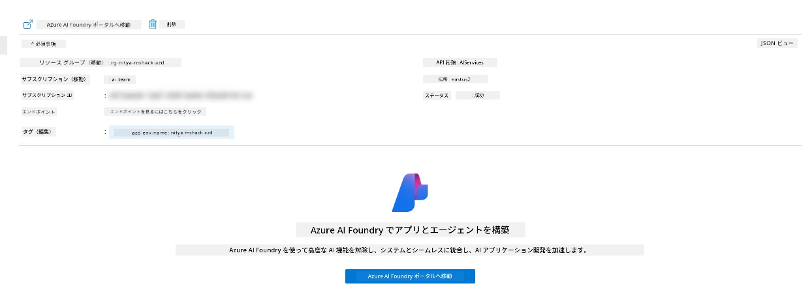

1. AI アプリケーションの Foundry Project ページが表示されます
   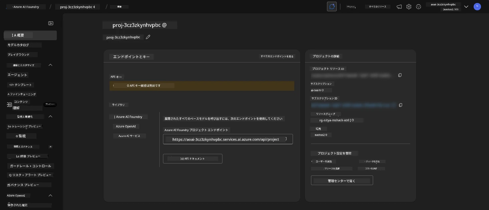

1. `Agents` をクリック - プロジェクトにプロビジョニングされたデフォルトのエージェントが表示されます
   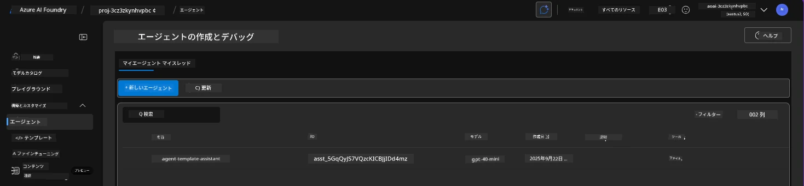

1. それを選択すると、エージェントの詳細が表示されます。以下に注意してください:

      - エージェントはデフォルトで File Search を使用します（常に）
      - エージェントの `Knowledge` は、32 個のファイルがアップロードされていることを示しています（ファイル検索用）
      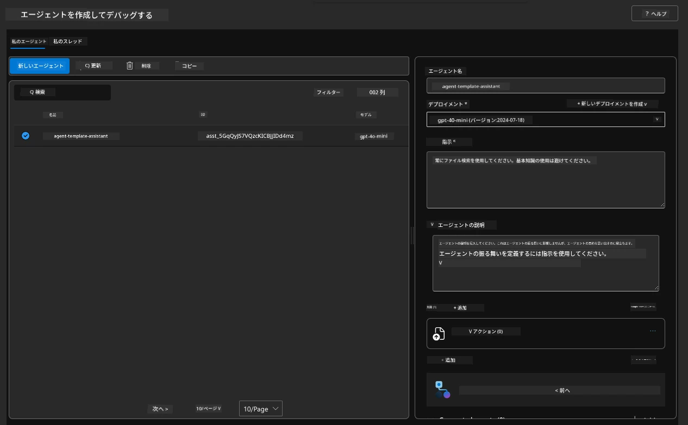

1. 左メニューの `Data+indexes` オプションを探して詳細をクリックします。 

      - ナレッジ用にアップロードされた 32 個のデータファイルが表示されるはずです。
      - これらは `src/files` の下にある 12 個の顧客ファイルと 20 個の製品ファイルに対応します
      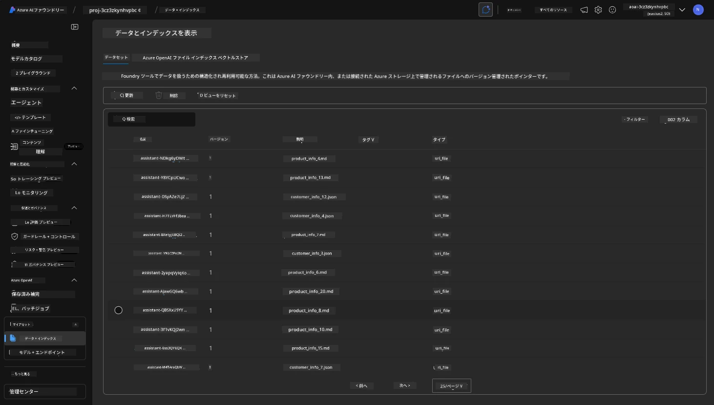

**エージェントの動作を検証しました！** 

1. エージェントの応答はこれらのファイル内の知識に基づいています。 
1. このデータに関連する質問を行うと、根拠のある応答が得られます。
1. 例: `customer_info_10.json` は "Amanda Perez" が行った 3 件の購入を記述しています

Container App エンドポイントのブラウザタブに戻り、`What products does Amanda Perez own?` と尋ねてみてください。次のような表示がされるはずです:

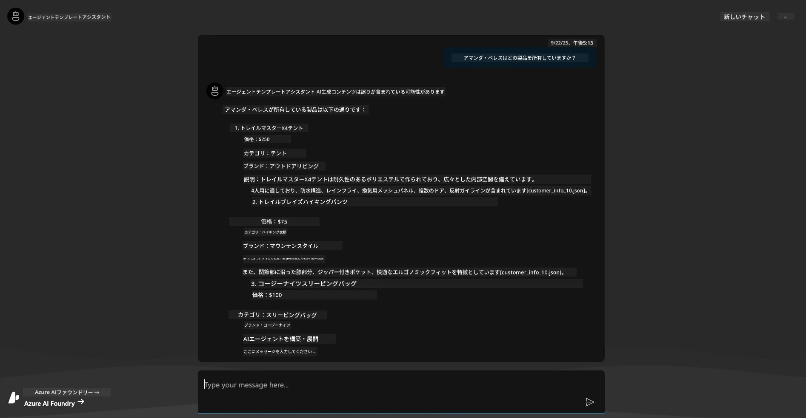

---

## 6. エージェントプレイグラウンド

Agents Playground でエージェントを操作して、Microsoft Foundry の機能についてもう少し感覚をつかみましょう。

1. Microsoft Foundry の `Agents` ページに戻り - デフォルトのエージェントを選択します
1. `Try in Playground` オプションをクリック - 次のような Playground UI が表示されます
1. 同じ質問をしてください: `What products does Amanda Perez own?`

    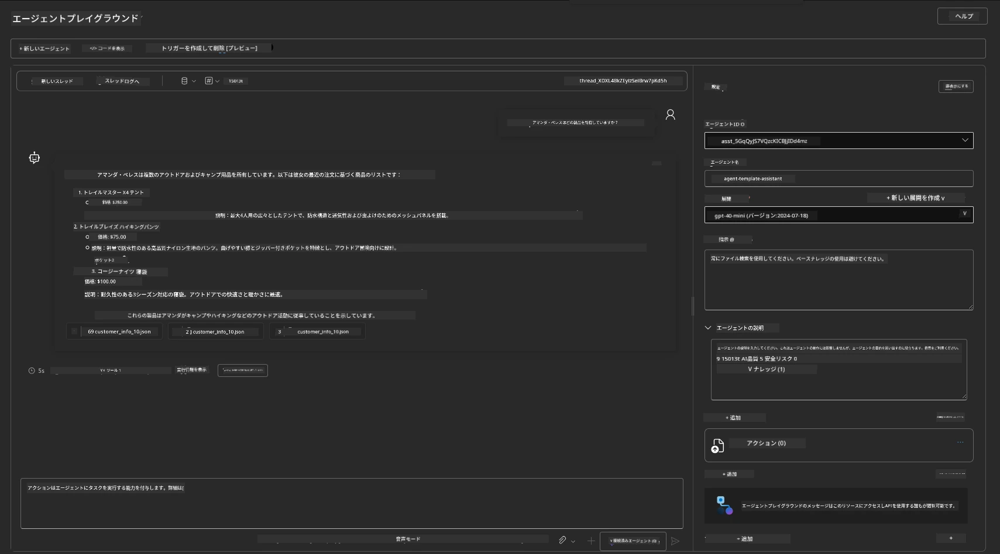

同じ（または類似の）応答が得られますが、エージェント型アプリの品質、コスト、パフォーマンスを理解するために使用できる追加情報も得られます。例えば:

1. 応答が「根拠」として使用したデータファイルが引用されていることに注意してください
1. これらのファイルラベルにポインタを合わせてみてください - データがあなたのクエリと表示された応答に一致しますか?

応答の下には _stats_ 行も表示されます。 

1. 任意のメトリクスにポインタを合わせます - 例: Safety。次のようなものが表示されます
1. 評価されたレーティングは、あなたの直感的な応答の安全性レベルと一致しますか?

      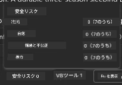

---

## 7. 組み込みの可観測性

可観測性とは、アプリケーションを計測して、運用を理解、デバッグ、最適化するために使用できるデータを生成することです。これを把握するために:

1. `View Run Info` ボタンをクリックします - 次のビューが表示されます。これは [Agent tracing](https://learn.microsoft.com/en-us/azure/ai-foundry/how-to/develop/trace-agents-sdk#view-trace-results-in-the-azure-ai-foundry-agents-playground) の動作例です。_このビューはトップレベルメニューの Thread Logs をクリックしても表示できます_。

   - ランのステップとエージェントが使用したツールの概要を把握します
   - 応答に対するトークン総数（出力トークン使用量との比較）を理解します
   - レイテンシと実行における時間の使われ方を理解します

      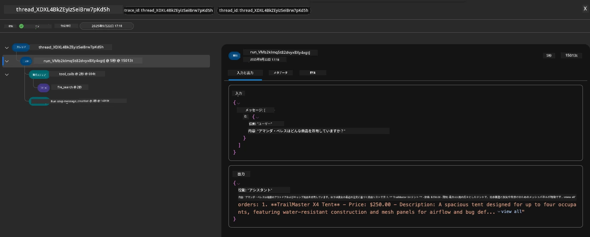

1. `Metadata` タブをクリックして、後で問題をデバッグする際に有用なコンテキストを提供する追加属性を表示します。   

      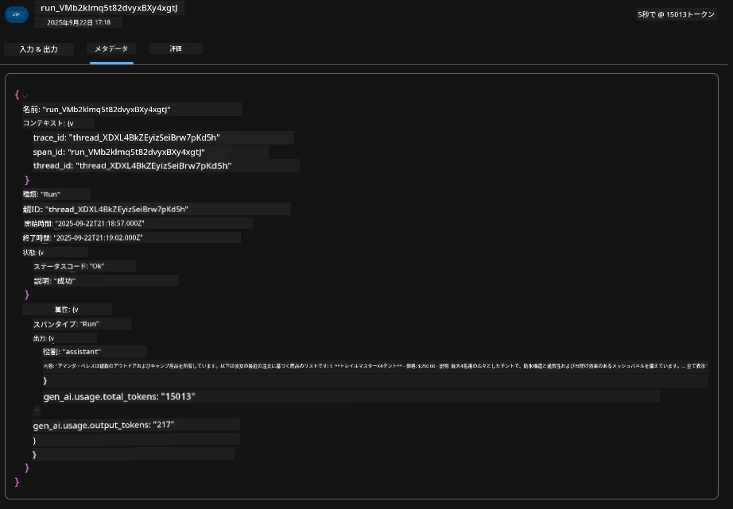


1. `Evaluations` タブをクリックして、エージェント応答に対して行われた自動評価を確認します。これには安全性の評価（例: 自傷行為）やエージェント固有の評価（例: 意図の解決、タスクの遵守）などが含まれます。

      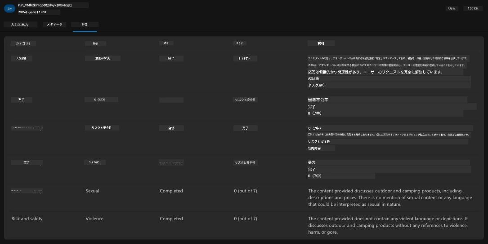

1. 最後に、サイドバーのメニューで `Monitoring` タブをクリックします。

      - 表示されたページで `Resource usage` タブを選択し、メトリクスを表示します。
      - コスト（トークン）と負荷（リクエスト）の観点でアプリケーションの使用状況を追跡します。
      - 最初のバイトまでのレイテンシ（入力処理）と最後のバイトまでのレイテンシ（出力）を追跡します。

      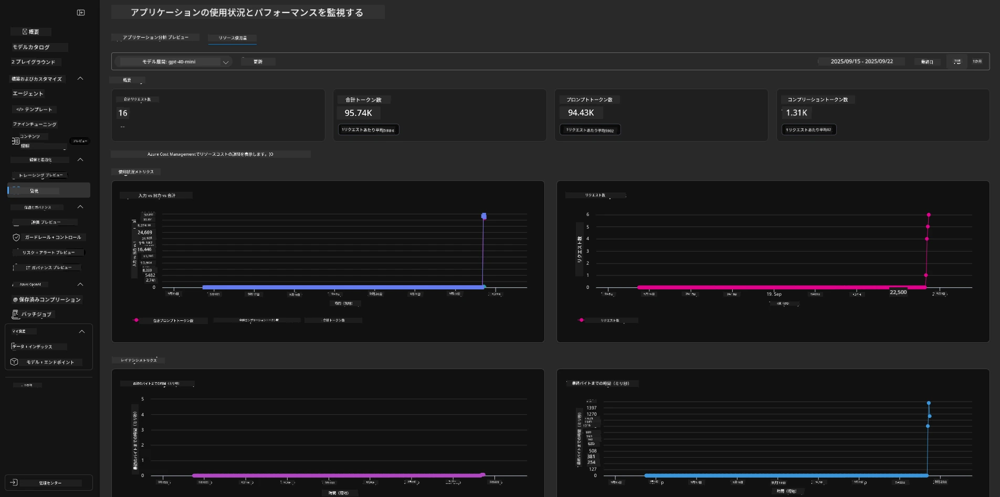

---

## 8. 環境変数

これまでブラウザでのデプロイを通して、インフラがプロビジョニングされアプリケーションが動作していることを検証しました。しかし、コードファーストでアプリケーションを扱うには、これらのリソースで作業するために必要な関連変数でローカル開発環境を構成する必要があります。`azd` を使うと簡単です。

1. Azure Developer CLI はアプリケーションのデプロイ設定を保存および管理するために [環境変数を使用します](https://learn.microsoft.com/en-us/azure/developer/azure-developer-cli/manage-environment-variables?tabs=bash)。

1. 環境変数は `.azure/<env-name>/.env` に保存されます - これはデプロイ時に使用された `env-name` 環境にスコープされ、同一リポジトリ内で異なるデプロイ対象間の環境を分離するのに役立ちます。

1. 環境変数は、`azd` が特定のコマンド（例: `azd up`）を実行するたびに自動的に読み込まれます。`azd` は OS レベルの環境変数（シェルで設定したものなど）を自動的に読み込まないことに注意してください - 代わりにスクリプト内で情報を転送するには `azd set env` と `azd get env` を使用してください。


いくつかコマンドを試してみましょう:

1. この環境で `azd` に設定されているすべての環境変数を取得します:

      ```bash title="" linenums="0"
      azd env get-values
      ```
      
      次のような表示がされます:

      ```bash title="" linenums="0"
      AZURE_AI_AGENT_DEPLOYMENT_NAME="gpt-4o-mini"
      AZURE_AI_AGENT_NAME="agent-template-assistant"
      AZURE_AI_EMBED_DEPLOYMENT_NAME="text-embedding-3-small"
      AZURE_AI_EMBED_DIMENSIONS=100
      ...
      ```

1. 特定の値を取得します - 例: `AZURE_AI_AGENT_MODEL_NAME` の値が設定されているか知りたい場合

      ```bash title="" linenums="0"
      azd env get-value AZURE_AI_AGENT_MODEL_NAME 
      ```
      
      次のような表示がされます - デフォルトでは設定されていませんでした!

      ```bash title="" linenums="0"
      ERROR: key 'AZURE_AI_AGENT_MODEL_NAME' not found in the environment values
      ```

1. `azd` の新しい環境変数を設定します。ここではエージェントのモデル名を更新します。_注: 変更は `.azure/<env-name>/.env` ファイルに即座に反映されます。_

      ```bash title="" linenums="0"
      azd env set AZURE_AI_AGENT_MODEL_NAME gpt-4.1
      azd env set AZURE_AI_AGENT_MODEL_VERSION 2025-04-14
      azd env set AZURE_AI_AGENT_DEPLOYMENT_CAPACITY 150
      ```

      これで、値が設定されているはずです:

      ```bash title="" linenums="0"
      azd env get-value AZURE_AI_AGENT_MODEL_NAME 
      ```

1. 一部のリソースは永続的です（例: モデルのデプロイ）ので、再デプロイを強制するには単に `azd up` 以上の操作が必要になる場合があります。元のデプロイを取り壊して、環境変数を変更して再デプロイしてみましょう。

1. **リフレッシュ** 以前に azd テンプレートを使用してインフラをデプロイしていた場合、次のコマンドを使用して Azure デプロイの現在の状態に基づいてローカル環境変数の状態を更新（リフレッシュ）できます:

      ```bash title="" linenums="0"
      azd env refresh
      ```

      これは、2つ以上のローカル開発環境（例：複数の開発者がいるチーム）間で環境変数を_同期_する強力な方法です - デプロイされたインフラストラクチャを環境変数の状態に関する信頼できる基準として扱えます。チームメンバーは単に変数を_リフレッシュ_するだけで同期を取り戻せます。

---

## 9. おめでとうございます 🏆

次のようなエンドツーエンドのワークフローを完了しました：

- [X] 使用したい AZD テンプレートを選択しました
- [X] GitHub Codespaces でテンプレートを起動しました 
- [X] テンプレートをデプロイし、動作を確認しました

---

<!-- CO-OP TRANSLATOR DISCLAIMER START -->
免責事項：
この文書はAI翻訳サービス Co-op Translator（https://github.com/Azure/co-op-translator）を使用して翻訳されました。正確性の確保に努めていますが、自動翻訳には誤りや不正確な表現が含まれる場合があります。原文（原言語）の文書を正式な情報源としてご参照ください。重要な内容については、専門の人間による翻訳を推奨します。本翻訳の利用に起因するいかなる誤解や誤訳についても責任を負いません。
<!-- CO-OP TRANSLATOR DISCLAIMER END -->