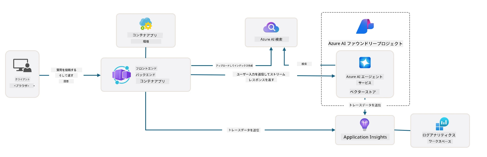

<!--
CO_OP_TRANSLATOR_METADATA:
{
  "original_hash": "4e403f041411361140d6beb88ab2a181",
  "translation_date": "2025-09-24T10:00:59+00:00",
  "source_file": "workshop/docs/instructions/3-Deconstruct-AI-Template.md",
  "language_code": "ja"
}
-->
# 3. テンプレートを分解する

!!! tip "このモジュールの終了時にできるようになること"

    - [ ] 項目
    - [ ] 項目
    - [ ] 項目
    - [ ] **Lab 3:** 

---

AZDテンプレートとAzure Developer CLI (`azd`)を使用すると、サンプルコード、インフラストラクチャ、設定ファイルを備えた標準化されたリポジトリを利用して、AI開発を迅速に開始できます。これらはすぐにデプロイ可能な_スタータープロジェクト_の形で提供されます。

**しかし、今はプロジェクト構造とコードベースを理解し、AZDテンプレートをカスタマイズできるようになる必要があります。AZDに関する事前知識や経験がなくても大丈夫です！**

---

## 1. GitHub Copilotを有効化する

### 1.1 GitHub Copilot Chatをインストールする

[GitHub Copilotのエージェントモード](https://code.visualstudio.com/docs/copilot/chat/chat-agent-mode)を試してみましょう。自然言語でタスクを高レベルで説明し、実行を支援してもらうことができます。このラボでは、月間完了数とチャットインタラクションに制限がある[Copilot Freeプラン](https://github.com/github-copilot/signup)を使用します。

拡張機能はマーケットプレイスからインストールできますが、Codespaces環境にはすでに利用可能な状態になっているはずです。_Copilotアイコンのドロップダウンから「Open Chat」をクリックし、「What can you do?」のようなプロンプトを入力してください_。ログインを求められる場合があります。**GitHub Copilot Chatの準備が整いました**。

### 1.2 MCPサーバーをインストールする

エージェントモードを効果的に使用するには、知識を取得したりアクションを実行するための適切なツールへのアクセスが必要です。ここでMCPサーバーが役立ちます。以下のサーバーを設定します：

1. [Azure MCP Server](../../../../../workshop/docs/instructions)
1. [Microsoft Docs MCP Server](../../../../../workshop/docs/instructions)

これを有効化するには：

1. `.vscode/mcp.json`というファイルを作成します（存在しない場合）
1. 以下をそのファイルにコピーし、サーバーを起動します！
   ```json title=".vscode/mcp.json"
   {
      "servers": {
         "Azure MCP Server": {
            "command": "npx",
            "args": [
            "-y",
            "@azure/mcp@latest",
            "server",
            "start"
            ]
         },
         "microsoft.docs.mcp": {
            "type": "http",
            "url": "https://learn.microsoft.com/api/mcp"
         }
      }
   }
   ```

??? warning "`npx`がインストールされていないというエラーが表示される場合があります（修正方法を展開して確認）"

      修正するには、`.devcontainer/devcontainer.json`ファイルを開き、featuresセクションに以下の行を追加します。その後、コンテナを再構築してください。これで`npx`がインストールされるはずです。

      ```title="" linenums="0"
         "features": {
            "ghcr.io/devcontainers/features/node:1": {},
            ...
         },
      ```

---

### 1.3 GitHub Copilot Chatをテストする

**まず、VS Codeのコマンドラインから`az login`を使用してAzureに認証します。**

これでAzureサブスクリプションのステータスを照会したり、デプロイ済みのリソースや設定について質問できるようになります。以下のプロンプトを試してみてください：

1. `List my Azure resource groups`
1. `#foundry list my current deployments`

また、Azureのドキュメントについて質問し、Microsoft Docs MCPサーバーに基づいた回答を得ることもできます。以下のプロンプトを試してみてください：

1. `#microsoft_docs_search What is Azure Developer CLI?`
1. `#microsoft_docs_search Show me a Python tutorial to chat with deployed model`

さらに、タスクを完了するためのコードスニペットを要求することもできます。以下のプロンプトを試してみてください：

1. `Give me a Python code example that uses AAD for an interactive chat client`

`Ask`モードでは、コピー＆ペーストして試せるコードが提供されます。`Agent`モードではさらに進んで、関連するリソースの作成、セットアップスクリプト、ドキュメントなどを提供し、タスクの実行を支援します。

**これでテンプレートリポジトリを探索する準備が整いました**

---

## 2. アーキテクチャを分解する

??? prompt "ASK: docs/images/architecture.pngにあるアプリケーションアーキテクチャを1段落で説明してください"

      このアプリケーションはAzure上に構築されたAI対応のチャットアプリケーションで、最新のエージェントベースのアーキテクチャを示しています。このソリューションは、ユーザー入力を処理し、AIエージェントを通じて知的な応答を生成するメインアプリケーションコードをホストするAzure Container Appを中心に構成されています。
      
      アーキテクチャはAzure AI Foundry ProjectをAI機能の基盤として活用し、GPT-4o-miniなどの言語モデルやエージェント機能を提供するAzure AI Servicesに接続します。ユーザーのインタラクションはReactベースのフロントエンドを通じてFastAPIバックエンドに流れ、AIエージェントサービスと通信してコンテキストに基づいた応答を生成します。
      
      システムはファイル検索またはAzure AI Searchサービスを通じた知識検索機能を組み込み、アップロードされたドキュメントから情報を取得して引用することができます。運用の優秀性を確保するために、アーキテクチャにはApplication InsightsとLog Analytics Workspaceを使用した包括的なモニタリングが含まれ、トレース、ログ記録、パフォーマンス最適化を行います。
      
      Azure StorageはアプリケーションデータやファイルアップロードのためのBlobストレージを提供し、Managed Identityは資格情報を保存せずにAzureリソース間の安全なアクセスを保証します。このソリューション全体は、需要に応じて自動的にスケールし、Azureの管理サービスエコシステムを通じてセキュリティ、モニタリング、CI/CD機能を備えたスケーラブルで保守性の高い設計となっています。



---

## 3. リポジトリ構造

!!! prompt "ASK: テンプレートフォルダ構造を説明してください。視覚的な階層図から始めてください。"

??? info "ANSWER: 視覚的な階層図"

      ```bash title="" 
      get-started-with-ai-agents/
      ├── 📋 設定とセットアップ
      │   ├── azure.yaml                    # Azure Developer CLI設定
      │   ├── docker-compose.yaml           # ローカル開発コンテナ
      │   ├── pyproject.toml                # Pythonプロジェクト設定
      │   ├── requirements-dev.txt          # 開発依存関係
      │   └── .devcontainer/                # VS Code開発コンテナ設定
      │
      ├── 🏗️ インフラストラクチャ (infra/)
      │   ├── main.bicep                    # メインインフラストラクチャテンプレート
      │   ├── api.bicep                     # API固有のリソース
      │   ├── main.parameters.json          # インフラストラクチャパラメータ
      │   └── core/                         # モジュール化されたインフラストラクチャコンポーネント
      │       ├── ai/                       # AIサービス設定
      │       ├── host/                     # ホスティングインフラ
      │       ├── monitor/                  # モニタリングとログ記録
      │       ├── search/                   # Azure AI Search設定
      │       ├── security/                 # セキュリティとアイデンティティ
      │       └── storage/                  # ストレージアカウント設定
      │
      ├── 💻 アプリケーションソース (src/)
      │   ├── api/                          # バックエンドAPI
      │   │   ├── main.py                   # FastAPIアプリケーションエントリ
      │   │   ├── routes.py                 # APIルート定義
      │   │   ├── search_index_manager.py   # 検索機能
      │   │   ├── data/                     # APIデータ処理
      │   │   ├── static/                   # 静的ウェブアセット
      │   │   └── templates/                # HTMLテンプレート
      │   ├── frontend/                     # React/TypeScriptフロントエンド
      │   │   ├── package.json              # Node.js依存関係
      │   │   ├── vite.config.ts            # Viteビルド設定
      │   │   └── src/                      # フロントエンドソースコード
      │   ├── data/                         # サンプルデータファイル
      │   │   └── embeddings.csv            # 事前計算された埋め込み
      │   ├── files/                        # ナレッジベースファイル
      │   │   ├── customer_info_*.json      # 顧客データサンプル
      │   │   └── product_info_*.md         # 製品ドキュメント
      │   ├── Dockerfile                    # コンテナ設定
      │   └── requirements.txt              # Python依存関係
      │
      ├── 🔧 自動化とスクリプト (scripts/)
      │   ├── postdeploy.sh/.ps1           # デプロイ後のセットアップ
      │   ├── setup_credential.sh/.ps1     # 資格情報設定
      │   ├── validate_env_vars.sh/.ps1    # 環境変数検証
      │   └── resolve_model_quota.sh/.ps1  # モデルクォータ管理
      │
      ├── 🧪 テストと評価
      │   ├── tests/                        # ユニットおよび統合テスト
      │   │   └── test_search_index_manager.py
      │   ├── evals/                        # エージェント評価フレームワーク
      │   │   ├── evaluate.py               # 評価ランナー
      │   │   ├── eval-queries.json         # テストクエリ
      │   │   └── eval-action-data-path.json
      │   ├── sandbox/                      # 開発プレイグラウンド
      │   │   ├── 1-quickstart.py           # 入門例
      │   │   └── aad-interactive-chat.py   # 認証例
      │   └── airedteaming/                 # AI安全性評価
      │       └── ai_redteaming.py          # レッドチームテスト
      │
      ├── 📚 ドキュメント (docs/)
      │   ├── deployment.md                 # デプロイガイド
      │   ├── local_development.md          # ローカルセットアップ手順
      │   ├── troubleshooting.md            # よくある問題と修正方法
      │   ├── azure_account_setup.md        # Azureの事前準備
      │   └── images/                       # ドキュメントアセット
      │
      └── 📄 プロジェクトメタデータ
         ├── README.md                     # プロジェクト概要
         ├── CODE_OF_CONDUCT.md           # コミュニティガイドライン
         ├── CONTRIBUTING.md              # 貢献ガイド
         ├── LICENSE                      # ライセンス条件
         └── next-steps.md                # デプロイ後のガイダンス
      ```

### 3.1 コアアプリケーションアーキテクチャ

このテンプレートは**フルスタックウェブアプリケーション**パターンに従っています：

- **バックエンド**: Azure AI統合を備えたPython FastAPI
- **フロントエンド**: Viteビルドシステムを使用したTypeScript/React
- **インフラストラクチャ**: クラウドリソース用のAzure Bicepテンプレート
- **コンテナ化**: 一貫したデプロイのためのDocker

### 3.2 インフラストラクチャコード (bicep)

インフラストラクチャ層は**Azure Bicep**テンプレートを使用してモジュール化されています：

   - **`main.bicep`**: すべてのAzureリソースをオーケストレーション
   - **`core/`モジュール**: 異なるサービスの再利用可能なコンポーネント
      - AIサービス (Azure OpenAI、AI Search)
      - コンテナホスティング (Azure Container Apps)
      - モニタリング (Application Insights、Log Analytics)
      - セキュリティ (Key Vault、Managed Identity)

### 3.3 アプリケーションソース (`src/`)

**バックエンドAPI (`src/api/`)**:

- FastAPIベースのREST API
- Azure AIエージェントサービス統合
- ナレッジ検索管理機能
- ファイルアップロードと処理機能

**フロントエンド (`src/frontend/`)**:

- 最新のReact/TypeScript SPA
- 高速開発と最適化されたビルドのためのVite
- エージェントとのインタラクション用チャットインターフェース

**ナレッジベース (`src/files/`)**:

- 顧客および製品データのサンプル
- ファイルベースのナレッジ検索を示す
- JSONおよびMarkdown形式の例

### 3.4 DevOpsと自動化

**スクリプト (`scripts/`)**:

- クロスプラットフォームのPowerShellおよびBashスクリプト
- 環境検証とセットアップ
- デプロイ後の設定
- モデルクォータ管理

**Azure Developer CLI統合**:

- `azure.yaml`設定による`azd`ワークフロー
- 自動プロビジョニングとデプロイ
- 環境変数管理

### 3.5 テストと品質保証

**評価フレームワーク (`evals/`)**:

- エージェントのパフォーマンス評価
- クエリ応答の品質テスト
- 自動評価パイプライン

**AI安全性 (`airedteaming/`)**:

- AI安全性のためのレッドチームテスト
- セキュリティ脆弱性スキャン
- 責任あるAIの実践

---

## 4. おめでとうございます 🏆

GitHub Copilot ChatとMCPサーバーを使用してリポジトリを探索することに成功しました。

- [X] Azure用GitHub Copilotを有効化
- [X] アプリケーションアーキテクチャを理解
- [X] AZDテンプレート構造を探索

これで、このテンプレートの_インフラストラクチャコード_資産についての感覚をつかむことができました。次はAZDの設定ファイルを見ていきます。

---

