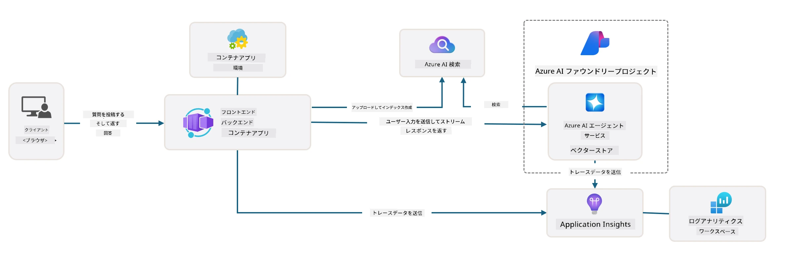

# 3. テンプレートを分解する

!!! tip "このモジュールの終了時には次のことができるようになります"

    - [ ] Azure支援のためにMCPサーバーでGitHub Copilotを有効化する
    - [ ] AZDテンプレートのフォルダー構成とコンポーネントを理解する
    - [ ] インフラストラクチャ as code（Bicep）の構成パターンを探る
    - [ ] **ラボ 3:** GitHub Copilotを使用してリポジトリのアーキテクチャを調査および理解する 

---


With AZD templates and the Azure Developer CLI (`azd`) we can quickly jumpstart our AI development journey with standardized repositories that provide sample code, infrastructure and configuration files - in the form of a ready-to-deploy _starter_ project.

**But now, we need to understand the project structure and codebase - and be able to customize the AZD template - without any prior experience or understanding of AZD!**

---

## 1. GitHub Copilot を有効化する

### 1.1 GitHub Copilot Chat をインストールする

It's time to explore [Agent Mode搭載のGitHub Copilot](https://code.visualstudio.com/docs/copilot/chat/chat-agent-mode). Now, we can use natural language to describe our task at a high level, and get assistance in execution. For this lab, we'll use the [Copilotの無料プラン](https://github.com/github-copilot/signup) which has a monthly limit for completions and chat interactions.

The extension can be installed from the marketplace, but should already be available in your Codespaces environment. _Click `Open Chat` from the Copilot icon drop-down - and type a prompt like `What can you do?`_ - you may be prompted to log in. **GitHub Copilot Chat is ready**.

### 1.2. MCP サーバーをインストールする

For Agent mode to be effective, it needs access to the right tools to help it retrieve knowledge or take actions. This is where MCP servers can help. We'll configure the following servers:

1. [Azure MCP サーバー](../../../../../workshop/docs/instructions)
1. [Microsoft Docs MCP サーバー](../../../../../workshop/docs/instructions)

To activate these:

1. Create a file called `.vscode/mcp.json` if it does not exist
1. Copy the following into that file - and start the servers!
   ```json title=".vscode/mcp.json"
   {
      "servers": {
         "Azure MCP Server": {
            "command": "npx",
            "args": [
            "-y",
            "@azure/mcp@latest",
            "server",
            "start"
            ]
         },
         "microsoft.docs.mcp": {
            "type": "http",
            "url": "https://learn.microsoft.com/api/mcp"
         }
      }
   }
   ```

??? warning "npx がインストールされていないというエラーが出る場合があります（修正方法を見るにはクリック）"

      To fix,this open the `.devcontainer/devcontainer.json` file and add this line to the features section. Then rebuild the container. You should now have `npx` installed.

      ```title="" linenums="0"
         "features": {
            "ghcr.io/devcontainers/features/node:1": {},
            ...
         },
      ```

---

### 1.3. GitHub Copilot Chat をテストする

**First use `az login` to authenticate with Azure from VS Code command line.**

You should now be able to query your Azure subscription status, and ask questions about deployed resources or configuration. Try these prompts:

1. `List my Azure resource groups`
1. `#foundry list my current deployments`

You can also ask questions about Azure documentation and get responses grounded in the Microsoft Docs MCP server. Try these prompts:

1. `#microsoft_docs_search What is Azure Developer CLI?`
1. `#microsoft_docs_search Show me a Python tutorial to chat with deployed model`

Or you can ask for code snippets to complete a task. Try this prompt.

1. `Give me a Python code example that uses AAD for an interactive chat client`

In `Ask` mode, this will provide code that you can copy-paste and try out. In `Agent` mode, this might go a step further and create the relevant resources for you - including setup scripts and documentation - to help you execute that task.

**You are now equipped to start exploring the template repository**

---

## 2. アーキテクチャを分解する

??? prompt "ASK: docs/images/architecture.png のアプリケーションアーキテクチャを1段落で説明してください"

      This application is an AI-powered chat application built on Azure that demonstrates a modern agent-based architecture. The solution centers around an Azure Container App that hosts the main application code, which processes user input and generates intelligent responses through an AI agent. 
      
      The architecture leverages Microsoft Foundry Project as the foundation for AI capabilities, connecting to Azure AI Services that provide the underlying language models (such as gpt-4.1-mini) and agent functionality. User interactions flow through a React-based frontend to a FastAPI backend that communicates with the AI agent service for generating contextual responses. 
      
      The system incorporates knowledge retrieval capabilities through either file search or Azure AI Search service, allowing the agent to access and cite information from uploaded documents. For operational excellence, the architecture includes comprehensive monitoring through Application Insights and Log Analytics Workspace for tracing, logging, and performance optimization. 
      
      Azure Storage provides blob storage for application data and file uploads, while Managed Identity ensures secure access between Azure resources without storing credentials. The entire solution is designed for scalability and maintainability, with the containerized application automatically scaling based on demand while providing built-in security, monitoring, and CI/CD capabilities through Azure's managed services ecosystem.



---

## 3. リポジトリ構成

!!! prompt "ASK: テンプレートのフォルダ構成を説明してください。視覚的な階層図から始めてください。"

??? info "ANSWER: 視覚的な階層図"

      ```bash title="" 
      get-started-with-ai-agents/
      ├── 📋 設定とセットアップ
      │   ├── azure.yaml                    # Azure Developer CLI の構成
      │   ├── docker-compose.yaml           # ローカル開発用コンテナ
      │   ├── pyproject.toml                # Python プロジェクトの構成
      │   ├── requirements-dev.txt          # 開発依存関係
      │   └── .devcontainer/                # VS Code Dev Container の設定
      │
      ├── 🏗️ インフラストラクチャ (infra/)
      │   ├── main.bicep                    # 主要なインフラテンプレート
      │   ├── api.bicep                     # API 固有のリソース
      │   ├── main.parameters.json          # インフラのパラメーター
      │   └── core/                         # モジュール化されたインフラコンポーネント
      │       ├── ai/                       # AI サービスの構成
      │       ├── host/                     # ホスティングインフラ
      │       ├── monitor/                  # 監視とログ
      │       ├── search/                   # Azure AI Search のセットアップ
      │       ├── security/                 # セキュリティとアイデンティティ
      │       └── storage/                  # ストレージアカウントの構成
      │
      ├── 💻 アプリケーションソース (src/)
      │   ├── api/                          # バックエンド API
      │   │   ├── main.py                   # FastAPI アプリケーションのエントリ
      │   │   ├── routes.py                 # API ルート定義
      │   │   ├── search_index_manager.py   # 検索機能
      │   │   ├── data/                     # API データ処理
      │   │   ├── static/                   # 静的ウェブ資産
      │   │   └── templates/                # HTML テンプレート
      │   ├── frontend/                     # React/TypeScript フロントエンド
      │   │   ├── package.json              # Node.js 依存関係
      │   │   ├── vite.config.ts            # Vite ビルド構成
      │   │   └── src/                      # フロントエンドのソースコード
      │   ├── data/                         # サンプルデータファイル
      │   │   └── embeddings.csv            # 事前計算済み埋め込み
      │   ├── files/                        # ナレッジベースファイル
      │   │   ├── customer_info_*.json      # 顧客データのサンプル
      │   │   └── product_info_*.md         # 製品ドキュメント
      │   ├── Dockerfile                    # コンテナ構成
      │   └── requirements.txt              # Python 依存関係
      │
      ├── 🔧 自動化とスクリプト (scripts/)
      │   ├── postdeploy.sh/.ps1           # デプロイ後のセットアップ
      │   ├── setup_credential.sh/.ps1     # 資格情報の構成
      │   ├── validate_env_vars.sh/.ps1    # 環境の検証
      │   └── resolve_model_quota.sh/.ps1  # モデルクォータ管理
      │
      ├── 🧪 テストと評価
      │   ├── tests/                        # ユニットおよび統合テスト
      │   │   └── test_search_index_manager.py
      │   ├── evals/                        # エージェント評価フレームワーク
      │   │   ├── evaluate.py               # 評価ランナー
      │   │   ├── eval-queries.json         # テストクエリ
      │   │   └── eval-action-data-path.json
      │   ├── sandbox/                      # 開発用プレイグラウンド
      │   │   ├── 1-quickstart.py           # 入門用の例
      │   │   └── aad-interactive-chat.py   # 認証の例
      │   └── airedteaming/                 # AI セーフティ評価
      │       └── ai_redteaming.py          # レッドチームテスト
      │
      ├── 📚 ドキュメント (docs/)
      │   ├── deployment.md                 # デプロイガイド
      │   ├── local_development.md          # ローカルセットアップ手順
      │   ├── troubleshooting.md            # 一般的な問題と対処法
      │   ├── azure_account_setup.md        # Azure の前提条件
      │   └── images/                       # ドキュメント用アセット
      │
      └── 📄 プロジェクトメタデータ
         ├── README.md                     # プロジェクト概要
         ├── CODE_OF_CONDUCT.md           # コミュニティガイドライン
         ├── CONTRIBUTING.md              # 貢献ガイド
         ├── LICENSE                      # ライセンス条項
         └── next-steps.md                # デプロイ後の手順
      ```

### 3.1. コアアプリのアーキテクチャ

This template follows a **full-stack web application** pattern with:

- <strong>バックエンド</strong>: Python FastAPI と Azure AI 統合
- <strong>フロントエンド</strong>: TypeScript/React と Vite ビルドシステム
- <strong>インフラストラクチャ</strong>: クラウドリソース用の Azure Bicep テンプレート
- <strong>コンテナ化</strong>: 一貫したデプロイのための Docker

### 3.2 インフラ as コード (bicep)

The infrastructure layer uses **Azure Bicep** templates organized modularly:

   - **`main.bicep`**: Orchestrates all Azure resources
   - **`core/` modules**: Reusable components for different services
      - AI services (Microsoft Foundry Models, AI Search)
      - Container hosting (Azure Container Apps)
      - Monitoring (Application Insights, Log Analytics)
      - Security (Key Vault, Managed Identity)

### 3.3 アプリケーションソース (`src/`)

**バックエンド API (`src/api/`)**:

- FastAPI ベースの REST API
- Foundry Agents 統合
- ナレッジ取得のための検索インデックス管理
- ファイルアップロードと処理機能

**フロントエンド (`src/frontend/`)**:

- 最新の React/TypeScript SPA
- 高速開発と最適化されたビルドのための Vite
- エージェントとのやり取り用チャットインターフェース

**ナレッジベース (`src/files/`)**:

- 顧客および製品のサンプルデータ
- ファイルベースのナレッジ取得を示す
- JSON と Markdown フォーマットの例


### 3.4 DevOps と自動化

**スクリプト (`scripts/`)**:

- クロスプラットフォームの PowerShell と Bash スクリプト
- 環境の検証とセットアップ
- デプロイ後の構成
- モデルクォータ管理

**Azure Developer CLI 統合**:

- `azure.yaml` 構成 for `azd` ワークフロー
- 自動プロビジョニングとデプロイ
- 環境変数管理

### 3.5 テストと品質保証

**評価フレームワーク (`evals/`)**:

- エージェントの性能評価
- クエリ-応答の品質テスト
- 自動評価パイプライン

**AI セーフティ (`airedteaming/`)**:

- AI セーフティのためのレッドチームテスト
- セキュリティ脆弱性スキャン
- 責任ある AI の実践

---

## 4. おめでとうございます 🏆

You successfully used GitHub Copilot Chat with MCP servers, to explore the repository.

- [X] Azure 用に GitHub Copilot を有効化した
- [X] アプリケーションアーキテクチャを理解した
- [X] AZD テンプレート構造を調査した

This gives you a sense of the _インフラストラクチャ as code_ assets for this template. Next, we'll look at the configuration file for AZD.

---

<!-- CO-OP TRANSLATOR DISCLAIMER START -->
**免責事項**:
本書類はAI翻訳サービス [Co-op Translator](https://github.com/Azure/co-op-translator) を使用して翻訳されました。正確性には努めていますが、自動翻訳には誤りや不正確さが含まれている可能性があることにご注意ください。原文（原言語での文書）を公式な出典と見なしてください。重要な情報については、専門の人間による翻訳を推奨します。本翻訳の利用により生じた誤解または誤訳について、当社は責任を負いません。
<!-- CO-OP TRANSLATOR DISCLAIMER END -->