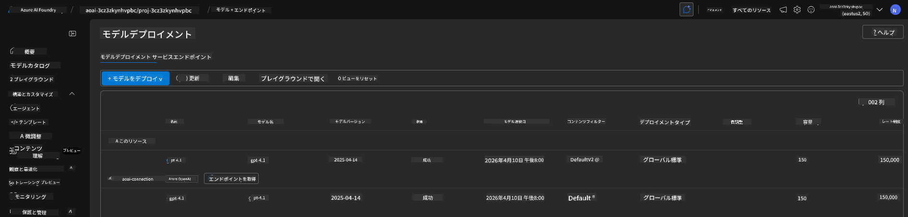

<!--
CO_OP_TRANSLATOR_METADATA:
{
  "original_hash": "6539a34c770f3ceff282370d72ee74dc",
  "translation_date": "2025-09-24T10:00:32+00:00",
  "source_file": "workshop/docs/instructions/6-Teardown-Infrastructure.md",
  "language_code": "ja"
}
-->
# 6. インフラの解体

!!! tip "このモジュールの終わりまでにできるようになること"

    - [ ] 項目
    - [ ] 項目
    - [ ] 項目

---

## ボーナス演習

プロジェクトを解体する前に、数分間オープンエンドな探索を行ってみましょう。

!!! danger "NITYA-TODO: 試してみるプロンプトをいくつか考案する"

---

## インフラの解除

1. インフラを解体するのは以下のように簡単です：
      
      ```bash title="" linenums="0"
      azd down --purge
      ```

1. `--purge` フラグを使用すると、ソフト削除された Cognitive Service リソースも削除され、これらのリソースが保持していたクォータが解放されます。完了すると、以下のような結果が表示されます：
      
      ```bash title="" linenums="0"
      ? Total resources to delete: 11, are you sure you want to continue? Yes
      Deleting your resources can take some time.
      (✓) Done: Deleted resource group rg-nitya-mshack-azd
      (✓) Done: Purging Cognitive Account: aoai-3cz3zkynhvpbc

      SUCCESS: Your application was removed from Azure in 11 minutes 4 seconds.
      ```

1. （オプション）ここで再度 `azd up` を実行すると、環境変数がローカルの `.azure` フォルダに変更（保存）されたため、gpt-4.1 モデルがデプロイされることに気付くでしょう。

      以下はモデルのデプロイ状況の **前** の状態です：

      

      そして、これが **後** の状態です：
      

---

