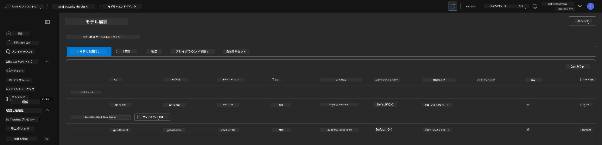
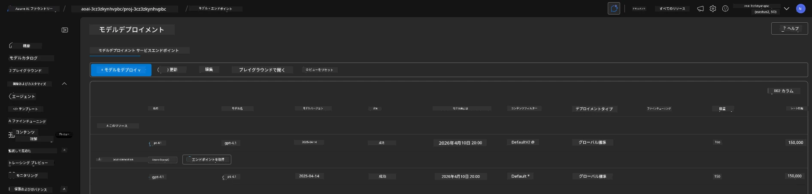

# 6. インフラの撤去

!!! tip "このモジュールの終了時には以下ができるようになります"

    - [ ] リソースのクリーンアップとコスト管理の重要性を理解する
    - [ ] インフラを安全に廃止するために `azd down` を使用する
    - [ ] 必要に応じてソフト削除された Cognitive Service リソースを復元する
    - [ ] **Lab 6:** Azure リソースをクリーンアップし、削除を確認する

---

## ボーナス演習

プロジェクトを解体する前に、数分間かけて自由に探索してみてください。

!!! info "これらの探索プロンプトを試してみてください"

    **GitHub Copilotで実験：**
    
    1. 尋ねる: `マルチエージェントのシナリオに試せる他のAZDテンプレートは何ですか？`
    2. 尋ねる: `ヘルスケアのユースケース向けにエージェントの指示をどのようにカスタマイズできますか？`
    3. 尋ねる: `コスト最適化を制御する環境変数は何ですか？`
    
    **Azure ポータルを探索する：**
    
    1. デプロイに関する Application Insights のメトリクスを確認する
    2. プロビジョニングしたリソースのコスト分析を確認する
    3. Microsoft Foundry ポータルのエージェントプレイグラウンドをもう一度探索する

---

## インフラの廃止

1. インフラの撤去は次のように簡単です:
      
      ```bash title="" linenums="0"
      azd down --purge
      ```
1. `--purge` フラグは、ソフト削除された Cognitive Service リソースもパージして、それらが保持しているクォータを解放することを保証します。完了すると、次のような表示がされます:
      
      ```bash title="" linenums="0"
      ? Total resources to delete: 11, are you sure you want to continue? Yes
      Deleting your resources can take some time.
      (✓) Done: Deleted resource group rg-nitya-mshack-azd
      (✓) Done: Purging Cognitive Account: aoai-3cz3zkynhvpbc

      SUCCESS: Your application was removed from Azure in 11 minutes 4 seconds.
      ```

1.（オプション）ここで再度 `azd up` を実行すると、ローカルの `.azure` フォルダーで環境変数が変更（および保存）されたため、gpt-4.1 モデルがデプロイされるのがわかります。 

      モデルのデプロイ（**前**）はこちら:

      

      そしてこちらが**後**です:
      

---

<!-- CO-OP TRANSLATOR DISCLAIMER START -->
免責事項：
本書はAI翻訳サービス「Co-op Translator」（https://github.com/Azure/co-op-translator）を用いて翻訳されました。正確性には努めておりますが、自動翻訳には誤りや不正確な部分が含まれることがあります。原文（オリジナルの言語による文書）を正式な情報源としてご参照ください。重要な内容については、専門の人による翻訳を推奨します。本翻訳の使用により生じたいかなる誤解や誤訳についても、当方は責任を負いません。
<!-- CO-OP TRANSLATOR DISCLAIMER END -->