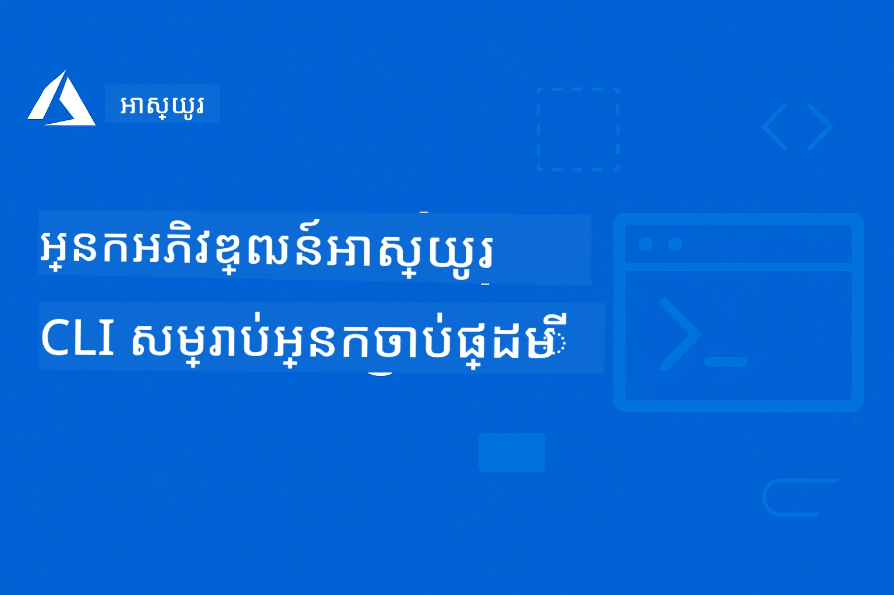

# AZD សម្រាប់អ្នកចាប់ផ្តើម៖ ដំណើរការសិក្សាមានរចនាសម្ព័ន្ធ

 

[](https://GitHub.com/microsoft/azd-for-beginners/watchers/)
[](https://GitHub.com/microsoft/azd-for-beginners/network/)
[](https://GitHub.com/microsoft/azd-for-beginners/stargazers/)

[](https://discord.com/invite/nkVh3dp)
[](https://discord.gg/nTYy5BXMWG)

---

### ការប្រែសម្រួលស្វ័យប្រវត្តិ (បន្តទាន់សម័យជានិច្ច)

<!-- CO-OP TRANSLATOR LANGUAGES TABLE START -->
[Arabic](../ar/README.md) | [Bengali](../bn/README.md) | [Bulgarian](../bg/README.md) | [Burmese (Myanmar)](../my/README.md) | [Chinese (Simplified)](../zh-CN/README.md) | [Chinese (Traditional, Hong Kong)](../zh-HK/README.md) | [Chinese (Traditional, Macau)](../zh-MO/README.md) | [Chinese (Traditional, Taiwan)](../zh-TW/README.md) | [Croatian](../hr/README.md) | [Czech](../cs/README.md) | [Danish](../da/README.md) | [Dutch](../nl/README.md) | [Estonian](../et/README.md) | [Finnish](../fi/README.md) | [French](../fr/README.md) | [German](../de/README.md) | [Greek](../el/README.md) | [Hebrew](../he/README.md) | [Hindi](../hi/README.md) | [Hungarian](../hu/README.md) | [Indonesian](../id/README.md) | [Italian](../it/README.md) | [Japanese](../ja/README.md) | [Kannada](../kn/README.md) | [Khmer](./README.md) | [Korean](../ko/README.md) | [Lithuanian](../lt/README.md) | [Malay](../ms/README.md) | [Malayalam](../ml/README.md) | [Marathi](../mr/README.md) | [Nepali](../ne/README.md) | [Nigerian Pidgin](../pcm/README.md) | [Norwegian](../no/README.md) | [Persian (Farsi)](../fa/README.md) | [Polish](../pl/README.md) | [Portuguese (Brazil)](../pt-BR/README.md) | [Portuguese (Portugal)](../pt-PT/README.md) | [Punjabi (Gurmukhi)](../pa/README.md) | [Romanian](../ro/README.md) | [Russian](../ru/README.md) | [Serbian (Cyrillic)](../sr/README.md) | [Slovak](../sk/README.md) | [Slovenian](../sl/README.md) | [Spanish](../es/README.md) | [Swahili](../sw/README.md) | [Swedish](../sv/README.md) | [Tagalog (Filipino)](../tl/README.md) | [Tamil](../ta/README.md) | [Telugu](../te/README.md) | [Thai](../th/README.md) | [Turkish](../tr/README.md) | [Ukrainian](../uk/README.md) | [Urdu](../ur/README.md) | [Vietnamese](../vi/README.md)

> **ចូលចិត្តក្លោនក្នុងកុំព្យូទ័រផ្ទាល់?**
>
> រក្សាទុកថា រ៉ីបូស៊ីតូរនេះរួមមានការប្រែសម្រួលជាង 50 ភាសា ដែលធ្វើឲ្យទំហំការទាញយកធំខ្លាំង។ ដើម្បីក្លោនដោយគ្មានការប្រែសម្រួល ត្រូវប្រើ sparse checkout:
>
> **Bash / macOS / Linux:**
> ```bash
> git clone --filter=blob:none --sparse https://github.com/microsoft/AZD-for-beginners.git
> cd AZD-for-beginners
> git sparse-checkout set --no-cone '/*' '!translations' '!translated_images'
> ```
>
> **CMD (Windows):**
> ```cmd
> git clone --filter=blob:none --sparse https://github.com/microsoft/AZD-for-beginners.git
> cd AZD-for-beginners
> git sparse-checkout set --no-cone "/*" "!translations" "!translated_images"
> ```
>
> វានៅជួយអ្នកទាំងអស់ដែលត្រូវការ ដើម្បីបញ្ចប់វគ្គសិក្សានេះដោយទាញយកបានលឿនជាងមុន។
<!-- CO-OP TRANSLATOR LANGUAGES TABLE END -->

## 🆕 អ្វីថ្មីៗនៅក្នុង azd ថ្ងៃនេះ

Azure Developer CLI បានពង្រីកពីកម្មវិធីបណ្តាញប្រពៃណី និង API ទៅផ្នែកដទៃទៀត។ ថ្ងៃនេះ azd គឺជាឧបករណ៍តែមួយសម្រាប់ចេញផ្សាយកម្មវិធីមួយណាក៏បានទៅលើ Azure—រួមទាំងកម្មវិធីដែលមានសមត្ថភាព AI និងភ្នាក់ងារឆ្លាតវៃ។

នេះមានន័យដល់អ្នកដូចជា៖

- **ភ្នាក់ងារ AI ឥឡូវនេះបានក្លាយជាការងារដែលសំខាន់នៅក្នុង azd។** អ្នកអាចដំណើរការ, ចេញផ្សាយ និងគ្រប់គ្រងគម្រោងភ្នាក់ងារ AI ដោយប្រើ workflow `azd init` → `azd up` ដូចដែលអ្នកបានស្គាល់។
- **ការរួមបញ្ចូល Microsoft Foundry** នាំយកការចេញផ្សាយម៉ូដែល, ការអញ្ជើញភ្នាក់ងារ និងការកំណត់សេវាកម្ម AI មកក្នុងប្រព័ន្ធពុម្ព azd តែមួយ។
- **Workflow ពីរមូលដ្ឋានមិនបានផ្លាស់ប្តូរ។** មិនថាអ្នកកំពុងចេញផ្សាយកម្មវិធី todo, មីក្រូសេវ, ឬដំណោះស្រាយ AI ជាច្រើនភ្នាក់ងារ ការបញ្ជារនៅតែមិនផ្លាស់ប្តូរ។

ប្រសិនបើអ្នកបានប្រើ azd មុននេះ សមត្ថភាព AI គឺជាការពង្រីកធម្មជាតិ—មិនមែនជាឧបករណ៍ផ្សេង ឬជាផ្នែកកម្រិតខ្ពស់ទេ។ ប្រសិនបើអ្នកចាប់ផ្តើមថ្មី អ្នកនឹងរៀន workflow មួយដែលដំណើរការសម្រាប់អ្វីគ្រប់យ៉ាង។

---

## 🚀 តើ Azure Developer CLI (azd) គឺជាអ្វី?

**Azure Developer CLI (azd)** គឺជាឧបករណ៍បន្ទាត់ពាក្យដែលងាយស្រួលសម្រាប់អ្នកអភិវឌ្ឍន៍ ដែលធ្វើឲ្យអាចចេញផ្សាយកម្មវិធីទៅ Azure បានយ៉ាងសាមញ្ញ។ ជំនួសការបង្កើត និងភ្ជាប់ធនធាន Azure ជាច្រើនដោយដៃ អ្នកអាចចេញផ្សាយកម្មវិធីទាំងមូលដោយបញ្ជារតែមួយ។

### មន្តសាស្ត្រ​នៃ `azd up`

```bash
# ពាក្យបញ្ជាមួយនេះធ្វើបានអ្វីគ្រប់យ៉ាង៖
# ✅ បង្កើតធនធាន Azure ទាំងអស់
# ✅ តំឡើងបណ្ដាញ និងសុវត្ថិភាព
# ✅ សាងសង់កូដកម្មវិធីរបស់អ្នក
# ✅ ដាក់ចេញទៅ Azure
# ✅ ផ្តល់ URL ដែលសកម្មដំណើរការ​បានឲ្យអ្នក
azd up
```

**ប៉ុណ្ណោះហើយ!** មិនចាំបាច់ចុចក្នុង Azure Portal ទេ មិនចាំបាច់រៀនទម្រង់ ARM ដែលស្មុគស្មាញជាកាលទេស និង មិនចាំបាច់កំណត់ដើម្បីដៃទេ—គ្រាន់តែកម្មវិធីដំណើរការលើ Azure។

---

## ❓ Azure Developer CLI ទល់នឹង Azure CLI: តើខុសខុសយ៉ាងដូចម្តេច?

នេះជាសំណួរដែលអ្នកចាប់ផ្តើមសួរញឹកញាប់បំផុត។ នេះជាពិស្តារ​សាមញ្ញ៖

| មុខងារ | **Azure CLI (`az`)** | **Azure Developer CLI (`azd`)** |
|---------|---------------------|--------------------------------|
| **​គោលបំណង** | គ្រប់គ្រងធនធាន Azure ផ្នែកឯក | ចេញផ្សាយកម្មវិធីពេញលេញ |
| **គំនិតចម្បង** | ផ្តោតលើ​ហេដ្ឋារចនាសម្ព័ន្ធ | ផ្តោតលើ​កម្មវិធី |
| **ឧទាហរណ៍** | `az webapp create --name myapp...` | `azd up` |
| **លំហចំណុះរៀន** | ត្រូវតែស្គាល់សេវាកម្ម Azure | គ្រាន់តែស្គាល់កម្មវិធីរបស់អ្នក |
| **សមរម្យសម្រាប់** | DevOps, ហេដ្ឋារចនាសម្ព័ន្ធ | អ្នកអភិវឌ្ឍន៍, ការបង្កើតគំរូ |

### ការប្រៀបធៀបសាមញ្ញ

- **Azure CLI** គឺដូចការហត្ថកម្មសម្រាប់សង់ផ្ទះ—មានឧបករណ៍ទាំងអស់ដូចជា មុខរបរ, អែក, កម្សាន្ត។ អ្នកអាចសាងសង់អ្វីមួយបានគ្រប់យ៉ាង តែអ្នកត្រូវចេះសំណង់។
- **Azure Developer CLI** គឺដូចជាចុះជួលអ្នកសាងសង់—អ្នកពណ៌នា​ភាគីដែលអ្នកចង់បាន ហើយពួកគេនឹងដោះស្រាយការសាងសង់។

### ពេលណាដើម្បីប្រើមួយនីមួយ

| ស្ថានភាព | ប្រើនេះ |
|----------|----------|
| "ខ្ញុំចង់ចេញផ្សាយកម្មវិធីបណ្តាញរបស់ខ្ញុំយ៉ាងឆាប់រហ័ស" | `azd up` |
| "ខ្ញុំត្រូវការបង្កើតគណនីស្តុកត្រឹមតែ" | `az storage account create` |
| "ខ្ញុំកំពុងសង់កម្មវិធី AI ពេញលេញ" | `azd init --template azure-search-openai-demo` |
| "ខ្ញុំត្រូវដោះស្រាយកំហុសធនធាន Azure មួយជាក់លាក់" | `az resource show` |
| "ខ្ញុំចង់បានការចេញផ្សាយសមរម្យសម្រាប់ផ្ទុកផលិតកម្មក្នុងរយៈពេលនាទី" | `azd up --environment production` |

### ពួកវាធ្វើការជាមួយគ្នា!

AZD ប្រើ Azure CLI នៅខាងក្រោម។ អ្នកអាចប្រើទាំងពីរ:
```bash
# ដាក់ប្រើកម្មវិធីរបស់អ្នកជាមួយ AZD
azd up

# បន្ទាប់មកកែប្រែធនធានជាក់លាក់ដោយប្រើ Azure CLI
az webapp config set --name myapp --always-on true
```

---

## 🌟 ស្វែងរកពុម្ពនៅក្នុង Awesome AZD

កុំចាប់ផ្តើមពីសូន្យ! **Awesome AZD** គឺជាការប្រមូលផ្ដុំសហគមន៍នៃពុម្ពដែលរួចជាស្រាប់សម្រាប់ចេញផ្សាយ:

| ធនធាន | ពណ៌នា |
|----------|-------------|
| 🔗 [**Awesome AZD Gallery**](https://azure.github.io/awesome-azd/) | រុករកពុម្ពជាង 200 ហើយចេញផ្សាយដោយចុចតែមួយ |
| 🔗 [**Submit a Template**](https://github.com/Azure/awesome-azd/issues) | ដាក់ស្នើពុម្ពរបស់អ្នកទៅឱ្យសហគមន៍ |
| 🔗 [**GitHub Repository**](https://github.com/Azure/awesome-azd) | ដាក់ផ្កាយ និងស្វែងរកកូដប្រភព |

### ពុម្ព AI ពេញនិយមពី Awesome AZD

```bash
# ការជជែក RAG ជាមួយម៉ូដែល Microsoft Foundry + ស្វែងរក AI
azd init --template azure-search-openai-demo

# កម្មវិធីជជែក AI លឿន
azd init --template openai-chat-app-quickstart

# ធន់ថាមពល AI ជាមួយអ្នកភ្នាក់ងារ Foundry
azd init --template get-started-with-ai-agents
```

---

## 🎯 ចាប់ផ្តើមក្នុង 3 ជំហាន

មុនអ្នកចាប់ផ្តើម សូមប្រាកដថាម៉ាស៊ីនរបស់អ្នកបានរួចសម្រាប់ពពុម្ពដែលអ្នកចង់ចេញផ្សាយ:

**Windows:**
```powershell
.\validate-setup.ps1
```

**macOS / Linux:**
```bash
bash ./validate-setup.sh
```

ប្រសិនបើមានការត្រួតពិនិត្យណាមួយដែលមិនជោគជ័យ សូមដោះស្រាយបញ្ហាផ្ទាល់នោះដំបូង ហើយបន្ទាប់មកបន្តជាមួយការចាប់ផ្តើមរហ័ស។

### ជំហានទី 1: តំឡើង AZD (2 នាទី)

**Windows:**
```powershell
winget install microsoft.azd
```

**macOS:**
```bash
brew tap azure/azd && brew install azd
```

**Linux:**
```bash
curl -fsSL https://aka.ms/install-azd.sh | bash
```

### ជំហានទី 2: ផ្ទៀងផ្ទាត់អត្តសញ្ញាណសម្រាប់ AZD

```bash
# ជាជម្រើសបើអ្នកមានផែនការប្រើពាក្យបញ្ជា Azure CLI ដោយផ្ទាល់ក្នុងវគ្គនេះ
az login

# จำเป็นសម្រាប់សកម្មភាព AZD
azd auth login
```

ប្រសិនបើអ្នកមិនប្រាកដថាត្រូវការអ្វី សូមអនុវត្តលំហូរការកំណត់ពេញលេញនៅក្នុង [ការដំឡើង និង ការកំណត់](docs/chapter-01-foundation/installation.md#authentication-setup)។

### ជំហានទី 3: ចេញផ្សាយកម្មវិធីដំបូងរបស់អ្នក

```bash
# ចាប់ផ្ដើមពីគំរូ
azd init --template todo-nodejs-mongo

# ដាក់បញ្ចូលទៅ Azure (បង្កើតអ្វីៗទាំងអស់!)
azd up
```

**🎉 ប៉ុណ្ណោះហើយ!** កម្មវិធីរបស់អ្នកឥឡូវនេះបានមាននៅលើ Azure។

### សម្រាកសម្អាត (កុំភ្លេច!)

```bash
# Remove all resources when done experimenting
azd down --force --purge
```

---

## 📚 វិធីប្រើវគ្គសិក្សានេះ

វគ្គសិក្សានេះត្រូវបានរចនាសម្រាប់ការសិក្សាដោយជំហាន—ចាប់ផ្តើមពីកម្រិតដែលអ្នកមានភាពងាយស្រួល ហើយឈានទៅកាន់កម្រិតខ្ពស់៖

| បទពិសោធន៍របស់អ្នក | ចាប់ផ្តើមនៅទីនេះ |
|-----------------|------------|
| **ថ្មីទៀបចំពោះ Azure** | [ជំពូក 1: មូលដ្ឋាន](#-chapter-1-foundation--quick-start) |
| **ស្គាល់ Azure, ថ្មីចំពោះ AZD** | [ជំពូក 1: មូលដ្ឋាន](#-chapter-1-foundation--quick-start) |
| **ចង់ចេញផ្សាយកម្មវិធី AI** | [ជំពូក 2: ការអភិវឌ្ឍន៍នៅលើ AI ជា​លើក​ដំបូង](#-chapter-2-ai-first-development-recommended-for-ai-developers) |
| **ចង់អនុវត្តដោយផ្ទាល់** | [🎓 សិក្ខាសាលាផ្ទាល់](workshop/README.md) - បង្ហាត់បង្ហាញ 3-4 ម៉ោង |
| **ត្រូវការឧទាហរណ៍សម្រាប់ផលិតកម្ម** | [ជំពូក 8: ផលិតកម្ម និង លំនាំសម្រាប់សហគ្រាស](#-chapter-8-production--enterprise-patterns) |

### ការកំណត់រហ័ស

1. **Fork ឃ្លាំងនេះ**: [](https://GitHub.com/microsoft/azd-for-beginners/fork)
2. **Clone វា**: `git clone https://github.com/YOUR-USERNAME/azd-for-beginners.git`
3. **ទទួលជំនួយ**: [សហគមន៍ Discord របស់ Azure](https://discord.com/invite/ByRwuEEgH4)

> **ចូលចិត្តក្លោនក្នុងកុំព្យូទ័រផ្ទាល់?**
>
> រក្សាទុកថា រ៉ីបូស៊ីតូរនេះរួមមានការប្រែសម្រួលជាង 50 ភាសា ដែលធ្វើឲ្យទំហំការទាញយកធំខ្លាំង។ ដើម្បីក្លោនដោយគ្មានការប្រែសម្រួល ត្រូវប្រើ sparse checkout:
> ```bash
> git clone --filter=blob:none --sparse https://github.com/microsoft/AZD-for-beginners.git
> cd AZD-for-beginners
> git sparse-checkout set --no-cone '/*' '!translations' '!translated_images'
> ```
> វានៅជួយអ្នកទាំងអស់ដែលត្រូវការ ដើម្បីបញ្ចប់វគ្គសិក្សានេះដោយទាញយកបានលឿនជាងមុន។


## ពិពណ៌នាវគ្គសិក្សា

ជំនាញ Azure Developer CLI (azd) ត្រូវបានបង្រៀនតាមជំពូកដែលនឹងជួយអ្នករៀនជំហានចាប់ពីមូលដ្ឋានទៅខ្ពស់។ **ផ្តោតជាងគេនៅលើការចេញផ្សាយកម្មវិធី AI ដោយរួមបញ្ចូល Microsoft Foundry។**

### ហេតុអ្វីបានជា​វគ្គនេះសំខាន់សម្រាប់អ្នកអភិវឌ្ឍន៍សម័យថ្មី

ផ្អែកលើដំណឹងពីសហគមន៍ Discord របស់ Microsoft Foundry, **45% នៃអ្នកអភិវឌ្ឍន៍ចង់ប្រើ AZD សម្រាប់ការងារ AI** ប៉ុន្តែប្រទះឧបសគ្គដូចជា៖
- ស្ថាបត្យកម្ម AI ដែលមានសេវាកម្មច្រើនស្មុគស្មាញ
- គោលការណ៍ល្អបំផុតសម្រាប់ការចេញផ្សាយ AI ផលិតកម្ម  
- ការរួមបញ្ចូល និងកំណត់សេវាកម្ម Azure AI
- ការបន្ថយដួងចំណាយសម្រាប់ការងារ AI
- ដោះស្រាយបញ្ហាក្នុងការចេញផ្សាយដែលពាក់ព័ន្ធនឹង AI

### គោលបំណងការសិក្សា

ដោយបញ្ចប់វគ្គសិក្សានេះ អ្នកនឹង៖
- **មានជំនាញមូលដ្ឋាន AZD**: គំនិតស្នូល, ការតំឡើង និងកំណត់តម្លៃ
- **ចេញផ្សាយកម្មវិធី AI**: ប្រើ AZD ជាមួយសេវាកម្ម Microsoft Foundry
- **អនុវត្ត Infrastructure as Code**: គ្រប់គ្រងធនធាន Azure ដោយប្រើ Bicep templates
- **ដោះស្រាយបញ្ហាក្នុងការចេញផ្សាយ**: ស្ដារបញ្ហារញ្ជួយ និងដំឡើងកំហុសទូទៅ
- **ធ្វើអុបទីម៉ៃសម្រាប់ផលិតកម្ម**: សុវត្ថិភាព, ស្កាល, ត្រួតពិនិត្យ និងគ្រប់គ្រងចំណាយ
- **បង្កើតដំណោះស្រាយមួយចំនួនភ្នាក់ងារ**: ចេញផ្សាយស្ថាបត្យកម្ម AI ស្មុគស្មាញ

## មុននឹងអ្នកចាប់ផ្តើម: គណនី ការចូលដំណើរការ និងការសន្មត់

មុនអ្នកចាប់ផ្តើមជំពូក 1 សូមប្រាកដថាអ្នកមានរបស់ដូចខាងក្រោម។ ជំហានការតំឡើងនៅក្រោមក្នុងមេរៀននេះ សន្មត់ថាប្រភេទមូលដ្ឋានទាំងនេះបានត្រូវរៀបចំរួចហើយ។
- **ជាវ Azure**: អ្នកអាចប្រើជាវដែលមានរួចពីកន្លែងធ្វើការ ឬគណនីផ្ទាល់ខ្លួន រឺបង្កើត [សាកល្បងឥតគិតថ្លៃ](https://aka.ms/azurefreetrial) ដើម្បីចាប់ផ្ដើម។
- **សិទ្ធិក្នុងការបង្កើតធនធាន Azure**: សម្រាប់ការអនុវត្តភាគច្រើន អ្នកគួរតែមានយ៉ាងហោចណាស់ការចូលដំណើរការ **Contributor** លើជាវឬក្រុមធនធានគោលដៅ។ ខ្លះជំពូកអាចនឹកស្រមៃថាអ្នកអាចបង្កើត resource groups, managed identities, និង RBAC assignments បានផងដែរ។
- [**គណនី GitHub**](https://github.com): វាមានប្រយោជន៍សម្រាប់ fork ហត្ថលេខាឃ្លាំងបណ្ណាល័យ, តាមដានការផ្លាស់ប្ដូរផ្ទាល់ខ្លួន, និងប្រើ GitHub Codespaces សម្រាប់សិក្ខាសាលា។
- **អ្វីដែលត្រូវមានសម្រាប់ runtime នៃទំព័ររចនាទ្រង់ទ្រាយ**: ខ្លះនៃទំព័ររចនាត្រូវការឧបករណ៍មូលដ្ឋាននៅលើកុំព្យូទ័រដូចជា Node.js, Python, Java, ឬ Docker។ រត់កម្មវិធីធ្វើតេស្តការតំឡើង (setup validator) មុនពេលចាប់ផ្ដើម ដើម្បីឲ្យអ្នករកឃើញឧបករណ៍ដែលខ្វះឆាប់។
- **ចំណេះដឹងមូលដ្ឋានអំពី terminal**: អ្នកមិនចាំបាច់ជាជាងឆ្លាតកំពូលទេ ប៉ុន្តែអ្នកគួរតែស្វាក់ស្វាល់ក្នុងការប្រតិបត្តិពាក្យបញ្ជាដូចជា `git clone`, `azd auth login`, និង `azd up`។

> **កំពុងធ្វើការ​នៅក្នុងជាវសហគ្រាស?**
> ប្រសិនបើបរិយាកាស Azure របស់អ្នកត្រូវបានគ្រប់គ្រងដោយអ្នកគ្រប់គ្រង សូមផ្ទៀងផ្ទាត់មុនពេលថាអ្នកអាចដាក់ធនធានក្នុងជាវ ឬ resource group ដែលអ្នកមានបំណងប្រើបាន។ ប្រសិនបើមិនអាច សូមស្នើរសុំជាវ sandbox ឬការចូលដំណើរការ Contributor មុនពេលចាប់ផ្ដើម។

> **ថ្មីចំពោះ Azure?**
> ចាប់ផ្ដើមជាមួយជាវសាកល្បង Azure របស់អ្នកឬជាវ pay-as-you-go នៅ https://aka.ms/azurefreetrial ដើម្បីអនុញ្ញាតឲ្យអ្នកបញ្ចប់លំហាត់ពីដើមដល់ចុងដោយមិនរង់ចាំការអនុម័តនៅលើកម្រិត tenant ។

## 🗺️ ផែនទីវគ្គសិក្សា: ការស្វែងរកយ៉ាងឆាប់តាមជំពូក

មួយជំពូកនីមួយៗមាន README ផ្ទាល់មួយដែលមានគោលបំណងរៀន ការចាប់ផ្ដើមយ៉ាងឆាប់ និងលំហាត់:

| Chapter | Topic | Lessons | Duration | Complexity |
|---------|-------|---------|----------|------------|
| **[ជំពូក 1៖ មូលដ្ឋាន](docs/chapter-01-foundation/README.md)** | ការចាប់ផ្ដើម | [មូលដ្ឋាន AZD](docs/chapter-01-foundation/azd-basics.md) &#124; [ការតំឡើង](docs/chapter-01-foundation/installation.md) &#124; [គម្រោងដំបូង](docs/chapter-01-foundation/first-project.md) | 30-45 នាទី | ⭐ |
| **[ជំពូក 2៖ ការអភិវឌ្ឍន៍ AI](docs/chapter-02-ai-development/README.md)** | កម្មវិធីផ្តោតលើ AI | [ការរួមបញ្ចូល Microsoft Foundry](docs/chapter-02-ai-development/microsoft-foundry-integration.md) &#124; [ភ្នាក់ងារ AI](docs/chapter-02-ai-development/agents.md) &#124; [ការចែកចាយម៉ូឌែល](docs/chapter-02-ai-development/ai-model-deployment.md) &#124; [សិក្ខាសាលា](docs/chapter-02-ai-development/ai-workshop-lab.md) | 1-2 ម៉ោង | ⭐⭐ |
| **[ជំពូក 3៖ ការកំណត់រចនា](docs/chapter-03-configuration/README.md)** | ការផ្ទៀងផ្ទាត់ និង សុវត្ថិភាព | [ការកំណត់](docs/chapter-03-configuration/configuration.md) &#124; [Auth & Security](docs/chapter-03-configuration/authsecurity.md) | 45-60 នាទី | ⭐⭐ |
| **[ជំពូក 4៖ ហេដ្ឋារចនាសម្ព័ន្ធ](docs/chapter-04-infrastructure/README.md)** | IaC & ការចែកចាយ | [មគ្គុទេសក៍ចែកចាយ](docs/chapter-04-infrastructure/deployment-guide.md) &#124; [Provisioning](docs/chapter-04-infrastructure/provisioning.md) | 1-1.5 ម៉ោង | ⭐⭐⭐ |
| **[ជំពូក 5៖ ភ្នាក់ងារច្រើន](docs/chapter-05-multi-agent/README.md)** | ដំណោះស្រាយភ្នាក់ងារ AI | [ករណីលក់រាយ](examples/retail-scenario.md) &#124; [លំនាំសម្របសម្រួល](docs/chapter-06-pre-deployment/coordination-patterns.md) | 2-3 ម៉ោង | ⭐⭐⭐⭐ |
| **[ជំពូក 6៖ មុនដាក់ចេញ](docs/chapter-06-pre-deployment/README.md)** | ការធ្វើផែនការ និង ការផ្ទៀងផ្ទាត់ | [Preflight Checks](docs/chapter-06-pre-deployment/preflight-checks.md) &#124; [Capacity Planning](docs/chapter-06-pre-deployment/capacity-planning.md) &#124; [SKU Selection](docs/chapter-06-pre-deployment/sku-selection.md) &#124; [App Insights](docs/chapter-06-pre-deployment/application-insights.md) | 1 ម៉ោង | ⭐⭐ |
| **[🎓 Workshop](workshop/README.md)** | លំហាត់អនុវត្ត | [ការណែនាំ](workshop/docs/instructions/0-Introduction.md) &#124; [ជ្រើសរើស](workshop/docs/instructions/1-Select-AI-Template.md) &#124; [ការផ្ទៀងផ្ទាត់](workshop/docs/instructions/2-Validate-AI-Template.md) &#124; [ការវិភាគទម្រង់](workshop/docs/instructions/3-Deconstruct-AI-Template.md) &#124; [កំណត់រចនា](workshop/docs/instructions/4-Configure-AI-Template.md) &#124; [ប្ដូរទម្រង់](workshop/docs/instructions/5-Customize-AI-Template.md) &#124; [ការដោះលែងធនធាន](workshop/docs/instructions/6-Teardown-Infrastructure.md) &#124; [សេចក្តីសង្ខេប](workshop/docs/instructions/7-Wrap-up.md) | 3-4 ម៉ោង | ⭐⭐ |

**រយៈពេលសរុបនៃវគ្គសិក្សា:** ~10-14 ម៉ោង | **កម្រិតជំនាញ:** ចាប់ផ្ដើម → រួចរាល់សម្រាប់ផលិតកម្ម

---

## 📚 ជំពូកសម្រាប់ការសិក្សា

*ជ្រើសផ្លូវរៀនរបស់អ្នកដោយផ្អែកលើកម្រិតបទពិសោធន៍ និងគោលដៅ*

### 🚀 ជំពូក 1៖ មូលដ្ឋាន និង ចាប់ផ្ដើមរហ័ស
**ល័ក្ខខ័ណ្ឌជាមុន**: ជាវ Azure, ចំណេះដឹងមូលដ្ឋានអំពីបន្ទាត់ពាក្យបញ្ជា  
**រយៈពេល**: 30-45 នាទី  
**កម្រិតស្មុគស្មាញ**: ⭐

#### អ្វីដែលអ្នកនឹងរៀន
- យល់ដឹងពីមូលដ្ឋាន Azure Developer CLI
- តំឡើង AZD លើវេទិការបស់អ្នក
- ការដាក់ចេញជាលើកដំបូងរបស់អ្នកដោយជោគជ័យ

####ធនធានសម្រាប់រៀន
- **🎯 ចាប់ផ្ដើមទីនេះ**: [Azure Developer CLI គឺអ្វី?](#what-is-azure-developer-cli)
- **📖 ទ្រឹស្តី**: [មូលដ្ឋាន AZD](docs/chapter-01-foundation/azd-basics.md) - យាមគោលការណ៍ និងពាក្យបច្ចេកទេស
- **⚙️ ការតំឡើង**: [Installation & Setup](docs/chapter-01-foundation/installation.md) - គណនា​ផ្នែកនីមួយៗសម្រាប់វេទិកា
- **🛠️ អនុវត្តជាក់ស្តែង**: [គម្រោងដំបូង](docs/chapter-01-foundation/first-project.md) - មេរៀនជាមួយ​ជំហ៊ាន
- **📋 ការ​យោង​រហ័ស**: [Command Cheat Sheet](resources/cheat-sheet.md)

#### លំហាត់​ប្រតិបត្តិការ
```bash
# ពិនិត្យការដំឡើងយ៉ាងឆាប់
azd version

# ដាក់ប្រើកម្មវិធីដំបូងរបស់អ្នក
azd init --template todo-nodejs-mongo
azd up
```

**💡 លទ្ធផលជំពូក**: ដាក់ចេញកម្មវិធីគេហទំព័រសាមញ្ញទៅ Azure ដោយប្រើ AZD បានជោគជ័យ

**✅ ការផ្ទៀងផ្ទាត់ជោគជ័យ:**
```bash
# បន្ទាប់ពីបញ្ចប់ជំពូកទី 1 អ្នកគួរតែអាច៖
azd version              # បង្ហាញកំណែដែលបានដំឡើង
azd init --template todo-nodejs-mongo  # ចាប់ផ្តើមគម្រោង
azd up                  # ធ្វើការដាក់ចេញទៅ Azure
azd show                # បង្ហាញ URL នៃកម្មវិធីដែលកំពុងដំណើរការ
# កម្មវិធីបើកក្នុងកម្មវិធីរុករក ហើយដំណើរការ
azd down --force --purge  # សម្អាតធនធាន
```

**📊 រយៈពេលវិនិយោគ:** 30-45 នាទី  
**📈 កម្រិតជំនាញបន្ទាប់ពីរៀន:** អាចដាក់ចេញកម្មវិធីមូលដ្ឋានដោយឯង  
**📈 កម្រិតជំនាញបន្ទាប់ពីរៀន:** អាចដាក់ចេញកម្មវិធីមូលដ្ឋានដោយឯង

---

### 🤖 ជំពូក 2៖ ការអភិវឌ្ឍន៍ផ្តោតលើ AI (ផ្ដល់អនុសាសន៍សម្រាប់អ្នកអភិវឌ្ឍន៍ AI)
**ល័ក្ខខ័ណ្ឌជាមុន**: ជំពូក 1 បានបញ្ចប់  
**រយៈពេល**: 1-2 ម៉ោង  
**កម្រិតស្មុគស្មាញ**: ⭐⭐

#### អ្វីដែលអ្នកនឹងរៀន
- ការរួមបញ្ចូល Microsoft Foundry ជាមួយ AZD
- ដាក់ចេញកម្មវិធីដែលមានភាពជឿនលឿនដោយ AI
- យល់ពីការកំណត់សេវាកម្ម AI

####ធនធានសម្រាប់រៀន
- **🎯 ចាប់ផ្ដើមទីនេះ**: [ការរួមបញ្ចូល Microsoft Foundry](docs/chapter-02-ai-development/microsoft-foundry-integration.md)
- **🤖 ភ្នាក់ងារ AI**: [មគ្គុទេសក៍ភ្នាក់ងារ AI](docs/chapter-02-ai-development/agents.md) - ដាក់ចេញភ្នាក់ងារអ៊ិនធឺលីចង់ជាមួយ AZD
- **📖 លំនាំ**: [ការដាក់ចេញម៉ូឌែល AI](docs/chapter-02-ai-development/ai-model-deployment.md) - ដាក់ចេញ និងគ្រប់គ្រងម៉ូឌែល AI
- **🛠️ សិក្ខាសាលា**: [AI Workshop Lab](docs/chapter-02-ai-development/ai-workshop-lab.md) - ធ្វើឲ្យដំណោះស្រាយ AI របស់អ្នកត្រៀម AZD
- **🎥 មគ្គុទេសក៍អន្តរកម្ម**: [Workshop Materials](workshop/README.md) - ការរៀនក្នុងកម្មវិធីរុក្ខសម្ព័ន្ធ MkDocs * DevContainer Environment
- **📋 ទម្រង់**: [Microsoft Foundry Templates](#ជ្រើសរើស-សេចក្តីណែនាំរៀនពេញលេញ)
- **📝 ឧទាហរណ៍**: [AZD Deployment Examples](examples/README.md)

#### លំហាត់​ប្រតិបត្តិការ
```bash
# ដាក់ឲ្យដំណើរការ កម្មវិធី AI ដំបូងរបស់អ្នក
azd init --template azure-search-openai-demo
azd up

# សាកល្បងគំរូ AI បន្ថែមទៀត
azd init --template openai-chat-app-quickstart
azd init --template agent-openai-python-prompty
```

**💡 លទ្ធផលជំពូក**: ដាក់ចេញ និងកំណត់រចនាសម្ព័ន្ធកម្មវិធីសន្ទនាដែលមានខ្លឹមសារ AI ជាមួយសមត្ថភាព RAG

**✅ ការផ្ទៀងផ្ទាត់ជោគជ័យ:**
```bash
# បន្ទាប់ពីជំពូកទី ២ អ្នកគួរតែអាច:
azd init --template azure-search-openai-demo
azd up
# សាកល្បងចំណុចប្រទាក់នៃការជជែក AI
# សួរសំណួរ និងទទួលបានចម្លើយដែលផ្តល់ដោយ AI ជាមួយប្រភព
# ផ្ទៀងផ្ទាត់ថាការរួមបញ្ចូលការស្វែងរកធ្វើការបាន
azd monitor  # ពិនិត្យថា Application Insights បង្ហាញទិន្នន័យតេលេម៉េត្រី
azd down --force --purge
```

**📊 រយៈពេលវិនិយោគ:** 1-2 ម៉ោង  
**📈 កម្រិតជំនាញបន្ទាប់ពីរៀន:** អាចដាក់ចេញនិងកំណត់រចនាសម្ព័ន្ធកម្មវិធី AI ដែលសម្រួលសម្រាប់ផលិតកម្ម  
**💰 ចំណេះដឹងអំពីថ្លៃដឹកជញ្ជូន:** យល់ដឹងអំពីថ្លៃ $80-150/ខែ សម្រាប់ការអភិវឌ្ឍ និង $300-3500/ខែ សម្រាប់ផលិតកម្ម

#### 💰 ការពិចារណាអំពីថ្លៃសម្រាប់ការដាក់ចេញ AI

**បរិយាកាសអភិវឌ្ឍ (ប៉ាន់ស្មើ $80-150/ខែ):**
- Microsoft Foundry Models (Pay-as-you-go): $0-50/ខែ (ផ្អែកលើការប្រើ token)
- AI Search (Basic tier): $75/ខែ
- Container Apps (Consumption): $0-20/ខែ
- Storage (Standard): $1-5/ខែ

**បរិយាកាសផលិតកម្ម (ប៉ាន់ស្មើ $300-3,500+/ខែ):**
- Microsoft Foundry Models (PTU សម្រាប់ការសម្របខ្សែខ្ពស់): $3,000+/ខែ ឬ Pay-as-go ជាមួយបរិមាណខ្ពស់
- AI Search (Standard tier): $250/ខែ
- Container Apps (Dedicated): $50-100/ខែ
- Application Insights: $5-50/ខែ
- Storage (Premium): $10-50/ខែ

**💡 គន្លឹះបង្រ្កាបថ្លៃ:**
- ប្រើ **Free Tier** មូលដ្ឋាន Microsoft Foundry Models សម្រាប់ការរៀន (Azure OpenAI 50,000 tokens/ខែ រួមបញ្ចូល)
- រត់ `azd down` ដើម្បីដោះចេញធនធានពេលមិនកំពុងអភិវឌ្ឍ
- ចាប់ផ្ដើមជាមួយការដាក់ពារជាលក្ខណៈ consommation, ធ្វើ upgrade ទៅ PTU ពេលសម្រាប់ផលិតកម្មតែប៉ុណ្ណោះ
- ប្រើ `azd provision --preview` ដើម្បីប៉ាន់ស្មើថ្លៃមុនដាក់ចេញ
- បើក auto-scaling: បង់តែសម្រាប់ការប្រើប្រាស់ពិតប្រាកដ

**ការត្រួតពិនិត្យថ្លៃ:**
```bash
# ពិនិត្យការចំណាយប្រចាំខែដែលបានប៉ាន់ប្រមាណ
azd provision --preview

# តាមដានចំណាយពិតនៅក្នុងផតថល Azure
az consumption budget list --resource-group <your-rg>
```

---

### ⚙️ ជំពូក 3៖ ការកំណត់រចនា និង ការផ្ទៀងផ្ទាត់
**ល័ក្ខខ័ណ្ឌជាមុន**: ជំពូក 1 បានបញ្ចប់  
**រយៈពេល**: 45-60 នាទី  
**កម្រិតស្មុគស្មាញ**: ⭐⭐

#### អ្វីដែលអ្នកនឹងរៀន
- ការកំណត់បរិយាកាស និងការគ្រប់គ្រង
- ការផ្ទៀងផ្ទាត់ និងគន្លឹះសុវត្ថិភាព
- ការកំណត់ឈ្មោះធនធាន និងការរៀបចំ

####ធនធានសម្រាប់រៀន
- **📖 ការកំណត់**: [Configuration Guide](docs/chapter-03-configuration/configuration.md) - ការកំណត់បរិយាកាស
- **🔐 សុវត្ថិភាព**: [Authentication patterns and managed identity](docs/chapter-03-configuration/authsecurity.md) - លំនាំផ្ទៀងផ្ទាត់
- **📝 ឧទាហរណ៍**: [Database App Example](examples/database-app/README.md) - ឧទាហរណ៍ AZD ទិន្នន័យ

#### លំហាត់​ប្រតិបត្តិការ
- កំណត់បរិយាកាសច្រើន (dev, staging, prod)
- ตั้ง managed identity សម្រាប់ authentication
- អនុវត្តកំណត់រចនាពិសេសសម្រាប់បរិយាកាស

**💡 លទ្ធផលជំពូក**: គ្រប់គ្រងបរិយាកាសច្រើនជាមួយការផ្ទៀងផ្ទាត់ និងសុវត្ថិភាពត្រឹមត្រូវ

---

### 🏗️ ជំពូក 4៖ ហេដ្ឋារចនាសម្ព័ន្ធជា code និង ការចែកចាយ
**ល័ក្ខខ័ណ្ឌជាមុន**: ជំពូក 1-3 បានបញ្ចប់  
**រយៈពេល**: 1-1.5 ម៉ោង  
**កម្រិតស្មុគស្មាញ**: ⭐⭐⭐

#### អ្វីដែលអ្នកនឹងរៀន
- លំនាំចែកចាយកម្រិតខ្ពស់
- ហេដ្ឋារចនាសម្ព័ន្ធជា Code ជាមួយ Bicep
- វិធីសាស្ត្រផ្ដល់ធនធាន

####ធនធានសម្រាប់រៀន
- **📖 ការចែកចាយ**: [Deployment Guide](docs/chapter-04-infrastructure/deployment-guide.md) - ការងារសូមស្តុងទាំងមូល
- **🏗️ ប្រើប្រាស់សម្ភារៈ**: [Provisioning Resources](docs/chapter-04-infrastructure/provisioning.md) - ការគ្រប់គ្រងធនធាន Azure
- **📝 ឧទាហរណ៍**: [Container App Example](../../examples/container-app) - ការដាក់ចេញក្នុងរបៀប container

#### លំហាត់​ប្រតិបត្តិការ
- បង្កើតទំព័រ Bicep ផ្ទាល់ខ្លួន
- ដាក់ចេញកម្មវិធីមានសេវាកម្មច្រើន
- អនុវត្តយុទ្ធសាស្ត្រដាក់ចេញ blue-green

**💡 លទ្ធផលជំពូក**: ដាក់ចេញកម្មវិធីច្រើនសេវាកម្មស្មុគស្មាញដោយប្រើទំព័រហេដ្ឋារចនាផ្ទាល់ខ្លួន

---

### 🎯 ជំពូក 5៖ ដំណោះស្រាយភ្នាក់ងារ​ច្រើន (កម្រិតខ្ពស់)
**ល័ក្ខខ័ណ្ឌជាមុន**: ជំពូក 1-2 បានបញ្ចប់  
**រយៈពេល**: 2-3 ម៉ោង  
**កម្រិតស្មុគស្មាញ**: ⭐⭐⭐⭐

#### អ្វីដែលអ្នកនឹងរៀន
- លំនាំស្ថាបត្យកម្មភ្នាក់ងារ​ច្រើន
- ការសម្របសម្រួល និង orchestration ភ្នាក់ងារ
- ការដាក់ចេញ AI ដែលរួចរាល់សម្រាប់ផលិតកម្ម

####ធនធានសម្រាប់រៀន
- **🤖 គម្រោងផ្ដាច់មុខ**: [ដំណោះស្រាយភ្នាក់ងារ​លក់រាយ](examples/retail-scenario.md) - ការអនុវត្តពេញលេញ
- **🛠️ ទម្រង់ ARM**: [ARM Template Package](../../examples/retail-multiagent-arm-template) - ដាក់ចេញក្នុងចុចមួយ
- **📖 ស្ថាបត្យកម្ម**: [លំនាំសម្របសម្រួលភ្នាក់ងារ​ច្រើន](docs/chapter-06-pre-deployment/coordination-patterns.md) - លំនាំ

#### លំហាត់​ប្រតិបត្តិការ
```bash
# ដាក់ដំណើរការ ដំណោះស្រាយពហុភ្នាក់ងារសម្រាប់លក់រាយយ៉ាងពេញលេញ
cd examples/retail-multiagent-arm-template
./deploy.sh

# ស្វែងយល់អំពីការកំណត់រចនាសម្ព័ន្ធភ្នាក់ងារ
az deployment group show --resource-group <rg-name> --name <deployment-name>
```

**💡 លទ្ធផលជំពូក**: ដាក់ចេញ និងគ្រប់គ្រងដំណោះស្រាយ AI ភ្នាក់ងារ​ច្រើនដែលរួចរាល់សម្រាប់ផលិតកម្ម មានភ្នាក់ងារ Customer និង Inventory

---

### 🔍 ជំពូក 6៖ ការផ្ទៀងផ្ទាត់ និង រៀបចំមុនដាក់ចេញ
**ល័ក្ខខ័ណ្ឌជាមុន**: ជំពូក 4 បានបញ្ចប់  
**រយៈពេល**: 1 ម៉ោង  
**កម្រិតស្មុគស្មាញ**: ⭐⭐
#### អ្វីដែលអ្នកនឹងរៀន
- ផែនការសមត្ថភាព និងការធ្វើត្រួតពិនិត្យធនធាន
- យុទ្ធសាស្ត្រជ្រើសរើស SKU
- ការត្រួតពិនិត្យមុនការដាក់ដំណើរ និងស្វ័យប្រវត្តិកម្ម

#### ធនធានសម្រាប់រៀន
- **📊 ផែនការ**: [Capacity Planning](docs/chapter-06-pre-deployment/capacity-planning.md) - ការធ្វើត្រួតពិនិត្យធនធាន
- **💰 ជ្រើសរើស**: [SKU Selection](docs/chapter-06-pre-deployment/sku-selection.md) - ជម្រើសដែលមានប្រសិទ្ធភាពចំណាយ
- **✅ ការត្រួតពិនិត្យ**: [Pre-flight Checks](docs/chapter-06-pre-deployment/preflight-checks.md) - ស្គ្រីបដំណើរការអូតូម៉ាទ័រ

#### លំហាត់អនុវត្ត
- ដំណើរការស្គ្រីបផ្ទៀងផ្ទាត់សមត្ថភាព
- បំពងជម្រើស SKU សម្រាប់ការបញ្ជៀសចំណាយ
- អនុវត្តការត្រួតពិនិត្យមុនការដាក់ដំណើរដោយស្វ័យប្រវត្តិ

**💡 លទ្ធផលនៃជំពូក**: ផ្ទៀងផ្ទាត់ និងបំពងការដាក់បញ្ចូលមុនការអនុវត្ត

---

### 🚨 ជំពូក 7: ដោះស្រាយបញ្ហា និងពិនិត្យកំហុស
**លក្ខខ័ណ្ឌជាមុន**: បានបញ្ចប់ជំពូកណាមួយអំពីការដាក់ឲ្យដំណើរការ  
**រយៈពេល**: 1-1.5 ម៉ោង  
**ភាពស្មុគស្មាញ**: ⭐⭐

#### អ្វីដែលអ្នកនឹងរៀន
- វិធីសាស្ត្រត្រឹមត្រូវសម្រាប់ពិនិត្យកំហុស
- បញ្ហារួម និងដំណោះស្រាយ
- ការដោះស្រាយបញ្ហាសម្រាប់ AI ជាក់លាក់

#### ធនធានសម្រាប់រៀន
- **🔧 បញ្ហារួម**: [Common Issues](docs/chapter-07-troubleshooting/common-issues.md) - សំណួរញឹកញាប់ និងដំណោះស្រាយ
- **🕵️ ពិនិត្យកំហុស**: [Debugging Guide](docs/chapter-07-troubleshooting/debugging.md) - យុទ្ធសាស្ត្រកំណត់ជំហាន
- **🤖 បញ្ហា AI**: [AI-Specific Troubleshooting](docs/chapter-07-troubleshooting/ai-troubleshooting.md) - បញ្ហាសេវាកម្ម AI

#### លំហាត់អនុវត្ត
- វិភាគមូលហេតុខុសបរាជ័យនៃការដាក់បញ្ចូល
- ដោះស្រាយបញ្ហាការផ្ទៀងផ្ទាត់អត្តសញ្ញាណ
- ពិនិត្យកំហុសការតភ្ជាប់សេវាកម្ម AI

**💡 លទ្ធផលនៃជំពូក**: វិភាគ និងដោះស្រាយបញ្ហាដាក់បញ្ចូលដែលកើតឡើងដោយឯករាជ្យ

---

### 🏢 ជំពូក 8: លំនាំផលិតកម្ម និងសហគ្រាស
**លក្ខខ័ណ្ឌជាមុន**: បានបញ្ចប់ជំពូក 1-4  
**រយៈពេល**: 2-3 ម៉ោង  
**ភាពស្មុគស្មាញ**: ⭐⭐⭐⭐

#### អ្វីដែលអ្នកនឹងរៀន
- យុទ្ធសាស្ត្រដាក់ដំណើរការនៅក្នុងផលិតកម្ម
- លំនាំសុវត្ថិភាពសម្រាប់សហគ្រាស
- ការតាមដាន និងអូបទីម៉ៃស៊ីសម្រាប់ចំណាយ

#### ធនធានសម្រាប់រៀន
- **🏭 ផលិតកម្ម**: [Production AI Best Practices](docs/chapter-08-production/production-ai-practices.md) - លំនាំសម្រាប់សហគ្រាស
- **📝 ឧទាហរណ៍**: [Microservices Example](../../examples/microservices) - ស្ថាបត្យកម្មស្មុគស្មាញ
- **📊 ការតាមដាន**: [Application Insights integration](docs/chapter-06-pre-deployment/application-insights.md) - ការតាមដាន

#### លំហាត់អនុវត្ត
- អនុវត្តលំនាំសុវត្ថិភាពសម្រាប់សហគ្រាស
- កំណត់ការតាមដានយ៉ាងពេញលេញ
- ដាក់ឲ្យដំណើរការទៅក្នុងផលិតកម្មដោយមានគោលការណ៍គ្រប់គ្រងត្រឹមត្រូវ

**💡 លទ្ធផលនៃជំពូក**: ដាក់បញ្ចូលកម្មវិធីសម្រាប់សហគ្រាសដែលមានសមត្ថភាពផលិតកម្មពេញលេញ

---

## 🎓 ទិដ្ឋភាពការងារ​រៀន៖ បទពិសោធន៍អនុវត្ត

> **⚠️ ស្ថានភាពវគ្គសិក្សា៖ កំពុងអភិវឌ្ឍសកម្ម**  
> សម្ភារៈវគ្គសិក្សាកំពុងត្រូវបានអភិវឌ្ឍន៍ និងធ្វើឲ្យកាន់តែប្រសើរ។ មូឌុលស្នូលអាចដំណើរការ បាន ប៉ុន្តែមានផ្នែកខ្ពស់ខ្លះនៅសល់ដែលមិនទាន់បញ្ចប់។ យើងកំពុងខិតខំបញ្ចប់មាតិកាទាំងអស់។ [Track progress →](workshop/README.md)

### សម្ភារៈវគ្គសិក្សាអន្តរកម្ម
**ការរៀនអនុវត្តពេញលេញជាមួយឧបករណ៍ក្រៅម៉ាស៊ីនរុករក និងលំហាត់ណែនាំ**

សម្ភារៈវគ្គសិក្សារបស់យើងផ្តល់បទពិសោធន៍រៀនអន្តរកម្មដែលមានរចនាសម្ព័ន្ធ ដែលបំពេញគ្នាជាមួយមេរៀនដោយជំពូកខាងលើ។ វគ្គសិក្សាត្រូវបានរចនាសម្រាប់ការរៀនដោយខ្លួនឯង និងមានមេផ្ទាល់។

#### 🛠️ មុខងារវគ្គសិក្សា
- **ផ្ទាំងអ៊ីនធើហ្វេសនៅលើកម្មវិធីរុករក**: វគ្គសិក្សា MkDocs ពេញលេញ មានមុខងារស្វែងរក ចម្លង និងរចនាប័ទ્મ
- **ការរួមបញ្ចូល GitHub Codespaces**: ការកំណត់បរិយាកាសអភិវឌ្ឍន៍ក្នុងចុចមួយ
- **ផ្លូវការរៀនដែលមានរចនាសម្ព័ន្ធ**: លំហាត់ណែនាំ 8 ម៉ូឌុល (រយៈពេលសរុប 3-4 ម៉ោង)
- **វិធីសាស្ត្រវឌ្ឍនភាព**: សេចក្តីណែនាំ → ជ្រើសរើស → ផ្ទៀងផ្ទាត់ → បំបែករចនាសម្ព័ន្ធ → កំណត់រចនាប័ទ្ម → ផ្ទាល់ខ្លួន → រំលាយ → សង្ខេប
- **បរិយាកាស DevContainer អន្តរកម្ម**: ឧបករណ៍ និងអាសយដ្ឋានដែលបានកំណត់រួច

#### 📚 របារម៉ូឌុលវគ្គសិក្សា
វគ្គសិក្សាអនុវត្តតាមវិធីសាស្ត្រវឌ្ឍនភាព 8 ម៉ូឌុល ដែលនាំអ្នកពីការស្វែងរកទៅកាន់ជំនាញដាក់ចេញ៖

| Module | Topic | What You'll Do | Duration |
|--------|-------|----------------|----------|
| **0. Introduction** | ទិដ្ឋភាពវគ្គសិក្សា | យល់ពីគោលដៅការរៀន លក្ខខណ្ឌជាមុន និងរចនាសម្ព័ន្ធវគ្គសិក្សា | 15 min |
| **1. Selection** | ការស្វែងរកទំព័រគំរូ | ស្រាវជ្រាវគំរូ AZD និងជ្រើសគំរូ AI សមស្របសម្រាប់សถานการณ์របស់អ្នក | 20 min |
| **2. Validation** | ដាក់ឲ្យដំណើរ និងផ្ទៀងផ្ទាត់ | ដាក់គំរូដោយ `azd up` និងផ្ទៀងផ្ទាត់ថាឧបករណ៍ដំណើរការ | 30 min |
| **3. Deconstruction** | យល់ដឹងអំពីរចនាសម្ព័ន្ធ | ប្រើ GitHub Copilot ដើម្បីស្រាវជ្រាវរចនាសម្ព័ន្ធគំរូ, ឯកសារ Bicep និងការរៀបចំកូដ | 30 min |
| **4. Configuration** | ការជ្រាបជ្រោយ azure.yaml | ជំនាញលំអិតលើ `azure.yaml`, ការគ្រប់គ្រង lifecycle hooks, និង environment variables | 30 min |
| **5. Customization** | បំលែងឲ្យដោយផ្ទាល់ | បើក AI Search, tracing, ពិនិត្យ និងប្តូរតាមស្ថានភាពរបស់អ្នក | 45 min |
| **6. Teardown** | សម្អាត | បំបើកធនធានដោយសុវត្ថិភាពជាមួយ `azd down --purge` | 15 min |
| **7. Wrap-up** | ជំហានបន្ត | ពិនិត្យការសម្រេចបាន គន្លឹះសំខាន់ និងបន្តដំណើររៀនរបស់អ្នក | 15 min |

**Flow វគ្គសិក្សា:**
```
Introduction → Selection → Validation → Deconstruction → Configuration → Customization → Teardown → Wrap-up
     ↓            ↓           ↓              ↓               ↓              ↓            ↓           ↓
  Overview    Find the     Deploy &      Explore        Master         Customize     Clean up    Review &
             right        verify        code &        azure.yaml      for your      resources   next steps
             template                   structure                     scenario
```

#### 🚀 ចាប់ផ្តើមជាមួយវគ្គសិក្សា
```bash
# ជម្រើសទី 1: GitHub Codespaces (ណែនាំ)
# ចុច "Code" → "Create codespace on main" នៅក្នុងឃ្លាំងកូដ

# ជម្រើសទី 2: ការអភិវឌ្ឍក្នុងស្រុក
git clone https://github.com/microsoft/azd-for-beginners.git
cd azd-for-beginners/workshop
# អនុវត្តតាមសេចក្តីណែនាំក្នុង workshop/README.md
```

#### 🎯 លទ្ធផលការរៀនពីវគ្គសិក្សា
ដោយបញ្ចប់វគ្គសិក្សា អ្នកចូលរួមនឹងអាច:
- **ដាក់កម្មវិធី AI សម្រាប់ផលិតកម្ម**: ប្រើ AZD ជាមួយសេវាកម្ម Microsoft Foundry
- **ជំនាញក្នុងរចនាសម្ព័ន្ធ Multi-Agent**: អនុវត្តដំណោះស្រាយភ្នាក់ងារជាច្រើនដែលសម្របសម្រួលគ្នា
- **អនុវត្តអចិន្ត្រៃយ៍សុវត្ថិភាព**: កំណត់ការផ្ទៀងផ្ទាត់ និងការគ្រប់គ្រងចូលប្រើ
- **បង្កើនប្រសិទ្ធភាពសម្រាប់ការពង្រីក**: រចនា​ការ​ដាក់​បញ្ចូលដែលមានប្រសិទ្ធភាពចំណាយ និងមានល្បឿន
- **ដោះស្រាយបញ្ហាការដាក់បញ្ចូល**: ដោះស្រាយបញ្ហាទូទៅដោយឯករាជ្យ

#### 📖 ធនធានវគ្គសិក្សា
- **🎥 មេរៀនអន្តរកម្ម**: [Workshop Materials](workshop/README.md) - បរិយាកាសរៀននៅលើកម្មវិធីរុករក
- **📋 សេចក្តីណែនាំទៅម៉ូឌុលៗ**:
  - [0. Introduction](workshop/docs/instructions/0-Introduction.md) - ទិដ្ឋភាពវគ្គសិក្សា និងគោលដៅ
  - [1. Selection](workshop/docs/instructions/1-Select-AI-Template.md) - រក និងជ្រើសគំរូ AI
  - [2. Validation](workshop/docs/instructions/2-Validate-AI-Template.md) - ដាក់ និងផ្ទៀងផ្ទាត់គំរូ
  - [3. Deconstruction](workshop/docs/instructions/3-Deconstruct-AI-Template.md) - ស្រាវជ្រាវរចនាសម្ព័ន្ធគំរូ
  - [4. Configuration](workshop/docs/instructions/4-Configure-AI-Template.md) - ជំនាញ `azure.yaml`
  - [5. Customization](workshop/docs/instructions/5-Customize-AI-Template.md) - ប្តូរតាមស្ថានភាពរបស់អ្នក
  - [6. Teardown](workshop/docs/instructions/6-Teardown-Infrastructure.md) - សម្អាតធនធាន
  - [7. Wrap-up](workshop/docs/instructions/7-Wrap-up.md) - ពិនិត្យ និងជំហានបន្ត
- **🛠️ ពហុកោណវគ្គសិក្សា AI**: [AI Workshop Lab](docs/chapter-02-ai-development/ai-workshop-lab.md) - លំហាត់ផ្តោតលើ AI
- **💡 ចាប់ផ្តើមរហ័ស**: [Workshop Setup Guide](workshop/README.md#quick-start) - ការកំណត់បរិយាកាស

**សាកសមសម្រាប់**: ការបណ្តុះបណ្តាលក្រុមហ៊ុន, មុខជំនាញសាកលវិទ្យាល័យ, រៀនដោយខ្លួនឯង និងកម្មវិធីបណ្តុះបណ្តាលអ្នកអភិវឌ្ឍ

---

## 📖 ជ្រៅទៅលើ: សមត្ថភាព AZD

លើសពីមូលដ្ឋាន AZD ផ្តល់នូវមុខងារដែលមានសមត្ថភាពសម្រាប់ការដាក់ក្នុងផលិតកម្ម:

- **ការដាក់ដោយគំរូ** - ប្រើគំរូដែលបានបណ្ដុះសម្រាប់ទម្រង់កម្មវិធីទូទៅ
- **រោងចក្រ គ្រប់គ្រងធនធានជា Code** - គ្រប់គ្រងធនធាន Azure ដោយប្រើ Bicep ឬ Terraform  
- **ចរន្តបញ្ចូលរួម** - ផ្តល់វិធីសាស្ត្រដើម្បីដាក់, ត្រួតពិនិត្យ និងតាមដានកម្មវិធីដោយរលូន
- **មិត្តភាពសម្រាប់អ្នកអភិវឌ្ឍន៍** - អបអរសម្រាប់ផលិតភាព និងបទពិសោធន៍អ្នកអភិវឌ្ឍ

### **AZD + Microsoft Foundry: ល្អឥតខ្ចោះសម្រាប់ការដាក់ AI**

**ហេតុអ្វី AZD សម្រាប់ដំណោះស្រាយ AI?** AZD ដោះស្រាយបញ្ហាធំៗដែលអ្នកអភិវឌ្ឍន៍ AI ជួបប្រទៈ:

- **គំរូ​ខ្ពស់សម្រាប់ AI** - គំរូបានកំណត់រួចសម្រាប់ Microsoft Foundry Models, Cognitive Services, និងការងារ ML
- **ការដាក់ AI ដែលមានសុវត្ថិភាព** - លំនាំសុវត្ថិភាពក្នុងសេវាកម្ម AI, កូនសោ API, និង endpoints ម៉ូដែល  
- **លំនាំ AI សម្រាប់ផលិតកម្ម** - អនុវត្តល្អបំផុតសម្រាប់ការដាក់កម្មវិធី AI ដែលអាចពង្រីក និងញៀនចំណាយ
- **ចរន្តកិច្ចការពេញលេញសម្រាប់ AI** - ពីការអភិវឌ្ឍម៉ូដែលទៅដល់ការដាក់ក្នុងផលិតកម្មជាមួយការតាមដានសមរម្យ
- **បន្ថែមប្រសិទ្ធភាពចំណាយ** - ការកំណត់ធនធាន និងយុទ្ធសាស្ត្រកំណត់ទំហំឆ្លើយតបសម្រាប់ការងារ AI
- **ការរួមបញ្ចូល Microsoft Foundry** - ការតភ្ជាប់រលូនទៅកាតាឡុក ម៉ូដែល និង endpoints របស់ Microsoft Foundry

---

## 🎯 បណ្ណាល័យគំរូ & ឧទាហរណ៍

### ជ្រើសរើស: គំរូ Microsoft Foundry
**ចាប់ផ្តើមនៅទីនេះ ប្រសិនបើអ្នកកំពុងដាក់កម្មវិធី AI!**

> **Note:** គំរូទាំងនេះបង្ហាញលំនាំ AI ផ្សេងៗ។ ខ្លះគឺជា Azure Samples ខាងក្រៅ ខ្លះគឺអនុវត្តក្នុងស្រុក។

| Template | Chapter | Complexity | Services | Type |
|----------|---------|------------|----------|------|
| [**ចាប់ផ្តើមជាមួយការឈ្លងសន្ទនា AI**](https://github.com/Azure-Samples/get-started-with-ai-chat) | Chapter 2 | ⭐⭐ | AzureOpenAI + Azure AI Model Inference API + Azure AI Search + Azure Container Apps + Application Insights | External |
| [**ចាប់ផ្តើមជាមួយភ្នាក់ងារណ៍ AI**](https://github.com/Azure-Samples/get-started-with-ai-agents) | Chapter 2 | ⭐⭐ | Foundry Agents + AzureOpenAI + Azure AI Search + Azure Container Apps + Application Insights| External |
| [**Azure Search + OpenAI Demo**](https://github.com/Azure-Samples/azure-search-openai-demo) | Chapter 2 | ⭐⭐ | AzureOpenAI + Azure AI Search + App Service + Storage | External |
| [**OpenAI Chat App Quickstart**](https://github.com/Azure-Samples/openai-chat-app-quickstart) | Chapter 2 | ⭐ | AzureOpenAI + Container Apps + Application Insights | External |
| [**Agent OpenAI Python Prompty**](https://github.com/Azure-Samples/agent-openai-python-prompty) | Chapter 5 | ⭐⭐⭐ | AzureOpenAI + Azure Functions + Prompty | External |
| [**Contoso Chat RAG**](https://github.com/Azure-Samples/contoso-chat) | Chapter 8 | ⭐⭐⭐⭐ | AzureOpenAI + AI Search + Cosmos DB + Container Apps | External |
| [**Retail Multi-Agent Solution**](examples/retail-scenario.md) | Chapter 5 | ⭐⭐⭐⭐ | AzureOpenAI + AI Search + Storage + Container Apps + Cosmos DB | **ក្នុងស្រុក** |

### ជ្រើសរើស: សេចក្តីណែនាំរៀនពេញលេញ
**គំរូកម្មវិធីដែលរួចរាល់សម្រាប់ផលិតកម្មដែលត្រូវបានផែនទីទៅជំពូកសិក្សា**

| Template | Learning Chapter | Complexity | Key Learning |
|----------|------------------|------------|--------------|
| [**openai-chat-app-quickstart**](https://github.com/Azure-Samples/openai-chat-app-quickstart) | Chapter 2 | ⭐ | លំនាំដាក់ AI មូលដ្ឋាន |
| [**azure-search-openai-demo**](https://github.com/Azure-Samples/azure-search-openai-demo) | Chapter 2 | ⭐⭐ | ការអនុវត្ត RAG ជាមួយ Azure AI Search |
| [**ai-document-processing**](https://github.com/Azure-Samples/ai-document-processing) | Chapter 4 | ⭐⭐ | ការរួមបញ្ចូល Document Intelligence |
| [**agent-openai-python-prompty**](https://github.com/Azure-Samples/agent-openai-python-prompty) | Chapter 5 | ⭐⭐⭐ | គ្រោងការភ្នាក់ងារ និង function calling |
| [**contoso-chat**](https://github.com/Azure-Samples/contoso-chat) | Chapter 8 | ⭐⭐⭐ | ការ​អរ​គ្រប់គ្រង AI សម្រាប់សហគ្រាស |
| [**retail-multi-agent-solution**](examples/retail-scenario.md) | Chapter 5 | ⭐⭐⭐⭐ | រចនាសម្ព័ន្ធភ្នាក់ងារច្រើនសម្រាប់លក់រាយ (Customer និង Inventory agents) |

### រៀនតាមប្រភេទឧទាហរណ៍

> **📌 ឧទាហរណ៍ក្នុងស្រុក និងខាងក្រៅ:**  
> **ឧទាហរណ៍ក្នុងស្រុក** (នៅក្នុង仓库នេះ) = ផ្សព្វផ្សាយប្រើបានភ្លាមៗ  
> **ឧទាហរណ៍ខាងក្រៅ** (Azure Samples) = ចម្លងពី repositories ដែលបានភ្ជាប់

#### ឧទាហរណ៍ក្នុងស្រុក (ប្រើបានភ្លាម)
- [**Retail Multi-Agent Solution**](examples/retail-scenario.md) - ការអនុវត្តដែលរួចរាល់សម្រាប់ផលិតកម្ម ជាមួយគំរូ ARM
  - រចនាសម្ព័ន្ធភ្នាក់ងារ​ច្រើន (ភ្នាក់ងារ Customer + Inventory)
  - ការតាមដាន និងការវាយតម្លៃយ៉ាងទូលំទូលាយ
  - ដាក់បានក្នុងនាទីតែមួយតាមរយៈ ARM template

#### ឧទាហរណ៍ក្នុងស្រុក - កម្មវិធី Container (ជំពូក 2-5)
**ឧទាហរណ៍ដាក់ Container ដែលពេញលេញនៅក្នុង仓库នេះ:**
- [**Container App Examples**](examples/container-app/README.md) - មេរៀនពេញលេញសម្រាប់ការដាក់ container
  - [Simple Flask API](../../examples/container-app/simple-flask-api) - REST API មូលដ្ឋាន មាន scale-to-zero
  - [Microservices Architecture](../../examples/container-app/microservices) - ដាក់ចេញមួយចំនួនសេវាកម្មដែលសាកសមសម្រាប់ផលិតកម្ម
  - Quick Start, Production, និងលំនាំដាក់អភិវឌ្ឍន៍ខ្ពស់
  - សេចក្តីណែនាំលើការតាមដាន សុវត្ថិភាព និងបន្ថយចំណាយ

#### ឧទាហរណ៍ខាងក្រៅ - កម្មវិធីសាមញ្ញ (ជំពូក 1-2)
**ចម្លង repositories Azure Samples ទាំងនេះដើម្បីចាប់ផ្តើម:**
- [Simple Web App - Node.js + MongoDB](https://github.com/Azure-Samples/todo-nodejs-mongo) - លំនាំដាក់មូលដ្ឋាន
- [Static Website - React SPA](https://github.com/Azure-Samples/todo-csharp-sql-swa-func) - ការដាក់ខ្លឹមសារstatic
- [Container App - Python Flask](https://github.com/Azure-Samples/container-apps-store-api-microservice) - ដាក់ REST API

#### ឧទាហរណ៍ខាងក្រៅ - ការរួមបញ្ចូលមូលដ្ឋានទិន្នន័យ (ជំពូក 3-4)
- [Database App - C# + SQL](https://github.com/Azure-Samples/todo-csharp-sql) - លំនាំការតភ្ជាប់មូលដ្ឋានទិន្នន័យ
- [Functions + Cosmos DB](https://github.com/Azure-Samples/todo-python-mongo-swa-func) - ដំណើរការទិន្នន័យបែប Serverless

#### External Examples - Advanced Patterns (Chapters 4-8)
- [Java Microservices](https://github.com/Azure-Samples/java-microservices-aca-lab) - រចនាសម្ព័ន្ធពហុសេវា
- [Container Apps Jobs](https://github.com/Azure-Samples/container-apps-jobs) - ការប្រតិបត្តិខាងក្រោយ  
- [Enterprise ML Pipeline](https://github.com/Azure-Samples/mlops-v2) - លំនាំ ML ស្រាប់ត្រៀមសម្រាប់ផលិតកម្ម

### External Template Collections
- [**Official AZD Template Gallery**](https://azure.github.io/awesome-azd/) - បណ្ដុំទម្រង់ពុម្ពផ្លូវការ និងសហគមន៍ដែលបានជ្រើសយក
- [**Azure Developer CLI Templates**](https://learn.microsoft.com/en-us/azure/developer/azure-developer-cli/azd-templates) - ឯកសារពុម្ព Microsoft Learn
- [**Examples Directory**](examples/README.md) - ឧទាហរណ៍សម្រាប់រៀនក្នុងទីតាំងដែលមានការពន្យល់លម្អិត

---

## 📚 Learning Resources & References

### Quick References
- [**Command Cheat Sheet**](resources/cheat-sheet.md) - ពាក្យបញ្ជា azd មេរៀនសំខាន់ៗ ដែលរៀបចំនៅតាមជំពូក
- [**Glossary**](resources/glossary.md) - ពាក្យសម្គាល់ Azure និង azd  
- [**FAQ**](resources/faq.md) - សំណួរញឹកញាប់ ដែលរៀបចំបើយៗដោយជំពូក
- [**Study Guide**](resources/study-guide.md) - លំហាត់អនុវត្តទូលំទូលាយ

### Hands-On Workshops
- [**AI Workshop Lab**](docs/chapter-02-ai-development/ai-workshop-lab.md) - ធ្វើឲ្យដំណោះស្រាយ AI របស់អ្នកអាចដាក់ដំណើរការ​ដោយ AZD បាន (2-3 ម៉ោង)
- [**Interactive Workshop**](workshop/README.md) - លំហាត់នាំដោយមាន 8 ម៉ូឌុល ជាមួយ MkDocs និង GitHub Codespaces
  - តាមដាន៖ ការណែនាំ → ការជ្រើសរើស → ការផ្ទៀងផ្ទាត់ → ការវិភាគ/ចែកបំបែក → ការកំណត់រចនាសម្ព័ន្ធ → ការប្ដូរតាមតម្រូវការ → ការរំលាយ → ការសង្ខេប

### External Learning Resources
- Azure Developer CLI Documentation: https://learn.microsoft.com/en-us/azure/developer/azure-developer-cli/
- Azure Architecture Center: https://learn.microsoft.com/en-us/azure/architecture/
- Azure Pricing Calculator: https://azure.microsoft.com/pricing/calculator/
- Azure Status: https://status.azure.com/

### AI Agent Skills for Your Editor
- [**Microsoft Azure Skills on skills.sh**](https://skills.sh/microsoft/github-copilot-for-azure) - ជំនាញ Microsoft Azure លើ skills.sh - ជំនាញភ្នាក់ងារបើកចំហ 37 សម្រាប់ Azure AI, Foundry, ការដាក់ចេញ, ការធ្វើវិភាគ, ការបញ្ចុះតម្លៃចំណាយ, និងផ្សេងទៀត។ ដំឡើងពួកវា​នៅក្នុង GitHub Copilot, Cursor, Claude Code, ឬភ្នាក់ងារណាមួយដែលគាំទ្រ:
  ```bash
  npx skills add microsoft/github-copilot-for-azure
  ```

---

## 🔧 Quick Troubleshooting Guide

**បញ្ហាទូទៅដែលអ្នកចាប់ផ្តើមជួប និងដំណោះស្រាយភ្លាមៗ:**

<details>
<summary><strong>❌ "azd: command not found"</strong></summary>

```bash
# ដំឡើង AZD ជាមុន
# វីនដូ (PowerShell):
winget install microsoft.azd

# ម៉ាក់អូអេស:
brew tap azure/azd && brew install azd

# លីនុច:
curl -fsSL https://aka.ms/install-azd.sh | bash

# ពិនិត្យការដំឡើង
azd version
```
</details>

<details>
<summary><strong>❌ "No subscription found" or "Subscription not set"</strong></summary>

```bash
# បញ្ជីការជាវដែលមាន
az account list --output table

# កំណត់ការជាវលំនាំដើម
az account set --subscription "<subscription-id-or-name>"

# កំណត់សម្រាប់បរិយាកាស AZD
azd env set AZURE_SUBSCRIPTION_ID "<subscription-id>"

# ផ្ទៀងផ្ទាត់
az account show
```
</details>

<details>
<summary><strong>❌ "InsufficientQuota" or "Quota exceeded"</strong></summary>

```bash
# សាកល្បងតំបន់ Azure ផ្សេង
azd env set AZURE_LOCATION "westus2"
azd up

# ឬប្រើ SKUs តូចជាងនៅក្នុងការអភិវឌ្ឍ
# កែសម្រួល infra/main.parameters.json:
{
  "sku": "B1"  // Instead of "P1V2"
}
```
</details>

<details>
<summary><strong>❌ "azd up" fails halfway through</strong></summary>

```bash
# ជម្រើស 1: សម្អាត និងព្យាយាមម្ដងទៀត
azd down --force --purge
azd up

# ជម្រើស 2: គ្រាន់តែជួសជុលហេដ្ឋារចនាសម្ព័ន្ធ
azd provision

# ជម្រើស 3: ពិនិត្យស្ថានភាពលម្អិត
azd show

# ជម្រើស 4: ពិនិត្យកំណត់ហេតុក្នុង Azure Monitor
azd monitor --logs
```
</details>

<details>
<summary><strong>❌ "Authentication failed" or "Token expired"</strong></summary>

```bash
# ផ្ទៀងផ្ទាត់ឡើងវិញសម្រាប់ AZD
azd auth logout
azd auth login

# ជាជម្រើស៖ បច្ចុប្បន្នភាព Azure CLI ផង ប្រសិនបើអ្នកកំពុងរត់ពាក្យបញ្ជា az
az logout
az login

# ផ្ទៀងផ្ទាត់អត្តសញ្ញាណ
az account show
```
</details>

<details>
<summary><strong>❌ "Resource already exists" or naming conflicts</strong></summary>

```bash
# AZD បង្កើតឈ្មោះមានលក្ខណៈតែមួយ ប៉ុន្តែប្រសិនបើមានការប្រកួតឈ្មោះ:
azd down --force --purge

# បន្ទាប់ព្យាយាមម្ដងទៀតជាមួយបរិយាកាសថ្មី
azd env new dev-v2
azd up
```
</details>

<details>
<summary><strong>❌ ការដាក់ពុម្ពកំពុងយឺតពេក</strong></summary>

**ពេលរង់ចាំធម្មតា៖**
- កម្មវិធីវែបសាមញ្ញ: 5-10 minutes
- កម្មវិធីជាមួយមូលដ្ឋានទិន្នន័យ: 10-15 minutes
- កម្មវិធី AI: 15-25 minutes (ការផ្គត់ផ្គង់ OpenAI យឺត)

```bash
# ពិនិត្យភាពរីកចម្រើន
azd show

# ប្រសិនបើផ្អាកលើស 30 នាទី សូមពិនិត្យ Azure Portal:
azd monitor --overview
# ស្វែងរកការដាក់ចេញដែលបរាជ័យ
```
</details>

<details>
<summary><strong>❌ "Permission denied" or "Forbidden"</strong></summary>

```bash
# ពិនិត្យតួនាទី Azure របស់អ្នក
az role assignment list --assignee $(az account show --query user.name -o tsv)

# អ្នកត្រូវការតួនាទី «Contributor» យ៉ាងហោចណាស់
# សូមស្នើឱ្យអ្នកគ្រប់គ្រង Azure របស់អ្នកផ្តល់:
# - Contributor (សម្រាប់ធនធាន)
# - User Access Administrator (សម្រាប់ការផ្តល់តួនាទី)
```
</details>

<details>
<summary><strong>❌ Can't find deployed application URL</strong></summary>

```bash
# បង្ហាញចំណុចបញ្ចប់សេវាកម្មទាំងអស់
azd show

# ឬបើក Azure Portal
azd monitor

# ពិនិត្យសេវាកម្មជាក់លាក់
azd env get-values
# ស្វែងរកអថេរ *_URL
```
</details>

### 📚 Full Troubleshooting Resources

- **Common Issues Guide:** [ដោះស្រាយលម្អិត](docs/chapter-07-troubleshooting/common-issues.md)
- **AI-Specific Issues:** [AI Troubleshooting](docs/chapter-07-troubleshooting/ai-troubleshooting.md)
- **Debugging Guide:** [ជំហាន​ដល់​ជំហាន​ការបំបាត់កំហុស](docs/chapter-07-troubleshooting/debugging.md)
- **Get Help:** [Azure Discord](https://discord.gg/microsoft-azure) #azure-developer-cli

---

## 🎓 Course Completion & Certification

### Progress Tracking
តាមដាននូវដំណើរការរៀនរបស់អ្នកតាមជំពូកនីមួយៗ៖

- [ ] **ជំពូក 1**: មូលដ្ឋាន និងការចាប់ផ្តើមរហ័ស ✅
- [ ] **ជំពូក 2**: ការអភិវឌ្ឍន៍ផ្តើមពី AI ✅  
- [ ] **ជំពូក 3**: ការកំណត់រចនាសម្ព័ន្ធ និងការផ្ទៀងផ្ទាត់អត្តសញ្ញាណ ✅
- [ ] **ជំពូក 4**: សំណង់ជាគូដ និងការដាក់បញ្ចូល ✅
- [ ] **ជំពូក 5**: ដំណោះស្រាយ AI ពហុភ្នាក់ងារ ✅
- [ ] **ជំពូក 6**: ការផ្ទៀងផ្ទាត់ និងការរៀបចំមុនដាក់បញ្ចូល ✅
- [ ] **ជំពូក 7**: ដោះស្រាយបញ្ហា និងការបំបាត់បញ្ហា ✅
- [ ] **ជំពូក 8**: ផលិតកម្ម និងលំនាំសាជីវកម្ម ✅

### Learning Verification
បន្ទាប់ពីបញ្ចប់ជំពូកនីមួយៗ សូមផ្ទៀងផ្ទាត់ចំណេះដឹងរបស់អ្នកដោយ៖
1. **លំហាត់អនុវត្ត៖** បញ្ចប់ការដាក់បញ្ចូលអនុវត្តន៍របស់ជំពូក
2. **ការផ្ទៀងផ្ទាត់ចំណេះដឹង៖** ពិនិត្យផ្នែក FAQ សម្រាប់ជំពូករបស់អ្នក
3. **ការពិភាក្សាសហគមន៍៖** ចែករំលែកបទពិសោធន៍របស់អ្នកក្នុង Azure Discord
4. **ជំពូកបន្ទាប់៖** ធ្វើដំណើរទៅកម្រិតស្មុគស្មាញបន្ទាប់

### Course Completion Benefits
បន្ទាប់ពីបញ្ចប់ជំពូកទាំងអស់ អ្នកនឹងមាន៖
- **បទពិសោធន៍ផលិតកម្ម:** កម្មវិធី AI ពិតប្រាកដដែលបានដាក់នៅលើ Azure
- **ជំនាញវិជ្ជាជីវៈ:** សមត្ថភាពដាក់បញ្ចូលដែលស្រាប់ត្រៀមសម្រាប់សហគ្រិន  
- **ការទទួលស្គាល់ពីសហគមន៍:** សមាជិកដែលសកម្មក្នុងសហគមន៍អ្នកអភិវឌ្ឍ Azure
- **ការរីកចម្រើនវិជ្ជាជីវៈ:** ជំនាញ AZD និងការដាក់បញ្ចូល AI ដែលត្រូវបានទាមទារ

---

## 🤝 Community & Support

### Get Help & Support
- **បញ្ហាបច្ចេកទេស**: [រាយការណ៍កំហុស និងស្នើសុំមុខងារ](https://github.com/microsoft/azd-for-beginners/issues)
- **សំណួរសម្រាប់ការសិក្សា**: [សហគមន៍ Microsoft Azure Discord](https://discord.gg/microsoft-azure) និង [](https://discord.gg/nTYy5BXMWG)
- **ជំនួយពាក់ព័ន្ធ AI**: ចូលរួម [](https://discord.gg/nTYy5BXMWG)
- **ឯកសារ**: [Official Azure Developer CLI documentation](https://learn.microsoft.com/en-us/azure/developer/azure-developer-cli/)

### Community Insights from Microsoft Foundry Discord

**លទ្ធផលការស្ទង់មតិថ្មីៗពី​ឆានែល #Azure៖**
- **45%** នៃអ្នកអភិវឌ្ឍចង់ប្រើ AZD សម្រាប់បន្ទុកការងារ AI
- **បញ្ហាសំខាន់ៗ**: ការដាក់ចេញពហុសេវា, ការ​គ្រប់គ្រងសញ្ញាបត្រ, ការត្រៀមខ្លួនសម្រាប់ផលិតកម្ម  
- **អ្វីដែលត្រូវបានស្នើសុំច្រើនជាងគេ**: ពុម្ពបែប AI ជាក់លាក់, មេរៀនដោះស្រាយបញ្ហា, អចលនាវិធីល្អបំផុត

**ចូលរួមក្នុងសហគមន៍របស់យើងដើម្បី៖**
- ចែករំលែកបទពិសោធន៍ AZD + AI របស់អ្នក និងទទួលបានជំនួយ
- ចូលដំណើរការទស្សនាពីពុម្ពថ្មីៗនៅលឿន
- ជួយបង្កើតយុទ្ធសាស្ត្រល្អបំផុតសម្រាប់ការដាក់បញ្ចូល AI
- ផ្តល់ឥទ្ធិពលលើការអភិវឌ្ឍមុខងារ AI + AZD ក្នុងអនាគត

### Contributing to the Course
យើងសូមអរគុណចំពោះការរួមចំណែក! សូមអាន [Contributing Guide](CONTRIBUTING.md) ដើម្បីទទួលបានព័ត៌មានលម្អិតអំពី៖
- **ការកែលម្អមាតិកា**: បន្ថែម ឬធ្វើឲ្យខ្លឹមសារវគ្គមានប្រសិទ្ធភាព
- **ឧទាហរណ៍ថ្មីៗ**: បញ្ចូលស្ថានភាពពិតពីពិភពនិងពុម្ព
- **ការបកប្រែ**: ជួយថែទាំការគាំទ្រម៉ុលភាសា
- **របាយការណ៍កំហុស**: បង្កើនភាពត្រឹមត្រូវ និងច្បាស់លាស់
- **ស្តង់ដារសហគមន៍**: អនុវត្តការណែនាំសហគមន៍រួម

---

## 📄 Course Information

### License
Project នេះមានអាជ្ញាប័ណ្ណក្រោម MIT License - សូមមើលឯកសារ [LICENSE](../../LICENSE) សម្រាប់ព័ត៌មានពិស្តារ។

### Related Microsoft Learning Resources

ក្រុមរបស់យើងផលិតវគ្គសិក្សាពេញលេញផ្សេងទៀត៖

<!-- CO-OP TRANSLATOR OTHER COURSES START -->
### LangChain
[](https://aka.ms/langchain4j-for-beginners)
[](https://aka.ms/langchainjs-for-beginners?WT.mc_id=m365-94501-dwahlin)
[](https://github.com/microsoft/langchain-for-beginners?WT.mc_id=m365-94501-dwahlin)
---

### Azure / Edge / MCP / Agents
[](https://github.com/microsoft/AZD-for-beginners?WT.mc_id=academic-105485-koreyst)
[](https://github.com/microsoft/edgeai-for-beginners?WT.mc_id=academic-105485-koreyst)
[](https://github.com/microsoft/mcp-for-beginners?WT.mc_id=academic-105485-koreyst)
[](https://github.com/microsoft/ai-agents-for-beginners?WT.mc_id=academic-105485-koreyst)

---
 
### Generative AI Series
[](https://github.com/microsoft/generative-ai-for-beginners?WT.mc_id=academic-105485-koreyst)
[-9333EA?style=for-the-badge&labelColor=E5E7EB&color=9333EA)](https://github.com/microsoft/Generative-AI-for-beginners-dotnet?WT.mc_id=academic-105485-koreyst)
[-C084FC?style=for-the-badge&labelColor=E5E7EB&color=C084FC)](https://github.com/microsoft/generative-ai-for-beginners-java?WT.mc_id=academic-105485-koreyst)
[-E879F9?style=for-the-badge&labelColor=E5E7EB&color=E879F9)](https://github.com/microsoft/generative-ai-with-javascript?WT.mc_id=academic-105485-koreyst)

---
 
### Core Learning
[](https://aka.ms/ml-beginners?WT.mc_id=academic-105485-koreyst)
[](https://aka.ms/datascience-beginners?WT.mc_id=academic-105485-koreyst)
[](https://aka.ms/ai-beginners?WT.mc_id=academic-105485-koreyst)
[](https://github.com/microsoft/Security-101?WT.mc_id=academic-96948-sayoung)
[](https://aka.ms/webdev-beginners?WT.mc_id=academic-105485-koreyst)
[](https://aka.ms/iot-beginners?WT.mc_id=academic-105485-koreyst)
[](https://github.com/microsoft/xr-development-for-beginners?WT.mc_id=academic-105485-koreyst)

---
 
### ស៊េរី Copilot
[](https://aka.ms/GitHubCopilotAI?WT.mc_id=academic-105485-koreyst)
[](https://github.com/microsoft/mastering-github-copilot-for-dotnet-csharp-developers?WT.mc_id=academic-105485-koreyst)
[](https://github.com/microsoft/CopilotAdventures?WT.mc_id=academic-105485-koreyst)
<!-- CO-OP TRANSLATOR OTHER COURSES END -->

---

## 🗺️ ការរុករកវគ្គសិក្សា

**🚀 តើអ្នកត្រៀមខ្លួនសម្រាប់ចាប់ផ្តើមរៀនរួចហើយទេ?**

**សម្រាប់អ្នកចាប់ផ្តើម**: ចាប់ផ្តើមពី [ជំពូកទី 1: មូលដ្ឋាន និង ការចាប់ផ្តើមរហ័ស](#-chapter-1-foundation--quick-start)  
**អ្នកអភិវឌ្ឍន៍ AI**: ផ្ទេរទៅ [ជំពូកទី 2: ការអភិវឌ្ឍន៍ផ្អែកលើ AI](#-chapter-2-ai-first-development-recommended-for-ai-developers)  
**អ្នកអភិវឌ្ឍន៍ដែលមានបទពិសោធន៍**: ចាប់ផ្តើមពី [ជំពូកទី 3: ការកំណត់រចនាសម្ព័ន្ធ និង ការផ្ទៀងផ្ទាត់អត្តសញ្ញាណ](#️-chapter-3-configuration--authentication)

**ជំហានបន្ទាប់**: [ចាប់ផ្តើម ជំពូក 1 - មូលដ្ឋាន AZD](docs/chapter-01-foundation/azd-basics.md) →

---

<!-- CO-OP TRANSLATOR DISCLAIMER START -->
**Disclaimer**:
ឯកសារ​នេះ​ត្រូវបាន​បកប្រែ​ដោយ​ប្រើ​សេវាកម្ម​បកប្រែ AI [Co-op Translator](https://github.com/Azure/co-op-translator)។ ខណៈពេល​ដែល​យើងខិតខំ​បំពេញ​ការធ្វើ​ឲ្យ​មានភាព​ត្រឹមត្រូវ សូម​យកចិត្តទុកដាក់​ថា ការបកប្រែ​ដោយ​ស្វ័យប្រវត្តិ​អាច​មានកំហុស ឬភាព​មិន​ត្រឹមត្រូវ។ ឯកសារ​ដើម​ក្នុង​ភាសា​មូលដ្ឋាន​របស់​វា គួរត្រូវបាន​គេចាត់ទុក​ជា​ប្រភព​ផ្លូវការ។ សម្រាប់​ព័ត៌មាន​សំខាន់ៗ សូមពិចារណា​ការ​បកប្រែ​ដោយ​មនុស្ស​ដែល​មាន​ជំនាញ​វិជ្ជាជីវៈ។ យើង​មិនទទួល​ខុសត្រូវ​ចំពោះ​ការ​យល់ច្រឡំ ឬ​ការ​បក​ស្រាយ​ខុស​ដែល​កើតឡើង​ពី​ការ​ប្រើប្រាស់​ការ​បកប្រែ​នេះ។
<!-- CO-OP TRANSLATOR DISCLAIMER END -->