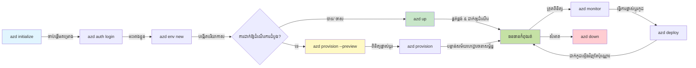
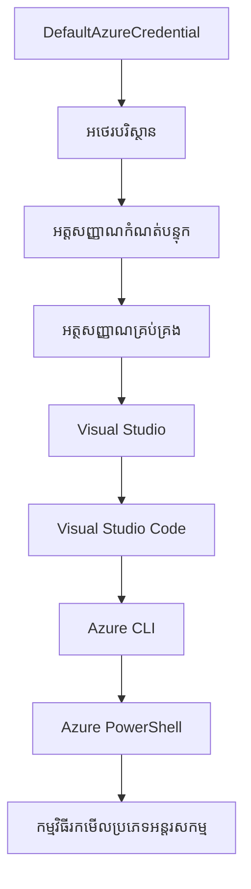

# AZD គ្រឹះដំបូង - ការយល់ដឹងអំពី Azure Developer CLI

# AZD គ្រឹះដំបូង - យុទ្ធសាស្ត្រផ្លូវចម្បង និងមូលដ្ឋាន

**ការស្វែងរកជំពូក:**
- **📚 ទំព័រដើមវគ្គសិក្សា**: [AZD សម្រាប់អ្នកចាប់ផ្តើម](../../README.md)
- **📖 ជំពូកបច្ចុប្បន្ន**: ជំពូក 1 - មូលដ្ឋាន និងការចាប់ផ្តើមលឿន
- **⬅️ មុននេះ**: [ទិដ្ឋភាពទូទៅវគ្គសិក្សា](../../README.md#-chapter-1-foundation--quick-start)
- **➡️ បន្ទាប់**: [ការតំឡើង និងការកំណត់](installation.md)
- **🚀 ជំពូកបន្ទាប់**: [ជំពូក 2: ការអភិវឌ្ឍ AI ជាទីល្អ](../chapter-02-ai-development/microsoft-foundry-integration.md)

## ការណែនាំ

មេរៀននេះណែនាំអ្នកអំពី Azure Developer CLI (azd) ដែលជាប្រភេទឧបករណ៍បញ្ជារដ្ឋបាលដ៏មានប្រសិទ្ធិភាព សម្រួលដំណើរការយកទៅអភិវឌ្ឍនៅក្នុងបរិស្ថានបណ្ដាញ Azure ដែលធ្វើឱ្យលឿន។ អ្នកនឹងរៀនពីយុទ្ធសាស្ត្រ មូលដ្ឋាន ការប្រើប្រាស់ដើម ដើម្បីយល់ពីរបៀបដែល azd ធ្វើឱ្យការចាក់បញ្ចូលកម្មវិធី cloud-native កាន់តែរហ័ស។

## គោលបំណងវគ្គសិក្សា

ចុងបញ្ចប់មេរៀននេះ អ្នកនឹង:
- យល់ពីអ្វីទៅជា Azure Developer CLI និងគោលបំណងសំខាន់របស់វា
- រៀនពីកំណត់គោលនៃទ្រង់ទ្រាយ តំបន់បរិស្ថាន និងសេវាកម្ម
- ស្វែងយល់ពីលក្ខណៈសំខាន់ៗរួមមានការអភិវឌ្ឍដោយទ្រង់ទ្រាយ និងរចនាសម្ព័ន្ធជាប្រភេទកូដ
- យល់ពីរចនាសម្ព័ន្ធគម្រោង azd និងដំណើរការងារ
- រៀបចំខ្លួនរួចរាល់សម្រាប់ដំឡើង និងកំណត់ azd សម្រាប់បរិយាកាសអភិវឌ្ឍរបស់អ្នក

## លទ្ធផលដែលចង់ទទួលបាន

បន្ទាប់ពីបញ្ចប់មេរៀននេះ អ្នកនឹងអាច:
- ពណ៌នាទស្សនៈនៃ azd ក្នុងដំណើរការអភិវឌ្ឍ cloud ទំនើប
- បញ្ជាក់ពីបញ្ជាសំណុំរចនាសម្ព័ន្ធគម្រោង azd
- ពណ៌នាពីរបៀបធ្វើការរួមគ្នារវាងទ្រង់ទ្រាយ តំបន់បរិស្ថាន និងសេវាកម្ម
- យល់ពីអត្ថប្រយោជន៍របស់រចនាសម្ព័ន្ធជា​កូដជាមួយ azd
- ទទួលស្គាល់ការបញ្ជា azd ផ្សេងៗ និងគោលបំណងរបស់ពួកវា

## Azure Developer CLI (azd) ជាអ្វី?

Azure Developer CLI (azd) គឺជាឧបករណ៍បញ្ជារដ្ឋបាលមួយដែលរចនាឡើងដើម្បីជួយបន្តលឿនដំណើរអភិវឌ្ឍផ្ទាល់លើកុំព្យូទ័ររបស់អ្នកទៅរកការចែកចាយលើ Azure។ វារួមបញ្ចូលដំណើរការសាងសង់ ចែកចាយ និងគ្រប់គ្រងកម្មវិធី cloud-native លើ Azure ឲ្យស្រួល។

### តើអ្វីដែលអ្នកអាចចែកចាយជាមួយ azd?

azd គាំទ្រពហុបែបបទនៃបេសកកម្មជាច្រើន—និងបញ្ជីនេះកំពុងតែខ្លះជាត្រូវបន្ថែម។ បច្ចុប្បន្ន អ្នកអាចប្រើ azd ដើម្បីចែកចាយ៖

| ប្រភេទបេសកកម្ម | ឧទាហរណ៍ | ដំណើរការតែមួយទេ? |
|---------------|----------|----------------|
| **កម្មវិធីប្រពៃណី** | កម្មវិធីវេប, REST APIs, គេហទំព័រប៉ុន្មាន | ✅ `azd up` |
| **សេវាកម្ម និងម៉ិក្រូសេវាកម្ម** | Container Apps, Function Apps, បណ្តុំសេវាកម្មច្រើន | ✅ `azd up` |
| **កម្មវិធីប្រើប្រាស់ AI** | កម្មវិធីជជែកជាមួយ Microsoft Foundry Models, ការស្វែងរក RAG ជាមួយ AI | ✅ `azd up` |
| **ភ្នាក់ងារយល់ឃើញ** | ភ្នាក់ងារជាប់ Foundry, ការគ្រប់គ្រងភ្នាក់ងារច្រើន | ✅ `azd up` |

គំនិតសំខាន់គឺថា **ជាវិធានការរង្វង់ជីវិត azd រឹតតែដូចគ្នា មិនថាអ្នកកំពុងចែកចាយអ្វីទេ**។ អ្នកចាប់ផ្តើមគម្រោង កំណត់រចនាសម្ព័ន្ធ បញ្ចូលកូដតាមបែបនីតិវិធី ត្រួតពិនិត្យកម្មវិធីរបស់អ្នក ហើយសម្អាតធាតុ—មិនថាគេហទំព័រងាយៗឬភ្នាក់ងារ AI ជាក់ស្តែងមួយក៏ដោយ។

ការបន្តនេះគឺជារចនាសម្ព័ន្ធ។ azd សង្កេតកម្រិត AI ដូចជាសេវាកម្មមួយផ្សេងទៀតដែលកម្មវិធីរបស់អ្នកអាចប្រើ, មិនមែនជារឿងខុសគ្នាផ្លូវចម្បងទេ។ ចំណុចជជែកដែលគាំទ្រដោយ Microsoft Foundry Models គឺពីទិដ្ឋភាព azd គឺជាសេវាកម្មមួយផ្សេងទៀតដែលត្រូវកំណត់ និងចែកចាយ។

### 🎯 ហេតុអ្វីបានជាចង់ប្រើ AZD? ការប្រៀបធៀបក្នុងជាក់ស្តែង

យើងអនុញ្ញាតឲ្យប្រៀបធៀបការចែកចាយកម្មវិធីវេបសាមញ្ញមួយជាមួយ database៖

#### ❌ គ្មាន AZD: ចែកចាយ Azure ដោយដៃ (លើស 30 នាទី)

```bash
# ជំហានទី ១៖ បង្កើតក្រុមហ៊ុនធនធាន
az group create --name myapp-rg --location eastus

# ជំហានទី ២៖ បង្កើតផែនការផ្នែកកម្មវិធី
az appservice plan create --name myapp-plan \
  --resource-group myapp-rg \
  --sku B1 --is-linux

# ជំហានទី ៣៖ បង្កើតកម្មវិធីបណ្ដាញ
az webapp create --name myapp-web-unique123 \
  --resource-group myapp-rg \
  --plan myapp-plan \
  --runtime "NODE:18-lts"

# ជំហានទី ៤៖ បង្កើតគណនី Cosmos DB (១០-១៥ នាទី)
az cosmosdb create --name myapp-cosmos-unique123 \
  --resource-group myapp-rg \
  --kind MongoDB

# ជំហានទី ៥៖ បង្កើតមូលដ្ឋានទិន្នន័យ
az cosmosdb mongodb database create \
  --account-name myapp-cosmos-unique123 \
  --resource-group myapp-rg \
  --name tododb

# ជំហានទី ៦៖ បង្កើតក្រុមផ្សាយ
az cosmosdb mongodb collection create \
  --account-name myapp-cosmos-unique123 \
  --resource-group myapp-rg \
  --database-name tododb \
  --name todos

# ជំហានទី ៧៖ ទទួលបានខ្សែភ្ជាប់
CONN_STR=$(az cosmosdb keys list \
  --name myapp-cosmos-unique123 \
  --resource-group myapp-rg \
  --type connection-strings \
  --query "connectionStrings[0].connectionString" -o tsv)

# ជំហានទី ៨៖ កំណត់ការកំណត់កម្មវិធី
az webapp config appsettings set \
  --name myapp-web-unique123 \
  --resource-group myapp-rg \
  --settings MONGODB_URI="$CONN_STR"

# ជំហានទី ៩៖ បើកប្រើការចុះបញ្ជី
az webapp log config --name myapp-web-unique123 \
  --resource-group myapp-rg \
  --application-logging filesystem \
  --detailed-error-messages true

# ជំហានទី ១០៖ កំណត់ទិដ្ឋភាពកម្មវិធី
az monitor app-insights component create \
  --app myapp-insights \
  --location eastus \
  --resource-group myapp-rg

# ជំហានទី ១១៖ តភ្ជាប់ App Insights ទៅកម្មវិធីបណ្ដាញ
INSTRUMENTATION_KEY=$(az monitor app-insights component show \
  --app myapp-insights \
  --resource-group myapp-rg \
  --query "instrumentationKey" -o tsv)

az webapp config appsettings set \
  --name myapp-web-unique123 \
  --resource-group myapp-rg \
  --settings APPINSIGHTS_INSTRUMENTATIONKEY="$INSTRUMENTATION_KEY"

# ជំហានទី ១២៖ សាងសង់កម្មវិធីក្នុងកន្លែង
npm install
npm run build

# ជំហានទី ១៣៖ បង្កើតកញ្ចប់ដាក់បញ្ចូល
zip -r app.zip . -x "*.git*" "node_modules/*"

# ជំហានទី ១៤៖ ដាក់បញ្ចូលកម្មវិធី
az webapp deployment source config-zip \
  --resource-group myapp-rg \
  --name myapp-web-unique123 \
  --src app.zip

# ជំហានទី ១៥៖ រង់ចាំ និងសូមអធ្យាស្រ័យវាដំណើរការ 🙏
# (គ្មានការផ្ទៀងផ្ទាត់ស្វ័យប្រវត្តិ ត្រូវការប្រឡងមុខដៃ)
```

**បញ្ហា:**
- ❌ 15+ ពាក្យបញ្ជាចាំមុខ និងអនុវត្តតាមលំដាប់
- ❌ ប្រាំបីទៅបួនសិបនាទីនៃការងារដោយដៃ
- ❌ ងាយកើតកំហុស (សរសេរខុស, ប៉ារ៉ាម៉ែត្រខុស)
- ❌ ខ្សែភ្ជាប់ឆ្លងកាត់ត្រូវបង្ហាញក្នុងប្រវត្តិនៅផ្ទាំងបញ្ជារ
- ❌ គ្មានការវិលត្រឡប់បូកចំនួនមួយដោយស្វ័យប្រវត្តិ បើមានបញ្ហា
- ❌ ពិបាកក្នុងការបញ្ចួនសម្រាប់សមាជិកក្រុម
- ❌ ផ្សេងគ្នាពីលើកដល់លើក (មិនអាចផលិតឡើងវិញបាន)

#### ✅ ជាមួយ AZD: ចែកចាយដោយស្វ័យប្រវត្តិ (ពាក្យបញ្ជា 5, 10-15 នាទី)

```bash
# ជំហានទី ១៖ ចាប់ផ្ដើមពីគំរូ
azd init --template todo-nodejs-mongo

# ជំហានទី ២៖ បញ្ជាក់អត្តសញ្ញាណ
azd auth login

# ជំហានទី ៣៖ បង្កើតបរិស្ថាន
azd env new dev

# ជំហានទី ៤៖ មើលមុនការផ្លាស់ប្ដូរ (ជាជម្រើស ប៉ុន្តែនៅតែផ្តល់អនុសាសន៍)
azd provision --preview

# ជំហានទី ៥៖ ចាត់ចែងគ្រប់យ៉ាង
azd up

# ✨ បានបញ្ចប់! គ្រប់យ៉ាងត្រូវបានចាត់ចែង កំណត់ និងត្រួតពិនិត្យ
```

**អត្ថប្រយោជន៍:**
- ✅ **5 ពាក្យបញ្ជា** ប្រៀបធៀបនឹង 15+ ជំហានដោយដៃ
- ✅ **10-15 នាទី** ពេលសរុប (ភាគច្រើនរង់ចាំ Azure)
- ✅ **កំហុសដោយដៃតិចลง** - ដំណើរការតាមទ្រង់ទ្រាយ និងគំរូ
- ✅ **ការដោះសោរលេខសម្ងាត់យ៉ាងសុវត្ថិភាព** - គំរូជាច្រើនប្រើសន្ថមាន់សម្ងាត់គ្រប់គ្រងដោយ Azure
- ✅ **ចែកចាយច្រើនដងបាន** - ដំណើរការដូចគ្នារបស់រាល់ពេល
- ✅ **អាចផលិតឡើងវិញបានស្រេច** - លទ្ធផលដូចគ្នារាល់ពេល
- ✅ **សម្របសម្រួលសម្រាប់ក្រុម** - អ្នកណាក៏អាចចែកចាយជាមួយពាក្យបញ្ជាដូចគ្នា
- ✅ **រចនាសម្ព័ន្ធជា​កូដ** - គំរូ Bicep ច្បាស់លាស់មានការគ្រប់គ្រងកំណត់
- ✅ **ការត្រួតពិនិត្យក្នុងខ្លួន** - Application Insights ត្រូវបានកំណត់ដោយស្វ័យប្រវត្តិ

### 📊 ការបន្ថយពេលវេលា និងកំហុស

| ម៉េត្រីក | ចែកចាយដោយដៃ | ចែកចាយ AZD | ការកែលម្អ |
|:-------|:------------------|:---------------|:------------|
| **ពាក្យបញ្ជា** | 15+ | 5 | ថយចុះ 67% |
| **ពេលវេលា** | 30-45 នាទី | 10-15 នាទី | លឿន 60% |
| **អត្រាកំហុស** | ប្រហែល 40% | <5% | ថយចុះ 88% |
| **ភាពឆបគ្នា** | ទាប (ដៃ) | 100% (ស្វ័យប្រវត្តិ) | ល្អគ្រប់ទីកន្លែង |
| **ការបង្ហាត់បង្រៀនក្រុម** | 2-4 ម៉ោង | 30 នាទី | លឿន 75% |
| **ពេលវេលាវិលត្រឡប់** | 30+ នាទី (ដៃ) | 2 នាទី (ស្វ័យប្រវត្តិ) | លឿន 93% |

## គោលនយោបាយមូលដ្ឋាន

### ទ្រង់ទ្រាយ
ទ្រង់ទ្រាយគឺជាមូលដ្ឋានរបស់ azd។ វាជាប់គ្នា:
- **កូដកម្មវិធី** - កូដប្រភព និងការពឹងផ្អែករបស់អ្នក
- **ការកំណត់រចនាសម្ព័ន្ធ** - របស់ធនធាន Azure ត្រូវបានកំណត់ជា Bicep ឬ Terraform
- **ឯកសារកំណត់រចនាសម្ព័ន្ធ** - ការកំណត់ និងអថេរបរិស្ថាន
- **ស្ក្រីបចែកចាយ** - ដំណើរការចែកចាយដោយស្វ័យប្រវត្តិ

### តំបន់បរិស្ថាន
តំបន់បរិស្ថានតំណាងឲ្យគោលដៅចែកចាយផ្សេងៗ៖
- **អភិវឌ្ឍន៍** - សម្រាប់សាកល្បង និងអភិវឌ្ឍន៍
- **សម្ភាសន៍** - បរិស្ថានមុនផលិត
- **ផលិត** - បរិស្ថានផលិតផ្ទាល់

តំបន់បរិស្ថាននីមួយៗរក្សាទុក:
- ក្រុមធនធាន Azure ផ្ទាល់
- ការកំណត់រចនាសម្ព័ន្ធ
- ស្ថានភាពចែកចាយ

### សេវាកម្ម
សេវាកម្មគឺជាគ្រឿងផ្សំនៃកម្មវិធីរបស់អ្នក:
- **ផ្នែកមុខ** - កម្មវិធីវេប, SPA
- **ផ្នែកក្រោយ** - API, ម៉ិក្រូសេវាកម្ម
- **មូលដ្ឋានទិន្នន័យ** - ដើម្បីផ្ទុកទិន្នន័យ
- **ផ្ទុកទិន្នន័យ** - ផ្ទុកឯកសារនិង blob

## លក្ខណៈសម្បត្តិសំខាន់

### 1. អភិវឌ្ឍដោយទ្រង់ទ្រាយ
```bash
# រុករកគំរូដែលមានស្រាប់
azd template list

# អនុបំព្រងពីគំរូមួយ
azd init --template <template-name>
```

### 2. រចនាសម្ព័ន្ធជា​កូដ
- **Bicep** - ភាសាជាក់លាក់សម្រាប់ Azure
- **Terraform** - ឧបករណ៍រចនាសម្ព័ន្ធពហុ-បណ្ដាញ
- **ARM Templates** - គំរូ Azure Resource Manager

### 3. ដំណើរការរួមបញ្ចូល
```bash
# ដំណើរការចេញផ្សាយបញ្ចប់
azd up            # ផ្តល់សេវា + ចេញផ្សាយ នេះគឺដៃហត្ថសម្រាប់ការដំឡើងដំបូង

# 🧪 ថ្មី: 미ើលការផ្លាស់ប្ដូររចនាសម្ព័ន្ធមុនចេញផ្សាយ (សុវត្ថិភាព)
azd provision --preview    # គូរតំណាងចេញផ្សាយរចនាសម្ព័ន្ធដោយមិនធ្វើបម្លាស់ប្តូរ

azd provision     # បង្កើតធនធាន Azure ប្រសិនបើអ្នកបន្ទាន់សម័យរចនាសម្ព័ន្ធប្រើនេះ
azd deploy        # ចេញផ្សាយកូដកម្មវិធី ឬចេញផ្សាយកូដកម្មវិធីម្តងទៀតបន្ទាប់ពីបន្ទាន់សម័យ
azd down          # ដាក់ទំនេរធនធាន
```

#### 🛡️ ការប្រកាសរចនាសម្ព័ន្ធយ៉ាងសុវត្ថិភាពជាមួយការមើលមុន
ពាក្យបញ្ជា `azd provision --preview` ជាជំហានសំខាន់សម្រាប់ការចែកចាយយ៉ាងសុវត្ថិភាព៖
- **ការវិភាគ Dry-run** - បង្ហាញអ្វីដែលនឹងត្រូវបានបង្កើត កែប្រែ ឬលុប
- **គ្មានហានិភ័យ** - គ្មានការផ្លាស់ប្តូរពិតប្រាកដត្រូវបានធ្វើលើបរិស្ថាន Azure របស់អ្នក
- **សហការក្រុម** - ចែករំលែកលទ្ធផលមុនចែកចាយ
- **ការប៉ាន់ប្រមាណតម្លៃ** - យល់ពីតម្លៃធនធានមុនចង់ប្តឹង

```bash
# ឧទាហរណ៍នៃការមើលមុននៃលំហូរប្រតិបត្តិការ
azd provision --preview           # មើលថាតើអ្វីនឹងផ្លាស់ប្ដូរ
# ត្រួតពិនិត្យលទ្ធផល និងពិភាក្សាជាមួយក្រុម
azd provision                     # អនុវត្តការផ្លាស់ប្ដូរដោយមានទំនុកចិត្ត
```

### 📊 ទិដ្ឋភាព: ដំណើរការអភិវឌ្ឍ AZD


**ការពន្យល់ដំណើរការ៖**
1. **Init** - ចាប់ផ្តើមជាមួយទ្រង់ទ្រាយ ឬគម្រោងថ្មី
2. **Auth** - ចុះឈ្មោះសម្ងាត់ជាមួយ Azure
3. **Environment** - បង្កើតបរិស្ថានចែកចាយបែងចែក
4. **Preview** - 🆕 តែងតែពិនិត្យមើលការផ្លាស់ប្តូររចនាសម្ព័ន្ធជាមុន (ការអនុវត្តសុវត្ថិភាព)
5. **Provision** - បង្កើត/ធ្វើបច្ចុប្បន្នភាពធនធាន Azure
6. **Deploy** - បញ្ចូលកូដកម្មវិធីរបស់អ្នក
7. **Monitor** - តាមដានសមត្ថភាពកម្មវិធី
8. **Iterate** - បំលែង និងចែកចាយកូដឡើងវិញ
9. **Cleanup** - លុបធនធាននៅពេលបញ្ចប់

### 4. ការគ្រប់គ្រងបរិស្ថាន
```bash
# បង្កើត និងគ្រប់គ្រងបរិយាកាស
azd env new <environment-name>
azd env select <environment-name>
azd env list
```

### 5. ការពង្រឹង និងការបញ្ជា AI

azd ប្រើប្រព័ន្ធពង្រឹងដើម្បីបន្ថែមមុខងារចំពោះ CLI មេដឹកនាំ។ វាមានប្រយោជន៍យ៉ាងខ្លាំងសម្រាប់បេសកកម្ម AI៖

```bash
# បញ្ជីផ្នែកបន្ថែមដែលមានស្រាប់
azd extension list

# តំឡើងផ្នែកបន្ថែមភ្នាក់ងារបង្កើតរបស់ Foundry
azd extension install azure.ai.agents

# ចាប់ផ្តើមគម្រោងភ្នាក់ងារ AI ពីមេរៀន
azd ai agent init -m agent-manifest.yaml

# ចាប់ផ្តើមម៉ាស៊ីនមេ MCP សម្រាប់ការអភិវឌ្ឍជំនួយដោយ AI (Alpha)
azd mcp start
```

> ការពង្រឹងត្រូវបានពិភាក្សា​លម្អិតនៅក្នុង [ជំពូក 2: ការអភិវឌ្ឍ AI ជាទីល្អ](../chapter-02-ai-development/agents.md) និង ឯកសារ [AZD AI CLI Commands](../chapter-08-production/production-ai-practices.md#azd-ai-cli-commands-and-extensions) ។

## 📁 រចនាសម្ព័ន្ធគម្រោង

រចនាសម្ព័ន្ធមូលដ្ឋាននៃគម្រោង azd ៖
```
my-app/
├── .azd/                    # azd configuration
│   └── config.json
├── .azure/                  # Azure deployment artifacts
├── .devcontainer/          # Development container config
├── .github/workflows/      # GitHub Actions
├── .vscode/               # VS Code settings
├── infra/                 # Infrastructure code
│   ├── main.bicep        # Main infrastructure template
│   ├── main.parameters.json
│   └── modules/          # Reusable modules
├── src/                  # Application source code
│   ├── api/             # Backend services
│   └── web/             # Frontend application
├── azure.yaml           # azd project configuration
└── README.md
```

## 🔧 ឯកសារកំណត់រចនាសម្ព័ន្ធ

### azure.yaml
ឯកសារកំណត់រចនាសម្ព័ន្ធគម្រោងសំខាន់៖
```yaml
name: my-awesome-app
metadata:
  template: my-template@1.0.0

services:
  web:
    project: ./src/web
    language: js
    host: appservice
  api:
    project: ./src/api
    language: js
    host: appservice

hooks:
  preprovision:
    shell: pwsh
    run: echo "Preparing to provision..."
```

### .azure/config.json
ការកំណត់ខាងតំបន់បរិស្ថាន៖
```json
{
  "version": 1,
  "defaultEnvironment": "dev",
  "environments": {
    "dev": {
      "subscriptionId": "your-subscription-id",
      "location": "eastus"
    }
  }
}
```

## 🎪 ដំណើរការធម្មតាជាមួយហាត់ការដៃ

> **💡 គន្លឹះរៀន**៖ អនុវត្តហាត់ការទាំងនេះតាមលំដាប់ ដើម្បីបង្កើតជំនាញ AZD របស់អ្នកយ៉ាងប្រសើរ។

### 🎯 ហាត់ការ 1: ចាប់ផ្តើមគម្រោងដំបូងរបស់អ្នក

**គោលបំណង:** បង្កើតគម្រោង AZD និងស្វែងយល់រចនាសម្ព័ន្ធរបស់វា

**ជំហាន:**
```bash
# ប្រើទៅលើទម្រង់ដែលបានបញ្ជាក់
azd init --template todo-nodejs-mongo

# ស្វែងរកឯកសារដែលបានបង្កើត
ls -la  # មើលឯកសារទាំងអស់រួមទាំងឯកសារលាក់ខ្លួន

# ឯកសារសំខាន់ៗដែលបានបង្កើត៖
# - azure.yaml (កំណត់រចនាសម្ព័ន្ធចម្បង)
# - infra/ (កូដហេដ្ឋារចនាសម្ព័ន្ធ)
# - src/ (កូដកម្មវិធី)
```

**✅ ជោគជ័យ:** អ្នកមាន azure.yaml, infra/, និង src/ ថត

---

### 🎯 ហាត់ការ 2: ចែកចាយទៅ Azure

**គោលបំណង:** បញ្ចប់ការចែកចាយពីដើមដល់ចុង

**ជំហាន:**
```bash
# ១. បញ្ជាក់អត្តសញ្ញាណ
az login && azd auth login

# ២. បង្កើតបរិបទ
azd env new dev
azd env set AZURE_LOCATION eastus

# ៣. លូតលាស់ការផ្លាស់ប្តូរ (ណែនាំ)
azd provision --preview

# ៤. ប្រើប្រាស់គ្រប់យ៉ាង
azd up

# ៥. ពិនិត្យមើលការប្រើប្រាស់
azd show    # មើល URL កម្មវិធីរបស់អ្នក
```

**ពេលវេលារំពឹង:** 10-15 នាទី  
**✅ ជោគជ័យ:** URL កម្មវិធីបើកក្នុងកម្មវិធីរុករក

---

### 🎯 ហាត់ការ 3: បរិស្ថានច្រើន

**គោលបំណង:** ចែកចាយទៅ dev និង staging

**ជំហាន:**
```bash
# មាន dev បានហើយ បង្កើត staging
azd env new staging
azd env set AZURE_LOCATION westus2
azd up

# ប្ដូរពីមួយទៅមួយផ្សេងទៀត
azd env list
azd env select dev
```

**✅ ជោគជ័យ:** ក្រុមធនធានពីរប្រកែកក្នុង Azure Portal

---

### 🛡️ សម្អាតទាំងស្រុង: `azd down --force --purge`

ពេលអ្នកត្រូវសំអាតបរិស្ថាន azd រួចទាំងស្រុង៖

```bash
azd down --force --purge
```

**អ្វីដែលវាធ្វើ:**
- `--force`: គ្មានការសួរបញ្ជាក់
- `--purge`: លុបស្ថានភាពក្នុងស្រុក និងធនធាន Azure ទាំងអស់

**ប្រើពេល:**
- ការចែកចាយបរាជ័យនៅកណ្តាល
- ប្ដូរគម្រោង
- ត្រូវការចាប់ផ្តើមថ្មី

---

## 🎪 ឯកសារយោងដំណើរការ

### ចាប់ផ្តើមគម្រោងថ្មី
```bash
# វិធីសាស្រ្ត ១: ប្រើគំរូមានស្រាប់
azd init --template todo-nodejs-mongo

# វិធីសាស្រ្ត ២: ចាប់ផ្តើមពីចាស
azd init

# វិធីសាស្រ្ត ៣: ប្រើថតបច្ចុប្បន្ន
azd init .
```

### វដ្តអភិវឌ្ឍ
```bash
# ដំឡើងបរិយាកាសអភិវឌ្ឍន៍
azd auth login
azd env new dev
azd env select dev

# ចែកចាយគ្រប់យ៉ាង
azd up

# ប្ដូរបំលែងនិងចែកចាយម្តងទៀត
azd deploy

# សម្អាតនៅពេលបញ្ចប់
azd down --force --purge # ពាក្យបញ្ជានៅក្នុង Azure Developer CLI គឺជាការកំណត់ឡើងវិញយ៉ាងខ្លាំងសម្រាប់បរិយាកាសរបស់អ្នក—មានប្រយោជន៍ជាពិសេសនៅពេលអ្នកកំពុងដោះស្រាយបញ្ហាការចែកចាយដែលបានបរាជ័យ, សម្អាតធនធានដែលនៅលើយ៉ាងឯងឯង, ឬរៀបចំសម្រាប់ការចែកចាយថ្មី។
```

## ការយល់ដឹងអំពី `azd down --force --purge`
ពាក្យបញ្ជា `azd down --force --purge` ជាវិធីដែលមានអំណាចក្នុងការបិទបង់បរិស្ថាន azd និងធនធានទាំងអស់រួមផ្សំ។ ខាងក្រោមជាការឆែកតុល្យពីអ្វីដែលជាប្រភេទ flag នីមួយៗ ៖
```
--force
```
- ជម្រុញកាត់បន្ថយការស្នើសួរបញ្ជាក់។
- មានប្រយោជន៍សម្រាប់កម្មវិធី ឬស្គ្រីបដែលមិនអាចចូលប្រើដោយដៃ។
- ធានាថាការបញ្ចប់ដំណើរការ​ត្រូវបន្តដោយមិនខូចខាត ទោះបី CLI សង្កេតឃើញករណីមិនឆេរ។

```
--purge
```
លុប **ព័ត៌មានទាំងអស់ដែលទាក់ទង** រួមមាន៖
ស្ថានភាពបរិស្ថាន
ថត `.azure` ក្នុងស្រុក
ព័ត៍មានចែកចាយបង្កើតជាបន្តបន្ទាប់
រារាំងការចងចាំចែកចាយមុនរបស់ azd ដែលអាចបង្កការបញ្ហាដូចជាក្រុមធនធានមិនត្រូវគ្នា ឬកំណត់សម្រាប់ registry ចាស់។

### ហេតុអ្វីបានជា​ប្រើទាំងពីរពីង
ពេលលោកអ្នកជួបបញ្ហាជាមួយ `azd up` ដោយសារស្ថានភាពជំនោរឬការចែកចាយខ្វះខាត ការសម្រេចនេះធានាបាន **សម្អាតទាំងស្រុង**។

វាមានប្រយោជន៍ពិសេសចំពោះពេលចេញដៃលុបធនធាននៅក្នុង Azure portal ឬពេលប្ដូរទ្រង់ទ្រាយ បរិស្ថាន ឬឈ្មោះក្រុមធនធាន។

### ការគ្រប់គ្រងបរិស្ថានជាច្រើន
```bash
# បង្កើតបរិបទ staging
azd env new staging
azd env select staging
azd up

# ប្ដូរវិញទៅ dev
azd env select dev

# ប្រៀបធៀបទីតាំងទាំងពីរ
azd env list
```

## 🔐 ការផ្ទៀងផ្ទាត់ និងសញ្ញាប័ត្រ

ការយល់ដឹងអំពីការផ្ទៀងផ្ទាត់គឺសំខាន់សម្រាប់ការចែកចាយ azd បានជោគជ័យ។ Azure ប្រើវិធីផ្ទៀងផ្ទាត់ជាច្រើន ហើយ azd ប្រើខ្សែបន្ទាត់សញ្ញាប័ត្រ ដូចគ្នានឹងឧបករណ៍ Azure ផ្សេងទៀត។

### ការផ្ទៀងផ្ទាត់ Azure CLI (`az login`)

មុនប្រើ azd អ្នកត្រូវផ្ទៀងផ្ទាត់ជាមួយ Azure។ វិធីសាស្ត្រចម្បងគឺប្រើ Azure CLI៖

```bash
# ចូលប្រើប្រាស់អន្តរកម្ម (បើកកម្មវិធីរុករក)
az login

# ចូលប្រើជាមួយអ្នកជួលជាក់លាក់
az login --tenant <tenant-id>

# ចូលប្រើជាមួយអ្នកឧបត្ថម្ភសេវាកម្ម
az login --service-principal -u <app-id> -p <password> --tenant <tenant-id>

# ពិនិត្យស្ថានភាពចូលប្រើបច្ចុប្បន្ន
az account show

# បង្ហាញបញ្ជីការជាវដែលមាន
az account list --output table

# កំណត់ការជាវលំនាំដើម
az account set --subscription <subscription-id>
```

### ដំណើរការផ្ទៀងផ្ទាត់
1. **ចូលបទន័យផ្ទាល់**: បើកកម្មវិធីរុករកលំនាំដើមរបស់អ្នកសម្រាប់ការផ្ទៀងផ្ទាត់
2. **Device Code Flow**: សម្រាប់បរិស្ថានដែលមិនអាចប្រើកម្មវិធីរុករកបាន
3. **Service Principal**: សម្រាប់សកម្មភាពស្វ័យប្រវត្តិ និង CI/CD
4. **Managed Identity**: សម្រាប់កម្មវិធីដាក់ដំណើរការ Azure

### ខ្សែបន្ទាត់ DefaultAzureCredential

`DefaultAzureCredential` ជាប្រភេទសញ្ញាប័ត្រ ដែលផ្ដល់បទពិសោធន៍ផ្ទៀងផ្ទាត់សាមញ្ញដោយស្វ័យប្រវត្តិក្នុងការវាយតម្លៃធនធានសញ្ញាប័ត្រច្រើនក្នុងលំដាប់ជាក់លាក់៖

#### លំដាប់ខ្សែបន្ទាត់សញ្ញាប័ត្រ

#### 1. អថេរបរិស្ថាន
```bash
# កំណត់អថេរបរិស្ថានសម្រាប់អគ្គនាយកសេវា
export AZURE_CLIENT_ID="<app-id>"
export AZURE_CLIENT_SECRET="<password>"
export AZURE_TENANT_ID="<tenant-id>"
```

#### 2. អត្តសញ្ញាណការងារ (Kubernetes/GitHub Actions)
ប្រើដោយស្វ័យប្រវត្តិក្នុង៖
- Azure Kubernetes Service (AKS) ជាមួយ Workload Identity
- GitHub Actions ជាមួយ OIDC federation
- ស្ថានការណ៍អត្តសញ្ញាណមុខងារមានប្រសិទ្ធភាពផ្សេងទៀត

#### 3. អត្តសញ្ញាណគ្រប់គ្រង
សម្រាប់ធនធាន Azure ដូចជា៖
- ម៉ាស៊ីនវីម្យូស
- App Service
- Azure Functions
- Container Instances

```bash
# ពិនិត្យមើលថាតើកំពុងប្រតិបត្តិលើធនធាន Azure ដែលមានអត្តសញ្ញាណគ្រប់គ្រងឬទេ
az account show --query "user.type" --output tsv
# បូមមកវិញ: "servicePrincipal" ប្រសិនបើប្រើអត្តសញ្ញាណគ្រប់គ្រង
```

#### 4. ការរួមបញ្ចូលឧបករណ៍អភិវឌ្ឍន៍
- **Visual Studio**: ប្រើគណនីចុះឈ្មោះដោយស្វ័យប្រវត្តិ
- **VS Code**: ប្រើសញ្ញាប័ត្រពង្រឹង Azure Account extension
- **Azure CLI**: ប្រើសញ្ញាប័ត្រ `az login` (ធម្មតាសម្រាប់អភិវឌ្ឍផ្ទាល់កុំព្យូទ័រ)

### ការតំឡើងការផ្ទៀងផ្ទាត់ AZD

```bash
# វិធី 1: ប្រើ Azure CLI (ផ្ដល់អនុសាសន៍សម្រាប់ការអភិវឌ្ឍន៍)
az login
azd auth login  # ប្រើគណនី Azure CLI ដែលមានរួចហើយ

# វិធី 2: ត្រួតពិនិត្យការផ្ទៀងផ្ទាត់ azd ផ្ទាល់
azd auth login --use-device-code  # សម្រាប់បរិយាកាសមិនមានក្បាលចុច

# វិធី 3: ពិនិត្យស្ថានភាពការផ្ទៀងផ្ទាត់
azd auth login --check-status

# វិធី 4: ចេញពីប្រព័ន្ធហើយភ្ជាប់ម្ដងទៀត
azd auth logout
azd auth login
```

### ការអនុវត្តល្អបំផុតសម្រាប់ការផ្ទៀងផ្ទាត់

#### សម្រាប់អភិវឌ្ឍផ្ទាល់
```bash
# ១. ចូលប្រើជាមួយ Azure CLI
az login

# ២. ត្រួតពិនិត្យការជាវត្រឹមត្រូវ
az account show
az account set --subscription "Your Subscription Name"

# ៣. ប្រើ azd ជាមួយលិខិតឆ្លងកាត់ដែលមានហើយ
azd auth login
```

#### សម្រាប់បណ្តុំ CI/CD
```yaml
# GitHub Actions example
- name: Azure Login
  uses: azure/login@v1
  with:
    creds: ${{ secrets.AZURE_CREDENTIALS }}

- name: Deploy with azd
  run: |
    azd auth login --client-id ${{ secrets.AZURE_CLIENT_ID }} \
                    --client-secret ${{ secrets.AZURE_CLIENT_SECRET }} \
                    --tenant-id ${{ secrets.AZURE_TENANT_ID }}
    azd up --no-prompt
```

#### សម្រាប់បរិស្ថានផលិត
- ប្រើ **Managed Identity** នៅពេលរត់លើធនធាន Azure
- ប្រើ **Service Principal** សម្រាប់សកម្មភាពស្វ័យប្រវត្តិ
- កុំផ្ទុកសញ្ញាប័ត្រនៅក្នុងកូដ ឬឯកសារកំណត់រចនាសម្ព័ន្ធ
- ប្រើ **Azure Key Vault** សម្រាប់ការកំណត់ខ្លឹមសារសំងាត់

### បញ្ហាផ្ទៀងផ្ទាត់ទូទៅ និងដំណោះស្រាយ

#### បញ្ហា៖ "មិនឃើញការជាវ"
```bash
# ដំណោះស្រាយ៖ កំណត់ការជាវលំនាំដើម
az account list --output table
az account set --subscription "<subscription-id>"
azd env set AZURE_SUBSCRIPTION_ID "<subscription-id>"
```

#### បញ្ហា៖ "សិទ្ធិមិនគ្រប់គ្រាន់"
```bash
# ដំណោះស្រាយ៖ ពិនិត្យ និងចាត់តាំងតួនាទីដែលចាំបាច់
az role assignment list --assignee $(az account show --query user.name --output tsv)

# តួនាទីដែលចាំបាច់ទូទៅ៖
# - អ្នករួមចំណែក (សម្រាប់ការគ្រប់គ្រងធនធាន)
# - អ្នកគ្រប់គ្រងការចូលប្រើប្រាស់អ្នកប្រើ (សម្រាប់ការចាត់តាំងតួនាទី)
```

#### បញ្ហា៖ "សំគាល់បង់សម្រេច"
```bash
# ដំណោះស្រាយ៖ ធ្វើការផ្ទៀងផ្ទាត់ម្ដងទៀត
az logout
az login
azd auth logout
azd auth login
```

### ការផ្ទៀងផ្ទាត់ក្នុងស្ថានការណ៍ផ្សេងៗ

#### អភិវឌ្ឍផ្ទាល់
```bash
# គណនីអភិវឌ្ឍន៍ផ្ទាល់ខ្លួន
az login
azd auth login
```

#### អភិវឌ្ឍក្រុម
```bash
# ប្រើអ្នកជួលជាក់លាក់សម្រាប់អង្គភាព
az login --tenant contoso.onmicrosoft.com
azd auth login
```

#### ស្ថានការណ៍ពហុជួល
```bash
# ប្ដូរវិញរវាងអ្នកជួល
az login --tenant tenant1.onmicrosoft.com
# ដាក់បញ្ចូលទៅអ្នកជួល 1
azd up

az login --tenant tenant2.onmicrosoft.com  
# ដាក់បញ្ចូលទៅអ្នកជួល 2
azd up
```

### ការព្រួយបារម្ភសុវត្ថិភាព
1. **ការផ្ទុកឯកសារចូល**: មិនដែលផ្ទុកឯកសារបញ្ជាក់ឲ្យមានក្នុងកូដប្រភពទេ  
2. **កំណត់វិសាលភាព**: ប្រើគោលការណ៍អនុញ្ញាតតិចជាងសិទ្ធសម្រាប់ service principals  
3. **ការបង្វិលសញ្ញាប័ណ្ណ**: បង្វិលសម្ងាត់ service principal ជាប្រចាំ  
4. **ថ្នាក់ត្រួតពិនិត្យ**: តាមដានសកម្មភាពអះអាង និងការដាក់បញ្ចូល  
5. **សុវត្ថិភាពបណ្តាញ**: ប្រើចំណុចចូលឯកជននៅពេលអាចធ្វើបាន  

### ការដោះស្រាយបញ្ហាអះអាង身份认证

```bash
# ដោះស្រាយបញ្ហាសម្រង់បញ្ចាក់អត្តសញ្ញាណ
azd auth login --check-status
az account show
az account get-access-token

# ពាក្យបញ្ជាស្វែងរកជាញឹកញាប់
whoami                          # បរិបទអ្នកប្រើបច្ចុប្បន្ន
az ad signed-in-user show      # ព័ត៌មានលម្អិតអ្នកប្រើ Azure AD
az group list                  # សាកល្បងការចូលប្រើធនធាន
```

## ការយល់ដឹងអំពី `azd down --force --purge`

### ការរកឃើញ  
```bash
azd template list              # រុករកគំរូ
azd template show <template>   # ព័ត៌មានលម្អិតនៃគំរូ
azd init --help               # ជម្រើសចាប់ផ្តើម
```
  
### ការគ្រប់គ្រងគម្រោង  
```bash
azd show                     # សង្ខេបគម្រោង
azd env list                # បរិយាកាសដែលមាន និងការជ្រើសរើសលំនាំដើម
azd config show            # ការកំណត់កំណត់រចនា
```
  
### ការត្រួតពិនិត្យ  
```bash
azd monitor                  # បើកការត្រួតពិនិត្យរបាយការណ៍ Azure portal
azd monitor --logs           # មើលកំណត់ហេតុកម្មវិធី
azd monitor --live           # មើលមេត្រិកសកម្មបន្តបន្ទាប់
azd pipeline config          # ចាប់ផ្តើមការតំឡើង CI/CD
```
  
## អនុវត្តិល្អ

### 1. ប្រើឈ្មោះមានន័យ  
```bash
# ល្អ
azd env new production-east
azd init --template web-app-secure

# ជៀសវាង
azd env new env1
azd init --template template1
```
  
### 2. ប្រើប្រាស់ទម្រង់សំបូរ  
- ចាប់ផ្តើមដោយទម្រង់សំបូរមានស្រាប់  
- ផ្លាស់ប្តូរតាមតម្រូវការ  
- បង្កើតទម្រង់សំបូរដែលអាចប្រើម្ដងទៀតសម្រាប់អង្គការរបស់អ្នក  

### 3. ភាពរំលេចបរិស្ថាន  
- ប្រើបរិស្ថានបំបែកសម្រាប់ dev/staging/prod  
- មិនដែលដាក់បញ្ចូលផ្ទាល់ទៅផលិតកម្មពីម៉ាស៊ីនក្នុងតំបន់  
- ប្រើ CI/CD pipeline សម្រាប់ការដាក់បញ្ចូលទៅផលិតកម្ម  

### 4. ការគ្រប់គ្រងការកំណត់រចនា  
- ប្រើអថេរបរិស្ថានសម្រាប់ទិន្នន័យដែលមានសម្ងាត់  
- រក្សាការកំណត់រចនានៅក្នុងការ version control  
- ធ្វើឲ្យឯកសារកំណត់រចនាសម្រាប់បរិស្ថានពិសេស  

## ការរៀនរីកចម្រើន

### អ្នកចាប់ផ្តើម (សប្ដាហ៍ 1-2)  
1. ដំឡើង azd ហើយអះអាង身份认证  
2. ដាក់បញ្ចូលទម្រង់សាមញ្ញ  
3. យល់ដឹងអំពីរចនាសម្ព័ន្ធគម្រោង  
4. ស្គាល់បញ្ជារថ្មីមូលដ្ឋាន (up, down, deploy)  

### មធ្យម (សប្ដាហ៍ 3-4)  
1. ផ្លាស់ប្តូរទម្រង់សំបូរ  
2. គ្រប់គ្រងបរិស្ថានច្រើន  
3. យល់ដឹងអំពីកូដអាគារពហុរចនា  
4. តំឡើង CI/CD pipeline  

### ជំនាញខ្ពស់ (សប្ដាហ៍ 5+)  
1. បង្កើតទម្រង់សំបូរកំណត់ផ្ទាល់  
2. លំនាំអាគារពហុរៀបចំ  
3. ដាក់បញ្ចូលច្រើនតំបន់ប្រតិបត្តិការ  
4. កំណត់រចនា​កម្រិតសហគ្រិន  

## ជំហានបន្ទាប់

**📖 បន្តការរៀនជំពូក 1៖**  
- [ការដំឡើង និង ការកំណត់រចនា](installation.md) - ទទួលយក azd និងកំណត់រចនា  
- [គម្រោងដំបូងរបស់អ្នក](first-project.md) - បញ្ចប់មេរៀនដៃអំពី  
- [មគ្គុទេសក៍កំណត់រចនា](configuration.md) - ជម្រើសកំណត់រចនាឡើងខ្ពស់  

**🎯 ត្រៀមខ្លួនសម្រាប់ជំពូកបន្ទាប់?**  
- [ជំពូក 2: ការអភិវឌ្ឍ AI ជាដំបូង](../chapter-02-ai-development/microsoft-foundry-integration.md) - ចាប់ផ្តើមសង់កម្មវិធី AI  

## ឧបករណ៍បន្ថែម

- [ការពិពណ៌នាអំពី Azure Developer CLI](https://learn.microsoft.com/en-us/azure/developer/azure-developer-cli/)  
- [សារមន្ទីរទម្រង់សំបូរ](https://azure.github.io/awesome-azd/)  
- [គំរូសហគមន៍](https://github.com/Azure-Samples)  

---

## 🙋 សំណួរដែលត្រូវសួរញឹកញាប់

### សំណួរទូទៅ

**Q: តើ AZD ខុសពី Azure CLI យ៉ាងដូចម្ដេច?**  

A: Azure CLI (`az`) ប្រើសម្រាប់គ្រប់គ្រងធនធាន Azure ផ្ទាល់ខ្លួន។ AZD (`azd`) ប្រើសម្រាប់គ្រប់គ្រងកម្មវិធីទាំងមូល៖  

```bash
# Azure CLI - ការគ្រប់គ្រងធនធានថ្នាក់ទាប
az webapp create --name myapp --resource-group rg
az sql server create --name myserver --resource-group rg
# ...តម្រូវការបញ្ជានៅច្រើនទៀត

# AZD - ការគ្រប់គ្រងថ្នាក់កម្មវិធី
azd up  # បញ្ជូនអនុវត្តន៍កម្មវិធីទាំងមូលជាមួយធនធានទាំងអស់
```
  
**គិតដូចខាងក្រោម៖**  
- `az` = ប្រតិបត្តិលើបិទក្រឡាចតុប្បវត្ត  
- `azd` = ធ្វើការជាមួយកន្លែងបិទក្រឡាសព្ទទាំងមូល  

---

**Q: តើខ្ញុំត្រូវដឹង Bicep ឬ Terraform ដើម្បីប្រើ AZD ទេ?**  

A: ទេ! ចាប់ផ្តើមដោយទម្រង់សំបូរ៖  
```bash
# ប្រើគំរូដែលមានរួច - មិនត្រូវការជំនាញ IaC
azd init --template todo-nodejs-mongo
azd up
```
  
អ្នកអាចរៀន Bicep បន្ទាប់មកដើម្បីផ្លាស់ប្តូរអាគារពហុរចនា។ ទម្រង់សំបូរផ្តល់ឧទាហរណ៍ដល់ការសិក្សា។  

---

**Q: តើមានចំណាយប៉ុន្មានក្នុងការប្រើទម្រង់ AZD?**  

A: ចំណាយខុសគ្នាតាមទម្រង់។ ទម្រង់អភិវឌ្ឍភាគច្រើនមានចំណាយ$50-150/ខែ៖  

```bash
# មើលកំណត់តម្លៃមុនការដាក់ឲ្យដំណើរការ
azd provision --preview

# ជៀសវាងការប្រើប្រាស់, ត្រូវលុបចោលនៅពេលមិនប្រើ
azd down --force --purge  # លុបធនធានទាំងអស់
```
  
**កំណត់ចំណាំជំនាញ:** ប្រើថ្នាក់សេវាឥតគិតថ្លៃនៅកន្លែងដែលមាន៖  
- App Service: ថ្នាក់ F1 (ឥតគិតថ្លៃ)  
- ម៉ូដែល Microsoft Foundry: Azure OpenAI 50,000 tokens/ខែឥតគិតថ្លៃ  
- Cosmos DB: 1000 RU/s ថ្នាក់ឥតគិតថ្លៃ  

---

**Q: តើខ្ញុំអាចប្រើ AZD ជាមួយធនធាន Azure មានស្រាប់បានទេ?**  

A: ចាស, ប៉ុន្តែឲ្យងាយស្រួលចាប់ផ្តើមថ្មី។ AZD ដំណើរការល្អបំផុតពេលគ្រប់គ្រងវគ្គជីវិតទាំងមូល។ សម្រាប់ធនធានមានស្រាប់៖  

```bash
# ជម្រើសទី ១៖ នាំចូលធនធានដែលមានស្រាប់ (ជំរើសកម្រិតខ្ពស់)
azd init
# បន្ទាប់មកកែប្រែ infra/ ដើម្បីយោងទៅកាន់ធនធានដែលមានស្រាប់

# ជម្រើសទី ២៖ ចាប់ផ្តើមថ្មី (ផ្ដល់អនុសាសន៍)
azd init --template matching-your-stack
azd up  # បង្កើតបរិយាកាសថ្មី
```
  
---

**Q: តើធ្វើដូចម្តេចដើម្បីចែករំលែកគម្រោងរបស់ខ្ញុំជាមួយក្រុមការងារ?**  

A: បញ្ចូលគម្រោង AZD ទៅ Git (កុំបញ្ចូលថត .azure)៖  

```bash
# មាននៅក្នុង .gitignore ដោយលំនាំដើមហើយ
.azure/        # មានឯកសារសំងាត់ និងទិន្នន័យបរិស្ថាន
*.env          # អថេរបរិស្ថាន

# សមាជិកក្រុមបន្ទាប់មកៈ
git clone <your-repo>
azd auth login
azd env new <their-name>-dev
azd up
```
  
គ្រប់គ្នាទទួលបានអាគារពហុរចនាដូចគ្នាពីទម្រង់សំបូរដូចគ្នា។  

---

### សំណួរដោះស្រាយបញ្ហា

**Q: "azd up" បរាជ័យកណ្តាលមធ្យម។ តើខ្ញុំត្រូវធ្វើដូចម្តេច?**  

A: ពិនិត្យកំហុស ជួសជុល រួចសាកល្បងម្តងទៀត៖  

```bash
# មើលកំណត់ហេតុលម្អិត
azd show

# ការជួសជុលទូទៅ:

# 1. ប្រសិនបើកំណត់គណនីលើស:
azd env set AZURE_LOCATION "westus2"  # ព្យាយាមតំបន់ផ្សេង

# 2. ប្រសិនបើមានបញ្ហាឈ្មោះធនធានជំនួស:
azd down --force --purge  # សម្អាតឡើងវិញ
azd up  # សាកល្បងម្តងទៀត

# 3. ប្រសិនបើការផ្ទៀងផ្ទាត់ផុតកំណត់:
az login
azd auth login
azd up
```
  
**បញ្ហាទូទៅបំផុត:** ជ្រើសរើស subscription Azure មិនត្រឹមត្រូវ  
```bash
az account list --output table
az account set --subscription "<correct-subscription>"
```
  
---

**Q: តើខ្ញុំអាចដាក់បញ្ចូលការផ្លាស់ប្តូរកូដប៉ុណ្ណោះដោយមិនបង្កើតឡើងវិញ?**  

A: ប្រើ `azd deploy` តម្រូវឲ្យមិនប្រើ `azd up`៖  

```bash
azd up          # ពេលដំបូង: រៀបចំ + តំឡើង (យឺត)

# ផ្លាស់ប្តូរកូដ...

azd deploy      # ពេលក្រោយៗ: តំឡើងតែម្តង (លឿន)
```
  
ប្រៀបធៀបទីតាំង៖  
- `azd up`: 10-15 នាទី (បង្កើតអាគារពហុរចនា)  
- `azd deploy`: 2-5 នាទី (កូដតែប៉ុណ្ណោះ)  

---

**Q: តើខ្ញុំអាចផ្លាស់ប្តូរទម្រង់អាគារពហុរចនា បានទេ?**  

A: ចាស! កែសម្រួលឯកសារ Bicep នៅក្នុង `infra/`៖  

```bash
# បន្ទាប់ពី azd init
cd infra/
code main.bicep  # កែសម្រួលនៅក្នុង VS Code

# មើលការផ្លាស់ប្តូរ
azd provision --preview

# អនុវត្តការផ្លាស់ប្តូរ
azd provision
```
  
**កំណត់ចំណាំ:** ចាប់ផ្តើមតិចៗ — ប្តូរ SKU ជាមុនសិន៖  
```bicep
// infra/main.bicep
sku: {
  name: 'B1'  // Change to 'P1V2' for production
}
```
  
---

**Q: តើធ្វើដូចម្តេចដើម្បីលុបអ្វីៗដែល AZD បានបង្កើត?**  

A: ប្រើបញ្ជា១អំពីការលុបធនធានទាំងអស់៖  

```bash
azd down --force --purge

# នេះសម្អាតចេញ:
# - ហេដ្ឋារចនាសម្ព័ន្ធ Azure ទាំងអស់
# - ក្រុមធនធាន
# - ស្ថានភាពបរិយាកាសមូលដ្ឋាន
# - ទិន្នន័យចេញផ្សាយដែលបានបម្រុង缓存
```
  
**រហូតដល់ចាប់ផ្តើមប្រើបញ្ជានេះពេល៖**  
- បញ្ចប់ការធ្វើតេស្តទម្រង់  
- ប្ដូរក្នុងគម្រោងផ្សេង  
- ចង់ចាប់ផ្តើមថ្មី  

**សន្សំប្រាក់ចំណាយ:** លុបធនធានមិនប្រើប្រាស់ = $0 ចំណាយ  

---

**Q: តើមានអ្វីកើតឡើងបើបួនលុបធនធានក្នុង Azure Portal ដោយចៃដន្យ?**  

A: AZD ស្ថានភាពអាចមិនសម្របសម្រួល។ អនុវត្តវិធីស្រោចចិត្ត:  

```bash
# 1. លុបស្ថានភាពក្នុងស្រុក
azd down --force --purge

# 2. ចាប់ផ្តើមថ្មី
azd up

# ជម្រើសបន្តិច: អនុញ្ញាតឱ្យ AZD រកឃើញ និងជួសជុល
azd provision  # នឹងបង្កើតធនធានដែលខ្វះឯណា
```
  
---

### សំណួរលំអិត

**Q: តើខ្ញុំអាចប្រើ AZD ក្នុង CI/CD pipelines បានទេ?**  

A: ចាស! ឧទាហរណ៍ GitHub Actions៖  

```yaml
# .github/workflows/deploy.yml
name: Deploy with AZD

on:
  push:
    branches: [main]

jobs:
  deploy:
    runs-on: ubuntu-latest
    steps:
      - uses: actions/checkout@v2
      
      - name: Install azd
        run: curl -fsSL https://aka.ms/install-azd.sh | bash
      
      - name: Azure Login
        run: |
          azd auth login \
            --client-id ${{ secrets.AZURE_CLIENT_ID }} \
            --client-secret ${{ secrets.AZURE_CLIENT_SECRET }} \
            --tenant-id ${{ secrets.AZURE_TENANT_ID }}
      
      - name: Deploy
        run: azd up --no-prompt
```
  
---

**Q: តើខ្ញុំធ្វើដូចម្តេចដើម្បីគ្រប់គ្រងសម្ងាត់ និងទិន្នន័យសំងាត់?**  

A: AZD ផ្គូផ្គងជាមួយ Azure Key Vault ដោយស្វ័យប្រវត្តិ៖  

```bash
# លំនាំសម្ងាត់ត្រូវបានរក្សាទុកនៅក្នុង Key Vault មិនមែននៅក្នុងកូដទេ
azd env set DATABASE_PASSWORD "$(openssl rand -base64 32)"

# AZD ដំណើរការដោយស្វ័យប្រវត្តិ៖
# 1. បង្កើត Key Vault
# 2. រក្សាទុកលំនាំសម្ងាត់
# 3. ផ្តល់សិទ្ធិការចូលប្រើកម្មវិធីតាមរយៈ Managed Identity
# 4. បញ្ចូលនៅពេលដំណើរការប្រតិបត្តិការ
```
  
**មិនដែលបញ្ចូល:**  
- ថត `.azure/` (ផ្ទុកទិន្នន័យបរិស្ថាន)  
- ឯកសារ `.env` (សម្ងាត់ក្នុងតំបន់)  
- ខ្សែស្រឡាយតភ្ជាប់  

---

**Q: តើខ្ញុំអាចដាក់បញ្ចូលទៅតំបន់ច្រើនបានទេ?**  

A: ចាស, បង្កើតបរិស្ថានសម្រាប់តំបន់នីមួយៗ៖  

```bash
# Περιβάλλον Ανατολικών Ηνωμένων Πολιτειών
azd env new prod-eastus
azd env set AZURE_LOCATION eastus
azd up

# Περιβάλλον Δυτικής Ευρώπης
azd env new prod-westeurope
azd env set AZURE_LOCATION westeurope
azd up

# Κάθε περιβάλλον είναι ανεξάρτητο
azd env list
```
  
សម្រាប់កម្មវិធីពហុតំបន់ពិតប្រាកដ, ផ្លាស់ប្តូរទម្រង់ Bicep ដើម្បីដាក់បញ្ចូលនៅតំបន់ជាច្រើននៅពេលតែមួយ។  

---

**Q: តើខ្ញុំអាចទទួលជំនួយនៅឯណាប្រសិនបើខ្ញុំមានបញ្ហា?**  

1. **ឯកសារអំពី AZD:** https://learn.microsoft.com/azure/developer/azure-developer-cli/  
2. **បញ្ហា GitHub:** https://github.com/Azure/azure-dev/issues  
3. **Discord:** [Azure Discord](https://discord.gg/microsoft-azure) - ចាក់វេទិកា #azure-developer-cli  
4. **Stack Overflow:** Tag `azure-developer-cli`  
5. **មេរៀននេះ:** [មគ្គុទេសក៍ដោះស្រាយបញ្ហា](../chapter-07-troubleshooting/common-issues.md)  

**កំណត់ចំណាំជំនាញ:** មុនសួរបញ្ហា, ប្រើ៖  
```bash
azd show       # បង្ហាញស្ថានភាពបច្ចុប្បន្ន
azd version    # បង្ហាញជំនាន់របស់អ្នក
```
  
បញ្ចូលព័ត៌មាននេះនៅក្នុងសំណួររបស់អ្នក ដើម្បីទទួលបានជំនួយរហ័ស។  

---

## 🎓 តើខ្ញុំត្រូវធ្វើយ៉ាងដូចម្តេចបន្ទាប់?  

ឥឡូវនេះអ្នកយល់ដឹងពីមូលដ្ឋាន AZD។ ជ្រើសរើសផ្លូវរបស់អ្នក៖  

### 🎯 សម្រាប់អ្នកចាប់ផ្តើម៖  
1. **បន្ទាប់:** [ការដំឡើង និង ការកំណត់រចនា](installation.md) - ដំឡើង AZD នៅលើម៉ាស៊ីនរបស់អ្នក  
2. **បន្ទាប់:** [គម្រោងដំបូងរបស់អ្នក](first-project.md) - ដាក់បញ្ចូលកម្មវិធីដំបូងរបស់អ្នក  
3. **អនុវត្ត:** បញ្ចប់លំហាត់ទាំង 3 ក្នុងមេរៀននេះ  

### 🚀 សម្រាប់អ្នកអភិវឌ្ឍ AI៖  
1. **លោតទៅ:** [ជំពូក 2: ការអភិវឌ្ឍ AI ជាដំបូង](../chapter-02-ai-development/microsoft-foundry-integration.md)  
2. **ដាក់បញ្ចូល:** ចាប់ផ្តើមជាមួយ `azd init --template get-started-with-ai-chat`  
3. **រៀន:** សង់កម្មវិធីពេលអ្នកដាក់បញ្ចូល  

### 🏗️ សម្រាប់អ្នកអភិវឌ្ឍមានបទពិសោធន៍៖  
1. **ពិនិត្យឡើងវិញ:** [មគ្គុទេសក៍កំណត់រចនា](configuration.md) - កំណត់រចនាឡើងខ្ពស់  
2. **ស្វែងរក:** [អាគារជាកូដ](../chapter-04-infrastructure/provisioning.md) - ចូលជម្រៅ Bicep  
3. **សង់:** បង្កើតទម្រង់សំបូរផ្ទាល់សម្រាប់ស្តាក់​របស់អ្នក  

---

**ការរុករកជំពូក៖**  
- **📚 ទំព័រដើមមេរៀន:** [AZD សម្រាប់អ្នកចាប់ផ្តើម](../../README.md)  
- **📖 ជំពូកបច្ចុប្បន្ន:** ជំពូក 1 - មូលដ្ឋាន និង ការចាប់ផ្តើមយ៉ាងរហ័ស  
- **⬅️ មុន:** [ការពិពណ៌នាផ្នែកមេរៀន](../../README.md#-chapter-1-foundation--quick-start)  
- **➡️ បន្ទាប់:** [ការដំឡើង និង ការកំណត់រចនា](installation.md)  
- **🚀 ជំពូកបន្ទាប់:** [ជំពូក 2: ការអភិវឌ្ឍ AI ជាដំបូង](../chapter-02-ai-development/microsoft-foundry-integration.md)

---

<!-- CO-OP TRANSLATOR DISCLAIMER START -->
**ការព្រមាន**៖  
ឯកសារនេះត្រូវបានបកប្រែដោយប្រើសេវាកម្មបកប្រែ AI [Co-op Translator](https://github.com/Azure/co-op-translator)។ ទោះបីយើងខិតខំប្រឹងប្រែងឲ្យមានភាពត្រឹមត្រូវក្តី ក៏សូមជ្រាបថាការបកប្រែដោយស្វ័យប្រវត្តិនេះអាចមានកំហុស ឬភាពខ្វះខាតណាមួយ។ ឯកសារដើមជាភាសាដើមគួរត្រូវបានគិតថាជា​ប្រភពដ៏មានសុពលភាព។ សម្រាប់ព័ត៌មានសំខាន់ៗ សូមអនុសាសន៍ឲ្យធ្វើការបកប្រែដោយមនុស្សជំនាញវិជ្ជាជីវៈ។ យើងមិនទទួលខុសត្រូវចំពោះការយល់ច្រឡំ ឬការបកស្រាយខុសដែលកើតឡើងពីការប្រើប្រាស់ការបកប្រែនេះឡើយ។
<!-- CO-OP TRANSLATOR DISCLAIMER END -->