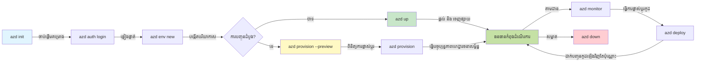
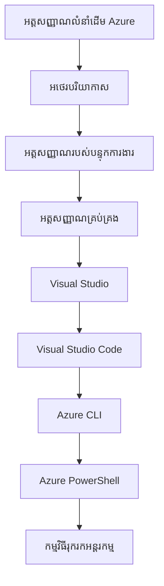

# មូលដ្ឋាន AZD - ការយល់ដឹងអំពី Azure Developer CLI

# មូលដ្ឋាន AZD - គំនិតស្នូល និងមូលដ្ឋាន

**ការរុករកជំពូក:**
- **📚 ទំព័រដើមវគ្គ**: [AZD សម្រាប់អ្នកចាប់ផ្តើម](../../README.md)
- **📖 ជំពូក​បច្ចុប្បន្ន**: ជំពូក 1 - មូលដ្ឋាន និងចាប់ផ្តើមយ៉ាងឆាប់រហ័ស
- **⬅️ មុននេះ**: [ការពិពណ៌នាវគ្គ](../../README.md#-chapter-1-foundation--quick-start)
- **➡️ បន្ទាប់**: [ការដំឡើង និងការកំណត់](installation.md)
- **🚀 ជំពូកបន្ទាប់**: [ជំពូក 2: ការអភិវឌ្ឍផ្តោតលើ AI](../chapter-02-ai-development/microsoft-foundry-integration.md)

## ការណែនាំ

មេរៀននេះណែនាំអ្នកអំពី Azure Developer CLI (azd), គឺជាឧបករណ៍បញ្ជាលើបន្ទាត់ដ៏មានឥទ្ធិពលដែលបង្កើនល្បឿនដំណើររបស់អ្នកពីការអភិវឌ្ឍនៅក្នុងស្រុកទៅការបង្ហោះលើ Azure។ អ្នកនឹងរៀនអំពីគំនិតមូលដ្ឋាន សមាសធាតុស្នូល និងយល់ពីរបៀបដែល azd ធ្វើឲ្យការបង្ហោះកម្មវិធី cloud-native សាមញ្ញ។

## គោលដៅសិក្សា

នៅចុងបញ្ចប់មេរៀននេះ អ្នកនឹង:
- យល់ពីអ្វីដែល Azure Developer CLI ជា និងគោលបំណងសំខាន់របស់វា
- រៀនអំពីគំនិតស្នូល នៃ គំរូ, បរិយាកាស, និងសេវាកម្ម
- ស្វែងយល់លក្ខណៈសម្បត្តិសំខាន់ៗ រួមមាន ការអភិវឌ្ឍដោយគំរូ និង រចនាសម្ព័ន្ធ​ជា​កូដ
- យល់ដឹងអំពីរចនាសម្ព័ន្ធគម្រោង azd និងវិធីសាស្ត្រក្តរ
- ត្រៀមខ្លួនដើម្បីដំឡើង និងកំណត់ azd សម្រាប់បរិយាកាសអភិវឌ្ឍរបស់អ្នក

## លទ្ធផលការសិក្សា

បន្ទាប់ពីបញ្ចប់មេរៀននេះ អ្នកនឹងអាច:
- ពន្យល់ពីតួនាទីរបស់ azd ក្នុងដំណើរការអភិវឌ្ឍ cloud សម័យទំនើប
- សម្គាល់រចនាសម្ព័ន្ធនានានៃគម្រោង azd
- ពណ៌នាថាតើគំរូ បរិយាកាស និងសេវាកម្មធ្វើការងារជាមួយគ្នាយ៉ាងដូចម្ដេច
- យល់ដឹងអំពីអត្ថប្រយោជន៍នៃរចនាសម្ព័ន្ធ​ជា​កូដ ជាមួយ azd
- ស្គាល់ពាក្យបញ្ជារ azd ផ្សេងៗ និងគោលបំណងរបស់ពួកវា

## តើ Azure Developer CLI (azd) ជាអ្វី?

Azure Developer CLI (azd) គឺជាឧបករណ៍បញ្ជាលើបន្ទាត់ដែលរចនាឡើងដើម្បីបង្កើនល្បឿនដំណើររបស់អ្នកពីការអភិវឌ្ឍក្នុងស្រុកទៅការបង្ហោះលើ Azure។ វាសម្រួលដំណើរការនៃការសង់ បង្ហោះ និងគ្រប់គ្រងកម្មវិធី cloud-native លើ Azure។

### តើអ្នកអាចបង្ហោះអ្វីបានខ្លះជាមួយ azd?

azd គាំទ្រប្រភេទបន្ទុកជាច្រើន—ហើយបញ្ជីនេះនៅតែធំឡើងជាបន្ត។ សព្វថ្ងៃ អ្នកអាចប្រើ azd ដើម្បីបង្ហោះ:

| ប្រភេទបន្ទុក | ឧទាហរណ៍ | វិធីសាស្ត្រដូចគ្នា? |
|---------------|----------|----------------|
| **កម្មវិធីប្រពៃណី** | កម្មវិធីវេប, REST APIs, តំបន់ស្ថិតស្ថេរ (static sites) | ✅ `azd up` |
| **សេវាកម្ម និង ម៉ាយក្រូសេវាកម្ម** | Container Apps, Function Apps, backends មានគ្រប់សេវាកម្មជាច្រើន | ✅ `azd up` |
| **កម្មវិធីដែលមាន AI ជាសមាសធាតុ** | កម្មវិធីជជែកជាមួយ Microsoft Foundry Models, ដំណោះស្រាយ RAG ជាមួយ AI Search | ✅ `azd up` |
| **ភ្នាក់ងារប្រាជ្ញា** | ភ្នាក់ងារហូស្ទដោយ Foundry, ការរៀបចំភ្នាក់ងារច្រើន | ✅ `azd up` |

ចក្ខុវិស័យសំខាន់គឺថា **វដ្តជីវិតរបស់ azd នៅតែដូចគ្នា មិនគិតថាអ្នកកំពុងបង្ហោះអ្វី**។ អ្នកចុះដំណើរការ គម្រោង កំណត់សមាសធាតុរចនាសម្ព័ន្ធ បង្ហោះកូដ រួចតាមដានកម្មវិធី ហើយសម្អាត—មិនថា វាជាគេហទំព័រងាយៗ ឬភ្នាក់ងារ AI ស្មុគស្មាញ។

ភាពរួមបញ្ចូលនេះគឺដោយការរចនា។ azd ចាត់ទុកសមត្ថភាព AI ជាប្រភេទសេវាកម្មមួយដែលកម្មវិធីរបស់អ្នកអាចប្រើបាន មិនមែនជាអ្វីខុសមកពីធម្មតាទេ។ ចុងបញ្ចប់ chat ដែលគាំទ្រ​ដោយ Microsoft Foundry Models ពីទស្សនៈរបស់ azd គឺគ្រាន់តែលេខសេវាកម្មមួយទៀតដែលត្រូវកំណត់ និងបង្ហោះ។

### 🎯 ហេតុអ្វីប្រើ AZD? ការប្រៀបធៀបនៅពិភពពិត

ចៀសចែកការបង្ហោះកម្មវិធីវេបសាមញ្ញមួយជាមួយមូលដ្ឋានទិន្នន័យ:

#### ❌ បើគ្មាន AZD: ការបង្ហោះ Azure ដោយដៃ (30+ នាទី)

```bash
# ជំហាន 1: បង្កើតក្រុមធនធាន
az group create --name myapp-rg --location eastus

# ជំហាន 2: បង្កើតផែនការ App Service
az appservice plan create --name myapp-plan \
  --resource-group myapp-rg \
  --sku B1 --is-linux

# ជំហាន 3: បង្កើតកម្មវិធីវេប
az webapp create --name myapp-web-unique123 \
  --resource-group myapp-rg \
  --plan myapp-plan \
  --runtime "NODE:18-lts"

# ជំហាន 4: បង្កើតគណនី Cosmos DB (១០–១៥ នាទី)
az cosmosdb create --name myapp-cosmos-unique123 \
  --resource-group myapp-rg \
  --kind MongoDB

# ជំហាន 5: បង្កើតមូលដ្ឋានទិន្នន័យ
az cosmosdb mongodb database create \
  --account-name myapp-cosmos-unique123 \
  --resource-group myapp-rg \
  --name tododb

# ជំហាន 6: បង្កើតប្រមុំ
az cosmosdb mongodb collection create \
  --account-name myapp-cosmos-unique123 \
  --resource-group myapp-rg \
  --database-name tododb \
  --name todos

# ជំហាន 7: ទទួលខ្សែតភ្ជាប់
CONN_STR=$(az cosmosdb keys list \
  --name myapp-cosmos-unique123 \
  --resource-group myapp-rg \
  --type connection-strings \
  --query "connectionStrings[0].connectionString" -o tsv)

# ជំហាន 8: កំណត់ការកំណត់កម្មវិធី
az webapp config appsettings set \
  --name myapp-web-unique123 \
  --resource-group myapp-rg \
  --settings MONGODB_URI="$CONN_STR"

# ជំហាន 9: បើកការចុះកំណត់ហេតុ
az webapp log config --name myapp-web-unique123 \
  --resource-group myapp-rg \
  --application-logging filesystem \
  --detailed-error-messages true

# ជំហាន 10: រៀបចំ Application Insights
az monitor app-insights component create \
  --app myapp-insights \
  --location eastus \
  --resource-group myapp-rg

# ជំហាន 11: តភ្ជាប់ Application Insights ទៅ Web App
INSTRUMENTATION_KEY=$(az monitor app-insights component show \
  --app myapp-insights \
  --resource-group myapp-rg \
  --query "instrumentationKey" -o tsv)

az webapp config appsettings set \
  --name myapp-web-unique123 \
  --resource-group myapp-rg \
  --settings APPINSIGHTS_INSTRUMENTATIONKEY="$INSTRUMENTATION_KEY"

# ជំហាន 12: កសាងកម្មវិធីនៅលើម៉ាស៊ីនក្នុងស្រុក
npm install
npm run build

# ជំហាន 13: បង្កើតកញ្ចប់ដាក់បង្ហោះ
zip -r app.zip . -x "*.git*" "node_modules/*"

# ជំហាន 14: បង្ហោះកម្មវិធី
az webapp deployment source config-zip \
  --resource-group myapp-rg \
  --name myapp-web-unique123 \
  --src app.zip

# ជំហាន 15: រង់ចាំ ហើយអធិស្ឋានឱ្យវាដំណើរការ 🙏
# (គ្មានការត្រួតពិនិត្យដោយស្វ័យប្រវត្តិ, ត្រូវការធ្វើតេស្តដោយដៃ)
```

**បញ្ហា:**
- ❌ 15+ កម្មង់ដែលត្រូវចងចាំ និងដាក់បញ្ចូលតាមលំដាប់
- ❌ 30-45 នាទីនៃការងារដោយដៃ
- ❌ ងាយធ្វើកំហុស (ផាត់អក្សរ, ប៉ារ៉ាម៉ែត្រ​ខុស)
- ❌ ខ្សែសរសេរការតភ្ជាប់បង្ហាញក្នុងប្រវត្តិ terminal
- ❌ មិនមានការសងវិញដោយស្វ័យប្រវត្តិប្រសិនបើមានអ្វីមួយបើកខូច
- ❌ ពិបាកចម្លងសម្រាប់សមាជិកក្រុម
- ❌ ខុសគ្នារៀងរាល់ដង (មិនអាចចម្លងឡើងវិញបាន)

#### ✅ ជាមួយ AZD: ការបង្ហោះដោយស្វ័យប្រវត្តិ (5 កម្មង់, 10-15 នាទី)

```bash
# ជំហាន 1: ចាប់ផ្តើមពីគំរូ
azd init --template todo-nodejs-mongo

# ជំហាន 2: ផ្ទៀងផ្ទាត់អត្តសញ្ញាណ
azd auth login

# ជំហាន 3: បង្កើតបរិយាកាស
azd env new dev

# ជំហាន 4: មើលជាមុននូវការផ្លាស់ប្តូរ (ជាជម្រើស ប៉ុន្តែយើងណែនាំ)
azd provision --preview

# ជំហាន 5: ដាក់ដំណើរការទាំងអស់
azd up

# ✨ រួចរាល់! អ្វីៗទាំងអស់បានដាក់ដំណើរការ កំណត់រចនាសម្ព័ន្ធ និងត្រូវបានតាមដាន
```

**អត្ថប្រយោជន៍:**
- ✅ **5 កម្មង់** បើធៀបនឹង 15+ ជំហានដោយដៃ
- ✅ **10-15 នាទី** រយៈពេលសរុប (ភាគច្រើនរង់ចាំ Azure)
- ✅ **កំហុស​ដោយដៃតិច​ជាង** - វិធានការ​ដែលប៉ះពាល់តិច, វត្ថុបែបគំរូបញ្ជាដំណើរ
- ✅ **ការដោះស្រាយសម្ងាត់យ៉ាងសុវត្ថិភាព** - គំរូជាច្រើនប្រើទីតាំងផ្ទុកសម្ងាត់ដែលគ្រប់គ្រងដោយ Azure
- ✅ **ការបង្ហោះអាចធ្វើឡើងម្តងហើយម្តងទៀត** - វគ្គដូចគ្នារៀងរាល់ដង
- ✅ **អាចចម្លងឡើងវិញបានពេញលេញ** - លទ្ធផលដូចគ្នារៀងរាល់ដង
- ✅ **រួចរាល់សម្រាប់ក្រុម** - អ្នកណាក៏អាចបង្ហោះបានជាមួយក្បួនដូចគ្នា
- ✅ **រចនាសម្ព័ន្ធជា​កូដ** - គំរូ Bicep ដែលមានការកំណត់កំណែ
- ✅ **ការត្រួតពិនិត្យបញ្ចូលរួម** - Application Insights កំណត់ដោយស្វ័យប្រវត្តិ

### 📊 ការកាត់បន្ថយពេលវេលា និងកំហុស

| កត្តាប៉ាម៉ាន់ | ការបង្ហោះដោយដៃ | ការបង្ហោះដោយ AZD | ការកែលម្អ |
|:-------|:------------------|:---------------|:------------|
| **កម្មង់** | 15+ | 5 | 67% តិចជាង |
| **ពេល** | 30-45 នាទី | 10-15 នាទី | 60% លឿនជាង |
| **អត្រាកំហុស** | ~40% | <5% | 88% កាត់បន្ថយ |
| **ភាពជាប់ទៀងទាត់** | ទាប (ដោយដៃ) | 100% (ស្វ័យប្រវត្តិ) | ល្អបំផុត |
| **ការចូលរួមក្រុម** | 2-4 ម៉ោង | 30 នាទី | 75% លឿនជាង |
| **ពេលសងវិញ** | 30+ នាទី (ដោយដៃ) | 2 នាទី (ស្វ័យប្រវត្តិ) | 93% លឿនជាង |

## គំនិតស្នូល

### គំរូ
គំរូជាគ្រឹះនៃ azd។ វារួមមាន:
- **កូដកម្មវិធី** - កូដប្រភព និង dependencies របស់អ្នក
- **ការកំណត់រចនាសម្ព័ន្ធ** - ធនធាន Azure ដែលបានកំណត់ក្នុង Bicep ឬ Terraform
- **ឯកសារកំណត់រចនា** - ការកំណត់ និងអថេរបរិយាកាស
- **ស្គ្រីបបង្ហោះ** - វិធានការបង្ហោះដោយស្វ័យប្រវត្តិ

### បរិយាកាស
បរិយាកាសតំណាងឲ្យគោលដៅបង្ហោះផ្សេងៗ:
- **អភិវឌ្ឍន៍** - សម្រាប់ការធ្វើតេស្ត និងអភិវឌ្ឍ
- **Staging** - បរិយាកាសមុនផលិតកម្ម
- **Production** - បរិយាកាសផលិតកម្មផ្ទាល់

បរិយាកាសនីមួយៗរក្សាទុករបស់ខ្លួន:
- ក្រុមធនធាន Azure
- ការកំណត់រចនាសម្ព័ន្ធ
- ស្ថានភាពបង្ហោះ

### សេវាកម្ម
សេវាកម្មជាគ្រឿងសាងសង់នៃកម្មវិធីរបស់អ្នក:
- **Frontend** - កម្មវិធីវេប, SPAs
- **Backend** - APIs, ម៉ាយក្រូសេវាកម្ម
- **Database** - ដំណោះស្រាយផ្ទុកទិន្នន័យ
- **Storage** - ការផ្ទុកឯកសារ និង Blob

## លក្ខណៈសម្បត្តិ​សំខាន់

### 1. ការអភិវឌ្ឍដោយគំរូ
```bash
# រកមើលគំរូដែលមាន
azd template list

# ចាប់ផ្តើមពីគំរូ
azd init --template <template-name>
```

### 2. រចនាសម្ព័ន្ធជា​កូដ
- **Bicep** - ភាសាចំពោះដែនសម្រាប់ Azure
- **Terraform** - ឧបករណ៍រចនាសម្ព័ន្ធពហុពពក
- **ARM Templates** - គំរូ Azure Resource Manager

### 3. វិធីសាស្ត្ររួមបញ្ចូល
```bash
# លំនាំពេញលេញសម្រាប់ដំណើរការ ដាក់ប្រើ
azd up            # Provision + Deploy — ដំណើរការដោយឥតដៃចូលរួម សម្រាប់ការកំណត់ដំបូង

# 🧪 ថ្មី: មើលជាមុនការផ្លាស់ប្តូរហេដ្ឋារចនាសម្ព័ន្ធ មុនការដាក់ប្រើ (សុវត្ថិភាព)
azd provision --preview    # ធ្វើការសម្ដែងនូវការដាក់ប្រើហេដ្ឋារចនាសម្ព័ន្ធដោយមិនធ្វើការផ្លាស់ប្តូរ

azd provision     # បង្កើតធនធាន Azure — ប្រើនេះ ប្រសិនបើអ្នកធ្វើបច្ចុប្បន្នភាពលើហេដ្ឋារចនាសម្ព័ន្ធ
azd deploy        # ដាក់ប្រើកូដកម្មវិធី ឬ ដាក់ប្រើឡើងវិញបន្ទាប់ពីធ្វើបច្ចុប្បន្នភាព
azd down          # សម្អាតធនធាន
```

#### 🛡️ ការធ្វើផែនការរចនាសម្ព័ន្ធដោយមានការមើលជាមុនដែលមានសុវត្ថិភាព
ពាក្យបញ្ជា `azd provision --preview` គឺជាកម្មវិធីផ្លាស់ប្តូរដ៏សាមញ្ញសម្រាប់ការបង្ហោះដែលមានសុវត្ថិភាព:
- **Dry-run analysis** - បង្ហាញអ្វីដែលនឹងត្រូវបង្កើត ប្រែប្លែក ឬលុបចោល
- **Zero risk** - មិនមានការផ្លាស់ប្តូរផ្ទាល់ទៅបរិយាកាស Azure របស់អ្នក
- **Team collaboration** - ចែករំលែកលទ្ធផលមើលជាមុនមុនការបង្ហោះ
- **Cost estimation** - យល់ដឹងពីថ្លៃធនធានមុនពេលប្តេជ្ញា

```bash
# ឧទាហរណ៍លំហូរដំណើរការមើលមុន
azd provision --preview           # មើលថានឹងផ្លាស់ប្តូរអ្វីខ្លះ
# ពិនិត្យលទ្ធផល ហើយពិភាក្សាជាមួយក្រុម
azd provision                     # អនុវត្តការផ្លាស់ប្តូរដោយទំនុកចិត្ត
```

### 📊 រូបភាព៖ វិធីការអភិវឌ្ឍ AZD



**ការពន្យល់នៃវិធីសាស្ត្រ:**
1. **Init** - ចាប់ផ្តើមជាមួយគំរូ ឬគម្រោងថ្មី
2. **Auth** - ផ្ទៀងផ្ទាត់ជាមួយ Azure
3. **Environment** - បង្កើតបរិយាកាសបង្ហោះដាច់ដោយឡែក
4. **Preview** - 🆕 ត្រូវមើលជាមុន សម្រាប់បម្លែងរចនាសម្ព័ន្ធ ជាធម្មតា (ហើយមានសុវត្ថិភាព)
5. **Provision** - បង្កើត/ផ្លាស់ប្តូរធនធាន Azure
6. **Deploy** - បញ្ជូនកូដកម្មវិធីរបស់អ្នក
7. **Monitor** - តាមដានប្រសិទ្ធភាពកម្មវិធី
8. **Iterate** - បំលែង និងបង្ហោះកូដម្ដងទៀត
9. **Cleanup** - លុបធនធានពេលបញ្ចប់

### 4. ការគ្រប់គ្រងបរិយាកាស
```bash
# បង្កើត និងគ្រប់គ្រងបរិយាកាស
azd env new <environment-name>
azd env select <environment-name>
azd env list
```

### 5. ផ្នែកបន្ថែម និងបញ្ជារ AI

azd ប្រើប្រព័ន្ធផ្នែកបន្ថែមដើម្បីបន្ថែមសមត្ថភាពលើស CLI សំខាន់។ នេះពិសេសមានប្រយោជន៍សម្រាប់បន្ទុក AI:

```bash
# បញ្ជីផ្នែកបន្ថែមដែលមាន
azd extension list

# ដំឡើងផ្នែកបន្ថែមភ្នាក់ងារ Foundry
azd extension install azure.ai.agents

# ចាប់ផ្តើមគម្រោងភ្នាក់ងារ AI ពីឯកសារ manifest
azd ai agent init -m agent-manifest.yaml

# សាកល្បងភ្នាក់ងារដែលបានដាក់ប្រើ (បង្ហាញពេលយឺត និងពេលដល់បៃដំបូង)
azd ai agent invoke

# ចាប់ផ្តើមម៉ាស៊ីនបម្រើ MCP សម្រាប់ការអភិវឌ្ឍជាជំនួយដោយ AI (Alpha)
azd mcp start
```

**ជីវិតលifecycle ភ្នាក់ងារ ពីដើមដល់ចុង។** ពេលអ្នកបានដំឡើង `azure.ai.agents`, វិក័យប័ត្រមួយចំនួននាំឲ្យអ្នកពីគំនិតទៅភ្នាក់ងារដែលដំឡើង និងត្រូវបានតាមដាន។ អ្នកមិនចាំបាច់មានរួចទាំងអស់ទាំងថ្ងៃដំបូង—គ្រាន់តែដឹងថាវាត្រូវមាន:

| ដំណាក់កាល | ពាក្យបញ្ជា | វាធ្វើអ្វី |
|-------|---------|--------------|
| **បង្កើតគម្រោងផ្តើម** | `azd ai agent init -m <manifest>` | បង្កើតគម្រោងភ្នាក់ងារពី manifest |
| **សាកល្បង** | `azd ai agent invoke` | ហៅភ្នាក់ងារ និងមើលពេលវេលាចម្លើយ |
| **វាស់** | `azd ai agent eval generate` | បង្កើតសំណុំទិន្នន័យតេស្តសម្រាប់ភ្នាក់ងារ |
| **បន្ថែមប្រសិទ្ធភាព** | `azd ai agent optimize` | បង្កើនប្រសិទ្ធភាពសេចក្ដីណែនាំភ្នាក់ងារតាមទិន្នន័យរបស់អ្នក |
| **ពិនិត្យ** | `azd ai agent endpoint show` | មើលការកំណត់ចុងបញ្ចប់ប្រតិបត្តិ |
| **សម្អាត** | `azd ai agent delete` | លុបភ្នាក់ងារហូស្ទ និងកំណែទាំងអស់ |

> ផ្នែកបន្ថែមត្រូវបានពិពណ៌នាយ៉ាងលម្អិតនៅក្នុង [ជំពូក 2: ការអភិវឌ្ឍផ្តោតលើ AI](../chapter-02-ai-development/agents.md) និងឯកសារយោង [AZD AI CLI Commands](../chapter-08-production/production-ai-practices.md#azd-ai-cli-commands-and-extensions)។

## 📁 រចនាសម្ព័ន្ធគម្រោង

រចនាសម្ព័ន្ធគម្រោង azd ប្រភេទធម្មតា:
```
my-app/
├── .azd/                    # azd configuration
│   └── config.json
├── .azure/                  # Azure deployment artifacts
├── .devcontainer/          # Development container config
├── .github/workflows/      # GitHub Actions
├── .vscode/               # VS Code settings
├── infra/                 # Infrastructure code
│   ├── main.bicep        # Main infrastructure template
│   ├── main.parameters.json
│   └── modules/          # Reusable modules
├── src/                  # Application source code
│   ├── api/             # Backend services
│   └── web/             # Frontend application
├── azure.yaml           # azd project configuration
└── README.md
```

## 🔧 ឯកសារកំណត់រចនាសម្ព័ន្ធ

### azure.yaml
ឯកសារកំណត់គម្រោងសំខាន់៖
```yaml
name: my-awesome-app
metadata:
  template: my-template@1.0.0

services:
  web:
    project: ./src/web
    language: js
    host: appservice
  api:
    project: ./src/api
    language: js
    host: appservice

hooks:
  preprovision:
    shell: pwsh
    run: echo "Preparing to provision..."
```

### .azure/config.json
ការកំណត់សម្រាប់បរិយាកាសពិសេស:
```json
{
  "version": 1,
  "defaultEnvironment": "dev",
  "environments": {
    "dev": {
      "subscriptionId": "your-subscription-id",
      "location": "eastus"
    }
  }
}
```

## 🎪 វិធីសាស្ត្រចំណូលចិត្ត​ជាមួយលំហាត់ដំណើរការដែកដៃ

> **💡 គន្លឹះការសិក្សា:** អនុវត្តលំហាត់ទាំងនេះចាប់តាមលំដាប់ ដើម្បីបង្កើនជំនាញ AZD របស់អ្នកជាដំណាក់កាល។

### 🎯 លំហាត់ 1: ចាប់ផ្តើមគម្រោងដំបូងរបស់អ្នក

**គោលដៅ:** បង្កើតគម្រោង AZD និងពិនិត្យរចនាសម្ព័ន្ធរបស់វា

**ជំហានៈ:**
```bash
# ប្រើគំរូដែលបានសាកល្បង
azd init --template todo-nodejs-mongo

# ស្វែងរកឯកសារដែលបានបង្កើត
ls -la  # មើលឯកសារទាំងអស់ រួមទាំងឯកសារ​ដែលលាក់

# ឯកសារសំខាន់ៗដែលបានបង្កើត:
# - azure.yaml (ការកំណត់ចម្បង)
# - infra/ (កូដហេដ្ឋារចនាសម្ព័ន្ធ)
# - src/ (កូដកម្មវិធី)
```

**✅ ជោគជ័យ:** អ្នកមាន azure.yaml, infra/, និងថត src/

---

### 🎯 លំហាត់ 2: បង្ហោះទៅ Azure

**គោលដៅ:** បញ្ចប់ការបង្ហោះពីដើមដល់ចុង

**ជំហានៈ**
```bash
# 1. ផ្ទៀងផ្ទាត់
az login && azd auth login

# 2. បង្កើតបរិយាកាស
azd env new dev
azd env set AZURE_LOCATION eastus

# 3. មើលមុនការផ្លាស់ប្តូរ (បានណែនាំ)
azd provision --preview

# 4. បង្ហោះទាំងអស់
azd up

# 5. ផ្ទៀងផ្ទាត់ការបង្ហោះ
azd show    # មើល URL នៃកម្មវិធីរបស់អ្នក
```

**ពេលរំពឹងទុក:** 10-15 នាទី  
**✅ ជោគជ័យ:** URL នៃកម្មវិធីបើកនៅក្នុងកម្មវិធីរុករក

---

### 🎯 លំហាត់ 3: បរិយាកាសច្រើន

**គោលដៅ:** បង្ហោះទៅ dev និង staging

**ជំហានៈ:**
```bash
# មាន dev រួចហើយ បង្កើត staging
azd env new staging
azd env set AZURE_LOCATION westus2
azd up

# ប្តូររវាងពួកវា
azd env list
azd env select dev
```

**✅ ជោគជ័យ:** មានក្រុមធនធានពីរ បំបែកនៅក្នុង Azure Portal

---

### 🛡️ ស្ថានភាពស្អាត: `azd down --force --purge`

ពេលដែលអ្នកត្រូវការកំណត់ឡើងវិញទាំងស្រុង:

```bash
azd down --force --purge
```

**វាធ្វើអ្វី:**
- `--force`: មិនមានការសួរបញ្ជាក់
- `--purge`: លុបសភាពក្នុងស្រុកទាំងអស់ និងធនធាន Azure

**ប្រើនៅពេលៈ**
- ការបង្ហោះបរាជ័យនៅកណ្តាលប្រតិបត្តិការ
- ប្ដូរកម្មវិធី/គម្រោង
- ត្រូវការចាប់ផ្តើមថ្មី

---

## 🎪 ឯកសារយោងនៃវិធីសាស្ត្រដើម

### ការចាប់ផ្ដើមគម្រោងថ្មី
```bash
# វិធី 1: ប្រើទំរង់ដែលមានស្រាប់
azd init --template todo-nodejs-mongo

# វិធី 2: ចាប់ផ្ដើមពីដើម
azd init

# វិធី 3: ប្រើថតបច្ចុប្បន្ន
azd init .
```

### វដ្តអភិវឌ្ឍន៍
```bash
# រៀបចំបរិបទអភិវឌ្ឍន៍
azd auth login
azd env new dev
azd env select dev

# ដាក់ប្រើទាំងអស់
azd up

# ធ្វើការផ្លាស់ប្ដូរ និងដាក់ប្រើម្តងទៀត
azd deploy

# ធ្វើការសម្អាតនៅពេលបញ្ចប់
azd down --force --purge # ពាក្យបញ្ជា​នៅ​ក្នុង Azure Developer CLI គឺជា **ការកំណត់ឡើងវិញធ្ងន់** សម្រាប់បរិយាកាសរបស់អ្នក — មានប្រយោជន៍ជាពិសេសពេលដែលអ្នកកំពុងដោះស្រាយការដាក់ប្រើដែលបរាជ័យ, សម្អាតធនធានដែលគ្មានម្ចាស់, ឬរៀបចំសម្រាប់ការដាក់ប្រើថ្មី។
```

## ការយល់ដឹងអំពី `azd down --force --purge`
ពាក្យបញ្ជា `azd down --force --purge` គឺជាវិធីដ៏មានអំណាចមួយក្នុងការលុបបំបាត់បរិយាកាស azd របស់អ្នក និងធនធានទាក់ទងទាំងអស់។ នេះជាការបំបែកអំពីអ្វីដែល旗្ជូវិមានរាល់ខ្ទង់ធាតុនីមួយៗធ្វើ:
```
--force
```
- ជង្ខាងការសួរបញ្ជាក់។
- មានប្រយោជន៍សម្រាប់អូតូម៉េស្យុង ឬស្គ្រីបដែលមិនអាចមានការចូលដៃបាន។
- ធានាឲ្យការលុបបំបាត់បន្តដោយគ្មានការកាត់ចំណី ទោះបី CLI ស្កេនឃើញភាពមិនស្របរម្យក៏ដោយ។

```
--purge
```
លុប **មេតាដាតាតទាក់ទងទាំងអស់**, រួមមាន:
ស្ថានភាពបរិយាកាស
ថតក្នុងស្រុក `.azure`
ព័ត៌មានបង្ហោះដែលបាន cache
រារាំង azd ពីការទទួលបាន "ការចងចាំ" នៃការបង្ហោះចាស់ ដែលអាចបណ្តាលឲ្យមានបញ្ហា ដូចជា ក្រុមធនធានមិនត្រូវគ្នា ឬយោងទៅកាន់ registry ចាស់។

### ហេតុអ្វីប្រើទាំងពីរ?
ពេលអ្នកជួបបញ្ហាជាមួយ `azd up` ដោយសារសភាពនៅសល់ ឬការបង្ហោះមិនពេញលេញ ការរូបមន្តនេះធានាឲ្យមាន **ស្ថានភាពស្អាត**។

វាមានប្រយោជន៍ជាពិសេសបន្ទាប់ពីការលុបធនធានដោយដៃនៅក្នុង Azure portal ឬនៅពេលប្ដូរគំរូ បរិយាកាស ឬ convention នៃឈ្មោះក្រុមធនធាន។

### ការគ្រប់គ្រងបរិយាកាសច្រើន
```bash
# បង្កើតបរិយាកាសសាកល្បង
azd env new staging
azd env select staging
azd up

# ប្ដូរត្រឡប់ទៅបរិយាកាសអភិវឌ្ឍន៍
azd env select dev

# ប្រវៀបធៀបបរិយាកាស
azd env list
```

## 🔐 ការផ្ទៀងផ្ទាត់ និងគ្រឿងសោ

ការយល់ដឹងអំពីការផ្ទៀងផ្ទាត់សំខាន់សម្រាប់ការបង្ហោះ azd ជោគជ័យ។ Azure ប្រើវិធីផ្ទៀងផ្ទាត់ជាច្រើន និង azd ប្រើខ្សែសង្វាក់សិទ្ធិដូចដែលឧបករណ៍ Azure ផ្សេងទៀតប្រើ។

### ការផ្ទៀងផ្ទាត់ Azure CLI (`az login`)

មុនប្រើ azd អ្នកត្រូវផ្ទៀងផ្ទាត់ជាមួយ Azure។ វិធីទូទៅបំផុតគឺប្រើ Azure CLI:

```bash
# ចូលអន្តរកម្ម (បើកកម្មវិធីរុករក)
az login

# ចូលជាមួយទេណង់ជាក់លាក់
az login --tenant <tenant-id>

# ចូលដោយប្រើអត្តសញ្ញាណសម្រាប់សេវាកម្ម
az login --service-principal -u <app-id> -p <password> --tenant <tenant-id>

# ពិនិត្យស្ថានភាពចូលបច្ចុប្បន្ន
az account show

# បញ្ជីការជាវដែលមាន
az account list --output table

# កំណត់ការជាវលំនាំដើម
az account set --subscription <subscription-id>
```

### ដំណើរការផ្ទៀងផ្ទាត់
1. **ការចូលដោយអន្តរកម្ម**: បើកកម្មវិធីរុករកលំនៅដើមសម្រាប់ផ្ទៀងផ្ទាត់
2. **Device Code Flow**: សម្រាប់បរិយាកាសដែលមិនមានចូលដល់កម្មវិធីរុករក
3. **Service Principal**: សម្រាប់អូតូម៉េស្យុង និងសេណារីយូ CI/CD
4. **Managed Identity**: សម្រាប់កម្មវិធីដែលផ្ទុកលើ Azure

### ខ្សែសង្វាក់ DefaultAzureCredential

`DefaultAzureCredential` គឺជាប្រភេទសិទ្ធិដែលផ្ដល់បទពិសោធន៍ផ្ទៀងផ្ទាត់ដែលសម្រួល ដោយវាព្យាយាមប្រភពសិទ្ធិជាច្រើនដោយស្វ័យប្រវត្តិនៅលំដាប់ណាមួយ:

#### លំដាប់ខ្សែសង្វាក់ប្រភពអត្តសញ្ញាណ


#### 1. អថេរបរិយាកាស (Environment Variables)
```bash
# កំណត់អថេរបរិស្ថានសម្រាប់អត្តសញ្ញាណសេវា
export AZURE_CLIENT_ID="<app-id>"
export AZURE_CLIENT_SECRET="<password>"
export AZURE_TENANT_ID="<tenant-id>"
```

#### 2. Workload Identity (Kubernetes/GitHub Actions)
ប្រើដោយស្វ័យប្រវត្តិនៅក្នុង:
- Azure Kubernetes Service (AKS) ជាមួយ Workload Identity
- GitHub Actions ជាមួយ OIDC federation
- សេណារីយូផ្សេងទៀតដែលមានអត្តសញ្ញាណចែករំលែក

#### 3. Managed Identity
សម្រាប់ធនធាន Azure ដូចជា:
- Virtual Machines
- App Service
- Azure Functions
- Container Instances

```bash
# ពិនិត្យថាតើកំពុងដំណើរការលើធនធាន Azure ដែលមានអត្តសញ្ញាណដែលបានគ្រប់គ្រង
az account show --query "user.type" --output tsv
# ត្រឡប់: "servicePrincipal" ប្រសិនបើកំពុងប្រើអត្តសញ្ញាណដែលបានគ្រប់គ្រង
```

#### 4. ការរួមបញ្ចូលឧបករណ៍អ្នកអភិវឌ្ឍ
- **Visual Studio**: ប្រើគណនីដែលបានចូលដោយស្វ័យប្រវត្តិ
- **VS Code**: ប្រើសិទ្ធិពីផ្នែកបន្ថែម Azure Account
- **Azure CLI**: ប្រើសិទ្ធិ `az login` (ពេញនិយមសម្រាប់ការអភិវឌ្ឍក្នុងស្រុក)

### ការកំណត់ការផ្ទៀងផ្ទាត់ AZD

```bash
# វិធី 1: ប្រើ Azure CLI (ណែនាំសម្រាប់ការអភិវឌ្ឍន៍)
az login
azd auth login  # ប្រើសញ្ញាប័ត្រ Azure CLI ដែលមានស្រាប់

# វិធី 2: ការផ្ទៀងផ្ទាត់ azd ដោយផ្ទាល់
azd auth login --use-device-code  # សម្រាប់បរិយាកាសគ្មានផ្ទាំងបង្ហាញ

# វិធី 3: ពិនិត្យស្ថានភាពការផ្ទៀងផ្ទាត់
azd auth login --check-status

# វិធី 4: ចាកចេញ ហើយធ្វើការផ្ទៀងផ្ទាត់ឡើងវិញ
azd auth logout
azd auth login
```

### លំនាំល្អបើកអោយផ្ទៀងផ្ទាត់

#### សម្រាប់ការអភិវឌ្ឍក្នុងស្រុก
```bash
# 1. ចូលដោយប្រើ Azure CLI
az login

# 2. ផ្ទៀងផ្ទាត់ការជាវដែលត្រឹមត្រូវ
az account show
az account set --subscription "Your Subscription Name"

# 3. ប្រើ azd ជាមួយព័ត៌មានសម្គាល់ដែលមានរួច
azd auth login
```

#### សម្រាប់ CI/CD Pipelines
```yaml
# GitHub Actions example
- name: Azure Login
  uses: azure/login@v1
  with:
    creds: ${{ secrets.AZURE_CREDENTIALS }}

- name: Deploy with azd
  run: |
    azd auth login --client-id ${{ secrets.AZURE_CLIENT_ID }} \
                    --client-secret ${{ secrets.AZURE_CLIENT_SECRET }} \
                    --tenant-id ${{ secrets.AZURE_TENANT_ID }}
    azd up --no-prompt
```

#### សម្រាប់បរិស្ថានផលិតកម្ម
- ប្រើ **Managed Identity** ពេលដំណើរការលើធនធាន Azure
- ប្រើ **Service Principal** សម្រាប់ករណីប្រើប្រាស់ដែលមានអូតូម៉ាទ័រ
- ចៀសវាងការផ្ទុក អត្តសញ្ញាណ ក្នុងកូដ ឬឯកសារកំណត់ការ
- ប្រើ **Azure Key Vault** សម្រាប់កំណត់ការដែលមានព័ត៌មានសំងាត់

### បញ្ហា​ធម្មតា​នៃការផ្ទៀងផ្ទាត់ និងដំណោះស្រាយ

#### បញ្ហា: "No subscription found"
```bash
# ដំណោះស្រាយ: កំណត់ការជាវលំនាំដើម
az account list --output table
az account set --subscription "<subscription-id>"
azd env set AZURE_SUBSCRIPTION_ID "<subscription-id>"
```

#### បញ្ហា: "Insufficient permissions"
```bash
# ដំណោះស្រាយ៖ ពិនិត្យ និងចាត់តាំងតួនាទីដែលត្រូវការ
az role assignment list --assignee $(az account show --query user.name --output tsv)

# តួនាទីដែលត្រូវការជាទូទៅ:
# - អ្នករួមចំណែក (សម្រាប់ការគ្រប់គ្រងធនធាន)
# - អ្នកគ្រប់គ្រងការចូលប្រើប្រាស់ (សម្រាប់ការចាត់តាំងតួនាទី)
```

#### បញ្ហា: "Token expired"
```bash
# ដំណោះស្រាយ៖ បញ្ជាក់អត្តសញ្ញាណឡើងវិញ
az logout
az login
azd auth logout
azd auth login
```

### ការផ្ទៀងផ្ទាត់ក្នុងសេណារីយ៉ូផ្សេងៗ

#### អភិវឌ្ឍនៅលើកុំព្យូទ័រផ្ទាល់
```bash
# គណនីអភិវឌ្ឍន៍ផ្ទាល់ខ្លួន
az login
azd auth login
```

#### អភិវឌ្ឍជាក្រុម
```bash
# ប្រើ tenant ជាក់លាក់សម្រាប់អង្គការ
az login --tenant contoso.onmicrosoft.com
azd auth login
```

#### សេណារីយ៉ូច្រើន-tenant
```bash
# ប្ដូររវាងអតិថិជន
az login --tenant tenant1.onmicrosoft.com
# បង្ហោះទៅអតិថិជន 1
azd up

az login --tenant tenant2.onmicrosoft.com  
# បង្ហោះទៅអតិថិជន 2
azd up
```

### ការពិចារណាអំពីសុវត្ថិភាព

1. **ការផ្ទុកសម្គាល់**: មិនត្រូវផ្ទុកសម្គាល់ក្នុងកូដប្រភពទេ
2. **កំណត់ដែនកំណត់**: ប្រើគោលការណ៍អាជ្ញាបទតិចបំផុតសម្រាប់ service principals
3. **ការបង្វិលលេខសំងាត់(Token Rotation)**: ប្តូរសម្ងាត់របស់ service principal ជាប្រចាំ
4. **Audit Trail**: តាមដានសកម្មភាពផ្ទៀងផ្ទាត់ និងសកម្មភាពដាក់ចេញ
5. **សុវត្ថិភាពបណ្ដាញ**: ប្រើ private endpoints នៅពេលអាចធ្វើដំណើរ

### ដោះស្រាយបញ្ហាក្នុងការផ្ទៀងផ្ទាត់

```bash
# ដោះស្រាយបញ្ហាការផ្ទៀងផ្ទាត់អត្តសញ្ញាណ
azd auth login --check-status
az account show
az account get-access-token

# ពាក្យបញ្ជាវិភាគទូទៅ
whoami                          # បរិបទអ្នកប្រើបច្ចុប្បន្ន
az ad signed-in-user show      # ព័ត៌មានលម្អិតអំពីអ្នកប្រើ Microsoft Entra ID
az group list                  # សាកល្បងការចូលប្រើធនធាន
```

## យល់ពី `azd down --force --purge`

### ការស្វែងរក
```bash
azd template list              # រុករកគំរូ
azd template show <template>   # ព័ត៌មានលម្អិតអំពីគំរូ
azd init --help               # ជម្រើសការចាប់ផ្តើម
```

### ការគ្រប់គ្រងគម្រោង
```bash
azd show                     # សេចក្តីសង្ខេបគម្រោង
azd env list                # បរិស្ថានដែលមាន និងលំនាំដើមដែលបានជ្រើស
azd config show            # ការកំណត់រចនាសម្ព័ន្ធ
```

### ការត្រួតពិនិត្យ
```bash
azd monitor                  # បើកផ្ទាំងតាមដាន Azure Portal
azd monitor --logs           # មើលកំណត់ហេតុកម្មវិធី
azd monitor --live           # មើលវិមាត្រផ្ទាល់
azd pipeline config          # រៀបចំ CI/CD
```

## វិធីអនុវត្តល្អៗ

### 1. ប្រើឈ្មោះមានន័យ
```bash
# ល្អ
azd env new production-east
azd init --template web-app-secure

# ជៀសវៀត
azd env new env1
azd init --template template1
```

### 2. ប្រើគំរូ (Templates)
- ចាប់ផ្តើមពីគំរូដែលមានរួច
- ប្តូរតាមតម្រូវការរបស់អ្នក
- បង្កើតគំរូដែលអាចប្រើឡើងវិញសម្រាប់អង្គការរបស់អ្នក

### 3. ការបំបែកបរិស្ថាន
- ប្រើបរិស្ថាន​ផ្សេងៗសម្រាប់ dev/staging/prod
- មិនធ្វើការ deploy តទៅផលិតកម្មពីម៉ាស៊ីនផ្ទាល់ទេ
- ប្រើ CI/CD pipelines សម្រាប់ការដាក់ចេញទៅផលិតកម្ម

### 4. គ្រប់គ្រងការកំណត់
- ប្រើ environment variables សម្រាប់ទិន្នន័យសម្ងាត់
- រក្សាការកំណត់នៅក្នុង version control
- ធ្វើឯកសារព័ត៌មានការកំណត់ជាពិសេសសម្រាប់បរិស្ថាន

## កំណត់លំដាប់ការសិក្សា

### អ្នកចាប់ផ្តើម (សប្តាហ៍ 1-2)
1. ដំឡើង azd និងធ្វើការផ្ទៀងផ្ទាត់
2. ដាក់ចេញគំរូសាមញ្ញមួយ
3. យល់ដឹងពីរចនាសម្ព័ន្ធគម្រោង
4. រៀនពាក្យបញ្ជាមូលដ្ឋាន (up, down, deploy)

### មធ្យម (សប្តាហ៍ 3-4)
1. ប្តូរតាមតម្រូវការគំរូ
2. គ្រប់គ្រងបរិស្ថានច្រើន
3. យល់ពីកូដហេដ្ឋារចនាសម្ព័ន្ធ
4. កំណត់ CI/CD pipelines

### ជំនាញខ្ពស់ (សប្តាហ៍ 5+)
1. បង្កើតគំរូផ្ទាល់ខ្លួន
2. លំនាំរចនាសម្ព័ន្ធដ៏ជំនាញខ្ពស់
3. ការដាក់ចេញទៅតំបន់ជាច្រើន
4. កំណត់សម្រាប់ស្ថាប័នធំ

## ជំហានបន្ទាប់

**📖 បន្តការសិក្សាផ្នែកទី 1:**
- [ដំឡើង និង ការកំណត់](installation.md) - ដំឡើង azd និងកំណត់រួច
- [គម្រោងដំបូង​របស់អ្នក](first-project.md) - បញ្ចប់មេរៀនអនុវត្ត
- [មគ្គុទេសក៍​កំណត់ការ](configuration.md) - ជម្រើសកំណត់កម្រិតខ្ពស់

**🎯 តើរួចរាល់សម្រាប់ជំពូកបន្ទាប់ឬ?**
- [ជំពូកទី 2: ការអភិវឌ្ឍដែលផ្តោតលើ AI](../chapter-02-ai-development/microsoft-foundry-integration.md) - ចាប់ផ្តើមសាងសង់កម្មវិធី AI

## ធនធានបន្ថែម

- [ព័ត៌មានทั่วไปអំពី Azure Developer CLI](https://learn.microsoft.com/en-us/azure/developer/azure-developer-cli/)
- [បណ្ណាល័យគំរូ](https://azure.github.io/awesome-azd/)
- [គំរូសហគមន៍](https://github.com/Azure-Samples)

---

## 🙋 សំណួរញឹកញាប់

### សំណួរទូទៅ

**Q: តើមានភាពខុសគ្នារវាង AZD និង Azure CLI ឬ?**

A: Azure CLI (`az`) សម្រាប់គ្រប់គ្រងធនធាន Azure តែមួយៗ។ AZD (`azd`) សម្រាប់គ្រប់គ្រងកម្មវិធីទាំងមូល៖

```bash
# Azure CLI - ការគ្រប់គ្រងធនធានកម្រិតទាប
az webapp create --name myapp --resource-group rg
az sql server create --name myserver --resource-group rg
# ...ត្រូវការបញ្ជាច្រើនទៀត

# AZD - ការគ្រប់គ្រងនៅកម្រិតកម្មវិធី
azd up  # ដាក់ឲ្យដំណើរការកម្មវិធីទាំងមូលជាមួយធនធានទាំងអស់
```

**គិតដូច្នេះ៖**
- `az` = ប្រតិបត្តិលើប្លុក Lego មួយៗ
- `azd` = ធ្វើការជាមួយសំណុំ Lego ទាំងមូល

---

**Q: តើខ្ញុំត្រូវដឹង Bicep ឬ Terraform មុនពេលប្រើ AZD ទេ?**

A: ទេ! ចាប់ផ្តើមជាមួយគំរូ៖
```bash
# ប្រើគំរូដែលមានរួច - មិនចាំបាច់មានចំណេះដឹងអំពី IaC
azd init --template todo-nodejs-mongo
azd up
```

អ្នកអាចរៀន Bicep បន្ទាប់មកដើម្បីប្ដូរហេដ្ឋារចនាសម្ព័ន្ធ។ គំរូផ្តល់ឧទាហរណ៍ដែលអាចដំណើរការ សម្រាប់រៀនពីវា។

---

**Q: តើតម្លៃប៉ុន្មានក្នុងការរត់គំរូ AZD?**

A: ថ្លៃមានប្តូរតាមគំរូ។ ភាគច្រើនគំរូអភិវឌ្ឍមានតម្លៃ $50-150/ខែ៖

```bash
# ពិនិត្យចំណាយមុនការដាក់ប្រើ
azd provision --preview

# តែងតែសម្អាតពេលមិនប្រើប្រាស់
azd down --force --purge  # លុបធនធានទាំងអស់
```

**គន្លឹះជំនាញ:** ប្រើ free tiers នៅពេលមាន៖
- App Service: F1 (Free) tier
- Microsoft Foundry Models: Azure OpenAI 50,000 tokens/month free
- Cosmos DB: 1000 RU/s free tier

---

**Q: តើខ្ញុំអាចប្រើ AZD ជាមួយធនធាន Azure ដែលមានស្រាប់បានទេ?**

A: បាន តែការចាប់ផ្តើមពីគម្របថ្មីងាយជាង។ AZD ធ្វើការបានល្អបំផុតនៅពេលវាគ្រប់គ្រងរយៈពេលទាំងមូល។ សម្រាប់ធនធានដែលមានស្រាប់៖

```bash
# ជម្រើស 1: នាំចូលធនធានដែលមានស្រាប់ (សម្រាប់អ្នកមានបទពិសោធន៍)
azd init
# បន្ទាប់មកកែប្រែ infra/ ដើម្បីយោងទៅកាន់ធនធានដែលមានស្រាប់

# ជម្រើស 2: ចាប់ផ្តើមថ្មី (ណែនាំ)
azd init --template matching-your-stack
azd up  # បង្កើតបរិយាកាសថ្មី
```

---

**Q: តើធ្វើដូចម្តេចដើម្បីចែករំលែកគម្រោងរបស់ខ្ញុំនៅជាមួយសមាជិកក្រុម?**

A: Commit គម្រោង AZD ទៅ Git (ប៉ុន្តែ ជៀសវាង commit ហេហ្វទ័រ .azure/):

```bash
# បានមានក្នុង .gitignore ដោយលំនាំដើម
.azure/        # មានសម្ងាត់ និងទិន្នន័យបរិយាកាស
*.env          # អថេរបរិយាកាស

# សមាជិកក្រុម បន្ទាប់៖
git clone <your-repo>
azd auth login
azd env new <their-name>-dev
azd up
```

រាល់អ្នកទទួលបានហេដ្ឋារចនាសម្ព័ន្ធដូចគ្នាពីគំរូដូចគ្នា។

---

### សំណួរដោះស្រាយបញ្ហា

**Q: "azd up" បានបរាជ័យកណ្តាល។ តើខ្ញុំត្រូវធ្វើដូចម្តេច?**

A: ពិនិត្យកំហុស ជួសជុលវា រួចព្យាយាមម្តងទៀត៖

```bash
# មើលកំណត់ហេតុលម្អិត
azd show

# ដំណោះស្រាយទូទៅ:

# 1. ប្រសិនបើក្វូតាលើស:
azd env set AZURE_LOCATION "westus2"  # សាកល្បងតំបន់ផ្សេងទៀត

# 2. ប្រសិនបើមានជម្លោះឈ្មោះធនធាន:
azd down --force --purge  # ចាប់ផ្តើមឡើងវិញពីសូន្យ
azd up  # សាកល្បងម្តងទៀត

# 3. ប្រសិនបើការផ្ទៀងផ្ទាត់អត្តសញ្ញាណផុតកំណត់:
az login
azd auth login
azd up
```

**បញ្ហាធម្មតាធំបំផុត:** ជ្រើសរើស Azure subscription ខុស
```bash
az account list --output table
az account set --subscription "<correct-subscription>"
```

---

**Q: តើធ្វើដូចម្តេចដើម្បី deploy ការផ្លាស់ប្ដូរកូដតែប៉ុណ្ណោះដោយមិន reprovisioning?**

A: ប្រើ `azd deploy` ជំនួស `azd up`:

```bash
azd up          # លើកដំបូង: ផ្គត់ផ្គង់ និង ដាក់ប្រើ (យឺត)

# ធ្វើការកែប្រែកូដ...

azd deploy      # លើកបន្ទាប់: ដាក់ប្រើតែ (លឿន)
```

ការប្រៀបធៀបទាល់ល្បឿន:
- `azd up`: 10-15 minutes (ផ្ដល់​ហេដ្ឋារចនាសម្ព័ន្ធ)
- `azd deploy`: 2-5 minutes (សម្រាប់កូដតែប៉ុណ្ណោះ)

---

**Q: តើខ្ញុំអាចប្តូរគំរូហេដ្ឋារចនាសម្ព័ន្ធបានទេ?**

A: បាន! កែឯកសារ Bicep នៅក្នុង `infra/`:

```bash
# បន្ទាប់ពី azd init
cd infra/
code main.bicep  # កែសម្រួលនៅក្នុង VS Code

# មើលមុនការផ្លាស់ប្តូរ
azd provision --preview

# អនុវត្តការផ្លាស់ប្តូរ
azd provision
```

**គន្លឹះ:** ចាប់ផ្តើមតិចៗ - ប្ដូរ SKUs ជាពិសេស:
```bicep
// infra/main.bicep
sku: {
  name: 'B1'  // Change to 'P1V2' for production
}
```

---

**Q: តើធ្វើដូចម្តេចដើម្បីលុបអ្វីៗដែល AZD បង្កើត?**

A: មួយពាក្យបញ្ជាអាចលុបធនធានទាំងអស់បាន៖

```bash
azd down --force --purge

# នេះនឹងលុប:
# - ធនធាន Azure ទាំងអស់
# - ក្រុមធនធាន
# - ស្ថានភាពបរិយាកាសក្នុងស្រុក
# - ទិន្នន័យការដាក់ឲ្យដំណើរការ ដែលបានបម្រុងទុក
```

**តែងត្រូវបញ្ចើញពេល៖**
- បានសាកល្បងគំរូរួច
- ប្ដូរទៅគម្រោងផ្សេង
- ចង់ចាប់ផ្តើមឡើងវិញ

**ការសន្សំថ្លៃ:** លុបធនធានដែលមិនបានប្រើ = ថ្លៃ $0

---

**Q: តើបើខ្ញុំដោយចេតនា លុបធនធាននៅក្នុង Azure Portal ត្រូវធ្វើដូចម្តេច?**

A: ស្ថានភាព AZD អាចខុសគ្នា។ វិធានការចាប់ផ្តើមស្អាត៖

```bash
# 1. លុបស្ថានភាពក្នុងស្រុក
azd down --force --purge

# 2. ចាប់ផ្តើមពីដើម
azd up

# ជម្រើស: អនុញ្ញាតឲ្យ AZD រកឃើញ និងដោះស្រាយ
azd provision  # នឹងបង្កើតធនធានដែលខ្វះ
```

---

### សំណួរកម្រិតខ្ពស់

**Q: តើខ្ញុំអាចប្រើ AZD ក្នុង CI/CD pipelines បានទេ?**

A: បាន! ឧទាហរណ៍ GitHub Actions៖

```yaml
# .github/workflows/deploy.yml
name: Deploy with AZD

on:
  push:
    branches: [main]

jobs:
  deploy:
    runs-on: ubuntu-latest
    steps:
      - uses: actions/checkout@v2
      
      - name: Install azd
        run: curl -fsSL https://aka.ms/install-azd.sh | bash
      
      - name: Azure Login
        run: |
          azd auth login \
            --client-id ${{ secrets.AZURE_CLIENT_ID }} \
            --client-secret ${{ secrets.AZURE_CLIENT_SECRET }} \
            --tenant-id ${{ secrets.AZURE_TENANT_ID }}
      
      - name: Deploy
        run: azd up --no-prompt
```

---

**Q: តើខ្ញុំគ្រប់គ្រង secrets និងទិន្នន័យសម្រាប់សម្ងាត់យ៉ាងដូចម្តេច?**

A: AZD ធ្វើការដំណើរការជាមួយ Azure Key Vault ដោយស្វ័យប្រវត្តិ៖

```bash
# សម្ងាត់ត្រូវបានរក្សាទុកក្នុង Key Vault មិនមែនក្នុងកូដទេ
azd env set DATABASE_PASSWORD "$(openssl rand -base64 32)"

# AZD ដោយស្វ័យប្រវត្តិ:
# 1. បង្កើត Key Vault
# 2. រក្សាទុកសម្ងាត់
# 3. ផ្តល់សិទ្ធិការចូលប្រើកម្មវិធីតាមរយៈ Managed Identity
# 4. បញ្ចូលនៅពេលរត់
```

**កុំធ្វើ commit:**
- `.azure/` folder (មានទិន្នន័យបរិស្ថាន)
- `.env` files (សម្ងាត់ក្នុង​ទីតាំង)
- Connection strings

---

**Q: តើខ្ញុំអាច deploy ទៅតំបន់ជាច្រើនបានទេ?**

A: បាន ចreate environment សម្រាប់មួយតំបន់មួយ៖

```bash
# បរិយាកាសភាគខាងកើតសហរដ្ឋអាមេរិក
azd env new prod-eastus
azd env set AZURE_LOCATION eastus
azd up

# បរិយាកាសអឺរ៉ុបខាងលិច
azd env new prod-westeurope
azd env set AZURE_LOCATION westeurope
azd up

# បរិយាកាសនីមួយៗឡែកពីគ្នា
azd env list
```

សម្រាប់កម្មវិធីពិតប្រាកដមួយដែលមានច្រើនតំបន់, ប្តូរកំណត់ក្នុងគំរូ Bicep ដើម្បីដាក់ចេញទៅតំបន់ជាច្រើនក្នុងពេលតែមួយ។

---

**Q: តើខ្ញុំអាចទទួលជំនួយនៅឯណាខ្ញុំខุด?**

1. **ឯកសារ AZD:** https://learn.microsoft.com/azure/developer/azure-developer-cli/
2. **GitHub Issues:** https://github.com/Azure/azure-dev/issues
3. **Discord:** [Discord របស់ Azure](https://discord.gg/microsoft-azure) - វ៉េន #azure-developer-cli
4. **Stack Overflow:** Tag `azure-developer-cli`
5. **វគ្គសិក្សានេះ:** [មេរៀនដោះស្រាយបញ្ហា](../chapter-07-troubleshooting/common-issues.md)

**គន្លឹះជំនាញ:** មុនពេលសួរ, រត់:
```bash
azd show       # បង្ហាញស្ថានភាពបច្ចុប្បន្ន
azd version    # បង្ហាញកំណែរបស់អ្នក
```
រួមបញ្ចូលព័ត៌មាននេះក្នុងសំណួររបស់អ្នកសម្រាប់ការជួយលឿនជាងនេះ។

---

## 🎓 បន្ទាប់ទៅ?

ឥឡូវនេះអ្នកយល់ពីមូលដ្ឋាន AZD រួចហើយ។ ជ្រើសរើសផ្លូវរបស់អ្នក៖

### 🎯 សម្រាប់អ្នកចាប់ផ្តើម:
1. **បន្ទាប់:** [ដំឡើង និង ការកំណត់](installation.md) - ដំឡើង AZD លើម៉ាស៊ីនរបស់អ្នក
2. **បន្ទាប់ពីនោះ:** [គម្រោងដំបូង​របស់អ្នក](first-project.md) - ដាក់ចេញកម្មវិធីដំបូងរបស់អ្នក
3. **ហាត់ប្រាស់:** បញ្ចប់លំហាត់ទាំង 3 ក្នុងមេរៀននេះ

### 🚀 សម្រាប់អ្នកអភិវឌ្ឍ AI:
1. **ផ្ទេរទៅ៖** [ជំពូកទី 2: ការអភិវឌ្ឍដែលផ្តោតលើ AI](../chapter-02-ai-development/microsoft-foundry-integration.md)
2. **ដាក់ចេញ:** ចាប់ផ្តើមជាមួយ `azd init --template get-started-with-ai-chat`
3. **រៀន:** សាងសង់ខណៈដែលអ្នកដាក់ចេញ

### 🏗️ សម្រាប់អ្នកអភិវឌ្ឍដែលមានបទពិសោធន៍:
1. **ពិនិត្យឡើងវិញ:** [មគ្គុទេសក៍​កំណត់ការ](configuration.md) - ការកំណត់ដែលមានកម្រិតខ្ពស់
2. **ស្វែងយល់:** [Infrastructure as Code](../chapter-04-infrastructure/provisioning.md) - ជ្រាវជ្រាល Bicep
3. **សាងសង់:** បង្កើតគំរូផ្ទាល់ខ្លួនសម្រាប់ស្ទាក់របស់អ្នក

---

**ការរុករកជំពូក៖**
- **📚 តារាងវគ្គ:** [AZD For Beginners](../../README.md)
- **📖 ជំពូក​បច្ចុប្បន្ន:** ជំពូក 1 - មូលដ្ឋាន និង ការចាប់ផ្តើមរហ័ស  
- **⬅️ មុននេះ:** [ទិដ្ឋភាពវគ្គសិក្សា](../../README.md#-chapter-1-foundation--quick-start)
- **➡️ បន្ទាប់:** [ដំឡើង និង ការកំណត់](installation.md)
- **🚀 ជំពូកបន្ទាប់:** [ជំពូកទី 2: ការអភិវឌ្ឍដែលផ្តោតលើ AI](../chapter-02-ai-development/microsoft-foundry-integration.md)

---

<!-- CO-OP TRANSLATOR DISCLAIMER START -->
**ការបដិសេធ**:
ឯកសារនេះត្រូវបានបម្លែងភាសា ដោយប្រើសេវាបម្លែងភាសា AI [Co-op Translator](https://github.com/Azure/co-op-translator)។ ទោះយើងខ្ញុំមានក្តីប្រាថ្នាឱ្យបានច្បាស់លាស់ តែសូមយល់ដឹងថាការបម្លែងដោយស្វ័យប្រវត្តិក៏អាចមានកំហុសឬភាពមិនត្រឹមត្រូវ។ ឯកសារដើមជាភាសាទីតាំងគួរត្រូវបានគេប្រើជាប្រភពច្បាស់លាស់។ សម្រាប់ព័ត៌មានសំខាន់ៗ សូមណែនាំឱ្យប្រើប្រាស់ការប្រែដោយមនុស្សជំនាញ។ យើងខ្ញុំមិនទទួលខុសត្រូវចំពោះការយល់ច្រឡំ ឬការបកស្រាយខុសបន្ទាប់ពីការប្រើប្រាស់ការបម្លែងនេះនោះទេ។
<!-- CO-OP TRANSLATOR DISCLAIMER END -->