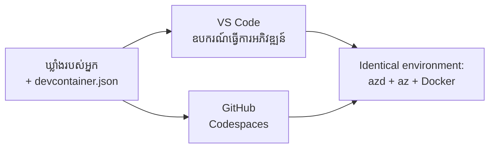

# ធុង dev និង GitHub Codespaces សម្រាប់ azd

**ចរណ់ផ្លូវជាផ្លូវការ៖**
- **📚 ទំព័រផ្ទះវគ្គសិក្សា**: [AZD សម្រាប់អ្នកចាប់ផ្ដើម](../../README.md)
- **📖 វគ្គសិក្សាបច្ចុប្បន្ន**: វគ្គ 1 - មូលដ្ឋាន និង ចាប់ផ្ដើមយ៉ាងឆាប់រហ័ស
- **⬅️ មុននេះ**: [យកកម្មវិធីរបស់អ្នកមក](bring-your-own-app.md)
- **🚀 វគ្គបន្ទាប់**: [វគ្គ 2: ការអភិវឌ្ឍ AI ជាដំបូង](../chapter-02-ai-development/README.md)

> ត្រូវបានផ្ទៀងផ្ទាត់ជាមួយ `azd 1.27.1` នៅខែកក្កដា 2026។

## ណែនាំ

ការដំឡើង azd, មជ្ឈមណ្ឌលភាសាដំណើរការ, Docker និង Azure CLI ក្នុងមួយម៉ាស៊ីនគឺជាការងារលំបាក មួយហេតុផលចម្បងដែលមេរៀនមួយ "ដំណើរការនៅលើម៉ាស៊ីនខ្ញុំ" បរាជ័យសម្រាប់អ្នកផ្សេងទៀតជាការនេះ។ ធុង dev ជួយដោះស្រាយបញ្ហានេះដោយពិពណ៌នាអំពីសង្វាក់ឧបករណ៍ទាំងមូលរបស់អ្នកក្នុងឯកសារ ម្ចាស់គម្រោងណាមួយដែលបើកគម្រោងនៅក្នុង VS Code ឬ GitHub Codespaces នឹងទទួលបានបរិយាកាសដូចគ្នាពេញលេញ ជាមួយនឹងការដំឡើង azd រួចរាល់។ មេរៀននេះបង្ហាញអ្នកពីរបៀបបន្ថែមវា។

## គោលបំណងសិក្សា

នៅចុងមេរៀននេះ អ្នកនឹង:
- យល់អំពីអ្វីទៅជា dev container និងហេតុអ្វីវាជួយជាមួយ azd
- បន្ថែម `.devcontainer/devcontainer.json` ញឹកញាប់ទៅគម្រោងមួយ
- រួមបញ្ចូល azd, Azure CLI និង Docker តាមរយៈ លក្ខណៈពិសេស Dev Container *
- បើកគម្រោងនៅ GitHub Codespaces ឬ VS Code

## លទ្ធផលសិក្សា

បន្ទាប់ពីបញ្ចប់មេរៀននេះ អ្នកអាច:
- បង្កើត `devcontainer.json` សម្រាប់គម្រោង azd
- បន្ថែម azd និងឧបករណ៍ Azure ដោយមិនចាំបាច់ដំឡើងដោយដៃ
- រត់ `azd up` ពីក្រៅក្នុងធុងឬ Codespace

---

## Dev Container គឺជាអ្វី?

Dev container គឺជាបរិយាកាសអភិវឌ្ឍដែលផ្អែកលើ Docker ដែលកំណត់ដោយឯកសារ `.devcontainer/devcontainer.json` នៅក្នុងកន្លែងផ្ទុករបស់អ្នក។ ខណៈដែលអ្នកបើកគម្រោង:

- **VS Code** (ជាមួយនឹងបន្ថែម Dev Containers) សង់ធុងហើយភ្ជាប់ទៅវា។
- **GitHub Codespaces** សង់ធុងដូចគ្នានៅលើពពក ហើយផ្ដល់អ្នកនូវកម្មវិធីកែសម្រួលតាមកម្មវិធីគេហទំព័រ។

ទាំងពីរប្រភេទ អ្នករួមចំណែកទាំងអស់ទទួលបានឧបករណ៍ដូចគ្នា—គ្មានការឆ្លងកាត់បញ្ហា "តើអ្នកបានដំឡើង azd ទេ?"



---

## ជំហ៊ាន 1៖ បង្កើតឯកសារ devcontainer

បង្កើត `.devcontainer/devcontainer.json` នៅក្នុងឫសគម្រោងរបស់អ្នក៖

```json
{
  "name": "azd-project",
  "image": "mcr.microsoft.com/devcontainers/base:bookworm",
  "features": {
    "ghcr.io/devcontainers/features/azure-cli:1": {},
    "ghcr.io/azure/azure-dev/azd:latest": {},
    "ghcr.io/devcontainers/features/docker-in-docker:2": {},
    "ghcr.io/devcontainers/features/node:1": {}
  },
  "customizations": {
    "vscode": {
      "extensions": [
        "ms-azuretools.azure-dev",
        "ms-azuretools.vscode-bicep"
      ]
    }
  },
  "forwardPorts": [3000],
  "postCreateCommand": "azd version"
}
```

អ្វីដែលផ្នែកនីមួយៗធ្វើ:

| គន្លង | គោលបំណង |
|-----|---------|
| `image` | ប្រព័ន្ធប្រតិបត្តិការ មូលដ្ឋានសម្រាប់ធុង |
| `features` | កម្មវិធីដំឡើងជាស្រេច—ទីនេះ: Azure CLI, **azd**, Docker និង Node.js |
| `customizations.vscode.extensions` | ដំឡើងស្វ័យប្រវត្តិពង្រឹង VS Code របស់ azd និង Bicep |
| `forwardPorts` | បង្ហាញច្រកបើកកម្មវិធីរបស់អ្នកទៅកាន់កម្មវិធីរុករក |
| `postCreateCommand` | រំដោះមួយលើកបន្ទាប់ពីធុងត្រូវបានសង់ (ទីនេះ, ការត្រួតពិនិត្យភាពត្រឹមត្រូវ) |

> លក្ខណៈពិសេស `ghcr.io/azure/azure-dev/azd:latest` គឺជាវិធីផ្លូវការដើម្បីទទួលបាន azd ក្នុងធុង។ បញ្ជាក់កំណែជាក់លាក់ (ឧ. `azd:1.27.1`) ប្រសិនបើអ្នកត្រូវការការប្រមាណបែបមានតម្លាភាព។

---

## ជំហ៊ាន 2៖ ផ្គូផ្គងលក្ខណៈពិសេសជាចំពោះភាសាកម្មវិធីរបស់អ្នក

ប្ដូរលក្ខណៈពិសេស `node` ជាមួយអ្វីខ្លះដែលកម្មវិធីរបស់អ្នកប្រើ៖

```jsonc
// Python project
"ghcr.io/devcontainers/features/python:1": {},

// .NET project
"ghcr.io/devcontainers/features/dotnet:2": {},

// Java project
"ghcr.io/devcontainers/features/java:1": {},

// Go project
"ghcr.io/devcontainers/features/go:1": {}
```

រក្សា `docker-in-docker` ប្រសិនបើ `host` របស់អ្នកគឺ `containerapp`, `aks`, ឬអ្វីក៏ដោយដែលសង់រូបភាពធុង—azd ត្រូវការរបៀប Docker ដើម្បីសង់ និងទម្លាក់រូបភាព។

---

## ជំហ៊ាន 3៖ បើកវា

**នៅក្នុង VS Code:**
1. ដំឡើងបន្ថែម **Dev Containers** ។
2. បើកថតគម្រោង។
3. ចុច **Reopen in Container** នៅពេលបានស្នើ (ឬរត់ *Dev Containers: Reopen in Container*)។

**នៅក្នុង GitHub Codespaces:**
1. បញ្ចូល repo ទៅ GitHub។
2. ចុច **Code → Codespaces → Create codespace on main**។
3. រង់ចាំឲ្យធុងត្រូវបានសាងសង់—azd គ្រាន់តែលែងក្នុង terminal។

---

## ជំហ៊ាន 4៖ បង្ហោះពីក្នុងធុង

ធុងមាន azd ដំឡើងរួចហើយ ដូច្នេះចរន្តការងារធម្មតារត់បានត្រឹមត្រូវ៖

```bash
azd auth login --use-device-code   # កូដឧបករណ៍មានប្រយោជន៍ខ្លាំងនៅក្នុង Codespaces
azd up
```

> **ហេតុអ្វីបានជា `--use-device-code`?** នៅក្នុងធុងឆ្ងាយឬ Codespace គ្មានកម្មវិធីរុករកក្នុងដៃហើយដើម្បីបង្វិលទិសទៅ ដូច្នេះការ​ចូល​ផ្នែក​ដោយ​កូដឧបករណ៍គឺជាវិធីជឿជាក់។ អ្នកនឹងចម្លងកូដទៅក្នុងផ្ទាំងកម្មវិធីរុករកដើម្បីបញ្ចប់ការចូល។

---

## បញ្ហាទូទៅ

| បញ្ហា | ដោះស្រាយ |
|---------|-----|
| `azd up` មិនអាចសង់រូបភាព | បន្ថែមលក្ខណៈ `docker-in-docker` |
| ការចូលក្នុងកម្មវិធីរុករកអវត្តមាននៅ Codespaces | ប្រើ `azd auth login --use-device-code` |
| ឧបករណ៍ខុសគ្នារវាងមិត្តរួមការងារ | បញ្ជាក់កំណែលក្ខណៈ (ឧ. `azd:1.27.1`) |
| កម្មវិធីមិនអាចចូលប្រើបាននៅក្នុងកម្មវិធីរុករក | បន្ថែមច្រកទៅ `forwardPorts` |

---

## សេចក្តីសង្ខេប

- Dev container ធ្វើឲ្យសង្វាក់ឧបករណ៍ azd របស់អ្នកអាចអនុវត្តបានសម្រាប់មនុស្សទាំងអស់។
- បន្ថែម azd, Azure CLI, និង Docker តាមរយៈ លក្ខណៈពិសេស Dev Container *features*។
- ផ្គូផ្គងលក្ខណៈភាសាជាមួយកម្មវិធីរបស់អ្នក និងរក្សា `docker-in-docker` សម្រាប់ម៉ាស៊ីនមេធុង។
- ប្រើការចូលដោយកូដឧបករណ៍នៅពេលរត់ក្នុង Codespaces។

---

## 🔗 ចរណ់ផ្លូវ

| ទិស | ធនធាន |
|-----------|----------|
| **មុននេះ** | [យកកម្មវិធីរបស់អ្នកមក](bring-your-own-app.md) |
| **ទំព័រផ្ទះវគ្គ** | [វគ្គ 1: មូលដ្ឋាន និងចាប់ផ្ដើមយ៉ាងឆាប់រហ័ស](README.md) |
| **វគ្គបន្ទាប់** | [វគ្គ 2: ការអភិវឌ្ឍ AI ជាដំបូង](../chapter-02-ai-development/README.md) |

## 📖 ធនធានពាក់ព័ន្ធ

- [ការដំឡើង និង ការតំឡើង](installation.md)
- [តារាងបញ្ជាដៃក្រៅ](../../resources/cheat-sheet.md)
- [លក្ខណៈពិសេស Dev Containers ផ្លូវការ](https://containers.dev/)
- [លក្ខណៈពិសេស Azd Dev Container](https://github.com/Azure/azure-dev/tree/main/ext/devcontainer)

---

<!-- CO-OP TRANSLATOR DISCLAIMER START -->
**ការបដិសេធ**:
ឯកសារនេះត្រូវបានបម្លែងភាសា ដោយប្រើសេវាបម្លែងភាសា AI [Co-op Translator](https://github.com/Azure/co-op-translator)។ ទោះយើងខ្ញុំមានក្តីប្រាថ្នាឱ្យបានច្បាស់លាស់ តែសូមយល់ដឹងថាការបម្លែងដោយស្វ័យប្រវត្តិក៏អាចមានកំហុសឬភាពមិនត្រឹមត្រូវ។ ឯកសារដើមជាភាសាទីតាំងគួរត្រូវបានគេប្រើជាប្រភពច្បាស់លាស់។ សម្រាប់ព័ត៌មានសំខាន់ៗ សូមណែនាំឱ្យប្រើប្រាស់ការប្រែដោយមនុស្សជំនាញ។ យើងខ្ញុំមិនទទួលខុសត្រូវចំពោះការយល់ច្រឡំ ឬការបកស្រាយខុសបន្ទាប់ពីការប្រើប្រាស់ការបម្លែងនេះនោះទេ។
<!-- CO-OP TRANSLATOR DISCLAIMER END -->