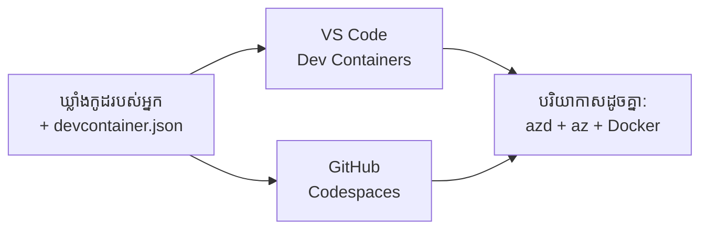

# Dev Containers & GitHub Codespaces for azd

**Chapter Navigation:**
- **📚 Course Home**: [AZD សម្រាប់អ្នកចាប់ផ្ដើម](../../README.md)
- **📖 Current Chapter**: ជំពូក 1 - មូលដ្ឋាន និង ចាប់ផ្ដើមឆាប់ៗ
- **⬅️ Previous**: [នាំកម្មវិធីរបស់អ្នកមក](bring-your-own-app.md)
- **🚀 Next Chapter**: [ជំពូក ២: ការអភិវឌ្ឍន៍ដែលផ្តោតលើ AI](../chapter-02-ai-development/README.md)

> បានផ្ទៀងផ្ទាត់ជាមួយ `azd 1.25.6` នៅខែមិថុនា 2026.

## ការណែនាំ

ការតំឡើង azd, runtime ភាសាដែលត្រឹមត្រូវ, Docker, និង Azure CLI លើមាស៊ីនរាល់មួយគឺជាការងារខ្វល់—ហើយនេះជាហេតុផលលេខមួយដែលមេរៀនដែល "ដំណើរការនៅលើម៉ាស៊ីនរបស់ខ្ញុំ" មិនដំណើរការសម្រាប់អ្នកផ្សេងទៀត។ ជម្រើស **dev container** ដោះស្រាយបញ្ហានេះដោយពិពណ៌នាលើ toolchain ទាំងមូលរបស់អ្នកក្នុងឯកសារ មួយ។ អ្នកណាមួយដែលបើកគម្រោងនៅក្នុង VS Code ឬ GitHub Codespaces នឹងទទួលបានបរិយាកាសដូចគ្នាទាំងស្រុង មាន azd ត្រូវបានតំឡើងរួចហើយ។ មេរៀននេះបង្ហាញពីរបៀបបន្ថែមវា។

## គោលដៅការសិក្សា

នៅចុងបញ្ចប់មេរៀននេះ អ្នកនឹង:
- យល់ពី dev container និងហេតុផលដែលវាជួយសម្រាប់ azd
- បន្ថែម `.devcontainer/devcontainer.json` សាមញ្ញមួយទៅក្នុងគម្រោង
- រួមមាន azd, Azure CLI, និង Docker តាមរយៈ Dev Container *features*
- បើកគម្រោងក្នុង GitHub Codespaces ឬ VS Code

## លទ្ធផលការសិក្សា

បន្ទាប់ពីបញ្ចប់មេរៀននេះ អ្នកនឹងអាច:
- សរសេរ `devcontainer.json` សម្រាប់គម្រោង azd
- បន្ថែម azd និងឧបករណ៍ Azure ដោយគ្មានការតំឡើងដ៏ដៃ
- រត់ `azd up` ពីក្នុង container ឬ Codespace

---

## Dev Container គឺជា​អ្វី?

Dev container គឺជាបរិយាកាសអភិវឌ្ឍដែលប្រើប្រាស់ Docker ដែលបានកំណត់ដោយឯកសារ `.devcontainer/devcontainer.json` ក្នុង仓庫របស់អ្នក។ ពេលដែលអ្នកបើកគម្រោង:

- **VS Code** (ជាមួយផ្នែកបន្ថែម Dev Containers) នឹងបង្កើត container ហើយភ្ជាប់ទៅដល់វា។
- **GitHub Codespaces** នឹងបង្កើត container ដូចគ្នានៅលើ cloud ហើយផ្តល់ឱ្យអ្នកនូវកម្មវិធីកែសម្រួលនៅក្នុង browser។

ទាំងពីរប្រភេទនេះ អ្នកចូលរួមគ្រប់រូបនឹងទទួលបានឧបករណ៍ដូចគ្នា—គ្មានការត្រួតពិនិត្យ "តើអ្នកបានតំឡើង azd ទេ?" ទៀត។



---

## ជំហាន 1: បង្កើតឯកសារ devcontainer

បង្កើត `.devcontainer/devcontainer.json` នៅគ្រឹះរបស់គម្រោងរបស់អ្នក:

```json
{
  "name": "azd-project",
  "image": "mcr.microsoft.com/devcontainers/base:bookworm",
  "features": {
    "ghcr.io/devcontainers/features/azure-cli:1": {},
    "ghcr.io/azure/azure-dev/azd:latest": {},
    "ghcr.io/devcontainers/features/docker-in-docker:2": {},
    "ghcr.io/devcontainers/features/node:1": {}
  },
  "customizations": {
    "vscode": {
      "extensions": [
        "ms-azuretools.azure-dev",
        "ms-azuretools.vscode-bicep"
      ]
    }
  },
  "forwardPorts": [3000],
  "postCreateCommand": "azd version"
}
```

អ្វីដែលនីតិវិធីនីមួយៗធ្វើ៖

| Key | Purpose |
|-----|---------|
| `image` | ប្រព័ន្ធប្រតិបត្តិការ​មូលដ្ឋានសម្រាប់ container |
| `features` | កម្មវិធីដំឡើងដែលបានកសាងរួច—នៅទីនេះ៖ Azure CLI, **azd**, Docker, និង Node.js |
| `customizations.vscode.extensions` | ដំឡើងដោយស្វ័យប្រវត្តិផ្នែកបន្ថែម azd និង Bicep សម្រាប់ VS Code |
| `forwardPorts` | បើកច្រក (port) នៃកម្មវិធីរបស់អ្នកទៅក្នុងកម្មវិធីរុករក |
| `postCreateCommand` | រត់មួយដងបន្ទាប់ពី container ត្រូវបានកសាង (នៅទីនេះ ជាការត្រួតពិនិត្យ) |

> លក្ខណៈពិសេស `ghcr.io/azure/azure-dev/azd:latest` គឺជាវិធីផ្លូវការដើម្បីទទួលបាន azd ក្នុង container។ បន្ថែមកំណែជាក់លាក់ (ឧ. `azd:1.25.6`) ប្រសិនបើអ្នកត្រូវការការកើតឡើងម្ដងទៀតយ៉ាងត្រឹមត្រូវ។

---

## ជំហាន 2: សមកាល Feature ទៅភាសាកម្មវិធីរបស់អ្នក

ប្ដូរ feature `node` ជាមួយអ្វីផងដែលកម្មវិធីរបស់អ្នកប្រើ:

```jsonc
// Python project
"ghcr.io/devcontainers/features/python:1": {},

// .NET project
"ghcr.io/devcontainers/features/dotnet:2": {},

// Java project
"ghcr.io/devcontainers/features/java:1": {},

// Go project
"ghcr.io/devcontainers/features/go:1": {}
```

រក្សា `docker-in-docker` ប្រសិនបើ `host` របស់អ្នកគឺ `containerapp`, `aks`, ឬអ្វីមួយដែលកសាងរូបភាព container—azd ត្រូវការពី Docker ដើម្បីកសាង និង push រូបភាព។

---

## ជំហាន 3: បើកវា

**នៅក្នុង VS Code:**
1. តំឡើងផ្នែកបន្ថែម **Dev Containers**។
2. បើកថតគម្រោង។ 
3. ចុច **Reopen in Container** ពេលមានការស្នើសុំ (ឬរត់ *Dev Containers: Reopen in Container*)។

**នៅក្នុង GitHub Codespaces:**
1. Push repo ទៅ GitHub។
2. ចុច **Code → Codespaces → Create codespace on main**।
3. រងចាំដើម្បីឱ្យ container ត្រូវបានកសាង—azd ត្រូវបានត្រៀមនៅក្នុង terminal។

---

## ជំហាន 4: ដាក់បញ្ចូលពីក្នុង Container

Container មាន azd ត្រូវបានតំឡើងរួចហើយ ដូច្នេះកំណត់ទម្លាប់ធម្មតានឹងដំណើរការ:

```bash
azd auth login --use-device-code   # កូដឧបករណ៍មានប្រយោជន៍នៅក្នុង Codespaces
azd up
```

> **ហេតុអ្វី `--use-device-code`?** ក្នុង container ឬ Codespace ឆ្ងាយ មិនមានកម្មវិធីរុករកក្នុងម៉ាស៊ីនដើម្បីបញ្ជូនវិញទេ ដូច្នេះការចូលដោយ device-code គឺជាវិធីដែលទុកចិត្តបាន។ អ្នកនឹងដាក់កូដមួយទៅក្នុងផ្ទាំងទំព័ររុករកដើម្បីបញ្ចប់ការចូល។

---

## បញ្ហាទូទៅ

| បញ្ហា | ដំណោះស្រាយ |
|---------|-----|
| `azd up` can't build an image | បន្ថែម feature `docker-in-docker` |
| Browser login hangs in Codespaces | ប្រើ `azd auth login --use-device-code` |
| Tools differ between teammates | កំណត់កំណែរបស់ feature (ឧ. `azd:1.25.6`) |
| App not reachable in browser | បន្ថែម port ទៅ `forwardPorts` |

---

## សេចក្តីសង្ខេប

- Dev container ធ្វើឱ្យ toolchain របស់ azd របស់អ្នកអាចកើតឡើងម្ដងទៀតសម្រាប់គ្រប់គ្នា។
- បន្ថែម azd, Azure CLI, និង Docker តាមរយៈ Dev Container *features*។
- សមកាល feature ភាសាឲ្យសមនឹងកម្មវិធីរបស់អ្នក ហើយរក្សា `docker-in-docker` សម្រាប់ host ដែលជាកុងតែន័រ។
- ប្រើ device-code login ពេលបញ្ជាប្រតិបត្តិការនៅក្នុង Codespaces។

---

## 🔗 រុករក

| ទិស | ធនធាន |
|-----------|----------|
| **មុន** | [នាំកម្មវិធីរបស់អ្នកមក](bring-your-own-app.md) |
| **ទំព័រដើមជំពូក** | [ជំពូក 1: មូលដ្ឋាន និង ចាប់ផ្ដើមឆាប់ៗ](README.md) |
| **ជំពូកបន្ទាប់** | [ជំពូក ២: ការអភិវឌ្ឍន៍ដែលផ្តោតលើ AI](../chapter-02-ai-development/README.md) |

## 📖 ធនធាន​ដែលពាក់ព័ន្ធ

- [ការដំឡើង និង ការកំណត់](installation.md)
- [តារាងបញ្ជា](../../resources/cheat-sheet.md)
- [ការបញ្ជាក់ផ្លូវការនៃ Dev Containers](https://containers.dev/)
- [លក្ខណៈពិសេស Dev Container របស់ azd](https://github.com/Azure/azure-dev/tree/main/ext/devcontainer)

---

<!-- CO-OP TRANSLATOR DISCLAIMER START -->
**ការបដិសេធ**:
ឯកសារនេះត្រូវបានបម្លែងភាសា ដោយប្រើសេវាបម្លែងភាសា AI [Co-op Translator](https://github.com/Azure/co-op-translator)។ ទោះយើងខ្ញុំមានក្តីប្រាថ្នាឱ្យបានច្បាស់លាស់ តែសូមយល់ដឹងថាការបម្លែងដោយស្វ័យប្រវត្តិក៏អាចមានកំហុសឬភាពមិនត្រឹមត្រូវ។ ឯកសារដើមជាភាសាទីតាំងគួរត្រូវបានគេប្រើជាប្រភពច្បាស់លាស់។ សម្រាប់ព័ត៌មានសំខាន់ៗ សូមណែនាំឱ្យប្រើប្រាស់ការប្រែដោយមនុស្សជំនាញ។ យើងខ្ញុំមិនទទួលខុសត្រូវចំពោះការយល់ច្រឡំ ឬការបកស្រាយខុសបន្ទាប់ពីការប្រើប្រាស់ការបម្លែងនេះនោះទេ។
<!-- CO-OP TRANSLATOR DISCLAIMER END -->