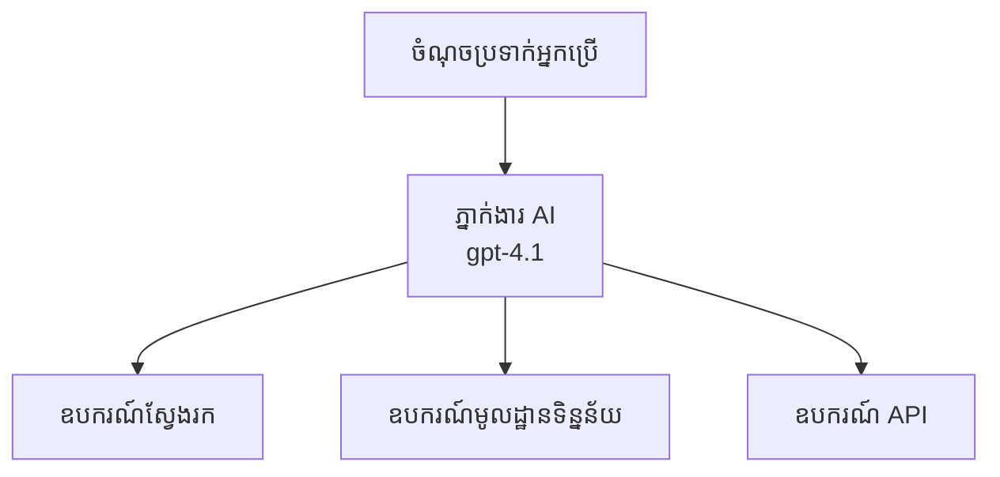
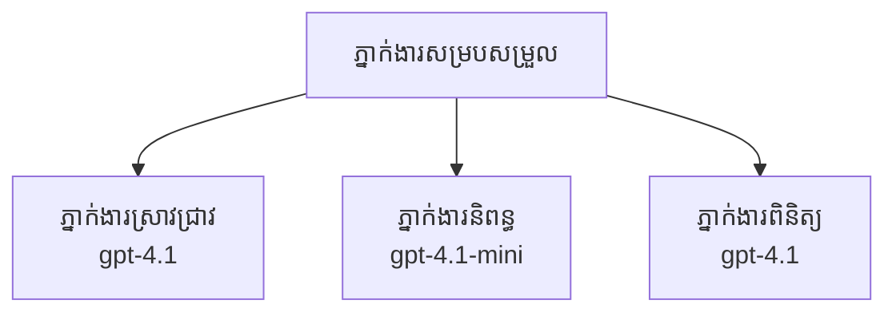

# ភ្នាក់ងារ AI ជាមួយ Azure Developer CLI

**ការរុករកជំពូក៖**
- **📚 ទំព័រដើមវគ្គ**: [AZD សម្រាប់អ្នកចាប់ផ្ដើម](../../README.md)
- **📖 ជំពូកបច្ចុប្បន្ន**: ជំពូក 2 - ការអភិវឌ្ឍន៍ផ្អែកលើ AI
- **⬅️ មុន**: [ការរួមបញ្ចូល Microsoft Foundry](microsoft-foundry-integration.md)
- **➡️ បន្ទាប់**: [ការដាក់ចេញគំរូ AI](ai-model-deployment.md)
- **🚀 កម្រិតខ្ពស់**: [ដំណោះស្រាយពហុភ្នាក់ងារ](../../examples/retail-scenario.md)

---

## ការណែនាំ

ភ្នាក់ងារ AI គឺជាកម្មវិធីឯករាជ្យដែលអាចយល់ពីបរិយាកាសរបស់ពួកវា សម្រេចចិត្ត និងអនុវត្តសកម្មភាពដើម្បីសម្រេចគោលបំណងជាក់លាក់។ ខុសពី chatbot ធម្មតាដែលឆ្លើយតបនឹងសំណើ, ភ្នាក់ងារ​អាច៖

- **ប្រើឧបករណ៍** - ហៅ APIs, ស្វែងរកមូលដ្ឋានទិន្នន័យ, ប្រតិបត្តិកូដ
- **មានផែនការ និងហេតុផល** - បំបែកភារកិច្ចស្មុគស្មាញជា​ជំហាន
- **សិក្សាលើបរិបទ** - រក្សាភាពចងចាំ និងសម្របខ្លួន
- **សហការការ** - ធ្វើការ​ជាមួយភ្នាក់ងារផ្សេងទៀត (ប្រព័ន្ធពហុភ្នាក់ងារ)

មគ្គុទេសក៍នេះបង្ហាញ​អ្នកពីរបៀបដាក់ចេញភ្នាក់ងារ AI ទៅកាន់ Azure ដោយប្រើ Azure Developer CLI (azd)។

> **កំណត់សម្គាល់ផ្ទៀងផ្ទាត់ (2026-03-25):** មគ្គុទេសក៍នេះបានត្រួតពិនិត្យប្រឆាំងនឹង `azd` `1.23.12` និង `azure.ai.agents` `0.1.18-preview`។ បទពិសោធន៍ `azd ai` មិនទាន់នៅក្នុងស្ថានភាពចេញស្ថិតិពេញលេញទេទេ ដូច្នេះសូមពិនិត្យជំនួយនៃបន្ថែម ប្រសិនបើស្លាកដែលបានដំឡើងរបស់អ្នកខុសគ្នា។

## គោលដៅការសិក្សា

ដោយបញ្ចប់មគ្គុទេសក៍នេះ អ្នកនឹងអាច៖
- យល់ពីអ្វីទៅជាភ្នាក់ងារ AI និងភាពខុសគ្នារវាងវានិង chatbot
- ដាក់ចេញគំរូភ្នាក់ងារ​ដែលបានរៀបចំជាស្រេចដោយប្រើ AZD
- កំណត់ Foundry Agents សម្រាប់ភ្នាក់ងារផ្ទាល់ខ្លួន
- អនុវត្តលំនាំភ្នាក់ងារមូលដ្ឋាន (ការប្រើឧបករណ៍, RAG, ពហុភ្នាក់ងារ)
- តាមដាន និងដោះស្រាយបញ្ហាភ្នាក់ងារ​ដែលបានដាក់ចេញ

## លទ្ធផលដែលត្រូវទទួលបាន

បន្ទាប់ពីបញ្ចប់ អ្នកនឹងអាច៖
- ដាក់ចេញកម្មវិធីភ្នាក់ងារ AI ទៅ Azure ជាមួយ​ពាក្យបញ្ជាតែមួយ
- កំណត់ឧបករណ៍និងសមត្ថភាពភ្នាក់ងារ
- អនុវត្តការបង្កើតដោយលើការស្វែងយល់ (RAG) ជាមួយភ្នាក់ងារ
- សχεដ្ឋានស្ថាបត្យកម្មពហុភ្នាក់ងារសម្រាប់លំហាត់ការ​ចម្រូងចម្រាស
- ដោះស្រាយបញ្ហារីករាលដាលពេលដាក់ចេញភ្នាក់ងារ

---

## 🤖 អ្វីដែលធ្វើឲ្យភ្នាក់ងារផ្សេងពី Chatbot?

| លក្ខណៈ | Chatbot | ភ្នាក់ងារ AI |
|---------|---------|---------------|
| **ឥរិយាបថ** | ឆ្លើយតបនឹងសំណើ | អនុវត្តសកម្មភាពដោយខ្លួនឯង |
| **ឧបករណ៍** | គ្មាន | អាចហៅ APIs, ស្វែងរក, ប្រតិបត្តិកូដ |
| **ចងចាំ** | ផ្អែកលើសម័យតែប៉ុណ្ណោះ | ចងចាំជាអចិន្រ្តៃយ៍ឆ្លងកាត់សម័យ |
| **ផែនការ** | ឆ្លើយតបតែមួយ | មានហេតុផលច្រើនជំហាន |
| **សហការការ** | អង្គភាពតែមួយ | អាចធ្វើការ​ជាមួយភ្នាក់ងារផ្សេងទៀត |

### ពន្យល់​សាមញ្ញ

- **Chatbot** = មនុស្សជួយឆ្លើយសំណួរនៅលើតុព័ត៌មាន
- **ភ្នាក់ងារ AI** = ជំនួយការផ្ទាល់ខ្លួនដែលអាចទូរស័ព្ទ, កក់ការណាត់ជួប និងបំពេញភារកិច្ចសម្រាប់អ្នក

---

## 🚀 ចាប់ផ្តើមយ៉ាងលឿន៖ ដាក់ចេញភ្នាក់ងារដំបូងរបស់អ្នក

### ជម្រើស 1: គំរូ Foundry Agents (ផ្តល់អនុសាសន៍)

```bash
# ដាក់ដំណើរការគំរូភ្នាក់ងារ AI
azd init --template get-started-with-ai-agents

# ដាក់ឲ្យដំណើរការលើ Azure
azd up
```

**អ្វីដែលត្រូវដាក់ចេញ៖**
- ✅ Foundry Agents
- ✅ Microsoft Foundry Models (gpt-4.1)
- ✅ Azure AI Search (សម្រាប់ RAG)
- ✅ Azure Container Apps (ចំណុចប្រទាក់វេប)
- ✅ Application Insights (ការត្រួតពិនិត្យ)

**ពេលវេលា:** ~15-20 នាទី
**ចំណាយ:** ~ $100-150/ខែ (អភិវឌ្ឍន៍)

### ជម្រើស 2: OpenAI Agent ជាមួយ Prompty

```bash
# ចាប់ផ្តើមគំរូភ្នាក់ងារ​ដែលផ្អែកលើ Prompty
azd init --template agent-openai-python-prompty

# ដាក់ឲ្យដំណើរការនៅលើ Azure
azd up
```

**អ្វីដែលត្រូវដាក់ចេញ៖**
- ✅ Azure Functions (ការប្រតិបត្តិភ្នាក់ងារឥតម៉ាស៊ីនបម្រើ)
- ✅ Microsoft Foundry Models
- ✅ ឯកសារកំណត់ត្រា Prompty
- ✅ ការអនុវត្តគំរូភ្នាក់ងារ

**ពេលវេលា:** ~10-15 នាទី
**ចំណាយ:** ~ $50-100/ខែ (អភិវឌ្ឍន៍)

### ជម្រើស 3: RAG Chat Agent

```bash
# ចាប់ផ្ដើមគំរូសន្ទនា RAG
azd init --template azure-search-openai-demo

# បង្ហោះទៅ Azure
azd up
```

**អ្វីដែលត្រូវដាក់ចេញ៖**
- ✅ Microsoft Foundry Models
- ✅ Azure AI Search ជាមួយទិន្នន័យគំរូ
- ✅ បណ្តាញដំណើរការប្រមូលផខណ្ឌឯកសារ
- ✅ ចំណុចប្រទាក់ជជែកជាមួយយោង

**ពេលវេលា:** ~15-25 នាទី
**ចំណាយ:** ~ $80-150/ខែ (អភិវឌ្ឍន៍)

### ជម្រើស 4: AZD AI Agent Init (មើលទិដ្ឋភាព Manifest ឬ Template)

ដើរតាមមានឯកសារ agent manifest អ្នកអាចប្រើ `azd ai` ដើម្បីកសាងគម្រោង Foundry Agent Service โดยផ្ទាល់។ កំណត់បើយកចុះ preview ចុងក្រោយក៏បានបន្ថែមការរួមបញ្ចូលដោយផ្អែកលើគំរូ ដូច្នេះល្បឿន និងលំនាំដែលចេញអាចខុសគ្នាបន្តិចទៅតាមកំណែបន្ថែមដែលបានដំឡើងរបស់អ្នក។

```bash
# ដំឡើងផ្នែកបន្ថែមភ្នាក់ងារ AI
azd extension install azure.ai.agents

# ជាជម្រើស: ផ្ទៀងផ្ទាត់កំណែពិនិត្យមុនដែលបានដំឡើង
azd extension show azure.ai.agents

# ចាប់ផ្ដើមពីឯកសារបញ្ជាក់របស់ភ្នាក់ងារ
azd ai agent init -m agent-manifest.yaml

# បង្ហោះទៅ Azure
azd up

# សាកល្បងភ្នាក់ងារដែលបានបង្ហោះ (បង្ហាញការពន្យារពេល និងពេលដល់បៃដំបូង)
azd ai agent invoke
```

**ពេលណាដើម្បីប្រើ `azd ai agent init` លើក `azd init --template`:**

| វិធីសាស្ត្រ | ល្អសម្រាប់ | វារបៀបធ្វើ |
|----------|----------|------|
| `azd init --template` | ចាប់ផ្តើមពីកម្មវិធីគំរូដែលដំណើរការ | ចម្លងរ៉ែបូគំរូពេញលេញដែលមានកូដ និងរចនាសម្ព័ន្ធ (infra) |
| `azd ai agent init -m` | សាងសង់ពី agent manifest ផ្ទាល់ខ្លួន | បង្កើតរចនាសម្ព័ន្ធគម្រោងពីការបញ្ជាក់ភ្នាក់ងាររបស់អ្នក |

> **ស៊ុម៖** ប្រើ `azd init --template` ពេលកំពុងសិក្សា (ជម្រើស 1-3 ខាងលើ)។ ប្រើ `azd ai agent init` ពេលកំពុងសាងសង់ភ្នាក់ងារផលិតកម្មដោយមាន manifest ផ្ទាល់ខ្លួន។

បន្ទាប់ពី `azd up` បន្ថែមដូចគ្នានឹងដឹកអ្នកឆ្លងកាត់ជីវចលនៃភ្នាក់ងារ: `azd ai agent invoke` សម្រាប់សាកល្បង, `azd ai agent eval generate` និង `azd ai agent optimize` សម្រាប់វាស់និងកែលុបគុណភាព, ហើយ `azd ai agent delete` សម្រាប់សម្អាត។ មើល [ពាក្យបញ្ជារ AZD AI CLI](../chapter-08-production/production-ai-practices.md#azd-ai-cli-commands-and-extensions) សម្រាប់ឯកសារយោងពេញលេញ។

---

## 🏗️ លំនាំស្ថាបត្យកម្មភ្នាក់ងារ

### លំនាំ 1: ភ្នាក់ងារតែមួយជាមួយឧបករណ៍

លំនាំភ្នាក់ងារមូលដំបូងមួយ - ភ្នាក់ងារតែមួយដែលអាចប្រើឧបករណ៍ច្រើន។



**ល្អសម្រាប់៖**
- chatbot សំរាប់ការគាំទ្រអតិថិជន
- ជំនួយការស្រាវជ្រាវ
- ភ្នាក់ងារវិភាគទិន្នន័យ

**AZD Template:** `azure-search-openai-demo`

### លំនាំ 2: RAG Agent (Retrieval-Augmented Generation)

ភ្នាក់ងារមួយដែលស្វែងរកឯកសារយ៉ាងសមរម្យមុនពេលបង្កើតចម្លើយ។

```mermaid
graph TD
    Query[សំណួររបស់អ្នកប្រើ] --> RAG[ភ្នាក់ងារ RAG]
    RAG --> Vector[ស្វែងរកវ៉ិចទ័រ]
    RAG --> LLM[ម៉ូដែលភាសាធំ (LLM)<br/>gpt-4.1]
    Vector -- Documents --> LLM
    LLM --> Response[ចម្លើយជាមួយយោង]
```

**ល្អសម្រាប់៖**
- គណនេយ្យចំណេះដឹងសហគ្រាស
- ប្រព័ន្ធ Q&A លើឯកសារ
- ការស្រាវជ្រាវផ្នែកគោលការណ៍ និងច្បាប់

**AZD Template:** `azure-search-openai-demo`

### លំនាំ 3: ប្រព័ន្ធពហុភ្នាក់ងារ

ភ្នាក់ងារពិសេសច្រើនធ្វើការរួមគ្នាសម្រាប់ភារកិច្ចស្មុគស្មាញ។



**ល្អសម្រាប់៖**
- ការបង្កើតមាតិកាស្មុគស្មាញ
- លំហាត់ច្រើនជំហាន
- ភារកិច្ចដែលតម្រូវឱ្យមានជំនាញផ្សេងៗគ្នា

**ស្វែងយល់បន្ថែម:** [លំនាំសម្របសម្រួលពហុភ្នាក់ងារ](../chapter-06-pre-deployment/coordination-patterns.md)

---

## ⚙️ កំណត់ឧបករណ៍សម្រាប់ភ្នាក់ងារ

ភ្នាក់ងារត្រូវមានអំណាចពេលពួកវាអាចប្រើឧបករណ៍។ នេះជារបៀបកំណត់ឧបករណ៍ទូទៅ៖

### ការកំណត់ឧបករណ៍នៅក្នុង Foundry Agents

```python
# agent_config.py
from azure.ai.projects import AIProjectClient
from azure.ai.projects.models import FunctionTool, CodeInterpreterTool

# កំណត់ឧបករណ៍ផ្ទាល់ខ្លួន
search_tool = FunctionTool(
    name="search_knowledge_base",
    description="Search the company knowledge base for relevant documents",
    parameters={
        "type": "object",
        "properties": {
            "query": {
                "type": "string",
                "description": "The search query"
            }
        },
        "required": ["query"]
    }
)

# បង្កើតភ្នាក់ងារជាមួយឧបករណ៍
agent = project_client.agents.create_agent(
    model="gpt-4.1",
    name="Support Agent",
    instructions="You are a helpful support agent. Use the search tool to find relevant information.",
    tools=[search_tool, CodeInterpreterTool()]
)
```

### ការកំណត់បរិបទបរិស្ថាន

```bash
# កំណត់អថេរពរិយាកាសជាក់លាក់សម្រាប់ភ្នាក់ងារ
azd env set AZURE_OPENAI_MODEL "gpt-4.1"
azd env set AGENT_INSTRUCTIONS "You are a helpful assistant..."
azd env set ENABLE_CODE_INTERPRETER "true"
azd env set ENABLE_FILE_SEARCH "true"

# ដាក់ចេញជាមួយការកំណត់ដែលបានបច្ចុប្បន្នភាព
azd deploy
```

---

## 📊 តាមដានភ្នាក់ងារ

### ការ​បញ្ចូល Application Insights

គំរូភ្នាក់ងារ AZD ទាំងអស់រួមមាន Application Insights សម្រាប់ការតាមដាន៖

```bash
# បើកផ្ទាំងតាមដាន
azd monitor --overview

# មើលកំណត់ហេតុពេលពិត
azd monitor --logs

# មើលសន្ទស្សន៍ពេលពិត
azd monitor --live
```

### មាត្រដ្ឋានសំខាន់ៗដែលត្រូវតាមដាន

| មាត្រដ្ឋាន | អធិប្បាយ | គោលបំណង |
|--------|-------------|--------|
| Response Latency | ពេលវេលាដើម្បីបង្កើតចម្លើយ | < 5 វិនាទី |
| Token Usage | Token ក្នុងមួយសំណើ | ត្រួតពិនិត្យសម្រាប់ការចំណាយ |
| Tool Call Success Rate | ភាគរយនៃការអនុវត្ដឧបករណ៍ដោយជោគជ័យ | > 95% |
| Error Rate | សំណើភ្នាក់ងារបរាជ័យ | < 1% |
| User Satisfaction | ពិន្ទុ​មតិយោបល់ | > 4.0/5.0 |

### ការចុះបញ្ជីផ្ទាល់ខ្លួន​សម្រាប់ភ្នាក់ងារ

```python
import os
from azure.monitor.opentelemetry import configure_azure_monitor
from opentelemetry import trace

# កំណត់រចនាសម្ព័ន្ធ Azure Monitor ជាមួយ OpenTelemetry
configure_azure_monitor(
    connection_string=os.environ["APPLICATIONINSIGHTS_CONNECTION_STRING"]
)

tracer = trace.get_tracer(__name__)

def log_agent_interaction(user_query, agent_response, tools_used, latency_ms):
    with tracer.start_as_current_span("agent_interaction") as span:
        span.set_attributes({
            "user_query": user_query,
            "response_length": len(agent_response),
            "tools_used": tools_used,
            "latency_ms": latency_ms
        })
```

> **ចំណាំ៖** ដំឡើងកញ្ចប់ដែលត្រូវការ៖ `pip install azure-monitor-opentelemetry opentelemetry`

---

## 💰 ការ​រកគិតចំណាយ

### ការចំណាយប្រហាក់ប្រហែលប្រចាំខែសម្រាប់តាមលំនាំ

| លំនាំ | បរិយាកាសអភិវឌ្ឍន៍ | ផលិតកម្ម |
|---------|-----------------|------------|
| ភ្នាក់ងារតែមួយ | $50-100 | $200-500 |
| RAG Agent | $80-150 | $300-800 |
| ពហុភ្នាក់ងារ (2-3 agents) | $150-300 | $500-1,500 |
| ពហុភ្នាក់ងារសម្រាប់សហគ្រាស | $300-500 | $1,500-5,000+ |

### គន្លឹះបង្កើនប្រសិទ្ធភាពចំណាយ

1. **ប្រើ gpt-4.1-mini សម្រាប់ភារកិច្ចសាមញ្ញ**
   ```bash
   azd env set AZURE_OPENAI_MODEL "gpt-4.1-mini"
   ```

2. **អនុវត្តការបង្គុយផ្ទុក (caching) សម្រាប់សំណើដែលម្តងជាថ្មី**
   ```python
   from functools import lru_cache
   
   @lru_cache(maxsize=1000)
   def get_cached_response(query_hash):
       return agent.run(query_hash)
   ```

3. **កំណត់ដែនកំណត់ token ក្នុងមួយរត់**
   ```python
   # កំណត់ max_completion_tokens នៅពេលដំណើរការ​ភ្នាក់ងារ មិនមែន​ក្នុងពេលបង្កើតទេ
   run = project_client.agents.create_run(
       thread_id=thread.id,
       agent_id=agent.id,
       max_completion_tokens=1000  # កំណត់ប្រវែងនៃការឆ្លើយតប
   )
   ```

4. **កំណត់ស្កាលទៅសូន្យពេលមិនប្រើ**
   ```bash
   # Container Apps អាចស្កេលរហូតដល់ចំនួនសូន្យដោយស្វ័យប្រវត្តិ
   azd env set MIN_REPLICAS "0"
   ```

---

## 🔧 ដោះស្រាយបញ្ហាសម្រាប់ភ្នាក់ងារ

### បញ្ហាទូទៅ និងដំណោះស្រាយ

<details>
<summary><strong>❌ ភ្នាក់ងារមិនឆ្លើយចំពោះការហៅឧបករណ៍</strong></summary>

```bash
# ពិនិត្យមើលថាឧបករណ៍បានចុះបញ្ជីយ៉ាងត្រឹមត្រូវឬទេ
azd show

# ផ្ទៀងផ្ទាត់ការដាក់ប្រើប្រាស់របស់ OpenAI
az cognitiveservices account deployment list \
  --name $AZURE_OPENAI_NAME \
  --resource-group $RG_NAME

# ពិនិត្យកំណត់ហេតុ​របស់ភ្នាក់ងារ
azd monitor --logs
```

**មូលហេតុទូទៅ៖**
- សញ្ញាហត្ថលេខាអនុគមន៍ឧបករណ៍មិនត្រូវគ្នា
- ខ្វះសិទ្ធិចាំបាច់
- ចំណុចចូលប្រើ API មិនអាចចូលបាន
</details>

<details>
<summary><strong>❌ ពេលយឺតខ្ពស់ក្នុងការឆ្លើយតបរបស់ភ្នាក់ងារ</strong></summary>

```bash
# ពិនិត្យ Application Insights សម្រាប់ចំណុចកកស្ទះ
azd monitor --live

# ពិចារណាការប្រើម៉ូដែលលឿនជាងនេះ
azd env set AZURE_OPENAI_MODEL "gpt-4.1-mini"
azd deploy
```

**គន្លឹះបង្កើនប្រសិទ្ធភាព៖**
- ប្រើចម្លើយជាស្ទ្រីម
- អនុវត្តការរក្សាទុកចម្លើយ (caching)
- កាត់បន្ថយទំហំបរិបទ
</details>

<details>
<summary><strong>❌ ភ្នាក់ងារត្រឡប់ព័ត៌មានខុស ឬមានការលេងស្រមៃ (hallucination)</strong></summary>

```python
# ធ្វើឲ្យប្រសើរជាមួយសារ​បញ្ជា​ប្រព័ន្ធល្អប្រសើរជាងមុន
instructions = """
You are a helpful assistant. IMPORTANT:
- Only answer based on provided context
- If you don't know, say "I don't know"
- Always cite your sources
- Never make up information
"""

# បន្ថែមការទាញយកសម្រាប់ធ្វើមូលដ្ឋាន
agent = project_client.agents.create_agent(
    model="gpt-4.1",
    instructions=instructions,
    tools=[FileSearchTool()]  # ធ្វើឲ្យចម្លើយមានមូលដ្ឋាននៅក្នុងឯកសារ
)
```
</details>

<details>
<summary><strong>❌ កំហុសដល់ដែនកំណត់ token</strong></summary>

```python
# អនុវត្តការគ្រប់គ្រងបង្អួចបរិបទ
def truncate_context(messages, max_tokens=8000, model="gpt-4.1"):
    """Keep only recent messages within token limit."""
    import tiktoken
    encoding = tiktoken.encoding_for_model(model)
    total_tokens = 0
    truncated = []
    
    for msg in reversed(messages):
        msg_tokens = len(encoding.encode(msg.content))
        if total_tokens + msg_tokens > max_tokens:
            break
        truncated.insert(0, msg)
        total_tokens += msg_tokens
    
    return truncated
```
</details>

---

## 🎓 អនុវត្តន៍ដោយដៃ

### លំហាត់ 1: ដាក់ចេញភ្នាក់ងារមូលដ្ឋាន (20 នាទី)

**គោលបំណង:** ដាក់ចេញភ្នាក់ងារ AI ដំបូងរបស់អ្នកដោយប្រើ AZD

```bash
# ជំហាន 1: ចាប់ផ្ដើមគំរូ
azd init --template get-started-with-ai-agents

# ជំហាន 2: ចូលទៅកាន់ Azure
azd auth login
# ប្រសិនបើអ្នកធ្វើការជាមួយ tenants ច្រើន បន្ថែម --tenant-id <tenant-id>

# ជំហាន 3: ដាក់បង្ហោះ
azd up

# ជំហាន 4: សាកល្បងភ្នាក់ងារ
# លទ្ធផលដែលរំពឹងទុកបន្ទាប់ពីការដាក់បង្ហោះ:
#   ការដាក់បង្ហោះបានបញ្ចប់!
#   ចំណុចចូល: https://<app-name>.<region>.azurecontainerapps.io
# បើក URL ដែលបង្ហាញក្នុងលទ្ធផល ហើយសាកសួរនូវសំណួរមួយ

# ជំហាន 5: មើលការតាមដាន
azd monitor --overview

# ជំហាន 6: សម្អាតធនធាន
azd down --force --purge
```

**លក្ខខណ្ឌជោគជ័យ៖**
- [ ] ភ្នាក់ងារឆ្លើយតបទៅនឹងសំណួរ
- [ ] អាចចូលដល់ផ្ទាំងត្រួតពិនិត្យតាមរយៈ `azd monitor`
- [ ] ធនធាន​បានសម្អាតដោយជោគជ័យ

### លំហាត់ 2: បន្ថែមឧបករណ៍ផ្ទាល់ខ្លួន (30 នាទី)

**គោលបំណង:** ពង្រីកភ្នាក់ងារដោយបន្ថែមឧបករណ៍ផ្ទាល់ខ្លួន

1. ដាក់ចេញគំរូភ្នាក់ងារ:
   ```bash
   azd init --template get-started-with-ai-agents
   azd up
   ```
2. បង្កើតមុខងារ​ឧបករណ៍ថ្មីក្នុងកូដភ្នាក់ងាររបស់អ្នក:
   ```python
   def get_weather(location: str) -> str:
       """Get current weather for a location."""
       # ការហៅ API ទៅសេវាកម្មអាកាសធាតុ
       return f"Weather in {location}: Sunny, 72°F"
   ```
3. ចុះបញ្ជីឧបករណ៍ជាមួយភ្នាក់ងារ:
   ```python
   from azure.ai.projects.models import FunctionTool

   weather_tool = FunctionTool(
       name="get_weather",
       description="Get current weather for a location",
       parameters={
           "type": "object",
           "properties": {
               "location": {"type": "string", "description": "City name"}
           },
           "required": ["location"]
       }
   )

   agent = project_client.agents.create_agent(
       model="gpt-4.1",
       name="Weather Agent",
       tools=[weather_tool]
   )
   ```
4. ធ្វើការដាក់ចេញឡើងវិញ និងសាកល្បង:
   ```bash
   azd deploy
   # សួរ: "ស្ថានភាពអាកាសធាតុនៅ Seattle យ៉ាងដូចម្តេច?"
   # ដែលរំពឹងទុក: ភ្នាក់ងារ ហៅ get_weather("Seattle") ហើយត្រឡប់ព័ត៌មានអាកាសធាតុ
   ```

**លក្ខខណ្ឌជោគជ័យ៖**
- [ ] ភ្នាក់ងារទទួលស្គាល់សំណួរពាក់ព័ន្ធអាកាសធាតុ
- [ ] ឧបករណ៍ត្រូវបានហៅយ៉ាងត្រឹមត្រូវ
- [ ] ចម្លើយរួមមានព័ត៌មានអាកាសធាតុ

### លំហាត់ 3: សាងសង់ភ្នាក់ងារ RAG (45 នាទី)

**គោលបំណង:** បង្កើតភ្នាក់ងារដែលឆ្លើយសំណួរពីឯកសាររបស់អ្នក

```bash
# ជំហានទី 1: ដាក់ឲ្យដំណើរការ គំរូ RAG
azd init --template azure-search-openai-demo
azd up

# ជំហានទី 2: ផ្ទុកឯកសាររបស់អ្នកឡើង
# ដាក់ឯកសារ PDF/TXT ក្នុងថត data/ បន្ទាប់មករត់:
python scripts/prepdocs.py

# ជំហានទី 3: សាកល្បងដោយសំនួរដែលពាក់ព័ន្ធនឹងដែនជាក់លាក់
# បើក URL នៃកម្មវិធីវេបពីលទ្ធផល azd up
# សួរសំនួរអំពីឯកសារដែលអ្នកបានផ្ទុកឡើង
# ចម្លើយគួរតែមានយោងដូចជា [doc.pdf]
```

**លក្ខខណ្ឌជោគជ័យ៖**
- [ ] ភ្នាក់ងារឆ្លើយពីឯកសារដែលបានបញ្ចូល
- [ ] ចម្លើយរួមមានយោង
- [ ] អតិបរិភាពគ្មាន hallucination នៅលើសំណួរចេញក្រៅវិស័យ

---

## 📚 ជំហានបន្ទាប់

ឥឡូវនេះអ្នកបានយល់ពីភ្នាក់ងារ AI សូមស្វែងយល់ពីប្រធានបទខ្ពស់ទាំងនេះ៖

| ប្រធានបទ | ពណ៌នា | តំណលីង |
|-------|-------------|------|
| **ប្រព័ន្ធពហុភ្នាក់ងារ** | សាងសង់ប្រព័ន្ធដែលមានភ្នាក់ងារច្រើនធ្វើការសហការគ្នា | [ឧទាហរណ៍ពហុភ្នាក់ងារសម្រាប់លក់រាយ](../../examples/retail-scenario.md) |
| **លំនាំសម្របសម្រួល** | រៀនពីលំនាំក្នុងការរៀបចំ និងទំនាក់ទំនង | [លំនាំសម្របសម្រួល](../chapter-06-pre-deployment/coordination-patterns.md) |
| **ការដាក់ចេញក្នុងផលិតកម្ម** | ការដាក់ចេញភ្នាក់ងារយ៉ាងសមស្របសម្រាប់សហគ្រាស | [Production AI Practices](../chapter-08-production/production-ai-practices.md) |
| **ការវាយតម្លៃភ្នាក់ងារ** | សាកល្បង និងវាយតម្លៃប្រសិទ្ធភាពភ្នាក់ងារ | [AI Troubleshooting](../chapter-07-troubleshooting/ai-troubleshooting.md) |
| **មន្ទីរពហុកិច្ច AI** | អនុវត្តដោយដៃ៖ ធ្វើឲ្យដំណោះស្រាយ AI របស់អ្នកត្រៀម AZD | [AI Workshop Lab](ai-workshop-lab.md) |

---

## 📖 វត្ថុធនធានបន្ថែម

### ឯកសារផ្លូវការណ៍
- [សេវា Microsoft Foundry Agent](https://learn.microsoft.com/azure/ai-services/agents/)
- [Quickstart សម្រាប់ Microsoft Foundry Agent Service](https://learn.microsoft.com/azure/ai-services/agents/quickstart)
- [Semantic Kernel Agent Framework](https://learn.microsoft.com/semantic-kernel/)

### គំរូ AZD សម្រាប់ភ្នាក់ងារ
- [ចាប់ផ្តើមជាមួយភ្នាក់ងារ AI](https://github.com/Azure-Samples/get-started-with-ai-agents)
- [Agent OpenAI Python Prompty](https://github.com/Azure-Samples/agent-openai-python-prompty)
- [Azure Search OpenAI Demo](https://github.com/Azure-Samples/azure-search-openai-demo)

### រមណីយដ្ឋានសហគមន៍
- [Awesome AZD - Agent Templates](https://azure.github.io/awesome-azd/?tags=ai-agents)
- [Azure AI Discord](https://discord.gg/microsoft-azure)
- [Microsoft Foundry Discord](https://discord.gg/nTYy5BXMWG)

### ជំនាញភ្នាក់ងារសម្រាប់កម្មវិធីកែសម្រួលរបស់អ្នក
- [**Microsoft Azure Agent Skills**](https://skills.sh/microsoft/github-copilot-for-azure) - ដំឡើងជំនាញភ្នាក់ងារ AI ដែលអាចប្រើឡើងវិញសម្រាប់ការអភិវឌ្ឍ Azure នៅក្នុង GitHub Copilot, Cursor ឬភ្នាក់ងារដែលគាំទ្រ។ រួមមានជំនាញសម្រាប់ [Azure AI](https://skills.sh/microsoft/github-copilot-for-azure/azure-ai), [Microsoft Foundry](https://skills.sh/microsoft/github-copilot-for-azure/microsoft-foundry), [deployment](https://skills.sh/microsoft/github-copilot-for-azure/azure-deploy), និង [diagnostics](https://skills.sh/microsoft/github-copilot-for-azure/azure-diagnostics):
  ```bash
  npx skills add microsoft/github-copilot-for-azure
  ```

---

**ការរុករក**
- **មេរៀនមុន**: [ការរួមបញ្ចូល Microsoft Foundry](microsoft-foundry-integration.md)
- **មេរៀនបន្ទាប់**: [ការដាក់ចេញគំរូ AI](ai-model-deployment.md)

---

<!-- CO-OP TRANSLATOR DISCLAIMER START -->
**ការបដិសេធ**:
ឯកសារនេះត្រូវបានបម្លែងភាសា ដោយប្រើសេវាបម្លែងភាសា AI [Co-op Translator](https://github.com/Azure/co-op-translator)។ ទោះយើងខ្ញុំមានក្តីប្រាថ្នាឱ្យបានច្បាស់លាស់ តែសូមយល់ដឹងថាការបម្លែងដោយស្វ័យប្រវត្តិក៏អាចមានកំហុសឬភាពមិនត្រឹមត្រូវ។ ឯកសារដើមជាភាសាទីតាំងគួរត្រូវបានគេប្រើជាប្រភពច្បាស់លាស់។ សម្រាប់ព័ត៌មានសំខាន់ៗ សូមណែនាំឱ្យប្រើប្រាស់ការប្រែដោយមនុស្សជំនាញ។ យើងខ្ញុំមិនទទួលខុសត្រូវចំពោះការយល់ច្រឡំ ឬការបកស្រាយខុសបន្ទាប់ពីការប្រើប្រាស់ការបម្លែងនេះនោះទេ។
<!-- CO-OP TRANSLATOR DISCLAIMER END -->