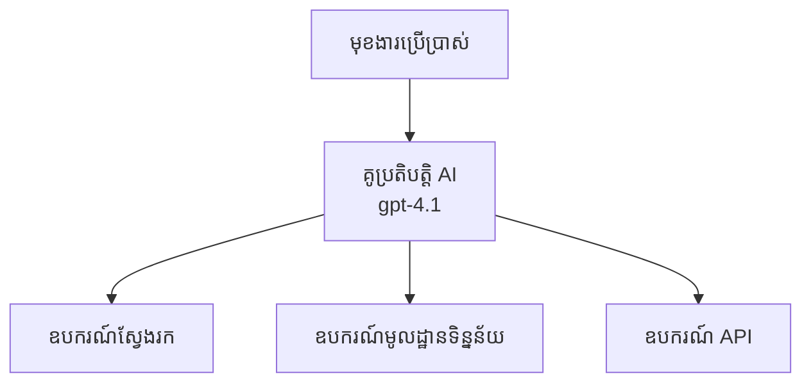
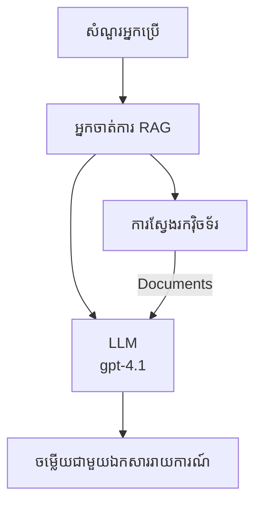
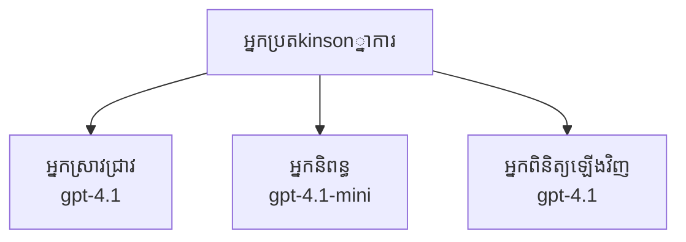

# អ្នកភ្នាក់ងារបញ្ញាសិប្បនិម្មិតជាមួយ Azure Developer CLI

**ការរុករកជំពូក៖**
- **📚 មុខងារមុខវិជ្ជា**៖ [AZD សម្រាប់អ្នកចាប់ផ្តើម](../../README.md)
- **📖 ជំពូកបច្ចុប្បន្ន**៖ ជំពូក 2 - ការអភិវឌ្ឍមុខងារ AI ជាទីមុខ
- **⬅️ មុននេះ**៖ [ការរួមបញ្ចូល Microsoft Foundry](microsoft-foundry-integration.md)
- **➡️ បន្ទាប់**៖ [ការដាក់បញ្ចូលម៉ូដែល AI](ai-model-deployment.md)
- **🚀 ជំហាន់ខ្ពស់**៖ [ដំណោះស្រាយពហុភ្នាក់ងារ](../../examples/retail-scenario.md)

---

## ការណែនាំ

អ្នកភ្នាក់ងារបញ្ញាសិប្បនិម្មិតជាប្រព័ន្ធកម្មវិធីឯករាជ្យដែលអាចទទួលបានព័ត៌មានពីបរិយាកាសរបស់ពួកគេ, ធ្វើការសម្រេចចិត្ត និងអនុវត្តសកម្មភាពដើម្បីសម្រេចបានគោលដៅជាក់លាក់។ ផ្ទុយពី chatbot ងាយៗដែលចម្លើយតាមសំណួរ, អ្នកភ្នាក់ងារអាច៖

- **ប្រើឧបករណ៍** - ហៅ API, ស្វែងរកទិន្នន័យ, ប្រតិបត្តិការ​កូដ
- **រៀបចំ និងយល់ដឹង** - បំបែកភារកិច្ចស្មុគស្មាញជាកំហុសៗ
- **រៀនពីបរិបទ** - រក្សារម២០ល និងបត់បែនអាកប្បកិរិយា
- **សហការគ្នា** - ធ្វើការជាមួយអ្នកភ្នាក់ងារផ្សេងទៀត (ប្រព័ន្ធពហុភ្នាក់ងារ)

មគ្គុទេសក៍នេះបង្ហាញពីរបៀបបញ្ចូលអ្នកភ្នាក់ងារ AI ទៅ Azure ដោយប្រើ Azure Developer CLI (azd)។

> **កំណត់សម្គាល់ការត្រួតពិនិត្យ (2026-07-13):** មគ្គុទេសក៍នេះបានពិនិត្យជាមួយ `azd` `1.27.1` និង `azure.ai.agents` `1.0.0-beta.5`។ បទពិសោធន៍ `azd ai` នៅតែងជាស្ថានភាពមើលមុន, ដូច្នោះសូមពិនិត្យជំនួយបន្ថែមប្រសិនបើពាក្យបញ្ចូលដែលអ្នកបានដំឡើងខុសគ្នា។

## គោលបំណងរៀន

ដោយបញ្ចប់មគ្គុទេសក៍នេះ អ្នកនឹងបាន៖
- ស្វែងយល់ពីអ្វីទៅជាអ្នកភ្នាក់ងារ AI និងចំណុះរវាងវានិង chatbot
- បញ្ចូលទម្រង់អ្នកភ្នាក់ងារ AI ដោយប្រើ AZD
- បង្កើតការកំណត់ Foundry Agents សម្រាប់អ្នកភ្នាក់ងារផ្ទាល់ខ្លួន
- អនុវត្តលំនាំអ្នកភ្នាក់ងារជាមូលដ្ឋាន (ប្រើឧបករណ៍, RAG, ពហុភ្នាក់ងារ)
- ត្រួតពិនិត្យ និងដោះស្រាយបញ្ហាអ្នកភ្នាក់ងារដាក់បញ្ចូល

## លទ្ធផលរៀន

បន្ទាប់ពីបញ្ចប់ អ្នកនឹងអាច៖
- បញ្ចូលកម្មវិធីអ្នកភ្នាក់ងារ AI ទៅ Azure ដោយមួយពាក្យបញ្ជា
- កំណត់ឧបករណ៍ និងសមត្ថភាពអ្នកភ្នាក់ងារ
- អនុវត្តបច្ចេកវិទ្យាច្នៃប្រឌិតបង្កើតបន្ថែម (RAG) ជាមួយអ្នកភ្នាក់ងារ
- រចនាសម្ព័ន្ធពហុភ្នាក់ងារសម្រាប់ចរន្តការងារស្មុគស្មាញ
- ដោះស្រាយបញ្ហាពេញនិយមក្នុងការដាក់ជូនអ្នកភ្នាក់ងារ

---

## 🤖 អ្វីដែលធ្វើឲ្យអ្នកភ្នាក់ងារប្រកួតប្រជែងខុសពី Chatbot?

| លក្ខណៈពិសេស | Chatbot | អ្នកភ្នាក់ងារ AI |
|---------|---------|----------|
| **អាកប្បកិរិយា** | ឆ្លើយតបតាមសំណួរ | ធ្វើសកម្មភាពឯករាជ្យ |
| **ឧបករណ៍** | គ្មាន | អាចហៅ API, ស្វែងរក, ប្រតិបត្តិការ​កូដ |
| **អង្គចងចាំ** | មានតែសម័យ | អង្គចងចាំប្រចាំសម័យ
| **ការរៀបចំ** | ឆ្លើយតបមួយ | មានការយល់ដឹងច្រើនជំហាន |
| **ការសហការគ្នា** | អង្គភាពតែមួយ | អាចធ្វើការជាមួយអ្នកភ្នាក់ងារផ្សេងទៀត |

### ឧទាហរណ៍សាមញ្ញ

- **Chatbot** = បុគ្គលជំរុញជួយឆ្លើយសំណួរនៅតុព័ត៌មាន
- **អ្នកភ្នាក់ងារ AI** = ជំនួយផ្ទាល់ខ្លួនដែលអាចហៅទូរស័ព្ទ, កក់ពេលជួប, និងបញ្ចប់ការងារសម្រាប់អ្នក

---

## 🚀 ការចាប់ផ្តើមលឿន៖ បញ្ចូលអ្នកភ្នាក់ងារដំបូងរបស់អ្នក

### ជម្រើសទី 1: ទម្រង់ Foundry Agents (ផ្តល់អនុសាសន៍)

```bash
# ចាប់ផ្តើមពុម្ពអក្សរភ្នាក់ងារបញ្ញាសិប្បនិម្មិត
azd init --template get-started-with-ai-agents

# ដាក់ចេញទៅ Azure
azd up
```

**អ្វីដែលត្រូវបានដាក់បញ្ចូល៖**
- ✅ Foundry Agents
- ✅ ម៉ូដែល Microsoft Foundry (gpt-4.1)
- ✅ Azure AI Search (សម្រាប់ RAG)
- ✅ Azure Container Apps (ចំណុចចូលវែបសាយ)
- ✅ Application Insights (ត្រួតពិនិត្យ)

**ពេលវេលា៖** ~15-20 នាទី
**គិតថ្លៃ៖** ~$100-150/ខែ (ការអភិវឌ្ឍ)

### ជម្រើសទី 2: អ្នកភ្នាក់ងារ OpenAI ជាមួយ Prompty

```bash
# បង្កើតខ្នាត​របស់ភាជន Prompty
azd init --template agent-openai-python-prompty

# ដាក់បញ្ចូលទៅ Azure
azd up
```

**អ្វីដែលត្រូវបានដាក់បញ្ចូល៖**
- ✅ Azure Functions (អនុវត្តអ្នកភ្នាក់ងារឥតម៉ាស៊ីនមេ)
- ✅ ម៉ូដែល Microsoft Foundry
- ✅ ឯកសារការកំណត់ Prompty
- ✅ ការអនុវត្តអ្នកភ្នាក់ងារគំរូ

**ពេលវេលា៖** ~10-15 នាទី
**គិតថ្លៃ៖** ~$50-100/ខែ (ការអភិវឌ្ឍ)

### ជម្រើសទី 3: អ្នកភ្នាក់ងារ RAG Chat

```bash
# បើកផ្ទាំងជជែក RAG
azd init --template azure-search-openai-demo

# ប្រើប្រាស់ទៅ Azure
azd up
```

**អ្វីដែលត្រូវបានដាក់បញ្ចូល៖**
- ✅ ម៉ូដែល Microsoft Foundry
- ✅ Azure AI Search ជាមួយទិន្នន័យគំរូ
- ✅ បំណែកដំណើរការឯកសារ
- ✅ ចំណុចចូលផ្ទាល់ការជជែកជាមួយយោង

**ពេលវេលា៖** ~15-25 នាទី
**គិតថ្លៃ៖** ~$80-150/ខែ (ការអភិវឌ្ឍ)

### ជម្រើសទី 4: AZD AI Agent Init (ការមើលមុនដោយអំពី Manifest ឬ Template)

ប្រសិនបើអ្នកមានឯកសារ manifest អ្នកភ្នាក់ងារ អ្នកអាចប្រើពាក្យបញ្ជា `azd ai` ដើម្បីបង្កើតគម្រោង Foundry Agent Service តាមផ្លូវផ្ទាល់។ ការចេញផ្សាយមើលមុនថ្មីៗក៏បានបន្ថែមការគាំទ្រចាប់ផ្តើមដោយទម្រង់ផងដែរ, ដូច្នេះលំដាប់ prompt ពិតប្រាកដអាចមានខុសគ្នាបន្តិចតាមច្បាប់បន្ថែមដែលអ្នកបានដំឡើង។

```bash
# តំឡើងសាខា AI agents
azd extension install azure.ai.agents

# ជាជម្រើសៈ ពិនិត្យការតំឡើងកំណែសាកល្បង
azd extension show azure.ai.agents

# កំណត់ពី manifest ពីភ្នាក់ងារ
azd ai agent init -m agent-manifest.yaml

# ដាក់បញ្ចូលទៅ Azure
azd up

# ពិសោធន៍ភ្នាក់ងារដែលបានដាក់ (បង្ហាញពេលយឺត + ពេល​ទៅ​ប៊ីត​ដំបូង)
azd ai agent invoke
```

**ពេលដែលថៅកែ `azd ai agent init` ប្រៀបធៀប `azd init --template`:**

| វិធីសាស្រ្ត | សម្រួលសម្រាប់ | វិធីដែលវាដំណើរការ |
|----------|----------|------|
| `azd init --template` | ចាប់ផ្តើមពីកម្មវិធីគំរូដំណើរការ | ចម្លងរក្សាទុកទម្រង់ពេញលេញមួយដែលមានកូដ + គម្រប |
| `azd ai agent init -m` | ការសង់ពីឯកសារ manifest អ្នកភ្នាក់ងាររបស់អ្នក | បង្កើតរចនាសម្ព័ន្ធគម្រោងពីការបកស្រាយអ្នកភ្នាក់ងារ |

> **គន្លឹះ:** ប្រើ `azd init --template` ពេលរៀន (ជម្រើស 1-3 ខាងលើ)។ ប្រើ `azd ai agent init` ពេលសាងសង់អ្នកភ្នាក់ងារផលិតកម្មជាមួយ manifest របស់អ្នក។

បន្ទាប់ពី `azd up`, បន្ដបន្ដ ខ្សែការអឺកសង់នេះនាំអ្នកឆ្ពោះទៅរកជីវចលន៍អ្នកភ្នាក់ងារ៖ `azd ai agent invoke` សម្រាប់តេស្ត, `azd ai agent eval generate` និង `azd ai agent optimize` ដើម្បីវាស់វែង និងបង្កើតគុណភាព, និង `azd ai agent delete` ដើម្បីសម្អាត។ មើល [AZD AI CLI Commands](../chapter-08-production/production-ai-practices.md#azd-ai-cli-commands-and-extensions) សម្រាប់កំណត់យោងពេញលេញ។

---

## 🏗️ លំនាំស្ថាបត្យកម្មអ្នកភ្នាក់ងារ

### លំនាំទី 1: អ្នកភ្នាក់ងារតែមួយជាមួយឧបករណ៍

លំនាំអ្នកភ្នាក់ងារដែលសាមញ្ញបំផុត - អ្នកភ្នាក់ងារតែមួយដែលអាចប្រើឧបករណ៍ច្រើន។



**សម្រួលល្អសម្រាប់៖**
- គ្រប់គ្រងគាំទ្រអតិថិជន
- ជំនួយស្រាវជ្រាវ
- អ្នកភ្នាក់ងារវិភាគទិន្នន័យ

**AZD ទម្រង់:** `azure-search-openai-demo`

### លំនាំទី 2: អ្នកភ្នាក់ងារRAG (បង្កើតបន្ថែមដោយការទាញយក)

អ្នកភ្នាក់ងារដែលទាញយកឯកសារដែលពាក់ព័ន្ធមុនពេលបង្កើតចម្លើយ។



**សម្រួលល្អសម្រាប់៖**
- មូលដ្ឋានចំណេះដឹងសហគ្រាស
- ប្រព័ន្ធសំណួរនិងចម្លើយឯកសារ
- ការស្រាវជ្រាវគោលការណ៍ និងច្បាប់

**AZD ទម្រង់:** `azure-search-openai-demo`

### លំនាំទី 3: ប្រព័ន្ធពហុភ្នាក់ងារ

អ្នកភ្នាក់ងារពិសេសច្រើនធ្វើការចូលរួមគ្នាដើម្បីធ្វើភារកិច្ចស្មុគស្មាញ។



**សម្រួលល្អសម្រាប់៖**
- ការបង្កើតមាតិកាស្មុគស្មាញ
- ចរន្តការងារជា​ជំហានច្រើន
- ភារកិច្ចដែលត្រូវការជំនាញខុសគ្នា

**ស្វែងយល់បន្ថែម៖** [លំនាំសម្របសម្រួលពហុភ្នាក់ងារ](../chapter-06-pre-deployment/coordination-patterns.md)

---

## ⚙️ ការកំណត់ឧបករណ៍អ្នកភ្នាក់ងារ

អ្នកភ្នាក់ងារត្រូវក្លាយជាម្លិះពពួកពេញចិត្តនៅពេលអាចប្រើឧបករណ៍បាន។ នេះជារបៀបកំណត់ឧបករណ៍ទូទៅ៖

### ការកំណត់ឧបករណ៍នៅ Foundry Agents

```python
# agent_config.py
from azure.ai.projects import AIProjectClient
from azure.ai.projects.models import FunctionTool, CodeInterpreterTool

# កំណត់ឧបករណ៍ផ្ទាល់ខ្លួន
search_tool = FunctionTool(
    name="search_knowledge_base",
    description="Search the company knowledge base for relevant documents",
    parameters={
        "type": "object",
        "properties": {
            "query": {
                "type": "string",
                "description": "The search query"
            }
        },
        "required": ["query"]
    }
)

# បង្កើតភ្នាក់ងារជាមួយឧបករណ៍
agent = project_client.agents.create_agent(
    model="gpt-4.1",
    name="Support Agent",
    instructions="You are a helpful support agent. Use the search tool to find relevant information.",
    tools=[search_tool, CodeInterpreterTool()]
)
```

### ការកំណត់បរិបូណ៌

```bash
# កំណត់អថេរបរិយាកាសជាក់លាក់សម្រាប់ភ្នាក់ងារ
azd env set AZURE_OPENAI_MODEL "gpt-4.1"
azd env set AGENT_INSTRUCTIONS "You are a helpful assistant..."
azd env set ENABLE_CODE_INTERPRETER "true"
azd env set ENABLE_FILE_SEARCH "true"

# ចាក់ផ្សាយជាមួយការកំណត់រចនាសម្ព័ន្ធដែលបានអាប់ដេត
azd deploy
```

---

## 📊 ការតាមដានអ្នកភ្នាក់ងារ

### ការរួមបញ្ចូល Application Insights

គ្រប់ទម្រង់ AZD អ្នកភ្នាក់ងាររួមបញ្ចូល Application Insights សម្រាប់ការត្រួតពិនិត្យ៖

```bash
# បើកផ្ទាំងគ្រប់គ្រងតាមដាន
azd monitor --overview

# មើលកំណត់ហេតុបង្កើតឡើងថ្មីៗ
azd monitor --logs

# មើលគ្រប់លទ្ធផលបច្ចុប្បន្ន
azd monitor --live
```

### អត្រាកំណត់សំខាន់ៗដែលត្រូវតាមដាន

| ប្រតិទិន | ការពិពណ៌នា | គោលដៅ |
|--------|-------------|--------|
| ល្បឿនឆ្លើយតប | ពេលវេលាក្នុងការបង្កើតចម្លើយ | < 5 វិនាទី |
| ការប្រើប្រាស់ Token | Token ក្នុងមួយសំណើ | ត្រួតពិនិត្យថ្លៃជាមួយ |
| អត្រាជោគជ័យហៅឧបករណ៍ | % នៃការប្រតិបត្តិការឧបករណ៍ជោគជ័យ | > 95% |
| អត្រាភាពកំហុស | សំណើអ្នកភ្នាក់ងារបរាជ័យ | < 1% |
| កម្រិតពេញចិត្តអ្នកប្រើ | ពិន្ទុមតិយោបល់ | > 4.0/5.0 |

### ការចុះបញ្ជីវចនានុក្រមផ្ទាល់ខ្លួនសម្រាប់អ្នកភ្នាក់ងារ

```python
import os
from azure.monitor.opentelemetry import configure_azure_monitor
from opentelemetry import trace

# កំណត់រចនាសម្ព័ន្ធ Azure Monitor ជាមួយ OpenTelemetry
configure_azure_monitor(
    connection_string=os.environ["APPLICATIONINSIGHTS_CONNECTION_STRING"]
)

tracer = trace.get_tracer(__name__)

def log_agent_interaction(user_query, agent_response, tools_used, latency_ms):
    with tracer.start_as_current_span("agent_interaction") as span:
        span.set_attributes({
            "user_query": user_query,
            "response_length": len(agent_response),
            "tools_used": tools_used,
            "latency_ms": latency_ms
        })
```

> **ចំណាំ:** ដំឡើងកញ្ចប់ដែលទាមទារ: `pip install azure-monitor-opentelemetry opentelemetry`

---

## 💰 ការពិចារណាគិតថ្លៃ

### តម្លៃប្រចាំខែប្រចាំលំនាំ

| លំនាំ | បរិបទអភិវឌ្ឍន៍ | ផលិតកម្ម |
|---------|-----------------|------------|
| អ្នកភ្នាក់ងារតែមួយ | $50-100 | $200-500 |
| អ្នកភ្នាក់ងារ RAG | $80-150 | $300-800 |
| ពហុភ្នាក់ងារ (2-3 នាក់) | $150-300 | $500-1,500 |
| ពហុភ្នាក់ងារសហគ្រាស | $300-500 | $1,500-5,000+ |

### គន្លឹះបង្រួមថ្លៃ

1. **ប្រើ gpt-4.1-mini សម្រាប់ភារកិច្ចងាយៗ**
   ```bash
   azd env set AZURE_OPENAI_MODEL "gpt-4.1-mini"
   ```

2. **អនុវត្តតំណរភ្ជាប់សម្រាប់សំណួរដដែល**
   ```python
   from functools import lru_cache
   
   @lru_cache(maxsize=1000)
   def get_cached_response(query_hash):
       return agent.run(query_hash)
   ```

3. **កំណត់កំណត់គ្រាប់ Token ចំពោះមួយដំណើរ**
   ```python
   # កំណត់ max_completion_tokens ពេលបើកដំណើរការ agent មិនមែនពេលបង្កើតទេ
   run = project_client.agents.create_run(
       thread_id=thread.id,
       agent_id=agent.id,
       max_completion_tokens=1000  # គោលដៅរយៈពេលចំណែកប្រតិកម្ម
   )
   ```

4. **កំណត់ជម្រើសបន្ថែមពិបាកក្រោមបើគ្មានការប្រើប្រាស់**
   ```bash
   # កម្មវិធី Container Apps បំពេញការតម្រូវបានអូតូម៉ាទិកទៅសូន្យ
   azd env set MIN_REPLICAS "0"
   ```

---

## 🔧 ដោះស្រាយបញ្ហាអ្នកភ្នាក់ងារ

### បញ្ហាទូទៅ និងដំណោះស្រាយ

<details>
<summary><strong>❌ អ្នកភ្នាក់ងារមិនឆ្លើយតបទៅហៅឧបករណ៍</strong></summary>

```bash
# ពិនិត្យមើលថា​ឧបករណ៍​ទាំងអស់​ត្រូវ​បាន​ចុះបញ្ជី​ឲ្យបានត្រឹមត្រូវ
azd show

# ធ្វើការត្រួតពិនិត្យការប្រើប្រាស់ OpenAI
az cognitiveservices account deployment list \
  --name $AZURE_OPENAI_NAME \
  --resource-group $RG_NAME

# ពិនិត្យកំណត់ហេតុភ្នាក់ងារ
azd monitor --logs
```

**មូលហេតុទូទៅ៖**
- ការមិនត្រូវគ្នានៃហត្ថលេខាភункញោមឧបករណ៍
- ខ្វះសិទ្ធិក្នុងការចូលប្រើ
- មិនអាចចូលទៅកាន់ប៊ឺម៉ែ API
</details>

<details>
<summary><strong>❌ ពេលយឺតខ្ពស់ក្នុងការឆ្លើយតបអ្នកភ្នាក់ងារ</strong></summary>

```bash
# ពិនិត្យមើល Application Insights សម្រាប់ចំណុចខូច
azd monitor --live

# ពិចារណាការប្រើម៉ូដែលរហ័សជាងនេះ
azd env set AZURE_OPENAI_MODEL "gpt-4.1-mini"
azd deploy
```

**គន្លឹះបង្កើនប្រសិទ្ធភាព៖**
- ប្រើចម្លើយបញ្ចាំង
- អនុវត្តការផ្ទុកចម្លើយជាមុន
- កាត់បន្ថយទំហំបង្អួចបរិបទ
</details>

<details>
<summary><strong>❌ អ្នកភ្នាក់ងារបញ្ចូនព័ត៌មានខុសឬបង្កើតមិនពិត</strong></summary>

```python
# កែលម្អជាមួយប្រព័ន្ធ​បង្ហាញ​ដែល​ប្រសើរជាង​មុន
instructions = """
You are a helpful assistant. IMPORTANT:
- Only answer based on provided context
- If you don't know, say "I don't know"
- Always cite your sources
- Never make up information
"""

# បន្ថែមការយកយកសម្រាប់ការដាក់ឲ្យមានមូលដ្ឋាន
agent = project_client.agents.create_agent(
    model="gpt-4.1",
    instructions=instructions,
    tools=[FileSearchTool()]  # ដាក់ឆ្លើយតបឲ្យមានមូលដ្ឋានជាលិខិតឯកសារ
)
```
</details>

<details>
<summary><strong>❌ កំហុសហែតខ្សែ Token ឆ្លងកាត់</strong></summary>

```python
# អនុវត្តការគ្រប់គ្រងបង្អួចបរិបទ
def truncate_context(messages, max_tokens=8000, model="gpt-4.1"):
    """Keep only recent messages within token limit."""
    import tiktoken
    encoding = tiktoken.encoding_for_model(model)
    total_tokens = 0
    truncated = []
    
    for msg in reversed(messages):
        msg_tokens = len(encoding.encode(msg.content))
        if total_tokens + msg_tokens > max_tokens:
            break
        truncated.insert(0, msg)
        total_tokens += msg_tokens
    
    return truncated
```
</details>

---

## 🎓 វគ្គហាត់ប្រាណ

### ហាត់ប្រាណទី 1: បញ្ចូលអ្នកភ្នាក់ងារមូលដ្ឋាន (២០ នាទី)

**គោលបំណង៖** បញ្ចូលអ្នកភ្នាក់ងារ AI ដំបូងរបស់អ្នក ដោយប្រើ AZD

```bash
# ជំហានទី ១៖ បង្កើតឧទាហរណ៍
azd init --template get-started-with-ai-agents

# ជំហានទី ២៖ ចូលទៅកាន់ Azure
azd auth login
# ប្រសិនបើអ្នកធ្វើការ​ឆ្លងកាត់ tenants សូមបន្ថែម --tenant-id <tenant-id>

# ជំហានទី ៣៖ ដំឡើង
azd up

# ជំហានទី ៤៖ ពិនិត្យតំណាងភ្នាក់ងារ
# លទ្ធផលដែលរំពឹងទុកបន្ទាប់ពីការដំឡើង៖
#   ការដំឡើងបានសម្រេច!
#   គោលបំណង៖ https://<app-name>.<region>.azurecontainerapps.io
# បើក URL ដែលបង្ហាញនៅលើលទ្ធផល ហើយសាកសួរពាក្យសំណួរ

# ជំហានទី ៥៖ មើលការត្រួតពិនិត្យ
azd monitor --overview

# ជំហានទី ៦៖ សម្អាត
azd down --force --purge
```

**លក្ខណៈជោគជ័យ៖**
- [ ] អ្នកភ្នាក់ងារឆ្លើយសំណួរ
- [ ] អាចចូលទៅកាន់ផ្ទាំងត្រួតពិនិត្យតាម `azd monitor`
- [ ] ធនធានបានសំអាតដោយជោគជ័យ

### ហាត់ប្រាណទី 2: បន្ថែមឧបករណ៍ផ្ទាល់ខ្លួន (៣០ នាទី)

**គោលបំណង៖** ពង្រឹងអ្នកភ្នាក់ងារជាមួយឧបករណ៍ផ្ទាល់ខ្លួន

1. បញ្ចូលទម្រង់អ្នកភ្នាក់ងារ៖
   ```bash
   azd init --template get-started-with-ai-agents
   azd up
   ```
2. បង្កើតមុខងារឧបករណ៍ថ្មីនៅក្នុងកូដអ្នកភ្នាក់ងារ៖
   ```python
   def get_weather(location: str) -> str:
       """Get current weather for a location."""
       # ការហៅ API ទៅសេវាកម្មអាកាសធាតុ
       return f"Weather in {location}: Sunny, 72°F"
   ```
3. ចុះបញ្ជីឧបករណ៍ជាមួយអ្នកភ្នាក់ងារ៖
   ```python
   from azure.ai.projects.models import FunctionTool

   weather_tool = FunctionTool(
       name="get_weather",
       description="Get current weather for a location",
       parameters={
           "type": "object",
           "properties": {
               "location": {"type": "string", "description": "City name"}
           },
           "required": ["location"]
       }
   )

   agent = project_client.agents.create_agent(
       model="gpt-4.1",
       name="Weather Agent",
       tools=[weather_tool]
   )
   ```
4. បញ្ចូលឡើងវិញ និងសាកល្បង៖
   ```bash
   azd deploy
   # សួរ៖ "រអ៊ូរស្ថានអាកាសនៅទីក្រុងស៊ីអាតលមានអ្វីខ្លះ?"
   # យោងតាមការ៖ កម្មវិធីហៅ get_weather("Seattle") ហើយត្រឡប់ព័ត៌មានអាកាសធាតុតាមមក
   ```

**លក្ខណៈជោគជ័យ៖**
- [ ] អ្នកភ្នាក់ងារទទួលស្គាល់សំណួរពាក់ព័ន្ធអាកាសធាតុ
- [ ] ឧបករណ៍ត្រូវបានហៅយ៉ាងត្រឹមត្រូវ
- [ ] ចម្លើយមានព័ត៌មានអាកាសធាតុ

### ហាត់ប្រាណទី 3: សង់អ្នកភ្នាក់ងារ RAG (៤៥ នាទី)

**គោលបំណង៖** បង្កើតអ្នកភ្នាក់ងារដែលឆ្លើយសំណួរពីឯកសាររបស់អ្នក

```bash
# ជំហានទី 1: បង្កើតគំរូ RAG
azd init --template azure-search-openai-demo
azd up

# ជំហានទី 2: ផ្ទុកឡើងឯកសាររបស់អ្នក
# ដាក់ឯកសារ PDF/TXT ក្នុងថត data/ បន្ទាប់មកដំណើរការៈ
python scripts/prepdocs.py

# ជំហានទី 3: សាកល្បងជាមួយសំណួរពិសេសសម្រាប់វិស័យ
# បើក URL កម្មវិធីវែបពីលទ្ធផល azd up
# សួរសំណួរអំពីឯកសារដែលអ្នកបានផ្ទុកឡើង
# ចម្លើយគួរត្រូវមានការដកស្រង់យោងដូចជា [doc.pdf]
```

**លក្ខណៈជោគជ័យ៖**
- [ ] អ្នកភ្នាក់ងារឆ្លើយតបពីឯកសារដែលបានផ្ទុកឡើង
- [ ] ចម្លើយរួមមានយោង
- [ ] គ្មានការបង្កើតមិនពិតលើសំណួរចេញពីជួរមិនគ្រប់គ្រាន់

---

## 📚 ជំហានបន្ទាប់

ឥឡូវនេះអ្នកបានយល់ពីអ្នកភ្នាក់ងារ AI, ស្វែងរកប្រធានបទជំហាន់ខ្ពស់ពួកនេះ៖

| ប្រធានបទ | ការពិពណ៌នា | តំណភ្ជាប់ |
|-------|-------------|------|
| **ប្រព័ន្ធពហុភ្នាក់ងារ** | សង់ប្រព័ន្ធជាមួយអ្នកភ្នាក់ងារច្រើនជាមួយការសហការ | [ឧទាហរណ៍ពហុភ្នាក់ងារលក់រាយ](../../examples/retail-scenario.md) |
| **លំនាំសម្របសម្រួល** | រៀនលំនាំអូឃេស្ត្រាទឺសិន និងការទំនាក់ទំនង | [លំនាំសម្របសម្រួល](../chapter-06-pre-deployment/coordination-patterns.md) |
| **ការដាក់ផលិតកម្ម** | ការដាក់បញ្ចូលអ្នកភ្នាក់ងារសហគ្រាស | [អនុវត្ត AI ផលិតកម្ម](../chapter-08-production/production-ai-practices.md) |
| **ការវាយតម្លៃអ្នកភ្នាក់ងារ** | សាកល្បង និងវាយតម្លៃកម្រិតអ្នកភ្នាក់ងារ | [ដោះស្រាយបញ្ហា AI](../chapter-07-troubleshooting/ai-troubleshooting.md) |
| **មហាសន្និបាត AI** | ការអនុវត្តដៃ - ធ្វើឲ្យដំណោះស្រាយ AI របស់អ្នករួសរាយជាមួយ AZD | [មហាសន្និបាត AI](ai-workshop-lab.md) |

---

## 📖 ឯកសារបន្ថែម

### ឯកសារផ្លូវការដ៏សំខាន់
- [Microsoft Foundry Agent Service](https://learn.microsoft.com/azure/ai-services/agents/)
- [ការចាប់ផ្តើមរហ័ស Microsoft Foundry Agent Service](https://learn.microsoft.com/azure/ai-services/agents/quickstart)
- [Semantic Kernel Agent Framework](https://learn.microsoft.com/semantic-kernel/)

### ទម្រង់ AZD សម្រាប់អ្នកភ្នាក់ងារ
- [ចាប់ផ្តើមជាមួយអ្នកភ្នាក់ងារ AI](https://github.com/Azure-Samples/get-started-with-ai-agents)
- [Agent OpenAI Python Prompty](https://github.com/Azure-Samples/agent-openai-python-prompty)
- [Azure Search OpenAI Demo](https://github.com/Azure-Samples/azure-search-openai-demo)

### ឯកសារពាណិជ្ជកម្មសហគមន៍
- [Awesome AZD - Agent Templates](https://azure.github.io/awesome-azd/?tags=ai-agents)
- [Azure AI Discord](https://discord.gg/microsoft-azure)
- [Microsoft Foundry Discord](https://discord.gg/nTYy5BXMWG)

### ជំនាញអ្នកភ្នាក់ងារសម្រាប់កម្មវិធីកែសម្រួលរបស់អ្នក
- [**ជំនាញអ្នកភ្នាក់ងារ Microsoft Azure**](https://skills.sh/microsoft/github-copilot-for-azure) - ដំឡើងជំនាញអ្នកភ្នាក់ងារ AI វិលត្រលប់សម្រាប់អភិវឌ្ឍ Azure ក្នុង GitHub Copilot, Cursor, ឬអ្នកភ្នាក់ងារណាមួយដែលគាំទ្រ។ រួមមានជំនាញសម្រាប់ [Azure AI](https://skills.sh/microsoft/github-copilot-for-azure/azure-ai), [Microsoft Foundry](https://skills.sh/microsoft/github-copilot-for-azure/microsoft-foundry), [deployment](https://skills.sh/microsoft/github-copilot-for-azure/azure-deploy), និង [diagnostics](https://skills.sh/microsoft/github-copilot-for-azure/azure-diagnostics):
  ```bash
  npx skills add microsoft/github-copilot-for-azure
  ```

---

**ការរុករក**
- **មុខវិជ្ជាមុន**៖ [ការរួមបញ្ចូល Microsoft Foundry](microsoft-foundry-integration.md)
- **មុខវិជ្ជាបន្ទាប់**៖ [ការដាក់បញ្ចូលម៉ូដែល AI](ai-model-deployment.md)

---

<!-- CO-OP TRANSLATOR DISCLAIMER START -->
**ការបដិសេធ**:
ឯកសារនេះត្រូវបានបម្លែងភាសា ដោយប្រើសេវាបម្លែងភាសា AI [Co-op Translator](https://github.com/Azure/co-op-translator)។ ទោះយើងខ្ញុំមានក្តីប្រាថ្នាឱ្យបានច្បាស់លាស់ តែសូមយល់ដឹងថាការបម្លែងដោយស្វ័យប្រវត្តិក៏អាចមានកំហុសឬភាពមិនត្រឹមត្រូវ។ ឯកសារដើមជាភាសាទីតាំងគួរត្រូវបានគេប្រើជាប្រភពច្បាស់លាស់។ សម្រាប់ព័ត៌មានសំខាន់ៗ សូមណែនាំឱ្យប្រើប្រាស់ការប្រែដោយមនុស្សជំនាញ។ យើងខ្ញុំមិនទទួលខុសត្រូវចំពោះការយល់ច្រឡំ ឬការបកស្រាយខុសបន្ទាប់ពីការប្រើប្រាស់ការបម្លែងនេះនោះទេ។
<!-- CO-OP TRANSLATOR DISCLAIMER END -->