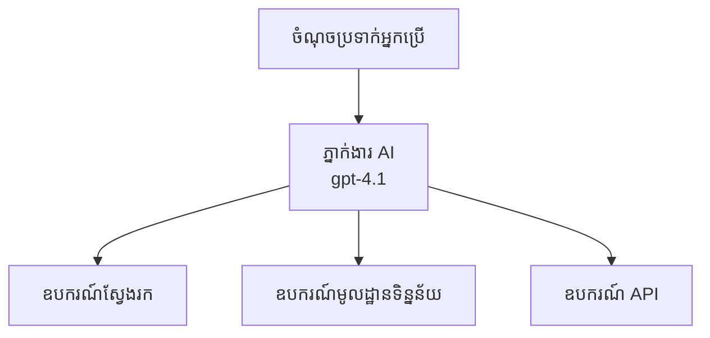
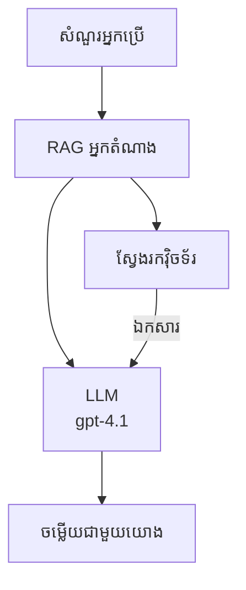
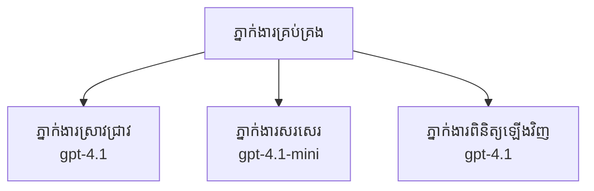

# អ្នកតំណាង AI ជាមួយ Azure Developer CLI

**ច្រកឆែកបញ្ច្រាស់៖**  
- **📚 ទំព័រដើមវគ្គសិក្សា**: [AZD សម្រាប់អ្នកថ្មី](../../README.md)  
- **📖 ជាតិទីបច្ចុប្បន្ន**: ជាតិទី 2 - ការអភិវឌ្ឍន៍ផ្អែកលើ AI ជាល​ជា​មួយ  
- **⬅️ មុន**: [ការរួមបញ្ចូល Microsoft Foundry](microsoft-foundry-integration.md)  
- **➡️ បន្ទាប់**: [ការបញ្ចេញម៉ូឌែល AI](ai-model-deployment.md)  
- **🚀 កម្រិតខ្ពស់**: [ដំណោះស្រាយអ្នកតំណាងច្រើន](../../examples/retail-scenario.md)

---

## អធិប្បាយ

អ្នកតំណាង AI ជាកម្មវិធីឯករាជ្យដែលអាចយល់ដឹងបរិដ្ឋានរបស់ខ្លួន, ធ្វើសេចក្ដីសម្រេចចិត្ត និងអនុវត្តសកម្មភាពដើម្បីសម្រេចបានគោលដៅច្បាស់លាស់មួយ។ មិនដូចជាប៉ុណ្ណោះប៉ុន្មានប៉ុន្មានម៉ាស៊ីនចន្ទីដែលឆ្លើយតបទៅនឹងសំណួរបញ្ចូល, អ្នកតំណាងអាច:

- **ប្រើឧបករណ៍** - ហៅ API, ស្វែងរកទិន្នន័យ, អនុវត្តកូដ  
- **ផែនការ និងហេតុផល** - បំបែកភារកិច្ចស្មុគស្មាញទៅជាជាន់ជាការងារ  
- **រៀនពីបរិបទ** - រក្សាសេចក្ដីចងចាំ និងបត់បែនអាកប្បកិរិយា  
- **សហការណ៍** - ធ្វើការ​ជាមួយអ្នកតំណាងផ្សេងទៀត (ប្រព័ន្ធគ្រប់គ្រងអ្នកតំណាងច្រើន)

មេរៀននេះបង្ហាញពីវិធីបញ្ចេញអ្នកតំណាង AI ទៅ Azure ដោយប្រើ Azure Developer CLI (azd)។

> **កំណត់ចំណាំផ្ទៀងផ្ទាត់ (2026-03-25):** មេរៀននេះបានពិនិត្យអោយត្រូវនឹង `azd` `1.23.12` និង `azure.ai.agents` `0.1.18-preview`។បទពិសោធន៍ `azd ai` នៅតែនេះក្រោមសម្ពាធនៃការផ្ទៀងផ្ទាត់សំណុំប្លាកពាក្យ, ដូច្នេះសូមបញ្ចាក់ជំនួយផ្នែកបន្ថែម ប្រសិនបើសញ្ញាបត្ររបស់អ្នកខុសគ្នា។

## គោលបំណងសិក្សា

ដោយបញ្ចប់មេរៀននេះ អ្នកនឹងអាច៖  
- យល់ដឹងអំពីអ្វីទៅជាអ្នកតំណាង AI និងបច្ចុប្បន្នភាពរបស់ពួកគេជាមួយម៉ាស៊ីនចន្ទី  
- បញ្ចេញបោះពុម្ពអ្នកតំណាង AI បានរួចជាស្រេចដោយប្រើ AZD  
- កំណត់តម្លៃ Foundry Agents សម្រាប់អ្នកតំណាងផ្ទាល់ខ្លួន  
- អនុវត្តលំនាំមូលដ្ឋានអ្នកតំណាង (ប្រើឧបករណ៍, RAG, ប្រព័ន្ធអ្នកតំណាងច្រើន)  
- ត្រួតពិនិត្យ និងដោះស្រាយបញ្ហាអ្នកតំណាងដែលបានបញ្ចេញ

## លទ្ធផលសិក្សា

បញ្ចប់មេរៀន អ្នកនឹងអាច៖  
- បញ្ចេញកម្មវិធីអ្នកតំណាង AI ទៅ Azure តាមបញ្ចcommand មួយ  
- កំណត់ឧបករណ៍ និងសមត្ថភាពអ្នកតំណាង  
- អនុវត្តការបង្កើតដែលភ្ជាប់ការទាញយក (RAG) ជាមួយអ្នកតំណាង  
- រៀបចំស្ថាបត្យកម្មអ្នកតំណាងច្រើនសម្រាប់ដំណើរការស្មុគស្មាញ  
- ដោះស្រាយបញ្ហាមានទូទៅក្នុងការបញ្ចេញអ្នកតំណាង

---

## 🤖 អ្វីដែលធ្វើឱ្យអ្នកតំណាងខុសពីម៉ាស៊ីនចន្ទី?

| លក្ខណៈ  | ម៉ាស៊ីនចន្ទី | អ្នកតំណាង AI |
|----------|--------------|----------------|
| **អាកប្បកិរិយា** | ឆ្លើយតបសុំ | អនុវត្តសកម្មភាពឯករាជ្យ |
| **ឧបករណ៍** | គ្មាន | អាចហៅ API, ស្វែងរក, បើកកូដ |
| **ចងចាំ** | ផ្អែកលើសម័យតែមួយ | ចងចាំរឹងមាំឆ្លងកាត់សម័យជាច្រើន |
| **ផែនការ** | ពីបទបញ្ជាតែមួយ | ហេតុផលជាច្រើនជំហាន |
| **សហការណ៍** | អង្គភាពតែមួយ | អាចដំណើរការជាមួយអ្នកតំណាងផ្សេងទៀត |

### ការប្រើប្រាស់សាមញ្ញ

- **ម៉ាស៊ីនចន្ទី** = មនុស្សជំនួយជួយឆ្លើយសំណួរនៅតុព័ត៌មាន  
- **អ្នកតំណាង AI** = ជាជំនួយការផ្ទាល់ខ្លួនដែលអាចហៅទូរស័ព្ទ, កក់ជួបជុំ, និងបញ្ចប់ភារកិច្ចសម្រាប់អ្នក

---

## 🚀 ចាប់ផ្តើមរហ័ស៖ បញ្ចេញអ្នកតំណាងដំបូងរបស់អ្នក

### ជម្រើសទី 1: គំរូ Foundry Agents (ណែនាំ)

```bash
# ចាប់ផ្តើមគំរូភ្នាក់ងារបញ្ញាសិប្បនិម្មិត
azd init --template get-started-with-ai-agents

# ដាក់ចេញទៅ Azure
azd up
```
  
**អ្វីដែលបានបញ្ចេញ៖**  
- ✅ Foundry Agents  
- ✅ ម៉ូឌែល Microsoft Foundry (gpt-4.1)  
- ✅ Azure AI Search (សម្រាប់ RAG)  
- ✅ Azure Container Apps (មុខងារផ្ទាល់វែប)  
- ✅ Application Insights (តាមដាន)

**ពេលវេលា:** ~15-20 នាទី  
**ថ្លៃដើម:** ~$100-150/ខែ (ការអភិវឌ្ឍ)

### ជម្រើសទី 2: អ្នកតំណាង OpenAI ជាមួយ Prompty

```bash
# កំណត់អាជ្ញាធរពាក់ព័ន្ធ Prompty ជាឯកសារគំរូ
azd init --template agent-openai-python-prompty

# ផ្តល់ទៅ Azure
azd up
```
  
**អ្វីដែលបានបញ្ចេញ៖**  
- ✅ Azure Functions (អនុវត្តអ្នកតំណាងដោយមិនមានម៉ាស៊ីនបម្រើ)  
- ✅ ម៉ូឌែល Microsoft Foundry  
- ✅ ឯកសារ configuration Prompty  
- ✅ ការអនុវត្តអ្នកតំណាងគំរូ

**ពេលវេលា:** ~10-15 នាទី  
**ថ្លៃដើម:** ~$50-100/ខែ (ការអភិវឌ្ឍ)

### ជម្រើសទី 3: អ្នកតំណាង RAG Chat

```bash
# ចាប់ផ្តើមទំព័រជជែក RAG
azd init --template azure-search-openai-demo

# ចាក់ចេញទៅ Azure
azd up
```
  
**អ្វីដែលបានបញ្ចេញ៖**  
- ✅ ម៉ូឌែល Microsoft Foundry  
- ✅ Azure AI Search ជាមួយទិន្នន័យគំរូ  
- ✅ បណ្តាញដំណើរការឯកសារ  
- ✅ ចំណុចផ្ទាំងជំនួបជាមួយការដកស្រង់យោង

**ពេលវេលា:** ~15-25 នាទី  
**ថ្លៃដើម:** ~$80-150/ខែ (ការអភិវឌ្ឍ)

### ជម្រើសទី 4: AZD AI Agent Init (បង្ហាញមុខបែប Manifest ឬ Template)

ប្រសិនបើអ្នកមានឯកសារ manifest អ្នកតំណាង អ្នកអាចប្រើពាក្យបញ្ជា `azd ai` ដើម្បីបង្កើតគម្រោង Foundry Agent Service តាមរយៈផ្ទាល់។ ការបង្ហាញមុខថ្មីៗក៏បានបន្ថែមសមត្ថភាពបង្កើតឧទាហរណ៍ផ្អែកលើ template ផងដែរ ដូច្នេះដំណើរការបញ្ចូលការបញ្ជារអាចខុសគ្នាបន្តិចផ្អែកលើកំណែសមាសភាគដែលបានដំឡើងរបស់អ្នក។

```bash
# តំឡើងការពង្រីកភ្នាក់ងារបញ្ញាសិប្បនិម្មิต
azd extension install azure.ai.agents

# ជម្រើស: ផ្ទៀងផ្ទាត់កំណែពិសោធន៍ដែលបានតំឡើង
azd extension show azure.ai.agents

# ចាប់ផ្តើមពីប័ណ្ណបង្ហាញភ្នាក់ងារ
azd ai agent init -m agent-manifest.yaml

# ចាត់វិភាគទៅ Azure
azd up
```
  
**ពេលណាត្រូវប្រើ `azd ai agent init` ទល់នឹង `azd init --template`:**

| វិធីសាស្រ្ត | ការប្រើប្រាស់ល្អបំផុត | របៀបប្រតិបត្តិការ |
|-------------|-----------------------|--------------------|
| `azd init --template` | ចាប់ផ្តើមពីកម្មវិធីគំរូ​មួយ​នាក់ដំណើរការ | ចម្លង repo គំរូពេញលេញដោយមានកូដ និងហិរញ្ញវត្ថុ |
| `azd ai agent init -m` | កសាងពី manifest អ្នកតំណាងផ្ទាល់ខ្លួន | បង្កើតរចនាសម្ព័ន្ធគម្រោងតាមការបញ្ជាក់របស់អ្នកតំណាង |

> **ចំណាំ៖** ប្រើ `azd init --template` នៅពេលរៀន (ជម្រើស 1-3 ខាងលើ)។ ប្រើ `azd ai agent init` នៅពេលកសាងអ្នកតំណាងផលិតកម្មជាមួយ manifest ផ្ទាល់ខ្លួន។ មើល [AZD AI CLI Commands](../chapter-08-production/production-ai-practices.md#azd-ai-cli-commands-and-extensions) សម្រាប់យោងពេញលេញ។

---

## 🏗️ លំនាំស្ថាបត្យកម្មអ្នកតំណាង

### លំនាំទី 1: អ្នកតំណាងតែម្នាក់ជាមួយឧបករណ៍

លំនាំអ្នកតំណាងសាមញ្ញបំផុត - អ្នកតំណាងម្នាក់អាចប្រើឧបករណ៍ច្រើន។


**ល្អបំផុតសម្រាប់:**  
- ប៊ូតអ្នកគាំទ្រអតិថិជន  
- ជំនួយការស្រាវជ្រាវ  
- អ្នកតំណាងវិភាគទិន្នន័យ

**AZD គំរូ:** `azure-search-openai-demo`

### លំនាំទី 2: អ្នកតំណាង RAG (ការបង្កើតបន្ថែមដោយជំនួយទាញយក)

អ្នកតំណាងមួយដែលទាញយកឯកសារពាក់ព័ន្ធមុនពេលបង្កើតចម្លើយ។


**ល្អបំផុតសម្រាប់:**  
- ហាងចំណេះដឹងសេដ្ឋកិច្ច  
- ប្រព័ន្ធសំណួរចម្លើយឯកសារ  
- ការស្វែងយល់ និងស្រាវជ្រាវផ្នែកច្បាប់

**AZD គំរូ:** `azure-search-openai-demo`

### លំនាំទី 3: ប្រព័ន្ធអ្នកតំណាងច្រើន

អ្នកតំណាងជាច្រើនមានជំនាញជាចម្បងធ្វើការជាមួយគ្នាទៅលើភារកិច្ចស្មុគស្មាញ។


**ល្អបំផុតសម្រាប់:**  
- ការបង្កើតមាតិកាស្មុគស្មាញ  
- ដំណើរការជាច្រើនជំហាន  
- ភារកិច្ចដែលត្រូវការជំនាញខុសគ្នា

**ស្វែងយល់បន្ថែមៈ** [លំនាំការសហការនៅក្នុងប្រព័ន្ធអ្នកតំណាងច្រើន](../chapter-06-pre-deployment/coordination-patterns.md)

---

## ⚙️ ការកំណត់ឧបករណ៍អ្នកតំណាង

អ្នកតំណាងក្លាយជាអ្នកមានអំណាចនៅពេលអាចប្រើឧបករណ៍បាន។ នេះជាវិធីកំណត់ឧបករណ៍ទូទៅ៖

### ការកំណត់ឧបករណ៍នៅក្នុង Foundry Agents

```python
# agent_config.py
from azure.ai.projects import AIProjectClient
from azure.ai.projects.models import FunctionTool, CodeInterpreterTool

# កំណត់ឧបករណ៍ផ្ទាល់ខ្លួន
search_tool = FunctionTool(
    name="search_knowledge_base",
    description="Search the company knowledge base for relevant documents",
    parameters={
        "type": "object",
        "properties": {
            "query": {
                "type": "string",
                "description": "The search query"
            }
        },
        "required": ["query"]
    }
)

# បង្កើតភ្នាក់ងារ​ជាមួយឧបករណ៍
agent = project_client.agents.create_agent(
    model="gpt-4.1",
    name="Support Agent",
    instructions="You are a helpful support agent. Use the search tool to find relevant information.",
    tools=[search_tool, CodeInterpreterTool()]
)
```
  
### ការកំណត់បរិដ្ឋាន

```bash
# កំណត់អថេរបរិស្ថានជាក់លាក់សម្រាប់ភ្នាក់ងារ
azd env set AZURE_OPENAI_MODEL "gpt-4.1"
azd env set AGENT_INSTRUCTIONS "You are a helpful assistant..."
azd env set ENABLE_CODE_INTERPRETER "true"
azd env set ENABLE_FILE_SEARCH "true"

# ផ្ដល់ជូនដោយមានការកំណត់រចនាសម្ព័ន្ធបានបន្ទាន់សម័យ
azd deploy
```
  
---

## 📊 ការត្រួតពិនិត្យអ្នកតំណាង

### ការរួមបញ្ចូល Application Insights

គំរូអ្នកតំណាង AZD ទាំងអស់រួមបញ្ចូល Application Insights សម្រាប់ការតាមដាន៖

```bash
# បើកផ្ទាំងតាមដាន
azd monitor --overview

# មើលកំណត់ហេតុផ្សាយបន្តផ្ទាល់
azd monitor --logs

# មើលម៉េត្រីកផ្សាយបន្តផ្ទាល់
azd monitor --live
```
  
### ម៉ែត្រសំខាន់ៗត្រូវតាមដាន

| ម៉ែត្រ | ពណ៌នា | គោលដៅ |
|--------|----------|---------|
| ពេលយឺតក្នុងការឆ្លើយតប | ពេលវេលាបង្កើតការឆ្លើយតប | < 5 វិនាទី |
| ការប្រើប្រាស់ទឹកដើម្បី | ទឹកដើម្បីក្នុងមួយសំណើ | តាមដានថ្លៃដើម |
| អត្រាជោគជ័យការហៅឧបករណ៍ | ភាគរយនៃការអនុវត្តឧបករណ៍ជោគជ័យ | > 95% |
| អត្រាជួបបញ្ហា | សំណើអ្នកតំណាងបរាជ័យ | < 1% |
| កម្រិតពេញចិត្តអ្នកប្រើ | ពិន្ទុមតិយោបល់ | > 4.0/5.0 |

### កំណត់ហេតុបុគ្គលិកសម្រាប់អ្នកតំណាង

```python
import os
from azure.monitor.opentelemetry import configure_azure_monitor
from opentelemetry import trace

# កំណត់ Azure Monitor ជាមួយ OpenTelemetry
configure_azure_monitor(
    connection_string=os.environ["APPLICATIONINSIGHTS_CONNECTION_STRING"]
)

tracer = trace.get_tracer(__name__)

def log_agent_interaction(user_query, agent_response, tools_used, latency_ms):
    with tracer.start_as_current_span("agent_interaction") as span:
        span.set_attributes({
            "user_query": user_query,
            "response_length": len(agent_response),
            "tools_used": tools_used,
            "latency_ms": latency_ms
        })
```
  
> **ចំណាំ៖** ត្រូវដំឡើងកញ្ចប់ដែលទាមទារ៖ `pip install azure-monitor-opentelemetry opentelemetry`

---

## 💰 ការពិចារណាថ្លៃដើម

### ថ្លៃដើមប្រចាំខែតាមលំនាំ

| លំនាំ | បរិដ្ឋានអភិវឌ្ឍ | ផលិតកម្ម |
|--------|------------------|-----------|
| អ្នកតំណាងតែម្នាក់ | $50-100 | $200-500 |
| អ្នកតំណាង RAG | $80-150 | $300-800 |
| អ្នកតំណាងច្រើន (2-3 នាក់) | $150-300 | $500-1,500 |
| អ្នកតំណាងច្រើនសម្រាប់សហគ្រាស | $300-500 | $1,500-5,000+ |

###ល្បិចកាត់បន្ថយថ្លៃដើម

1. **ប្រើ gpt-4.1-mini សម្រាប់ភារកិច្ចសាមញ្ញ**  
   ```bash
   azd env set AZURE_OPENAI_MODEL "gpt-4.1-mini"
   ```
  
2. **អនុវត្តបន្ទុកផ្ទុកទុកសម្រាប់សំណួរដដែល**  
   ```python
   from functools import lru_cache
   
   @lru_cache(maxsize=1000)
   def get_cached_response(query_hash):
       return agent.run(query_hash)
   ```
  
3. **កំណត់ដែនកំណត់ទឹកដើម្បីក្នុងមួយរត់**  
   ```python
   # កំណត់ max_completion_tokens ពេលបញ្ជា​ជម្រះ​អង្គប្រតិបត្តិ ប៉ុន្តែមិនមែន​ពេលបង្កើតឡើយ
   run = project_client.agents.create_run(
       thread_id=thread.id,
       agent_id=agent.id,
       max_completion_tokens=1000  # កំណត់កម្ពស់ប្រតិ្តបត្ដិការឆ្លើយតប
   )
   ```
  
4. **កំណត់ស្ទេចទៅសូន្យពេលមិនប្រើ**  
   ```bash
   # កម្មវិធីតេស្ត Container ឡើងវិញដោយស្វ័យប្រវត្តិទៅសូន្យ
   azd env set MIN_REPLICAS "0"
   ```
  
---

## 🔧 ការដោះស្រាយបញ្ហាអ្នកតំណាង

### បញ្ហាទូទៅ និងដំណោះស្រាយ

<details>  
<summary><strong>❌ អ្នកតំណាងមិនឆ្លើយតបនឹងការហៅឧបករណ៍</strong></summary>

```bash
# ពិនិត្យមើលថាឧបករណ៍បានចុះបញ្ជីត្រឹមត្រូវឬអត់
azd show

# សម្រួលការដាក់បម្លែង OpenAI
az cognitiveservices account deployment list \
  --name $AZURE_OPENAI_NAME \
  --resource-group $RG_NAME

# ពិនិត្យកំណត់ហេតុភ្នាក់ងារ
azd monitor --logs
```
  
**មូលហេតុទូទៅ៖**  
- បន្លំហត្ថលេខាឧបករណ៍  
- អនុញ្ញាតិ្តដែលត្រូវការ​ខ្វះ  
- មិនអាចចូលប្រើមុខងារ API

</details>  

<details>  
<summary><strong>❌ ពេលយឺតខ្ពស់ក្នុងការឆ្លើយតបអ្នកតំណាង</strong></summary>

```bash
# ពិនិត្យមើល Application Insights សម្រាប់ចំណុចរាំងខ្សែ
azd monitor --live

# ពិចារណា​ប្រើ​ម៉ូដែលដែល​លឿន​ជាងនេះ
azd env set AZURE_OPENAI_MODEL "gpt-4.1-mini"
azd deploy
```
  
**ល្បិចបង្កើនប្រសិទ្ធភាព៖**  
- ប្រើការបង្ហោះផ្សាយនៅពេលដំណើរការ  
- អនុវត្តបន្ទុកផ្ទុកចម្លើយ  
- កាត់បន្ថយទំហំបរិបទ

</details>  

<details>  
<summary><strong>❌ អ្នកតំណាងផ្ដល់ព័ត៌មានខុស ឬបង្កើតភាពចម្រែចម្រាស់</strong></summary>

```python
# ស្វែងយល់ជាមួយការបញ្ចូលប្រព័ន្ធល្អប្រសើរជាងមុន
instructions = """
You are a helpful assistant. IMPORTANT:
- Only answer based on provided context
- If you don't know, say "I don't know"
- Always cite your sources
- Never make up information
"""

# បន្ថែមការទាញយកសម្រាប់ការតាំងដី
agent = project_client.agents.create_agent(
    model="gpt-4.1",
    instructions=instructions,
    tools=[FileSearchTool()]  # ដាក់ឆ្លើយតបនៅក្នុងឯកសារ
)
```
  
</details>  

<details>  
<summary><strong>❌ កំហុសលើសកំណត់ token</strong></summary>

```python
# អនុវត្តការគ្រប់គ្រងបង្អួចបរិបទ
def truncate_context(messages, max_tokens=8000, model="gpt-4.1"):
    """Keep only recent messages within token limit."""
    import tiktoken
    encoding = tiktoken.encoding_for_model(model)
    total_tokens = 0
    truncated = []
    
    for msg in reversed(messages):
        msg_tokens = len(encoding.encode(msg.content))
        if total_tokens + msg_tokens > max_tokens:
            break
        truncated.insert(0, msg)
        total_tokens += msg_tokens
    
    return truncated
```
  
</details>  

---

## 🎓 សកម្មភាពហ្វាស់

### អនុវត្តលេខ 1៖ បញ្ចេញអ្នកតំណាងមូលដ្ឋាន (20 នាទី)

**គោលបំណង៖** បញ្ចេញអ្នកតំណាង AI ដំបូងរបស់អ្នកដោយប្រើ AZD

```bash
# ជំហានទី ១៖ ចាប់ផ្ដើមពិន្ទុគំរូ
azd init --template get-started-with-ai-agents

# ជំហានទី ២៖ ឆែកចូលទៅកាន់ Azure
azd auth login
# ប្រសិនបើអ្នកធ្វើការទៅលើអ្នកជួលផ្សេងទៀត បន្ថែម --tenant-id <tenant-id>

# ជំហានទី ៣៖ ផ្ញើការតំឡើង
azd up

# ជំហានទី ៤៖ សាកល្បងភ្នាក់ងារ
# ទិន្នផលដែលរំពឹងទុកបន្ទាប់ពីការផ្សាយ៖
#   ការផ្សាយបានបញ្ចប់!
#   ចំណុចផ្ដល់សេវា: https://<app-name>.<region>.azurecontainerapps.io
# បើក URL ដែលបង្ហាញនៅក្នុងទិន្នផល ហើយសាកសួរពីសំណួរមួយ

# ជំហានទី ៥៖ មើលការត្រួតពិនិត្យ
azd monitor --overview

# ជំហានទី ៦៖ សម្អាត
azd down --force --purge
```
  
**លក្ខខណ្ឌជោគជ័យ៖**  
- [ ] អ្នកតំណាងឆ្លើយសំណួរ  
- [ ] អាចចូលទៅកាន់ផ្ទាំងត្រួតពិនិត្យតាម `azd monitor`  
- [ ] ធនធានត្រូវបានសម្អាតដោយជោគជ័យ

### អនុវត្តលេខ 2៖ បន្ថែមឧបករណ៍ផ្ទាល់ខ្លួន (30 នាទី)

**គោលបំណង៖** ពង្រីកអ្នកតំណាងជាមួយឧបករណ៍ផ្ទាល់ខ្លួន

1. បញ្ចេញគំរូអ្នកតំណាង៖  
   ```bash
   azd init --template get-started-with-ai-agents
   azd up
   ```
  
2. បង្កើតមុខងារឧបករណ៍ថ្មីនៅក្នុងកូដអ្នកតំណាងរបស់អ្នក៖  
   ```python
   def get_weather(location: str) -> str:
       """Get current weather for a location."""
       # ហៅ API ទៅសេវាកម្មអាកាសធាតុ
       return f"Weather in {location}: Sunny, 72°F"
   ```
  
3. ចុះបញ្ជីឧបករណ៍ជាមួយអ្នកតំណាង៖  
   ```python
   from azure.ai.projects.models import FunctionTool

   weather_tool = FunctionTool(
       name="get_weather",
       description="Get current weather for a location",
       parameters={
           "type": "object",
           "properties": {
               "location": {"type": "string", "description": "City name"}
           },
           "required": ["location"]
       }
   )

   agent = project_client.agents.create_agent(
       model="gpt-4.1",
       name="Weather Agent",
       tools=[weather_tool]
   )
   ```
  
4. បញ្ចេញឡើងវិញ និងសាកល្បង៖  
   ```bash
   azd deploy
   # សួរ៖ "អាកាសធាតុ​នៅ Seattle ជា​យ៉ាងដូចម្តេច?"
   # រំពឹងថា៖ បុគ្គលិកហៅ get_weather("Seattle") ហើយត្រឡប់ព័ត៌មាន​អាកាស​ធាតុ​មកវិញ
   ```
  
**លក្ខខណ្ឌជោគជ័យ៖**  
- [ ] អ្នកតំណាងស្គាល់សំណួរដែលអាចចែករំលែកព័ត៍មានអាកាសធាតុ  
- [ ] ឧបករណ៍ត្រូវបានហៅត្រឹមត្រូវ  
- [ ] ការឆ្លើយតបមានព័ត៌មានអាកាសធាតុ

### អនុវត្តលេខ 3៖ សាងសង់អ្នកតំណាង RAG (45 នាទី)

**គោលបំណង៖** បង្កើតអ្នកតំណាងឆ្លើយសំណួរពីឯកសាររបស់អ្នក

```bash
# ជំហានទី 1: បញ្ចូនគំរូ RAG
azd init --template azure-search-openai-demo
azd up

# ជំហានទី 2: ផ្ទុកឡើងឯកសាររបស់អ្នក
# ដាក់ឯកសារ PDF/TXT ក្នុងកអាត់ data/ បន្ទាប់មកបួសរត់:
python scripts/prepdocs.py

# ជំហានទី 3: សាកល្បងជាមួយសំណួរពាក់ព័ន្ធជាមួយដែន
# បើក URL កម្មវិធីវែបពីលទ្ធផល azd up
# សួរសំណួរអំពីឯកសារចុះបញ្ជីរបស់អ្នក
# ឆ្លើយតបគួរតែរួមមានចំណាំយោងដូចជា [doc.pdf]
```
  
**លក្ខខណ្ឌជោគជ័យ៖**  
- [ ] អ្នកតំណាងឆ្លើយពីឯកសារដែលបានផ្ទុកឡើង  
- [ ] ការឆ្លើយតបរួមមានការដកស្រង់យោង  
- [ ] មិនមានការចម្លែកភាពលើសពីការសម្គាល់សំណួរផ្សេងទៀត

---

## 📚 ជំហ៊ានបន្ទាប់

ឥឡូវនេះដែលអ្នកយល់ពីអ្នកតំណាង AI, ស្វែងយល់ពីប្រធានបទកម្រិតខ្ពស់ទាំងនេះ៖

| ប្រធានបទ | ការពិពណ៌នា | តំណភ្ជាប់ |
|------------|--------------|---------|
| **ប្រព័ន្ធអ្នកតំណាងច្រើន** | សាងសង់ប្រព័ន្ធជាមួយអ្នកតំណាងច្រើនសហការណ៍ | [ឧទាហរណ៍អ្នកតំណាងលក់រាយច្រើន](../../examples/retail-scenario.md) |
| **លំនាំសហការណ៍** | ស្វែងយល់លំនាំកសាងនិងការទំនាក់ទំនង | [លំនាំសហការណ៍](../chapter-06-pre-deployment/coordination-patterns.md) |
| **ការបញ្ចេញផលិតកម្ម** | បញ្ចេញអ្នកតំណាងសម្រាប់សហគ្រាស | [អនុវត្ត AI ផលិតកម្ម](../chapter-08-production/production-ai-practices.md) |
| **ការវាយតម្លៃអ្នកតំណាង** | សាកល្បង និងវាយតម្លៃលទ្ធផលអ្នកតំណាង | [ដោះស្រាយបញ្ហា AI](../chapter-07-troubleshooting/ai-troubleshooting.md) |
| **សិក្ខាសាលា AI** | អនុវត្តកម្ម ដើម្បីធ្វើឲ្យដំណោះស្រាយ AI របស់អ្នករួចរាល់សម្រាប់ AZD | [សិក្ខាសាលា AI](ai-workshop-lab.md) |

---

## 📖 ជំនួយបន្ថែម

### សៀវភៅណែនាំផ្លូវការជាភាសាអង់គ្លេស  
- [Azure AI Agent Service](https://learn.microsoft.com/azure/ai-services/agents/)  
- [Azure AI Foundry Agent Service Quickstart](https://learn.microsoft.com/azure/ai-services/agents/quickstart)  
- [Semantic Kernel Agent Framework](https://learn.microsoft.com/semantic-kernel/)

### គំរូ AZD សម្រាប់អ្នកតំណាង  
- [ចាប់ផ្តើមជាមួយអ្នកតំណាង AI](https://github.com/Azure-Samples/get-started-with-ai-agents)  
- [Agent OpenAI Python Prompty](https://github.com/Azure-Samples/agent-openai-python-prompty)  
- [Azure Search OpenAI Demo](https://github.com/Azure-Samples/azure-search-openai-demo)

### ប្រភពសហគមន៍  
- [Awesome AZD - គំរូអ្នកតំណាង](https://azure.github.io/awesome-azd/?tags=ai-agents)  
- [Azure AI Discord](https://discord.gg/microsoft-azure)  
- [Microsoft Foundry Discord](https://discord.gg/nTYy5BXMWG)

### ជំនាញអ្នកតំណាងសម្រាប់កម្មវិធីកែសម្រួលរបស់អ្នក  
- [**ជំនាញ Microsoft Azure Agent**](https://skills.sh/microsoft/github-copilot-for-azure) - ដំឡើងជំនាញអ្នកតំណាង AI អាចប្រើឡើងវិញសម្រាប់អភិវឌ្ឍ Azure នៅក្នុង GitHub Copilot, Cursor ឬអ្នកតំណាងដែលគាំទ្រ។ រួមបញ្ចូលជំនាញសម្រាប់ [Azure AI](https://skills.sh/microsoft/github-copilot-for-azure/azure-ai), [Microsoft Foundry](https://skills.sh/microsoft/github-copilot-for-azure/microsoft-foundry), [deployment](https://skills.sh/microsoft/github-copilot-for-azure/azure-deploy), និង [diagnostics](https://skills.sh/microsoft/github-copilot-for-azure/azure-diagnostics):  
  ```bash
  npx skills add microsoft/github-copilot-for-azure
  ```
  
---

**ច្រកចេញ**  
- **មេរៀនមុន**: [ការរួមបញ្ចូល Microsoft Foundry](microsoft-foundry-integration.md)  
- **មេរៀនបន្ទាប់**: [ការបញ្ចេញម៉ូឌែល AI](ai-model-deployment.md)

---

<!-- CO-OP TRANSLATOR DISCLAIMER START -->
**ការ​បដិសេធ**៖  
ឯកសារនេះត្រូវបានបកប្រែដោយប្រើសេវាកម្មបកប្រែ AI [Co-op Translator](https://github.com/Azure/co-op-translator)។ ខណៈពេលដែលយើងខិតខំសម្រាប់ភាពត្រឹមត្រូវ សូមចំណាំថាការបកប្រែដោយស្វ័យប្រវត្តិនេះអាចមានកំហុស ឬ ភាពមិនត្រឹមត្រូវ។ ឯកសារដើមជាភាសាដើមគួរត្រូវបានរក្សាថាជាដើមទទួលខុសត្រូវមួយច្បាស់លាស់។ សម្រាប់ព័ត៌មានសំខាន់ៗ ការបកប្រែដោយមនុស្សជំនាញត្រូវបានណែនាំ។ យើងមិនទទួលខុសត្រូវចំពោះការយល់ច្រឡំ ឬការបកប្រែខុសចេញពីការប្រើប្រាសែវានេះទេ។
<!-- CO-OP TRANSLATOR DISCLAIMER END -->