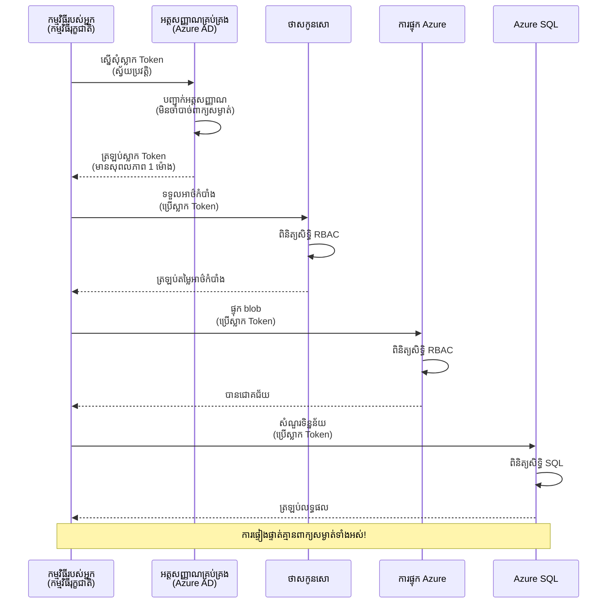
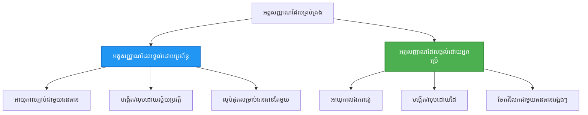

# រចនាប័ទ្មសម្រេចអត្តសញ្ញាណ និង Managed Identity

⏱️ **ពេលវេលាធ្វើបានប្រហាក់ប្រហែល**: ៤៥-៦០ នាទី | 💰 **ផលប៉ះពាល់ដល់ថ្លៃឈ្នួល**: ឥតគិតថ្លៃ (គ្មានចំណាយបន្ថែម) | ⭐ **កម្រិតភាពស្មុគស្មាញ**: មធ្យម

**📚 ផ្លូវការសិក្សា:**
- ← មុនៈ [ការគ្រប់គ្រងការកំណត់រចនា](configuration.md) - គ្រប់គ្រងអថេរបរិស្ថាន និងអង្គរក្សសម្ងាត់
- 🎯 **អ្នកស្ថិតនៅទីនេះ**: ការសម្រេចអត្តសញ្ញាណ និងសុវត្ថិភាព (Managed Identity, Key Vault, រចនាប័ទ្មសុវត្ថិភាព)
- → បន្ទាប់ៈ [គម្រោងដំបូង](first-project.md) - សាងសង់កម្មវិធី AZD ដំបូងរបស់អ្នក
- 🏠 [ទំព័រដើមមេរៀន](../../README.md)

---

## អ្វីដែលអ្នកនឹងសិក្សា

ដោយបញ្ចប់មេរៀននេះ អ្នកនឹងអាច៖
- យល់ដឹងពីរចនាប័ទ្មសម្រេចអត្តសញ្ញាណ Azure (key, connection string, managed identity)
- អនុវត្ត **Managed Identity** សម្រាប់ការសម្រេចអត្តសញ្ញាណគ្មានពាក្យសម្ងាត់
- រក្សាសម្ងាត់ដោយបានរួមបញ្ចូល **Azure Key Vault**
- កំណត់ **ការត្រួតពិនិត្យការចូលដោយផ្អែកលើតួនាទី (RBAC)** សម្រាប់ AZD deployments
- អនុវត្តអនុគ្រឹះសុវត្ថិភាពល្អបំផុតនៅក្នុង Container Apps និងសេវាកម្ម Azure
- ផ្លាស់ប្តូរពីការសម្រេចអត្តសញ្ញាណដោយផ្អែកលើ key ទៅ identity

## ហេតុអ្វីបានជា Managed Identity មានសារៈសំខាន់

### បញ្ហា៖ ការសម្រេចអត្តសញ្ញាណបុរាណ

**មុន Managed Identity:**
```javascript
// ❌ ភាពហានិភ័យសុវត្ថិភាពៈ គោលការណ៍សំងាត់កូដដែលដាក់រួចហើយនៅក្នុងកូដ
const connectionString = "Server=mydb.database.windows.net;User=admin;Password=P@ssw0rd123";
const storageKey = "xK7mN9pQ2wR5tY8uI0oP3aS6dF1gH4jK...";
const cosmosKey = "C2x7B9n4M1p8Q5w3E6r0T2y5U8i1O4p7...";
```

**បញ្ហា:**
- 🔴 **សម្ងាត់បង្ហាញ** នៅក្នុងកូដ, ឯកសារកំណត់រចនា, អថេរបរិស្ថាន
- 🔴 **ការប្ដូរបញ្ញាណបញ្ជាក់** ត្រូវការ កែប្រែកូដ និងចាប់ផ្តើមឡើងវិញ
- 🔴 **ការត្រួតពិនិត្យមិនល្អ** - អ្នកណាប្រើប្រាស់អ្វី, ពេលណា?
- 🔴 **ដំណាក់យាយ** - សម្ងាត់ចែកចាយលាយលំឡំក្នុងប្រព័ន្ធជាច្រើន
- 🔴 **ហានិភ័យអនុលោម** - បរាជ័យក្នុងការត្រួតពិនិត្យសុវត្ថិភាព

### ដំណោះស្រាយ៖ Managed Identity

**បន្ទាប់ Managed Identity:**
```javascript
// ✅ សុវត្ថិភាព: គ្មានការសម្ងាត់នៅក្នុងកូដ
const credential = new DefaultAzureCredential();
const client = new BlobServiceClient(
  "https://mystorageaccount.blob.core.windows.net",
  credential  // Azure គ្រប់គ្រងការផ្ទៀងផ្ទាត់អត្តសញ្ញាណដោយស្វ័យប្រវត្តិ
);
```

**អត្ថប្រយោជន៍:**
- ✅ **គ្មានសម្ងាត់** នៅក្នុងកូដឬការកំណត់រចនា
- ✅ **ការប្ដូរជាបុគ្គលដោយស្វ័យប្រវត្តិ** - Azure គ្រប់គ្រង
- ✅ **តាមដានរាល់សកម្មភាព** នៅក្នុងកំណត់ហេតុ Azure AD
- ✅ **សុវត្ថិភាពកណ្តាល** - គ្រប់គ្រងនៅ Azure Portal
- ✅ **អនុលោមគ្រប់គ្រាន់** - សម្របសម្រួលតាមស្តង់ដារ

**ធាតុប្រៀបធៀប**៖ ការសម្រេចអត្តសញ្ញាណបុរាណគឺដូចជាការលើកកូនសោភ្លៅជាច្រើនសម្រាប់ទ្វារផ្សេងៗ។ Managed Identity គឺដូចបាំងសុវត្ថិភាពជាភីបដែលអនុញ្ញាតឲ្យចូលដោយស្វ័យប្រវត្តិដោយផ្អែកលើអ្នកជាម្ចាស់—គ្មានសោដែលត្រូវបាត់បង់ ឬចម្លង ឬប្ដូរ។

---

## ទិដ្ឋភាពទូទៅរចនាសម្ព័ន្ធ

### ស្ថានភាពសម្រេចអត្តសញ្ញាណជាមួយ Managed Identity


### ប្រភេទនៃ Managed Identity


| លក្ខណៈ | System-Assigned | User-Assigned |
|---------|----------------|---------------|
| **រយៈពេលមានជីវិត** | ភ្ជាប់ជាមួយធនធាន | មានឯករាជ្យ |
| **ការបង្កើត** | ស្វ័យប្រវត្តជាមួយធនធាន | បង្កើតដោយដៃគូ |
| **ការលុបចោល** | លុបជាមួយធនធាន | នៅសល់បន្ទាប់ពីលុបធនធាន |
| **ការចែករំលែក** | ប្រើដោយធនធានតែមួយ | ប្រើបានច្រើនធនធាន |
| **ករណីប្រើប្រាស់** | បណ្តាញសាមញ្ញ | បណ្តាញស្មុគស្មាញច្រើនធនធាន |
| **ប្រភេទ AZD គោលបំណង** | ✅ ផ្ដល់អនុសាសន៍ | ចំណង់ចំណូលចិត្ត |

---

## ទាមទារ

### ឧបករណ៍ដែលត្រូវការជាមុន

អ្នកគួរតែមានរួចហើយពីមេរៀនមុនៗ៖

```bash
# បញ្ជាក់ Azure Developer CLI
azd version
# ✅ មាន់រំពឹង: azd ស្កុន 1.0.0 ឬកាន់តែខ្ពស់

# បញ្ជាក់ Azure CLI
az --version
# ✅ មាន់រំពឹង: azure-cli 2.50.0 ឬកាន់តែខ្ពស់
```

### តម្រូវការ Azure

- ចុះឈ្មោះ Azure មានសកម្មភាព
- សិទ្ធិដើម្បី:
  - បង្កើត managed identities
  - ផ្ដល់តួនាទី RBAC
  - បង្កើតធនធាន Key Vault
  - ចាក់ផ្លែង Container Apps

### ចំណេះដឹងមុន

អ្នកគួរតែបានបញ្ចប់៖
- [មេរៀនតម្លើង](installation.md) - ការតម្លើង AZD
- [មូលដ្ឋាន AZD](azd-basics.md) - គំនិតមូលដ្ឋាន
- [ការគ្រប់គ្រងការកំណត់រចនា](configuration.md) - អថេរបរិស្ថាន

---

## មេរៀន 1៖ ការយល់ដឹងរចនាប័ទ្មសម្រេចអត្តសញ្ញាណ

### រចនាប័ទ្ម 1៖ Connection Strings (បុរាណ - គួរត្រូវជៀសវាង)

**របៀបធ្វើការ៖**
```bash
# ខ្សែបណ្តាញភ្ជាប់មានពាក្យសម្គាល់
STORAGE_CONNECTION_STRING="DefaultEndpointsProtocol=https;AccountName=myaccount;AccountKey=xK7mN9pQ2wR5..."
COSMOS_CONNECTION_STRING="AccountEndpoint=https://myaccount.documents.azure.com:443/;AccountKey=C2x7..."
SQL_CONNECTION_STRING="Server=myserver.database.windows.net;User=admin;Password=P@ssw0rd..."
```

**បញ្ហា:**
- ❌ សម្ងាត់បង្ហាញក្នុងអថេរបរិស្ថាន
- ❌ កត់ត្រានៅក្នុងប្រព័ន្ធចាក់ចេញ
- ❌ ដូចជាប្រែប្រាស់លំបាក
- ❌ គ្មានបទបញ្ជាត្រួតពិនិត្យចូល

**ពេលណាដែលគួរប្រើ៖** គ្រាន់តែសម្រាប់ការអភិវឌ្ឍន៍ក្នុងផ្ទះ មិនប្រើប្រាស់នៅផលិតកម្មឡើយ។

---

### រចនាប័ទ្ម 2៖ ការបញ្ជាក់ Key Vault (ល្អប្រសើរជាងមុន)

**របៀបធ្វើការ៖**
```bicep
// Store secret in Key Vault
resource keyVault 'Microsoft.KeyVault/vaults@2023-02-01' = {
  name: 'mykv'
  properties: {
    enableRbacAuthorization: true
  }
}

// Reference in Container App
env: [
  {
    name: 'STORAGE_KEY'
    secretRef: 'storage-key'  // References Key Vault
  }
]
```

**អត្ថប្រយោជន៍:**
- ✅ សម្ងាត់រក្សាទុកយ៉ាងសុវត្ថិភាពនៅក្នុង Key Vault
- ✅ ការគ្រប់គ្រងសម្ងាត់កណ្តាល
- ✅ មិនចាំបាច់ផ្លាស់ប្ដូរកូដ

**ការរឹតត្បិត:**
- ⚠️ យ៉ាងដែលក៏នៅប្រើ key/ពាក្យសម្ងាត់
- ⚠️ ត្រូវគ្រប់គ្រងការចូល Key Vault

**ពេលណាដែលគួរប្រើ៖** ជាគន្លងផ្លាស់ប្ដូរពី connection string ទៅ managed identity។

---

### រចនាប័ទ្ម 3៖ Managed Identity (អនុគ្រឹះល្អបំផុត)

**របៀបធ្វើការ៖**
```bicep
// Enable managed identity
resource containerApp 'Microsoft.App/containerApps@2023-05-01' = {
  name: 'myapp'
  identity: {
    type: 'SystemAssigned'  // Automatically creates identity
  }
}

// Grant permissions
resource roleAssignment 'Microsoft.Authorization/roleAssignments@2022-04-01' = {
  scope: storageAccount
  properties: {
    roleDefinitionId: storageBlobDataContributorRole
    principalId: containerApp.identity.principalId
  }
}
```

**កូដកម្មវិធី ៖**
```javascript
// មិនត្រូវការព៌ណ៍សម្ងាត់ទេ!
const { DefaultAzureCredential } = require('@azure/identity');
const { BlobServiceClient } = require('@azure/storage-blob');

const credential = new DefaultAzureCredential();
const blobServiceClient = new BlobServiceClient(
  'https://mystorageaccount.blob.core.windows.net',
  credential
);
```

**អត្ថប្រយោជន៍:**
- ✅ គ្មានសម្ងាត់នៅក្នុងកូដ/ការកំណត់រចនា
- ✅ ប្ដូរបញ្ញាណបញ្ជាក់ដោយស្វ័យប្រវត្តិ
- ✅ តាមដានរាល់សកម្មភាពពេញលេញ
- ✅ អនុញ្ញាត RBAC
- ✅ អនុលោមគ្រប់គ្រាន់

**ពេលណាដែលគួរប្រើ៖** ជានិច្ចសម្រាប់កម្មវិធីផលិតកម្ម។

---

## មេរៀន 2៖ អនុវត្ត Managed Identity ជាមួយ AZD

### ជំហានប៊ិចប៊ិច

ចាប់ផ្តើមបង្កើត Container App សុវត្ថិភាពដែលប្រើ managed identity ដើម្បីចូលដំណើរការ Azure Storage និង Key Vault។

### រចនាសម្ព័ន្ធគម្រោង

```
secure-app/
├── azure.yaml                 # AZD configuration
├── infra/
│   ├── main.bicep            # Main infrastructure
│   ├── core/
│   │   ├── identity.bicep    # Managed identity setup
│   │   ├── keyvault.bicep    # Key Vault configuration
│   │   └── storage.bicep     # Storage with RBAC
│   └── app/
│       └── container-app.bicep
└── src/
    ├── app.js                # Application code
    ├── package.json
    └── Dockerfile
```

### 1. កំណត់ AZD (azure.yaml)

```yaml
name: secure-app
metadata:
  template: secure-app@1.0.0

services:
  api:
    project: ./src
    language: js
    host: containerapp

# Enable managed identity (AZD handles this automatically)
```

### 2. រចនាសម្ព័ន្ធ៖ បើកប្រើ Managed Identity

**ឯកសារ៖ `infra/main.bicep`**

```bicep
targetScope = 'subscription'

param environmentName string
param location string = 'eastus'

var tags = { 'azd-env-name': environmentName }

// Resource group
resource rg 'Microsoft.Resources/resourceGroups@2021-04-01' = {
  name: 'rg-${environmentName}'
  location: location
  tags: tags
}

// Storage Account
module storage './core/storage.bicep' = {
  name: 'storage'
  scope: rg
  params: {
    name: 'st${uniqueString(rg.id)}'
    location: location
    tags: tags
  }
}

// Key Vault
module keyVault './core/keyvault.bicep' = {
  name: 'keyvault'
  scope: rg
  params: {
    name: 'kv-${uniqueString(rg.id)}'
    location: location
    tags: tags
  }
}

// Container App with Managed Identity
module containerApp './app/container-app.bicep' = {
  name: 'container-app'
  scope: rg
  params: {
    name: 'ca-${environmentName}'
    location: location
    tags: tags
    storageAccountName: storage.outputs.name
    keyVaultName: keyVault.outputs.name
  }
}

// Grant Container App access to Storage
module storageRoleAssignment './core/role-assignment.bicep' = {
  name: 'storage-role'
  scope: rg
  params: {
    principalId: containerApp.outputs.identityPrincipalId
    roleDefinitionId: 'ba92f5b4-2d11-453d-a403-e96b0029c9fe'  // Storage Blob Data Contributor
    targetResourceId: storage.outputs.id
  }
}

// Grant Container App access to Key Vault
module kvRoleAssignment './core/role-assignment.bicep' = {
  name: 'kv-role'
  scope: rg
  params: {
    principalId: containerApp.outputs.identityPrincipalId
    roleDefinitionId: '4633458b-17de-408a-b874-0445c86b69e6'  // Key Vault Secrets User
    targetResourceId: keyVault.outputs.id
  }
}

// Outputs
output AZURE_STORAGE_ACCOUNT_NAME string = storage.outputs.name
output AZURE_KEY_VAULT_NAME string = keyVault.outputs.name
output APP_URL string = containerApp.outputs.url
```

### 3. Container App ជាមួយ identity ប្រព័ន្ធកំណត់

**ឯកសារ៖ `infra/app/container-app.bicep`**

```bicep
param name string
param location string
param tags object = {}
param storageAccountName string
param keyVaultName string

resource containerApp 'Microsoft.App/containerApps@2023-05-01' = {
  name: name
  location: location
  tags: tags
  identity: {
    type: 'SystemAssigned'  // 🔑 Enable managed identity
  }
  properties: {
    configuration: {
      ingress: {
        external: true
        targetPort: 3000
      }
    }
    template: {
      containers: [
        {
          name: 'api'
          image: 'myregistry.azurecr.io/api:latest'
          resources: {
            cpu: json('0.5')
            memory: '1Gi'
          }
          env: [
            {
              name: 'AZURE_STORAGE_ACCOUNT_NAME'
              value: storageAccountName
            }
            {
              name: 'AZURE_KEY_VAULT_NAME'
              value: keyVaultName
            }
            // 🔑 No secrets - managed identity handles authentication!
          ]
        }
      ]
    }
  }
}

// Output the identity for RBAC assignments
output identityPrincipalId string = containerApp.identity.principalId
output id string = containerApp.id
output url string = 'https://${containerApp.properties.configuration.ingress.fqdn}'
```

### 4. ម៉ូឌុលផ្ដល់តួនាទី RBAC

**ឯកសារ៖ `infra/core/role-assignment.bicep`**

```bicep
param principalId string
param roleDefinitionId string  // Azure built-in role ID
param targetResourceId string

resource roleAssignment 'Microsoft.Authorization/roleAssignments@2022-04-01' = {
  name: guid(principalId, roleDefinitionId, targetResourceId)
  scope: resourceId('Microsoft.Resources/resourceGroups', resourceGroup().name)
  properties: {
    roleDefinitionId: subscriptionResourceId('Microsoft.Authorization/roleDefinitions', roleDefinitionId)
    principalId: principalId
    principalType: 'ServicePrincipal'
  }
}

output id string = roleAssignment.id
```

### 5. កូដកម្មវិធី ជាមួយ Managed Identity

**ឯកសារ៖ `src/app.js`**

```javascript
const express = require('express');
const { DefaultAzureCredential } = require('@azure/identity');
const { BlobServiceClient } = require('@azure/storage-blob');
const { SecretClient } = require('@azure/keyvault-secrets');

const app = express();
const PORT = process.env.PORT || 3000;

// 🔑 ចាប់ផ្តើមសមត្ថភាព (ដំណើរការដោយស្វ័យប្រវត្តិក្នុងការគ្រប់គ្រងអត្តសញ្ញាណ)
const credential = new DefaultAzureCredential();

// ការតំឡើង Azure Storage
const storageAccountName = process.env.AZURE_STORAGE_ACCOUNT_NAME;
const blobServiceClient = new BlobServiceClient(
  `https://${storageAccountName}.blob.core.windows.net`,
  credential  // មិនចាំបាច់មានក្តារទេ!
);

// ការតំឡើង Key Vault
const keyVaultName = process.env.AZURE_KEY_VAULT_NAME;
const secretClient = new SecretClient(
  `https://${keyVaultName}.vault.azure.net`,
  credential  // មិនចាំបាច់មានក្តារទេ!
);

// ការត្រួតពិនិត្យសុខភាព
app.get('/health', (req, res) => {
  res.json({ status: 'healthy', authentication: 'managed-identity' });
});

// ផ្ទុកឯកសារឡើងទៅ blob storage
app.post('/upload', async (req, res) => {
  try {
    const containerClient = blobServiceClient.getContainerClient('uploads');
    await containerClient.createIfNotExists();
    
    const blobName = `file-${Date.now()}.txt`;
    const blockBlobClient = containerClient.getBlockBlobClient(blobName);
    
    await blockBlobClient.upload('Hello from managed identity!', 30);
    
    res.json({
      success: true,
      blobName: blobName,
      message: 'File uploaded using managed identity!'
    });
  } catch (error) {
    console.error('Upload error:', error);
    res.status(500).json({ error: error.message });
  }
});

// ទទួលបានសម្ងាត់ពី Key Vault
app.get('/secret/:name', async (req, res) => {
  try {
    const secretName = req.params.name;
    const secret = await secretClient.getSecret(secretName);
    
    res.json({
      name: secretName,
      value: secret.value,
      message: 'Secret retrieved using managed identity!'
    });
  } catch (error) {
    console.error('Secret error:', error);
    res.status(500).json({ error: error.message });
  }
});

// បញ្ជីរាយនាមតំបន់ទុក blob (បង្ហាញការចូលអាន)
app.get('/containers', async (req, res) => {
  try {
    const containers = [];
    for await (const container of blobServiceClient.listContainers()) {
      containers.push(container.name);
    }
    
    res.json({
      containers: containers,
      count: containers.length,
      message: 'Containers listed using managed identity!'
    });
  } catch (error) {
    console.error('List error:', error);
    res.status(500).json({ error: error.message });
  }
});

app.listen(PORT, () => {
  console.log(`Secure API listening on port ${PORT}`);
  console.log('Authentication: Managed Identity (passwordless)');
});
```

**ឯកសារ៖ `src/package.json`**

```json
{
  "name": "secure-app",
  "version": "1.0.0",
  "dependencies": {
    "express": "^4.18.2",
    "@azure/identity": "^4.0.0",
    "@azure/storage-blob": "^12.17.0",
    "@azure/keyvault-secrets": "^4.7.0"
  },
  "scripts": {
    "start": "node app.js"
  }
}
```

### 6. ចាក់ផ្លែង និងសាកល្បង

```bash
# ចាប់ផ្តើមបរិក្ខារបរិបទ AZD
azd init

# ផ្ទុកដំណើរការគ្រឿងសម្ព័ន្ធ និងកម្មវិធី
azd up

# ទទួល URL កម្មវិធី
APP_URL=$(azd env get-values | grep APP_URL | cut -d '=' -f2 | tr -d '"')

# សាកល្បងការត្រួតពិនិត្យសុខភាព
curl $APP_URL/health
```

**✅ លទ្ធផលដែលរំពឹងទុក:**
```json
{
  "status": "healthy",
  "authentication": "managed-identity"
}
```

**សាកល្បងការផ្ទុក blob:**
```bash
curl -X POST $APP_URL/upload
```

**✅ លទ្ធផលដែលរំពឹងទុក:**
```json
{
  "success": true,
  "blobName": "file-1700404800000.txt",
  "message": "File uploaded using managed identity!"
}
```

**សាកល្បងបញ្ចី container:**
```bash
curl $APP_URL/containers
```

**✅ លទ្ធផលដែលរំពឹងទុក:**
```json
{
  "containers": ["uploads"],
  "count": 1,
  "message": "Containers listed using managed identity!"
}
```

---

## តួនាទី RBAC ទូទៅរបស់ Azure

### តួនាទីស្រេចសម្រាប់ Managed Identity

| សេវាកម្ម | ឈ្មោះតួនាទី | ID តួនាទី | សិទ្ធិ |
|---------|-----------|---------|-------------|
| **Storage** | Storage Blob Data Reader | `2a2b9908-6b94-4a3d-8e5a-a7d8f8cc8a12` | អាន blob និង container |
| **Storage** | Storage Blob Data Contributor | `ba92f5b4-2d11-453d-a403-e96b0029c9fe` | អាន, សរសេរ, លុប blob |
| **Storage** | Storage Queue Data Contributor | `974c5e8b-45b9-4653-ba55-5f855dd0fb88` | អាន, សរសេរ, លុបសារ queue |
| **Key Vault** | Key Vault Secrets User | `4633458b-17de-408a-b874-0445c86b69e6` | អានសម្ងាត់ |
| **Key Vault** | Key Vault Secrets Officer | `b86a8fe4-44ce-4948-aee5-eccb2c155cd7` | អាន, សរសេរ, លុបសម្ងាត់ |
| **Cosmos DB** | Cosmos DB Built-in Data Reader | `00000000-0000-0000-0000-000000000001` | អានទិន្នន័យ Cosmos DB |
| **Cosmos DB** | Cosmos DB Built-in Data Contributor | `00000000-0000-0000-0000-000000000002` | អាន, សរសេរ ទិន្នន័យ Cosmos DB |
| **SQL Database** | SQL DB Contributor | `9b7fa17d-e63e-47b0-bb0a-15c516ac86ec` | រដ្ឋបាលមូលដ្ឋានទិន្នន័យ SQL |
| **Service Bus** | Azure Service Bus Data Owner | `090c5cfd-751d-490a-894a-3ce6f1109419` | ផ្ញើ, ទទួល, គ្រប់គ្រងសារ |

### របៀបស្វែងរក ID តួនាទី

```bash
# បញ្ជីតួនាទីបង្កើតជាមូលដ្ឋានទាំងអស់
az role definition list --query "[].{Name:roleName, ID:name}" --output table

# ស្វែងរកតួនាទីជាក់លាក់
az role definition list --query "[?contains(roleName, 'Storage Blob')].{Name:roleName, ID:name}" --output table

# ទទួលបានលម្អិតអំពីតួនាទី
az role definition list --name "Storage Blob Data Contributor"
```

---

## អនុវត្តន៍ជាក់ស្តែង

### ការអនុវត្ត 1៖ បើក Managed Identity សម្រាប់កម្មវិធីមានរួច ⭐⭐ (មធ្យម)

**គោលដៅ**: បន្ថែម managed identity ទៅ Container App មានរួច

**សេណារីយ៉ូ**: អ្នកមាន Container App ប្រើ connection strings។ បម្លែងវាទៅ managed identity។

**ចំណុចចាប់ផ្តើម**: Container App ជាមួយកំណត់រចនានេះ៖

```bicep
// ❌ Current: Using connection string
env: [
  {
    name: 'STORAGE_CONNECTION_STRING'
    secretRef: 'storage-connection'
  }
]
```

**ជំហាន**:

1. **បើក managed identity ក្នុង Bicep:**

```bicep
resource containerApp 'Microsoft.App/containerApps@2023-05-01' = {
  name: 'myapp'
  identity: {
    type: 'SystemAssigned'  // Add this
  }
  // ... rest of configuration
}
```

2. **ផ្ដល់សិទ្ធិ Storage:**

```bicep
// Get storage account reference
resource storageAccount 'Microsoft.Storage/storageAccounts@2023-01-01' existing = {
  name: storageAccountName
}

// Assign role
resource roleAssignment 'Microsoft.Authorization/roleAssignments@2022-04-01' = {
  name: guid(containerApp.id, 'ba92f5b4-2d11-453d-a403-e96b0029c9fe', storageAccount.id)
  scope: storageAccount
  properties: {
    roleDefinitionId: subscriptionResourceId('Microsoft.Authorization/roleDefinitions', 'ba92f5b4-2d11-453d-a403-e96b0029c9fe')
    principalId: containerApp.identity.principalId
    principalType: 'ServicePrincipal'
  }
}
```

3. **បន្ទាន់កូដកម្មវិធី:**

**មុន (connection string):**
```javascript
const { BlobServiceClient } = require('@azure/storage-blob');

const blobServiceClient = BlobServiceClient.fromConnectionString(
  process.env.STORAGE_CONNECTION_STRING
);
```

**បន្ទាប់ (managed identity):**
```javascript
const { DefaultAzureCredential } = require('@azure/identity');
const { BlobServiceClient } = require('@azure/storage-blob');

const credential = new DefaultAzureCredential();
const blobServiceClient = new BlobServiceClient(
  `https://${process.env.STORAGE_ACCOUNT_NAME}.blob.core.windows.net`,
  credential
);
```

4. **បន្ទាន់អថេរបរិស្ថាន:**

```bicep
env: [
  {
    name: 'STORAGE_ACCOUNT_NAME'
    value: storageAccountName  // Just the name, no secrets!
  }
  // Remove STORAGE_CONNECTION_STRING
]
```

5. **ចាក់ផ្លែង និងសាកល្បង:**

```bash
# ត្រឡប់ចេញវិញ
azd up

# រត់តេស្តថាវានៅតែដំណើរការ
curl https://myapp.azurecontainerapps.io/upload
```

**✅ លក្ខខ័ណ្ឌជោគជ័យ:**
- ✅ កម្មវិធីអាចចែកចាយបានដោយគ្មានកំហុស
- ✅ ប្រតិបត្តិការផ្ទុកទិន្នន័យ Storage ធ្វើការបាន (ផ្ទុកឡើង, បញ្ជី, ទាញយក)
- ✅ គ្មាន connection strings នៅក្នុងអថេរបរិស្ថាន
- ✅ អត្តសញ្ញាណបង្ហាញនៅក្នុង Azure Portal នៅផ្នែក "Identity"

**ការត្រួតពិនិត្យ:**

```bash
# ពិនិត្យមើលថាបានបើកមុខងារបញ្ជាក់អត្តសញ្ញាណគ្រប់គ្រងរួចរឺនៅ
az containerapp show \
  --name myapp \
  --resource-group rg-myapp \
  --query "identity.type"
# ✅ ពេញចិត្ត: "SystemAssigned"

# ពិនិត្យមើលការចាត់តួនាទី
az role assignment list \
  --assignee $(az containerapp show --name myapp --resource-group rg-myapp --query "identity.principalId" -o tsv) \
  --scope /subscriptions/{sub-id}/resourceGroups/rg-myapp/providers/Microsoft.Storage/storageAccounts/mystorageaccount
# ✅ ពេញចិត្ត: បង្ហាញតួនាទី "អ្នកចូលរួមទិន្នន័យខ្ទង់ផ្ទុក"
```

**ពេលវេលា**: ២០-៣០ នាទី

---

### ការអនុវត្ត 2៖ ចូលប្រើប្រាស់ សេវាកម្មច្រើនជាមួយ User-Assigned Identity ⭐⭐⭐ (កម្រិតខ្ពស់)

**គោលដៅ**: បង្កើត user-assigned identity ចែករំលែកក្នុង Container Apps ជាច្រើន

**សេណារីយ៉ូ**: អ្នកមាន ៣ សេវាកម្មតូចៗដែលត្រូវបានចូលដំណើរការ Storage និង Key Vault ដូចគ្នា។

**ជំហាន**:

1. **បង្កើត user-assigned identity:**

**ឯកសារ៖ `infra/core/identity.bicep`**

```bicep
param name string
param location string
param tags object = {}

resource userAssignedIdentity 'Microsoft.ManagedIdentity/userAssignedIdentities@2023-01-31' = {
  name: name
  location: location
  tags: tags
}

output id string = userAssignedIdentity.id
output principalId string = userAssignedIdentity.properties.principalId
output clientId string = userAssignedIdentity.properties.clientId
```

2. **ផ្ដល់តួនាទីទៅ user-assigned identity:**

```bicep
// In main.bicep
module userIdentity './core/identity.bicep' = {
  name: 'user-identity'
  scope: rg
  params: {
    name: 'id-${environmentName}'
    location: location
    tags: tags
  }
}

// Grant Storage access
resource storageRoleAssignment 'Microsoft.Authorization/roleAssignments@2022-04-01' = {
  name: guid(userIdentity.outputs.principalId, 'storage-contributor')
  scope: storageAccount
  properties: {
    roleDefinitionId: subscriptionResourceId('Microsoft.Authorization/roleDefinitions', 'ba92f5b4-2d11-453d-a403-e96b0029c9fe')
    principalId: userIdentity.outputs.principalId
    principalType: 'ServicePrincipal'
  }
}

// Grant Key Vault access
resource kvRoleAssignment 'Microsoft.Authorization/roleAssignments@2022-04-01' = {
  name: guid(userIdentity.outputs.principalId, 'kv-secrets-user')
  scope: keyVault
  properties: {
    roleDefinitionId: subscriptionResourceId('Microsoft.Authorization/roleDefinitions', '4633458b-17de-408a-b874-0445c86b69e6')
    principalId: userIdentity.outputs.principalId
    principalType: 'ServicePrincipal'
  }
}
```

3. **ផ្ដល់ identity ទៅ Container Apps ជាច្រើន:**

```bicep
resource apiGateway 'Microsoft.App/containerApps@2023-05-01' = {
  name: 'api-gateway'
  identity: {
    type: 'UserAssigned'
    userAssignedIdentities: {
      '${userIdentity.outputs.id}': {}
    }
  }
  // ... rest of config
}

resource productService 'Microsoft.App/containerApps@2023-05-01' = {
  name: 'product-service'
  identity: {
    type: 'UserAssigned'
    userAssignedIdentities: {
      '${userIdentity.outputs.id}': {}
    }
  }
  // ... rest of config
}

resource orderService 'Microsoft.App/containerApps@2023-05-01' = {
  name: 'order-service'
  identity: {
    type: 'UserAssigned'
    userAssignedIdentities: {
      '${userIdentity.outputs.id}': {}
    }
  }
  // ... rest of config
}
```

4. **កូដកម្មវិធី (សេវាកម្មទាំងអស់ប្រើរចនាប័ទ្មដូចគ្នា):**

```javascript
const { DefaultAzureCredential, ManagedIdentityCredential } = require('@azure/identity');

// សម្រាប់អត្តសញ្ញាណដែលផ្ដល់ដោយអ្នកប្រើ បញ្ជាក់អត្តសញ្ញាណ​កម្មវិធី
const credential = new ManagedIdentityCredential(
  process.env.AZURE_CLIENT_ID  // អត្តសញ្ញាណ​កម្មវិធីដែលផ្ដល់ដោយអ្នកប្រើ
);

// ឬ​ប្រើ DefaultAzureCredential (រកឃើញដោយស្វ័យប្រវត្តិ)
const credential = new DefaultAzureCredential();

const blobServiceClient = new BlobServiceClient(
  `https://${process.env.STORAGE_ACCOUNT_NAME}.blob.core.windows.net`,
  credential
);
```

5. **ចាក់ផ្លែង និងត្រួតពិនិត្យ៖**

```bash
azd up

# សាកល្បងថាសេវាទាំងអស់អាច ចូលប្រើផ្ទុកទិន្នន័យបាន
curl https://api-gateway.azurecontainerapps.io/upload
curl https://product-service.azurecontainerapps.io/upload
curl https://order-service.azurecontainerapps.io/upload
```

**✅ លក្ខខ័ណ្ឌជោគជ័យ:**
- ✅ អត្តសញ្ញាណតែមួយចែករំលែកក្នុងសេវាកម្ម ៣ ប្រាក់
- ✅ សេវាកម្មទាំងអស់អាចចូលដំណើរការ Storage និង Key Vault
- ✅ អត្តសញ្ញាណនៅសល់បើអ្នកលុបសេវាកម្មមួយ
- ✅ គ្រប់គ្រងសិទ្ធិកណ្តាល

**អត្ថប្រយោជន៍របស់ User-Assigned Identity:**
- អត្តសញ្ញាណតែមួយគ្រប់គ្រងបានងាយ
- សិទ្ធិយល់បានយ៉ាងច្បាស់ក្នុងសេវាកម្មទាំងអស់
- រស់នៅក្រោយលុបសេវាកម្ម
- ល្អសម្រាប់រចនាសម្ព័ន្ធស្មុគស្មាញ

**ពេលវេលា**: ៣០-៤០ នាទី

---

### ការអនុវត្ត 3៖ អនុវត្តការប្ដូរសម្ងាត់ Key Vault ⭐⭐⭐ (កម្រិតខ្ពស់)

**គោលដៅ**: រក្សាទុក key API ភាគីទីបីនៅក្នុង Key Vault និងចូលបានដោយប្រើ managed identity

**សេណារីយ៉ូ**: កម្មវិធីរបស់អ្នកត្រូវការហៅ API ខាងក្រៅ (OpenAI, Stripe, SendGrid) ដែលត្រូវការ key API។

**ជំហាន**:

1. **បង្កើត Key Vault ជាមួយ RBAC:**

**ឯកសារ៖ `infra/core/keyvault.bicep`**

```bicep
param name string
param location string
param tags object = {}

resource keyVault 'Microsoft.KeyVault/vaults@2023-02-01' = {
  name: name
  location: location
  tags: tags
  properties: {
    enableRbacAuthorization: true  // Use RBAC instead of access policies
    sku: {
      family: 'A'
      name: 'standard'
    }
    tenantId: subscription().tenantId
    enableSoftDelete: true
    softDeleteRetentionInDays: 90
  }
}

// Allow Container App to read secrets
output id string = keyVault.id
output name string = keyVault.name
output uri string = keyVault.properties.vaultUri
```

2. **រក្សាទុកសម្ងាត់នៅក្នុង Key Vault:**

```bash
# យកឈ្មោះ Key Vault
KV_NAME=$(azd env get-values | grep AZURE_KEY_VAULT_NAME | cut -d '=' -f2 | tr -d '"')

# ស្ទុកកូនសោ API ពីភាគីទីបី
az keyvault secret set \
  --vault-name $KV_NAME \
  --name "OpenAI-ApiKey" \
  --value "sk-proj-xxxxxxxxxxxxx"

az keyvault secret set \
  --vault-name $KV_NAME \
  --name "Stripe-ApiKey" \
  --value "sk_live_xxxxxxxxxxxxx"

az keyvault secret set \
  --vault-name $KV_NAME \
  --name "SendGrid-ApiKey" \
  --value "SG.xxxxxxxxxxxxx"
```

3. **កូដកម្មវិធីដើម្បីទាញយកសម្ងាត់:**

**ឯកសារ៖ `src/config.js`**

```javascript
const { DefaultAzureCredential } = require('@azure/identity');
const { SecretClient } = require('@azure/keyvault-secrets');

class Config {
  constructor() {
    this.credential = new DefaultAzureCredential();
    this.secretClient = new SecretClient(
      `https://${process.env.AZURE_KEY_VAULT_NAME}.vault.azure.net`,
      this.credential
    );
    this.cache = {};
  }

  async getSecret(secretName) {
    // ពិនិត្យមើល cache ជាមុនសិន
    if (this.cache[secretName]) {
      return this.cache[secretName];
    }

    try {
      const secret = await this.secretClient.getSecret(secretName);
      this.cache[secretName] = secret.value;
      console.log(`✅ Retrieved secret: ${secretName}`);
      return secret.value;
    } catch (error) {
      console.error(`❌ Failed to get secret ${secretName}:`, error.message);
      throw error;
    }
  }

  async getOpenAIKey() {
    return this.getSecret('OpenAI-ApiKey');
  }

  async getStripeKey() {
    return this.getSecret('Stripe-ApiKey');
  }

  async getSendGridKey() {
    return this.getSecret('SendGrid-ApiKey');
  }
}

module.exports = new Config();
```

4. **ប្រើសម្ងាត់នៅក្នុងកម្មវិធី:**

**ឯកសារ៖ `src/app.js`**

```javascript
const express = require('express');
const config = require('./config');
const { OpenAI } = require('openai');

const app = express();

// ចាប់ផ្តើម OpenAI ជាមួយកូនសោពី Key Vault
let openaiClient;

async function initializeServices() {
  const openaiKey = await config.getOpenAIKey();
  openaiClient = new OpenAI({ apiKey: openaiKey });
  console.log('✅ Services initialized with secrets from Key Vault');
}

// ហៅនៅពេលចាប់ផ្តើមកម្មវិធី
initializeServices().catch(console.error);

app.post('/chat', async (req, res) => {
  try {
    const completion = await openaiClient.chat.completions.create({
      model: 'gpt-4.1',
      messages: [{ role: 'user', content: 'Hello!' }]
    });
    
    res.json({
      response: completion.choices[0].message.content,
      authentication: 'Key from Key Vault via Managed Identity'
    });
  } catch (error) {
    res.status(500).json({ error: error.message });
  }
});

app.listen(3000, () => {
  console.log('Secure API with Key Vault integration running');
});
```

5. **ចាក់ផ្លែង និងសាកល្បង:**

```bash
azd up

# សាកល្បងថាសូម្បីតែគន្លឹះ API អាចរត់បាន
curl -X POST https://myapp.azurecontainerapps.io/chat \
  -H "Content-Type: application/json" \
  -d '{"message":"Hello AI"}'
```

**✅ លក្ខខ័ណ្ឌជោគជ័យ:**
- ✅ គ្មាន key API នៅក្នុងកូដ ឬអថេរបរិស្ថាន
- ✅ កម្មវិធីទាញយក key ពី Key Vault បាន
- ✅ API ភាគីទីបីដំណើរការបានត្រឹមត្រូវ
- ✅ អាចប្ដូរពាក្យសម្ងាត់ដោយគ្មានបម្លែងកូដ

**ប្ដូរសម្ងាត់:**

```bash
# បន្ទាន់សម័យអាថ៌កំបាំងក្នុង Key Vault
az keyvault secret set \
  --vault-name $KV_NAME \
  --name "OpenAI-ApiKey" \
  --value "sk-proj-NEW_KEY_HERE"

# ចាប់ផ្ដើមឡើងវិញកម្មវិធីដើម្បីយកកូនសោថ្មី
az containerapp revision restart \
  --name myapp \
  --resource-group rg-myapp
```

**ពេលវេលា**: ២៥-៣៥ នាទី

---

## ពិន្ទុពិនិត្យចំណេះដឹង

### 1. រចនាប័ទ្មសម្រេចអត្តសញ្ញាណ ✓

សាកល្បងយល់ដឹងរបស់អ្នក៖

- [ ] **Q1**: តើរចនាប័ទ្មសំខាន់បីនៃការសម្រេចអត្តសញ្ញាណមានអ្វីខ្លះ?
  - **A**: Connection strings (បុរាណ), Key Vault references (ផ្លាស់ប្តូរ), Managed Identity (ល្អបំផុត)

- [ ] **Q2**: ហេតុអ្វីបានជា managed identity ល្អជាង connection strings?
  - **A**: គ្មានសម្ងាត់នៅក្នុងកូដ, ប្ដូរដោយស្វ័យប្រវត្តិ, តាមដានពេញលេញ, សិទ្ធិ RBAC

- [ ] **Q3**: ពេលណាអ្នកគួរប្រើ user-assigned identity ប្រៀបធៀបនឹង system-assigned?
  - **A**: នៅពេលចែករំលែក identity លើធនធានច្រើន ឬនៅពេលរយៈពេលមានជីវិត identity មានឯករាជ្យពីធនធាន

**ការត្រួតពិនិត្យអនុវត្ត៖**
```bash
# ពិនិត្យមើលប្រភេទអត្តសញ្ញាណដែលកម្មវិធីរបស់អ្នកប្រើ
az containerapp show \
  --name myapp \
  --resource-group rg-myapp \
  --query "identity.type"

# បញ្ជីចំណាត់តំណែងទាំងអស់សម្រាប់អត្តសញ្ញាណនោះ
az role assignment list \
  --assignee $(az containerapp show --name myapp --resource-group rg-myapp --query "identity.principalId" -o tsv)
```

---

### 2. RBAC និងសិទ្ធិ ✓

សាកល្បងយល់ដឹងរបស់អ្នក៖

- [ ] **Q1**: តើ ID តួនាទីសម្រាប់ "Storage Blob Data Contributor" ជាអ្វី?
  - **A**: `ba92f5b4-2d11-453d-a403-e96b0029c9fe`

- [ ] **Q2**: តើសិទ្ធិ "Key Vault Secrets User" ផ្តល់អោយមានអ្វីខ្លះ?
  - **A**: អាចអានសម្ងាត់តែប៉ុណ្ណោះ (មិនអាចបង្កើត, បន្ទាន់, ឬលុបបាន)

- [ ] **Q3**: តើធ្វើដូចម្តេចដើម្បីផ្ដល់អនុញ្ញាត Container App ចូល Azure SQL?
  - **A**: ផ្ដល់តួនាទី "SQL DB Contributor" ឬកំណត់ការសម្រេចអត្តសញ្ញាណ Azure AD សម្រាប់ SQL

**ការត្រួតពិនិត្យអនុវត្ត៖**
```bash
# ស្វែងរកតួនាទីជាក់លាក់
az role definition list --name "Storage Blob Data Contributor"

# ពិនិត្យមើលតួនាទីដែលបានផ្ដល់ទៅឱ្យអត្តសញ្ញាណរបស់អ្នក
PRINCIPAL_ID=$(az containerapp show --name myapp --resource-group rg-myapp --query "identity.principalId" -o tsv)
az role assignment list --assignee $PRINCIPAL_ID --output table
```

---

### 3. ការរួមបញ្ចូល Key Vault ✓

សាកល្បងយល់ដឹងរបស់អ្នក៖
- [ ] **Q1**: តើធ្វើដូចម្តេចដើម្បីបើកប្រើ RBAC សម្រាប់ Key Vault ជំនួសនឹង នយោបាយចូលដំណើរការ?
  - **A**: កំណត់ `enableRbacAuthorization: true` ក្នុង Bicep

- [ ] **Q2**: តើបណ្ណាល័យ Azure SDK មួយណាដែលគ្រប់គ្រងការផ្ទៀងផ្ទាត់អត្តសញ្ញាណដែលមានការ​គ្រប់គ្រង?
  - **A**: `@azure/identity` ជាមួយថ្នាក់ `DefaultAzureCredential`

- [ ] **Q3**: តេីសំណើឆ្ងល់ Key Vault រក្សាទុកនៅក្នុងម៉ាស៊ីនផ្ទុកបណ្តោះអាសន្នរយៈពេលប៉ុន្មាន?
  - **A**: អាស្រ័យលើកម្មវិធី; អនុវត្តយុទ្ធសាស្រ្តផ្ទុកបណ្តោះអាសន្នផ្ទាល់ខ្លួន

**ការត្រួតពិនិត្យដោយដៃ:**
```bash
# ពិនិត្យការចូលប្រើ Key Vault
az keyvault secret show \
  --vault-name $KV_NAME \
  --name "OpenAI-ApiKey" \
  --query "value"

# ពិនិត្យ RBAC តើបានបើកដំណើរការរួចហើយ
az keyvault show \
  --name $KV_NAME \
  --query "properties.enableRbacAuthorization"
# ✅ ការរំពឹងទុក៖ ពិត
```

---

## អនុសាសន៍ល្អនៃសុវត្ថិភាព

### ✅ អនុវត្ត:

1. **តែងតែប្រើអត្តសញ្ញាណគ្រប់គ្រងនៅក្នុងការផលិត**
   ```bicep
   identity: {
     type: 'SystemAssigned'
   }
   ```

2. **ប្រើតួនាទី RBAC ដែលមានសិទ្ធិអប្បបរមា**
   - ប្រើតួនាទី "Reader" នៅពេលដែលអាច
   - ជៀសវាង "Owner" ឬ "Contributor" លើកលែងតែលើកចាំបាច់

3. **រក្សាទុកគ្រាប់សោរពីភាគីទីបីក្នុង Key Vault**
   ```javascript
   const apiKey = await secretClient.getSecret('ThirdPartyApiKey');
   ```

4. **បើកកំណត់ហេតុ audit logging**
   ```bicep
   diagnosticSettings: {
     logs: [{ category: 'AuditEvent', enabled: true }]
   }
   ```

5. **ប្រើអត្តសញ្ញាណខុសៗគ្នាសម្រាប់ dev/staging/prod**
   ```bash
   azd env new dev
   azd env new staging
   azd env new prod
   ```

6. **ប្ដូរលេខសម្ងាត់ជាលក្ខណៈទៀងទាត់**
   - កំណត់ថ្ងៃផុតកំណត់លើសម្ងាត់ Key Vault
   - ស្វ័យប្រវត្តិប្ដូរជាមួយ Azure Functions

### ❌ មិនគួរធ្វើ:

1. **មិនដែលធ្វើបញ្ចូលលេខសម្ងាត់រឹង**
   ```javascript
   // ❌ អាក្រក់
   const apiKey = "sk-proj-xxxxxxxxxxxxx";
   ```

2. **កុំប្រើខ្សែភ្ជាប់សម្រាប់ការផលិត**
   ```javascript
   // ❌ អាក្រក់
   BlobServiceClient.fromConnectionString(process.env.STORAGE_CONNECTION_STRING)
   ```

3. **កុំផ្តល់សិទិ្ធច្រើនពេក**
   ```bicep
   // ❌ BAD - too much access
   roleDefinitionId: 'Owner'
   
   // ✅ GOOD - least privilege
   roleDefinitionId: 'Storage Blob Data Reader'
   ```

4. **កុំកត់ត្រាលេខសម្ងាត់**
   ```javascript
   // ❌ អក្ខរកម្ម​មិនល្អ
   console.log('API Key:', apiKey);
   
   // ✅ អក្ខរកម្ម​ល្អ
   console.log('API Key retrieved successfully');
   ```

5. **កុំចែករំលែកអត្តសញ្ញាណផលិតកម្មក្នុងបរិវេណផ្សេងៗ**
   ```bicep
   // ❌ BAD - same identity for dev and prod
   // ✅ GOOD - separate identities per environment
   ```

---

## មេរៀនដោះស្រាយបញ្ហា

### បញ្ហា៖ "Unauthorized" នៅពេលចូលប្រើ Azure Storage

**រាងកាយបញ្ហា:**
```
Error: Unauthorized (403)
AuthorizationPermissionMismatch: This request is not authorized to perform this operation
```

**ការបញ្ជាក់បញ្ហា:**

```bash
# ផ្ទៀងផ្ទាត់ថា តើអត្តសញ្ញាណគ្រប់គ្រងត្រូវបានបើកប្រើទេ
az containerapp show \
  --name myapp \
  --resource-group rg-myapp \
  --query "identity.type"
# ✅ គេលង្ហិន: "SystemAssigned" ឬ "UserAssigned"

# ពិនិត្យការចាត់តាំងតួនាទី
PRINCIPAL_ID=$(az containerapp show --name myapp --resource-group rg-myapp --query "identity.principalId" -o tsv)
az role assignment list --assignee $PRINCIPAL_ID

# គេលង្ហិន: គួរតែរៀបរាប់ "Storage Blob Data Contributor" ឬតួនាទីដូចគ្នា
```

**ដំណោះស្រាយ៖**

1. **ផ្ដល់តួនាទី RBAC ត្រឹមត្រូវ៖**
```bash
STORAGE_ID=$(az storage account show --name mystorageaccount --resource-group rg-myapp --query "id" -o tsv)
az role assignment create \
  --assignee $PRINCIPAL_ID \
  --role "Storage Blob Data Contributor" \
  --scope $STORAGE_ID
```

2. **រង់ចាំការបន្តប្រែ (អាចចំណាយរយៈពេល 5-10 នាទី):**
```bash
# ពិនិត្យស្ថានភាពការចាត់តួនាទី
az role assignment list --assignee $PRINCIPAL_ID --scope $STORAGE_ID
```

3. **ពិនិត្យកម្មវិធីថាតើប្រើលិខិតឆ្លងកាត់ត្រឹមត្រូវ៖**
```javascript
// ប្រាកដថាអ្នកកំពុងប្រើ DefaultAzureCredential
const credential = new DefaultAzureCredential();
```

---

### បញ្ហា៖ មិនអនុញ្ញាតឲ្យចូលប្រើ Key Vault

**រាងកាយបញ្ហា:**
```
Error: Forbidden (403)
The user, group or application does not have secrets get permission
```

**ការបញ្ជាក់បញ្ហា:**

```bash
# ពិនិត្យមើលថា Key Vault RBAC ត្រូវបានបើករក្នុង
az keyvault show \
  --name $KV_NAME \
  --query "properties.enableRbacAuthorization"
# ✅ រំពឹងទុក៖ ពិត

# ពិនិត្យការផ្ដល់តួនាទី
az role assignment list \
  --assignee $PRINCIPAL_ID \
  --scope /subscriptions/{sub-id}/resourceGroups/rg-myapp/providers/Microsoft.KeyVault/vaults/$KV_NAME
```

**ដំណោះស្រាយ៖**

1. **បើកប្រើ RBAC នៅលើ Key Vault:**
```bash
az keyvault update \
  --name $KV_NAME \
  --enable-rbac-authorization true
```

2. **ផ្ដល់តួនាទី Key Vault Secrets User:**
```bash
KV_ID=$(az keyvault show --name $KV_NAME --query "id" -o tsv)
az role assignment create \
  --assignee $PRINCIPAL_ID \
  --role "Key Vault Secrets User" \
  --scope $KV_ID
```

---

### បញ្ហា៖ DefaultAzureCredential បរាជ័យនៅលើម៉ាស៊ីនមូលដ្ឋាន

**រាងកាយបញ្ហា:**
```
Error: DefaultAzureCredential failed to retrieve a token
CredentialUnavailableError: No credential available
```

**ការបញ្ជាក់បញ្ហា:**

```bash
# ពិនិត្យមើលថាតើអ្នកបានចូលគណនីរួចហើយឬនៅ
az account show

# ពិនិត្យការផ្ទៀងផ្ទាត់ Azure CLI
az ad signed-in-user show
```

**ដំណោះស្រាយ៖**

1. **ចូលគណនី Azure CLI:**
```bash
az login
```

2. **កំណត់ការជាវ Azure:**
```bash
az account set --subscription "Your Subscription Name"
```

3. **សម្រាប់ការអភិវឌ្ឍន៍ក្នុងស្រុក ប្រើអថេរបរិស្ថាន:**
```bash
export AZURE_TENANT_ID="your-tenant-id"
export AZURE_CLIENT_ID="your-client-id"
export AZURE_CLIENT_SECRET="your-client-secret"
```

4. **ឬប្រើលិខិតឆ្លងកាត់ខុសគ្នាសម្រាប់ក្នុងស្រុក:**
```javascript
const { DefaultAzureCredential, AzureCliCredential } = require('@azure/identity');

// ប្រើ AzureCliCredential សម្រាប់ការអភិវឌ្ឍន៍ក្នុងស្រុក
const credential = process.env.NODE_ENV === 'production' 
  ? new DefaultAzureCredential()
  : new AzureCliCredential();
```

---

### បញ្ហា៖ ការផ្ដល់តួនាទីយឺតក្នុងការបន្តប្រែ

**រាងកាយបញ្ហា:**
- តួនាទីបានផ្ដល់ដោយជោគជ័យ
- នៅតែទទួលបានកំហុស 403
- ចូលប្រើពេលខ្លះបានពេលខ្លះមិនបាន

**ពន្យល់:**
ការផ្លាស់ប្តូរនៅ Azure RBAC អាចចំណាយរយៈពេល 5-10នាទីក្នុងការបន្តប្រែកម្រិតសកល។

**ដំណោះស្រាយ:**

```bash
# រង់ចាំ និង ព្យាយាមម្ដងទៀត
echo "Waiting for RBAC propagation..."
sleep 300  # រង់ចាំ ៥ នាទី

# សាកល្បងការចូលប្រើ
curl https://myapp.azurecontainerapps.io/upload

# ប្រសិនបើនៅតែបរាជ័យ សូមចាប់ផ្ដើមកម្មវិធីឡើងវិញ
az containerapp revision restart \
  --name myapp \
  --resource-group rg-myapp
```

---

## ការពិចារណារចនាសម្ព័ន្ធថ្លៃ

### ថ្លៃអត្តសញ្ញាណគ្រប់គ្រង

| ធនធាន | ថ្លៃ |
|----------|------|
| **អត្តសញ្ញាណគ្រប់គ្រង** | 🆓 **ឥតគិតថ្លៃ** - គ្មានចំណាយ |
| **ការប្ដូរតួនាទី RBAC** | 🆓 **ឥតគិតថ្លៃ** - គ្មានចំណាយ |
| **សំណើ Token Azure AD** | 🆓 **ឥតគិតថ្លៃ** - រួមបញ្ចូល |
| **ប្រតិបត្តិការ Key Vault** | $0.03 សម្រាប់ប្រតិបត្តិការចំនួន ១០,០០០ |
| **ការផ្ទុក Key Vault** | $0.024 សម្រាប់សម្ងាត់មួយក្នុងមួយខែ |

**អត្តសញ្ញាណគ្រប់គ្រងសន្សំប្រាក់ដោយ៖**
- ✅ បញ្ឈប់ប្រតិបត្តិការ Key Vault សម្រាប់សេវាកម្មទៅសេវាកម្ម auth
- ✅ កាត់ចំនួនហត្ថការពារ (គ្មានលេខសម្ងាត់រលាយ)
- ✅ កាត់បន្ថយការប្រតិបត្តិការដោយដៃ (គ្មានការប្ដូរដោយដៃ)

**ឧទាហរណ៍ប្រៀបធៀបថ្លៃ (ប្រចាំខែ):**

| វិញ្ញាសា | ខ្សែភ្ជាប់ | អត្តសញ្ញាណគ្រប់គ្រង | ការសន្សំប្រាក់ |
|----------|-------------------|-----------------|---------|
| កម្មវិធីតូច (1M សំណើ) | ~$50 (Key Vault + ប្រតិបត្តិការ) | ~$0 | $50/ខែ |
| កម្មវិធីមធ្យម (10M សំណើ) | ~$200 | ~$0 | $200/ខែ |
| កម្មវិធីធំ (100M សំណើ) | ~$1,500 | ~$0 | $1,500/ខែ |

---

## រៀនបន្ថែម

### ឯកសារផ្លូវការជាព្រះរាជាណាចក្រ
- [អត្តសញ្ញាណគ្រប់គ្រង Azure](https://learn.microsoft.com/entra/identity/managed-identities-azure-resources/overview)
- [Azure RBAC](https://learn.microsoft.com/azure/role-based-access-control/overview)
- [Azure Key Vault](https://learn.microsoft.com/azure/key-vault/general/overview)
- [DefaultAzureCredential](https://learn.microsoft.com/dotnet/api/azure.identity.defaultazurecredential)

### ឯកសារ SDK
- [@azure/identity (Node.js)](https://www.npmjs.com/package/@azure/identity)
- [Azure.Identity (C#)](https://www.nuget.org/packages/Azure.Identity/)
- [azure-identity (Python)](https://pypi.org/project/azure-identity/)

### ជំហានបន្ទាប់ក្នុងវគ្គនេះ
- ← មុន៖ [ការគ្រប់គ្រងការបំលែង](configuration.md)
- → បន្ទាប់៖ [គម្រោងដំបូង](first-project.md)
- 🏠 [ទំព័រដើមវគ្គ](../../README.md)

### ឧទាហរណ៍ដែលពាក់ព័ន្ធ
- [ឧទាហរណ៍ Microsoft Foundry Models Chat](../../../../examples/azure-openai-chat) - ប្រើអត្តសញ្ញាណគ្រប់គ្រងសម្រាប់ Microsoft Foundry Models
- [ឧទាហរណ៍ Microservices](../../../../examples/microservices) - លំនាំការផ្ទៀងផ្ទាត់សេវាកម្មច្រើន

---

## សេចក្តីសង្ខេប

**អ្នកបានរៀន៖**
- ✅ លំនាំផ្ទៀងផ្ទាត់បីប្រភេទ (ខ្សែភ្ជាប់, Key Vault, អត្តសញ្ញាណគ្រប់គ្រង)
- ✅ របៀបបើក និងកំណត់អត្តសញ្ញាណគ្រប់គ្រងក្នុង AZD
- ✅ ការប្ដូរតួនាទី RBAC សម្រាប់សេវាកម្ម Azure
- ✅ ការរួមបញ្ចូល Key Vault សម្រាប់លេខសម្ងាត់ភាគីទីបី
- ✅ អត្តសញ្ញាណផ្ដល់ដោយអ្នកប្រើប្រាស់ និងដែលផ្ដល់ដោយប្រព័ន្ធ
- ✅ អនុស្សាារណ៍ល្អនិងការដោះស្រាយបញ្ហាសុវត្ថិភាព

**រឿងសំខាន់ៗ៖**
1. **តែងតែប្រើអត្តសញ្ញាណគ្រប់គ្រងនៅក្នុងការផលិត** - គ្មានលេខសម្ងាត់, ប្ដូរយ៉ាងស្វ័យប្រវត្តិ
2. **ប្រើតួនាទី RBAC មានសិទិ្ធអប្បបរមា** - ផ្ដល់សិទិ្ធត្រឹមត្រូវតែប៉ុណ្ណោះ
3. **រក្សាទុកគ្រាប់សោរពីភាគីទីបីក្នុង Key Vault** - ការគ្រប់គ្រងលេខសម្ងាត់មួយកណ្តាល
4. **បែងចែកអត្តសញ្ញាណតាមបរិវេណ** - Dev, staging, prod មានការបំបែក
5. **បើកកំណត់ហេតុ audit logging** - តាមដានអ្នកដែលបានចូលប្រើ

**ជំហានបន្ទាប់៖**
1. បញ្ចប់លំហាត់អនុវត្តខាងលើ
2. ផ្ទេរកម្មវិធីដែលមានពីខ្សែភ្ជាប់ទៅអត្តសញ្ញាណគ្រប់គ្រង
3. សាងសង់គម្រោង AZD ដំបូងរបស់អ្នកជាមួយសុវត្ថិភាពចាប់ពីថ្ងៃដំបូង៖ [គម្រោងដំបូង](first-project.md)

---

<!-- CO-OP TRANSLATOR DISCLAIMER START -->
**ការបដិសេធ**៖  
ឯកសារនេះត្រូវបានបកប្រែដោយប្រើសេវាកម្មបកប្រែ AI [Co-op Translator](https://github.com/Azure/co-op-translator)។ ខណៈពេលយើងខិតខំខ្លាំងក្នុងការធ្វើឲ្យមានភាពត្រឹមត្រូវ សូមយល់ថាការបកប្រែអាម៉ាធើរនេះអាចមានកំហុសឬភាពមិនត្រឹមត្រូវ។ ឯកសារដើមជាភាសាម្ដងគួរត្រូវបានចាត់ទុកជារបារឹងដែលមានអំណាច។ សម្រាប់ព័ត៌មានសំខាន់ៗ យើងណែនាំឲ្យប្រើការបកប្រែដោយមនុស្សអ្នកជំនាញ។ យើងមិនទទួលខុសត្រូវចំពោះការយល់ច្រឡំ ឬការបកប្រែមិនត្រឹមត្រូវណាមួយដែលកើតឡើងពីការប្រើប្រាស់ការបកប្រែនេះឡើយ។
<!-- CO-OP TRANSLATOR DISCLAIMER END -->