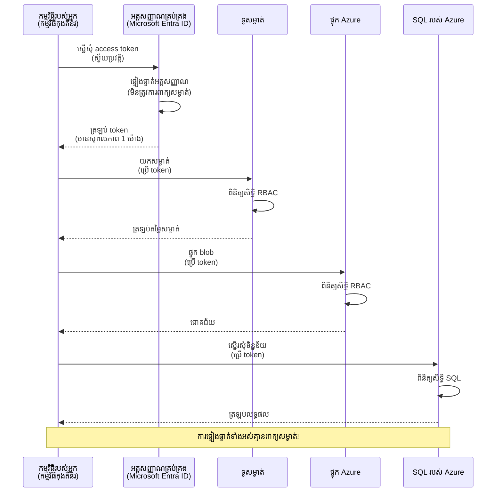
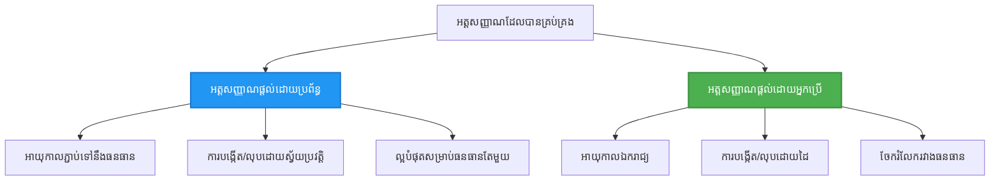

# លំនាំការ Authenticate និង អត្តសញ្ញាណដែលបានគ្រប់គ្រង

⏱️ **ពេលវេលាចំណាយឧទាហរណ៍**: 45-60 minutes | 💰 **តម្លៃចំណាយ**: Free (no additional charges) | ⭐ **ភាពស្មុគស្មាញ**: Intermediate

**📚 ផ្លូវការសិក្សា:**
- ← មុន៖ [ការគ្រប់គ្រងកំណត់រចនាសម្ពន្ធ](configuration.md) - គ្រប់គ្រងអថេរបរិយាកាស និង សម្ងាត់
- 🎯 **អ្នកនៅទីនេះ**: ការផ្ទៀងផ្ទាត់ និងសន្តិសុខ (អត្តសញ្ញាណដែលបានគ្រប់គ្រង, Key Vault, លំនាំសុវត្ថិភាព)
- → បន្ទាប់៖ [គម្រោងដំបូង](first-project.md) - សាងសង់កម្មវិធី AZD ជាលើកដំបូង
- 🏠 [ទំព័រដើមថ្នាក់រៀន](../../README.md)

---

## អ្វីដែលអ្នក​នឹងរៀន

ដោយបញ្ចប់មេរៀននេះ អ្នកនឹង:
- យល់ពីលំនាំផ្ទៀងផ្ទាត់របស់ Azure (keys, connection strings, អត្តសញ្ញាណដែលបានគ្រប់គ្រង)
- អនុវត្តអត្តសញ្ញាណដែលបានគ្រប់គ្រង សម្រាប់ការផ្ទៀងផ្ទាត់ដោយគ្មានពាក្យសម្ងាត់
- រួមបញ្ចូល Azure Key Vault ដើម្បីការពារសម្ងាត់
- កំណត់ role-based access control (RBAC) សម្រាប់ការដាក់ចេញ AZD
- អនុវត្តគោលការណ៍សុវត្ថិភាពល្អបំផុតនៅក្នុង Container Apps និងសេវាកម្ម Azure
- បម្លែងពីការផ្ទៀងផ្ទាត់ដោយផ្អែកលើ key ទៅការផ្អែកលើអត្តសញ្ញាណ

## ហេតុអ្វីបានជា អត្តសញ្ញាណដែលបានគ្រប់គ្រង មានសារៈសំខាន់

### បញ្ហា: ការផ្ទៀងផ្ទាត់បែបប្រពៃណី

**មុននឹងអត្តសញ្ញាណដែលបានគ្រប់គ្រង:**
```javascript
// ❌ ហានិភ័យសុវត្ថិភាព: សម្ងាត់ដែលបានកូដថេរនៅក្នុងកូដ
const connectionString = "Server=mydb.database.windows.net;User=admin;Password=P@ssw0rd123";
const storageKey = "xK7mN9pQ2wR5tY8uI0oP3aS6dF1gH4jK...";
const cosmosKey = "C2x7B9n4M1p8Q5w3E6r0T2y5U8i1O4p7...";
```

**បញ្ហា:**
- 🔴 **សម្ងាត់ដែលបានបើកចំហ** នៅក្នុងកូដ, ឯកសារ config, អថេរបរិយាកាស
- 🔴 **ការប្ដូរអត្ថសញ្ញាបត្រ** ត្រូវការការផ្លាស់ប្តូរកូដ និងការដាក់ចេញឡើងវិញ
- 🔴 **បញ្ហាត្រួតពិនិត្យ (audit)** - នរណាដែលចូលប្រើអ្វី និងពេលណា?
- 🔴 **ការរីងរាយ** - សម្ងាត់ត្រូវបានបែកចែកនៅក្នុងប្រព័ន្ធជាច្រើន
- 🔴 **ហានិភ័យផ្នែកគោលការណ៍** - បរាជ័យក្នុងការត្រួតពិនិត្យសន្តិសុខ

### ដំណោះស្រាយ: អត្តសញ្ញាណដែលបានគ្រប់គ្រង

**បន្ទាប់ពីអត្តសញ្ញាណដែលបានគ្រប់គ្រង:**
```javascript
// ✅ សុវត្ថិភាព: គ្មានសម្ងាត់នៅក្នុងកូដ
const credential = new DefaultAzureCredential();
const client = new BlobServiceClient(
  "https://mystorageaccount.blob.core.windows.net",
  credential  // Azure គ្រប់គ្រងការផ្ទៀងផ្ទាត់អត្តសញ្ញាណដោយស្វ័យប្រវត្តិ
);
```

**អត្ថប្រយោជន៍:**
- ✅ **គ្មានសម្ងាត់** នៅក្នុងកូដ ឬ ការកំណត់រចនាសម្ព័ន្ធ
- ✅ **ការប្ដូរឲ្យស្វ័យប្រវត្តិ** - Azure ទទួលខុសត្រូវ
- ✅ **ចុះតាមប្រវត្តិ audit ពេញលេញ** ក្នុងកំណត់ហេតុ Microsoft Entra ID
- ✅ **សន្តិសុខសម្រួលចងក្រង** - គ្រប់គ្រងនៅក្នុង Azure Portal
- ✅ **រួចសម្រាប់គោលការណ៍** - ទាក់ទងស្តង់ដាសន្តិសុខ

**និមិត្តរូប**: ការផ្ទៀងផ្ទាត់បែបប្រពៃណី គឺដូចជាការយកកូនសោជាច្រើនសម្រាប់ទ្វារផ្សេងៗ។ អត្តសញ្ញាណដែលបានគ្រប់គ្រង គឺដូចជាកត្តាសន្តិសុខមួយដែលផ្ដល់ការចូលប្រើដោយស្វ័យប្រវត្តិផ្អែកលើអត្តសញ្ញាណរបស់អ្នក — គ្មានកូនសោដែលអាចបាត់, ចម្លង, ឬ ប្ដូរ។

---

## ទិដ្ឋភាពស្ថាបត្យកម្ម

### លំហូរផ្ទៀងផ្ទាត់ជាមួយអត្តសញ្ញាណដែលបានគ្រប់គ្រង



### ប្រភេទនៃអត្តសញ្ញាណដែលបានគ្រប់គ្រង



| មុខងារ | បានចាត់តាំងដោយប្រព័ន្ធ | ចាត់តាំងដោយអ្នកប្រើ |
|---------|----------------|---------------|
| **រយៈពេលជីវិត** | ភ្ជាប់ទៅធនធាន | ឯករាជ្យ |
| **ការបង្កើត** | ស្វ័យប្រវត្តិជាមួយធនធាន | បង្កើតដោយដៃ |
| **ការលុប** | លុបជាមួយធនធាន | អង្រឹងក្រោយការលុបធនធាន |
| **ការចែករំលែក** | សម្រាប់ធនធានតែមួយ | ធនធានជាច្រើន |
| **ករណីប្រើប្រាស់** | សេណារីយ៉ូមសាមញ្ញ | សេណារីយ៉ូមស្មុគស្មាញច្រើនធនធាន |
| **លំនាំដើម AZD** | ✅ ត្រូវបានផ្ដល់អនុសាសន៍ | ជាវិសមរភាព |

---

## លក្ខខ័ណ្ឌមុនចាប់ផ្តើម

### ឧបករណ៍​ទាមទារ

អ្នកគួរតែបានដំឡើងទាំងនេះពីមេរៀនមុន:
```bash
# ផ្ទៀងផ្ទាត់ Azure Developer CLI
azd version
# ✅ រំពឹងទុក: azd កំណែ 1.0.0 ឬច្រើនជាងនេះ

# ផ្ទៀងផ្ទាត់ Azure CLI
az --version
# ✅ រំពឹកទុក: azure-cli 2.50.0 ឬច្រើនជាងនេះ
```

### លក្ខខ័ណ្ឌ Azure

- កម្មវិធីជាវ Azure សកម្ម
- សិទ្ធិដើម្បី:
  - បង្កើតអត្តសញ្ញាណដែលបានគ្រប់គ្រង
  - ចាត់តាំងតួនាទី RBAC
  - បង្កើតធនធាន Key Vault
  - ដាក់ចេញ Container Apps

### ចំណេះដឹងដែលត្រូវមាន

អ្នកគួរតែបានបញ្ចប់:
- [មាគ៌ាដំឡើង](installation.md) - ការកំណត់ AZD
- [មូលដ្ឋាន AZD](azd-basics.md) - គំនិតដើម
- [ការគ្រប់គ្រងកំណត់រចនាសម្ព័ន្ធ](configuration.md) - អថេរបរិយាកាស

---

## មេរៀន 1: យល់ពីលំនាំផ្ទៀងផ្ទាត់

### លំនាំ 1: Connection Strings (ចាស់ - និងត្រូវជៀសវាង)

**របៀបវាធ្វើការ:**
```bash
# ខ្សែការភ្ជាប់មានព័ត៌មានអត្តសញ្ញាណ
STORAGE_CONNECTION_STRING="DefaultEndpointsProtocol=https;AccountName=myaccount;AccountKey=xK7mN9pQ2wR5..."
COSMOS_CONNECTION_STRING="AccountEndpoint=https://myaccount.documents.azure.com:443/;AccountKey=C2x7..."
SQL_CONNECTION_STRING="Server=myserver.database.windows.net;User=admin;Password=P@ssw0rd..."
```

**បញ្ហា:**
- ❌ សម្ងាត់មើលឃើញបាននៅក្នុងអថេរបរិយាកាស
- ❌ បានកត់ត្រានៅក្នុងប្រព័ន្ធដាក់ចេញ
- ❌ លំបាកក្នុងការប្ដូរ
- ❌ គ្មានតាមដាន audit នៃការចូលប្រើ

**ពេលណាដើម្បីប្រើ:** សម្រាប់ការអភិវឌ្ឍក្នុងកន្លែងក្នុងស្រុក ប៉ុណ្ណោះ មិនសម្រាប់ផលិតកម្មទេ។

---

### លំនាំ 2: Key Vault References (ល្អជាង)

**របៀបវាធ្វើការ:**
```bicep
// Store secret in Key Vault
resource keyVault 'Microsoft.KeyVault/vaults@2023-02-01' = {
  name: 'mykv'
  properties: {
    enableRbacAuthorization: true
  }
}

// Reference in Container App
env: [
  {
    name: 'STORAGE_KEY'
    secretRef: 'storage-key'  // References Key Vault
  }
]
```

**អត្ថប្រយោជន៍:**
- ✅ សម្ងាត់បានផ្ទុកយ៉ាងសុវត្ថិភាពនៅក្នុង Key Vault
- ✅ គ្រប់គ្រងសម្ងាត់នៅមជ្ឈមណ្ឌល
- ✅ អាចប្ដូរបានដោយគ្មានការផ្លាស់ប្តូរកូដ

**កំណត់ចំណុច:**
- ⚠️ វានៅតែប្រើ keys/ពាក្យសម្ងាត់
- ⚠️ ត្រូវមានការគ្រប់គ្រងការចូលប្រើ Key Vault

**ពេលណាដើម្បីប្រើ:** ជាជំហានផ្លាស់ប្តូរពី connection strings ទៅអត្តសញ្ញាណដែលបានគ្រប់គ្រង។

---

### លំនាំ 3: អត្តសញ្ញាណដែលបានគ្រប់គ្រង (គោលការណ៍ល្អបំផុត)

**របៀបវាធ្វើការ:**
```bicep
// Enable managed identity
resource containerApp 'Microsoft.App/containerApps@2023-05-01' = {
  name: 'myapp'
  identity: {
    type: 'SystemAssigned'  // Automatically creates identity
  }
}

// Grant permissions
resource roleAssignment 'Microsoft.Authorization/roleAssignments@2022-04-01' = {
  scope: storageAccount
  properties: {
    roleDefinitionId: storageBlobDataContributorRole
    principalId: containerApp.identity.principalId
  }
}
```

**កូដកម្មវិធី៖**
```javascript
// មិនត្រូវការអាថ៌កំបាំង!
const { DefaultAzureCredential } = require('@azure/identity');
const { BlobServiceClient } = require('@azure/storage-blob');

const credential = new DefaultAzureCredential();
const blobServiceClient = new BlobServiceClient(
  'https://mystorageaccount.blob.core.windows.net',
  credential
);
```

**អត្ថប្រយោជន៍:**
- ✅ គ្មានសម្ងាត់ក្នុងកូដ/កំណត់រចនាសម្ព័ន្ធ
- ✅ ការប្ដូរអត្ថសញ្ញាបត្រដោយស្វ័យប្រវត្តិ
- ✅ ចុះតាមប្រវត្តិ audit ពេញលេញ
- ✅ សិទ្ធិផ្អែកលើ RBAC
- ✅ រួចសម្រាប់គោលការណ៍

**ពេលណាដើម្បីប្រើ:** តែងតែប្រើ សម្រាប់កម្មវិធីផលិតកម្ម។

---

### លំនាំ 4: Service Principals (CI/CD និង ស្វ័យប្រវត្តិកម្ម)

អត្តសញ្ញាណដែលបានគ្រប់គ្រង គឺជាគំរូល្អបំផុត សម្រាប់ធនធានដែលដំណើរការផ្ទាល់ក្នុង Azure។ ប៉ុន្តែតើអ្វីទៅជាករណីសម្រាប់អ្វីៗដែលដំណើរការខាងក្រៅ Azure — ដូចជា CI/CD pipeline លើ build agent ឬ ស្ក្រីបនៅលើកុំព្យូទ័រយួរដៃរបស់អ្នក ដែលមិនអាចប្រើការចូលតាមអន្តរកម្មបាន? នោះជាកន្លែងដែល **service principal** កើតមាន៖ គឺជា​អត្តសញ្ញាណមិនមនុស្សដែលមានគណនីសម្ងាត់របស់ខ្លួន ដែលប្រតិបត្តិការដែលមានស្វ័យប្រវត្តិអាចចូលឱ្យបាន។

**របៀបវាធ្វើការ:**

Create a service principal scoped to a resource group (least privilege):

```bash
az ad sp create-for-rbac \
  --name "myapp-cicd" \
  --role contributor \
  --scopes /subscriptions/<sub-id>/resourceGroups/<rg-name>
```

This prints a client ID, client secret, and tenant ID. azd can sign in with them non-interactively:

```bash
azd auth login \
  --client-id "<appId>" \
  --client-secret "<password>" \
  --tenant-id "<tenant>"
```

**ចូលចិត្តប្រើលទ្ធផលសមាជិកភាព (federated credentials - OIDC) ជាងសម្ងាត់។** ជំនួសសម្ងាត់ client ដែលមានអាយុកាលយូរ សូមកំណត់ federated credential ដើម្បីឲ្យ pipeline ប្ដូរទៅ token ដែលមានអាយុកាលខ្លី — គ្មានសម្ងាត់ដើម្បីរលាក់ឬប្ដូរ៖

```bash
azd auth login \
  --client-id "<appId>" \
  --federated-credential-provider "github" \
  --tenant-id "<tenant>"
```

> `azd pipeline config` sets this up for you automatically. មើលដំណើរការជាក់លាក់ CI/CD នៅក្នុង [ជំពូក 8](../chapter-08-production/production-ai-practices.md)។

**អត្ថប្រយោជន៍:**
- ✅ ធ្វើការ​លើ​ផ្នែកខាងក្រៅ Azure (build agents, on-prem, clouds ផ្សេងៗ)
- ✅ អាចចាត់តាំងដោយកម្រិតទៅក្រុមធនធានតែមួយជាមួយតួនាទីតែមួយ
- ✅ ជាកម្រិត Federated (OIDC) មិនប្រើសម្ងាត់ដែលបានរក្សាទុក

**ចំណុចចាត់ទុក:**
- ⚠️ បរិមាណដែលផ្អែកលើសម្ងាត់ត្រូវការការផ្ទុក និងការប្ដូរយ៉ាងប្រុងប្រយ័ត្ន
- ⚠️ សម្ងាត់ដែលរលាក់នឹងផ្ដល់អំណាចដូចដែល SP អាចធ្វើបាន — គួរតែរក្សាស្ដង់ដារ scopes ឲ្យតិចៗ

**ពេលណាដើម្បីប្រើ:** សម្រាប់ CI/CD pipelines និងស្វ័យប្រវត្តិកម្មដែលមិនអាចប្រើ managed identity ។ តែងតែចូលចិត្តប្រើប្រភេទ **federated/OIDC** ជាជម្រើសល្អជាង client secret ហើយអនុវត្ត managed identity រាល់ពេលដែលបេសកកម្មដំណើរក្នុង Azure ។

**ការរក្សាគណនីយ៉ាងសុវត្ថិភាព:**
- មិនចុះ commit សម្ងាត់ឡើយ — ប្រើស្ទកទុកសម្ងាត់របស់ pipeline (GitHub Actions secrets, Azure DevOps variable groups / Key Vault)។
- កំណត់ SP ទៅតួនាទីតូចបំផុត និងក្រុមធនធានត្រូវការ។
- កំណត់អង់តទាយ និងប្ដូរ, ឬលុបទាំងស្រុងសម្ងាត់ដោយប្រើ OIDC។

---

## មេរៀន 2: អនុវត្តអត្តសញ្ញាណដែលបានគ្រប់គ្រង ជាមួយ AZD

### ការអនុវត្តជំហានៗ

ឯឯណោះ យើងអាចសាងសង់ Container App ដែលមានសុវត្ថិភាព ដែលប្រើអត្តសញ្ញាណដែលបានគ្រប់គ្រង ដើម្បីចូលប្រើ Azure Storage និង Key Vault។

### រចនាសម្ព័ន្ធគម្រោង

```
secure-app/
├── azure.yaml                 # AZD configuration
├── infra/
│   ├── main.bicep            # Main infrastructure
│   ├── core/
│   │   ├── identity.bicep    # Managed identity setup
│   │   ├── keyvault.bicep    # Key Vault configuration
│   │   └── storage.bicep     # Storage with RBAC
│   └── app/
│       └── container-app.bicep
└── src/
    ├── app.js                # Application code
    ├── package.json
    └── Dockerfile
```

### 1. កំណត់ค่า AZD (azure.yaml)

```yaml
name: secure-app
metadata:
  template: secure-app@1.0.0

services:
  api:
    project: ./src
    language: js
    host: containerapp

# Enable managed identity (AZD handles this automatically)
```

### 2. រចនាស្ថាបត្យកម្ម: បើកអត្តសញ្ញាណដែលបានគ្រប់គ្រង

**ឯកសារ: `infra/main.bicep`**

```bicep
targetScope = 'subscription'

param environmentName string
param location string = 'eastus'

var tags = { 'azd-env-name': environmentName }

// Resource group
resource rg 'Microsoft.Resources/resourceGroups@2021-04-01' = {
  name: 'rg-${environmentName}'
  location: location
  tags: tags
}

// Storage Account
module storage './core/storage.bicep' = {
  name: 'storage'
  scope: rg
  params: {
    name: 'st${uniqueString(rg.id)}'
    location: location
    tags: tags
  }
}

// Key Vault
module keyVault './core/keyvault.bicep' = {
  name: 'keyvault'
  scope: rg
  params: {
    name: 'kv-${uniqueString(rg.id)}'
    location: location
    tags: tags
  }
}

// Container App with Managed Identity
module containerApp './app/container-app.bicep' = {
  name: 'container-app'
  scope: rg
  params: {
    name: 'ca-${environmentName}'
    location: location
    tags: tags
    storageAccountName: storage.outputs.name
    keyVaultName: keyVault.outputs.name
  }
}

// Grant Container App access to Storage
module storageRoleAssignment './core/role-assignment.bicep' = {
  name: 'storage-role'
  scope: rg
  params: {
    principalId: containerApp.outputs.identityPrincipalId
    roleDefinitionId: 'ba92f5b4-2d11-453d-a403-e96b0029c9fe'  // Storage Blob Data Contributor
    targetResourceId: storage.outputs.id
  }
}

// Grant Container App access to Key Vault
module kvRoleAssignment './core/role-assignment.bicep' = {
  name: 'kv-role'
  scope: rg
  params: {
    principalId: containerApp.outputs.identityPrincipalId
    roleDefinitionId: '4633458b-17de-408a-b874-0445c86b69e6'  // Key Vault Secrets User
    targetResourceId: keyVault.outputs.id
  }
}

// Outputs
output AZURE_STORAGE_ACCOUNT_NAME string = storage.outputs.name
output AZURE_KEY_VAULT_NAME string = keyVault.outputs.name
output APP_URL string = containerApp.outputs.url
```

### 3. Container App ជាមួយ System-Assigned Identity

**ឯកសារ: `infra/app/container-app.bicep`**

```bicep
param name string
param location string
param tags object = {}
param storageAccountName string
param keyVaultName string

resource containerApp 'Microsoft.App/containerApps@2023-05-01' = {
  name: name
  location: location
  tags: tags
  identity: {
    type: 'SystemAssigned'  // 🔑 Enable managed identity
  }
  properties: {
    configuration: {
      ingress: {
        external: true
        targetPort: 3000
      }
    }
    template: {
      containers: [
        {
          name: 'api'
          image: 'myregistry.azurecr.io/api:latest'
          resources: {
            cpu: json('0.5')
            memory: '1Gi'
          }
          env: [
            {
              name: 'AZURE_STORAGE_ACCOUNT_NAME'
              value: storageAccountName
            }
            {
              name: 'AZURE_KEY_VAULT_NAME'
              value: keyVaultName
            }
            // 🔑 No secrets - managed identity handles authentication!
          ]
        }
      ]
    }
  }
}

// Output the identity for RBAC assignments
output identityPrincipalId string = containerApp.identity.principalId
output id string = containerApp.id
output url string = 'https://${containerApp.properties.configuration.ingress.fqdn}'
```

### 4. ម៉ូឌុលចាត់តាំងតួនាទី RBAC

**ឯកសារ: `infra/core/role-assignment.bicep`**

```bicep
param principalId string
param roleDefinitionId string  // Azure built-in role ID
param targetResourceId string

resource roleAssignment 'Microsoft.Authorization/roleAssignments@2022-04-01' = {
  name: guid(principalId, roleDefinitionId, targetResourceId)
  scope: resourceId('Microsoft.Resources/resourceGroups', resourceGroup().name)
  properties: {
    roleDefinitionId: subscriptionResourceId('Microsoft.Authorization/roleDefinitions', roleDefinitionId)
    principalId: principalId
    principalType: 'ServicePrincipal'
  }
}

output id string = roleAssignment.id
```

### 5. កូដកម្មវិធីជាមួយអត្តសញ្ញាណដែលបានគ្រប់គ្រង

**ឯកសារ: `src/app.js`**

```javascript
const express = require('express');
const { DefaultAzureCredential } = require('@azure/identity');
const { BlobServiceClient } = require('@azure/storage-blob');
const { SecretClient } = require('@azure/keyvault-secrets');

const app = express();
const PORT = process.env.PORT || 3000;

// 🔑 ចាប់ផ្តើមកំណត់ព័ត៌មានសម្គាល់ (ដំណើរការ​ដោយស្វ័យប្រវត្តិ​ជាមួយ​អត្តសញ្ញាណ​ដែលបាន​គ្រប់គ្រង)
const credential = new DefaultAzureCredential();

// ការកំណត់ Azure Storage
const storageAccountName = process.env.AZURE_STORAGE_ACCOUNT_NAME;
const blobServiceClient = new BlobServiceClient(
  `https://${storageAccountName}.blob.core.windows.net`,
  credential  // មិនត្រូវការសោទេ!
);

// ការកំណត់ Key Vault
const keyVaultName = process.env.AZURE_KEY_VAULT_NAME;
const secretClient = new SecretClient(
  `https://${keyVaultName}.vault.azure.net`,
  credential  // មិនត្រូវការសោទេ!
);

// ការត្រួតពិនិត្យសុខភាព
app.get('/health', (req, res) => {
  res.json({ status: 'healthy', authentication: 'managed-identity' });
});

// ផ្ទុកឯកសារឡើង​ទៅ Blob Storage
app.post('/upload', async (req, res) => {
  try {
    const containerClient = blobServiceClient.getContainerClient('uploads');
    await containerClient.createIfNotExists();
    
    const blobName = `file-${Date.now()}.txt`;
    const blockBlobClient = containerClient.getBlockBlobClient(blobName);
    
    await blockBlobClient.upload('Hello from managed identity!', 30);
    
    res.json({
      success: true,
      blobName: blobName,
      message: 'File uploaded using managed identity!'
    });
  } catch (error) {
    console.error('Upload error:', error);
    res.status(500).json({ error: error.message });
  }
});

// ទាញយកសម្ងាត់ពី Key Vault
app.get('/secret/:name', async (req, res) => {
  try {
    const secretName = req.params.name;
    const secret = await secretClient.getSecret(secretName);
    
    res.json({
      name: secretName,
      value: secret.value,
      message: 'Secret retrieved using managed identity!'
    });
  } catch (error) {
    console.error('Secret error:', error);
    res.status(500).json({ error: error.message });
  }
});

// រាយបញ្ជីកុងតឺន័រ Blob (បង្ហាញពីសិទ្ធិអាន)
app.get('/containers', async (req, res) => {
  try {
    const containers = [];
    for await (const container of blobServiceClient.listContainers()) {
      containers.push(container.name);
    }
    
    res.json({
      containers: containers,
      count: containers.length,
      message: 'Containers listed using managed identity!'
    });
  } catch (error) {
    console.error('List error:', error);
    res.status(500).json({ error: error.message });
  }
});

app.listen(PORT, () => {
  console.log(`Secure API listening on port ${PORT}`);
  console.log('Authentication: Managed Identity (passwordless)');
});
```

**ឯកសារ: `src/package.json`**

```json
{
  "name": "secure-app",
  "version": "1.0.0",
  "dependencies": {
    "express": "^4.18.2",
    "@azure/identity": "^4.0.0",
    "@azure/storage-blob": "^12.17.0",
    "@azure/keyvault-secrets": "^4.7.0"
  },
  "scripts": {
    "start": "node app.js"
  }
}
```

### 6. ដាក់ចេញ និងសាកល្បង

```bash
# ចាប់ផ្ដើមបរិយាកាស AZD
azd init

# បង្ហោះហេដ្ឋារចនាសម្ព័ន្ធ និងកម្មវិធី
azd up

# ទទួល URL នៃកម្មវិធី
APP_URL=$(azd env get-values | grep APP_URL | cut -d '=' -f2 | tr -d '"')

# សាកល្បងការត្រួតពិនិត្យសុខភាព
curl $APP_URL/health
```

**✅ លទ្ធផលដែលរំពឹងទុក:**
```json
{
  "status": "healthy",
  "authentication": "managed-identity"
}
```

**សាកល្បងផ្ទុក blob:**
```bash
curl -X POST $APP_URL/upload
```

**✅ លទ្ធផលដែលរំពឹងទុក:**
```json
{
  "success": true,
  "blobName": "file-1700404800000.txt",
  "message": "File uploaded using managed identity!"
}
```

**សាកល្បងបញ្ជី container:**
```bash
curl $APP_URL/containers
```

**✅ លទ្ធផលដែលរំពឹងទុក:**
```json
{
  "containers": ["uploads"],
  "count": 1,
  "message": "Containers listed using managed identity!"
}
```

---

## តួនាទី RBAC Azure ដែលពេញនិយម

### Role IDs សាងសង់រួចសម្រាប់អត្តសញ្ញាណដែលបានគ្រប់គ្រង

| សេវាកម្ម | ឈ្មោះតួនាទី | Role ID | សិទ្ធិ |
|---------|-----------|---------|-------------|
| **Storage** | Storage Blob Data Reader | `2a2b9908-6b94-4a3d-8e5a-a7d8f8cc8a12` | អាន blob និង container |
| **Storage** | Storage Blob Data Contributor | `ba92f5b4-2d11-453d-a403-e96b0029c9fe` | អាន, សរសេរ, លុប blob |
| **Storage** | Storage Queue Data Contributor | `974c5e8b-45b9-4653-ba55-5f855dd0fb88` | អាន, សរសេរ, លុបសារ queue |
| **Key Vault** | Key Vault Secrets User | `4633458b-17de-408a-b874-0445c86b69e6` | អានសម្ងាត់ |
| **Key Vault** | Key Vault Secrets Officer | `b86a8fe4-44ce-4948-aee5-eccb2c155cd7` | អាន, សរសេរ, លុបសម្ងាត់ |
| **Cosmos DB** | Cosmos DB Built-in Data Reader | `00000000-0000-0000-0000-000000000001` | អានទិន្នន័យ Cosmos DB |
| **Cosmos DB** | Cosmos DB Built-in Data Contributor | `00000000-0000-0000-0000-000000000002` | អាន, សរសេរ ទិន្នន័យ Cosmos DB |
| **SQL Database** | SQL DB Contributor | `9b7fa17d-e63e-47b0-bb0a-15c516ac86ec` | គ្រប់គ្រងមូលដ្ឋានទិន្នន័យ SQL |
| **Service Bus** | Azure Service Bus Data Owner | `090c5cfd-751d-490a-894a-3ce6f1109419` | ផ្ញើ, ទទួល, គ្រប់គ្រងសារ |

### របៀបស្វែងរក Role IDs

```bash
# បង្ហាញបញ្ជីតួនាទីដែលមានរួច
az role definition list --query "[].{Name:roleName, ID:name}" --output table

# ស្វែងរកតួនាទីជាក់លាក់
az role definition list --query "[?contains(roleName, 'Storage Blob')].{Name:roleName, ID:name}" --output table

# ទទួលព័ត៌មានលម្អិតអំពីតួនាទី
az role definition list --name "Storage Blob Data Contributor"
```

---

## លំហាត់អនុវត្ត

### លំហាត់ 1: បើកអត្តសញ្ញាណដែលបានគ្រប់គ្រងសម្រាប់កម្មវិធីដែលមានរួច ⭐⭐ (មធ្យម)

**គោលបំណង**: បន្ថែមអត្តសញ្ញាណដែលបានគ្រប់គ្រងទៅក្នុងការដាក់ចេញ Container App ដែលមានរួច

**សេណារីយ៉ូម**: អ្នកមាន Container App ដែលប្រើ connection strings។ បម្លែងវាទៅអត្តសញ្ញាណដែលបានគ្រប់គ្រង។

**ចំណុចចាប់ផ្ដើម**: Container App ជាមួយការ​កំណត់រចនាសម្ព័ន្ធនេះ:

```bicep
// ❌ Current: Using connection string
env: [
  {
    name: 'STORAGE_CONNECTION_STRING'
    secretRef: 'storage-connection'
  }
]
```

**ជំហាន**៖

1. **បើកអត្តសញ្ញាណដែលបានគ្រប់គ្រងក្នុង Bicep:**

```bicep
resource containerApp 'Microsoft.App/containerApps@2023-05-01' = {
  name: 'myapp'
  identity: {
    type: 'SystemAssigned'  // Add this
  }
  // ... rest of configuration
}
```

2. **ផ្ដល់សិទ្ឋិចូលប្រើ Storage:**

```bicep
// Get storage account reference
resource storageAccount 'Microsoft.Storage/storageAccounts@2023-01-01' existing = {
  name: storageAccountName
}

// Assign role
resource roleAssignment 'Microsoft.Authorization/roleAssignments@2022-04-01' = {
  name: guid(containerApp.id, 'ba92f5b4-2d11-453d-a403-e96b0029c9fe', storageAccount.id)
  scope: storageAccount
  properties: {
    roleDefinitionId: subscriptionResourceId('Microsoft.Authorization/roleDefinitions', 'ba92f5b4-2d11-453d-a403-e96b0029c9fe')
    principalId: containerApp.identity.principalId
    principalType: 'ServicePrincipal'
  }
}
```

3. **អាប់ដេតកូដកម្មវិធី:**

**មុន (connection string):**
```javascript
const { BlobServiceClient } = require('@azure/storage-blob');

const blobServiceClient = BlobServiceClient.fromConnectionString(
  process.env.STORAGE_CONNECTION_STRING
);
```

**បន្ទាប់ (managed identity):**
```javascript
const { DefaultAzureCredential } = require('@azure/identity');
const { BlobServiceClient } = require('@azure/storage-blob');

const credential = new DefaultAzureCredential();
const blobServiceClient = new BlobServiceClient(
  `https://${process.env.STORAGE_ACCOUNT_NAME}.blob.core.windows.net`,
  credential
);
```

4. **អាប់ដេតអថេរបរិយាកាស:**

```bicep
env: [
  {
    name: 'STORAGE_ACCOUNT_NAME'
    value: storageAccountName  // Just the name, no secrets!
  }
  // Remove STORAGE_CONNECTION_STRING
]
```

5. **ដាក់ចេញ និងសាកល្បង:**

```bash
# ដាក់ប្រើឡើងវិញ
azd up

# សាកល្បងថាវានៅតែដំណើរការ​បាន
curl https://myapp.azurecontainerapps.io/upload
```

**✅ ក្រមសូចនាករ​ជោគជ័យ:**
- ✅ កម្មវិធីដាក់ចេញដោយគ្មានកំហុស
- ✅ ប្រតិបត្តិការផ្ទុក Storage ធ្វើការផ្ទាល់ (ផ្ទុក, បញ្ជី, ទាញយក)
- ✅ គ្មាន connection strings នៅក្នុងអថេរបរិយាកាស
- ✅ អត្តសញ្ញាណមើលឃើញនៅក្នុង Azure Portal នៅក្រោមផ្ទាំង "Identity"

**ការត្រួតពិនិត្យ:**

```bash
# ពិនិត្យថា Managed Identity ត្រូវបានបើកប្រើ
az containerapp show \
  --name myapp \
  --resource-group rg-myapp \
  --query "identity.type"
# ✅ រំពឹងទុក៖ "SystemAssigned"

# ពិនិត្យការចាត់តួនាទី
az role assignment list \
  --assignee $(az containerapp show --name myapp --resource-group rg-myapp --query "identity.principalId" -o tsv) \
  --scope /subscriptions/{sub-id}/resourceGroups/rg-myapp/providers/Microsoft.Storage/storageAccounts/mystorageaccount
# ✅ រំពឹងទុក៖ បង្ហាញតួនាទី "Storage Blob Data Contributor"
```

**ពេលវេលា**: 20-30 minutes

---

### លំហាត់ 2: ការចូលប្រើច្រើនសេវាមួយដោយអត្តសញ្ញាណដែលចាត់តាំងដោយអ្នកប្រើ ⭐⭐⭐ (កម្រិតខ្ពស់)

**គោលបំណង**: បង្កើតអត្តសញ្ញាណដែលចាត់តាំងដោយអ្នកប្រើ ដែលចែករំលែករវាង Container Apps ជាច្រើន

**សេណារីយ៉ូម**: អ្នកមានសេវាមីក្រូ 3 ដែលទាំងអស់ត្រូវការចូលប្រើគណនី Storage និង Key Vault ដូចគ្នា។

**ជំហាន**:

1. **បង្កើតអត្តសញ្ញាណដែលចាត់តាំងដោយអ្នកប្រើ:**

**ឯកសារ: `infra/core/identity.bicep`**

```bicep
param name string
param location string
param tags object = {}

resource userAssignedIdentity 'Microsoft.ManagedIdentity/userAssignedIdentities@2023-01-31' = {
  name: name
  location: location
  tags: tags
}

output id string = userAssignedIdentity.id
output principalId string = userAssignedIdentity.properties.principalId
output clientId string = userAssignedIdentity.properties.clientId
```

2. **ចាត់តាំងតួនាទីទៅអត្តសញ្ញាណដែលចាត់តាំងដោយអ្នកប្រើ:**

```bicep
// In main.bicep
module userIdentity './core/identity.bicep' = {
  name: 'user-identity'
  scope: rg
  params: {
    name: 'id-${environmentName}'
    location: location
    tags: tags
  }
}

// Grant Storage access
resource storageRoleAssignment 'Microsoft.Authorization/roleAssignments@2022-04-01' = {
  name: guid(userIdentity.outputs.principalId, 'storage-contributor')
  scope: storageAccount
  properties: {
    roleDefinitionId: subscriptionResourceId('Microsoft.Authorization/roleDefinitions', 'ba92f5b4-2d11-453d-a403-e96b0029c9fe')
    principalId: userIdentity.outputs.principalId
    principalType: 'ServicePrincipal'
  }
}

// Grant Key Vault access
resource kvRoleAssignment 'Microsoft.Authorization/roleAssignments@2022-04-01' = {
  name: guid(userIdentity.outputs.principalId, 'kv-secrets-user')
  scope: keyVault
  properties: {
    roleDefinitionId: subscriptionResourceId('Microsoft.Authorization/roleDefinitions', '4633458b-17de-408a-b874-0445c86b69e6')
    principalId: userIdentity.outputs.principalId
    principalType: 'ServicePrincipal'
  }
}
```

3. **ចាត់តាំងអត្តសញ្ញាណទៅ Container Apps ច្រើន:**

```bicep
resource apiGateway 'Microsoft.App/containerApps@2023-05-01' = {
  name: 'api-gateway'
  identity: {
    type: 'UserAssigned'
    userAssignedIdentities: {
      '${userIdentity.outputs.id}': {}
    }
  }
  // ... rest of config
}

resource productService 'Microsoft.App/containerApps@2023-05-01' = {
  name: 'product-service'
  identity: {
    type: 'UserAssigned'
    userAssignedIdentities: {
      '${userIdentity.outputs.id}': {}
    }
  }
  // ... rest of config
}

resource orderService 'Microsoft.App/containerApps@2023-05-01' = {
  name: 'order-service'
  identity: {
    type: 'UserAssigned'
    userAssignedIdentities: {
      '${userIdentity.outputs.id}': {}
    }
  }
  // ... rest of config
}
```

4. **កូដកម្មវិធី (សេវាទាំងអស់ប្រើលំនាំដូចគ្នា):**

```javascript
const { DefaultAzureCredential, ManagedIdentityCredential } = require('@azure/identity');

// សម្រាប់អត្តសញ្ញាណដែលបានកំណត់ដោយអ្នកប្រើ សូមបញ្ជាក់ ID អតិថិជន
const credential = new ManagedIdentityCredential(
  process.env.AZURE_CLIENT_ID  // ID អតិថិជន របស់អត្តសញ្ញាណដែលបានកំណត់ដោយអ្នកប្រើ
);

// ឬប្រើ DefaultAzureCredential (រកឃើញដោយស្វ័យប្រវត្តិ)
const credential = new DefaultAzureCredential();

const blobServiceClient = new BlobServiceClient(
  `https://${process.env.STORAGE_ACCOUNT_NAME}.blob.core.windows.net`,
  credential
);
```

5. **ដាក់ចេញ និងពិនិត្យ:**

```bash
azd up

# សាកល្បងថាសេវាកម្មទាំងអស់អាចចូលប្រើការផ្ទុកទិន្នន័យបាន
curl https://api-gateway.azurecontainerapps.io/upload
curl https://product-service.azurecontainerapps.io/upload
curl https://order-service.azurecontainerapps.io/upload
```

**✅ ក្រមសូចនាករ​ជោគជ័យ:**
- ✅ អត្តសញ្ញាណតែមួយចែករំលែកសម្រាប់សេវា 3 អង្គភាព
- ✅ សេវាទាំងអស់អាចចូលប្រើ Storage និង Key Vault
- ✅ អត្តសញ្ញាណនៅស្ថិតសព្វនៅបើអ្នកលុបសេវាមួយ
- ✅ ការគ្រប់គ្រងសិទ្ធិចងក្រងមជ្ឈមណ្ឌល

**អត្ថប្រយោជន៍នៃអត្តសញ្ញាណដែលចាត់តាំងដោយអ្នកប្រើ:**
- អត្តសញ្ញាណតែមួយសម្រាប់គ្រប់គ្រង
- សិទ្ធិជាប់គ្នាមានភាពសាមញ្ញ
- ស្ថិតនៅក្រោយការលុបសេវា
- ល្អសម្រាប់ស្ថាបត្យកម្មស្មុគស្មាញ

**ពេលវេលា**: 30-40 minutes

---

### លំហាត់ 3: អនុវត្តការប្ដូរសម្ងាត់ Key Vault ⭐⭐⭐ (កម្រិតខ្ពស់)

**គោលបំណង**: ទុកសម្ងាត់ API ពីភាគីទីបីនៅក្នុង Key Vault និងចូលប្រើពួកវាដោយប្រើអត្តសញ្ញាណដែលបានគ្រប់គ្រង

**សេណារីយ៉ូម**: កម្មវិធីរបស់អ្នកត្រូវតែហៅ API ខាងក្រៅ (OpenAI, Stripe, SendGrid) ដែលត្រូវការកូនសោ API។

**ជំហាន**:

1. **បង្កើត Key Vault ជាមួយ RBAC:**

**ឯកសារ: `infra/core/keyvault.bicep`**

```bicep
param name string
param location string
param tags object = {}

resource keyVault 'Microsoft.KeyVault/vaults@2023-02-01' = {
  name: name
  location: location
  tags: tags
  properties: {
    enableRbacAuthorization: true  // Use RBAC instead of access policies
    sku: {
      family: 'A'
      name: 'standard'
    }
    tenantId: subscription().tenantId
    enableSoftDelete: true
    softDeleteRetentionInDays: 90
  }
}

// Allow Container App to read secrets
output id string = keyVault.id
output name string = keyVault.name
output uri string = keyVault.properties.vaultUri
```

2. **ផ្ទុកសម្ងាត់នៅក្នុង Key Vault:**

```bash
# ទទួលបានឈ្មោះ Key Vault
KV_NAME=$(azd env get-values | grep AZURE_KEY_VAULT_NAME | cut -d '=' -f2 | tr -d '"')

# រក្សាទុកកូនសោ API ពីភាគីទីបី
az keyvault secret set \
  --vault-name $KV_NAME \
  --name "OpenAI-ApiKey" \
  --value "sk-proj-xxxxxxxxxxxxx"

az keyvault secret set \
  --vault-name $KV_NAME \
  --name "Stripe-ApiKey" \
  --value "sk_live_xxxxxxxxxxxxx"

az keyvault secret set \
  --vault-name $KV_NAME \
  --name "SendGrid-ApiKey" \
  --value "SG.xxxxxxxxxxxxx"
```

3. **កូដកម្មវិធីដើម្បីទាញយកសម្ងាត់:**

**ឯកសារ: `src/config.js`**

```javascript
const { DefaultAzureCredential } = require('@azure/identity');
const { SecretClient } = require('@azure/keyvault-secrets');

class Config {
  constructor() {
    this.credential = new DefaultAzureCredential();
    this.secretClient = new SecretClient(
      `https://${process.env.AZURE_KEY_VAULT_NAME}.vault.azure.net`,
      this.credential
    );
    this.cache = {};
  }

  async getSecret(secretName) {
    // ពិនិត្យខេសជាមុន
    if (this.cache[secretName]) {
      return this.cache[secretName];
    }

    try {
      const secret = await this.secretClient.getSecret(secretName);
      this.cache[secretName] = secret.value;
      console.log(`✅ Retrieved secret: ${secretName}`);
      return secret.value;
    } catch (error) {
      console.error(`❌ Failed to get secret ${secretName}:`, error.message);
      throw error;
    }
  }

  async getOpenAIKey() {
    return this.getSecret('OpenAI-ApiKey');
  }

  async getStripeKey() {
    return this.getSecret('Stripe-ApiKey');
  }

  async getSendGridKey() {
    return this.getSecret('SendGrid-ApiKey');
  }
}

module.exports = new Config();
```

4. **ប្រើសម្ងាត់ក្នុងកម្មវិធី:**

**ឯកសារ: `src/app.js`**

```javascript
const express = require('express');
const config = require('./config');
const { OpenAI } = require('openai');

const app = express();

// ចាប់ផ្ដើម OpenAI ជាមួយកូនសោពី Key Vault
let openaiClient;

async function initializeServices() {
  const openaiKey = await config.getOpenAIKey();
  openaiClient = new OpenAI({ apiKey: openaiKey });
  console.log('✅ Services initialized with secrets from Key Vault');
}

// ហៅនៅពេលចាប់ផ្ដើម
initializeServices().catch(console.error);

app.post('/chat', async (req, res) => {
  try {
    const completion = await openaiClient.chat.completions.create({
      model: 'gpt-4.1',
      messages: [{ role: 'user', content: 'Hello!' }]
    });
    
    res.json({
      response: completion.choices[0].message.content,
      authentication: 'Key from Key Vault via Managed Identity'
    });
  } catch (error) {
    res.status(500).json({ error: error.message });
  }
});

app.listen(3000, () => {
  console.log('Secure API with Key Vault integration running');
});
```

5. **ដាក់ចេញ និងសាកល្បង:**

```bash
azd up

# សាកល្បងថា កូនសោ API កំពុងដំណើរការ
curl -X POST https://myapp.azurecontainerapps.io/chat \
  -H "Content-Type: application/json" \
  -d '{"message":"Hello AI"}'
```

**✅ ក្រមសូចនាករ​ជោគជ័យ:**
- ✅ គ្មានកូនសោ API ក្នុងកូដ ឬអថេរបរិស្ថាន
- ✅ កម្មវិធី​យកកូនសោពី Key Vault
- ✅ APIs ពីភាគីទីបី ធ្វើការ​ត្រឹមត្រូវ
- ✅ អាចប្ដូរកូនសោដោយមិនប្រែសម្រួលកូដ

**ប្ដូរសម្ងាត់៖**

```bash
# ធ្វើបច្ចុប្បន្នភាពសម្ងាត់នៅក្នុង Key Vault
az keyvault secret set \
  --vault-name $KV_NAME \
  --name "OpenAI-ApiKey" \
  --value "sk-proj-NEW_KEY_HERE"

# ចាប់ផ្តើមកម្មវិធីឡើងវិញ ដើម្បីប្រើសោថ្មី
az containerapp revision restart \
  --name myapp \
  --resource-group rg-myapp
```

**ពេលវេលា**: 25-35 នាទី

---

## ចំណុចត្រួតពិនិត្យចំណេះដឹង

### 1. លំនាំផ្ទៀងផ្ទាត់អត្តសញ្ញាណ ✓

សាកល្បងការយល់ដឹងរបស់អ្នក៖

- [ ] **Q1**: តើមានលំនាំផ្ទៀងផ្ទាត់អត្តសញ្ញាណសំខាន់ៗបីយ៉ាងណាខ្លះ? 
  - **A**: Connection strings (legacy), Key Vault references (transition), Managed Identity (ល្អបំផុត)

- [ ] **Q2**: ហេតុអ្វីបានជា Managed Identity ល្អជាង connection strings?
  - **A**: គ្មានសម្ងាត់នៅក្នុងកូដ, ប្ដូរ/ញែរអូតូម៉ាទិក, មានកំណត់ហេតុ audit ពេញលេញ, សិទ្ធិ RBAC

- [ ] **Q3**: តើពេលណាដែលអ្នកនឹងប្រើ user-assigned identity ជំនួស system-assigned?
  - **A**: យ៉ាងពេលចែករំលែកអត្តសញ្ញាណឆ្លងកាត់ធនធានជាច្រើន ឬពេលវដ្ត​ជីវិតនៃអត្តសញ្ញាណឈ្នះខុសពីវដ្តជីវិតនៃធនធាន

**ការបញ្ជាក់ដោយអនុវត្ត:**
```bash
# ពិនិត្យថាកម្មវិធីរបស់អ្នកប្រើអត្តសញ្ញាណប្រភេទណា
az containerapp show \
  --name myapp \
  --resource-group rg-myapp \
  --query "identity.type"

# រាយបញ្ជីការចាត់តាំងតួនាទីទាំងអស់សម្រាប់អត្តសញ្ញាណ
az role assignment list \
  --assignee $(az containerapp show --name myapp --resource-group rg-myapp --query "identity.principalId" -o tsv)
```

---

### 2. RBAC និងសិទ្ធិ ✓

សាកល្បងការយល់ដឹងរបស់អ្នក៖

- [ ] **Q1**: តើ role ID សម្រាប់ "Storage Blob Data Contributor" ជាអ្វី?
  - **A**: `ba92f5b4-2d11-453d-a403-e96b0029c9fe`

- [ ] **Q2**: តើ "Key Vault Secrets User" ផ្តល់សិទ្ធិអ្វីខ្លះ?
  - **A**: ការចូលដំណើរការអាន​តែប៉ុណ្ណោះចំពោះសម្ងាត់ (មិនអាចបង្កើត, បន្ទាន់សម្រួល ឬលុប)

- [ ] **Q3**: តើធ្វើដូចម្តេចដើម្បីផ្តល់អនុញ្ញាតឲ្យ Container App ចូលដំណើរការ Azure SQL?
  - **A**: កំណត់តួនាទី "SQL DB Contributor" ឬកំណត់ Microsoft Entra ID authentication សម្រាប់ SQL

**ការបញ្ជាក់ដោយអនុវត្ត:**
```bash
# ស្វែងរកតួនាទីជាក់លាក់
az role definition list --name "Storage Blob Data Contributor"

# ពិនិត្យមើលតួនាទីណាខ្លះដែលត្រូវបានផ្ដល់ឲ្យអត្តសញ្ញាណរបស់អ្នក
PRINCIPAL_ID=$(az containerapp show --name myapp --resource-group rg-myapp --query "identity.principalId" -o tsv)
az role assignment list --assignee $PRINCIPAL_ID --output table
```

---

### 3. រួមបញ្ចូល Key Vault ✓

សាកល្បងការយល់ដឹងរបស់អ្នក៖

- [ ] **Q1**: តើធ្វើដូចម្តេចដើម្បីបើក RBAC សម្រាប់ Key Vault ជំនួសនឹង access policies?
  - **A**: កំណត់ `enableRbacAuthorization: true` នៅក្នុង Bicep

- [ ] **Q2**: តើបណ្ណាល័យ Azure SDK មួយណាដែលដោះស្រាយការផ្ទៀងផ្ទាត់អត្តសញ្ញាណ managed identity?
  - **A**: `@azure/identity` ជាមួយថ្នាក់ `DefaultAzureCredential`

- [ ] **Q3**: តើសម្ងាត់ក្នុង Key Vault នៅក្នុង cache រយៈពេលប៉ុន្មាន?
  - **A**: អាស្រ័យលើកម្មវិធី; អនុវត្តយុទ្ធសាស្រ្ត caching របស់អ្នកឯង

**ការបញ្ជាក់ដោយអនុវត្ត:**
```bash
# សាកល្បងការចូលប្រើ Key Vault
az keyvault secret show \
  --vault-name $KV_NAME \
  --name "OpenAI-ApiKey" \
  --query "value"

# ពិនិត្យថា RBAC ត្រូវបានបើក
az keyvault show \
  --name $KV_NAME \
  --query "properties.enableRbacAuthorization"
# ✅ រំពឹង: true
```

---

## អត្ថប្រយោជន៍សុវត្ថិភាពល្អបេសកកម្ម

### ✅ ប្រែប្រួល៖

1. **តែងតែប្រើ Managed Identity ក្នុងផលិតកម្ម**
   ```bicep
   identity: {
     type: 'SystemAssigned'
   }
   ```

2. **ប្រើតួនាទី RBAC មានសិទ្ធិតិចបំផុត**
   - ប្រើតួនាទី "Reader" នៅពេលអាចធ្វើបាន
   - ជៀសវាង "Owner" ឬ "Contributor" លុះត្រាតែចាំបាច់

3. **ផ្ទុកកូនសោពីភាគីទីបីនៅក្នុង Key Vault**
   ```javascript
   const apiKey = await secretClient.getSecret('ThirdPartyApiKey');
   ```

4. **បើក audit logging**
   ```bicep
   diagnosticSettings: {
     logs: [{ category: 'AuditEvent', enabled: true }]
   }
   ```

5. **ប្រើអត្តសញ្ញាណខុសគ្នាសម្រាប់ dev/staging/prod**
   ```bash
   azd env new dev
   azd env new staging
   azd env new prod
   ```

6. **ប្ដូរសម្ងាត់ជាអត្រាថ្ងៃថ្ងៃ**
   - កំណត់កាលបរិច្ឆេទផុតកំណត់លើសម្ងាត Key Vault
   - អ៊ូតូម៉ាទកចិញ្ចៀនការប្ដូរជាមួយ Azure Functions

### ❌ កុំធ្វើ៖

1. **កុំដាក់សម្ងាត់នៅក្នុងកូដតាំងពីដំបូង**
   ```javascript
   // ❌ អាក្រក់
   const apiKey = "sk-proj-xxxxxxxxxxxxx";
   ```

2. **កុំប្រើ connection strings ក្នុងផលិតកម្ម**
   ```javascript
   // ❌ អាក្រក់
   BlobServiceClient.fromConnectionString(process.env.STORAGE_CONNECTION_STRING)
   ```

3. **កុំផ្តល់សិទ្ធិលើសគ tarpe**
   ```bicep
   // ❌ BAD - too much access
   roleDefinitionId: 'Owner'
   
   // ✅ GOOD - least privilege
   roleDefinitionId: 'Storage Blob Data Reader'
   ```

4. **កុំចុះកំណត់ហេតុសម្ងាត់**
   ```javascript
   // ❌ អាក្រក់
   console.log('API Key:', apiKey);
   
   // ✅ ល្អ
   console.log('API Key retrieved successfully');
   ```

5. **កុំចែកអត្តសញ្ញាណផលិតកម្មអោយរួមគ្នាទៅពហុបរិស្ថាន**
   ```bicep
   // ❌ BAD - same identity for dev and prod
   // ✅ GOOD - separate identities per environment
   ```

---

## មគ្គុទេសក៍ដោះស្រាយបញ្ហា

### បញ្ហា៖ "Unauthorized" ខណៈពេលចូលប្រើ Azure Storage

**រោគសញ្ញា:**
```
Error: Unauthorized (403)
AuthorizationPermissionMismatch: This request is not authorized to perform this operation
```

**ការធ្វើវិនិច្ឆ័យ:**

```bash
# ពិនិត្យថា អត្តសញ្ញាណដែលគ្រប់គ្រងត្រូវបានបើកឬអត់
az containerapp show \
  --name myapp \
  --resource-group rg-myapp \
  --query "identity.type"
# ✅ រំពឹងទុក: "SystemAssigned" ឬ "UserAssigned"

# ពិនិត្យការចាត់ចែងតួនាទី
PRINCIPAL_ID=$(az containerapp show --name myapp --resource-group rg-myapp --query "identity.principalId" -o tsv)
az role assignment list --assignee $PRINCIPAL_ID

# រំពឹងទុក: គួរតែឃើញ "Storage Blob Data Contributor" ឬតួនាទីស្រដៀង
```

**ដំណោះស្រាយ:**

1. **ផ្តល់តួនាទី RBAC ត្រឹមត្រូវ:**
```bash
STORAGE_ID=$(az storage account show --name mystorageaccount --resource-group rg-myapp --query "id" -o tsv)
az role assignment create \
  --assignee $PRINCIPAL_ID \
  --role "Storage Blob Data Contributor" \
  --scope $STORAGE_ID
```

2. **រង់ចាំការបំលែង (អាចចំណាយ 5-10 នាទី):**
```bash
# ពិនិត្យស្ថានភាពនៃការផ្ដល់តួនាទី
az role assignment list --assignee $PRINCIPAL_ID --scope $STORAGE_ID
```

3. **ត្រួតពិនិត្យកូដកម្មវិធីថាប្រើគ្រឿងសមរស់ត្រឹមត្រូវ:**
```javascript
// សូមប្រាកដថាអ្នកកំពុងប្រើ DefaultAzureCredential
const credential = new DefaultAzureCredential();
```

---

### បញ្ហា៖ មិនអនុញ្ញាតចូល Key Vault

**រោគសញ្ញា:**
```
Error: Forbidden (403)
The user, group or application does not have secrets get permission
```

**ការធ្វើវិនិច្ឆ័យ:**

```bash
# ពិនិត្យថា RBAC របស់ Key Vault បានបើក
az keyvault show \
  --name $KV_NAME \
  --query "properties.enableRbacAuthorization"
# ✅ រំពឹង: ពិត

# ពិនិត្យការចាត់តួនាទី
az role assignment list \
  --assignee $PRINCIPAL_ID \
  --scope /subscriptions/{sub-id}/resourceGroups/rg-myapp/providers/Microsoft.KeyVault/vaults/$KV_NAME
```

**ដំណោះស្រាយ:**

1. **បើក RBAC លើ Key Vault:**
```bash
az keyvault update \
  --name $KV_NAME \
  --enable-rbac-authorization true
```

2. **ផ្តល់តួនាទី Key Vault Secrets User:**
```bash
KV_ID=$(az keyvault show --name $KV_NAME --query "id" -o tsv)
az role assignment create \
  --assignee $PRINCIPAL_ID \
  --role "Key Vault Secrets User" \
  --scope $KV_ID
```

---

### បញ្ហា៖ DefaultAzureCredential សំណើបរាជ័យក្នុងកន្លែង​ក្នុងស្រុក

**រោគសញ្ញា:**
```
Error: DefaultAzureCredential failed to retrieve a token
CredentialUnavailableError: No credential available
```

**ការធ្វើវិនិច្ឆ័យ:**

```bash
# ពិនិត្យថាតើអ្នកបានចូលគណនីរួចហើយឬទេ
az account show

# ពិនិត្យការផ្ទៀងផ្ទាត់អត្តសញ្ញាណរបស់ Azure CLI
az ad signed-in-user show
```

**ដំណោះស្រាយ:**

1. **ចូលទៅ Azure CLI:**
```bash
az login
```

2. **កំណត់ subscription របស់ Azure:**
```bash
az account set --subscription "Your Subscription Name"
```

3. **សម្រាប់ការអភិវឌ្ឍក្នុងស្រុក ប្រើអថេរបរិស្ថាន:**
```bash
export AZURE_TENANT_ID="your-tenant-id"
export AZURE_CLIENT_ID="your-client-id"
export AZURE_CLIENT_SECRET="your-client-secret"
```

4. **ឬប្រើ credential ផ្សេងសម្រាប់ក្នុងស្រុក:**
```javascript
const { DefaultAzureCredential, AzureCliCredential } = require('@azure/identity');

// ប្រើ AzureCliCredential សម្រាប់ការអភិវឌ្ឍផ្ទាល់
const credential = process.env.NODE_ENV === 'production' 
  ? new DefaultAzureCredential()
  : new AzureCliCredential();
```

---

### បញ្ហា៖ ការកត់តួនាទីចំណាយពេលច្រើនពេកក្នុងការប្រមូលផ្ដុំ

**រោគសញ្ញា:**
- តួនាទីត្រូវបានផ្តល់ដោយជោគជ័យ
- តែត្រូវទទួលបានកំហុស 403
- ការចូលប្រើមិនស្ថាយត្រូវ (ពេលខ្លះដំណើរការ ពេលខ្លះមិន)

**ការពិពណ៌នា:**
ការផ្លាស់ប្តូររបស់ Azure RBAC អាចចំណាយ 5-10 នាទីក្នុងការប្រមូលផ្ដុំជាសកល។

**ដំណោះស្រាយ:**

```bash
# រង់ចាំ និងព្យាយាមម្តងទៀត
echo "Waiting for RBAC propagation..."
sleep 300  # រង់ចាំ 5 នាទី

# សាកល្បងការចូល
curl https://myapp.azurecontainerapps.io/upload

# បើនៅតែបរាជ័យ សូមចាប់ផ្តើមកម្មវិធីឡើងវិញ
az containerapp revision restart \
  --name myapp \
  --resource-group rg-myapp
```

---

## ការពិចារណាផ្នែកចំណាយ

### ចំណាយសម្រាប់ Managed Identity

| ធនធាន | ចំណាយ |
|----------|------|
| **Managed Identity** | 🆓 **FREE** - មិនពីរប្រាក់ |
| **RBAC Role Assignments** | 🆓 **FREE** - មិនពីរប្រាក់ |
| **Microsoft Entra ID Token Requests** | 🆓 **FREE** - រួមបញ្ចូល |
| **Key Vault Operations** | $0.03 per 10,000 operations |
| **Key Vault Storage** | $0.024 per secret per month |

**Managed identity ជួយសន្សំប្រាក់ដោយ:**
- ✅ ការបិទប្រតិបត្តិការក្នុង Key Vault សម្រាប់ authentication រវាងសេវាកម្ម
- ✅ កាត់បន្ថយករណីវិបត្តិសុវត្ថិភាព (មិនមានឯកសារចេញលេច)
- ✅ បន្ថយការបន្ទុកប្រតិបត្ដិការ (មិនចាំបាច់ប្ដូរដោយដៃ)

**គំរូការប្រៀបធៀបចំណាយ (ប្រចាំខែ):**

| សេណារីយូ | Connection Strings | Managed Identity | ការសន្សំ |
|----------|-------------------|-----------------|---------|
| Small app (1M requests) | ~$50 (Key Vault + ops) | ~$0 | $50/month |
| Medium app (10M requests) | ~$200 | ~$0 | $200/month |
| Large app (100M requests) | ~$1,500 | ~$0 | $1,500/month |

---

## เรียนបន្ថែម

### ឯកសារផ្លូវការសម្រាប់យោង
- [Azure Managed Identity](https://learn.microsoft.com/entra/identity/managed-identities-azure-resources/overview)
- [Azure RBAC](https://learn.microsoft.com/azure/role-based-access-control/overview)
- [Azure Key Vault](https://learn.microsoft.com/azure/key-vault/general/overview)
- [DefaultAzureCredential](https://learn.microsoft.com/dotnet/api/azure.identity.defaultazurecredential)

### ឯកសារ SDK
- [@azure/identity (Node.js)](https://www.npmjs.com/package/@azure/identity)
- [Azure.Identity (C#)](https://www.nuget.org/packages/Azure.Identity/)
- [azure-identity (Python)](https://pypi.org/project/azure-identity/)

### ជំហានបន្ទាប់នៅក្នុងវគ្គនេះ
- ← មុន: [Configuration Management](configuration.md)
- → បន្ទាប់: [First Project](first-project.md)
- 🏠 [ទំព័រផ្ទះវគ្គ](../../README.md)

### ឧទាហរណ៏ដែលទាក់ទង
- [Microsoft Foundry Models Chat Example](../../../../examples/azure-openai-chat) - ប្រើ managed identity សម្រាប់ Microsoft Foundry Models
- [Microservices Example](../../../../examples/microservices) - លំនាំ authentication សម្រាប់សេវាច្រើន

---

## សង្ខេប

**អ្នកបានរៀន៖**
- ✅ បទបីលំនាំផ្ទៀងផ្ទាត់អត្តសញ្ញាណ (connection strings, Key Vault, managed identity)
- ✅ របៀបបើក និងកំណត់ Managed Identity នៅក្នុង AZD
- ✅ ការកត់តួនាទី RBAC សម្រាប់សេវាកម្ម Azure
- ✅ រួមបញ្ចូល Key Vault សម្រាប់សម្ងាត់ពីភាគីទីបី
- ✅ User-assigned បើប្រៀបធៀបនឹង system-assigned identities
- ✅ ច្បាប់អនុវត្តសុវត្ថិភាពល្អ និងវិធីដោះស្រាយបញ្ហា

**ចំណុចអនុគតិយោបល់៖**
1. **តែងតែប្រើ Managed Identity ក្នុងផលិតកម្ម** - គ្មានសម្ងាត់, ប្ដូរអូតូម៉ាទិក
2. **ប្រើតួនាទី RBAC មានសិទ្ធិតិចបំផុត** - ផ្តល់សិទ្ធិតែដែលចាំបាច់ប៉ុណ្ណោះ
3. **ផ្ទុកកូនសោពីភាគីទីបីនៅក្នុង Key Vault** - ការគ្រប់គ្រងសម្ងាត់មួយកណ្តាល
4. **បំបែកអត្តសញ្ញាណជាកម្មវិធីតាមបរិស្ថាន** - dev, staging, prod ដាច់ជាច្រើន
5. **បើក audit logging** - តាមដានអ្នកដែលបានចូលប្រើអ្វីខ្លះ

**ជំហានបន្ទាប់៖**
1. បញ្ចប់ហាត់ប្រាណអនុវត្តខាងលើយើងខាងលើ
2. ផ្លាស់ទីកម្មវិធីដែលមានពី connection strings ទៅ managed identity
3. សាងសង់គម្រោង AZD ទីមួយរបស់អ្នកជាមួយសន្តិសុខចាប់ពីថ្ងៃដំបូង៖ [First Project](first-project.md)

---

<!-- CO-OP TRANSLATOR DISCLAIMER START -->
**ការបដិសេធ**:
ឯកសារនេះត្រូវបានបម្លែងភាសា ដោយប្រើសេវាបម្លែងភាសា AI [Co-op Translator](https://github.com/Azure/co-op-translator)។ ទោះយើងខ្ញុំមានក្តីប្រាថ្នាឱ្យបានច្បាស់លាស់ តែសូមយល់ដឹងថាការបម្លែងដោយស្វ័យប្រវត្តិក៏អាចមានកំហុសឬភាពមិនត្រឹមត្រូវ។ ឯកសារដើមជាភាសាទីតាំងគួរត្រូវបានគេប្រើជាប្រភពច្បាស់លាស់។ សម្រាប់ព័ត៌មានសំខាន់ៗ សូមណែនាំឱ្យប្រើប្រាស់ការប្រែដោយមនុស្សជំនាញ។ យើងខ្ញុំមិនទទួលខុសត្រូវចំពោះការយល់ច្រឡំ ឬការបកស្រាយខុសបន្ទាប់ពីការប្រើប្រាស់ការបម្លែងនេះនោះទេ។
<!-- CO-OP TRANSLATOR DISCLAIMER END -->