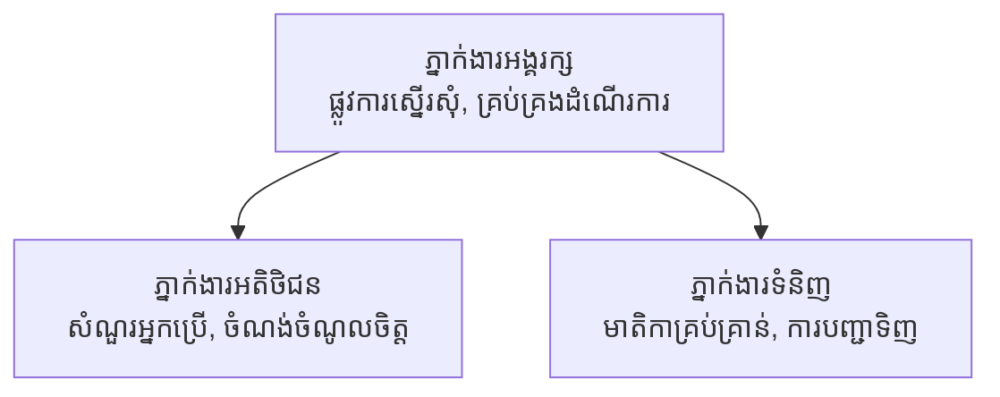

# ជំពូកទី 5: ដំណោះស្រាយ AI ម៉ូល្ទី-ភ្នាក់ងារ

**📚 코스**: [AZD សម្រាប់អ្នកចាប់ផ្តើម](../../README.md) | **⏱️ រយៈពេល**: 2-3 ម៉ោង | **⭐ កម្រិតភាពស្មុគស្មាញ**: ជាន់ខ្ពស់

---

## ទិដ្ឋភាពទូទៅ

ជំពូកនេះគ្របដណ្តប់លើលំនាំសំណង់ម៉ូល្ទី-ភ្នាក់ងារដែលមានកម្រិតខ្ពស់ ការរៀបចំភ្នាក់ងារ និងការដាក់ប្រេីប្រាស់ AI ក្នុងផលិតកម្មសម្រាប់ស្ថានភាពស្មុគស្មាញ។

> បានបញ្ជាក់តាម `azd 1.23.12` នៅខែមិនា ឆ្នាំ 2026។

## គោលបំណងរៀន

ដោយបញ្ចប់ជំពូកនេះ អ្នកនឹង៖
- យល់ពីលំនាំសំណង់ម៉ូល្ទី-ភ្នាក់ងារ
- ដាក់ប្រេីប្រព័ន្ធភ្នាក់ងារ AI ដែលបានសម្របសម្រួល
- អនុវត្តការទំនាក់ទំនងអន្តរការភ្នាក់ងារ
- បង្កើតដំណោះស្រាយម៉ូល្ទី-ភ្នាក់ងារដែលស្រាលសម្រាប់ផលិតកម្ម

---

## 📚 មេរៀន

| # | មេរៀន | ការពិពណ៌នា | ពេលវេលា |
|---|--------|-------------|-----------|
| 1 | [ដំណោះស្រាយម៉ូល្ទី-ភ្នាក់ងារលក់រាយ](../../examples/retail-scenario.md) | ដំណើរការអនុវត្តបញ្ចប់ | 90 នាទី |
| 2 | [លំនាំសម្របសម្រួល](../chapter-06-pre-deployment/coordination-patterns.md) | 전략ការរៀបចំភ្នាក់ងារ | 30 នាទី |
| 3 | [ការដាក់ប្រេីក្បាល ARM Template](../../examples/retail-multiagent-arm-template/README.md) | ដាក់ប្រេីក្នុងមួយចុច | 30 នាទី |

---

## 🚀 ចាប់ផ្តើមរហ័ស

```bash
# ជម្រើស 1: ចាក់ផ្សាយពីទំព័រគំរូ
azd init --template agent-openai-python-prompty
azd up

# ជម្រើស 2: ចាក់ផ្សាយពីឯកសារតំណាងភ្នាក់ងារ (តម្រូវការ​បន្ថែម azure.ai.agents)
azd extension install azure.ai.agents
azd ai agent init -m agent-manifest.yaml
azd up
```

> **របៀបណា?** ប្រើ `azd init --template` ដើម្បីចាប់ផ្តើមពីគំរូដែលមានស្រាប់។ ប្រើ `azd ai agent init` នៅពេលអ្នកមាន manifest ភ្នាក់ងាររបស់អ្នក។ មើល [ឯកសារយោង AZD AI CLI](../chapter-08-production/production-ai-practices.md#azd-ai-cli-commands-and-extensions) សម្រាប់ព្រឹត្តិប័ត្រពេញលេញ។

---

## 🤖 សំណង់ម៉ូល្ទី-ភ្នាក់ងារ


---

## 🎯 ដំណោះស្រាយពិសេស៖ ម៉ូល្ទី-ភ្នាក់ងារលក់រាយ

[ដំណោះស្រាយម៉ូល្ទី-ភ្នាក់ងារលក់រាយ](../../examples/retail-scenario.md) បង្ហាញ៖

- **ភ្នាក់ងារអតិថិជន**: គ្រប់គ្រងការប្រាស្រ័យទាក់ទងនិងចំណាប់អារម្មណ៍របស់អ្នកប្រើប្រាស់
- **ភ្នាក់ងារទំនិញ**: គ្រប់គ្រងគ្រឿងសង្ហារិមនិងដំណើរការការបញ្ជាទិញ
- **អ្នករៀបចំរឿង**: សម្របសម្រួលរវាងភ្នាក់ងារ
- **ជំនួយចងចាំរួម**: គ្រប់គ្រងបរិបទរវាងភ្នាក់ងារ

### សេវាកម្មដែលប្រើប្រេី

| សេវាកម្ម | គោលបំណង |
|-----------|-----------|
| Microsoft Foundry Models | ការយល់ដឹងភាសា |
| Azure AI Search | កាតាឡុកផលិតផល |
| Cosmos DB | ស្ថានភាព និងចងចាំភ្នាក់ងារ |
| Container Apps | ការអាស្រ័យភ្នាក់ងារ |
| Application Insights | ការតាមដាន |

---

## 🔗 នាំទិស

| ទិសដៅ | ជំពូក |
|---------|---------|
| **មុន** | [ជំពូកទី 4: រចនាសម្ព័ន្ធ](../chapter-04-infrastructure/README.md) |
| **បន្ទាប់** | [ជំពូកទី 6: មុនដាក់ប្រេី](../chapter-06-pre-deployment/README.md) |

---

## 📖 ឯកសារពាក់ព័ន្ធ

- [មគ្គុទេសក៍ភ្នាក់ងារ AI](../chapter-02-ai-development/agents.md)
- [ការអនុវត្ត AI ក្នុងផលិតកម្ម](../chapter-08-production/production-ai-practices.md)
- [ការដោះស្រាយបញ្ហា AI](../chapter-07-troubleshooting/ai-troubleshooting.md)

---

<!-- CO-OP TRANSLATOR DISCLAIMER START -->
**សេចក្តីដាក់ក្តីយោបល់**៖  
ឯកសារនេះត្រូវបានបំរែបំរួលជាភាសាខ្មែរដោយប្រើសេវាកម្មបំរើការបកប្រែ AI [Co-op Translator](https://github.com/Azure/co-op-translator)។ ខណៈពេលយើងខិតខំនឹងរក្សាភាពត្រឹមត្រូវ សូមយល់ដឹងថាការបកប្រែដោយស្វ័យប្រវត្តិកើតមានកំហុសឬការខ្វះខាតខ្លះៗ។ ឯកសារដើមក្នុងភាសាមាតុភាគគួរត្រូវបានគេចាត់ទុកជាប្រភពដែលមានអំណាចបំផុត។ សម្រាប់ព័ត៌មានសំខាន់ សូមអនុម័តការបកប្រែដោយអ្នកជំនាញមនុស្ស។ យើងមិនទទួលខុសត្រូវចំពោះការយល់ច្រឡំ ឬការបកស្រាយខុសពីការប្រើប្រាស់ការបកប្រែនេះឡើយ។
<!-- CO-OP TRANSLATOR DISCLAIMER END -->