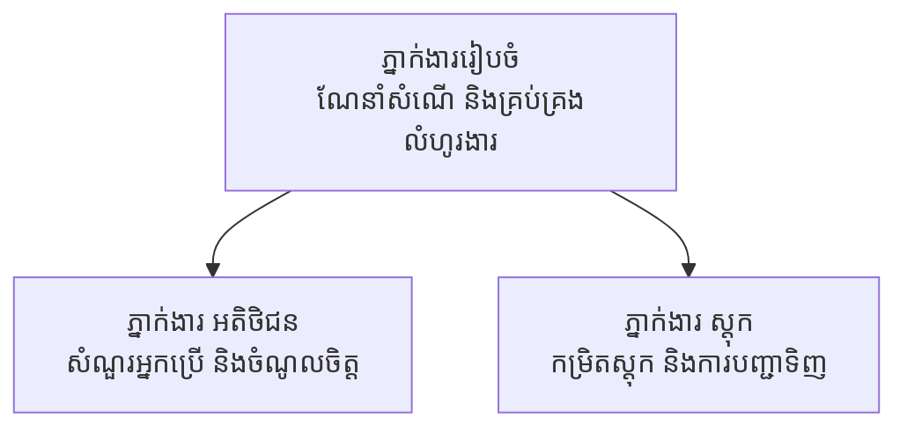

# ជំពូក 5: ដំណោះស្រាយ AI សម្រាប់ប្រព័ន្ធភ្នាក់ងារច្រើន

**📚 វគ្គ**: [AZD សម្រាប់អ្នកថ្មី](../../README.md) | **⏱️ រយៈពេល**: 2-3 ម៉ោង | **⭐ ស្មុគស្មាញ**: កម្រិតខ្ពស់

---

## សេចក្ដីសង្ខេบ

ជំពូកនេះគ្របដណ្តបទិដ្ឋការលំដាប់ខ្ពស់នៃលំនាំស្ថាបត្យកម្មប្រព័ន្ធភ្នាក់ងារច្រើន ការរៀបចំភ្នាក់ងារ និងការដាក់ពង្រឹង AI សម្រាប់ការប្រតិបត្តិដែលអាចប្រើបានក្នុងផលិតកម្មសម្រាប់សេណារីយ៉ូសន្ធិសន្លប់។

> បានផ្ទៀងផ្ទាត់តាម `azd 1.25.6` ខែមិថុនា 2026។

## គោលបំណងការសិក្សា

ដោយបញ្ចប់ជំពូកនេះ អ្នកនឹង:
- យល់ពីលំនាំស្ថាបត្យកម្មសម្រាប់ប្រព័ន្ធភ្នាក់ងារច្រើន
- ចាក់តម្រៀបប្រព័ន្ធភ្នាក់ងារ AI ដែលសហការគ្នា
- អនុវត្តការទំនាក់ទំនងរវាងភ្នាក់ងារ
- បង្កើតដំណោះស្រាយប្រព័ន្ធភ្នាក់ងារច្រើនដែលប្រើបាននៅក្នុងផលិតកម្ម

---

## 📚 មេរៀន

| # | មេរៀន | សេចក្ដីពិពណ៌នា | ពេលវេលា |
|---|--------|-------------|------|
| 1 | [មូលដ្ឋានភ្នាក់ងារច្រើន](multi-agent-basics.md) | អនុវត្តជាក់ស្តែង៖ ចាក់តម្លើងកម្មវិធីប្រព័ន្ធភ្នាក់ងារច្រើនដែលដំណើរការបានជាមួយ `azd up` | 45 នាទី |
| 2 | [លំនាំសម្របសម្រួល](../chapter-06-pre-deployment/coordination-patterns.md) | យុទ្ធសាស្រ្តរៀបចំភ្នាក់ងារ (បន្តនៅ ជំពូក 6) | 30 នាទី |
| 3 | [ការដាក់ចេញដោយពុម្ព ARM](../../examples/retail-multiagent-arm-template/README.md) | ឧទាហរណ៍ដាក់ចេញដោយចុចមួយដង | 30 នាទី |

> **ចាប់ផ្តើមពីមេរៀន 1។** វាគឺជាមេរៀនតែមួយដែលអាចអនុវត្តបានពេញលេញ និងដាក់ចេញបាននៅក្នុងជំពូកនេះ។ មេរៀន 2 ស្ថិតនៅក្នុង ជំពូក 6 (ត្រូវបានចែករំលែកជាមួយការធ្វើផែនការមុនការដាក់ចេញ), និង [Retail Multi-Agent Solution](../../examples/retail-scenario.md) គឺជាគំរូស្ថាបត្យកម្ម — ឯកសារយោងការរចនា មិនមែនជា​ពុម្ពបញ្ជាពីមួយប៉ុណ្ណោះ។

---

## 🚀 ចាប់ផ្តើមឆាប់

```bash
# ជម្រើស 1: ដាក់ដំណើរការ​ពីគំរូ
azd init --template agent-openai-python-prompty
azd up

# ជម្រើស 2: ដាក់ដំណើរការ​ពីឯកសារពិពណ៌នាភ្នាក់ងារ (ទាមទារ កម្មវិធីបន្ថែម azure.ai.agents)
azd extension install azure.ai.agents
azd ai agent init -m agent-manifest.yaml
azd up
```

> **យុទ្ធសាស្រ្តណាដែលគួរប្រើ?** ប្រើ `azd init --template` ដើម្បីចាប់ពីគំរូដែលដំណើរការបាន។ ប្រើ `azd ai agent init` នៅពេលដែលអ្នកមាន manifest ភ្នាក់ងាររបស់អ្នកផ្ទាល់។ សូមមើល [AZD AI CLI reference](../chapter-08-production/production-ai-practices.md#azd-ai-cli-commands-and-extensions) សម្រាប់ព័ត៌មានលម្អិត។

---

## 🤖 រចនាសម្ព័ន្ធប្រព័ន្ធភ្នាក់ងារច្រើន



---

## 🎯 ដំណោះស្រាយពិសេស៖ ដំណោះស្រាយពាណិជ្ជកម្មពហុភ្នាក់ងារ

ករណីសម្រាប់ [ដំណោះស្រាយពាណិជ្ជកម្មពហុភ្នាក់ងារ](../../examples/retail-scenario.md) បង្ហាញ៖

- **ភ្នាក់ងារអតិថិជន**: គ្រប់គ្រងការទំនាក់ទំនងរវាងអ្នកប្រើ និងចំណង់ចំណូលចិត្ត
- **ភ្នាក់ងារសារពើភ័ណ្ឌ**: គ្រប់គ្រងស្តុក និងដំណើរការការបញ្ជាទិញ
- **អ្នកសម្របសម្រួល (Orchestrator)**: សម្របសម្រួលរវាងភ្នាក់ងារ
- **ចងចាំរួម**: ការគ្រប់គ្រងបរិបទចែករំលែករវាងភ្នាក់ងារ

### សេវាកម្មដែលបានប្រើ

| សេវាកម្ម | គោលបំណង |
|---------|---------|
| Microsoft Foundry Models | ការយល់ដឹងភាសា |
| Azure AI Search | កាតាឡុកផលិតផល |
| Cosmos DB | ស្ថានភាព និងចងចាំភ្នាក់ងារ |
| Container Apps | ដាក់បង្ហោះភ្នាក់ងារ |
| Application Insights | ការតាមដាន |

---

## 🔗 ការរុករក

| ទិស | ជំពូក |
|-----------|---------|
| **មុន** | [ជំពូក 4: ហេដ្ឋារចនាសម្ព័ន្ធ](../chapter-04-infrastructure/README.md) |
| **បន្ទាប់** | [ជំពូក 6: មុនការដាក់ចេញ](../chapter-06-pre-deployment/README.md) |

---

## 📖 ធនធានដែលទាក់ទង

- [មគ្គុទេសន៍ភ្នាក់ងារ AI](../chapter-02-ai-development/agents.md)
- [អនុវត្ត AI សម្រាប់ផលិតកម្ម](../chapter-08-production/production-ai-practices.md)
- [ដំណោះស្រាយបញ្ហា AI](../chapter-07-troubleshooting/ai-troubleshooting.md)

---

<!-- CO-OP TRANSLATOR DISCLAIMER START -->
**ការបដិសេធ**:
ឯកសារនេះត្រូវបានបម្លែងភាសា ដោយប្រើសេវាបម្លែងភាសា AI [Co-op Translator](https://github.com/Azure/co-op-translator)។ ទោះយើងខ្ញុំមានក្តីប្រាថ្នាឱ្យបានច្បាស់លាស់ តែសូមយល់ដឹងថាការបម្លែងដោយស្វ័យប្រវត្តិក៏អាចមានកំហុសឬភាពមិនត្រឹមត្រូវ។ ឯកសារដើមជាភាសាទីតាំងគួរត្រូវបានគេប្រើជាប្រភពច្បាស់លាស់។ សម្រាប់ព័ត៌មានសំខាន់ៗ សូមណែនាំឱ្យប្រើប្រាស់ការប្រែដោយមនុស្សជំនាញ។ យើងខ្ញុំមិនទទួលខុសត្រូវចំពោះការយល់ច្រឡំ ឬការបកស្រាយខុសបន្ទាប់ពីការប្រើប្រាស់ការបម្លែងនេះនោះទេ។
<!-- CO-OP TRANSLATOR DISCLAIMER END -->