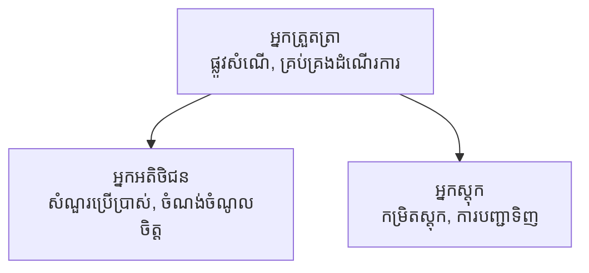

# មេរៀនទី 5៖ ដំណោះស្រាយ AI ច្រើនភ្នាក់ងារ

**📚 វគ្គបណ្ដុះបណ្ដាល**: [AZD សម្រាប់អ្នកចាប់ផ្តើម](../../README.md) | **⏱️ រយៈពេល**: 2-3 ម៉ោង | **⭐ កម្រិតភាពចម្លងច្រឡំ**: ខ្ពស់

---

## ទិដ្ឋភាពទូទៅ

មេរៀននេះគ្របដណ្តប់លើរៀបចំស្ថាបត្យកម្ម AI ច្រើនភ្នាក់ងារដែលមានកម្រិតខ្ពស់ ការរៀបចំភ្នាក់ងារ និងការដាក់បញ្ចូល AI សម្រាប់សេណារីយ៉ូស្មុគមខ្ពស់។

> បានបញ្ជាក់ដោយ `azd 1.27.1` ក្នុងខែកក្កដា ឆ្នាំ 2026។

## គោលបំណងរៀន

ដោយបញ្ចប់មេរៀននេះ អ្នកនឹង:
- យល់ដឹងអំពីលំនាំស្ថាបត្យកម្មច្រើនភ្នាក់ងារ
- ដាក់បញ្ចូលប្រព័ន្ធភ្នាក់ងារ AI ដែលសម្របសម្រួលគ្នា
- អនុវត្តការទំនាក់ទំនងពីភ្នាក់ងារទៅភ្នាក់ងារ
- បង្កើតដំណោះស្រាយច្រើនភ្នាក់ងារដែលអាចប្រើបានក្នុងផលិតកម្ម

---

## 📚 មេរៀន

| # | មេរៀន | សេចក្តីពណ៌នា | ពេលវេលា |
|---|--------|-------------|------|
| 1 | [មូលដ្ឋានច្រើនភ្នាក់ងារ](multi-agent-basics.md) | លើកដៃអនុវត្ត៖ ដាក់កម្មវិធីច្រើនភ្នាក់ងារដោយប្រើ `azd up` | 45 នាទី |
| 2 | [លំនាំសម្របសម្រួល](../chapter-06-pre-deployment/coordination-patterns.md) | អង្គការភ្នាក់ងារសម្របសម្រួល (បន្តនៅមេរៀនទី 6) | 30 នាទី |
| 3 | [ការដាក់បញ្ចូល ARMs Template](../../examples/retail-multiagent-arm-template/README.md) | ឧទាហរណ៍ដាក់បញ្ចូលមួយគ្រាប់ | 30 នាទី |

> **ចាប់ផ្តើមដោយមេរៀនទី 1។** វាជាមេរៀនតែមួយដែលមិនគួរចែកចាយអោយអនុវត្តបានពេញលេញនៅក្នុងមេរៀននេះ។ មេរៀនទី 2 ស្ថិតនៅក្នុងមេរៀនទី 6 (វាត្រូវបានចែករំលែកជាមួយការធ្វើផែនការមុនដាក់បញ្ចូល) ហើយ [ដំណោះស្រាយច្រើនភ្នាក់ងារអោយរបស់លក់រាយ](../../examples/retail-scenario.md) គឺជាគន្លងស្ថាបត្យកម្ម—ជាការប្រឹក្សាអំពីរចនាសម្ព័ន្ធ មិនមែនជាគំរូបញ្ជាបញ្ជា។

---

## 🚀 ចាប់ផ្តើមយ៉ាងរហ័ស

```bash
# ជម្រើស​ទី ១៖ ចែកចាយ​ពីពុម្ព​បែបបទ
azd init --template agent-openai-python-prompty
azd up

# ជម្រើស​ទី ២៖ ចែកចាយ​ពី ឯកសារប្រកាសភ្នាក់ងារ (តំរូវការកម្មវិធីបន្ថែម azure.ai.agents)
azd extension install azure.ai.agents
azd ai agent init -m agent-manifest.yaml
azd up
```

> **វិធីសាស្រ្តណា?** ប្រើ `azd init --template` ដើម្បីចាប់ផ្តើមពីគំរូដែលធ្វើការបាន។ ប្រើ `azd ai agent init` នៅពេលអ្នកមានបញ្ជីភ្នាក់ងារផ្ទាល់ខ្លួន។ មើល [យោង AZD AI CLI](../chapter-08-production/production-ai-practices.md#azd-ai-cli-commands-and-extensions) សម្រាប់ព័ត៌មានលម្អិតពេញលេញ។

---

## 🤖 ស្ថាបត្យកម្មច្រើនភ្នាក់ងារ



---

## 🎯 ដំណោះស្រាយលេចធ្លោ៖ ច្រើនភ្នាក់ងារអោយរបស់លក់រាយ

[ដំណោះស្រាយច្រើនភ្នាក់ងារអោយរបស់លក់រាយ](../../examples/retail-scenario.md) បង្ហាញពី៖

- **ភ្នាក់ងារអតិថិជន**: គ្រប់គ្រងការទំនាក់ទំនងនិងចំណូលចិត្តរបស់អ្នកប្រើ
- **ភ្នាក់ងារពិសេសរបស់ស្តុក**: គ្រប់គ្រងស្តុក និងដំណើរការបញ្ជាទិញ
- **អ្នកសម្របសម្រួល**: សម្របសម្រួលពីរាងកាយភ្នាក់ងារទាំងអស់
- **អនុស្សរណៈច្រោះចូលរួម**: គ្រប់គ្រងបរិបទរវាងភ្នាក់ងារជាច្រើន

### សេវាកម្មដែលបានប្រើ

| សេវាកម្ម | គោលបំណង |
|---------|---------|
| ម៉ូដែល Microsoft Foundry | ការយល់ដឹងភាសា |
| ស្វែងរក Azure AI | បញ្ជីផលិតផល |
| Cosmos DB | ស្ថានភាពនិងអនុស្សរណៈភ្នាក់ងារ |
| កម្មវិធី Container Apps | ការផ្ទុកភ្នាក់ងារ |
| Application Insights | ការត្រួតពិនិត្យ |

---

## 🔗 ជំនួយចរចារ

| ទិសដៅ | មេរៀន |
|-----------|---------|
| **មុននេះ** | [មេរៀនទី 4៖ វិទ្យាស្ថាន](../chapter-04-infrastructure/README.md) |
| **បន្ទាប់** | [មេរៀនទី 6៖ មុនដាក់បញ្ចូល](../chapter-06-pre-deployment/README.md) |

---

## 📖 ប្រភពដែលពាក់ព័ន្ធ

- [មគ្គុទេសក៍ភ្នាក់ងារ AI](../chapter-02-ai-development/agents.md)
- [ការអនុវត្ត AI ក្នុងផលិតកម្ម](../chapter-08-production/production-ai-practices.md)
- [ការដោះស្រាយបញ្ហា AI](../chapter-07-troubleshooting/ai-troubleshooting.md)

---

<!-- CO-OP TRANSLATOR DISCLAIMER START -->
**ការបដិសេធ**:
ឯកសារនេះត្រូវបានបម្លែងភាសា ដោយប្រើសេវាបម្លែងភាសា AI [Co-op Translator](https://github.com/Azure/co-op-translator)។ ទោះយើងខ្ញុំមានក្តីប្រាថ្នាឱ្យបានច្បាស់លាស់ តែសូមយល់ដឹងថាការបម្លែងដោយស្វ័យប្រវត្តិក៏អាចមានកំហុសឬភាពមិនត្រឹមត្រូវ។ ឯកសារដើមជាភាសាទីតាំងគួរត្រូវបានគេប្រើជាប្រភពច្បាស់លាស់។ សម្រាប់ព័ត៌មានសំខាន់ៗ សូមណែនាំឱ្យប្រើប្រាស់ការប្រែដោយមនុស្សជំនាញ។ យើងខ្ញុំមិនទទួលខុសត្រូវចំពោះការយល់ច្រឡំ ឬការបកស្រាយខុសបន្ទាប់ពីការប្រើប្រាស់ការបម្លែងនេះនោះទេ។
<!-- CO-OP TRANSLATOR DISCLAIMER END -->