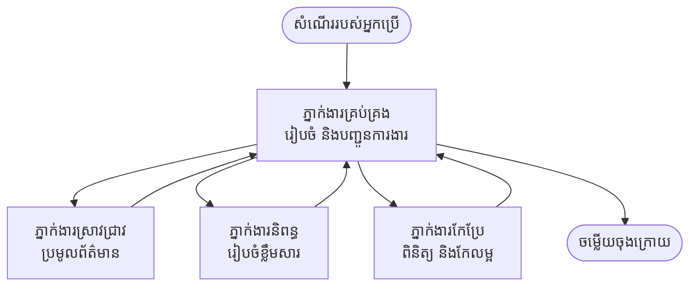

# មូលដ្ឋាន Multi-Agent - ដាក់ឱ្យដំណើរការប្រព័ន្ធ AI លើកដំបូងដែលសហការគ្នា

**ការរុករកជំពូក:**
- **📚 ទំព័រមេវគ្គ**: [AZD For Beginners](../../README.md)
- **📖 ជំពូក​បច្ចុប្បន្ន**: ជំពូក 5 - ដំណោះស្រាយ Multi-Agent AI
- **⬅️ មុនមក**: [ជំពូក 4: ហេដ្ឋារចនាសម្ព័ន្ធ](../chapter-04-infrastructure/README.md)
- **➡️ បន្ទាប់**: [លំនាំសម្របសម្រួល](../chapter-06-pre-deployment/coordination-patterns.md)

> បានផ្ទៀងផ្ទាត់ទៅតាម `azd 1.25.6` នៅខែមិថុនា 2026។

## ការណែនាំ

នៅក្នុងជំពូកមុនៗ អ្នកបានដាក់ដំណើរការកម្មវិធីតែមួយ—and នៅក្នុងជំពូក 2 អ្នកបានដាក់ដំណើរការភ្នាក់ងារ AI តែមួយ។ មេរៀននេះនាំអ្នកទៅជំហ៊ានបន្ទាប់៖ ដាក់ឱ្យដំណើរការប្រព័ន្ធ **ច្រើនភ្នាក់ងារ**, ដែលភ្នាក់ងារជំនាញជាច្រើនធ្វើការសហគ្នាដើម្បីដោះស្រាយបញ្ហាដែលភ្នាក់ងារតែមួយមិនអាចធ្វើបានល្អដោយខ្លួនឯង។

ដំណឹងល្អសម្រាប់អ្នកចាប់ផ្ដើម៖ **អ្នកមិនត្រូវការបញ្ជារថ្មីទេ។** ដំណោះស្រាយច្រើនភ្នាក់ងារនៅតែជាប្រព័ន្ធ azd មួយ។ អ្នកនឹង `azd init`, `azd up`, សាកល្បង, និង `azd down`—ជាច្រកប្រតិបត្តិការ​ដែលអ្នកបានស្គាល់រួច។ អ្វីដែលប្រែប្រួលគឺ *រាង* នៃកម្មវិធីផ្នែកក្នុង។

## គោលដៅការសិក្សា

នៅចុងមេរៀននេះ អ្នកនឹងមានសមត្ថភាពក្នុងការបាន:
- យល់ថា "multi-agent" មានន័យអ្វី និងពេលណាវាមានតំលៃទ្វេដងនឹងភាពស្មុគស្មាញបន្ថែម
- ស្គាល់តួនាទីទូទៅនៅក្នុងប្រព័ន្ធច្រើនភ្នាក់ងារ (អ្នកសម្របសម្រួល + ភ្នាក់ងារជំនាញ)
- ដាក់ឱ្យដំណើរការទម្រង់សំណុំមួយដែលធ្វើការ Multi-Agent តាម `azd up`
- យល់ពីធនធាន Azure ដែលគាំទ្រប្រព័ន្ធច្រើនភ្នាក់ងារ
- ដឹងវិធីផ្ទៀងផ្ទាត់, ប្ដូរ, និងលុបចោលដំណោះស្រាយយ៉ាងសុវត្ថិភាព

## លទ្ធផលការសិក្សា

បន្ទាប់ពីបញ្ចប់មេរៀននេះ អ្នកសូមអាច៖
- ពន្យល់ពីភាពខុសគ្នារវាងភ្នាក់ងារតែមួយ និងប្រព័ន្ធច្រើនភ្នាក់ងារ
- ជ្រើសរើសរវាងភ្នាក់ងារតែមួយដែលមានឧបករណ៍ និងការរចនាប្រព័ន្ធច្រើនភ្នាក់ងារធម្មតា
- ដាក់ឱ្យដំណើរការ និងសាកល្បងទម្រង់ multi-agent ពីដើមចុងជាមួយ azd
- សម្គាល់ថាភ្នាក់ងារមួយៗដំណើរការ​នៅកន្លែងណា និងពួកគេចែករំលែកការប្រាស្រ័យទាក់ទងបែបណា
- សម្អាតធនធានទាំងអស់ដើម្បីជៀសវាងការចំណាយជាបន្ត

---

## តើប្រព័ន្ធ Multi-Agent ជាអ្វី?

ភ្នាក់ងារ AI តែមួយគឺជាម៉ូដែលមួយដែលមានសំណុំការណែនាំមួយ និង (ជាជម្រើស) មួយចំនួននៃឧបករណ៍។ វាធ្វើការល្អសម្រាប់ភារកិច្ចដែលមានចំណុចមួយចំនួន។ ប៉ុន្តែពេលភារកិច្ចកើនឡើង—ស្រាវជ្រាវ, បន្តសរសេរ, កែប្រែ, បញ្ជាក់ពិត—ការបង្ហាតអ្វីគ្រប់យ៉ាងចូលទៅក្នុង prompt តែមួយធ្វើឲ្យភ្នាក់ងារ ងាយយឺត, ខុសបានងាយ, និងអសិក្សារលំបាកក្នុងការបញ្ឆោតបញ្ហា។

ប្រព័ន្ធ **ច្រើនភ្នាក់ងារ** បំបែកកិច្ចការ​ជា​អ្នកជំនាញ​ដែលនីមួយៗធ្វើការងារមួយឲ្យបានល្អ, ហើយមានអ្នកសម្របសម្រួលធ្វើការសម្របសម្រួល៖



### តួនាទីពីរ​ដែលអ្នកនឹងឃើញជានិច្ច

| តួនាទី | ការងារ | ឧទាហរណ៍ |
|------|-----|---------|
| **អ្នកសម្របសម្រួល** | សម្រេច *អ្វីដែលកើតឡើងបន្ទាប់* និងផ្ទុកការងាររវាងភ្នាក់ងារ | "ចាប់ផ្តើមស្រាវជ្រាវ, បន្ទាប់សរសេរ, បន្ទាប់កែសម្រួល" |
| **អ្នកជំនាញ** | ធ្វើការងារមួយយ៉ាងផ្តោត និងបញ្ចូនលទ្ធផល | «អ្នកស្រាវជ្រាវ» ដែលគ្រាន់តែប្រមូលព័ត៌មាននិងការពិត |

### តើអ្នកពិតជា​ត្រូវការភ្នាក់ងារច្រើនទេ?

ចាប់ផ្ដើមពីរឿងសាមញ្ញ។ ប្រើ multi-agent **តែ** នៅពេលក្នុងចំណោមខាងក្រោម មានភាពត្រឹមត្រូវ:

- ✅ ភារកិច្ចមាន **ជំហ៊ានច្បាស់លាស់** ដែលទទួលបានអត្ថប្រយោជន៍ពីការណែនាំខុសគ្នា (ស្រាវជ្រាវ ទល់នឹង សរសេរ ទល់នឹង សង្កេត)
- ✅ អ្នកចង់ឲ្យភ្នាក់ងារជំនាញដំណើរការឡើង **ជាសមਕੇក (in parallel)** ដើម្បីសន្សំពេល
- ✅ ជំហ៊ានផ្សេងៗត្រូវការទិន្នន័យ ឬឧបករណ៍ **ផ្សេងគ្នា**
- ✅ អ្នកត្រូវឲ្សជំហ៊ាននីមួយៗអាច **សាកល្បង និងដោះស្រាយកំហុសដោយឡែក**

បើភារកិច្ចរបស់អ្នកគ្រាន់តែជាសំនួរ-ចម្លើយតែមួយ ឬការហៅឧបករណ៍សាមញ្ញ មួយ **ភ្នាក់ងារតែមួយជាមួយឧបករណ៍** (ជំពូក 2) ងាយស្រួល, ថោកលើក, និងងាយក្នុងវិធីប្រតិបត្តិ។

> **ព័ត៌មានសម្រាប់អ្នកចាប់ផ្ដើម៖** "ភ្នាក់ងារច្រើន" មិនមែនជា "ល្អជាង" ទេ។ ភ្នាក់ងារមួយនីមួយៗបន្ថែមពេលយូរ, ការចំណាយ, និងរបស់ថ្មីៗដែលត្រូវតាមដាន។ បន្ថែមភ្នាក់ងារតែពេលបញ្ហា​ចែកឡើងជាផ្នែកច្បាស់លាស់។

---

## របៀបពីរ​ក្នុងការសាងសង់ Multi-Agent លើ Azure

| ជម្រើស | វាជាអ្វី | ល្អសម្រាប់ |
|----------|-----------|----------|
| **ភ្នាក់ងារតែមួយ + ឧបករណ៍** | ភ្នាក់ងារ Foundry មួយដែលហៅ functions/tools | កម្មវិធីថាមពលសាមញ្ញ, ចាប់ផ្ដើមបានរហ័ស |
| **ភ្នាក់ងារច្រើនដែលសម្របសម្រួលគ្នា** | ភ្នាក់ងារជាច្រើនដែលមានអ្នកសម្របសម្រួល | ជំហ៊ានច្បាស់, ការងារជាសមខ, ជំនាញពិសេស |

មេរៀននេះផ្តោតលើវិធីទីពីរ ដោយប្រើ **ទំព័រសំណុំរួចរាល់**, ដូច្នេះអ្នកអាចមើលឃើញប្រព័ន្ធ multi-agent ពិតជាដំណើរការមុនពេលអ្នកសាងសង់របស់អ្នកឯង។

---

## លំហាត់អនុវត្ត: ដាក់ឱ្យដំណើរការកម្មវិធី Multi-Agent ដែលដំណើរការ​បាន

យើងនឹងដាក់ឱ្យដំណើរការ **Contoso Creative Writer**, គំរូផ្លូវការរបស់ Azure ដែលប្រើភ្នាក់ងារច្រើន (អ្នកស្រាវជ្រាវ, អ្នកសរសេ, អ្នកកែសម្រួល) សម្របសម្រួលគ្នាដើម្បីផលិតអត្ថបទ។ វាជាកម្មវិធី Multi-Agent ដំបូងដ៏ល្អ ពីព្រោះតួនាទីងាយយល់។

### ជំហ៊ាន 1: ចាប់ផ្ដើមសំណុំទំព័រ

```bash
# បង្កើតថតធ្វើការ
mkdir creative-writer && cd creative-writer

# ចាប់ផ្ដើមពីគំរូផ្លូវការសម្រាប់ភ្នាក់ងារច្រើន
azd init --template contoso-creative-writer
```

> អ្នកអាចរុករកទំព័រសំណុំបែបបទ multi-agent បន្ថែមនៅពេលណាមួយក្នុង [Awesome AZD AI gallery](https://azure.github.io/awesome-azd/?tags=ai)。 ជម្រើសសមស្របសម្រាប់អ្នកចាប់ផ្ដើមផ្សេងទៀតរួមមាន `get-started-with-ai-agents` និង `azure-ai-travel-agents`។

### ជំហ៊ាន 2: ផ្ទៀងផ្ទាត់អត្តសញ្ញាណ

```bash
# ចាំបាច់សម្រាប់សំណុំដំណើរការ azd
azd auth login
```

### ជំហ៊ាន 3: បង្កើតបរិយាកាស

```bash
azd env new dev
```

### ជំហ៊ាន 4: មើលមុន បន្ទាប់ដាក់ឱ្យដំណើរ

```bash
# មើលថាអ្វីដែលនឹងត្រូវបានបង្កើត មុននឹងចំណាយអ្វីៗ (ណែនាំ)
azd provision --preview

# ផ្គត់ផ្គង់ហេដ្ឋារចនាសម្ព័ន្ធ និងដាក់ឱ្យភ្នាក់ងារទាំងអស់ដំណើរការ ក្នុងជំហានតែមួយ
azd up
```

`azd up` នឹងស្នើឲ្យអ្នកជ្រើស subscription និង region បន្ទាប់មករៀបចំធនធាន Azure និងដាក់កម្មវិធីឲ្យដំណើរ។ ការដាក់ដំណើរការ AI អាចចំណាយពេលយូរជាងកម្មវិធីវេបសាយអសាមញ្ញ—បើអ្នកកំពុងដាក់ម៉ូដែលធំៗ អ្នកអាចពង្រីកពេលរងចាំដាក់ដំណើរ៖

```bash
azd deploy --timeout 1800
```

> **យកចិត្តទុកដាក់អំពីការចំណាយ និងសមត្ថភាព:** កម្មវិធី multi-agent ដាក់ម៉ូដែល AI ដែលប្រើកូតាហ្ស៊ី និងបណ្តាលឲ្យមានចំណាយ។ បើ `azd up` បរាជ័យដោយសារកូតាហ្ស៊ីម៉ូដែល សូមមើល [AI Troubleshooting](../chapter-07-troubleshooting/ai-troubleshooting.md) សម្រាប់ដោះស្រាយតំបន់និងកូតាហ្ស៊ី ហើយជំពូក 6 [Capacity Planning](../chapter-06-pre-deployment/capacity-planning.md)។

---

## យល់ពីអ្វីដែលអ្នកបានដាក់ឱ្យដំណើរ

កម្មវិធី multi-agent ទូទៅដូចនេះ នឹងរៀបចំសំណុំធនធាន Azure ដែលផ្គូផ្គងទៅនឹងភារកិច្ចនៅក្នុង.diagram ខាងលើ៖

| ធនធាន | ហេតុអ្វីវាមាននៅទីនោះ |
|----------|----------------|
| **Microsoft Foundry / Models** | ផ្ទុកម៉ូដែលភាសាដែលភ្នាក់ងារនីមួយៗប្រើ |
| **Azure AI Search** | ផ្តល់ទិន្នន័យមូលដ្ឋានសម្រាប់ភ្នាក់ងារ 'អ្នកស្រាវជ្រាវ' ដើម្បីស្វែងរក |
| **Container Apps** (or App Service) | ផ្ទុកកូដអ្នកសម្របសម្រួល និងភ្នាក់ងារ |
| **Cosmos DB** (in some samples) | រក្សាស្ថានភាព/ចងចាំដែលចែករំលែករវាងភ្នាក់ងារ |
| **Application Insights** | តាមដានសំណើរ *ឆ្លងកាត់* ភ្នាក់ងារ ដើម្បីអ្នកអាចដោះស្រាយបញ្ហាចលនា |

### របៀបដែលភ្នាក់ងារទំនាក់ទំនងគ្នា

នៅក្នុងឧទាហរណ៍ multi-agent ច្រើនរបស់ azd, **អ្នកសម្របសម្រួលដំណើរការនៅក្នុងកូដកម្មវិធីរបស់អ្នក** (ឧទាហរណ៍ ប្រើ framework ណាមួយដូចជា Semantic Kernel ឬ Microsoft Agent Framework)។ អ្នកសម្របសម្រួលនឹងហៅភ្នាក់ងារជំនាញនីមួយៗតាមលំដាប់, ផ្ញើលទ្ធផល, ហើយប្រមូលចម្លើយចុងក្រោយ។ ភ្នាក់ងារចែករំលែកបរិបទតាមរយៈ៖

- **ការហៅ Function/ឧបករណ៍** — អ្នកសម្របសម្រួលហៅភ្នាក់ងារ​ជំនាញ ហើយទទួលលទ្ធផលវិញ
- **ចងចាំ​ដែលចែករំលែក** — ឃ្លាំងទិន្នន័យ (ភាគច្រើនជាដើម Cosmos DB) កាន់ស្ថានភាពដែលភ្នាក់ងារទាំងពីរអាចអាន
- **សារ/ព្រឹត្តិការណ៍** — សម្រាប់ការតភ្ជាប់ទាបជាងនេះ ភ្នាក់ងារទំនាក់ទំនងតាមរយៈ queue ឬ Service Bus

> **ហេតុអ្វីវាចាំបាច់សម្រាប់ការដោះស្រាយ​កំហុស:** ដោយសារវិធីសាស្រ្តនីមួយៗជាការបំបែក ផ្តល់ឲ្យ Application Insights បង្ហាញថា *ភ្នាក់ងារណា* ដែលយឺត ឬបរាជ័យ។ នេះជាមូលហេតុសំខាន់មួយដែលធ្វើឲ្យគួបដាក់កិច្ចការជាច្រើនភ្នាក់ងារ។

---

## ផ្ទៀងផ្ទាត់ការដាក់ដំណើរ

សូមបញ្ជាក់ប្រព័ន្ធថាវាដំណើរការពិតមុនសិន៖

```bash
# បង្ហាញចំណុចប្រទាក់ដែលបានដាក់ឲ្យដំណើរការ
azd show

# បើកផ្ទាំងតាមដានរបស់កម្មវិធី
azd monitor

# តាមដានកំណត់ហេតុ ប្រសិនបើមានអ្វីមើលទៅមិនប្រក្រតី
azd monitor --logs
```

បន្ទាប់មកបើក URL កម្មវិធីពី `azd show` ហើយសាកល្បងស្នើសុំដែលប្រើប្រាស់ភ្នាក់ងារទាំងអស់ (សម្រាប់ Creative Writer សូមបញ្ជាសរសេរអត្ថបទខ្លីពីប្រធានបទមួយ)។ ក្នុង Application Insights **transaction search**, អ្នកគួរមើលឃើញសំណើរត្រូវបានផ្តល់ដែកឈរ ដល់ជំហ៊ានអ្នកស្រាវជ្រាវ, អ្នកសរសេ និងអ្នកកែសម្រួល។

លក្ខខណ្ឌជោគជ័យ:
- ✅ `azd show` បញ្ជី endpoint ដែលអាចចូលដំណើរការ
- ✅ សំណើមួយបង្កើតលទ្ធផលដែលច្បាស់ថាបានឆ្លងកាត់ជាច្រើនជំហ៊ាន
- ✅ Application Insights បង្ហាញត្រេសសម្រាប់ច្រើនជំហ៊ានភ្នាក់ងារ

---

## កំណត់ប្ដូរ: បន្ថែម ឬ តម្រូវ ភ្នាក់ងារ

ដោយសារភ្នាក់ងារ​តែមួយគឺតែការណែនាំនិងឧបករណ៍ ការកែច្នៃគឺងាយស្រួល៖

1. **សូមស្វែងរកការបកស្រាយភ្នាក់ងារ** នៅក្នុងសំណុំទំព័រ (ភាគច្រើនជា `prompts/`, `agents/`, ឬ `*.prompty` ជាសំណុំឯកសារ)។
2. **កែលម្អការណែនាំរបស់ភ្នាក់ងារ** — ឧទាហរណ៍ បញ្ជាឲ្យភ្នាក់ងារកែសម្រួលអនុវត្តសីតិស្រួលច្បាស់ឬចំនួនពាក្យជាក់លាក់។
3. **ដាក់ដំណើរការជាថ្មីតែកូដប៉ុណ្ណោះ** (ហេដ្ឋារចនាសម្ព័ន្ធមិនបានផ្លាស់ប្ដូរ)៖

   ```bash
   azd deploy
   ```

ដើម្បីបន្តនិងសង់ភ្នាក់ងារពី manifest របស់អ្នក *ដោយខ្លួនឯង* សូមប្រើផ្នែកជំនួយ agent extension និងរង្វិលជីវិតពេញលេញរបស់វា៖

```bash
azd extension install azure.ai.agents
azd ai agent init -m agent-manifest.yaml
azd up
azd ai agent invoke      # សាកល្បង, ជាមួយពេលវេលាឆ្លើយតប
```

សូមមើល [ជំពូក 2: Agents](../chapter-02-ai-development/agents.md) និង [AZD AI CLI reference](../chapter-08-production/production-ai-practices.md#azd-ai-cli-commands-and-extensions) សម្រាប់រង្វិលជីវិតភ្នាក់ងារ​យ៉ាងពេញលេញ (`invoke`, `eval generate`, `optimize`, `delete`)។

---

## លុបចោល

កម្មវិធី multi-agent ដំណើរការមុខងារច្រើនដែលគឺចាយចំណូល។ សូមលុបចេញគ្រប់យ៉ាងនៅពេលអ្នកបញ្ចប់៖

```bash
azd down --force --purge
```

ប៉ារ៉ាម៉ែត្រ `--purge` ក៏យកធនធាន AI ដែលលុបក្នុងស្ថានភាព soft-deleted ផង (ដូចជា Foundry/Azure AI Services accounts) ដោយមិនឲ្យពួកវាហាមឃាត់ការដាក់ដំណើរឡើងវិញក្នុងអនាគត ឬបន្តបង្កើនចំណាយ។

---

## កំណត់សំគាល់អំពីប្រព័ន្ធ Multi-Agent ក្នុងផលិតកម្ម

[Retail Multi-Agent Solution](../../examples/retail-scenario.md) នៅក្នុងឃ្លាំងនេះគឺជាគំរូស្ថាបត្យកម្មមួយ, មិនមែនជា​ទំព័រសំណុំដែលអាចដំណើរការតែមួយបញ្ជា—វាឯកសារពិពណ៌នាថា ប្រព័ន្ធរាយលក់ក្នុងផលិតកម្ម *អាចត្រូវ* សាងសង់ដូចម្តេច (ហើយពិតប្រាកដថាការសាងសង់ពេញលេញតម្រូវឲ្យមានការខិតខំយ៉ាងច្រើន)។ ប្រើវាជាការបញ្ជាក់រចនាបថ *បន្ទាប់ពី* អ្នកបានដាក់ឱ្យដំណើរការគំរូមួយ។ សម្រាប់បញ្ហាក្នុងផលិតកម្ម (ភាពធន់ទ្រាំ, ការចំណាយ, ការត្រួតពិនិត្យ, គោលការណ៍ដឹកនាំ), បន្តទៅ [ជំពូក 8: Production AI Practices](../chapter-08-production/production-ai-practices.md)។

---

## ចំណុចសង្ខេប

- ប្រព័ន្ធ multi-agent បំបែកកិច្ចការ​រវាងអ្នកជំនាញ ដែលសម្របសម្រួលដោយអ្នកសម្របសម្រួល។
- ប្រើវាតែពេលភារកិច្ចមានជំហ៊ានច្បាស់, ការងារជាសមខ, ឬឧបករណ៍ខុសគ្នា—ផ្សេងពីនេះផ្តល់ជម្រើសសម្រាប់ភ្នាក់ងារតែមួយ។
- វិធីសាស្រ្ត azd មិនបានផ្លាស់ប្ដូរ៖ `azd init` → `azd up` → សាកល្បង → `azd down`។
- ទំព័រសំណុំពិតជាដូចជា `contoso-creative-writer` អនុញ្ញាតឱ្យអ្នកមើល និងកែច្នៃកម្មវិធី multi-agent ដែលដំណើរការបានថ្ងៃនេះ។
- ការតាមដាន Application Insights ដែលផ្លាស់ប្តូរពីភ្នាក់ងារមួយទៅមួយគឺជាអត្ថប្រយោជន៍ផ្ទាល់ខ្លួនដ៏សំខាន់មួយនៃការរចនាប្រព័ន្ធ multi-agent។

---

## 🔗 រុករក

| ទិស | មេរៀន |
|-----------|--------|
| **មុនមក** | [ជំពូក 4: ហេដ្ឋារចនាសម្ព័ន្ធ](../chapter-04-infrastructure/README.md) |
| **បន្ទាប់** | [លំនាំសម្របសម្រួល](../chapter-06-pre-deployment/coordination-patterns.md) |

## 📖 ធនធានដែលទាក់ទង

- [AI Agents Guide](../chapter-02-ai-development/agents.md)
- [Coordination Patterns](../chapter-06-pre-deployment/coordination-patterns.md)
- [Production AI Practices](../chapter-08-production/production-ai-practices.md)
- [AI Troubleshooting](../chapter-07-troubleshooting/ai-troubleshooting.md)

---

<!-- CO-OP TRANSLATOR DISCLAIMER START -->
**ការបដិសេធ**:
ឯកសារនេះត្រូវបានបម្លែងភាសា ដោយប្រើសេវាបម្លែងភាសា AI [Co-op Translator](https://github.com/Azure/co-op-translator)។ ទោះយើងខ្ញុំមានក្តីប្រាថ្នាឱ្យបានច្បាស់លាស់ តែសូមយល់ដឹងថាការបម្លែងដោយស្វ័យប្រវត្តិក៏អាចមានកំហុសឬភាពមិនត្រឹមត្រូវ។ ឯកសារដើមជាភាសាទីតាំងគួរត្រូវបានគេប្រើជាប្រភពច្បាស់លាស់។ សម្រាប់ព័ត៌មានសំខាន់ៗ សូមណែនាំឱ្យប្រើប្រាស់ការប្រែដោយមនុស្សជំនាញ។ យើងខ្ញុំមិនទទួលខុសត្រូវចំពោះការយល់ច្រឡំ ឬការបកស្រាយខុសបន្ទាប់ពីការប្រើប្រាស់ការបម្លែងនេះនោះទេ។
<!-- CO-OP TRANSLATOR DISCLAIMER END -->