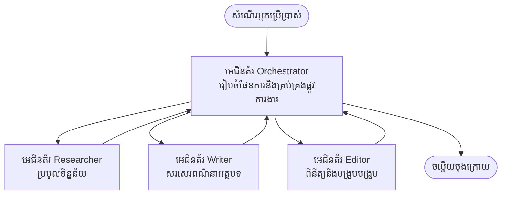

# មូលដ្ឋាន Multi-Agent - វិនិយោគប្រព័ន្ធ AI ប្រតិបត្តិការជាលក្ខណៈសម្របសម្រួលជាលើកដំបូងរបស់អ្នក

**ការរុករកជំពូក៖**
- **📚 ផ្ទះវគ្គសិក្សា**: [AZD សម្រាប់អ្នកចាប់ផ្តើម](../../README.md)
- **📖 ជំពូកបច្ចុប្បន្ន**: ជំពូក 5 - ដំណោះស្រាយ Multi-Agent AI
- **⬅️ មុនមក**: [ជំពូក 4: ហេដ្ឋារចនាសម្ព័ន្ធ](../chapter-04-infrastructure/README.md)
- **➡️ បន្ទាប់**: [លំនាំសម្របសម្រួល](../chapter-06-pre-deployment/coordination-patterns.md)

> ត្រូវបានផ្ទៀងផ្ទាត់ប្រឆាំងនឹង `azd 1.27.1` នៅខែកក្កដា ឆ្នាំ 2026។

## ទិដ្ឋភាពទូទៅ

នៅក្នុងជំពូកមុនលោកអ្នកបានដំឡើងកម្មវិធីតែមួយ—ហើយនៅជំពូក 2 លោកអ្នកបានដំឡើងភ្នាក់ងារពាក់ព័ន្ធ AI មួយ។ មេរៀននេះនាំមកជំហានបន្ទាប់៖ វិនិយោគប្រព័ន្ធ **multi-agent** ដែលបណ្ដាភ្នាក់ងារបរិសុទ្ធបំផុតធ្វើការសហការគ្នាដើម្បីដោះស្រាយបញ្ហាមួយដែលភ្នាក់ងារតែមួយមិនអាចគ្រប់គ្រាន់បែបឯណា។

ព័ត៌មានល្អសម្រាប់អ្នកចាប់ផ្តើម៖ **អ្នកមិនខ្វះបញ្ជារថ្មីទេ។** ដំណោះស្រាយ multi-agent នៅតែជាគម្រោង azd មួយ។ អ្នកនឹង `azd init`, `azd up`, សាកល្បង, និង `azd down`—ជាការប្រតិបត្តិតាមត្រឡប់ដែលអ្នកបានស្គាល់រួច។ អ្វីដែលផ្លាស់ប្តូរគឺ *រូបរាង* នៃកម្មវិធីនៅខាងក្នុង។

## គោលបំណងរៀន

នៅចុងបញ្ចប់នៃមេរៀននេះ អ្នកនឹង:
- យល់ពីអ្វីដែលមានន័យថា "multi-agent" ហើយពេលណាវាស័ទ្ធត្រូវនឹងភាពស្មុគស្មាញបន្ថែម
- សម្គាល់តួនាទីទូទៅនៅក្នុងប្រព័ន្ធ multi-agent (អ្នកសម្របសម្រួល + ផ្នែកជំនាញ)
- វិនិយោគគំរូ multi-agent មានការប្រើប្រាស់ជាក់ស្តែងដោយ `azd up`
- យល់ពីធនធាន Azure ដែលគាំទ្រកម្មវិធី multi-agent
- ដឹងពីវិធីផ្ទៀងផ្ទាត់ កែសម្រួល និងបញ្ឈប់ដំណោះស្រាយយ៉ាងមានសុវត្ថិភាព

## លទ្ធផលរៀន

បន្ទាប់ពីបញ្ចប់មេរៀននេះ អ្នកនឹងអាច:
- ពន្យល់ភាពខុសគ្នារវាងភ្នាក់ងារតែមួយ និងប្រព័ន្ធ multi-agent
- ជ្រើសរើសរវាងភ្នាក់ងារតែមួយដែលមានឧបករណ៍ និងរចនាបទ multi-agent ពិតប្រាកដមួយ
- វិនិយោគនិងសាកល្បងគំរូ multi-agent ពីដើមដល់ចុងដោយប្រើ azd
- កំណត់ថាតើភ្នាក់ងារនីមួយៗដំណើរការត្រង់ណា និងពួកគេទំនាក់ទំនងគ្នាយ៉ាងដូចម្តេច
- សម្អាតធនធានទាំងអស់ដើម្បីជៀសវាងការចំណាយបន្ត

---

## ប្រព័ន្ធ Multi-Agent ជាអ្វី?

ភ្នាក់ងារពាក់ព័ន្ធ AI តែមួយជាម៉ូដែលមួយជាមួយនឹងសំណុំបញ្ជា និង (ដោយជាជម្រើស) ឧបករណ៍ខ្លះៗ។ វាដំណើរការល្អសម្រាប់ភារកិច្ចផ្តោត។ តែពេលដែលភារកិច្ចធ្វើកើនឡើង—ស្រាវជ្រាវ រួចសរសេរ រួចកែសម្រួល រួចផ្ទៀងផ្ទាត់ភាពត្រឹមត្រូវ—ការដាក់គ្រប់យ៉ាងទៅក្នុងការស្នើសុំមួយធ្វើឲ្យភ្នាក់ងារដំណើរការយឺតថយចុះ មានភាពត្រឹមត្រូវតិច និងពិបាកសម្រាប់ដោះស្រាយបញ្ហា។

ប្រព័ន្ធ **multi-agent** បែកការងារនេះចេញជា ផ្នែកជំនាញដែលនីមួយៗធ្វើការងារតែមួយយ៉ាងល្អ ហើយត្រូវបានសម្របសម្រួលដោយអ្នកសម្របសម្រួល៖



### តួនាទីពីរដែលអ្នកនឹងឃើញជានិច្ច

| តួនាទី | ការងារ | ឧទាហរណ៍ |
|------|-----|---------|
| **អ្នកសម្របសម្រួល** | សម្រេចចិត្ត *អ្វីដែលកើតឡើងបន្ទាប់* និងផ្ញើការងាររវាងភ្នាក់ងារ | "ស្រាវជ្រាវមុន បន្ទាប់សរសេរ រួចកែសម្រួល" |
| **ផ្នែកជំនាញ** | ធ្វើការងារតែមួយផ្តោតនឹងផ្ដល់លទ្ធផល | "អ្នកស្រាវជ្រាវ" ដែលត្រឹមតែប្រមូលព័ត៌មានតែប៉ុណ្ណោះ |

### តើអ្នកត្រូវការ ភ្នាក់ងារច្រើនពិតមែនទេ?

ចាប់ផ្តើមដោយភាពសាមញ្ញ។ ប្រើ multi-agent **តែពេល**ដែលមួយក្នុងចំណោមដូចខាងក្រោមត្រូវទេ៖

- ✅ ភារកិច្ចមាន **ជំហានច្បាស់លាស់** ដែលមានអត្ថប្រយោជន៍ពីការណែនាំផ្សេងៗគ្នា (ស្រាវជ្រាវ ប្រៀបធៀប សរសេរ ពិនិត្យវិញ)
- ✅ អ្នកចង់ឲ្យអ្នកជំនាញដំណើរការជា **ក្រុមស្របពេល** ដើម្បីសន្សំសំចៃពេលវេលា
- ✅ ជំហាននីមួយៗត្រូវការឧបករណ៍ ឬប្រភពទិន្នន័យផ្សេងៗគ្នា
- ✅ អ្នកត្រូវការឲ្យនីមួយៗត្រូវបាន **ធ្វើតេស្ត និងដោះស្រាយបញ្ហាដោយឯករាជ្យ**

ប្រសិនបើភារកិច្ចរបស់អ្នកគឺសំណួរពីរបី និងឆ្លើយតបឬការហៅឧបករណ៍សាមញ្ញ **ភ្នាក់ងារតែមួយដែលមានឧបករណ៍** (ជំពូក 2) គឺសាមញ្ញ ថ្លៃថោក និងងាយស្រួលប្រើប្រាស់។

> **គន្លឹះសម្រាប់អ្នកចាប់ផ្តើម:** "ភ្នាក់ងារច្រើន" មិនមានន័យថា "ល្អជាង" ទេ។ ភ្នាក់ងារតែមួយបន្ថែមឲ្យមានភាពយឺត ការចំណាយ និងបញ្ហាថ្មីក្នុងការតាមដាន។ បន្ថែមភ្នាក់ងារតែពេលដែលបញ្ហាខាងលើចែកចាយចេញជាផ្នែកយ៉ាងច្បាស់។

---

## វិធីពីរដើម្បីសាងសង់ Multi-Agent លើ Azure

| វិធីសាស្រ្ត | វាគឺជាអ្វី | សម្រាប់អ្វីល្អបំផុត |
|----------|-----------|----------|
| **ភ្នាក់ងារតែមួយ + ឧបករណ៍** | ភ្នាក់ងារ Foundry មួយដែលហៅមុខងារឬឧបករណ៍ | ដំណើរការងាយ សម្រាប់ចាប់ផ្តើម |
| **ភ្នាក់ងារច្រើនដែលសម្របសម្រួលគ្នា** | ភ្នាក់ងារជាច្រើនជាមួយអ្នកសម្របសម្រួល | ជំហានច្បាស់ កម្មវិធីស្របពេល ការជំនាញបន្តិចបន្តួច |

មេរៀននេះផ្តោតលើវិធីទីពីរដោយប្រើ **គំរូរួចរួម** ដើម្បីឲ្យអ្នកបានមើលឃើញប្រព័ន្ធ multi-agent ពិតប្រាកដដំណើរការមុនពេលអ្នកសាងសង់របស់អ្នកផ្ទាល់។

---

## យកมือអនុវត្ត៖ វិនិយោគកម្មវិធី Multi-Agent សកម្ម

យើងនឹងវិនិយោគ **Contoso Creative Writer** គំរូអាជ្ញាធរជាផ្លូវការរបស់ Azure ដែលប្រើភ្នាក់ងារច្រើន (អ្នកស្រាវជ្រាវ អ្នកសរសេរ អ្នកកែសម្រួល) សម្របសម្រួលគ្នាដើម្បីផលិតអត្ថបទ។ វាជាកម្មវិធី multi-agent ដំបូងល្អព្រោះតួនាទីងាយស្រួលយល់។

### ជំហាន 1៖ ចាប់ផ្តើមគំរូ

```bash
# បង្កើតថតការងារ
mkdir creative-writer && cd creative-writer

# ចាប់ផ្តើមពីគំរូភ្នាក់ងារច្រើនផ្លូវការី
azd init --template contoso-creative-writer
```

> រុករកគំរូ multi-agent ច្រើនទៀតគ្រប់ពេលនៅក្នុង [ក្រុមប្រឹក្សា AZD AI ពិសេស](https://azure.github.io/awesome-azd/?tags=ai)។ ជម្រើសផ្សេងទៀតសមរម្យសម្រាប់អ្នកចាប់ផ្តើមរួមមាន `get-started-with-ai-agents` និង `azure-ai-travel-agents`។

### ជំហាន 2៖ ចុះឈ្មោះចូល

```bash
# ត្រូវការសម្រាប់ដំណើរការផ្លូវការ azd
azd auth login
```

### ជំហាន 3៖ បង្កើតបរិយាកាស

```bash
azd env new dev
```

### ជំហាន 4៖ មើលជាមុន រួចវិនិយោគ

```bash
# មើលអ្វីដែលនឹងត្រូវបានបង្កើតមុនពេលចំណាយអ្វីមួយ (ណែនាំ)
azd provision --preview

# ផ្តល់បណ្ដាញគ្រឹះនិងដាក់បញ្ជូនភ្នាក់ងារទាំងអស់ក្នុងជំហានតែមួយ
azd up
```

`azd up` នឹងស្នើសុំការជាវតំបន់ បន្ទាប់មករៀបចំធនធាន Azure និងវិនិយោគកម្មវិធី។ ការវិនិយោគ AI អាចយឺតជាងកម្មវិធីវេបសាមញ្ញមួយ—បើអ្នកវិនិយោគម៉ូដែលធំ អ្នកអាចបន្ថែមពេលវេលាទុកសម្រាប់វិនិយោគបាន៖

```bash
azd deploy --timeout 1800
```

> **ចំណាំអំពីចំណាយ និងសមត្ថភាព:** កម្មវិធី multi-agent វិនិយោគម៉ូដែល AI ដែលប្រើប្រាស់គូតា និងបង្កការចំណាយ។ ប្រសិនបើ `azd up` ខកខានដោយសារគូតាម៉ូដែល សូមមើល [ការដោះស្រាយបញ្ហា AI](../chapter-07-troubleshooting/ai-troubleshooting.md) សម្រាប់ការជួសជុលតំបន់ និងគូតា និងជំពូក 6 [ការធ្វើផែនការសមត្ថភាព](../chapter-06-pre-deployment/capacity-planning.md)។

---

## យល់អំពីអ្វីដែលអ្នកបានវិនិយោគ

កម្មវិធី multi-agent ធម្មតាដូចនេះរៀបចំធនធាន Azure មួយចំនួនដែលផ្គូរផ្គងទៅនឹងភារកិច្ចនៅក្នុងគំនូសភាពខាងលើ៖

| ធនធាន | ហេតុអ្វីវានៅទីនេះ |
|----------|----------------|
| **Microsoft Foundry / ម៉ូដែល** | ជាផ្ទះម៉ូដែលភាសាដែលនិយាយដោយភ្នាក់ងារនីមួយៗ |
| **Azure AI Search** | ផ្តល់ទិន្នន័យបានគេច្រើនអ្នកស្រាវជ្រាវកំពុងស្វែងរក |
| **Container Apps** (ឬ App Service) | ផ្ទះអ្នកសម្របសម្រួល និងកូដភ្នាក់ងារ |
| **Cosmos DB** (នៅក្នុងគំរូខ្លះ) | រក្សាទុកស្ថានភាព/អង្គចងចាំដែលចែករំលែករវាងភ្នាក់ងារ |
| **Application Insights** | តាមដានសំណើរយ៉ាងទូលំទូលាយរវាងភ្នាក់ងារ ដើម្បីអ្នកអាចដោះស្រាយបញ្ហាបាន |

### របៀបដែលភ្នាក់ងារនិយាយគ្នា

នៅក្នុងគំរូ multi-agent ច្រើនរបស់ azd, **អ្នកសម្របសម្រួលដំណើរការនៅក្នុងកូដកម្មវិធីរបស់អ្នក** (ឧទាហរណ៍ ប្រើស៊ុម Semantic Kernel ឬ Microsoft Agent Framework)។ អ្នកសម្របសម្រួលហៅភ្នាក់ងារជំនាញម្នាក់ទៅម្នាក់ បញ្ជូនលទ្ធផល ហើយប្រមូលចម្លើយចុងក្រោយ។ ភ្នាក់ងារចែករំលែកបរិបទតាមរយៈ៖

- **ហៅមុខងារ/ឧបករណ៍** — អ្នកសម្របសម្រួលហៅភ្នាក់ងារជំនាញ និងទទួលលទ្ធផលត្រឡប់មក
- **អង្គចងចាំចែករំលែក** — មូលដ្ឋានទិន្នន័យ(ភាគច្រើនគឺ Cosmos DB) រក្សាស្ថានភាពដែលភ្នាក់ងារពីរអាចអានបាន
- **សារ/ព្រឹត្តិការណ៍** — សម្រាប់ការតភ្ជាប់តិចតួច ជាភ្នាក់ងារទំនាក់ទំនងតាមជួរការងារ ឬ Service Bus

> **ហេតុអ្វីវាមានសារៈសំខាន់សម្រាប់ការដោះស្រាយបញ្ហា:** ព្រោះនីមួយៗជំហានត្រូវបានបំបែកចេញ Application Insights បង្ហាញអ្នក *ភ្នាក់ងារណា* ដែលយឺត ឬបរាជ័យ។ នេះជាមូលហេតុសំខាន់មួយក្នុងការចែកការងារជារវាងភ្នាក់ងារ។

---

## ផ្ទៀងផ្ទាត់ការវិនិយោគ

បញ្ជាក់ប្រព័ន្ធដំណើរការពិតមុនពេលបន្តទៅខាងមុខ៖

```bash
# បង្ហាញចំណុចចេញដែលបានចែកចាយ
azd show

# បើកផ្ទាំងត្រួតពិនិត្យកម្មវិធី
azd monitor

# តាមដានកំណត់ហេតុប្រសិនបើមានអ្វីមិនសមរម្យ
azd monitor --logs
```

បន្ទាប់មកបើក URL កម្មវិធីពី `azd show` ហើយសាកល្បងសំណើដែលប្រើប្រាស់ភ្នាក់ងារទាំងអស់ (សម្រាប់ Creative Writer សូមស្នើឲ្យវាសរសេរអត្ថបទខ្លីមួយលើប្រធានបទមួយ)។ ក្នុង Application Insights **transaction search** អ្នកគួរតែឃើញសំណើប្រែមានការចែកចាយទៅកាន់ជំហានអ្នកស្រាវជ្រាវ អ្នកសរសេរ និងអ្នកកែសម្រួល។

**លក្ខណះជោគជ័យ៖**
- ✅ `azd show` បង្ហាញឆាកដែលអាចចូលទៅបាន
- ✅ សំណើបង្កើតលទ្ធផលដែលច្បាស់លាស់ថាបានឆ្លងកាត់ជាច្រើនជំហាន
- ✅ Application Insights បង្ហាញការតាមដានសម្រាប់ជំហានភ្នាក់ងារមិនតែម្ដង

---

## ប្តូរតាមចិត្ត៖ បន្ថែមឬកែសម្រួលភ្នាក់ងារ

ព្រោះភ្នាក់ងារពិតជាគ្រាប់បញ្ជា លើសពីនេះជាមួយឧបករណ៍ ការប្តូរតាមចិត្តគឺអាចធ្វើបានងាយស្រួល៖

1. **ស្វែងរកការជ្រើសរើសភ្នាក់ងារ** ក្នុងគំរូ (ភាគច្រើនជា សៀវភៅ `prompts/`, `agents/`, ឬឯកសារ `*.prompty`)
2. **កែប្រែការណែនាំភ្នាក់ងារ** — ឧទាហរណ៍ ប្រាប់អ្នកកែសម្រួលអោយអនុវត្តត្បិតត្រូវមានសំឡេង និងចំនួនពាក្យជាក់លាក់
3. **វិនិយោគកូដម្តងទៀតតែប៉ុណ្ណោះ** (ហេដ្ឋារចនាសម្ព័ន្ធមិនផ្លាស់ប្តូរទេ):

   ```bash
   azd deploy
   ```

ដើម្បីបន្តសាងសង់អ្នកជំនាញពី manifest *ផ្ទាល់ខ្លួន* សូមប្រើភាសសម្គាល់ភ្នាក់ងារនិងរង្វង់ជីវិតពេញលេញរបស់វា៖

```bash
azd extension install azure.ai.agents
azd ai agent init -m agent-manifest.yaml
azd up
azd ai agent invoke      # សាកល្បង ជាមួយពេលវេលាចម្លើយ
```

សូមមើល [ជំពូក 2: អ្នកជំនាញ](../chapter-02-ai-development/agents.md) និង [ឯកសារជំនួយ AZD AI CLI](../chapter-08-production/production-ai-practices.md#azd-ai-cli-commands-and-extensions) សម្រាប់រង្វង់ជីវិតពេញលេញរបស់ភ្នាក់ងារ (`invoke`, `eval generate`, `optimize`, `delete`)។

---

## សម្អាត

កម្មវិធី multi-agent ប្រតិបត្តិជាសេវាកម្មគិតថ្លៃច្រើន។ សូមបញ្ឈប់គ្រប់យ៉ាងនៅពេលអ្នកបញ្ចប់៖

```bash
azd down --force --purge
```

ប៊្លាគូណ៍ `--purge` ក៏ដកអោយធនធាន AI ដែលបានលុបបំភ្លឺ (ដូចជា Foundry/គណនីសេវាកម្ម Azure AI) ដូច្នេះវានឹងមិនរារាំងការវិនិយោគវិញនៅអនាគត ឬបន្តបង្កការចំណាយ។

---

## កំណត់ចំណាំលើប្រព័ន្ធ Multi-Agent ផលិតកម្ម

[ដំណោះស្រាយ Multi-Agent លក់រាយ](../../examples/retail-scenario.md) នៅក្នុងផ្ទុកនេះ គឺជាគំរូរចនាសម្ព័ន្ធមួយ មិនមែនគំរូបញ្ជារតែមួយទេ—វាឯកសារថาวิธีសាងសង់ប្រព័ន្ធលក់រាយដល់ផលិតកម្ម (*ដោយច្បាស់ថាការសាងសង់ពេញលេញជាការខិតខំយ៉ាងខ្លាំង*)។ ប្រើវាជាគំរូរចនាប័ទ្មបន្ទាប់ពីអ្នកបានដំឡើងគំរូដែលដំណើរការនៅទីនេះរួច។ សម្រាប់បញ្ហាផលិតកម្ម (ការតស៊ូ, ចំណាយ, ការតាមដាន, អភិបាលគ្រប់គ្រង) សូមបន្តអាន [ជំពូក 8: អនុវត្តន៍ AI ផលិតកម្ម](../chapter-08-production/production-ai-practices.md)។

---

## សង្ខេប

- ប្រព័ន្ធ multi-agent ចែកការងារជារវាងអ្នកជំនាញ ដែលមានអ្នកសម្របសម្រួលគ្រប់គ្រង។
- ប្រើវាតែពេលដែលភារកិច្ចមានជំហានច្បាស់លាស់ ការប្រតិបត្ដិវេទមួយៗ ឬឧបករណ៍ខុសគ្នា ជាជំហាន មិនដូចណាអ្នកតែម្នាក់។
- លំនាំធ្វើការងារជាមួយ azd មិនផ្លាស់ប្តូរ៖ `azd init` → `azd up` → សាកល្បង → `azd down`។
- គំរូពិត ដូចជា `contoso-creative-writer` អនុញ្ញាតឲ្យអ្នកឃើញ និងកែសម្រួលកម្មវិធី multi-agent ដំណើរការបានថ្ងៃនេះ។
- ការតាមដាន Application Insights ឆ្លងកាត់ភ្នាក់ងារជាដំណើរការទំនាក់ទំនងគ្នាគឺជាជំនួយដ៏ធំបំផុតនៃរចនាបទ multi-agent។

---

## 🔗 រុករក

| ទិសដៅ | មេរៀន |
|-----------|--------|
| **មុនមក** | [ជំពូក 4: ហេដ្ឋារចនាសម្ព័ន្ធ](../chapter-04-infrastructure/README.md) |
| **បន្ទាប់** | [លំនាំសម្របសម្រួល](../chapter-06-pre-deployment/coordination-patterns.md) |

## 📖 ឯកសារពាក់ព័ន្ធ

- [មគ្គុទ្ទេសក៍ភ្នាក់ងារ AI](../chapter-02-ai-development/agents.md)
- [លំនាំសម្របសម្រួល](../chapter-06-pre-deployment/coordination-patterns.md)
- [អនុវត្តន៍ AI ផលិតកម្ម](../chapter-08-production/production-ai-practices.md)
- [ការដោះស្រាយបញ្ហា AI](../chapter-07-troubleshooting/ai-troubleshooting.md)

---

<!-- CO-OP TRANSLATOR DISCLAIMER START -->
**ការបដិសេធ**:
ឯកសារនេះត្រូវបានបម្លែងភាសា ដោយប្រើសេវាបម្លែងភាសា AI [Co-op Translator](https://github.com/Azure/co-op-translator)។ ទោះយើងខ្ញុំមានក្តីប្រាថ្នាឱ្យបានច្បាស់លាស់ តែសូមយល់ដឹងថាការបម្លែងដោយស្វ័យប្រវត្តិក៏អាចមានកំហុសឬភាពមិនត្រឹមត្រូវ។ ឯកសារដើមជាភាសាទីតាំងគួរត្រូវបានគេប្រើជាប្រភពច្បាស់លាស់។ សម្រាប់ព័ត៌មានសំខាន់ៗ សូមណែនាំឱ្យប្រើប្រាស់ការប្រែដោយមនុស្សជំនាញ។ យើងខ្ញុំមិនទទួលខុសត្រូវចំពោះការយល់ច្រឡំ ឬការបកស្រាយខុសបន្ទាប់ពីការប្រើប្រាស់ការបម្លែងនេះនោះទេ។
<!-- CO-OP TRANSLATOR DISCLAIMER END -->