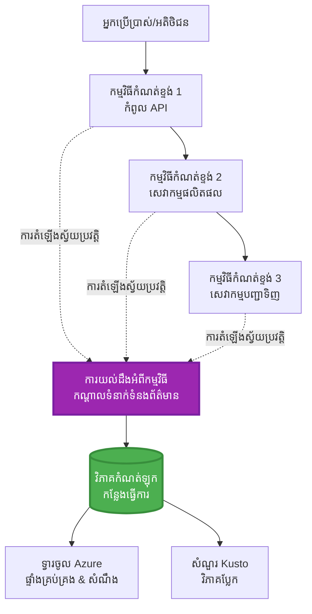
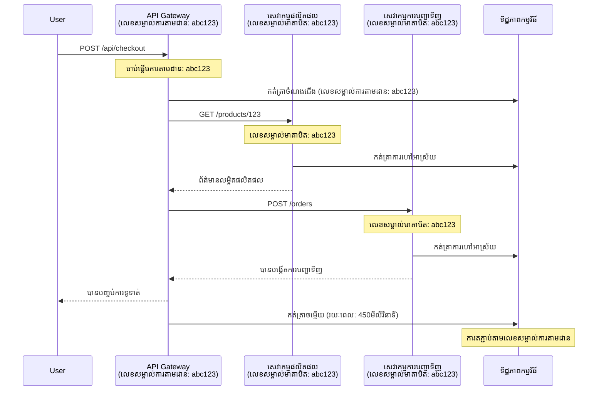

# ការរួមបញ្ចូល Application Insights ជាមួយ AZD

⏱️ **ម៉ោងកំណត់គិត**: 40-50 នាទី | 💰 **ឥទ្ធិពលថ្លៃ**: ~$5-15/ខែ | ⭐ **ភាពស្មុគស្មាញ**: មធ្យម

**📚 ផ្លូវរៀន៖**
- ← មុន៖ [ពិនិត្យមុនចេញដំណើរការ](preflight-checks.md) - ការផ្ទៀងផ្ទាត់មុនចេញដំណើរការ
- 🎯 **អ្នកនៅទីនេះ**: ការរួមបញ្ចូល Application Insights (ការត្រួតពិនិត្យ, ទិន្នន័យ telemetry, ការសំរេចបញ្ហា)
- → បន្ទាប់៖ [មគ្គុទេសក៍ចេញដំណើរការ](../chapter-04-infrastructure/deployment-guide.md) - ចេញដំណើរការទៅ Azure
- 🏠 [ផ្ទះមុខវិជ្ជា](../../README.md)

---

## អ្វីដែលអ្នកនឹងរៀន

ដោយបញ្ចប់មុខវិជ្ជានេះ អ្នកនឹងអាចៈ
- រួមបញ្ចូល **Application Insights** ទៅក្នុងគម្រោង AZD ដោយស្វ័យប្រវត្តិ
- កំណត់ **distributed tracing** សម្រាប់សេវាកម្មតូចៗ (microservices)
- អនុវត្ត **telemetry ផ្ទាល់ខ្លួន** (មាត្រដ្ឋាន, ព្រឹត្តិការណ៍, ខ្សែសង្វាក់)
- រៀបចំ **live metrics** សម្រាប់ការត្រួតពិនិត្យពេលវេលាពិត
- បង្កើត **សញ្ញា និងផ្ទាំងបង្ហាញ** ពីការចេញដំណើរការជាមួយ AZD
- សំរេចបញ្ហាផលិតកម្មជាមួយ **ការស៊ើបអង្កេត telemetry**
- បង្កើនប្រសិទ្ធភាព **ថ្លៃ និងយុទ្ធសាស្រ្ត sampling**
- ត្រួតពិនិត្យ **កម្មវិធី AI/LLM** (token, បរិវេណ, ថ្លៃ)

## ហេតុអ្វី Application Insights ជាមួយ AZD មានសារៈសំខាន់

### បញ្ហាប្រឈម៖ ការមើលឃើញផលិតកម្ម

**ដោយគ្មាន Application Insights:**
```
❌ No visibility into production behavior
❌ Manual log aggregation across services
❌ Reactive debugging (wait for customer complaints)
❌ No performance metrics
❌ Cannot trace requests across services
❌ Unknown failure rates and bottlenecks
```

**ជាមួយ Application Insights + AZD:**
```
✅ Automatic telemetry collection
✅ Centralized logs from all services
✅ Proactive issue detection
✅ End-to-end request tracing
✅ Performance metrics and insights
✅ Real-time dashboards
✅ AZD provisions everything automatically
```

**ការប្រៀបធៀប**: Application Insights គឺដូចជាកុងត្រូលការហោះហើរ «ប្រអប់ខ្មៅ» និងផ្ទាំងគ្រប់គ្រងcockpit សម្រាប់កម្មវិធីរបស់អ្នក។ អ្នកអាចមើលឃើញអ្វីៗកំពុងកើតមាននៅពេលវេលាពិត និងអាចចាក់បញ្ចាំងឡើងវិញព្រឹត្តិការណ៍ណាមួយបាន។

---

## ពិពណ៌នា ស្ថាបត្យកម្ម

### Application Insights នៅក្នុងស្ថាបត្យកម្ម AZD


### អ្វីខ្លះត្រូវបានត្រួតពិនិត្យដោយស្វ័យប្រវត្តិ

| ប្រភេទ Telemetry | អ្វីដែលវាបាញ់ប្រមូល | ករណីប្រើប្រាស់ |
|----------------|------------------|----------|
| **សំណើ HTTP** | សំណើ HTTP, កូដស្ថានភាព, រយៈពេល | ត្រួតពិនិត្យប្រសិទ្ធភាព API |
| **ខ្សែសង្វាក់** | ការហៅខាងក្រៅ (DB, API, ទីតាំងស្តុក) | កំណត់កន្លែងខ្សោយ |
| **ករណីខុស** | កំហុសដែលមិនបានគ្រប់គ្រងជាមួយ stack traces | សំរេចបញ្ហា |
| **ព្រឹត្តិការណ៍ ផ្ទាល់ខ្លួន** | ព្រឹត្តិការណ៍អាជីវកម្ម (ចុះឈ្មោះ, ទិញ) | វិភាគ និងផ្ទាំងរបាយការណ៍ |
| **មាត្រដ្ឋាន** | counters ការសម្រួល, មាត្រដ្ឋានផ្ទាល់ខ្លួន | ការធ្វើផែនការរបាយការណ៍សមត្ថភាព |
| **សំគាល់** | សារចុះបញ្ជីជាមួយភាពធ្ងន់ធ្ងរ | សំរេចបញ្ហា និងត្រួតពិនិត្យ |
| **ការចេញលេចធ្លោ** | ពិនិត្យការឡើងវិញនិងពេលវេលាការឆ្លើយតប | ត្រួតពិនិត្យ SLA |

---

## លក្ខខណ្ឌមុន

### ឧបករណ៍ត្រូវការ

```bash
# ពិនិត្យចុះដល់ Azure Developer CLI
azd version
# ✅ គ្រោងទុក៖ azd ជំនាន់ 1.0.0 ឬខ្ពស់ជាង

# ពិនិត្យចុះដល់ Azure CLI
az --version
# ✅ គ្រោងទុក៖ azure-cli 2.50.0 ឬខ្ពស់ជាង
```

### លក្ខខណ្ឌ Azure

- ចុះឈ្មោះ Azure ច្បាស់លាស់
- អាជ្ញាប័ណ្ណបង្កើត:
  - ធនធាន Application Insights
  - កន្លែងធ្វើការ Log Analytics
  - កម្មវិធី Container Apps
  - ក្រុមធនធាន

### សេចក្ដីដឹងមុន

អ្នកគួរតែបានបញ្ចប់៖
- [មូលដ្ឋាន AZD](../chapter-01-foundation/azd-basics.md) - គោលការណ៍ AZD
- [ការកំណត់](../chapter-03-configuration/configuration.md) - ការរៀបចំបរិយាកាស
- [គម្រោងដំបូង](../chapter-01-foundation/first-project.md) - ការចេញដំណើរការឆាប់រហ័ស

---

## មុខវិជ្ជា 1៖ Application Insights ដោយស្វ័យប្រវត្តិជាមួយ AZD

### AZD បង្កើត Application Insights ដូចម្តេច

AZD បង្កើត និងកំណត់ Application Insights ជាស្វ័យប្រវត្តិពេលអ្នកចេញដំណើរការ។ មកមើលរបៀបដំណើរការ។

### រចនាសម្ព័ន្ធគម្រោង

```
monitored-app/
├── azure.yaml                     # AZD configuration
├── infra/
│   ├── main.bicep                # Main infrastructure
│   ├── core/
│   │   └── monitoring.bicep      # Application Insights + Log Analytics
│   └── app/
│       └── api.bicep             # Container App with monitoring
└── src/
    ├── app.py                    # Application with telemetry
    ├── requirements.txt
    └── Dockerfile
```

---

### ជំហាន 1: កំណត់AZD (azure.yaml)

**ឯកសារ៖ `azure.yaml`**

```yaml
name: monitored-app
metadata:
  template: monitored-app@1.0.0

services:
  api:
    project: ./src
    language: python
    host: containerapp

# AZD automatically provisions monitoring!
```

**នេះគ្រប់ហើយ!** AZD នឹងបង្កើត Application Insights ពីរៀងខ្លួន។ មិនចាំបាច់បន្ថែមការកំណត់សម្រាប់ការត្រួតពិនិត្យមូលដ្ឋានទេ។

---

### ជំហាន 2: ត្រួតពិនិត្យស្ថាបត្យកម្ម (Bicep)

**ឯកសារ៖ `infra/core/monitoring.bicep`**

```bicep
param logAnalyticsName string
param applicationInsightsName string
param location string = resourceGroup().location
param tags object = {}

// Log Analytics Workspace (required for Application Insights)
resource logAnalytics 'Microsoft.OperationalInsights/workspaces@2022-10-01' = {
  name: logAnalyticsName
  location: location
  tags: tags
  properties: {
    sku: {
      name: 'PerGB2018'  // Pay-as-you-go pricing
    }
    retentionInDays: 30  // Keep logs for 30 days
    features: {
      enableLogAccessUsingOnlyResourcePermissions: true
    }
  }
}

// Application Insights
resource applicationInsights 'Microsoft.Insights/components@2020-02-02' = {
  name: applicationInsightsName
  location: location
  tags: tags
  kind: 'web'
  properties: {
    Application_Type: 'web'
    WorkspaceResourceId: logAnalytics.id
    IngestionMode: 'LogAnalytics'
    publicNetworkAccessForIngestion: 'Enabled'
    publicNetworkAccessForQuery: 'Enabled'
  }
}

// Outputs for Container Apps
output logAnalyticsWorkspaceId string = logAnalytics.id
output logAnalyticsWorkspaceName string = logAnalytics.name
output applicationInsightsConnectionString string = applicationInsights.properties.ConnectionString
output applicationInsightsInstrumentationKey string = applicationInsights.properties.InstrumentationKey
output applicationInsightsName string = applicationInsights.name
```

---

### ជំហាន 3: ភ្ជាប់ Container App ទៅ Application Insights

**ឯកសារ៖ `infra/app/api.bicep`**

```bicep
param name string
param location string
param tags object = {}
param containerAppsEnvironmentName string
param applicationInsightsConnectionString string

resource containerApp 'Microsoft.App/containerApps@2023-05-01' = {
  name: name
  location: location
  tags: tags
  properties: {
    configuration: {
      ingress: {
        external: true
        targetPort: 8000
      }
      secrets: [
        {
          name: 'appinsights-connection-string'
          value: applicationInsightsConnectionString
        }
      ]
    }
    template: {
      containers: [
        {
          name: 'api'
          image: 'myregistry.azurecr.io/api:latest'
          resources: {
            cpu: json('0.5')
            memory: '1Gi'
          }
          env: [
            {
              name: 'APPLICATIONINSIGHTS_CONNECTION_STRING'
              secretRef: 'appinsights-connection-string'
            }
            {
              name: 'APPLICATIONINSIGHTS_ENABLED'
              value: 'true'
            }
          ]
        }
      ]
    }
  }
}

output uri string = 'https://${containerApp.properties.configuration.ingress.fqdn}'
```

---

### ជំហាន 4: កូដកម្មវិធីជាមួយ Telemetry

**ឯកសារ៖ `src/app.py`**

```python
from flask import Flask, request, jsonify
from opencensus.ext.azure.log_exporter import AzureLogHandler
from opencensus.ext.azure.trace_exporter import AzureExporter
from opencensus.ext.flask.flask_middleware import FlaskMiddleware
from opencensus.trace.samplers import ProbabilitySampler
import logging
import os

app = Flask(__name__)

# ទទួលបានខ្សែការតភ្ជាប់ Application Insights
connection_string = os.environ.get('APPLICATIONINSIGHTS_CONNECTION_STRING')

if connection_string:
    # កំណត់ការតាមដានចែកចាយ
    middleware = FlaskMiddleware(
        app,
        exporter=AzureExporter(connection_string=connection_string),
        sampler=ProbabilitySampler(rate=1.0)  # សម្គាល់គំរូ ១០០% សម្រាប់ពហុ
    )
    
    # កំណត់កំណត់ហេតុ
    logger = logging.getLogger(__name__)
    logger.addHandler(AzureLogHandler(connection_string=connection_string))
    logger.setLevel(logging.INFO)
    
    print("✅ Application Insights enabled")
else:
    logger = logging.getLogger(__name__)
    logger.setLevel(logging.INFO)
    print("⚠️ Application Insights not configured")

@app.route('/health')
def health():
    logger.info('Health check endpoint called')
    return jsonify({'status': 'healthy', 'monitoring': 'enabled'})

@app.route('/api/products')
def get_products():
    logger.info('Fetching products')
    
    # ធ្វើសមមូលការហៅមូលដ្ឋានទិន្នន័យ (ត្រូវបានតាមដានដោយស្វ័យប្រវត្តិជាជំនួយភាគ)
    products = [
        {'id': 1, 'name': 'Laptop', 'price': 999.99},
        {'id': 2, 'name': 'Mouse', 'price': 29.99},
        {'id': 3, 'name': 'Keyboard', 'price': 79.99}
    ]
    
    logger.info(f'Returned {len(products)} products')
    return jsonify(products)

@app.route('/api/error-test')
def error_test():
    """Test error tracking"""
    logger.error('Testing error tracking')
    try:
        raise ValueError('This is a test exception')
    except Exception as e:
        logger.exception('Exception occurred in error-test endpoint')
        return jsonify({'error': str(e)}), 500

@app.route('/api/slow')
def slow_endpoint():
    """Test performance tracking"""
    import time
    logger.info('Slow endpoint called')
    time.sleep(3)  # ធ្វើសមមូលប្រតិបត្តិការយឺត
    logger.warning('Endpoint took 3 seconds to respond')
    return jsonify({'message': 'Slow operation completed'})

if __name__ == '__main__':
    app.run(host='0.0.0.0', port=8000)
```

**ឯកសារ៖ `src/requirements.txt`**

```txt
Flask==3.0.0
opencensus-ext-azure==1.1.13
opencensus-ext-flask==0.8.1
gunicorn==21.2.0
```

---

### ជំហាន 5: ចេញដំណើរការ និងបញ្ជាក់

```bash
# ចាប់ផ្តើម AZD
azd init

# បញ្ចេញ (ផ្តល់សេវា Application Insights ដោយស្វ័យប្រវត្ដិ)
azd up

# ទទួល URL កម្មវិធី
APP_URL=$(azd env get-values | grep API_URL | cut -d '=' -f2 | tr -d '"')

# បង្កើត telemetry
curl $APP_URL/health
curl $APP_URL/api/products
curl $APP_URL/api/error-test
curl $APP_URL/api/slow
```

**✅ ផលចេញដែលរក្សាទុក៖**
```json
{
  "status": "healthy",
  "monitoring": "enabled"
}
```

---

### ជំហាន 6: មើល Telemetry នៅ Azure Portal

```bash
# ទទួលបានព័ត៌មានលម្អិត Application Insights
azd env get-values | grep APPLICATIONINSIGHTS

# បើកនៅក្នុង Azure Portal
az monitor app-insights component show \
  --app $(azd env get-values | grep APPLICATIONINSIGHTS_NAME | cut -d '=' -f2 | tr -d '"') \
  --resource-group $(azd env get-values | grep AZURE_RESOURCE_GROUP | cut -d '=' -f2 | tr -d '"') \
  --query "appId" -o tsv
```

**ចូលទៅ Azure Portal → Application Insights → Transaction Search**

អ្នកគួរមើលឃើញ៖
- ✅ សំណើ HTTP ជាមួយកូដស្ថានភាព
- ✅ រយៈពេលស្នើសុំ (3+ វិនាទី សម្រាប់ `/api/slow`)
- ✅ ព័ត៌មានកំហុសពី `/api/error-test`
- ✅ សារ log ផ្ទាល់ខ្លួន

---

## មុខវិជ្ជា 2៖ Telemetry និងព្រឹត្តិការណ៍ ផ្ទាល់ខ្លួន

### តាមដានព្រឹត្តិការណ៍អាជីវកម្ម

ចូរបន្ថែម telemetry ផ្ទាល់ខ្លួនសម្រាប់ព្រឹត្តិការណ៍សំខាន់អាជីវកម្ម។

**ឯកសារ៖ `src/telemetry.py`**

```python
from opencensus.ext.azure import metrics_exporter
from opencensus.stats import aggregation as aggregation_module
from opencensus.stats import measure as measure_module
from opencensus.stats import stats as stats_module
from opencensus.stats import view as view_module
from opencensus.tags import tag_map as tag_map_module
from opencensus.ext.azure.log_exporter import AzureLogHandler
from opencensus.ext.azure.trace_exporter import AzureExporter
from opencensus.trace import tracer as tracer_module
import logging
import os

class TelemetryClient:
    """Custom telemetry client for Application Insights"""
    
    def __init__(self, connection_string=None):
        self.connection_string = connection_string or os.environ.get('APPLICATIONINSIGHTS_CONNECTION_STRING')
        
        if not self.connection_string:
            print("⚠️ Application Insights connection string not found")
            return
        
        # កំណត់ logger
        self.logger = logging.getLogger(__name__)
        self.logger.addHandler(AzureLogHandler(connection_string=self.connection_string))
        self.logger.setLevel(logging.INFO)
        
        # កំណត់កម្មវិធីនាំចេញមេត្រីក
        self.stats = stats_module.stats
        self.view_manager = self.stats.view_manager
        self.stats_recorder = self.stats.stats_recorder
        
        exporter = metrics_exporter.new_metrics_exporter(
            connection_string=self.connection_string
        )
        self.view_manager.register_exporter(exporter)
        
        # កំណត់ tracer
        self.tracer = tracer_module.Tracer(
            exporter=AzureExporter(connection_string=self.connection_string)
        )
        
        print("✅ Custom telemetry client initialized")
    
    def track_event(self, event_name: str, properties: dict = None):
        """Track custom business event"""
        properties = properties or {}
        self.logger.info(
            f"CustomEvent: {event_name}",
            extra={
                'custom_dimensions': {
                    'event_name': event_name,
                    **properties
                }
            }
        )
    
    def track_metric(self, metric_name: str, value: float, properties: dict = None):
        """Track custom metric"""
        properties = properties or {}
        self.logger.info(
            f"CustomMetric: {metric_name} = {value}",
            extra={
                'custom_dimensions': {
                    'metric_name': metric_name,
                    'value': value,
                    **properties
                }
            }
        )
    
    def track_dependency(self, name: str, dependency_type: str, duration: float, success: bool):
        """Track external dependency call"""
        with self.tracer.span(name=name) as span:
            span.add_attribute('dependency.type', dependency_type)
            span.add_attribute('duration', duration)
            span.add_attribute('success', success)

# អតិថិជនទូរស័ព្ទពិភពលោក
telemetry = TelemetryClient()
```

### បច្ចុប្បន្នភាពកម្មវិធីជាមួយព្រឹត្តិការណ៍ផ្ទាល់ខ្លួន

**ឯកសារ៖ `src/app.py` (បន្ថែម)**

```python
from flask import Flask, request, jsonify
from telemetry import telemetry
import time
import random

app = Flask(__name__)

@app.route('/api/purchase', methods=['POST'])
def purchase():
    """Track purchase event with custom telemetry"""
    data = request.json
    product_id = data.get('product_id')
    quantity = data.get('quantity', 1)
    price = data.get('price', 0)
    
    # តាមដានព្រឹត្តិការណ៍អាជីវកម្ម
    telemetry.track_event('Purchase', {
        'product_id': product_id,
        'quantity': quantity,
        'total_amount': price * quantity,
        'user_id': request.headers.get('X-User-Id', 'anonymous')
    })
    
    # តាមដានមាត្រដ្ឋានចំណូល
    telemetry.track_metric('Revenue', price * quantity, {
        'product_id': product_id,
        'currency': 'USD'
    })
    
    return jsonify({
        'order_id': f'ORD-{random.randint(1000, 9999)}',
        'status': 'confirmed',
        'total': price * quantity
    })

@app.route('/api/search')
def search():
    """Track search queries"""
    query = request.args.get('q', '')
    
    start_time = time.time()
    
    # សម្រួលការស្វែងរក (នឹងជាការសំណើមូលដ្ឋានទិន្នន័យពិត)
    results = [{'id': 1, 'name': f'Result for {query}'}]
    
    duration = (time.time() - start_time) * 1000  # បម្លែងទៅជាម៊ីលិសេកង់ដ៍
    
    # តាមដានព្រឹត្តិការណ៍ស្វែងរក
    telemetry.track_event('Search', {
        'query': query,
        'results_count': len(results),
        'duration_ms': duration
    })
    
    # តាមដានមាត្រដ្ឋានប្រសិទ្ធភាពស្វែងរក
    telemetry.track_metric('SearchDuration', duration, {
        'query_length': len(query)
    })
    
    return jsonify({'results': results, 'count': len(results)})

@app.route('/api/external-call')
def external_call():
    """Track external API dependency"""
    import requests
    
    start_time = time.time()
    success = True
    
    try:
        # សម្រួលការហៅ API ខាងក្រៅ
        response = requests.get('https://api.example.com/data', timeout=5)
        result = response.json()
    except Exception as e:
        success = False
        result = {'error': str(e)}
    
    duration = (time.time() - start_time) * 1000
    
    # តាមដានការពឹងភ័ណ្ឌ
    telemetry.track_dependency(
        name='ExternalAPI',
        dependency_type='HTTP',
        duration=duration,
        success=success
    )
    
    return jsonify(result)

if __name__ == '__main__':
    app.run(host='0.0.0.0', port=8000)
```

### សាកល្បង Telemetry ផ្ទាល់ខ្លួន

```bash
# តាមដានព្រឹត្តិការណ៍ទិញ
curl -X POST $APP_URL/api/purchase \
  -H "Content-Type: application/json" \
  -H "X-User-Id: user123" \
  -d '{"product_id": 1, "quantity": 2, "price": 29.99}'

# តាមដានព្រឹត្តិការណ៍ស្វែងរក
curl "$APP_URL/api/search?q=laptop"

# តាមដានការពឹងផ្អែកខាងក្រៅ
curl $APP_URL/api/external-call
```

**មើលក្នុង Azure Portal:**

ចូលទៅ Application Insights → Logs ហើយរត់៖

```kusto
// View purchase events
traces
| where customDimensions.event_name == "Purchase"
| project 
    timestamp,
    product_id = tostring(customDimensions.product_id),
    total_amount = todouble(customDimensions.total_amount),
    user_id = tostring(customDimensions.user_id)
| order by timestamp desc

// View revenue metrics
traces
| where customDimensions.metric_name == "Revenue"
| summarize TotalRevenue = sum(todouble(customDimensions.value)) by bin(timestamp, 1h)
| render timechart

// View search performance
traces
| where customDimensions.event_name == "Search"
| summarize 
    AvgDuration = avg(todouble(customDimensions.duration_ms)),
    SearchCount = count()
  by bin(timestamp, 5m)
| render timechart
```

---

## មុខវិជ្ជា 3៖ Distributed Tracing សម្រាប់ Microservices

### បើកប្រើការតាមដានជាប់គ្នាចន្លោះសេវាកម្ម

សម្រាប់ microservices, Application Insights ដើរតួនាទីស្វ័យប្រវត្តិរួមសំណើឆ្លងកាត់សេវាកម្មផ្សេងៗ។

**ឯកសារ៖ `infra/main.bicep`**

```bicep
targetScope = 'subscription'

param environmentName string
param location string = 'eastus'

var tags = { 'azd-env-name': environmentName }

resource rg 'Microsoft.Resources/resourceGroups@2021-04-01' = {
  name: 'rg-${environmentName}'
  location: location
  tags: tags
}

// Monitoring (shared by all services)
module monitoring './core/monitoring.bicep' = {
  name: 'monitoring'
  scope: rg
  params: {
    logAnalyticsName: 'log-${environmentName}'
    applicationInsightsName: 'appi-${environmentName}'
    location: location
    tags: tags
  }
}

// API Gateway
module apiGateway './app/api-gateway.bicep' = {
  name: 'api-gateway'
  scope: rg
  params: {
    name: 'ca-gateway-${environmentName}'
    location: location
    tags: union(tags, { 'azd-service-name': 'gateway' })
    applicationInsightsConnectionString: monitoring.outputs.applicationInsightsConnectionString
  }
}

// Product Service
module productService './app/product-service.bicep' = {
  name: 'product-service'
  scope: rg
  params: {
    name: 'ca-products-${environmentName}'
    location: location
    tags: union(tags, { 'azd-service-name': 'products' })
    applicationInsightsConnectionString: monitoring.outputs.applicationInsightsConnectionString
  }
}

// Order Service
module orderService './app/order-service.bicep' = {
  name: 'order-service'
  scope: rg
  params: {
    name: 'ca-orders-${environmentName}'
    location: location
    tags: union(tags, { 'azd-service-name': 'orders' })
    applicationInsightsConnectionString: monitoring.outputs.applicationInsightsConnectionString
  }
}

output APPLICATIONINSIGHTS_CONNECTION_STRING string = monitoring.outputs.applicationInsightsConnectionString
output GATEWAY_URL string = apiGateway.outputs.uri
```

### មើលប្រតិបត្តិការពេញលេញ


**សំណួរដើម្បីស្វែងរក Transactions ពេញលេញ៖**

```kusto
// Find complete request flow
let traceId = "abc123...";  // Get from response header
dependencies
| union requests
| where operation_Id == traceId
| project 
    timestamp,
    type = itemType,
    name,
    duration,
    success,
    cloud_RoleName
| order by timestamp asc
```

---

## មុខវិជ្ជា 4៖ Live Metrics និងការត្រួតពិនិត្យពេលវេលាពិត

### បើកប្រើ Live Metrics Stream

Live Metrics ផ្តល់ដល់ telemetry ពេលវេលាពិតជាមួយ latency <1 វិនាទី។

**ចូលប្រើ Live Metrics:**

```bash
# ទទួលបានធនធាន Application Insights
APPI_NAME=$(azd env get-values | grep APPLICATIONINSIGHTS_NAME | cut -d '=' -f2 | tr -d '"')

# ទទួលបានក្រុមធនធាន
RG_NAME=$(azd env get-values | grep AZURE_RESOURCE_GROUP | cut -d '=' -f2 | tr -d '"')

echo "Navigate to: Azure Portal → Resource Groups → $RG_NAME → $APPI_NAME → Live Metrics"
```

**អ្វីដែលអ្នកមើលឃើញពេលវេលាពិត៖**
- ✅ អត្រាសំណើចូល (សំណើ/វិនាទី)
- ✅ ការហៅខ្សែសង្វាក់ចេញ
- ✅ ចំនួនកំហុស
- ✅ កម្រិតប្រើ CPU និងម៉េមូរី
- ✅ ចំនួនម៉ាស៊ីនបម្រើសកម្ម
- ✅ Telemetry និទាឃរដូវ

### បង្កើតចំណុចផ្ទុកសម្រាប់សាកល្បង

```bash
# បង្កើតផ្ទុកដើម្បីមើលមេត្រីកក្នុងពេលជាក់ស្តែង
for i in {1..100}; do
  curl $APP_URL/api/products &
  curl $APP_URL/api/search?q=test$i &
done

# មើលមេត្រីកក្នុងពេលជាក់ស្តែងនៅក្នុងផ្លូវច្រក Azure
# អ្នកគួរតែឃើញអត្រាការស្នើសុំឡើងខ្ពស់
```

---

## សកម្មភាពអនុវត្ត

### សកម្មភាព 1: កំណត់សញ្ញា ⭐⭐ (មធ្យម)

**គោលបំណង**៖ បង្កើតសញ្ញាដើម្បីប្រកាន់កំហុសខ្ពស់ និងការឆ្លើយតបយឺត។

**ជំហាន៖**

1. **បង្កើតសញ្ញាសម្រាប់អត្រាកំហុស៖**

```bash
# ស្កេន ID ឧបករណ៍ Application Insights
APPI_ID=$(az monitor app-insights component show \
  --app $APPI_NAME \
  --resource-group $RG_NAME \
  --query "id" -o tsv)

# បង្កើតការជូនដំណឹងមេត្រីចំពោះសំណើដែលបានបរាជ័យ
az monitor metrics alert create \
  --name "High-Error-Rate" \
  --resource-group $RG_NAME \
  --scopes $APPI_ID \
  --condition "count requests/failed > 10" \
  --window-size 5m \
  --evaluation-frequency 1m \
  --description "Alert when error rate exceeds 10 per 5 minutes"
```

2. **បង្កើតសញ្ញាសម្រាប់ចេញការឆ្លើយតបយឺត៖**

```bash
az monitor metrics alert create \
  --name "Slow-Responses" \
  --resource-group $RG_NAME \
  --scopes $APPI_ID \
  --condition "avg requests/duration > 3000" \
  --window-size 5m \
  --evaluation-frequency 1m \
  --description "Alert when average response time exceeds 3 seconds"
```

3. **បង្កើតសញ្ញាតាម Bicep (ចូលចិត្តសម្រាប់ AZD):**

**ឯកសារ៖ `infra/core/alerts.bicep`**

```bicep
param applicationInsightsId string
param actionGroupId string = ''
param location string = resourceGroup().location

// High error rate alert
resource errorRateAlert 'Microsoft.Insights/metricAlerts@2018-03-01' = {
  name: 'high-error-rate'
  location: 'global'
  properties: {
    description: 'Alert when error rate exceeds threshold'
    severity: 2
    enabled: true
    scopes: [
      applicationInsightsId
    ]
    evaluationFrequency: 'PT1M'
    windowSize: 'PT5M'
    criteria: {
      'odata.type': 'Microsoft.Azure.Monitor.SingleResourceMultipleMetricCriteria'
      allOf: [
        {
          name: 'Error rate'
          metricName: 'requests/failed'
          operator: 'GreaterThan'
          threshold: 10
          timeAggregation: 'Count'
        }
      ]
    }
    actions: actionGroupId != '' ? [
      {
        actionGroupId: actionGroupId
      }
    ] : []
  }
}

// Slow response alert
resource slowResponseAlert 'Microsoft.Insights/metricAlerts@2018-03-01' = {
  name: 'slow-responses'
  location: 'global'
  properties: {
    description: 'Alert when response time is too high'
    severity: 3
    enabled: true
    scopes: [
      applicationInsightsId
    ]
    evaluationFrequency: 'PT1M'
    windowSize: 'PT5M'
    criteria: {
      'odata.type': 'Microsoft.Azure.Monitor.SingleResourceMultipleMetricCriteria'
      allOf: [
        {
          name: 'Response duration'
          metricName: 'requests/duration'
          operator: 'GreaterThan'
          threshold: 3000
          timeAggregation: 'Average'
        }
      ]
    }
  }
}

output errorAlertId string = errorRateAlert.id
output slowResponseAlertId string = slowResponseAlert.id
```

4. **សាកល្បងសញ្ញា:**

```bash
# បង្កើតកំហុស
for i in {1..20}; do
  curl $APP_URL/api/error-test
done

# បង្កើតចម្លើយយឺត
for i in {1..10}; do
  curl $APP_URL/api/slow
done

# ពិនិត្យស្ថានភាពការជូនដំណឹង (រង់ចាំ ៥-១០ នាទី)
az monitor metrics alert list \
  --resource-group $RG_NAME \
  --query "[].{Name:name, Enabled:enabled, State:properties.enabled}" \
  --output table
```

**✅ ការពិនិត្យជោគជ័យ៖**
- ✅ បានបង្កើតសញ្ញាជោគជ័យ
- ✅ សញ្ញាបញ្ចេញពេលលើសកំណត់
- ✅ អាចមើលប្រវត្តិសញ្ញានៅ Azure Portal
- ✅ ប្រើបានជាមួយការចេញដំណើរការ AZD

**ម៉ោង**: 20-25 នាទី

---

### សកម្មភាព 2: បង្កើតផ្ទាំងបង្ហាញផ្ទាល់ខ្លួន ⭐⭐ (មធ្យម)

**គោលបំណង**: បង្កើតផ្ទាំងបង្ហាញ បង្ហាញមាត្រដ្ឋានសំខាន់ៗរបស់កម្មវិធី។

**ជំហាន៖**

1. **បង្កើតផ្ទាំងបង្ហាញតាមរយៈ Azure Portal:**

ចូលទៅ: Azure Portal → Dashboards → New Dashboard

2. **បន្ថែមក្រូចសម្រាប់មាត្រដ្ឋានសំខាន់ៗ:**

- ចំនួនសំណើ (24 ម៉ោងចុងក្រោយ)
- មធ្យមភាពនៃរយៈពេលឆ្លើយតប
- អត្រាកំហុស
- ៥ ប្រតិបត្តិការយឺតជាងគេ
- ចែកចាយភូមិសាស្រ្តនៃអ្នកប្រើ

3. **បង្កើតផ្ទាំងបង្ហាញតាមរយៈ Bicep:**

**ឯកសារ៖ `infra/core/dashboard.bicep`**

```bicep
param dashboardName string
param applicationInsightsId string
param location string = resourceGroup().location

resource dashboard 'Microsoft.Portal/dashboards@2020-09-01-preview' = {
  name: dashboardName
  location: location
  properties: {
    lenses: [
      {
        order: 0
        parts: [
          // Request count
          {
            position: { x: 0, y: 0, rowSpan: 4, colSpan: 6 }
            metadata: {
              type: 'Extension/Microsoft_OperationsManagementSuite_Workspace/PartType/LogsDashboardPart'
              inputs: [
                {
                  name: 'resourceId'
                  value: applicationInsightsId
                }
                {
                  name: 'query'
                  value: '''
                    requests
                    | summarize RequestCount = count() by bin(timestamp, 1h)
                    | render timechart
                  '''
                }
              ]
            }
          }
          // Error rate
          {
            position: { x: 6, y: 0, rowSpan: 4, colSpan: 6 }
            metadata: {
              type: 'Extension/Microsoft_OperationsManagementSuite_Workspace/PartType/LogsDashboardPart'
              inputs: [
                {
                  name: 'resourceId'
                  value: applicationInsightsId
                }
                {
                  name: 'query'
                  value: '''
                    requests
                    | summarize 
                        Total = count(),
                        Failed = countif(success == false)
                    | extend ErrorRate = (Failed * 100.0) / Total
                    | project ErrorRate
                  '''
                }
              ]
            }
          }
        ]
      }
    ]
  }
}

output dashboardId string = dashboard.id
```

4. **ចេញដំណើរការផ្ទាំងបង្ហាញ:**

```bash
# បន្ថែមទៅ main.bicep
module dashboard './core/dashboard.bicep' = {
  name: 'dashboard'
  scope: rg
  params: {
    dashboardName: 'dashboard-${environmentName}'
    applicationInsightsId: monitoring.outputs.applicationInsightsId
    location: location
  }
}

# ដាក់ឲ្យដំណើរការ
azd up
```

**✅ ការពិនិត្យជោគជ័យ:**
- ✅ ផ្ទាំងបង្ហាញបង្ហាញមាត្រដ្ឋានសំខាន់ៗ
- ✅ អាចលីបតង់ទៅផ្ទះ Azure Portal
- ✅ កំណត់ជា realtime
- ✅ ចេញដំណើរការដោយ AZD បាន

**ម៉ោង**: 25-30 នាទី

---

### សកម្មភាព 3: ត្រួតពិនិត្យកម្មវិធី AI/LLM ⭐⭐⭐ (កម្រិតខ្ពស់)

**គោលបំណង**: តាមដានការប្រើប្រាស់ Microsoft Foundry Models (token, ថ្លៃ, latency)។

**ជំហាន៖**

1. **បង្កើត wrapper ត្រួតពិនិត្យ AI:**

**ឯកសារ៖ `src/ai_telemetry.py`**

```python
from telemetry import telemetry
from openai import AzureOpenAI
import time

class MonitoredAzureOpenAI:
    """Microsoft Foundry Models client with automatic telemetry"""
    
    def __init__(self, api_key, endpoint, api_version="2024-02-01"):
        self.client = AzureOpenAI(
            api_key=api_key,
            api_version=api_version,
            azure_endpoint=endpoint
        )
    
    def chat_completion(self, model: str, messages: list, **kwargs):
        """Track chat completion with telemetry"""
        start_time = time.time()
        
        try:
            # ហៅម៉ូឌែល Microsoft Foundry
            response = self.client.chat.completions.create(
                model=model,
                messages=messages,
                **kwargs
            )
            
            duration = (time.time() - start_time) * 1000  # ms
            
            # ចេញពីការប្រើប្រាស់
            usage = response.usage
            prompt_tokens = usage.prompt_tokens
            completion_tokens = usage.completion_tokens
            total_tokens = usage.total_tokens
            
            # គណនារួមថ្លៃ (តម្លៃ gpt-4.1)
            prompt_cost = (prompt_tokens / 1000) * 0.03  # $0.03 សម្រាប់ 1K តូកិន
            completion_cost = (completion_tokens / 1000) * 0.06  # $0.06 សម្រាប់ 1K តូកិន
            total_cost = prompt_cost + completion_cost
            
            # តាមដានព្រឹត្តិការណ៍ផ្ទាល់ខ្លួន
            telemetry.track_event('OpenAI_Request', {
                'model': model,
                'prompt_tokens': prompt_tokens,
                'completion_tokens': completion_tokens,
                'total_tokens': total_tokens,
                'duration_ms': duration,
                'cost_usd': total_cost,
                'success': True
            })
            
            # តាមដានមាត្រដ្ឋាន
            telemetry.track_metric('OpenAI_Tokens', total_tokens, {
                'model': model,
                'type': 'total'
            })
            
            telemetry.track_metric('OpenAI_Cost', total_cost, {
                'model': model,
                'currency': 'USD'
            })
            
            telemetry.track_metric('OpenAI_Duration', duration, {
                'model': model
            })
            
            return response
            
        except Exception as e:
            duration = (time.time() - start_time) * 1000
            
            telemetry.track_event('OpenAI_Request', {
                'model': model,
                'duration_ms': duration,
                'success': False,
                'error': str(e)
            })
            
            raise
```

2. **ប្រើ client ត្រូវបានត្រួតពិនិត្យ:**

```python
from flask import Flask, request, jsonify
from ai_telemetry import MonitoredAzureOpenAI
import os

app = Flask(__name__)

# ចាប់ផ្តើមកម្មវិធីអតិថិជន OpenAI ដែលត្រូវបានត្រួតពិនិត្យ
openai_client = MonitoredAzureOpenAI(
    api_key=os.environ['AZURE_OPENAI_API_KEY'],
    endpoint=os.environ['AZURE_OPENAI_ENDPOINT']
)

@app.route('/api/chat', methods=['POST'])
def chat():
    data = request.json
    user_message = data.get('message')
    
    # ហៅជាមួយការត្រួតពិនិត្យស្វ័យប្រវត្តិ
    response = openai_client.chat_completion(
        model='gpt-4.1',
        messages=[
            {'role': 'user', 'content': user_message}
        ]
    )
    
    return jsonify({
        'response': response.choices[0].message.content,
        'tokens': response.usage.total_tokens
    })
```

3. **ស្វែងរកមាត្រដ្ឋាន AI:**

```kusto
// Total AI spend over time
traces
| where customDimensions.event_name == "OpenAI_Request"
| where customDimensions.success == "True"
| summarize TotalCost = sum(todouble(customDimensions.cost_usd)) by bin(timestamp, 1h)
| render timechart

// Token usage by model
traces
| where customDimensions.event_name == "OpenAI_Request"
| summarize 
    TotalTokens = sum(toint(customDimensions.total_tokens)),
    RequestCount = count()
  by Model = tostring(customDimensions.model)

// Average latency
traces
| where customDimensions.event_name == "OpenAI_Request"
| summarize AvgDuration = avg(todouble(customDimensions.duration_ms))
| project AvgDurationSeconds = AvgDuration / 1000

// Cost per request
traces
| where customDimensions.event_name == "OpenAI_Request"
| extend Cost = todouble(customDimensions.cost_usd)
| summarize 
    TotalCost = sum(Cost),
    RequestCount = count(),
    AvgCostPerRequest = avg(Cost)
```

**✅ ការពិនិត្យជោគជ័យ:**
- ✅ សន្ទស្សន៍ OpenAI គ្រប់ហៅត្រូវបានតាមដានដោយស្វ័យប្រវត្តិ
- ✅ មើលឃើញការប្រើប្រាស់ token និងថ្លៃ
- ✅ ត្រួតពិនិត្យ latency
- ✅ អាចកំណត់សញ្ញាប្រាក់ចំណាយ

**ម៉ោង**: 35-45 នាទី

---

## ការបង្កើនប្រសិទ្ធភាពថ្លៃ

### យុទ្ធសាស្រ្ត Sampling

គ្រប់គ្រងថ្លៃដោយការទាញយកតែពិសេស telemetry៖

```python
from opencensus.trace.samplers import ProbabilitySampler

# ការអភិវឌ្ឍន៍៖ រូបមន្តគំរូ ១០០%
sampler = ProbabilitySampler(rate=1.0)

# ការផលិត៖ រូបមន្តគំរូ ១០% (បន្ថយការចំណាយដល់ ៩០%)
sampler = ProbabilitySampler(rate=0.1)

# រូបមន្តគំរូអាចបត់បែន (កែសម្រួលដោយស្វ័យប្រវត្តិ)
from opencensus.trace.samplers import AdaptiveSampler
sampler = AdaptiveSampler()
```

**នៅក្នុង Bicep:**

```bicep
resource applicationInsights 'Microsoft.Insights/components@2020-02-02' = {
  name: applicationInsightsName
  properties: {
    SamplingPercentage: 10  // 10% sampling
  }
}
```

### ការរក្សាទុកទិន្នន័យ

```bicep
resource logAnalytics 'Microsoft.OperationalInsights/workspaces@2022-10-01' = {
  name: logAnalyticsName
  properties: {
    retentionInDays: 30  // Minimum (cheapest)
    // Options: 30, 31, 60, 90, 120, 180, 270, 365, 550, 730
  }
}
```

### ការប៉ាន់ប្រមាណថ្លៃប្រចាំខែ

| បរិមាណទិន្នន័យ | រយៈពេលរក្សាទុក | ថ្លៃប្រចាំខែ |
|-------------|-----------|--------------|
| 1 GB/ខែ | 30 ថ្ងៃ | ~$2-5 |
| 5 GB/ខែ | 30 ថ្ងៃ | ~$10-15 |
| 10 GB/ខែ | 90 ថ្ងៃ | ~$25-40 |
| 50 GB/ខែ | 90 ថ្ងៃ | ~$100-150 |

**កម្រិតឥតគិតថ្លៃ**: រួមបញ្ចូល 5 GB/ខែ

---

## ការត្រួតពិនិត្យចំណេះដឹង

### 1. ការរួមបញ្ចូលមូលដ្ឋាន ✓

សាកល្បងការយល់ដឹងរបស់អ្នក៖

- [ ] **សំណួរ 1**: AZD បង្កើត Application Insights ដូចម្តេច?
  - **ចម្លើយ**: ដោយស្វ័យប្រវត្តិតាមទិន្នន័យ Bicep ក្នុង `infra/core/monitoring.bicep`

- [ ] **សំណួរ 2**: តើអ្វីជា environment variable ដែលបើកប្រើ Application Insights?
  - **ចម្លើយ**: `APPLICATIONINSIGHTS_CONNECTION_STRING`

- [ ] **សំណួរ 3**: តើប្រភេទ telemetry ចម្បង ៣ ប្រភេទជាអ្វីខ្លះ?
  - **ចម្លើយ**: សំណើ (HTTP calls), ខ្សែសង្វាក់ (external calls), ករណីខុស (errors)

**ការត្រួតពិនិត្យដោយដៃ:**
```bash
# ពិនិត្យថា Application Insights ត្រូវបានកំណត់រចនាសម្ព័ន្ធ
azd env get-values | grep APPLICATIONINSIGHTS

# ផ្ទៀងផ្ទាត់ថា telemetry កំពុងហូរចូល
az monitor app-insights metrics show \
  --app $APPI_NAME \
  --resource-group $RG_NAME \
  --metric "requests/count"
```

---

### 2. Telemetry ផ្ទាល់ខ្លួន ✓

សាកល្បងការយល់ដឹងរបស់អ្នក៖

- [ ] **សំណួរ 1**: តើធ្វើដូចម្តេចដើម្បីតាមដានព្រឹត្តិការណ៍អាជីវកម្មផ្ទាល់ខ្លួន?
  - **ចម្លើយ**: ប្រើ logger ជាមួយ `custom_dimensions` ឬ `TelemetryClient.track_event()`

- [ ] **សំណួរ 2**: តើអ្វីខុសគ្នារវាងព្រឹត្តិការណ៍ និងមាត្រដ្ឋាន?
  - **ចម្លើយ**: ព្រឹត្តិការណ៍គឺជាការកើតឡើងជាចំណុចៗ, មាត្រដ្ឋានគឺជាការវាស់វែងជាចំនួន

- [ ] **សំណួរ 3**: តើធ្វើដូចម្តេចដើម្បីភ្ជាប់ telemetry នៅលើសេវាកម្មជាច្រើន?
  - **ចម្លើយ**: Application Insights ប្រើស្វ័យប្រវត្តិក្នុង `operation_Id`សម្រាប់ការភ្ជាប់

**ការត្រួតពិនិត្យដោយដៃ:**
```kusto
// Verify custom events
traces
| where customDimensions.event_name != ""
| summarize count() by tostring(customDimensions.event_name)
```

---

### 3. ត្រួតពិនិត្យផលិតកម្ម ✓

សាកល្បងការយល់ដឹងរបស់អ្នក៖

- [ ] **សំណួរ 1**: តើ sampling ជាអ្វី និងហេតុអ្វីត្រូវប្រើវា?
  - **ចម្លើយ**: Sampling កាត់បន្ថយបរិមាណទិន្នន័យ (និងថ្លៃ) ដោយយកតែភាគរយនៃ telemetry

- [ ] **សំណួរ 2**: តើធ្វើដូចម្តេចដើម្បីកំណត់សញ្ញា?
  - **ចម្លើយ**: ប្រើ metric alerts ក្នុង Bicep ឬ Azure Portal ដោយផ្អែកលើមាត្រដ្ឋាន Application Insights

- [ ] **សំណួរ 3**: តើអ្វីខុសគ្នារវាង Log Analytics និង Application Insights?
  - **ចម្លើយ**: Application Insights រក្សាទិន្នន័យក្នុង Log Analytics workspace; App Insights ផ្តល់ទិដ្ឋភាពជាក់លាក់សម្រាប់កម្មវិធី

**ការត្រួតពិនិត្យដោយដៃ:**
```bash
# ពិនិត្យការកំណត់ការប្រមូលទិន្នន័យ
az monitor app-insights component show \
  --app $APPI_NAME \
  --resource-group $RG_NAME \
  --query "properties.SamplingPercentage"
```

---

## ការអនុវត្តល្អបំផុត

### ✅ ចូរក្នុងការអនុវត្ត:

1. **ប្រើលេខសម្គាល់ correlation IDs**
   ```python
   logger.info('Processing order', extra={
       'custom_dimensions': {
           'order_id': order_id,
           'user_id': user_id
       }
   })
   ```

2. **កំណត់សញ្ញាសម្រាប់មាត្រដ្ឋានសំខាន់ៗ**
   ```bicep
   // Error rate, slow responses, availability
   ```

3. **ប្រើ logging ដែលមានរចនាសម្ព័ន្ធល្អ**
   ```python
   # ✅ ល្អ: មានរចនាសម្ព័ន្ធ
   logger.info('User signup', extra={'custom_dimensions': {'user_id': 123}})
   
   # ❌ អាក្រក់: គ្មានរចនាសម្ព័ន្ធ
   logger.info(f'User 123 signed up')
   ```

4. **ត្រួតពិនិត្យឱ្យបានល្អលើឧបករណ៍ខ្សែសង្វាក់**
   ```python
   # តាមដានការហៅមូលដ្ឋានទិន្នន័យ សំណើ HTTP និងផ្សេងៗដោយស្វ័យប្រវត្តិ។
   ```

5. **ប្រើ Live Metrics នៅពេលចេញដំណើរការ**

### ❌ កុំធ្វើ:

1. **កុំចុះបញ្ជីទិន្នន័យដែលមានភាពងាយរងគ្រោះ**
   ```python
   # ❌ អាក្រក់
   logger.info(f'Login: {username}:{password}')
   
   # ✅ ល្អ
   logger.info('Login attempt', extra={'custom_dimensions': {'username': username}})
   ```

2. **កុំប្រើ sampling ១០០% នៅផលិតកម្ម**
   ```python
   # ❌ មានតម្លៃថ្លៃ
   sampler = ProbabilitySampler(rate=1.0)
   
   # ✅ តម្លៃថ្កោលបាន
   sampler = ProbabilitySampler(rate=0.1)
   ```

3. **កុំមិនយកចិត្តទុកដាក់ត្រួតពិនិត្យប្រអប់សំបុត្រស្លាប់**

4. **កុំភ្លេចកំណត់កំណងទ្រង់ទ្រាយទិន្នន័យ**

---

## ការស្វែងរកបញ្ហា

### បញ្ហា៖ តើមិនមាន telemetry បង្ហាញឡើយ

**تشخيص:**
```bash
# ពិនិត្យខ្សែខ្សែកខ្សែភ្ជាប់ត្រូវបានកំណត់
azd env get-values | grep APPLICATIONINSIGHTS

# ពិនិត្យបញ្ចូលកម្មវិធីតាមរយៈ Azure Monitor
azd monitor --logs

# ឬប្រើ Azure CLI សម្រាប់ Container Apps:
az containerapp logs show --name $APP_NAME --resource-group $RG_NAME --tail 50
```

**ដំណោះស្រាយ:**
```bash
# បញ្ជាក់ខ្សែសង្វាក់ការតភ្ជាប់នៅក្នុងកម្មវិធីផ្ទុក
az containerapp show \
  --name $APP_NAME \
  --resource-group $RG_NAME \
  --query "properties.template.containers[0].env" \
  | grep -i applicationinsights
```

---

### បញ្ហា៖ ថ្លៃខ្ពស់

**تشخيص:**
```bash
# ពិនិត្យការចូលទិន្នន័យ
az monitor app-insights metrics show \
  --app $APPI_NAME \
  --resource-group $RG_NAME \
  --metric "availabilityResults/count"
```

**ដំណោះស្រាយ:**
- កាត់បន្ថយអត្រា sampling
- បន្ថយរយៈពេលរក្សាទិន្នន័យ
- ដកចេញ logging ពហុពត៌មាន

---

## រៀនបន្ថែម

### ឯកសារផ្លូវការ
- [Application Insights ទិដ្ឋភាពទូទៅ](https://learn.microsoft.com/azure/azure-monitor/app/app-insights-overview)
- [Application Insights សម្រាប់ Python](https://learn.microsoft.com/azure/azure-monitor/app/opencensus-python)
- [ភាសា Kusto Query](https://learn.microsoft.com/azure/data-explorer/kusto/query/)
- [AZD Monitoring](https://learn.microsoft.com/azure/developer/azure-developer-cli/monitor-your-app)

### ជំហានបន្ទាប់នៅក្នុងមុខវិជ្ជានេះ
- ← មុន៖ [ពិនិត្យមុនចេញដំណើរការ](preflight-checks.md)
- → បន្ទាប់៖ [មគ្គុទេសក៍ចេញដំណើរការ](../chapter-04-infrastructure/deployment-guide.md)
- 🏠 [ផ្ទះមុខវិជ្ជា](../../README.md)

### ឧទាហរណ៍ទាក់ទង
- [ឧទាហរណ៍ Microsoft Foundry Models](../../../../examples/azure-openai-chat) - telemetry AI
- [ឧទាហរណ៍ Microservices](../../../../examples/microservices) - distributed tracing

---

## សង្ខេប

**អ្នកបានរៀន:**
- ✅ ការបង្កើត Application Insights ដោយស្វ័យប្រវត្តិជាមួយ AZD
- ✅ Telemetry ផ្ទាល់ខ្លួន (ព្រឹត្តិការណ៍, មាត្រដ្ឋាន, ខ្សែសង្វាក់)
- ✅ Distributed tracing នៅលើ microservices
- ✅ Live metrics និងការត្រួតពិនិត្យពេលវេលាពិត
- ✅ សញ្ញា និង ផ្ទាំងបង្ហាញ
- ✅ ការត្រួតពិនិត្យកម្មវិធី AI/LLM
- ✅ យុទ្ធសាស្រ្តប្រសិទ្ធភាពថ្លៃ

**ចំណុចសំខាន់ដែលគួរចងក្រង:**
1. **AZD រៀបចំការស្រម៉ាវដោយស្វ័យប្រវត្តិ** - មិនចាំបាច់តំឡើងដោយដៃ
2. **ប្រើការចុះបញ្ជីដែលមានរចនាសម្ព័ន្ធ** - ធ្វើអោយការស្វែងរកងាយស្រួល
3. **តាមដានព្រឹត្តិការណ៍អាជីវកម្ម** - មិនមែនគ្រាន់តែសន្ទស្សន៍បច្ចេកទេសទេ
4. **ត្រួតពិនិត្យថ្លៃ AI** - តាមដានសញ្ញានិងការចំណាយ
5. **កំណត់ការជូនដំណឹង** - ប្រកបដោយការទាក់ស្ដាប់ មិនមែនការឆ្លើយតប
6. **បង្កើនប្រសិទ្ធភាពថ្លៃ** - ប្រើការយកគំរូនិងកំណត់ការរក្សាទុក

**ជំហានបន្ទាប់៖**
1. បញ្ចប់ការហាត់ដំណើរការអនុវត្ត
2. បន្ថែម Application Insights ទៅក្នុងគម្រោង AZD របស់អ្នក
3. បង្កើតផ្ទាំងគ្រប់គ្រងផ្ទាល់ខ្លួនសម្រាប់ក្រុមរបស់អ្នក
4. រៀន [Deployment Guide](../chapter-04-infrastructure/deployment-guide.md)

---

<!-- CO-OP TRANSLATOR DISCLAIMER START -->
**ការព្រមាន**៖  
ឯកសារនេះត្រូវបានបំលែងជาทាសាខ្មែរ ដោយប្រើសេវាកម្មបំលែងភាសាជំនួយដោយAI [Co-op Translator](https://github.com/Azure/co-op-translator)។ ខណៈដែលយើងខំប្រឹងបំពេញភាពត្រឹមត្រូវ សូមយល់ឲ្យបានថាការបំលែងភាសាដោយស្វ័យប្រវត្តិនេះអាចមានកំហុស ឬភាពមិនត្រឹមត្រូវខ្លះ។ ឯកសារដើមក្នុងភាសាទាមទាររបស់វាគួរត្រូវបានគេចាត់ទុកជាមូលដ្ឋានស្របតាមច្បាប់។ សម្រាប់ព័ត៌មានសំខាន់ៗ គួរត្រូវបានបំលែងដោយអ្នកបកប្រែវិជ្ជាជីវៈមនុស្ស។ យើងមិនទទួលខុសត្រូវចំពោះការយល់ច្រឡំនិងការបកស្រាយខុស ដែលកើតឡើងពីការប្រើប្រាស់បំលែងភាសានេះឡើយ។
<!-- CO-OP TRANSLATOR DISCLAIMER END -->