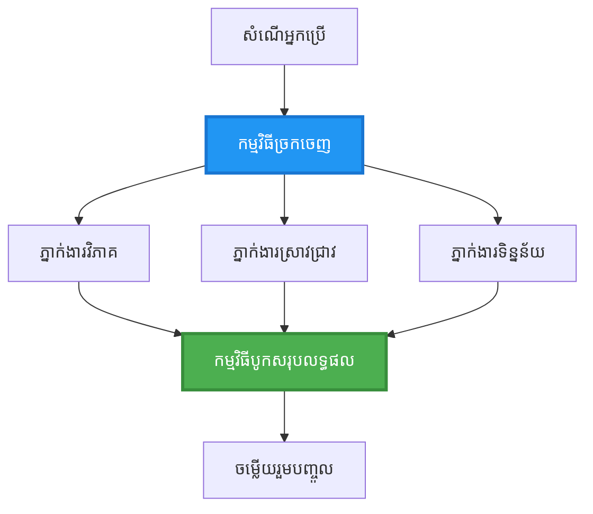
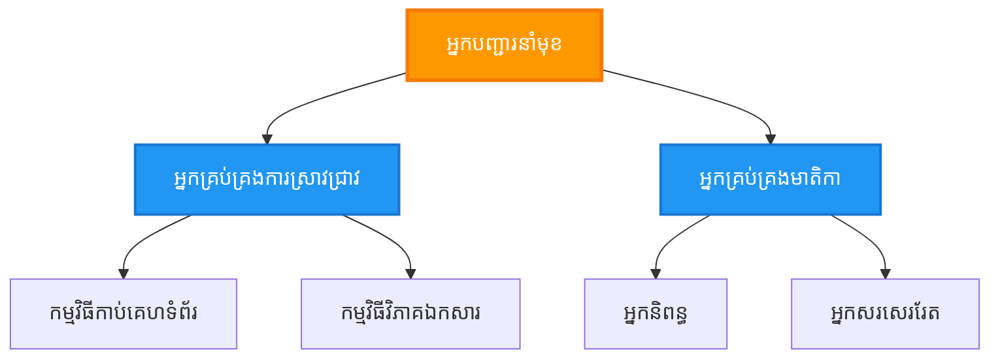
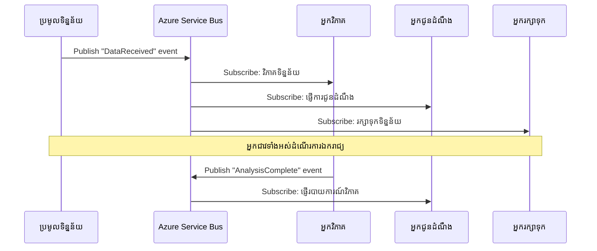
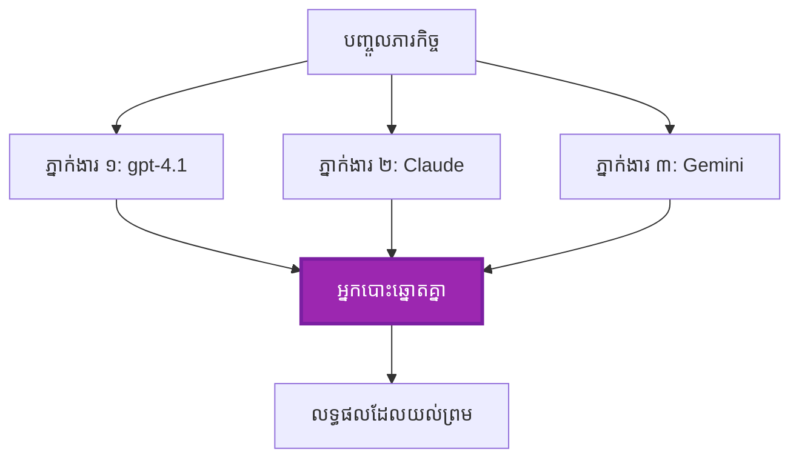
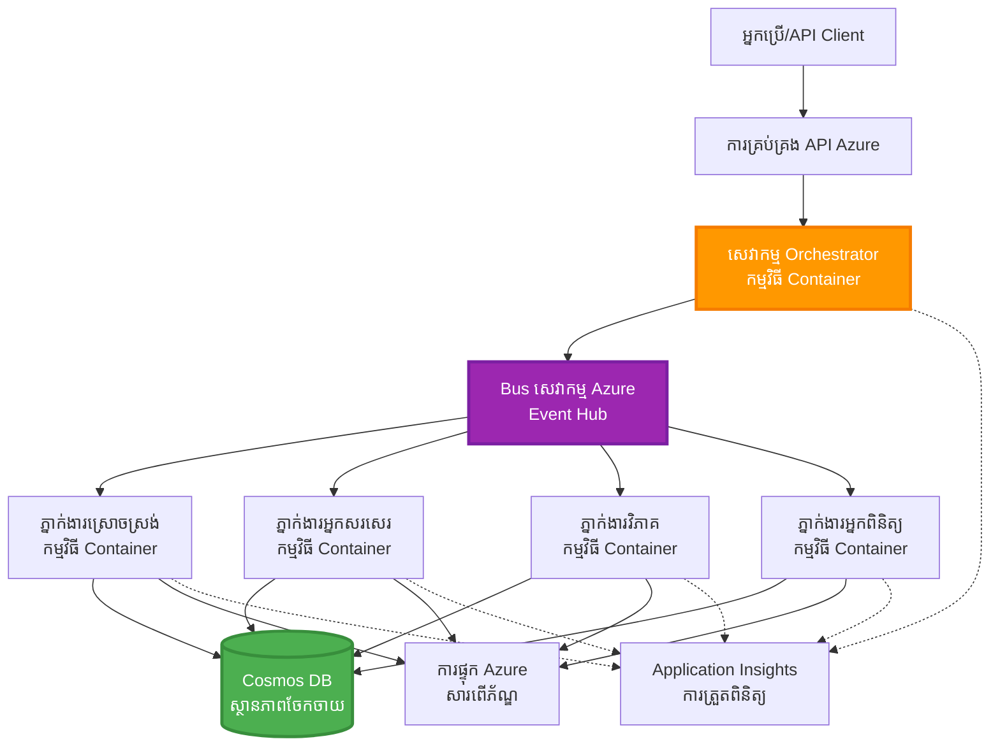

# លំនាំសម្របសម្រួលភ្នាក់ងារច្រើន

⏱️ **ពេលវេលាដែលប៉ាន់ប្រមាណ**: ៦០-៧៥ នាទី | 💰 **ការចំណាយដែលប៉ាន់ប្រមាណ**: ~$១០០-៣០០/ខែ | ⭐ **ភាពស្មុគស្មាញ**: ជាន់ខ្ពស់

**📚 ផ្លូវការរៀន:**
- ← មុននេះ: [ផែនការចំហាយ](capacity-planning.md) - វិធានការគ្រប់គ្រងធនធាន និងការពង្រីក
- 🎯 **អ្នកនៅទីនេះ**: លំនាំសម្របសម្រួលភ្នាក់ងារច្រើន (ការរៀបចំ, ការទំនាក់ទំនង, ការគ្រប់គ្រងស្ថានភាព)
- → បន្ទាប់: [ជ្រើសរើស SKU](sku-selection.md) - ជ្រើសរើសសេវាកម្ម Azure ត្រឹមត្រូវ
- 🏠 [ទំព័រមេវគ្គ](../../README.md)

---

## អ្វីដែលអ្នកនឹងរៀន

ដោយបញ្ចប់មេរៀននេះ អ្នកនឹងបាន៖
- យល់ដឹងអំពីលំនាំរចនាសម្ព័ន្ធភ្នាក់ងារច្រើន និងពេលណា​ដែលត្រូវប្រើ
- អនុវត្តលំនាំសម្របសម្រួល (មជ្ឈមណ្ឌល, ចែកចាយ, រចនាសម្ព័ន្ធត្រង់)
- រចនាយុទ្ធសាស្រ្តការទំនាក់ទំនងភ្នាក់ងារ (សម័យសម័យ, មិនសម័យសម័យ, និយមន័យដោយព្រឹត្តិការណ៍)
- គ្រប់គ្រងស្ថានភាពចែករំលែកលើភ្នាក់ងារចែកចាយ
- បញ្ចូលប្រព័ន្ធភ្នាក់ងារច្រើនលើ Azure ជាមួយ AZD
- អនុវត្តលំនាំសម្របសម្រួលសម្រាប់សេណារីយ៉ូ AI ពិតប្រាកដ
- ត្រួតពិនិត្យ និងពិនិត្យបញ្ហាប្រព័ន្ធភ្នាក់ងារចែកចាយ

## ហេតុអ្វីបានជា ការសម្របសម្រួលភ្នាក់ងារច្រើនមានសារៈសំខាន់

### ការវឌ្ឍបំផុត: ពីភ្នាក់ងារតែមួយទៅភ្នាក់ងារច្រើន

**ភ្នាក់ងារតែមួយ (សាមញ្ញ):**
```
User → Agent → Response
```
- ✅ ងាយស្រួលយល់ និងអនុវត្ត
- ✅ លឿនសម្រាប់ភារកិច្ចសាមញ្ញ
- ❌ មានកំណត់ដោយសមត្ថភាពម៉ូដែលតែមួយ
- ❌ មិនអាចដំណើរការពហុភារកិច្ចបាន
- ❌ គ្មានការបរិច្ឆេទជាក់លាក់

**ប្រព័ន្ធភ្នាក់ងារច្រើន (ខ្ពស់):**
```mermaid
graph TD
    Orchestrator[អ្នកច្នៃប្រឌិត] --> Agent1[ភ្នាក់ងារ1<br/>ផែនការ]
    Orchestrator --> Agent2[ភ្នាក់ងារ2<br/>កូដ]
    Orchestrator --> Agent3[ភ្នាក់ងារ3<br/>ពិនិត្យឡើងវិញ]
```- ✅ ភ្នាក់ងារបរិច្ឆេទសម្រាប់ភារកិច្ចជាក់លាក់
- ✅ ដំណើរការពហុភ្នាក់ងារដោយលឿន
- ✅ ម៉ូឌុល និងថែទាំបានល្អ
- ✅ ល្អសម្រាប់កំណត់ការងារលំបាក
- ⚠️ តម្រូវការយល់អំពីវិធីសាស្រ្តសម្របសម្រួល

**បំរែបំរួល**: ភ្នាក់ងារតែមួយគឺដូចមនុស្សម្នាក់ដែលធ្វើភារកិច្ចទាំងអស់ តែភ្នាក់ងារច្រើនគឺដូចក្រុមមនុស្សដែលម្នាក់ៗមានជំនាញជាក់លាក់ (អ្នកស្រាវជ្រាវ, អ្នកសរសេរ, អ្នកពិនិត្យ, អ្នកនិពន្ធ) ដែលធ្វើការជាមួយគ្នា។

---

## លំនាំសម្របសម្រួលសំខាន់ៗ

### លំនាំ ១៖ សម្របសម្រួលតាមលំដាប់ (ខ្សែការទទួលខុសត្រូវ)

**ពេលណាត្រូវប្រើ**: ភារកិច្ចត្រូវបញ្ចប់តាមលំដាប់ជាក់លាក់ ភ្នាក់ងារនីមួយៗបង្កើតលទ្ធផលពីមុន។

```mermaid
sequenceDiagram
    participant User
    participant Orchestrator
    participant Agent1 as អ្នកស្រាវជ្រាវ
    participant Agent2 as អ្នកនិពន្ធ
    participant Agent3 as អ្នកកែសម្រួល
    
    User->>Orchestrator: "សរសេរអត្ថបទអំពី AI"
    Orchestrator->>Agent1: ស្រាវជ្រាវប្រធានបទ
    Agent1-->>Orchestrator: លទ្ធផលស្រាវជ្រាវ
    Orchestrator->>Agent2: សរសេរព្រាង (ប្រើស្រាវជ្រាវ)
    Agent2-->>Orchestrator: អត្ថបទព្រាង
    Orchestrator->>Agent3: កែសម្រួល និងធ្វើឱ្យប្រសើរ
    Agent3-->>Orchestrator: អត្ថបទចុងក្រោយ
    Orchestrator-->>User: អត្ថបទបានកែសម្រួល
    
    Note over User,Agent3: ការដំណើរការតាមលំដាប់៖ ជំហាននីមួយៗរង់ចាំជំហានមុន
```
**អត្ថប្រយោជន៍:**
- ✅ ងាយយល់ពីដំណាលទិន្នន័យ
- ✅ ងាយស្រួលពិនិត្យកំហុស
- ✅ រំលងដំណើរការត្រឹមត្រូវបានទៀតមូល

**កំណត់កម្រិត:**
- ❌ យឺត (មិនមានការដំណើរការដោយសម័យសម័យ)
- ❌ ការបរាជ័យមួយបិទខ្សែទាំងមូល
- ❌ មិនអាចដោះស្រាយភារកិច្ចអាស្រ័យលើគ្នាបាន

**ឧទាហរណ៍ប្រើប្រាស់:**
- បណ្តើរការបង្កើតមាតិកា (ស្រាវជ្រាវ → សរសេរ → កែសម្រួល → ចុះផ្សាយ)
- បង្កើតកូដ (ផែនការ → អនុវត្ត → សាកល្បង → ចុះផ្សាយ)
- បង្កើតរបាយការណ៍ (ប្រមូលទិន្នន័យ → វិភាគ → បង្ហាញ → សង្ខេប)

---

### លំនាំ ២៖ សម្របសម្រួលស្របពេល (ពង្រីក / បង្រួម)

**ពេលណាត្រូវប្រើ**: ភារកិច្ចឯករាជ្យអាចដំណើរការដោយស្របពេល បង្ហាញលទ្ធផលនៅបញ្ចប់។


**អត្ថប្រយោជន៍:**
- ✅ លឿន (ដំណើរការដោយស្របពេល)
- ✅ អាចទ្រាំទ្រការខូចខាតបាន (លទ្ធផលផ្នែកខ្លះទទួលយកបាន)
- ✅ អាចពង្រីកជាន់ជាន់ផ្ទះ

**កំណត់កម្រិត:**
- ⚠️ លទ្ធផលអាចមកយឺតហើយរៀបចំមិនត្រឹមត្រូវ
- ⚠️ តម្រូវការយល់គំនីមាត្រ
- ⚠️ ការគ្រប់គ្រងស្ថានភាពស្មុគស្មាញ

**ឧទាហរណ៍ប្រើប្រាស់:**
- ប្រមូលទិន្នន័យពីប្រភពច្រើន (API + DB + ការជករកវែប)
- វិភាគប្រកួតប្រជែង (ម៉ូដែលច្រើនបង្កើតដំណោះស្រាយ, ជ្រើសរើសល្អបំផុត)
- សេវាប្រែសម្រួលភាសា (ប្រែសម្រួលភាសាច្រើនក្នុងពេលតែមួយ)

---

### លំនាំ ៣៖ សម្របសម្រួលតាមលំដាប់រង (អ្នកគ្រប់គ្រង - កម្មករ)

**ពេលណាត្រូវប្រើ**: សកម្មភាពស្មុគស្មាញមានភារកិច្ចរង និងតម្រូវភាពចែកចាយភារកិច្ច។


**អត្ថប្រយោជន៍:**
- ✅ ដោះស្រាយសកម្មភាពស្មុគស្មាញ
- ✅ ម៉ូឌុល និងថែទាំបានងាយ
- ✅ គម្របជាក់លាក់ព្រំដែនតំណាង

**កំណត់កម្រិត:**
- ⚠️ រចនាសម្ព័ន្ធស្មុគស្មាញនិងខ្ពស់
- ⚠️ ពេលយឺត (ស្រទាប់សម្របសម្រួលច្រើន)
- ⚠️ តម្រូវការរៀបចំនុត្យភាពខ្ពស់

**ឧទាហរណ៍ប្រើប្រាស់:**
- ដំណើរការឯកសារស្ថាប័ន (ចាត់ថ្នាក់ → បញ្ជូនទៅ → ដំណើរការ → សន្សំarchive)
- បណ្តាញទិន្នន័យពហុដំណាក់កាល (បញ្ចូល → ស្អាត → បម្លែង → វិភាគ → របាយការណ៍)
- ដំណើរការស្វ័យប្រវត្តិស្មុគស្មាញ (រៀបចំ → ចែកចាយធនធាន → អនុវត្ត → ត្រួតពិនិត្យ)

---

### លំនាំ ៤៖ សម្របសម្រួលដោយព្រឹត្តិការណ៍ (ផ្សាយ-ជាវ)

**ពេលណាត្រូវប្រើ**: ភ្នាក់ងារត្រូវអាចឆ្លើយតបទៅនឹងព្រឹត្តិការណ៍ មានការចាប់ឈ្មោះតិចតួច។


**អត្ថប្រយោជន៍:**
- ✅ ភ្នាក់ងារចាស់ក្លាយខ្សែអេឡិចត្រូនិចតិចតួច
- ✅ ងាយតំឡើងភ្នាក់ងារថ្មី (គ្រាន់តែជាវ)
- ✅ ដំណើរការមិនសម័យសម័យ
- ✅ មានភាពរឹងមាំ (ផ្ទុកសារបាន)

**កំណត់កម្រិត:**
- ⚠️ ភាពឯកភាពនៅពេលក្រោយ
- ⚠️ ពិបាកពិនិត្យកំហុស
- ⚠️ ការរៀបចំបង្ហាញសារលំបាក

**ឧទាហរណ៍ប្រើប្រាស់:**
- ប្រព័ន្ធត្រួតពិនិត្យពេលវេលាពិត (ការព្រមាន, ផ្ទាំងបង្ហាញ, កំណត់ហេតុ)
- សេវា​ជូនដំណឹងច្រើនប៉ុណ្ណោះ (អ៊ីមែល, SMS, ជូនផ្សាយ, Slack)
- បណ្តាញដំណើរការទិន្នន័យ (អ្នកប្រើប្រាស់ជាច្រើនសម្រាប់ទិន្នន័យដូចគ្នា)

---

### លំនាំ ៥៖ សម្របសម្រួលដោយការសន្និដ្ឋាន (ឆ្នោត / Quorum)

**ពេលណាត្រូវប្រើ**: ត្រូវការយល់ព្រមពីភ្នាក់ងារច្រើនមុនពេលបន្ត។


**អត្ថប្រយោជន៍:**
- ✅ ការត្រឹមត្រូវខ្ពស់ (មតិយោបល់ច្រើន)
- ✅ អាចទ្រាំទ្រ​ការបរាជ័យតិច (ភាពបរាជ័យតិចទទួលយកបាន)
- ✅ មានការធានាគុណភាព

**កំណត់កម្រិត:**
- ❌ ថ្លៃថ្លា (ហៅម៉ូដែលច្រើន)
- ❌ យឺត (រង់ចាំភ្នាក់ងារទាំងអស់)
- ⚠️ តម្រូវការដោះស្រាយវិវាទ

**ឧទាហរណ៍ប្រើប្រាស់:**
- ការត្រួតពិនិត្យមាតិកា (ម៉ូដែលច្រើនពិនិត្យមាតិកា)
- ពិនិត្យកូដ (លីនធឺរ / អាណាឡីស្ទ៍ច្រើន)
- រោគវិនិច្ឆ័យវេជ្ជសាស្រ្ត (ម៉ូដែល AI ច្រើន, ផ្ទៀងផ្ទាត់ជាមួយអ្នកជំនាញ)

---

## ទិដ្ឋភាពរចនាសម្ព័ន្ធ

### ប្រព័ន្ធភ្នាក់ងារច្រើនពេញលេញលើ Azure


**ធាតុសំខាន់:**

| ធាតុ | គោលបំណង | សេវាកម្ម Azure |
|--------|----------|-----------------|
| **API Gateway** | ច្រកចូល, កំណត់អត្រា, អាជ្ញាធរ | API Management |
| **Orchestrator** | សម្របសម្រួលសកម្មភាពភ្នាក់ងារ | Container Apps |
| **Message Queue** | ទំនាក់ទំនងមិនសម័យសម័យ | Service Bus / Event Hubs |
| **Agents** | ភ្នាក់ងារ AI បរិច្ឆេទ | Container Apps / Functions |
| **State Store** | ស្ថានភាពចែករំលែក, តាមដានភារកិច្ច | Cosmos DB |
| **Artifact Storage** | ឯកសារ, លទ្ធផល, កំណត់ហេតុ | Blob Storage |
| **Monitoring** | តាមដានចែកចាយ, កំណត់ហេតុ | Application Insights |

---

## ការតម្រូវការ

### ឧបករណ៍ដែលត្រូវការជាកម្រិត

```bash
# បញ្ជាក់ Azure Developer CLI
azd version
# ✅ គម្រោង៖ azd ម៉ាស៊ីនការពារ 1.0.0 ឬខ្ពស់ជាងនេះ

# បញ្ជាក់ Azure CLI
az --version
# ✅ គម្រោង៖ azure-cli 2.50.0 ឬខ្ពស់ជាងនេះ

# បញ្ជាក់ Docker (សម្រាប់ការប្រឡងក្នុងមូលដ្ឋាន)
docker --version
# ✅ គម្រោង៖ ម៉ាស៊ីន Docker 20.10 ឬខ្ពស់ជាងនេះ
```

### ខ្លឹមសារផ្សេងៗរបស់ Azure

- មាន​កម្មវិធី Azure ដំណើរការ
- សិទ្ធិបង្កើត:
  - Container Apps
  - Service Bus namespaces
  - Cosmos DB អាសយដ្ឋាន
  - Storage accounts
  - Application Insights

### ចំណេះដឹងមុន

អ្នកគួរតែបានបញ្ចប់:
- [ការគ្រប់គ្រងការកំណត់](../chapter-03-configuration/configuration.md)
- [ការផ្ទៀងផ្ទាត់ និងសុវត្ថិភាព](../chapter-03-configuration/authsecurity.md)
- [ឧទាហរណ៏ Microservices](../../../../examples/microservices)

---

## មគ្គុទេសក៍អនុវត្ត

### រចនាសម្ព័ន្ធគម្រោង

```
multi-agent-system/
├── azure.yaml                    # AZD configuration
├── infra/
│   ├── main.bicep               # Main infrastructure
│   ├── core/
│   │   ├── servicebus.bicep     # Message queue
│   │   ├── cosmos.bicep         # State store
│   │   ├── storage.bicep        # Artifact storage
│   │   └── monitoring.bicep     # Application Insights
│   └── app/
│       ├── orchestrator.bicep   # Orchestrator service
│       └── agent.bicep          # Agent template
└── src/
    ├── orchestrator/            # Orchestration logic
    │   ├── app.py
    │   ├── workflows.py
    │   └── Dockerfile
    ├── agents/
    │   ├── research/            # Research agent
    │   ├── writer/              # Writer agent
    │   ├── analyst/             # Analyst agent
    │   └── reviewer/            # Reviewer agent
    └── shared/
        ├── state_manager.py     # Shared state logic
        └── message_handler.py   # Message handling
```

---

## មេរៀន ១៖ លំនាំសម្របសម្រួលតាមលំដាប់

### អនុវត្ត ៖ បណ្តើរការបង្កើតមាតិកាតាមលំដាប់

យើងសង់បណ្តើរដំណើរការតាមលំដាប់៖ ស្រាវជ្រាវ → សរសេរ → កែសម្រួល → ចុះផ្សាយ

### ១. ការកំណត់ AZD

**ឯកសារ: `azure.yaml`**

```yaml
name: content-pipeline
metadata:
  template: multi-agent-sequential@1.0.0

services:
  orchestrator:
    project: ./src/orchestrator
    language: python
    host: containerapp
  
  research-agent:
    project: ./src/agents/research
    language: python
    host: containerapp
  
  writer-agent:
    project: ./src/agents/writer
    language: python
    host: containerapp
  
  editor-agent:
    project: ./src/agents/editor
    language: python
    host: containerapp
```

### ២. ហេដ្ឋារចនាសម្ព័ន្ធ៖ Service Bus សម្រាប់សម្របសម្រួល

**ឯកសារ: `infra/core/servicebus.bicep`**

```bicep
param name string
param location string
param tags object = {}

resource serviceBusNamespace 'Microsoft.ServiceBus/namespaces@2022-10-01-preview' = {
  name: name
  location: location
  tags: tags
  sku: {
    name: 'Standard'
    tier: 'Standard'
  }
  properties: {
    minimumTlsVersion: '1.2'
  }
}

// Queue for orchestrator → research agent
resource researchQueue 'Microsoft.ServiceBus/namespaces/queues@2022-10-01-preview' = {
  parent: serviceBusNamespace
  name: 'research-tasks'
  properties: {
    maxDeliveryCount: 3
    lockDuration: 'PT5M'
    deadLetteringOnMessageExpiration: true
  }
}

// Queue for research agent → writer agent
resource writerQueue 'Microsoft.ServiceBus/namespaces/queues@2022-10-01-preview' = {
  parent: serviceBusNamespace
  name: 'writer-tasks'
  properties: {
    maxDeliveryCount: 3
    lockDuration: 'PT5M'
  }
}

// Queue for writer agent → editor agent
resource editorQueue 'Microsoft.ServiceBus/namespaces/queues@2022-10-01-preview' = {
  parent: serviceBusNamespace
  name: 'editor-tasks'
  properties: {
    maxDeliveryCount: 3
    lockDuration: 'PT5M'
  }
}

output namespace string = serviceBusNamespace.name
output connectionString string = listKeys('${serviceBusNamespace.id}/AuthorizationRules/RootManageSharedAccessKey', serviceBusNamespace.apiVersion).primaryConnectionString
```

### ៣. អ្នកគ្រប់គ្រងស្ថានភាពចែករំលែក

**ឯកសារ: `src/shared/state_manager.py`**

```python
from azure.cosmos import CosmosClient, PartitionKey
from datetime import datetime
import os

class StateManager:
    """Manages shared state across agents using Cosmos DB"""
    
    def __init__(self):
        endpoint = os.environ['COSMOS_ENDPOINT']
        key = os.environ['COSMOS_KEY']
        
        self.client = CosmosClient(endpoint, key)
        self.database = self.client.get_database_client('agent-state')
        self.container = self.database.get_container_client('tasks')
    
    def create_task(self, task_id: str, task_type: str, input_data: dict):
        """Create a new task"""
        task = {
            'id': task_id,
            'type': task_type,
            'status': 'pending',
            'input': input_data,
            'created_at': datetime.utcnow().isoformat(),
            'steps': []
        }
        self.container.create_item(task)
        return task
    
    def update_task_step(self, task_id: str, step_name: str, result: dict):
        """Update task with completed step"""
        task = self.container.read_item(task_id, partition_key=task_id)
        
        task['steps'].append({
            'name': step_name,
            'completed_at': datetime.utcnow().isoformat(),
            'result': result
        })
        
        self.container.replace_item(task_id, task)
        return task
    
    def complete_task(self, task_id: str, final_result: dict):
        """Mark task as complete"""
        task = self.container.read_item(task_id, partition_key=task_id)
        task['status'] = 'completed'
        task['result'] = final_result
        task['completed_at'] = datetime.utcnow().isoformat()
        self.container.replace_item(task_id, task)
        return task
    
    def get_task(self, task_id: str):
        """Retrieve task state"""
        return self.container.read_item(task_id, partition_key=task_id)
```

### ៤. សេវាអ្នករៀបចំ

**ឯកសារ: `src/orchestrator/app.py`**

```python
from flask import Flask, request, jsonify
from azure.servicebus import ServiceBusClient, ServiceBusMessage
import json
import uuid
import os
from shared.state_manager import StateManager

app = Flask(__name__)
state_manager = StateManager()

# ការតភ្ជាប់សេវាកម្មប៉ុស្តិ៍
servicebus_connection_str = os.environ['SERVICEBUS_CONNECTION_STRING']
servicebus_client = ServiceBusClient.from_connection_string(servicebus_connection_str)

@app.route('/health', methods=['GET'])
def health():
    return jsonify({'status': 'healthy', 'service': 'orchestrator'})

@app.route('/create-content', methods=['POST'])
def create_content():
    """
    Sequential workflow: Research → Write → Edit → Publish
    """
    data = request.json
    topic = data.get('topic')
    
    if not topic:
        return jsonify({'error': 'Topic required'}), 400
    
    # បង្កើតកម្មវិធីនៅក្នុងហាងស្ថានភាព
    task_id = str(uuid.uuid4())
    task = state_manager.create_task(
        task_id=task_id,
        task_type='content_creation',
        input_data={'topic': topic}
    )
    
    # ផ្ញើសារទៅភ្នាក់ងារស្រាវជ្រាវ (ជំហានទីមួយ)
    sender = servicebus_client.get_queue_sender('research-tasks')
    message = ServiceBusMessage(
        body=json.dumps({
            'task_id': task_id,
            'topic': topic,
            'next_queue': 'writer-tasks'  # ទីកន្លែងផ្ញើលទ្ធផល
        }),
        content_type='application/json'
    )
    
    with sender:
        sender.send_messages(message)
    
    return jsonify({
        'task_id': task_id,
        'status': 'started',
        'workflow': 'sequential',
        'steps': ['research', 'write', 'edit', 'publish'],
        'message': 'Content creation pipeline initiated'
    }), 202

@app.route('/task/<task_id>', methods=['GET'])
def get_task_status(task_id):
    """Check task status"""
    try:
        task = state_manager.get_task(task_id)
        return jsonify(task)
    except Exception as e:
        return jsonify({'error': str(e)}), 404

if __name__ == '__main__':
    app.run(host='0.0.0.0', port=8080)
```

### ៥. ភ្នាក់ងារស្រាវជ្រាវ

**ឯកសារ: `src/agents/research/app.py`**

```python
from azure.servicebus import ServiceBusClient, ServiceBusMessage
from openai import AzureOpenAI
import json
import os
import time
from shared.state_manager import StateManager

# ចាប់ផ្តើមអតិថិជន
state_manager = StateManager()
servicebus_client = ServiceBusClient.from_connection_string(
    os.environ['SERVICEBUS_CONNECTION_STRING']
)

openai_client = AzureOpenAI(
    api_key=os.environ['AZURE_OPENAI_API_KEY'],
    api_version="2024-02-01",
    azure_endpoint=os.environ['AZURE_OPENAI_ENDPOINT']
)

def process_research_task(message_data):
    """Process research request and pass to writer"""
    task_id = message_data['task_id']
    topic = message_data['topic']
    next_queue = message_data['next_queue']
    
    print(f"🔬 Researching: {topic}")
    
    # ការហៅម៉ូឌែល Microsoft Foundry សម្រាប់ការស្រាវជ្រាវ
    response = openai_client.chat.completions.create(
        model="gpt-4.1",
        messages=[
            {"role": "system", "content": "You are a research assistant. Provide comprehensive research on the given topic."},
            {"role": "user", "content": f"Research this topic thoroughly: {topic}"}
        ],
        max_tokens=1500
    )
    
    research_results = response.choices[0].message.content
    
    # បន្តបច្ចុប្បន្នភាពស្ថានភាព
    state_manager.update_task_step(
        task_id=task_id,
        step_name='research',
        result={'research': research_results}
    )
    
    # ផ្ញើទៅភ្នាក់ងារបន្ទាប់ (អ្នកសរសេរ)
    sender = servicebus_client.get_queue_sender(next_queue)
    message = ServiceBusMessage(
        body=json.dumps({
            'task_id': task_id,
            'topic': topic,
            'research': research_results,
            'next_queue': 'editor-tasks'
        }),
        content_type='application/json'
    )
    
    with sender:
        sender.send_messages(message)
    
    print(f"✅ Research complete for task {task_id}")

def main():
    """Listen to research queue"""
    receiver = servicebus_client.get_queue_receiver('research-tasks')
    
    print("🔬 Research Agent started, listening for tasks...")
    
    with receiver:
        while True:
            messages = receiver.receive_messages(max_wait_time=5)
            for message in messages:
                try:
                    message_data = json.loads(str(message))
                    process_research_task(message_data)
                    receiver.complete_message(message)
                except Exception as e:
                    print(f"❌ Error processing message: {e}")
                    receiver.abandon_message(message)

if __name__ == '__main__':
    main()
```

### ៦. ភ្នាក់ងារសរសេរ

**ឯកសារ: `src/agents/writer/app.py`**

```python
from azure.servicebus import ServiceBusClient, ServiceBusMessage
from openai import AzureOpenAI
import json
import os
from shared.state_manager import StateManager

state_manager = StateManager()
servicebus_client = ServiceBusClient.from_connection_string(
    os.environ['SERVICEBUS_CONNECTION_STRING']
)

openai_client = AzureOpenAI(
    api_key=os.environ['AZURE_OPENAI_API_KEY'],
    api_version="2024-02-01",
    azure_endpoint=os.environ['AZURE_OPENAI_ENDPOINT']
)

def process_writing_task(message_data):
    """Write article based on research"""
    task_id = message_data['task_id']
    topic = message_data['topic']
    research = message_data['research']
    next_queue = message_data['next_queue']
    
    print(f"✍️ Writing article: {topic}")
    
    # ហៅម៉ូឌែល Microsoft Foundry ដើម្បីសរសេរអត្ថបទ
    response = openai_client.chat.completions.create(
        model="gpt-4.1",
        messages=[
            {"role": "system", "content": "You are a professional writer. Write engaging, well-structured articles."},
            {"role": "user", "content": f"Based on this research:\n\n{research}\n\nWrite a comprehensive article about: {topic}"}
        ],
        max_tokens=2000
    )
    
    article_draft = response.choices[0].message.content
    
    # បច្ចុប្បន្នភាពស្ថានភាព
    state_manager.update_task_step(
        task_id=task_id,
        step_name='writing',
        result={'draft': article_draft}
    )
    
    # បញ្ជូនទៅអ្នកកែសម្រួល
    sender = servicebus_client.get_queue_sender(next_queue)
    message = ServiceBusMessage(
        body=json.dumps({
            'task_id': task_id,
            'topic': topic,
            'draft': article_draft
        }),
        content_type='application/json'
    )
    
    with sender:
        sender.send_messages(message)
    
    print(f"✅ Article draft complete for task {task_id}")

def main():
    """Listen to writer queue"""
    receiver = servicebus_client.get_queue_receiver('writer-tasks')
    
    print("✍️ Writer Agent started, listening for tasks...")
    
    with receiver:
        while True:
            messages = receiver.receive_messages(max_wait_time=5)
            for message in messages:
                try:
                    message_data = json.loads(str(message))
                    process_writing_task(message_data)
                    receiver.complete_message(message)
                except Exception as e:
                    print(f"❌ Error: {e}")
                    receiver.abandon_message(message)

if __name__ == '__main__':
    main()
```

### ៧. ភ្នាក់ងារកែសម្រួល

**ឯកសារ: `src/agents/editor/app.py`**

```python
from azure.servicebus import ServiceBusClient
from openai import AzureOpenAI
import json
import os
from shared.state_manager import StateManager

state_manager = StateManager()
servicebus_client = ServiceBusClient.from_connection_string(
    os.environ['SERVICEBUS_CONNECTION_STRING']
)

openai_client = AzureOpenAI(
    api_key=os.environ['AZURE_OPENAI_API_KEY'],
    api_version="2024-02-01",
    azure_endpoint=os.environ['AZURE_OPENAI_ENDPOINT']
)

def process_editing_task(message_data):
    """Edit and finalize article"""
    task_id = message_data['task_id']
    topic = message_data['topic']
    draft = message_data['draft']
    
    print(f"📝 Editing article: {topic}")
    
    # ហៅម៉ូដែល Microsoft Foundry ដើម្បីកែសម្រួល
    response = openai_client.chat.completions.create(
        model="gpt-4.1",
        messages=[
            {"role": "system", "content": "You are an expert editor. Improve grammar, clarity, and structure."},
            {"role": "user", "content": f"Edit and improve this article:\n\n{draft}"}
        ],
        max_tokens=2000
    )
    
    final_article = response.choices[0].message.content
    
    # សម្គាល់ភារកិច្ចថាបានបញ្ចប់ហើយ
    state_manager.complete_task(
        task_id=task_id,
        final_result={
            'topic': topic,
            'final_article': final_article,
            'word_count': len(final_article.split())
        }
    )
    
    print(f"✅ Article finalized for task {task_id}")

def main():
    """Listen to editor queue"""
    receiver = servicebus_client.get_queue_receiver('editor-tasks')
    
    print("📝 Editor Agent started, listening for tasks...")
    
    with receiver:
        while True:
            messages = receiver.receive_messages(max_wait_time=5)
            for message in messages:
                try:
                    message_data = json.loads(str(message))
                    process_editing_task(message_data)
                    receiver.complete_message(message)
                except Exception as e:
                    print(f"❌ Error: {e}")
                    receiver.abandon_message(message)

if __name__ == '__main__':
    main()
```

### ៨. ចាក់បញ្ចូល និងសាកល្បង

```bash
# ជម្រើស A: ការចាក់បញ្ជូនផ្អែកលើគំរូ
azd init
azd up

# ជម្រើស B: ការចាក់បញ្ជូនឯកសារផ្ទាល់ខ្លួនរបស់ភ្នាក់ងារ (ត្រូវការពន្យារពេល)
azd extension install azure.ai.agents
azd ai agent init -m agent-manifest.yaml
azd up
```

> មើល [ពាក្យបញ្ជា AZD AI CLI](../chapter-08-production/production-ai-practices.md#azd-ai-cli-commands-and-extensions) សម្រាប់ទាំងអស់ `azd ai` ជូនសញ្ញា និងជម្រើស។

```bash
# ទទួល URL របស់អ្នករៀបចំ
ORCHESTRATOR_URL=$(azd env get-values | grep ORCHESTRATOR_URL | cut -d '=' -f2 | tr -d '"')

# បង្កើតមាតិកា
curl -X POST $ORCHESTRATOR_URL/create-content \
  -H "Content-Type: application/json" \
  -d '{"topic": "The Future of AI in Healthcare"}'
```

**✅ លទ្ធផលដែលរំពឹងបាន៖**
```json
{
  "task_id": "a1b2c3d4-e5f6-7890-abcd-ef1234567890",
  "status": "started",
  "workflow": "sequential",
  "steps": ["research", "write", "edit", "publish"],
  "message": "Content creation pipeline initiated"
}
```

**ត្រួតពិនិត្យដំណើរការភារកិច្ច៖**
```bash
TASK_ID="a1b2c3d4-e5f6-7890-abcd-ef1234567890"
curl $ORCHESTRATOR_URL/task/$TASK_ID
```

**✅ លទ្ធផលដែលរំពឹងបាន (បានបញ្ចប់):**
```json
{
  "id": "a1b2c3d4-e5f6-7890-abcd-ef1234567890",
  "type": "content_creation",
  "status": "completed",
  "steps": [
    {
      "name": "research",
      "completed_at": "2025-11-19T10:30:00Z",
      "result": {"research": "..."}
    },
    {
      "name": "writing",
      "completed_at": "2025-11-19T10:32:00Z",
      "result": {"draft": "..."}
    }
  ],
  "result": {
    "topic": "The Future of AI in Healthcare",
    "final_article": "...",
    "word_count": 1500
  }
}
```

---

## មេរៀន ២៖ លំនាំសម្របសម្រួលស្របពេល

### អនុវត្ត ៖ កម្មវិធីជាប់ស្រាយពីប្រភពច្រើន

យើងសង់ប្រព័ន្ធស្របពេលដែលប្រមូលពាណិជ្ជកម្មពីប្រភពជាច្រើនក្នុងពេលតែមួយ។

### អ្នករៀបចរផ្នែកស្របពេល

**ឯកសារ: `src/orchestrator/parallel_workflow.py`**

```python
from flask import Flask, request, jsonify
from azure.servicebus import ServiceBusClient, ServiceBusMessage
import json
import uuid
import os
from shared.state_manager import StateManager

app = Flask(__name__)
state_manager = StateManager()

servicebus_client = ServiceBusClient.from_connection_string(
    os.environ['SERVICEBUS_CONNECTION_STRING']
)

@app.route('/research-parallel', methods=['POST'])
def research_parallel():
    """
    Parallel workflow: Multiple agents work simultaneously
    """
    data = request.json
    query = data.get('query')
    
    task_id = str(uuid.uuid4())
    task = state_manager.create_task(
        task_id=task_id,
        task_type='parallel_research',
        input_data={
            'query': query,
            'agents': ['web', 'academic', 'news', 'social']
        }
    )
    
    # ចែកចាយទៅឲ្យភ្នាក់ងារ​ទាំងអស់​ជា​សមមោង
    agents = [
        ('web-research-queue', 'web'),
        ('academic-research-queue', 'academic'),
        ('news-research-queue', 'news'),
        ('social-research-queue', 'social')
    ]
    
    for queue_name, agent_type in agents:
        sender = servicebus_client.get_queue_sender(queue_name)
        message = ServiceBusMessage(
            body=json.dumps({
                'task_id': task_id,
                'query': query,
                'agent_type': agent_type,
                'result_queue': 'aggregation-queue'
            }),
            content_type='application/json'
        )
        
        with sender:
            sender.send_messages(message)
    
    return jsonify({
        'task_id': task_id,
        'status': 'started',
        'workflow': 'parallel',
        'agents_dispatched': 4,
        'message': 'Parallel research initiated'
    }), 202

if __name__ == '__main__':
    app.run(host='0.0.0.0', port=8080)
```

### វិធីសាស្រ្តគណនា

**ឯកសារ: `src/agents/aggregator/app.py`**

```python
from azure.servicebus import ServiceBusClient
import json
import os
from collections import defaultdict
from shared.state_manager import StateManager

state_manager = StateManager()
servicebus_client = ServiceBusClient.from_connection_string(
    os.environ['SERVICEBUS_CONNECTION_STRING']
)

# តាមដានលទ្ធផលរាល់បាតុកម្ម
task_results = defaultdict(list)
expected_agents = 4  # វេបសាយ, សិក្សាស្រាវជ្រាវ, ព័ត៌មាន, សង្គម

def process_result(message_data):
    """Aggregate results from parallel agents"""
    task_id = message_data['task_id']
    agent_type = message_data['agent_type']
    result = message_data['result']
    
    # រក្សាទុកលទ្ធផល
    task_results[task_id].append({
        'agent': agent_type,
        'data': result
    })
    
    print(f"📊 Received result from {agent_type} agent ({len(task_results[task_id])}/{expected_agents})")
    
    # ពិនិត្យមើលថាតើភ្នាក់ងារទាំងអស់បានបញ្ចប់ហើយឬនៅ (fan-in)
    if len(task_results[task_id]) == expected_agents:
        print(f"✅ All agents completed for task {task_id}. Aggregating...")
        
        # រួមបញ្ចូលលទ្ធផល
        aggregated = {
            'query': message_data['query'],
            'sources': task_results[task_id],
            'summary': generate_summary(task_results[task_id])
        }
        
        # សម្គាល់ថាបានបញ្ចប់
        state_manager.complete_task(task_id, aggregated)
        
        # ដាក់អោយស្អាតឡើងវិញ
        del task_results[task_id]
        
        print(f"✅ Aggregation complete for task {task_id}")

def generate_summary(results):
    """Generate summary from all sources"""
    summaries = [r['data'].get('summary', '') for r in results]
    return '\n\n'.join(summaries)

def main():
    """Listen to aggregation queue"""
    receiver = servicebus_client.get_queue_receiver('aggregation-queue')
    
    print("📊 Aggregator started, listening for results...")
    
    with receiver:
        while True:
            messages = receiver.receive_messages(max_wait_time=5)
            for message in messages:
                try:
                    message_data = json.loads(str(message))
                    process_result(message_data)
                    receiver.complete_message(message)
                except Exception as e:
                    print(f"❌ Error: {e}")
                    receiver.abandon_message(message)

if __name__ == '__main__':
    main()
```

**អត្ថប្រយោជន៍លំនាំស្របពេល:**
- ⚡ **លឿន ៤ដង** (ភ្នាក់ងារដំណើរការស្របពេល)
- 🔄 **អាចទ្រាំទ្រការខូចខាត** (លទ្ធផលផ្នែកខ្លះទទួលយកបាន)
- 📈 **អាចពង្រីក** (បន្ថែមភ្នាក់ងារងាយស្រួល)

---

## លំហាត់អនុវត្ត

### លំហាត់ ១៖ បន្ថែមការគ្រប់គ្រងពេលវេលាដំណើរការ ⭐⭐ (មធ្យម)

**គោលដៅ**: អនុវត្តច្បាប់ពេលវេលាដើម្បីឲ្យអ្នកបញ្ចូលមិនរង់ចាំរហូតដល់ភ្នាក់ងារយឺតៗ។

**ជំហាន**:

1. **បន្ថែមការតាមដានពេលវេលាដល់អ្នកបញ្ចូល៖**

```python
from datetime import datetime, timedelta

task_timeouts = {}  # task_id -> ពេលវេលាអាយុ

def process_result(message_data):
    task_id = message_data['task_id']
    
    # កំណត់ពេលអស់ស្តុកលើលទ្ធផលទីមួយ
    if task_id not in task_timeouts:
        task_timeouts[task_id] = datetime.utcnow() + timedelta(seconds=30)
    
    task_results[task_id].append({
        'agent': message_data['agent_type'],
        'data': message_data['result']
    })
    
    # ពិនិត្យមើលថាតើបានបញ្ចប់ឬអស់ពេល
    if len(task_results[task_id]) == expected_agents or \
       datetime.utcnow() > task_timeouts[task_id]:
        
        print(f"📊 Aggregating with {len(task_results[task_id])}/{expected_agents} results")
        
        aggregated = {
            'query': message_data['query'],
            'sources': task_results[task_id],
            'completed_agents': len(task_results[task_id]),
            'timed_out': len(task_results[task_id]) < expected_agents
        }
        
        state_manager.complete_task(task_id, aggregated)
        
        # សំអាត
        del task_results[task_id]
        del task_timeouts[task_id]
```

2. **សាកល្បងជាមួយការពន្យារពេលបង្កើត៖**

```python
# នៅក្នុងភ្នាក់ងារ​មួយ បន្ថែមការពន្យារពេលដើម្បីត្រួតពិនិត្យការដំណើរការប្រមាញ់យឺត
import time
time.sleep(35)  # លើសពេលវេលាកំណត់30វិនាទី
```

3. **ចាក់បញ្ចូល និងផ្ទៀងផ្ទាត់៖**

```bash
azd deploy aggregator

# ស្នើរសុំភារកិច្ច
curl -X POST $ORCHESTRATOR_URL/research-parallel \
  -H "Content-Type: application/json" \
  -d '{"query": "AI safety research"}'

# ពិនិត្យលទ្ធផលក្រោយពី ៣០ វិនាទី
curl $ORCHESTRATOR_URL/task/$TASK_ID
```

**✅ ករណីជោគជ័យ៖**
- ✅ ភារកិច្ចបញ្ចប់បន្ទាប់ពី ៣០ វិនាទី ទោះបីភ្នាក់ងារមានភាពមិនបញ្ចប់
- ✅ ប្រតិកម្មបង្ហាញលទ្ធផលផ្នែកខ្លះ (`"timed_out": true`)
- ✅ របាយការណ៍លទ្ធផលដែលមាន (3 នាក់ក្នុងចំណោម 4 ភ្នាក់ងារ)

**ពេលវេលា**: ២០-២៥ នាទី

---

### លំហាត់ ២៖ អនុវត្តច្បាប់ Retry ⭐⭐⭐ (ជាន់ខ្ពស់)

**គោលដៅ**: Retry ភារកិច្ចភ្នាក់ងារបរាជ័យស្វ័យប្រវត្តិមុនការបោះបង់។

**ជំហាន**:

1. **បន្ថែមការតាមដាន retry ទៅអ្នករៀបចំ៖**

```python
from dataclasses import dataclass
from typing import Dict

@dataclass
class RetryConfig:
    max_retries: int = 3
    backoff_seconds: int = 5

retry_counts: Dict[str, int] = {}  # message_id -> ចំនួនព្យាយាមម្ដងម្កាល

def send_with_retry(queue_name: str, message_data: dict, retry_config: RetryConfig):
    """Send message with retry metadata"""
    message_id = message_data.get('message_id', str(uuid.uuid4()))
    message_data['message_id'] = message_id
    message_data['retry_count'] = retry_counts.get(message_id, 0)
    message_data['max_retries'] = retry_config.max_retries
    
    sender = servicebus_client.get_queue_sender(queue_name)
    message = ServiceBusMessage(
        body=json.dumps(message_data),
        content_type='application/json',
        message_id=message_id
    )
    
    with sender:
        sender.send_messages(message)
```

2. **បន្ថែមអ្នកដោះស្រាយ retry ទៅភ្នាក់ងារ៖**

```python
def process_with_retry(message, receiver, process_func):
    """Process message with automatic retry on failure"""
    try:
        message_data = json.loads(str(message))
        
        # ប្រតិបត្តិការសារនេះ
        process_func(message_data)
        
        # សម្រេចបានជោគជ័យ - បញ្ចប់
        receiver.complete_message(message)
        
    except Exception as e:
        message_id = message.message_id
        retry_count = message_data.get('retry_count', 0)
        max_retries = message_data.get('max_retries', 3)
        
        if retry_count < max_retries:
            # ធ្វើម្តងទៀត៖ បោះបង់ហើយដាក់ចូលជារង្សីម្តងទៀតជាមួយគណនាតម្លើង
            print(f"⚠️ Retry {retry_count + 1}/{max_retries} for message {message_id}")
            
            message_data['retry_count'] = retry_count + 1
            
            # ផ្ញើត្រឡប់ទៅរង្សីដដែលជាមួយការពន្យារពេល
            time.sleep(5 * (retry_count + 1))  # ការលែងត្រីកោណជំរុញ
            send_with_retry(queue_name, message_data, RetryConfig())
            
            receiver.complete_message(message)  # លុបមូលដ្ឋានដើម
        else:
            # លើសចំនួនព្យាយាមអតិបរមា - ផ្លាស់ប្តូរទៅរង្សីសំបុត្រឈប់សម័យ
            print(f"❌ Max retries exceeded for message {message_id}")
            receiver.dead_letter_message(
                message,
                reason="MaxRetriesExceeded",
                error_description=str(e)
            )
```

3. **ត្រួតពិនិត្យក្រុមសារលិខិតស្លាប់៖**

```python
def monitor_dead_letters():
    """Check dead letter queue for failed messages"""
    receiver = servicebus_client.get_queue_receiver(
        'research-queue',
        sub_queue='deadletter'
    )
    
    with receiver:
        messages = receiver.receive_messages(max_wait_time=5)
        for message in messages:
            print(f"☠️ Dead letter: {message.message_id}")
            print(f"Reason: {message.dead_letter_reason}")
            print(f"Description: {message.dead_letter_error_description}")
```

**✅ ករណីជោគជ័យ៖**
- ✅ ភារកិច្ចបរាជ័យ retry ស្វ័យប្រវត្តិ (បានដល់ ៣ ដង)
- ✅ ជំហានត្រឺមត្រូវដោយការ​ចន្លោះពេលជីវវិទ្យា (៥ វិនាទី, ១០ វិនាទី, ១៥ វិនាទី)
- ✅ បន្ទាប់ពី retry ដល់កំរិតសំរាប់ មុខសារទៅកាន់ក្រុមសារលិខិតស្លាប់
- ✅ ក្រុមសារលិខិតស្លាប់អាចត្រូវត្រួតពិនិត្យ និងលេងឡើងវិញបាន

**ពេលវេលា**: ៣០-៤០ នាទី

---

### លំហាត់ ៣៖ អនុវត្តកម្មវិធី Circuit Breaker ⭐⭐⭐ (ជាន់ខ្ពស់)

**គោលដៅ**: ធានាថាមិនមានការបរាជ័យធ្វើរងា ដោយបញ្ឈប់ការស្នើរសុំទៅភ្នាក់ងារបរាជ័យ។

**ជំហាន**:

1. **បង្កើតថ្នាក់ circuit breaker:**

```python
from enum import Enum
from datetime import datetime, timedelta

class CircuitState(Enum):
    CLOSED = "closed"      # ប្រតិបត្តិការធម្មតា
    OPEN = "open"          # បរាជ័យ, បដិសេធសំណើ
    HALF_OPEN = "half_open"  # កំពុងតេស្តថាបានស្ដារ

class CircuitBreaker:
    def __init__(self, failure_threshold=5, timeout_seconds=60):
        self.failure_threshold = failure_threshold
        self.timeout_seconds = timeout_seconds
        self.failure_count = 0
        self.last_failure_time = None
        self.state = CircuitState.CLOSED
    
    def call(self, func):
        """Execute function with circuit breaker protection"""
        if self.state == CircuitState.OPEN:
            # ពិនិត្យមើលថាតើពេលសំរាកបានផុតដែរ
            if datetime.utcnow() - self.last_failure_time > timedelta(seconds=self.timeout_seconds):
                self.state = CircuitState.HALF_OPEN
                print("🔄 Circuit breaker: HALF_OPEN (testing)")
            else:
                raise Exception(f"Circuit breaker OPEN for agent. Try again in {self.timeout_seconds}s")
        
        try:
            result = func()
            
            # ជោគជ័យ
            if self.state == CircuitState.HALF_OPEN:
                self.state = CircuitState.CLOSED
                self.failure_count = 0
                print("✅ Circuit breaker: CLOSED (recovered)")
            
            return result
            
        except Exception as e:
            self.failure_count += 1
            self.last_failure_time = datetime.utcnow()
            
            if self.failure_count >= self.failure_threshold:
                self.state = CircuitState.OPEN
                print(f"🔴 Circuit breaker: OPEN (too many failures)")
            
            raise e
```

2. **អនុវត្តទៅការហៅភ្នាក់ងារ:**

```python
# នៅក្នុងកម្មវិធីរៀបចំកម្មវិធី
agent_circuits = {
    'web': CircuitBreaker(failure_threshold=5, timeout_seconds=60),
    'academic': CircuitBreaker(failure_threshold=5, timeout_seconds=60),
    'news': CircuitBreaker(failure_threshold=5, timeout_seconds=60),
    'social': CircuitBreaker(failure_threshold=5, timeout_seconds=60)
}

def send_to_agent(agent_type, message_data):
    """Send with circuit breaker protection"""
    circuit = agent_circuits[agent_type]
    
    try:
        circuit.call(lambda: send_message(agent_type, message_data))
    except Exception as e:
        print(f"⚠️ Skipping {agent_type} agent: {e}")
        # បន្តជាមួយភ្នាក់ងារផ្សេងទៀត
```

3. **សាកល្បង circuit breaker:**

```bash
# ចាក់សោធ្វើបរាជ័យច្រើនដង (បញ្ឈប់ភ្នាក់ងារម្នាក់)
az containerapp stop --name web-research-agent --resource-group rg-agents

# បញ្ជូនសំណើរ​ច្រើន
for i in {1..10}; do
  curl -X POST $ORCHESTRATOR_URL/research-parallel \
    -H "Content-Type: application/json" \
    -d '{"query": "test query '$i'"}'
  sleep 2
done

# ពិនិត្យកំណត់ហេតុ - គួរមើលឃើញសៀគ្វីបើកបន្ទាប់ពីបរាជ័យ ៥ ដង
# ប្រើ Azure CLI សម្រាប់កំណត់ហេតុខុងតឺន័រ App:
az containerapp logs show --name orchestrator --resource-group $RG_NAME --tail 50
```

**✅ ករណីជោគជ័យ៖**
- ✅ បន្ទាប់ពីបរាជ័យ ៥ ជាន់, វិស្វកម្ម circuit បើក (បដិសេធសំណើ)
- ✅ បន្ទាប់ពី ៦០ វិនាទី, វិចារណាពាក់កណ្តាលបើក (សាកល្បងស្ដារឡើងវិញ)
- ✅ ភ្នាក់ងារផ្សេងទៀតបន្តធ្វើការស្ថិរភាព
- ✅ វិចារណាបិទតាមដំណើរ ដោយស្វ័យប្រវត្តិពេលភ្នាក់ងារស្ដារឡើងវិញ

**ពេលវេលា**: ៤០-៥០ នាទី

---

## ត្រួតពិនិត្យ និងស្វែងរកកំហុស

### ការតាមដានចែកចាយជាមួយ Application Insights

**ឯកសារ: `src/shared/tracing.py`**

```python
from opencensus.ext.azure.log_exporter import AzureLogHandler
from opencensus.ext.azure.trace_exporter import AzureExporter
from opencensus.trace import config_integration
from opencensus.trace.tracer import Tracer
from opencensus.trace.samplers import AlwaysOnSampler
import logging
import os

# កំណត់រចនាសម្ព័ន្ធការតាមដាន
config_integration.trace_integrations(['requests', 'logging'])

connection_string = os.environ.get('APPLICATIONINSIGHTS_CONNECTION_STRING')

# បង្កើតឧបករណ៍តាមដាន
tracer = Tracer(
    exporter=AzureExporter(connection_string=connection_string),
    sampler=AlwaysOnSampler()
)

# កំណត់រចនាសម្ព័ន្ធការចុះបញ្ជីកំណត់ហេតុ
logger = logging.getLogger(__name__)
logger.addHandler(AzureLogHandler(connection_string=connection_string))
logger.setLevel(logging.INFO)

def trace_agent_call(agent_name, task_id, operation):
    """Trace agent operations"""
    with tracer.span(name=f'{agent_name}.{operation}') as span:
        span.add_attribute('agent', agent_name)
        span.add_attribute('task_id', task_id)
        span.add_attribute('operation', operation)
        
        try:
            result = operation()
            span.add_attribute('status', 'success')
            return result
        except Exception as e:
            span.add_attribute('status', 'error')
            span.add_attribute('error', str(e))
            raise
```

### ពិនិត្យសំណួរជាមួយ Application Insights

**តាមដានព្រឹត្តិការណ៍ទាំងមូលសម្រាប់ភ្នាក់ងារច្រើន៖**

```kusto
// Trace complete workflow for a task
traces
| where customDimensions.task_id == "a1b2c3d4-..."
| project timestamp, message, customDimensions.agent, customDimensions.operation
| order by timestamp asc
```

**ការប្រៀបធៀបលទ្ធផលពីភ្នាក់ងារ៖**

```kusto
// Compare agent execution times
dependencies
| where name contains "agent"
| summarize 
    avg_duration = avg(duration),
    p95_duration = percentile(duration, 95),
    count = count()
  by agent = tostring(customDimensions.agent)
| order by avg_duration desc
```

**វិភាគកំហុស:**

```kusto
// Find which agents fail most
exceptions
| where customDimensions.agent != ""
| summarize 
    failure_count = count(),
    unique_errors = dcount(outerMessage)
  by agent = tostring(customDimensions.agent)
| order by failure_count desc
```

---

## វិភាគចំណាយ

### ចំណាយប្រព័ន្ធភ្នាក់ងារច្រើន (ពេលខែ)

| ធាតុ | កំណត់រចនាសម្ព័ន្ធ | ចំណាយ |
|-------|--------------------|---------|
| **Orchestrator** | ១ Container App (1 vCPU, 2GB) | $៣០-៥០ |
| **4 ភ្នាក់ងារ** | ៤ Container Apps (0.5 vCPU, 1GB រាល់មួយ) | $៦០-១២០ |
| **Service Bus** | ស្តង់ដា, ១០លានសារ | $១០-២០ |
| **Cosmos DB** | សើរប្លាស់រលួស, 5GB ទិន្នន័យ, 1M RUs | $២៥-៥០ |
| **Blob Storage** | 10GB ទិន្នន័យ, ១០០K ប្រតិបត្តិការ | $៥-១០ |
| **Application Insights** | 5GB ទិន្នន័យចូល | $១០-១៥ |
| **ម៉ូដែល Microsoft Foundry** | gpt-4.1, 10M តូកិន | $១០០-៣០០ |
| **សរុប** | | **$២៤០-៥៦៥/ខែ** |

###យុទ្ធសាស្រ្តបន្ថយចំណាយ

1. **ប្រើប្រាស់សេវា Serverless នៅពេលមានសមត្ថភាព៖**
   ```bicep
   // Cosmos DB serverless (no minimum cost)
   properties: {
     databaseAccountOfferType: 'Standard'
     capabilities: [{ name: 'EnableServerless' }]
   }
   ```

2. **បណ្តេញភ្នាក់ងារទៅសូន្យនៅពេលមិនប្រើប្រាស់៖**
   ```bicep
   scale: {
     minReplicas: 0  // Scale to zero when no messages
     maxReplicas: 10
   }
   ```

3. **ប្រើការប្រមាញ់ប្លុកសម្រាប់ Service Bus:**
   ```python
   # ផ្ញើសារជាដុំ (ថោកជាង)
   sender.send_messages([message1, message2, message3])
   ```

4. **ផ្ទុកលទ្ធផលដែលប្រើប្រាស់ជាញឹកញាប់នៅ Cache:**
   ```python
   # ប្រើ Azure Cache សម្រាប់ Redis
   if cache.exists(query_hash):
       return cache.get(query_hash)
   ```

---

## ទម្លាប់ល្អបំផុត

### ✅ ត្រូវធ្វើ៖

1. **ប្រើប្រតិបត្តការវិលវត្ដបាន**
   ```python
   # អ្នកភ្នាក់ងារអាចដំណើរការបទសម្ភាសន៍ដដែលបានជាសុវត្ថិភាពច្រើនដង
   def process_task(task_id):
       if state_manager.task_exists(task_id):
           print(f"Task {task_id} already processed, skipping")
           return
       # កំពុងដំណើរការងារ...
   ```

2. **អនុវត្តការចុះកំណត់ហេតុយ៉ាងទូលំទូលាយ**
   ```python
   logger.info(f"Agent: {agent_name}, Task: {task_id}, Action: {action}")
   ```

3. **ប្រើអត្តសញ្ញាណស្វែងរកសមាសធាតុ**
   ```python
   # ផ្ញើ task_id តាំងពីដំណាក់កាល Workflow ទាំងមូល
   message_data = {
       'task_id': task_id,  # លេខសម្គាល់សមាសភាព
       'timestamp': datetime.utcnow().isoformat()
   }
   ```

4. **កំណត់អាយុកាលសារគឺ TTL**
   ```bicep
   properties: {
     defaultMessageTimeToLive: 'PT1H'  // 1 hour max
   }
   ```

5. **ត្រួតពិនិត្យក្រុមសារលិខិតស្លាប់**
   ```python
   # ការត្រួតពិនិត្យប្រចាំលើសារដែលបរាជ័យ
   monitor_dead_letters()
   ```

### ❌ មិនត្រូវធ្វើ៖

1. **កុំបង្កើតការពឹងផ្អែករាងវង់**
   ```python
   # ❌ អាក្រក់: Agent A → Agent B → Agent A (លំនាំមិនអញ្ច្រាស)
   # ✅ ល្អ: កំណត់ក្រាហ្វដែលមានទិសត្រឹមត្រូវ និងគ្មានវង់ (DAG)
   ```

2. **កុំរាំងខ្សែភ្នាក់ងារ**
   ```python
   # ❌ អាក្រក់: រង់ចាំ đồng bộ
   while not task_complete:
       time.sleep(1)
   
   # ✅ ល្អ: ប្រើការហៅត្រឡប់របស់ជួរតំណក់សារ
   ```

3. **កុំអIgnore ការបរាជ័យផ្នែកខ្លះ**
   ```python
   # ❌ អាក្រក់: ជម្រះដំណើរការទាំងមូលបើភ្នាក់ងារម្នាក់បរាជ័យ
   # ✅ ល្អ: ត្រឡប់លទ្ធផលផ្នែកមួយជាមួយសញ្ញាបង្ហាញកំហុស
   ```

4. **កុំប្រើការងងឹតព្យាយាមឆ្ងាយពេក**
   ```python
   # ❌ មិនល្អ: ព្យាយាមមិនដាច់
   # ✅ ល្អ: max_retries = 3, បន្ទាប់មកលិខិតស្លាប់
   ```

---

## មគ្គុទេសក៍ដោះស្រាយបញ្ហា

### បញ្ហាៈ សារអង្គុយនៅក្នុងជួរដេក

**រោគសញ្ញាៈ**
- សារត្រូវបានបន្សល់នៅក្នុងជួរដេក
- ភ្នាក់ងារមិនដំណើរការ
- ស្ថានភាពភារកិច្ចឈរនៅ "កំពុងរង់ចាំ"

**ការវិភាគៈ**
```bash
# ពិនិត្យជម្រៅជួរដាក់
az servicebus queue show \
  --namespace-name mybus \
  --name research-tasks \
  --query "countDetails"

# ពិនិត្យកំណត់ហេតុខ агент ដោយប្រើ Azure CLI
az containerapp logs show --name research-agent --resource-group $RG_NAME --tail 50
```

**ដំណោះស្រាយៈ**

1. **បង្កើនចំនួនភ្នាក់ងារ:**
   ```bash
   az containerapp update \
     --name research-agent \
     --min-replicas 3 \
     --max-replicas 10
   ```

2. **ពិនិត្យជួរឈរព្រលានសារស្លាប់:**
   ```bash
   az servicebus queue show \
     --namespace-name mybus \
     --name research-tasks \
     --query "countDetails.deadLetterMessageCount"
   ```

---

### បញ្ហាៈ ពេលវេលាជាភាពយូរជាងកំណត់/មិនធ្វើរួច

**រោគសញ្ញាៈ**
- ស្ថានភាពភារកិច្ចនៅ "កំពុងដំណើរការ"
- ភ្នាក់ងារច្រើននាក់បញ្ចប់ការងារ ខណៈដែលអ្នកផ្សេងទៀតមិនបានធ្វើ
- មិនមានសារកំហុសណាមួយ

**ការវិភាគៈ**
```bash
# ពិនិត្យស្ថានភាពភារកិច្ច
curl $ORCHESTRATOR_URL/task/$TASK_ID

# ពិនិត្យ Application Insights
# បាញ់បញ្ជាលោក: traces | ដែល customDimensions.task_id == "..."
```

**ដំណោះស្រាយៈ**

1. **អនុវត្ត​ពេលវេលាលេខទ្រង់ទ្រាយនៅក្នុងអ្នកសម្រង់ (លំហាត់ ១)**

2. **ពិនិត្យករណីភ្នាក់ងារបរាជ័យដោយប្រើ Azure Monitor:**
   ```bash
   # មើលកំណត់ហេតុតាមរយៈ azd monitor
   azd monitor --logs
   
   # ឬប្រើ Azure CLI ដើម្បីត្រួតពិនិត្យកំណត់ហេតុកម្មវិធីឡុងធឺរពិសេស
   az containerapp logs show --name <agent-name> --resource-group $RG_NAME --follow | grep "ERROR\|FAIL"
   ```

3. **ផ្ទៀងផ្ទាត់ថាភ្នាក់ងារទាំងអស់កំពុងរត់:**
   ```bash
   az containerapp list \
     --resource-group rg-agents \
     --query "[].{name:name, status:properties.runningStatus}"
   ```

---

## ស្វែងយល់បន្ថែម

### ឯកសារផ្លូវការជាភាសាអង់គ្លេស
- [Azure Service Bus](https://learn.microsoft.com/azure/service-bus-messaging/service-bus-messaging-overview)
- [Cosmos DB](https://learn.microsoft.com/azure/cosmos-db/introduction)
- [Container Apps DAPR](https://learn.microsoft.com/azure/container-apps/dapr-overview)
- [Multi-Agent Design Patterns](https://learn.microsoft.com/azure/architecture/guide/ai/multi-agent-systems)

### ជំហានបន្ទាប់នៅក្នុងវគ្គសិក្សានេះ
- ← មុន៖ [Capacity Planning](capacity-planning.md)
- → បន្ទាប់៖ [SKU Selection](sku-selection.md)
- 🏠 [ទំព័រដើមវគ្គសិក្សា](../../README.md)

### ឧទាហរណ៍ពាក់ព័ន្ធ
- [Microservices Example](../../../../examples/microservices) - គំរូការប្រាស្រ័យទាក់ទងសេវាកម្ម
- [Microsoft Foundry Models Example](../../../../examples/azure-openai-chat) - ការរួមបញ្ចូល AI

---

## សេចក្ដីសង្ខេប

**អ្នកបានរៀន:**
- ✅ របៀបផ្សារភ្ជាប់ចំនួនប្រាំ (រៀងលំដាប់, 병렬, ដំណាក់កាល, ការគ្រប់គ្រងដោយព្រឹត្តិការណ៍, ការយល់ព្រម)
- ✅ រចនាសម្ព័ន្ធភ្នាក់ងារច្រើនលើ Azure (Service Bus, Cosmos DB, Container Apps)
- ✅ ការគ្រប់គ្រងស្ថានភាពសម្រាប់ភ្នាក់ងារចែកចាយ
- ✅ ការដោះស្រាយពេលវេលា, ការព្យាយាមឡើងវិញ និងឧបករណ៍ប្រព្រឹត្តិតំណរ
- ✅ ការត្រួតពិនិត្យ និងដោះស្រាយកំហុសប្រព័ន្ធចែកចាយ
- ✅ យុទ្ធសាស្រ្តបង្រួមថ្លៃដើម

**ចំណុចសំខាន់ៗ៖**
1. **ជ្រើសរើសរបៀបត្រឹមត្រូវ** - រៀងលំដាប់សម្រាប់បែបប្រតិបត្តិការតាមលំដាប់, 병렬សម្រាប់សំលេងលឿន, ដំណាក់កាលសម្រាប់ភាពបត់បែន
2. **គ្រប់គ្រងស្ថានភាពយ៉ាងប្រុងប្រយ័ត្ន** - ប្រើ Cosmos DB ឬស្រដៀងសម្រាប់ស្ថានភាពចែករំលែក
3. **ដោះស្រាយការបរាជ័យយ៉ាងម៉ត់ចត់** - ពេលវេលាលេខទ្រង់ទ្រាយ, ការព្យាយាមឡើងវិញ, ឧបករណ៍ប្រព្រឹត្តិតំណរ, ជួរឈរព្រលានសារស្លាប់
4. **ត្រួតពិនិត្យគ្រប់យ៉ាង** - ការតាមដានចែកចាយមានសារៈសំខាន់សម្រាប់ដោះស្រាយកំហុស
5. **បង្រួមថ្លៃដើម** - ការវេញចំណាយទៅសូន្យ, ប្រើសេវាកម្មហើយដំណើរការ, អនុវត្តការផ្ទុកទិន្នន័យចាំបាច់

**ជំហានបន្ទាប់៖**
1. បញ្ចប់លំហាត់អនុវត្តន៍
2. សាងសង់ប្រព័ន្ធភ្នាក់ងារច្រើនសម្រាប់ករណីប្រើប្រាស់របស់អ្នក
3. សិក្សា [SKU Selection](sku-selection.md) ដើម្បីបង្រួមកម្រិតសមត្ថភាព និងថ្លៃដើម

---

<!-- CO-OP TRANSLATOR DISCLAIMER START -->
**ការបដិសេធ**៖  
ឯកសារនេះត្រូវបានបកប្រែដោយប្រើសេវាកម្មបកប្រែ AI [Co-op Translator](https://github.com/Azure/co-op-translator)។ ខណៈពេលយើងខំប្រឹងប្រយ័ត្នចំពោះភាពត្រឹមត្រូវ សូមចំណាំថាការបកប្រែដោយស្វ័យប្រវត្តិអាចមានកំហុសឬការមិនត្រឹមត្រូវ។ ឯកសារដើមជាភាសាដើមគួរត្រូវបានទុកចិត្តជាធនាគារដែលមានសិទ្ធិបំផុត។ សម្រាប់ព័ត៌មានសំខាន់ៗ ការបកប្រែដោយមនុស្សដែលមានជំនាញគឺត្រូវបានណែនាំ។ យើងមិនទទួលខុសត្រូវចំពោះការយល់ច្រឡំ ឬការបកប្រែខុសដែលកើតមានពីការប្រើប្រាស់ការបកប្រែនេះទេ។
<!-- CO-OP TRANSLATOR DISCLAIMER END -->