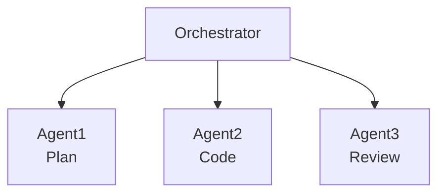
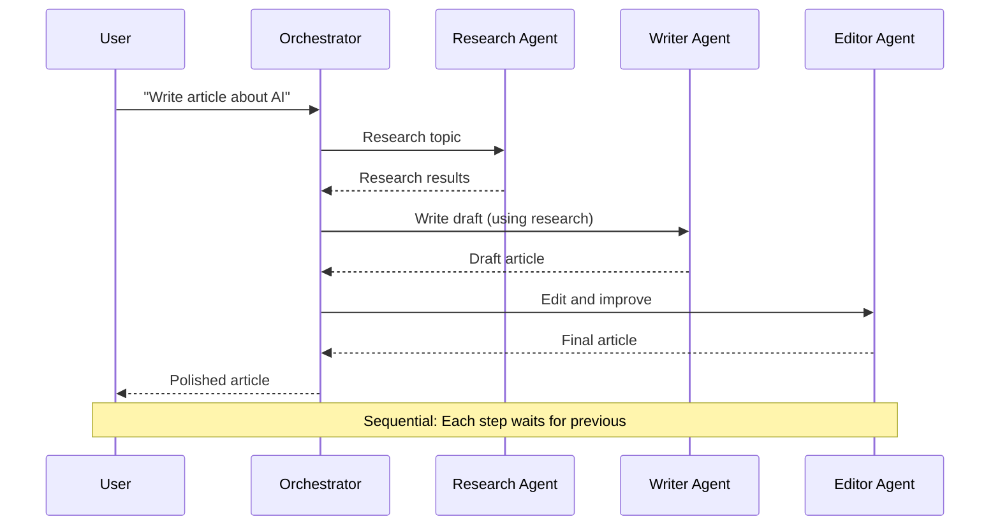
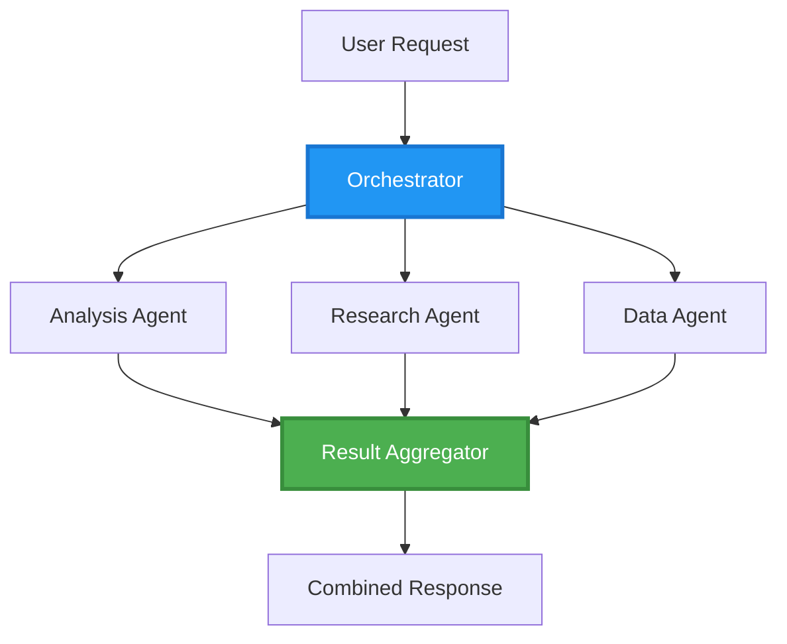
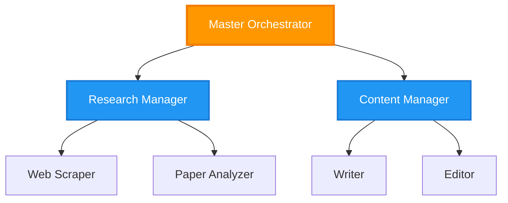
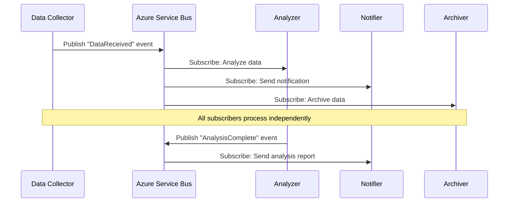
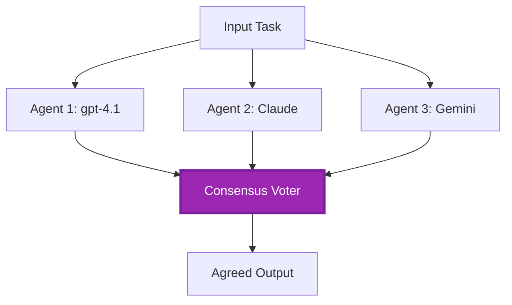
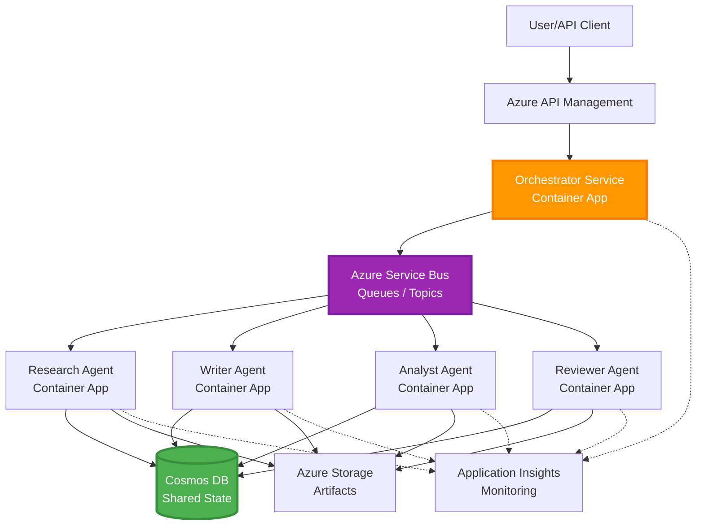

# រចនាប្លង់សម្របសម្រួលភ្នាក់ងារច្រើន

⏱️ **ពេលវេលាប៉ាន់ប្រមាណ**: អាន 60-75 នាទី; ប្រតិបត្តិឡើងវិញរយៈពេលជា​ម៉ោង | 💰 **ថ្លៃចំណាយប៉ាន់ប្រមាណ**: អាស្រ័យលើបនុស្សារង់ការ | ⭐ **កម្រិតស្មុគស្មាញ**: បច្ចេកទេសខ្ពស់

**📚 ផ្លូវការសិក្សា:**
- ← មុន: [ការធ្វើផែនការជំនួយ](capacity-planning.md) - អាល័យទំហំ និងយុទ្ធសាស្ត្រកំណត់និងពង្រីកធនធាន
- 🎯 **អ្នកនៅទីនេះ**: រចនាប្លង់សម្របសម្រួលភ្នាក់ងារច្រើន (ការប្រតិបត្តិ, ទំនាក់ទំនង, ការគ្រប់គ្រងស្ថានភាព)
- → បន្ទាប់: [ជ្រើសរើស SKU](sku-selection.md) - ជ្រើសរើសសេវាកម្ម Azure ត្រឹមត្រូវ
- 🏠 [ទំព័រដើមវគ្គសិក្សា](../../README.md)

---

## អ្វីដែលអ្នកនឹងរៀន

ដោយបញ្ចប់មេរៀននេះ អ្នកនឹង:
- យល់ដឹងអំពី **រចនាប្លង់ស្ថាបត្យកម្មភ្នាក់ងារច្រើន** និងពេលណាដែលត្រូវប្រើវា
- អនុវត្ត **រចនាប្លង់ប្រតិបត្តិ** (ការប្រតិបត្តិមជ្ឈមណ្ឌល, ការប្រតិបត្តិនៅក្រៅមជ្ឈមណ្ឌល, តំបន់លំដាប់)
- រចនាយុទ្ធសាស្ត្រទំនាក់ទំនងរបស់ភ្នាក់ងារ (សម័យវិធី, អសម័យវិធី, ដំណើរប្រតិទិន)
- គ្រប់គ្រង **ស្ថានភាពចែករំលែក** នៅក្នុងភ្នាក់ងារចែកចាយ
- ប្រើ **ប្រព័ន្ធភ្នាក់ងារច្រើន** លើ Azure ជាមួយ AZD
- អនុវត្ត **រចនាប្លង់សម្របសម្រួល** សម្រាប់សកម្មភាព AI ពិតប្រាកដ
- ត្រួតពិនិត្យ និងដោះស្រាយបញ្ហាប្រព័ន្ធភ្នាក់ងារចែកចាយ

## ហេតុអ្វីបានជា សម្របសម្រួលភ្នាក់ងារច្រើនមានសារៈសំខាន់

### ការវិវត្ត: ចេញពីភ្នាក់ងារច្នៃតែមួយទៅភ្នាក់ងារច្រើន

**ភ្នាក់ងារច្នៃតែមួយ (សាមញ្ញ):**
```
User → Agent → Response
```
- ✅ ងាយស្រួលយល់ និងអនុវត្ត
- ✅ លឿនសម្រាប់ភារកិច្ចសាមញ្ញៗ
- ❌ មានកំណត់ដោយសមត្ថភាពម៉ូដែលតែមួយ
- ❌ មិនអាចបែងចែកធ្វើរួមជាការងារច្រើនបាន
- ❌ គ្មានការបម្រើជំនាញពិសេស

**ប្រព័ន្ធភ្នាក់ងារច្រើន (កម្រិតខ្ពស់):**

```mermaid
graph TD
    Orchestrator[Orchestrator] --> Agent1[Agent1<br/>Plan]
    Orchestrator --> Agent2[Agent2<br/>Code]
    Orchestrator --> Agent3[Agent3<br/>Review]
```
- ✅ ភ្នាក់ងារពិសេសសម្រាប់ភារកិច្ចជាក់លាក់ទាំងឡាយ
- ✅ ប្រតិបត្តិការប្រព័ន្ធរួមជាច្រើន ដើម្បីលឿនលឿន
- ✅ មានរចនាសម្ព័ន្ធជាមួយ និងងាយស្រួលថែទាំ
- ✅ ល្អជាងសម្រាប់លំហូរងារលំបាក
- ⚠️ ត្រូវការតម្រូវការសម្របសម្រួល

**ករណីសម្រមៃ**: ភ្នាក់ងារច្នៃតែមួយ គឺដូចជាមនុស្សម្នាក់ធ្វើការទីបំផុត។ ភ្នាក់ងារច្រើនគឺដូចជាក្រុមមនុស្សណាដែលមានជំនាញពិសេសផ្សេងគ្នា (អ្នកស្រាវជ្រាវ, អ្នកកូដ, អ្នកពិនិត្យ, អ្នកសរសេរ) ធ្វើការរួមគ្នា។

---

## រចនាប្លង់សម្របសម្រួលស្នូល

### រចនាប្លង់ទី 1: សម្របសម្រួលតាមលំដាប់ (ខ្សែភាពទំនួលខុសត្រូវ)

**ពេលប្រើ**: ភារកិច្ចត្រូវបញ្ចប់តាមលំដាប់ជាក់លាក់ រាល់ភ្នាក់ងារសាងសង់លើលទ្ធផលមុន


```mermaid
sequenceDiagram
    participant User
    participant Orchestrator
    participant Agent1 as Research Agent
    participant Agent2 as Writer Agent
    participant Agent3 as Editor Agent
    
    User->>Orchestrator: "Write article about AI"
    Orchestrator->>Agent1: Research topic
    Agent1-->>Orchestrator: Research results
    Orchestrator->>Agent2: Write draft (using research)
    Agent2-->>Orchestrator: Draft article
    Orchestrator->>Agent3: Edit and improve
    Agent3-->>Orchestrator: Final article
    Orchestrator-->>User: Polished article
    
    Note over User,Agent3: Sequential: Each step waits for previous
```

**អត្ថប្រយោជន៍:**
- ✅ ចរន្តទិន្នន័យច្បាស់លាស់
- ✅ ងាយស្រួលដោះស្រាយបញ្ហា
- ✅ ជាលំដាប់អាចទុកចិត្តបានក្នុងការអនុវត្ត

**កំណត់ខ្សែ:**
- ❌ យឺតជាង (គ្មានការប្រតិបត្តិបែងចេញ)
- ❌ ការបរាជ័យមួយបេះដូងបិទខ្សែទាំងមូល
- ❌ មិនអាចគ្រប់គ្រងភារកិច្ចដែលពាក់ព័ន្ធគ្នា

**ឧទាហរណ៍ករណីប្រើ:**
- លំហូរ​បង្កើតមាតិកា (ស្រាវជ្រាវ → សរសេរ → កែសម្រួល → បោះពុម្ភ)
- ការបង្កើតកូដ (ផែនការ → អនុវត្ត → សាកល្បង → ផុស)
- ការបង្កើតរបាយការណ៍ (ប្រមូលទិន្នន័យ → វិភាគ → ធ្វើរូបភាព → សង្ខេប)

---

### រចនាប្លង់ទី 2: សម្របសម្រួលរួម (Fan-Out/Fan-In)

**ពេលប្រើ**: ភារកិច្ចឯករាជ្យអាចដំណើរការជាមួយគ្នា លទ្ធផលត្រូវសម្រុកនៅចុងក្រោយ


```mermaid
graph TB
    User[User Request]
    Orchestrator[Orchestrator]
    Agent1[Analysis Agent]
    Agent2[Research Agent]
    Agent3[Data Agent]
    Aggregator[Result Aggregator]
    Response[Combined Response]
    
    User --> Orchestrator
    Orchestrator --> Agent1
    Orchestrator --> Agent2
    Orchestrator --> Agent3
    Agent1 --> Aggregator
    Agent2 --> Aggregator
    Agent3 --> Aggregator
    Aggregator --> Response
    
    style Orchestrator fill:#2196F3,stroke:#1976D2,stroke-width:3px,color:#fff
    style Aggregator fill:#4CAF50,stroke:#388E3C,stroke-width:3px,color:#fff
```

**អត្ថប្រយោជន៍:**
- ✅ លឿន (ប្រតិបត្តិការប្រព័ន្ធរួម)
- ✅ អាចទប់ទល់កំហុសបាន (លទ្ធផលមួយផ្នែកអាចទទួលយកបាន)
- ✅ ពង្រីកផ្ទុកដំណាលផ្នែកទូលំទូលាយ

**កំណត់ខ្សែ:**
- ⚠️ លទ្ធផលអាចមកមិនទៀងទាត់សៀង
- ⚠️ ត្រូវមានយុទ្ធសាស្ត្រសម្រង់
- ⚠️ ការគ្រប់គ្រងស្ថានភាពស្មុគស្មាញ

**ឧទាហរណ៍ករណីប្រើ:**
- ការប្រមូលទិន្នន័យពីច្រើនប្រភព (APIs + មូលដ្ឋានទិន្នន័យ + រុករកគេហទំព័រ)
- ការវិភាគប្រកួតប្រជែង (ម៉ូដែលច្រើនបង្កើតដំណោះស្រាយ, ជ្រើសរើសល្អបំផុត)
- សេវាផ្លាស់បម្លែងភាសា (បកប្រែជាភាសាជាច្រើននៅពេលតែមួយ)

---

### រចនាប្លង់ទី 3: សម្របសម្រួលតាមលំដាប់តម្លាភាព (អ្នកគ្រប់គ្រង-កម្មករ)

**ពេលប្រើ**: លំហូរងារលំបាកមានភារកិច្ចរង, តម្រូវការបែងចែកភារកិច្ច


```mermaid
graph TB
    Master[Master Orchestrator]
    Manager1[Research Manager]
    Manager2[Content Manager]
    W1[Web Scraper]
    W2[Paper Analyzer]
    W3[Writer]
    W4[Editor]
    
    Master --> Manager1
    Master --> Manager2
    Manager1 --> W1
    Manager1 --> W2
    Manager2 --> W3
    Manager2 --> W4
    
    style Master fill:#FF9800,stroke:#F57C00,stroke-width:3px,color:#fff
    style Manager1 fill:#2196F3,stroke:#1976D2,stroke-width:2px,color:#fff
    style Manager2 fill:#2196F3,stroke:#1976D2,stroke-width:2px,color:#fff
```

**អត្ថប្រយោជន៍:**
- ✅ អាចគ្រប់គ្រងលំហូរងារលំបាក
- ✅ មានរចនាសម្ព័ន្ធរឹងមាំ និងងាយស្រួលថែទាំ
- ✅ មានការបែងចែកការទទួលខុសត្រូវច្បាស់លាស់

**កំណត់ខ្សែ:**
- ⚠️ រចនាសម្ព័ន្ធស្មុគស្មាញជាង
- ⚠️ លម្ង៉ាត់ខ្ពស់ជាង (ស្រទាប់សម្របសម្រួលច្រើន)
- ⚠️ តម្រូវការប្រតិបត្តិការមធ្យម

**ឧទាហរណ៍ករណីប្រើ:**
- ការដំណើរការឯកសារអាជីវកម្ម (ចាត់ថ្នាក់ → ផ្ញើ → ដំណើរការ → ផ្ទុក)
- លំហូរទិន្នន័យជាច្រើនដំណាក់កាល (បញ្ចូល → សម្អាត → បម្លែង → ធ្វើវិភាគ → របាយការណ៍)
- លំហូរអូតូម៉ាទិចស្មុគស្មាញ (ផែនការ → ចែកចាយធនធាន → ប្រតិបត្តិការ → ត្រួតពិនិត្យ)

---

### រចនាប្លង់ទី 4: សម្របសម្រួលដោយបណ្ដាលមេរោគ (ផ្សព្វផ្សាយ-ជាវ)

**ពេលប្រើ**: ភ្នាក់ងារត្រូវឆ្លើយតបទៅហេតុការណ៍, ត្រូវការតំណករភាពតិច


```mermaid
sequenceDiagram
    participant Agent1 as Data Collector
    participant EventBus as Azure Service Bus
    participant Agent2 as Analyzer
    participant Agent3 as Notifier
    participant Agent4 as Archiver
    
    Agent1->>EventBus: Publish "DataReceived" event
    EventBus->>Agent2: Subscribe: Analyze data
    EventBus->>Agent3: Subscribe: Send notification
    EventBus->>Agent4: Subscribe: Archive data
    
    Note over Agent1,Agent4: All subscribers process independently
    
    Agent2->>EventBus: Publish "AnalysisComplete" event
    EventBus->>Agent3: Subscribe: Send analysis report
```

**អត្ថប្រយោជន៍:**
- ✅ មានការតំណករភាពតិចនៅចន្លោះភ្នាក់ងារ
- ✅ ងាយបន្ថែមភ្នាក់ងារថ្មី (គ្រាន់តែជាវ)
- ✅ ដំណើរការអសម័យវិធី
- ✅ មានភាពរឹងមាំ (រក្សាទុកសារជារៀងរាល់)

**កំណត់ខ្សែ:**
- ⚠️ មានភាពជាប់ទាក់ទងមួយថ្ងៃ
- ⚠️ ការកំណត់បញ្ហាដោះស្រាយកម្រិតខ្ពស់
- ⚠️ ការរៀបចំលំដាប់សារលំបាក

**ឧទាហរណ៍ករណីប្រើ:**
- ប្រព័ន្ធត្រួតពិនិត្យពេលវេលាលើកលែង (ការជូនដំណឹង, ដាសប៊ូត, កំណត់ហេតុ)
- ការជូនដំណឹងក្នុងបណ្ដាញ (អ៊ីមែល, SMS, ការជូនដំណឹង, Slack)
- លំហូរប្រតិបត្តិទិន្នន័យ (អ្នកបរិភោគជាច្រើននៃទិន្នន័យដូចគ្នា)

---

### រចនាប្លង់ទី 5: សម្របសម្រួលដោយការយល់ព្រម (បោះឆ្នោត/ចំនួនគណៈកម្មការ)

**ពេលប្រើ**: ត្រូវការយល់ព្រមពីភ្នាក់ងារច្រើន មុនបន្ត


```mermaid
graph TB
    Input[Input Task]
    Agent1[Agent 1: gpt-4.1]
    Agent2[Agent 2: Claude]
    Agent3[Agent 3: Gemini]
    Voter[Consensus Voter]
    Output[Agreed Output]
    
    Input --> Agent1
    Input --> Agent2
    Input --> Agent3
    Agent1 --> Voter
    Agent2 --> Voter
    Agent3 --> Voter
    Voter --> Output
    
    style Voter fill:#9C27B0,stroke:#7B1FA2,stroke-width:3px,color:#fff
```

**អត្ថប្រយោជន៍:**
- ✅ ភាពត្រឹមត្រូវខ្ពស់ (យោបល់ជាច្រើន)
- ✅ អាចទប់ទល់កំហុសបាន (ការបរាជ័យតិចតួចអាចទទួលយកបាន)
- ✅ មានការធានាគុណភាពក្នុងខ្លួន

**កំណត់ខ្សែ:**
- ❌ តម្លៃថ្លៃ (ហៅម៉ូដែលជាច្រើន)
- ❌ យឺតជាង (រង់ចាំភ្នាក់ងារទាំងអស់)
- ⚠️ ត្រូវការដោះស្រាយបញ្ហាគ្នានឹងស្របលំដាប់

**ឧទាហរណ៍ករណីប្រើ:**
- ការត្រួតពិនិត្យមាតិកា (ម៉ូដែលជាច្រើនពិនិត្យមាតិកា)
- ការត្រួតពិនិត្យកូដ (เครื่องផ្គត់ផ្គង់និរិហ្យ/វិភាគថ្នាក់ច្រើន)
- ការវាយតម្លៃវេជ្ជសាស្ត្រ (ម៉ូដែល AI ជាច្រើន, ផ្ទៀងផ្ទាត់អ្នកជំនាញ)

---

## ទិដ្ឋភាពស្ថាបត្យកម្ម

### ប្រព័ន្ធភ្នាក់ងារច្រើនពេញលេញលើ Azure


```mermaid
graph TB
    User[User/API Client]
    APIM[Azure API Management]
    Orchestrator[Orchestrator Service<br/>Container App]
    ServiceBus[Azure Service Bus<br/>Queues / Topics]
    
    Agent1[Research Agent<br/>Container App]
    Agent2[Writer Agent<br/>Container App]
    Agent3[Analyst Agent<br/>Container App]
    Agent4[Reviewer Agent<br/>Container App]
    
    CosmosDB[(Cosmos DB<br/>Shared State)]
    Storage[Azure Storage<br/>Artifacts]
    AppInsights[Application Insights<br/>Monitoring]
    
    User --> APIM
    APIM --> Orchestrator
    
    Orchestrator --> ServiceBus
    ServiceBus --> Agent1
    ServiceBus --> Agent2
    ServiceBus --> Agent3
    ServiceBus --> Agent4
    
    Agent1 --> CosmosDB
    Agent2 --> CosmosDB
    Agent3 --> CosmosDB
    Agent4 --> CosmosDB
    
    Agent1 --> Storage
    Agent2 --> Storage
    Agent3 --> Storage
    Agent4 --> Storage
    
    Orchestrator -.-> AppInsights
    Agent1 -.-> AppInsights
    Agent2 -.-> AppInsights
    Agent3 -.-> AppInsights
    Agent4 -.-> AppInsights
    
    style Orchestrator fill:#FF9800,stroke:#F57C00,stroke-width:3px,color:#fff
    style ServiceBus fill:#9C27B0,stroke:#7B1FA2,stroke-width:3px,color:#fff
    style CosmosDB fill:#4CAF50,stroke:#388E3C,stroke-width:3px,color:#fff
```

**ផ្សេងៗសំខាន់ៗ:**

| ផ្នែក | គោលបំណង | សេវាកម្ម Azure |
|-----------|---------|---------------|
| **API Gateway** | ច្រកចូល, កំណត់អត្រា, អត់ភាព | API Management |
| **Orchestrator** | សម្របសម្រួលលំហូររបស់ភ្នាក់ងារ | Container Apps |
| **Message Queue** | ទំនាក់ទំនងអសម័យវិធី | Service Bus / Event Hubs |
| **Agents** | ភ្នាក់ងារ AI ពិសេស | Container Apps / Functions |
| **State Store** | ស្ថានភាព ចែករំលែក និងតាមដានភារកិច្ច | Cosmos DB |
| **Artifact Storage** | ឯកសារ, លទ្ធផល, កំណត់ហេតុ | Blob Storage |
| **Monitoring** | តាមដានការចែកចាយ និងកំណត់ហេតុ | Application Insights |

Service Bus queues/topics និង Event Hubs គឺជាសេវាកម្មផ្សេងៗ មានគំរូការដឹកជញ្ជូន/ប្រើប្រាស់ផ្សេងៗ; Event Hubs មិនមែនជាផ្ទេរទៅសម្រាប់កូដកម្មវិធី Service Bus ព្រោះពួកវាត្រូវការដំណើរការផ្សេងគ្នា។ ការប្រតិបត្តិច្រើន, សារត្រូវរក្សាទុក និងការបោះឆ្នោតម៉ូដែល មិនទាន់ធានាថាចំពោះការពារកំហុស ឬភាពត្រឹមត្រូវខ្ពស់ឡើយ។

---

## ស្វែងយល់តម្រូវការ

### ឧបករណ៍ត្រូវការ

```bash
# Verify Azure Developer CLI
azd version
# Command reference baseline: azd 1.37.2

# Verify Azure CLI
az --version
# ✅ Expected: azure-cli 2.50.0 or higher

# Verify Docker (for local testing)
docker --version
# ✅ Expected: Docker version 20.10 or higher
```

### តម្រូវការអោយបានលើ Azure

- មានការជាវប្រើប្រាស់សកម្ម Azure
- សិទ្ធសម្រាប់បង្កើត:
  - Container Apps
  - Service Bus namespaces
  - Cosmos DB accounts
  - Storage accounts
  - Application Insights

### ចំណេះដឹងត្រូវការ

អ្នកគួរត្រូវបានបញ្ចប់:
- [ការគ្រប់គ្រងការកំណត់រចនា](../chapter-03-configuration/configuration.md)
- [ការផ្ទៀងផ្ទាត់ និងសុវត្ថិភាព](../chapter-03-configuration/authsecurity.md)
- [ឧទាហរណ៍ Microservices](../../../../examples/microservices)

---

## មេរៀនអនុវត្ត

> **សំណុំរចនាប្លង់ មិនមែនពហុកម្មវិធីត្រឹមត្រូវអនុវត្តបានផ្ដាច់មុខទេ:** រចនាសម្ព័ន្ធគម្រោង និងស្លាក `File:` ខាងក្រោមពណ៌នាឯកសារដើម្បីបង្កើតក្នុងគម្រោងរបស់អ្នកដោយខ្លួនឯង; ហ្គីតបណ្តាញនេះមិនមានកម្មវិធី `multi-agent-system` ពេញលេញទេ។ ផ្នែកខ្វះរួមមានគំរូមេ/ពេរ៉ាម៉ែត្រ, បរិស្ថាន Container Apps/ប្រព័ន្ធឃ្លាំង, Dockerfiles និងការចងចាំការពឹងផ្អែក, ការតំឡើងមូលដ្ឋានទិន្នន័យ Cosmos, ការបញ្ចុះម៉ូដែល, ការកំណត់អត្តសញ្ញាណ/តួ, វិធានការពង្រីក និងកម្មកររួម/ជួរដំណើរការ។ កុំរំពឹងថា `azd init` នឹងបង្កើតឯកសារទាំងនេះ ឬ `azd up` នឹងដាក់ឧទាហរណ៍មិនផ្លាស់ប្តូរជូន។ សម្រាប់ចំណុចចាប់ផ្តើមអាចអនុវត្តបាន សូមបញ្ចប់ [មូលដ្ឋានភ្នាក់ងារច្រើន](../chapter-05-multi-agent/multi-agent-basics.md)។

**ការជំនឿដំណើរការ:** Python 3.10+, `azure-servicebus`, `azure-cosmos`, `openai`, Flask និង (សម្រាប់ត្រួតពិនិត្យ) `azure-monitor-opentelemetry`; បញ្ចូល `shared` នៅលើផ្លូវនាំចូល Python ក្នុងរូបភាពសេវាកម្មនីមួយៗ។ គុងតាំង Cosmos `agent-state/tasks` ត្រូវមានរួចជាមួយកូនសោបែងចែក `/id`។ ការតភ្ជាប់ដោយមូលដ្ឋានកូនសោជាចម្បងធ្វើឲ្យសំណុំរចនាប្លង់នេះងាយស្រួល មិនមែនជាការណែនាំប្រើប្រាស់ក្នុងផលិតកម្មទេ: ចូលចិត្តអត្តសញ្ញាណគ្រប់គ្រងដែលមានតួនាទីខ្ពស់លើ Service Bus/Cosmos/OpenAI កម្រិតទិន្នន័យផែនការ។ កុំបង្ហាញកូនសោក្នុងលទ្ធផលឬកំណត់ហេតុ។

ការដឹកជញ្ជូន Service Bus គឺ **យ៉ាងហោចណាស់ម្តងទៀត**។ រក្សាមិនឲ្យមានការតវ៉ាតាមភារកិច្ច **និងជំហាន**, ប្រើការប្រកួតប្រជែងអុកមាតិកា (ETags) សម្រាប់អាន/កែប្រែ/សរសេរស្ថានភាព ហើយបន្តផ្លូវចាក់សោសារនៅពេលដំណើរការយូរ។ កម្មវិធីគ្រប់គ្រងស្ថានភាពសាមញ្ញខាងក្រោមគឺអនុវត្តតែជាលំដាប់តែម្ដង និងមិនមានការធានាផលិតកម្មទាំងនេះទេ។

### រចនាសម្ព័ន្ធគម្រោង

```
multi-agent-system/
├── azure.yaml                    # AZD configuration
├── infra/
│   ├── main.bicep               # Main infrastructure
│   ├── core/
│   │   ├── servicebus.bicep     # Message queue
│   │   ├── cosmos.bicep         # State store
│   │   ├── storage.bicep        # Artifact storage
│   │   └── monitoring.bicep     # Application Insights
│   └── app/
│       ├── orchestrator.bicep   # Orchestrator service
│       └── agent.bicep          # Agent template
└── src/
    ├── orchestrator/            # Orchestration logic
    │   ├── app.py
    │   ├── workflows.py
    │   └── Dockerfile
    ├── agents/
    │   ├── research/            # Research agent
    │   ├── writer/              # Writer agent
    │   ├── analyst/             # Analyst agent
    │   └── reviewer/            # Reviewer agent
    └── shared/
        ├── state_manager.py     # Shared state logic
        └── message_handler.py   # Message handling
```

---

## មេរៀនទី 1: រចនាប្លង់សម្របសម្រួលតាមលំដាប់

### អនុវត្ត: លំហូរចម្លងមាតិកា

យើងនឹងរចនាលំហូរតាមលំដាប់: ស្រាវជ្រាវ → សរសេរ → កែសម្រួល។ ការបោះពុម្ភនៅក្រៅឧទាហរណ៍នេះ។

### 1. ការកំណត់ AZD

**ឯកសារ: `azure.yaml`**

```yaml
name: content-pipeline
metadata:
  template: multi-agent-sequential@1.0.0

services:
  orchestrator:
    project: ./src/orchestrator
    language: python
    host: containerapp
  
  research-agent:
    project: ./src/agents/research
    language: python
    host: containerapp
  
  writer-agent:
    project: ./src/agents/writer
    language: python
    host: containerapp
  
  editor-agent:
    project: ./src/agents/editor
    language: python
    host: containerapp
```

### 2. រចនាសម្ព័ន្ធ៖ Service Bus សម្រាប់សម្របសម្រួល

**ឯកសារ: `infra/core/servicebus.bicep`**

```bicep
param name string
param location string
param tags object = {}

resource serviceBusNamespace 'Microsoft.ServiceBus/namespaces@2022-10-01-preview' = {
  name: name
  location: location
  tags: tags
  sku: {
    name: 'Standard'
    tier: 'Standard'
  }
  properties: {
    minimumTlsVersion: '1.2'
  }
}

// Queue for orchestrator → research agent
resource researchQueue 'Microsoft.ServiceBus/namespaces/queues@2022-10-01-preview' = {
  parent: serviceBusNamespace
  name: 'research-tasks'
  properties: {
    maxDeliveryCount: 3
    lockDuration: 'PT5M'
    deadLetteringOnMessageExpiration: true
  }
}

// Queue for research agent → writer agent
resource writerQueue 'Microsoft.ServiceBus/namespaces/queues@2022-10-01-preview' = {
  parent: serviceBusNamespace
  name: 'writer-tasks'
  properties: {
    maxDeliveryCount: 3
    lockDuration: 'PT5M'
  }
}

// Queue for writer agent → editor agent
resource editorQueue 'Microsoft.ServiceBus/namespaces/queues@2022-10-01-preview' = {
  parent: serviceBusNamespace
  name: 'editor-tasks'
  properties: {
    maxDeliveryCount: 3
    lockDuration: 'PT5M'
  }
}

output namespace string = serviceBusNamespace.name
// Do not output RootManageSharedAccessKey. Resolve scoped credentials
// securely or use managed identity in the application and scale rules.
```

### 3. គ្រប់គ្រងស្ថានភាពចែករំលែក

**ឯកសារ: `src/shared/state_manager.py`**

```python
from azure.cosmos import CosmosClient, PartitionKey
from datetime import datetime, timezone
import os

class StateManager:
    """Manages shared state across agents using Cosmos DB"""
    
    def __init__(self):
        endpoint = os.environ['COSMOS_ENDPOINT']
        key = os.environ['COSMOS_KEY']
        
        self.client = CosmosClient(endpoint, key)
        self.database = self.client.get_database_client('agent-state')
        self.container = self.database.get_container_client('tasks')
    
    def create_task(self, task_id: str, task_type: str, input_data: dict):
        """Create a new task"""
        task = {
            'id': task_id,
            'type': task_type,
            'status': 'pending',
            'input': input_data,
            'created_at': datetime.now(timezone.utc).isoformat(),
            'steps': []
        }
        self.container.create_item(task)
        return task
    
    def update_task_step(self, task_id: str, step_name: str, result: dict):
        """Update task with completed step"""
        task = self.container.read_item(task_id, partition_key=task_id)
        
        task['steps'].append({
            'name': step_name,
            'completed_at': datetime.now(timezone.utc).isoformat(),
            'result': result
        })
        
        self.container.replace_item(task_id, task)
        return task
    
    def complete_task(self, task_id: str, final_result: dict):
        """Mark task as complete"""
        task = self.container.read_item(task_id, partition_key=task_id)
        task['status'] = 'completed'
        task['result'] = final_result
        task['completed_at'] = datetime.now(timezone.utc).isoformat()
        self.container.replace_item(task_id, task)
        return task
    
    def get_task(self, task_id: str):
        """Retrieve task state"""
        return self.container.read_item(task_id, partition_key=task_id)
```

### 4. សេវាប្រតិបត្តិការ Orchestrator

**ឯកសារ: `src/orchestrator/app.py`**

```python
from flask import Flask, request, jsonify
from azure.servicebus import ServiceBusClient, ServiceBusMessage
import json
import uuid
import os
from shared.state_manager import StateManager

app = Flask(__name__)
state_manager = StateManager()

# Service Bus connection
servicebus_connection_str = os.environ['SERVICEBUS_CONNECTION_STRING']
servicebus_client = ServiceBusClient.from_connection_string(servicebus_connection_str)

@app.route('/health', methods=['GET'])
def health():
    return jsonify({'status': 'healthy', 'service': 'orchestrator'})

@app.route('/create-content', methods=['POST'])
def create_content():
    """
    Sequential workflow: Research → Write → Edit (returns a draft; no publishing)
    """
    data = request.get_json(silent=True) or {}
    topic = data.get('topic')
    
    if not topic:
        return jsonify({'error': 'Topic required'}), 400
    
    # Create task in state store
    task_id = str(uuid.uuid4())
    task = state_manager.create_task(
        task_id=task_id,
        task_type='content_creation',
        input_data={'topic': topic}
    )
    
    # Send message to research agent (first step)
    sender = servicebus_client.get_queue_sender('research-tasks')
    message = ServiceBusMessage(
        body=json.dumps({
            'task_id': task_id,
            'topic': topic,
            'next_queue': 'writer-tasks'  # Where to send results
        }),
        content_type='application/json'
    )
    
    with sender:
        sender.send_messages(message)
    
    return jsonify({
        'task_id': task_id,
        'status': 'started',
        'workflow': 'sequential',
        'steps': ['research', 'write', 'edit'],
        'message': 'Content creation pipeline initiated'
    }), 202

@app.route('/task/<task_id>', methods=['GET'])
def get_task_status(task_id):
    """Check task status"""
    try:
        task = state_manager.get_task(task_id)
        return jsonify(task)
    except Exception as e:
        return jsonify({'error': str(e)}), 404

if __name__ == '__main__':
    app.run(host='0.0.0.0', port=8080)
```

### 5. ភ្នាក់ងារស្រាវជ្រាវ

**ឯកសារ: `src/agents/research/app.py`**

```python
from azure.servicebus import ServiceBusClient, ServiceBusMessage
from openai import AzureOpenAI
import json
import os
import time
from shared.state_manager import StateManager

# Initialize clients
state_manager = StateManager()
servicebus_client = ServiceBusClient.from_connection_string(
    os.environ['SERVICEBUS_CONNECTION_STRING']
)

openai_client = AzureOpenAI(
    api_key=os.environ['AZURE_OPENAI_API_KEY'],
    api_version="2024-10-21",
    azure_endpoint=os.environ['AZURE_OPENAI_ENDPOINT']
)

def process_research_task(message_data):
    """Process research request and pass to writer"""
    task_id = message_data['task_id']
    topic = message_data['topic']
    next_queue = message_data['next_queue']
    
    print(f"🔬 Researching: {topic}")
    
    # Call Microsoft Foundry Models for research
    response = openai_client.chat.completions.create(
        model=os.environ['AZURE_OPENAI_DEPLOYMENT'],
        messages=[
            {"role": "system", "content": "You are a research assistant. Provide comprehensive research on the given topic."},
            {"role": "user", "content": f"Research this topic thoroughly: {topic}"}
        ],
        max_tokens=1500
    )
    
    research_results = response.choices[0].message.content
    
    # Update state
    state_manager.update_task_step(
        task_id=task_id,
        step_name='research',
        result={'research': research_results}
    )
    
    # Send to next agent (writer)
    sender = servicebus_client.get_queue_sender(next_queue)
    message = ServiceBusMessage(
        body=json.dumps({
            'task_id': task_id,
            'topic': topic,
            'research': research_results,
            'next_queue': 'editor-tasks'
        }),
        content_type='application/json'
    )
    
    with sender:
        sender.send_messages(message)
    
    print(f"✅ Research complete for task {task_id}")

def main():
    """Listen to research queue"""
    receiver = servicebus_client.get_queue_receiver('research-tasks')
    
    print("🔬 Research Agent started, listening for tasks...")
    
    with receiver:
        while True:
            messages = receiver.receive_messages(max_wait_time=5)
            for message in messages:
                try:
                    message_data = json.loads(str(message))
                    process_research_task(message_data)
                    receiver.complete_message(message)
                except Exception as e:
                    print(f"❌ Error processing message: {e}")
                    receiver.abandon_message(message)

if __name__ == '__main__':
    main()
```

### 6. ភ្នាក់ងារសរសេរ

**ឯកសារ: `src/agents/writer/app.py`**

```python
from azure.servicebus import ServiceBusClient, ServiceBusMessage
from openai import AzureOpenAI
import json
import os
from shared.state_manager import StateManager

state_manager = StateManager()
servicebus_client = ServiceBusClient.from_connection_string(
    os.environ['SERVICEBUS_CONNECTION_STRING']
)

openai_client = AzureOpenAI(
    api_key=os.environ['AZURE_OPENAI_API_KEY'],
    api_version="2024-10-21",
    azure_endpoint=os.environ['AZURE_OPENAI_ENDPOINT']
)

def process_writing_task(message_data):
    """Write article based on research"""
    task_id = message_data['task_id']
    topic = message_data['topic']
    research = message_data['research']
    next_queue = message_data['next_queue']
    
    print(f"✍️ Writing article: {topic}")
    
    # Call Microsoft Foundry Models to write article
    response = openai_client.chat.completions.create(
        model=os.environ['AZURE_OPENAI_DEPLOYMENT'],
        messages=[
            {"role": "system", "content": "You are a professional writer. Write engaging, well-structured articles."},
            {"role": "user", "content": f"Based on this research:\n\n{research}\n\nWrite a comprehensive article about: {topic}"}
        ],
        max_tokens=2000
    )
    
    article_draft = response.choices[0].message.content
    
    # Update state
    state_manager.update_task_step(
        task_id=task_id,
        step_name='writing',
        result={'draft': article_draft}
    )
    
    # Send to editor
    sender = servicebus_client.get_queue_sender(next_queue)
    message = ServiceBusMessage(
        body=json.dumps({
            'task_id': task_id,
            'topic': topic,
            'draft': article_draft
        }),
        content_type='application/json'
    )
    
    with sender:
        sender.send_messages(message)
    
    print(f"✅ Article draft complete for task {task_id}")

def main():
    """Listen to writer queue"""
    receiver = servicebus_client.get_queue_receiver('writer-tasks')
    
    print("✍️ Writer Agent started, listening for tasks...")
    
    with receiver:
        while True:
            messages = receiver.receive_messages(max_wait_time=5)
            for message in messages:
                try:
                    message_data = json.loads(str(message))
                    process_writing_task(message_data)
                    receiver.complete_message(message)
                except Exception as e:
                    print(f"❌ Error: {e}")
                    receiver.abandon_message(message)

if __name__ == '__main__':
    main()
```

### 7. ភ្នាក់ងារកែសម្រួល

**ឯកសារ: `src/agents/editor/app.py`**

```python
from azure.servicebus import ServiceBusClient
from openai import AzureOpenAI
import json
import os
from shared.state_manager import StateManager

state_manager = StateManager()
servicebus_client = ServiceBusClient.from_connection_string(
    os.environ['SERVICEBUS_CONNECTION_STRING']
)

openai_client = AzureOpenAI(
    api_key=os.environ['AZURE_OPENAI_API_KEY'],
    api_version="2024-10-21",
    azure_endpoint=os.environ['AZURE_OPENAI_ENDPOINT']
)

def process_editing_task(message_data):
    """Edit and finalize article"""
    task_id = message_data['task_id']
    topic = message_data['topic']
    draft = message_data['draft']
    
    print(f"📝 Editing article: {topic}")
    
    # Call Microsoft Foundry Models to edit
    response = openai_client.chat.completions.create(
        model=os.environ['AZURE_OPENAI_DEPLOYMENT'],
        messages=[
            {"role": "system", "content": "You are an expert editor. Improve grammar, clarity, and structure."},
            {"role": "user", "content": f"Edit and improve this article:\n\n{draft}"}
        ],
        max_tokens=2000
    )
    
    final_article = response.choices[0].message.content
    
    # Mark task as complete
    state_manager.complete_task(
        task_id=task_id,
        final_result={
            'topic': topic,
            'final_article': final_article,
            'word_count': len(final_article.split())
        }
    )
    
    print(f"✅ Article finalized for task {task_id}")

def main():
    """Listen to editor queue"""
    receiver = servicebus_client.get_queue_receiver('editor-tasks')
    
    print("📝 Editor Agent started, listening for tasks...")
    
    with receiver:
        while True:
            messages = receiver.receive_messages(max_wait_time=5)
            for message in messages:
                try:
                    message_data = json.loads(str(message))
                    process_editing_task(message_data)
                    receiver.complete_message(message)
                except Exception as e:
                    print(f"❌ Error: {e}")
                    receiver.abandon_message(message)

if __name__ == '__main__':
    main()
```

### 8. ដាក់ស្នូល និងសាកល្បង

ពាក្យបញ្ជាខាងលើប្រើប្រាស់ **បន្ទាប់ពីអ្នកអនុវត្តឯកសារខ្វះគម្រោង** តែប៉ុណ្ណោះ។ ការចាប់ផ្តើមភ្នាក់ងារ Foundry មានប្រតិបត្តិការផ្សេង; វាមិនបង្កើតរចនាប្លង់ Service Bus នេះទេ។

```bash
# In your completed custom project
azd up

# Alternative in a SEPARATE empty folder (agents beta.23 requires azd >= 1.37)
azd extension install azure.ai.agents
azd ai agent init
azd up
```

> សូមមើល [ពាក្យបញ្ជារ AZD AI CLI](../chapter-08-production/production-ai-practices.md#azd-ai-cli-commands-and-extensions) សម្រាប់ `azd ai` ទាំងអស់។

```bash
# Get orchestrator URL
ORCHESTRATOR_URL=$(azd env get-values | grep ORCHESTRATOR_URL | cut -d '=' -f2 | tr -d '"')

# Create content
curl -X POST $ORCHESTRATOR_URL/create-content \
  -H "Content-Type: application/json" \
  -d '{"topic": "The Future of AI in Healthcare"}'
```

**✅ លទ្ធផលអាចទន្ទឹមយល់:**
```json
{
  "task_id": "a1b2c3d4-e5f6-7890-abcd-ef1234567890",
  "status": "started",
  "workflow": "sequential",
  "steps": ["research", "write", "edit"],
  "message": "Content creation pipeline initiated"
}
```

**ពិនិត្យមើលដំណើរការភារកិច្ច:**
```bash
TASK_ID="a1b2c3d4-e5f6-7890-abcd-ef1234567890"
curl $ORCHESTRATOR_URL/task/$TASK_ID
```

**✅ លទ្ធផលអាចទន្ទឹមយល់ (បានបញ្ចប់):**
```json
{
  "id": "a1b2c3d4-e5f6-7890-abcd-ef1234567890",
  "type": "content_creation",
  "status": "completed",
  "steps": [
    {
      "name": "research",
      "completed_at": "2025-11-19T10:30:00Z",
      "result": {"research": "..."}
    },
    {
      "name": "writing",
      "completed_at": "2025-11-19T10:32:00Z",
      "result": {"draft": "..."}
    }
  ],
  "result": {
    "topic": "The Future of AI in Healthcare",
    "final_article": "...",
    "word_count": 1500
  }
}
```

---

## មេរៀនទី 2: រចនាប្លង់សម្របសម្រួលរួម

### អនុវត្ត: អ្នកសម្រង់ស្រាវជ្រាវប្រភពច្រើន

យើងនឹងបង្កើតប្រព័ន្ធរួមដែលប្រមូលព័ត៌មានពីប្រភពច្រើនគ្នានៅពេលតែមួយ។

### Orchestrator រួម

**ឯកសារ: `src/orchestrator/parallel_workflow.py`**

```python
from flask import Flask, request, jsonify
from azure.servicebus import ServiceBusClient, ServiceBusMessage
import json
import uuid
import os
from shared.state_manager import StateManager

app = Flask(__name__)
state_manager = StateManager()

servicebus_client = ServiceBusClient.from_connection_string(
    os.environ['SERVICEBUS_CONNECTION_STRING']
)

@app.route('/research-parallel', methods=['POST'])
def research_parallel():
    """
    Parallel workflow: Multiple agents work simultaneously
    """
    data = request.json
    query = data.get('query')
    
    task_id = str(uuid.uuid4())
    task = state_manager.create_task(
        task_id=task_id,
        task_type='parallel_research',
        input_data={
            'query': query,
            'agents': ['web', 'academic', 'news', 'social']
        }
    )
    
    # Fan-out: publish sequentially; workers may process concurrently.
    agents = [
        ('web-research-queue', 'web'),
        ('academic-research-queue', 'academic'),
        ('news-research-queue', 'news'),
        ('social-research-queue', 'social')
    ]
    
    for queue_name, agent_type in agents:
        sender = servicebus_client.get_queue_sender(queue_name)
        message = ServiceBusMessage(
            body=json.dumps({
                'task_id': task_id,
                'query': query,
                'agent_type': agent_type,
                'result_queue': 'aggregation-queue'
            }),
            content_type='application/json'
        )
        
        with sender:
            sender.send_messages(message)
    
    return jsonify({
        'task_id': task_id,
        'status': 'started',
        'workflow': 'parallel',
        'agents_dispatched': 4,
        'message': 'Parallel research initiated'
    }), 202

if __name__ == '__main__':
    app.run(host='0.0.0.0', port=8080)
```

### យុទ្ធសាស្ត្រសម្រង់

**ឯកសារ: `src/agents/aggregator/app.py`**

```python
from azure.servicebus import ServiceBusClient
import json
import os
from collections import defaultdict
from shared.state_manager import StateManager

state_manager = StateManager()
servicebus_client = ServiceBusClient.from_connection_string(
    os.environ['SERVICEBUS_CONNECTION_STRING']
)

# Single-process demo only: not durable or shared across replicas.
# Production: use durable unique (task_id, agent_type) result records.
task_results = defaultdict(dict)
expected_agents = 4  # web, academic, news, social

def process_result(message_data):
    """Aggregate results from parallel agents"""
    task_id = message_data['task_id']
    agent_type = message_data['agent_type']
    result = message_data['result']
    
    # Store result
    task_results[task_id][agent_type] = {
        'agent': agent_type,
        'data': result
    }
    
    print(f"📊 Received result from {agent_type} agent ({len(task_results[task_id])}/{expected_agents})")
    
    # Check if all agents completed (fan-in)
    if len(task_results[task_id]) == expected_agents:
        print(f"✅ All agents completed for task {task_id}. Aggregating...")
        
        # Combine results
        aggregated = {
            'query': message_data['query'],
            'sources': list(task_results[task_id].values()),
            'summary': generate_summary(list(task_results[task_id].values()))
        }
        
        # Mark complete
        state_manager.complete_task(task_id, aggregated)
        
        # Clean up
        del task_results[task_id]
        
        print(f"✅ Aggregation complete for task {task_id}")

def generate_summary(results):
    """Generate summary from all sources"""
    summaries = [r['data'].get('summary', '') for r in results]
    return '\n\n'.join(summaries)

def main():
    """Listen to aggregation queue"""
    receiver = servicebus_client.get_queue_receiver('aggregation-queue')
    
    print("📊 Aggregator started, listening for results...")
    
    with receiver:
        while True:
            messages = receiver.receive_messages(max_wait_time=5)
            for message in messages:
                try:
                    message_data = json.loads(str(message))
                    process_result(message_data)
                    receiver.complete_message(message)
                except Exception as e:
                    print(f"❌ Error: {e}")
                    receiver.abandon_message(message)

if __name__ == '__main__':
    main()
```

**អត្ថប្រយោជន៍រចនាប្លង់សម្របសម្រួលរួម:**
- ⚡ **អាចមានលម្ង៉ាត់ទាបជាង** (លើកដោយសកម្មភាពយឺតជាងបំផុតបូកនឹងកំណត់ការសម្របសម្រួល)
- 🔄 **អាចគាំទ្រលទ្ធផលផ្នែក** ជាមួយកាលបរិច្ឆេទចុង និងគោលនយោបាយបរាជ័យ (មិនបានអនុវត្តដោយអ្នកសម្រង់មូលដ្ឋាននេះ)
- 📈 **អាចពង្រីកបាន** (បន្ថែមភ្នាក់ងារងាយស្រួល)

---

## ធ្វើលំហាត់អនុវត្ត

### លំហាត់ទី 1: បន្ថែមការគ្រប់គ្រងពេលវេលាចុងក្រោយ ⭐⭐ (មធ្យម)

**គោលដៅ**: អនុវត្តយុទ្ធសាស្ត្រពេលវេលាចុងក្រោយ ដោយហាមឲ្យអ្នកសម្រង់រង់ចាំជានិច្ចសម្រាប់ភ្នាក់ងារយឺត។

**ចំណុចចាប់ផ្តើម:** រត់ simulation ពេលវេលាចុងក្រោយក្នុងតំបន់មុនពេលបញ្ចូលក្នុងកម្មករជួរ។ ពេលវេលាចុងក្រោយត្រូវបានពិនិត្យតែពេលសារបន្តមួយមក មិនបាញ់ឡើងបើភ្នាក់ងារខ្វះមិនផ្ញើអ្វីទេ។

**ជំហាន**:

1. **បន្ថែមការតាមដានពេលវេលាចុងក្រោយទៅអ្នកសម្រង់:**

```python
import asyncio

async def simulated_agent(name, delay):
    await asyncio.sleep(delay)
    return {'agent': name, 'result': 'done'}

async def main():
    tasks = [asyncio.create_task(simulated_agent(name, delay))
             for name, delay in [('web', 0.1), ('academic', 0.2),
                                 ('news', 0.3), ('social', 3)]]
    done, pending = await asyncio.wait(tasks, timeout=1)
    results = [task.result() for task in done]
    for task in pending:
        task.cancel()
    await asyncio.gather(*pending, return_exceptions=True)
    print({'completed_agents': len(results), 'timed_out': bool(pending)})
    assert len(results) == 3 and pending

asyncio.run(main())
```

2. **លទ្ធផលដែលរំពឹងទុក:**

```text
{'completed_agents': 3, 'timed_out': True}
```

3. **ការរួមបញ្ចូលប្រព័ន្ធជួរ (ភារកិច្ចរចនា):** រក្សាទុកកាលបរិច្ឆេទចុងនិងភ្នាក់ងាររំពឹងទុកនៅពេលបង្កើតភារកិច្ច, ប្រតិបត្តិការស្វែងរកកាលបរិច្ឆេទចុងដោយឡែកពីលទ្ធផលចូលតាមវគ្គ, បញ្ចប់លទ្ធផលផ្នែកជា atomically, ហើយមិនគិតសារពេលយឺត/ចម្លងសម្រាប់ភារកិច្ចបានបញ្ចប់។ ពេលវេលាចុងក្រោយក្នុងតំបន់មិនបោះបង់កម្មករផ្លូវចម្ងាយទេ។

សម្រាប់គម្រោងដែលអ្នកបានអនុវត្តប៉ុណ្ណោះ:

```bash
azd deploy aggregator

# Submit task
curl -X POST $ORCHESTRATOR_URL/research-parallel \
  -H "Content-Type: application/json" \
  -d '{"query": "AI safety research"}'

# Check results after 30 seconds
curl $ORCHESTRATOR_URL/task/$TASK_ID
```

**✅ លទ្ធផលជោគជ័យ:**
- ✅ ការតេស្តក្នុងតំបន់ត្រឡប់ក្រោយពេលវេលាចុងក្រោយពីរយៈពេលមួយវិនាទី បើទោះបីភ្នាក់ងារមួយមិនបានបញ្ចប់
- ✅ ប្រតិកម្មបង្ហាញលទ្ធផលផ្នែក (`"timed_out": true`)
- ✅ លទ្ធផលដែលមានត្រូវត្រឡប់ (3 នាក់ចេញពី 4)

**ពេលវេលា**: 20-25 នាទី

---

### លំហាត់ទី 2: អនុវត្តយុទ្ធសាស្ត្រព្យាយាមឡើងវិញ ⭐⭐⭐ (កម្រិតខ្ពស់)

**គោលដៅ**: ព្យាយាមឡើងវិញភារកិច្ចភ្នាក់ងារបរាជ័យដោយស្វ័យប្រវត្តិ មុនពេលបោះបង់

**ជំហាន**:

1. **ប្រើប្រាស់ចំនួនការដឹកជញ្ជូន Service Bus មិនមែនការមានលេខរៀងព្យាយាមឡើងវិញផ្ទាល់ខ្លួន:**

```python
import json
import time
# Integration fragment: use a live peek-lock ServiceBusReceiver.
# Set queue maxDeliveryCount to 4 for one attempt + up to three retries.
```

2. **បន្ថែមអ្នកដោះស្រាយព្យាយាមឡើងវិញទៅភ្នាក់ងារ:**

```python
def process_with_retry(message, receiver, process_func):
    """Process message with automatic retry on failure"""
    try:
        message_data = json.loads(str(message))
        
        # Process the message
        process_func(message_data)
        
        # Success - complete
        receiver.complete_message(message)
        
    except Exception as e:
        if message.delivery_count < 4:
            # Bounded exponential delay: 5s, 10s, 20s.
            # Renew the lock if processing + waiting can exceed its duration.
            time.sleep(5 * 2 ** (message.delivery_count - 1))
            receiver.abandon_message(message)
        else:
            # Max retries exceeded - move to dead letter queue
            print(f"❌ Max attempts exceeded for message {message.message_id}")
            receiver.dead_letter_message(
                message,
                reason="MaxRetriesExceeded",
                error_description=str(e)
            )
```

3. **ត្រួតពិនិត្យករណីខុសប្រតិបត្តិការជួររួមផ្លូវ:**

```python
def monitor_dead_letters():
    """Check dead letter queue for failed messages"""
    receiver = servicebus_client.get_queue_receiver(
        'research-tasks',
        sub_queue='deadletter'
    )
    
    with receiver:
        messages = receiver.receive_messages(max_wait_time=5)
        for message in messages:
            print(f"☠️ Dead letter: {message.message_id}")
            print(f"Reason: {message.dead_letter_reason}")
            print(f"Description: {message.dead_letter_error_description}")
```

**✅ លទ្ធផលជោគជ័យ:**
- ✅ ភារកិច្ចបរាជ័យព្យាយាមឡើងវិញដោយស្វ័យប្រវត្តិ (រហូតដល់ 3 ដង)
- ✅ ព្យាយាមឡើងវិញមានចុះក្រោមលេខទ្វេដង (5វិនាទី, 10វិនាទី, 20វិនាទី) និងបញ្ចូលការបន្ថែមសារជាប់សោដោយស្វ័យប្រវត្តិ
- ✅ បន្ទាប់ពីព្យាយាមឡើងវិញច្រើនជាងកំណត់ សារទាំងឡាយទៅកាន់ជួររួមផ្លូវ
- ✅ សារជួររួមផ្លូវអាចត្រូវបានពិនិត្យឡើងវិញ; ការបង្វិលត្រូវបានរៀបចំវិញដោយដំណើរការប្រកួតប្រជែង idempotent ផ្សេង

**ពេលវេលា**: 30-40 នាទី

---

### លំហាត់ទី 3: អនុវត្ត Circuit Breaker ⭐⭐⭐ (កម្រិតខ្ពស់)

**គោលដៅ**: រារាំងការបរាជ័យរំ ខានដោយការបញ្ឈប់សំណើទៅភ្នាក់ងារបរាជ័យ

**ជំហាន**:

1. **បង្កើតថ្នាក់ circuit breaker:**

```python
from enum import Enum
from datetime import datetime, timedelta, timezone

class CircuitState(Enum):
    CLOSED = "closed"      # Normal operation
    OPEN = "open"          # Failing, reject requests
    HALF_OPEN = "half_open"  # Testing if recovered

class CircuitBreaker:
    def __init__(self, failure_threshold=5, timeout_seconds=60):
        self.failure_threshold = failure_threshold
        self.timeout_seconds = timeout_seconds
        self.failure_count = 0
        self.last_failure_time = None
        self.state = CircuitState.CLOSED
    
    def call(self, func):
        """Execute function with circuit breaker protection"""
        if self.state == CircuitState.OPEN:
            # Check if timeout expired
            if datetime.now(timezone.utc) - self.last_failure_time > timedelta(seconds=self.timeout_seconds):
                self.state = CircuitState.HALF_OPEN
                print("🔄 Circuit breaker: HALF_OPEN (testing)")
            else:
                raise Exception(f"Circuit breaker OPEN for agent. Try again in {self.timeout_seconds}s")
        
        try:
            result = func()
            
            # Success
            self.failure_count = 0 # Count consecutive failures only
            if self.state == CircuitState.HALF_OPEN:
                self.state = CircuitState.CLOSED
                self.failure_count = 0
                print("✅ Circuit breaker: CLOSED (recovered)")
            
            return result
            
        except Exception as e:
            self.failure_count += 1
            self.last_failure_time = datetime.now(timezone.utc)
            
            if self.failure_count >= self.failure_threshold:
                self.state = CircuitState.OPEN
                print(f"🔴 Circuit breaker: OPEN (too many failures)")
            
            raise
```

2. **អនុវត្តក្នុងការហៅភ្នាក់ងារ:**

```python
# In orchestrator
agent_circuits = {
    'web': CircuitBreaker(failure_threshold=5, timeout_seconds=60),
    'academic': CircuitBreaker(failure_threshold=5, timeout_seconds=60),
    'news': CircuitBreaker(failure_threshold=5, timeout_seconds=60),
    'social': CircuitBreaker(failure_threshold=5, timeout_seconds=60)
}

def send_to_agent(agent_type, message_data):
    """Send with circuit breaker protection"""
    circuit = agent_circuits[agent_type]
    
    try:
        circuit.call(lambda: send_message(agent_type, message_data))
    except Exception as e:
        print(f"⚠️ Skipping {agent_type} agent: {e}")
        # Continue with other agents
```

សៀគ្វីនេះការពារការប្រតិបត្តិការផ្ញើរ **send operation** មិនមែនការសម្រេចបញ្ចប់ដោយកម្មករចម្រង់ចម្រុះទេ៖ ការដាក់សារជាសកម្មភាពបានជោគជ័យមិនសំដៅអំពីថាតើភ្នាក់ងារ​នៅមានជីវិតឬទេ។ `send_message` គឺជាអនុគមន៍ផ្ញើរបស់កម្មវិធីរបស់អ្នក។ សម្រាប់សៀគ្វីចំណាត់ការប្រតិបត្តិការណ៍ ការផ្គត់ផ្គង់ការបរាជ័យ/ការលំបាករបស់បេសកកម្មដែលបានកត់សម្គាល់ចូលក្នុងអ្នកសម្របសម្រួលល្អឥតខ្ចោះ។ ក្លាសអត្ថប្រយោជន៍ក្នុងមេម៉ូរីនេះគឺជាការបង្ហាញថែមចំណុចតែមួយ មិនមែនជាសៀគ្វីបំបែកដែលចែកចាយទេ។

3. **សាកល្បងសៀគ្វីបំបែកក្នុងលក្ខខណ្ឌក្នុងស្រុក:**

```python
# Run after the class definition; no Azure changes required.
circuit = CircuitBreaker(failure_threshold=5, timeout_seconds=0)
def fail():
    raise RuntimeError("simulated failure")
for _ in range(5):
    try:
        circuit.call(fail)
    except RuntimeError:
        pass
assert circuit.state == CircuitState.OPEN
assert circuit.call(lambda: "recovered") == "recovered"
assert circuit.state == CircuitState.CLOSED
print("Circuit breaker recovery verified")
```

**✅ មូលដ្ឋានជោគជ័យ:**
- ✅ បន្ទាប់ពីបរាជ័យ 5 ដង សៀគ្វីបើក (បដិសេធសំណើ)
- ✅ បន្ទាប់ពី 60 វិនាទី សៀគ្វីជាប់ស្តង់ដាថ្មី (សាកល្បងការស្តារឡើងវិញ)
- ✅ ភ្នាក់ងារផ្សេងទៀតបន្តការងារជារបៀបធម្មតា
- ✅ សៀគ្វីបិទដោយស្វ័យប្រវត្តិពេលភ្នាក់ងារស្ដារឡើងវិញ

**ពេលវេលា**: 40-50 នាទី

---

## ការត្រួតពិនិត្យ និង ការធ្វើឱ្យបានច្បាស់លាស់

### ការតាមដានចែកចាយជាមួយ Application Insights

**ឯកសារ៖ `src/shared/tracing.py`**

```python
from azure.monitor.opentelemetry import configure_azure_monitor
from opentelemetry import trace
from opentelemetry.trace import SpanKind
import logging
import os

connection_string = os.environ.get('APPLICATIONINSIGHTS_CONNECTION_STRING')

# Configure once per process. Message send/receive trace-context propagation
# and agent attributes on exceptions need explicit instrumentation.
if connection_string:
    configure_azure_monitor(connection_string=connection_string, logger_name=__name__)
tracer = trace.get_tracer(__name__)

# Configure logging
logger = logging.getLogger(__name__)
logger.setLevel(logging.INFO)

def trace_agent_call(agent_name, task_id, operation_name, operation):
    """Trace agent operations"""
    with tracer.start_as_current_span(f'agent.{agent_name}.{operation_name}', kind=SpanKind.CLIENT) as span:
        span.set_attribute('agent', agent_name)
        span.set_attribute('task_id', task_id)
        span.set_attribute('operation', operation_name)
        
        try:
            result = operation()
            span.set_attribute('status', 'success')
            logger.info('Agent operation completed', extra={
                'agent': agent_name, 'task_id': task_id, 'operation': operation_name
            })
            return result
        except Exception as e:
            span.set_attribute('status', 'error')
            logger.exception('Agent operation failed', extra={
                'agent': agent_name, 'task_id': task_id, 'operation': operation_name
            })
            raise
```

### សំណួរចំពោះ Application Insights

**តាមដានដំណើរការជាច្រើនភ្នាក់ងារ:**

```kusto
// Trace complete workflow for a task
traces
| where customDimensions.task_id == "a1b2c3d4-..."
| project timestamp, message, customDimensions.agent, customDimensions.operation
| order by timestamp asc
```

**ការប្រៀបធៀបសមត្ថភាពភ្នាក់ងារ:**

```kusto
// Compare agent execution times
dependencies
| where name contains "agent"
| summarize 
    avg_duration = avg(duration),
    p95_duration = percentile(duration, 95),
    count = count()
  by agent = tostring(customDimensions.agent)
| order by avg_duration desc
```

**វិភាគការបរាជ័យ:**

```kusto
// Find which agents fail most
exceptions
| where customDimensions.agent != ""
| summarize 
    failure_count = count(),
    unique_errors = dcount(outerMessage)
  by agent = tostring(customDimensions.agent)
| order by failure_count desc
```

---

## វិភាគថ្លៃ

### ថ្លៃប្រព័ន្ធច្រើនភ្នាក់ងារ (ការប៉ាន់ស្មានប្រចាំខែ)

រូបមន្តផែនការដើម្បីបង្ហាញតែប៉ុណ្ណោះ មិនមែនការដឹងថ្លៃពិត៖ សរុបខាងក្រោមគឺ **$240-565/ខែ។** សូមពិនិត្យថ្លៃតំបន់បច្ចុប្បន្ន ម៉ោងភ្នាក់ងារដំណើរការវិញ/ម៉ោងត្រាទៅទំនេរ សមាសភាពចូល/ចេញ នៃសញ្ញាអត្ថបទ ការផ្ទុក និងការត្រួតពិនិត្យ។ សេវាដោយគ្មានម៉ាស៊ីនបម្រើមិនមានកម្រិតបញ្ជូនកំណត់ទេ ប៉ុន្តែត្រូវគិតថ្លៃសម្រាប់សំណើ និងការផ្ទុក។

| ផ្នែក | ការកំណត់ | ថ្លៃ |
|-----------|--------------|------|
| **អ្នកគ្រប់គ្រង** | 1 កុងតឺន័រ App (1 vCPU, 2GB) | $30-50 |
| **4 ភ្នាក់ងារ** | 4 កុងតឺន័រ App (0.5 vCPU, 1GB គ្នា) | $60-120 |
| **Service Bus** | ឋានៈស្តង់ដា, 10M សារ | $10-20 |
| **Cosmos DB** | Serverless, 5GB ផ្ទុក, 1M RUs | $25-50 |
| **ទីតាំង Blob** | 10GB ផ្ទុក, 100K ប្រតិបត្តិការ | $5-10 |
| **Application Insights** | 5GB ដំណើរការ | $10-15 |
| **ម៉ូដែល Microsoft Foundry** | gpt-4.1, 10M token | $100-300 |
| **សរុប** | | **$240-565/ខែ** |

### យុទ្ធសាស្ត្របន្ថយថ្លៃ

1. **ប្រើ serverless នៅកន្លែងអាចបាន:**
   ```bicep
   // Cosmos DB serverless (no minimum cost)
   properties: {
     databaseAccountOfferType: 'Standard'
     capabilities: [{ name: 'EnableServerless' }]
   }
   ```

2. **បង្កើនកម្រិតការសកម្មភាពភ្នាក់ងារជូនសូន្យពេលទំនេរ:**
   ```bicep
   scale: {
     minReplicas: 0  // Requires a Service Bus/KEDA scale rule to wake workers
     maxReplicas: 10
   }
   ```

3. **ប្រើការបញ្ចូលជាក្រុមសម្រាប់ Service Bus:**
   ```python
   # Send messages in batches (cheaper)
   sender.send_messages([message1, message2, message3])
   ```

4. **ផ្ទុកលទ្ធផលដែលប្រើប្រាស់ប្រាំបីជួនជរ:**
   ```python
   # Use Azure Cache for Redis
   if cache.exists(query_hash):
       return cache.get(query_hash)
   ```

---

## ចំណាប់អារម្មណ៍ល្អបំផុត

### ✅ ធ្វើ:

1. **ប្រើប្រតិបត្តិការមាន idempotent**
   ```python
   # Pseudocode: implement a durable, atomic per-step deduplication claim.
   def process_task(task_id):
       raise NotImplementedError("Claim (task_id, step) atomically, execute, persist outcome")
   ```

2. **អនុវត្តកំណត់ត្រាមួយទាំងមូល**
   ```python
   logger.info(f"Agent: {agent_name}, Task: {task_id}, Action: {action}")
   ```

3. **ប្រើលេខសម្គាល់ករណីសម្រង់**
   ```python
   # Pass task_id through entire workflow
   message_data = {
       'task_id': task_id,  # Correlation ID
       'timestamp': datetime.utcnow().isoformat()
   }
   ```

4. **កំណត់សារ TTL (ពេលកំណត់រស់នៅ)**
   ```bicep
   properties: {
     defaultMessageTimeToLive: 'PT1H'  // 1 hour max
   }
   ```

5. **ត្រួតពិនិត្យកิวសំបុត្រស្លាប់**
   ```python
   # Regular monitoring of failed messages
   monitor_dead_letters()
   ```

### ❌ មិនត្រូវធ្វើ:

1. **កុំបង្កើតការពេញចិត្តបែបវង់**
   ```python
   # ❌ BAD: Agent A → Agent B → Agent A (infinite loop)
   # ✅ GOOD: Define clear directed acyclic graph (DAG)
   ```

2. **កុំរាំងខ្សែភ្នាក់ងារ**
   ```python
   # ❌ BAD: Synchronous wait
   while not task_complete:
       time.sleep(1)
   
   # ✅ GOOD: Use message queue callbacks
   ```

3. **កុំមិនយកចិត្តទុកដាក់ការបរាជ័យខ្លះៗ**
   ```python
   # ❌ BAD: Fail entire workflow if one agent fails
   # ✅ GOOD: Return partial results with error indicators
   ```

4. **កុំប្រើការបញ្ចូលឡើងវិញអស់កម្លាំង**
   ```python
   # ❌ BAD: retry forever
   # ✅ GOOD: max_retries = 3, then dead letter
   ```

---

## មគ្គុទេសក៍ដោះស្រាយបញ្ហា

### បញ្ហា៖ សារ​រង់ចាំ​នៅ​ក្នុង​កิว

**រោគសញ្ញា:**
- សារប្រមូលទុកក្នុងកิว
- ភ្នាក់ងារមិនដំណើរការ
- ស្ថានភាពបេសកកម្មរង់ចាំ "pending"

**វិក្កយបត្តិ:**
```bash
# Check queue depth
az servicebus queue show \
  --resource-group "$RG_NAME" \
  --namespace-name mybus \
  --name research-tasks \
  --query "countDetails"

# Check agent logs using Azure CLI
az containerapp logs show --name research-agent --resource-group $RG_NAME --tail 50
```

**ដំណោះស្រាយ:**

1. **បង្កើនចំនួនភ្នាក់ងារចម្លង:**
   ```bash
   az containerapp update \
     --resource-group "$RG_NAME" \
     --name research-agent \
     --min-replicas 3 \
     --max-replicas 10
   ```

2. **ពិនិត្យកิวសំបុត្រស្លាប់:**
   ```bash
   az servicebus queue show \
     --resource-group "$RG_NAME" \
     --namespace-name mybus \
     --name research-tasks \
     --query "countDetails.deadLetterMessageCount"
   ```

---

### បញ្ហា៖ ការបិទពេល/មិនជាប់បញ្ចប់

**រោគសញ្ញា:**
- ស្ថានភាពបេសកកម្មនៅ "in_progress"
- ភ្នាក់ងារមួយចំនួនបញ្ចប់ ប៉ុន្តែមួយចំនួនមិនបាន
- មិនមានសារ​កំហុស

**វិក្កយបត្តិ:**
```bash
# Check task state
curl $ORCHESTRATOR_URL/task/$TASK_ID

# Check Application Insights
# Run query: traces | where customDimensions.task_id == "..."
```

**ដំណោះស្រាយ:**

1. **អនុវត្តបិទពេលក្នុងអ្នកសម្របសម្រួល (ហាត់ 1)**

2. **ពិនិត្យការបរាជ័យភ្នាក់ងារ ដំណើរការជាមួយ Azure Monitor:**
   ```bash
   # View logs via azd monitor
   azd monitor --logs
   
   # Or use Azure CLI to check specific container app logs
   az containerapp logs show --name <agent-name> --resource-group $RG_NAME --follow | grep "ERROR\|FAIL"
   ```

3. **ធ្វើការពិនិត្យថាភ្នាក់ងារទាំងអស់កំពុងដំណើរការ:**
   ```bash
   az containerapp list \
     --resource-group rg-agents \
     --query "[].{name:name, status:properties.runningStatus}"
   ```

---

## ឯកសារបន្ថែម

### ឯកសារផ្លូវការ
- [Azure Service Bus](https://learn.microsoft.com/azure/service-bus-messaging/service-bus-messaging-overview)
- [Cosmos DB](https://learn.microsoft.com/azure/cosmos-db/introduction)
- [Container Apps DAPR](https://learn.microsoft.com/azure/container-apps/dapr-overview)
- [AI Agent Orchestration Patterns](https://learn.microsoft.com/azure/architecture/ai-ml/guide/ai-agent-design-patterns)

### ជំហានបន្ទាប់ក្នុងវគ្គសិក្សានេះ
- ← មុន៖ [Capacity Planning](capacity-planning.md)
- → បន្ទាប់៖ [SKU Selection](sku-selection.md)
- 🏠 [ផ្ទះវគ្គសិក្សា](../../README.md)

### ឧទាហរណ៍ដែលទាក់ទង
- [ឧទាហរណ៍ Microservices](../../../../examples/microservices) - លំនាំការទំនាក់ទំនងសេវា
- [ឧទាហរណ៍ម៉ូដែល Microsoft Foundry](../../../../examples/azure-openai-chat) - ការចូលរួម AI

---

## សង្ខេប

**អ្នកបានរៀន:**
- ✅ យុទ្ធសាស្ត្រសម្របសម្រួលប្រាំពីរូបមន្ត (ជាលំដាប់, 병렬, hierarchical, event-driven, សម្ព័ន្ធភាព)
- ✅ រចនាសម្ព័ន្ធច្រើនភ្នាក់ងារលើ Azure (Service Bus, Cosmos DB, Container Apps)
- ✅ ការគ្រប់គ្រងស្ថានភាពនៅលើភ្នាក់ងារចែកចាយ
- ✅ ការគ្រប់គ្រងបិទពេល, ការសាកល្បងឡើងវិញ និង សៀគ្វីបំបែក
- ✅ ការត្រួតពិនិត្យ និង ធ្វើឱ្យបានច្បាស់លាស់ប្រព័ន្ធចែកចាយ
- ✅ យុទ្ធសាស្ត្របន្ថយថ្លៃ

**ចំណុចសំខាន់ៗ:**
1. **ជ្រើសរើសលំនាំត្រឹមត្រូវ** - ជាលំដាប់សម្រាប់ដំណើរការដំឡើង, 병렬 សម្រាប់ល្បឿន, event-driven សម្រាប់ភាពបត់បែន
2. **គ្រប់គ្រងស្ថានភាពយ៉ាងម៉ត់ចត់** - ប្រើ Cosmos DB ឬស្មើស្មើសម្រាប់ស្ថានភាពចែករំលែក
3. **ដោះស្រាយបរាជ័យយ៉ាងស្ងប់ស្ងាត់** - បិទពេល, សាកល្បងឡើងវិញ, សៀគ្វីបំបែក, កុំព្យូទ័រអាស្រ័យលើសារ
4. **ត្រួតពិនិត្យគ្រប់យ៉ាង** - ការតាមដានចែកចាយពិតជាសំខាន់សម្រាប់ការធ្វើឱ្យបានច្បាស់លាស់
5. **បន្ថយថ្លៃ** - កំណត់កម្រិតទៅសូន្យ, ប្រើ serverless, អនុវត្តផ្ទុកបណ្ដាញ

**ជំហានបន្ទាប់:**
1. បញ្ចប់ហាត់ប្រាណអនុវត្ត
2. សង់ប្រព័ន្ធច្រើនភ្នាក់ងារសម្រាប់ករណីប្រើប្រាស់របស់អ្នក
3. រៀន [SKU Selection](sku-selection.md) ដើម្បីបង្កើនប្រសិទ្ធភាព និងថ្លៃ

---

<!-- CO-OP TRANSLATOR DISCLAIMER START -->
**ការបដិសេធ**:
ឯកសារនេះត្រូវបានបម្លែងភាសា ដោយប្រើសេវាបម្លែងភាសា AI [Co-op Translator](https://github.com/Azure/co-op-translator)។ ទោះយើងខ្ញុំមានក្តីប្រាថ្នាឱ្យបានច្បាស់លាស់ តែសូមយល់ដឹងថាការបម្លែងដោយស្វ័យប្រវត្តិក៏អាចមានកំហុសឬភាពមិនត្រឹមត្រូវ។ ឯកសារដើមជាភាសាទីតាំងគួរត្រូវបានគេប្រើជាប្រភពច្បាស់លាស់។ សម្រាប់ព័ត៌មានសំខាន់ៗ សូមណែនាំឱ្យប្រើប្រាស់ការប្រែដោយមនុស្សជំនាញ។ យើងខ្ញុំមិនទទួលខុសត្រូវចំពោះការយល់ច្រឡំ ឬការបកស្រាយខុសបន្ទាប់ពីការប្រើប្រាស់ការបម្លែងនេះនោះទេ។
<!-- CO-OP TRANSLATOR DISCLAIMER END -->