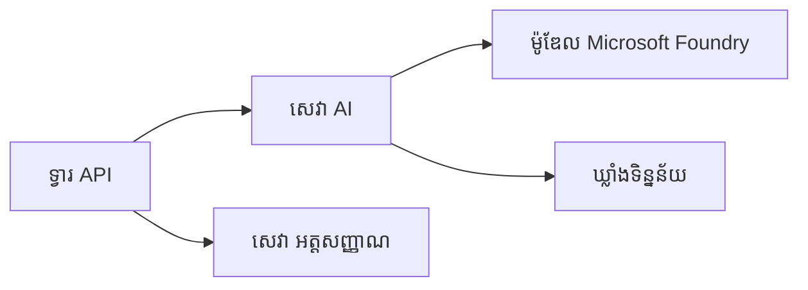
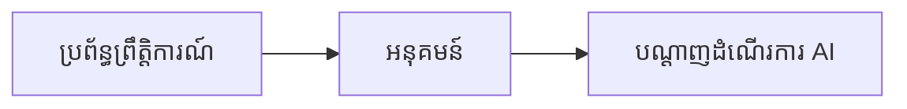

# ជំពូក 8: លំនាំផលិតកម្ម និងសហគ្រាស

**📚 វគ្គ**: [AZD សម្រាប់អ្នកចាប់ផ្តើម](../../README.md) | **⏱️ រយៈពេល**: 2-3 ម៉ោង | **⭐ កម្រិត**: ខ្ពស់

---

## ទិដ្ឋភាពទូទៅ

ជំពូកនេះគ្របដណ្ដប់លំនាំចាក់ដាក់ដែលស្រោចស្រង់សម្រាប់សហគ្រាស, ការបង្កើនសុវត្ថិភាព, ការត្រួតពិនិត្យ, និងការបង្កើនប្រសិទ្ធភាពការចំណាយសម្រាប់បន្ទុកការងារ AI ផលិតកម្ម។

> បានផ្ទៀងផ្ទាត់ជាមួយ `azd 1.25.6` នៅខែមិថុនា ២០២៦។

## គោលបំណងសិក្សា

ដោយបញ្ចប់ជំពូកនេះ អ្នកនឹងទទួលបាន៖
- ចាក់ដាក់កម្មវិធីក្នុងតំបន់ច្រើន ដើម្បីភាពធន់ទ្រាំ
- អនុវត្តលំនាំសុវត្ថិភាពសម្រាប់សហគ្រាស
- កំណត់ការត្រួតពិនិត្យដែលទូលំទូលាយ
- បង្កើនប្រសិទ្ធភាពការចំណាយនៅវិមាត្រធំ
- តាំងឡើងខ្សែបញ្ជា CI/CD ជាមួយ AZD

---

## 📚 មេរៀន

| # | មេរៀន | ការពិពណ៌នា | រយៈពេល |
|---|--------|-------------|------|
| 1 | [អនុវត្តន៍ AI សម្រាប់ផលិតកម្ម](production-ai-practices.md) | លំនាំចាក់ដាក់សម្រាប់សហគ្រាស | 90 នាទី |

---

## 🚀 បញ្ជីពិនិត្យផលិតកម្ម

- [ ] ចាក់ដាក់ក្នុងតំបន់ច្រើនសម្រាប់ភាពធន់ទ្រាំ
- [ ] អត្តសញ្ញាណបានគ្រប់គ្រងសម្រាប់ការផ្ទៀងផ្ទាត់ (គ្មានកូនសោ)
- [ ] Application Insights សម្រាប់ការត្រួតពិនិត្យ
- [ ] បានកំណត់ថវិកាចំណាយ និងការជូនសារ​ព្រមាន
- [ ] បានបើកការស្កេនសុវត្ថិភាព
- [ ] ការរួមបញ្ចូលខ្សែបញ្ជា CI/CD
- [ ] ផែនការស្ដារឡើងវិញក្រោយគ្រោះរ៉ាំ

---

## 🏗️ លំនាំស្ថាបត្យកម្ម

### លំនាំ 1: AI មីក្រូសេវា



### លំនាំ 2: AI ដឹកនាំដោយព្រឹត្តិការណ៍



---

## 🔐 វិធានសុវត្ថិភាពល្អបំផុត

```bicep
// Use managed identity
identity: {
  type: 'SystemAssigned'
}

// Private endpoints for AI services
properties: {
  publicNetworkAccess: 'Disabled'
  networkAcls: {
    defaultAction: 'Deny'
  }
}
```

---

## 💰 ការបង្កើនប្រសិទ្ធភាពការចំណាយ

| យុទ្ធសាស្ត្រ | ការសន្សំ |
|----------|---------|
| ស្កេលទៅសូន្យ (Container Apps) | 60-80% |
| ប្រើកម្រិតការប្រើប្រាស់សម្រាប់ការអភិវឌ្ឍ | 50-70% |
| ការស្កេលតាមកាលវិភាគ | 30-50% |
| សមត្ថភាពដែលបានកក់ | 20-40% |

```bash
# កំណត់ការជូនដំណឹងអំពីថវិកា
az consumption budget create \
  --budget-name "AI-Budget" \
  --amount 500 \
  --category Cost \
  --time-grain Monthly
```

---

## 📊 ការកំណត់ការត្រួតពិនិត្យ

```bash
# ផ្សាយកំណត់ហេតុ
azd monitor --logs

# ពិនិត្យ Application Insights
azd monitor --overview

# មើលវិមាត្រ
az monitor metrics list --resource <resource-id>
```

---

## 🔗 នាវីហ្គេសិន

| ទិស | ជំពួក |
|-----------|---------|
| **មុន** | [ជំពូក 7: ការដោះស្រាយបញ្ហា](../chapter-07-troubleshooting/README.md) |
| **បញ្ចប់វគ្គ** | [ទំព័រដើមវគ្គ](../../README.md) |

---

## 📖 ធនធានដែលពាក់ព័ន្ធ

- [មគ្គុទ្ទេសក៍ភ្នាក់ងារ AI](../chapter-02-ai-development/agents.md)
- [Application Insights](../chapter-06-pre-deployment/application-insights.md)
- [ដំណោះស្រាយពហុភ្នាក់ងារ](../chapter-05-multi-agent/README.md)
- [ឧទាហរណ៍ Microservices](../../examples/microservices/README.md)

---

<!-- CO-OP TRANSLATOR DISCLAIMER START -->
**ការបដិសេធ**:
ឯកសារនេះត្រូវបានបម្លែងភាសា ដោយប្រើសេវាបម្លែងភាសា AI [Co-op Translator](https://github.com/Azure/co-op-translator)។ ទោះយើងខ្ញុំមានក្តីប្រាថ្នាឱ្យបានច្បាស់លាស់ តែសូមយល់ដឹងថាការបម្លែងដោយស្វ័យប្រវត្តិក៏អាចមានកំហុសឬភាពមិនត្រឹមត្រូវ។ ឯកសារដើមជាភាសាទីតាំងគួរត្រូវបានគេប្រើជាប្រភពច្បាស់លាស់។ សម្រាប់ព័ត៌មានសំខាន់ៗ សូមណែនាំឱ្យប្រើប្រាស់ការប្រែដោយមនុស្សជំនាញ។ យើងខ្ញុំមិនទទួលខុសត្រូវចំពោះការយល់ច្រឡំ ឬការបកស្រាយខុសបន្ទាប់ពីការប្រើប្រាស់ការបម្លែងនេះនោះទេ។
<!-- CO-OP TRANSLATOR DISCLAIMER END -->