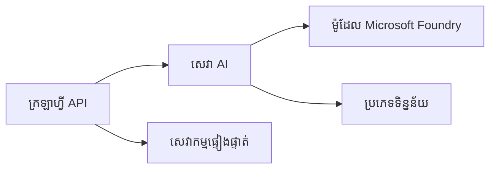
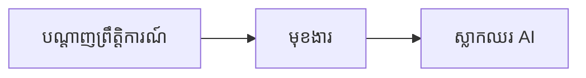

# ជំពូកទី 8៖ លំនាំផលិតកម្ម និងសហគ្រាស

**📚 វគ្គសិក្សា**: [AZD សម្រាប់អ្នកផ្តើម](../../README.md) | **⏱️ រយៈពេល**: 2-3 ម៉ោង | **⭐ កំឡាំងភាពស្មុគស្មាញ**៖ ជាន់ខ្ពស់

---

## មើលទិដ្ឋភាពទូទៅ

ជំពូកនេះគ្របដណ្តប់លំនាំបញ្ចេញនៅកម្រិតសហគ្រាសដែលមានភាពរឹងមាំ ការជំរុញសុវត្ថិភាព ការដាក់តាំងតាមដាន និងការបរិច្ឆេទតម្លៃសម្រាប់ការងារ AI ផលិតកម្ម។

> មានការត្រួតពិនិត្យប្រកាន់​តាម `azd 1.27.1` នៅខែ​កក្កដា ឆ្នាំ 2026។

## គោលបំណងរៀន

ដោយបញ្ចប់ជំពូកនេះ អ្នកនឹង:
- បញ្ចេញកម្មវិធីដែលមានភាពរឹងមាំក្នុងតំបន់ជាច្រើន
- អនុវត្តលំនាំសុវត្ថិភាពសហគ្រាស
- កំណត់ការតាមដានយ៉ាងទូលំទូលាយ
- បរិច្ចេកតម្លៃនៅការវាស់វែងធំនា
- រៀបចំបណ្តាញ CI/CD ជាមួយ AZD

---

## 📚 មេរៀន

| # | មេរៀន | សេចក្ដីពិពណ៌នា | រយៈពេល |
|---|--------|-------------|------|
| 1 | [អនុវត្ត AI ផលិតកម្ម](production-ai-practices.md) | លំនាំបញ្ចេញសហគ្រាស | 90 នាទី |

---

## 🚀 បញ្ជីពិនិត្យផលិតកម្ម

- [ ] ការបញ្ចេញនៅតំបន់ជាច្រើនសម្រាប់ភាពរឹងមាំ
- [ ] អត្តសញ្ញាណគ្រប់គ្រងសម្រាប់ការផ្ទៀង​ផ្ទាត់ (មិនប្រើកូដសំងាត់)
- [ ] Application Insights សម្រាប់ការតាមដាន
- [ ] កំណត់ថវិកា និងការជូនដំណឹង
- [ ] ត្រូវបានបើកការត្រួតពិនិត្យសុវត្ថិភាព
- [ ] បញ្ចូលបណ្តាញ CI/CD
- [ ] ផែនការជួយស្តារបន្ទាន់ក្រោយហេតុការណ៍

---

## 🏗️ លំនាំស្ថាបត្យកម្ម

### លំនាំទី 1៖ Microservices AI



### លំនាំទី 2៖ Event-Driven AI



---

## 🔐 ប្រពៃណីល្អបំផុតសុវត្ថិភាព

```bicep
// Use managed identity
identity: {
  type: 'SystemAssigned'
}

// Private endpoints for AI services
properties: {
  publicNetworkAccess: 'Disabled'
  networkAcls: {
    defaultAction: 'Deny'
  }
}
```

---

## 💰 ការបរិច្ឆេទតម្លៃ

| វិធីសាស្រ្ត | ការសន្សំសំចៃ |
|----------|---------|
| កំណត់នៅសូន្យ (Container Apps) | 60-80% |
| ប្រើប្រាស់ជាន់ប្រើប្រាស់សម្រាប់ dev | 50-70% |
| កំណត់កំណែសំរាប់កាលវិភាគ | 30-50% |
| សំរាប់ទុល្បត់កំណត់ | 20-40% |

```bash
# កំណត់សរុបថវិកា
az consumption budget create \
  --budget-name "AI-Budget" \
  --amount 500 \
  --category Cost \
  --time-grain Monthly
```

---

## 📊 ការរៀបចំតាមដាន

```bash
# ចែកចាយកំណត់ហេតុ
azd monitor --logs

# ពិនិត្យមើលការយល់ដឹងពីកម្មវិធី
azd monitor --overview

# មើលមេត្រីកា
az monitor metrics list --resource <resource-id>
```

---

## 🔗 ការផ្លាស់ទី

| ទិស | ជំពូក |
|-----------|---------|
| **មុន** | [ជំពូកទី 7៖ការដោះស្រាយបញ្ហា](../chapter-07-troubleshooting/README.md) |
| **បញ្ចប់វគ្គសិក្សា** | [ទំព័រដើមវគ្គសិក្សា](../../README.md) |

---

## 📖 ថាមពលដែលពាក់ព័ន្ធ

- [មគ្គុទេសក៍ AI Agents](../chapter-02-ai-development/agents.md)
- [Application Insights](../chapter-06-pre-deployment/application-insights.md)
- [ដំណោះស្រាយ Multi-Agent](../chapter-05-multi-agent/README.md)
- [ឧទាហរណ៍ Microservices](../../examples/microservices/README.md)

---

<!-- CO-OP TRANSLATOR DISCLAIMER START -->
**ការបដិសេធ**:
ឯកសារនេះត្រូវបានបម្លែងភាសា ដោយប្រើសេវាបម្លែងភាសា AI [Co-op Translator](https://github.com/Azure/co-op-translator)។ ទោះយើងខ្ញុំមានក្តីប្រាថ្នាឱ្យបានច្បាស់លាស់ តែសូមយល់ដឹងថាការបម្លែងដោយស្វ័យប្រវត្តិក៏អាចមានកំហុសឬភាពមិនត្រឹមត្រូវ។ ឯកសារដើមជាភាសាទីតាំងគួរត្រូវបានគេប្រើជាប្រភពច្បាស់លាស់។ សម្រាប់ព័ត៌មានសំខាន់ៗ សូមណែនាំឱ្យប្រើប្រាស់ការប្រែដោយមនុស្សជំនាញ។ យើងខ្ញុំមិនទទួលខុសត្រូវចំពោះការយល់ច្រឡំ ឬការបកស្រាយខុសបន្ទាប់ពីការប្រើប្រាស់ការបម្លែងនេះនោះទេ។
<!-- CO-OP TRANSLATOR DISCLAIMER END -->