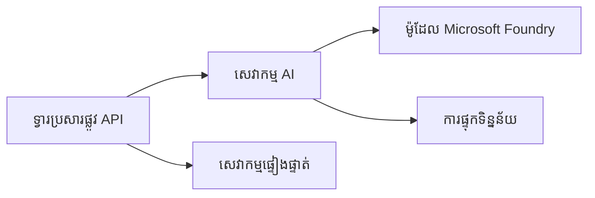
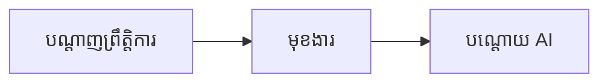

# ចំណត់ ៨៖ លំនាំផលិតកម្ម & សហគ្រាស

**📚 មេរៀន**៖ [AZD សម្រាប់អ្នកដំបូង](../../README.md) | **⏱️ រយៈពេល**៖ ២-៣ ម៉ោង | **⭐ ភាពស្មុគស្មាញ**៖ កម្រិតខ្ពស់

---

## ទិដ្ឋភាពទូទៅ

ចំណតនេះគ្របដណ្តប់លើលំនាំចែកចាយដែលត្រៀមសម្រាប់សហគ្រាស ការរៀបចំសុវត្ថិភាព ការត្រួតពិនិត្យ និងការបញ្ចុះតម្លៃសម្រាប់វោហារណកម្ម AI ក្នុងផលិតកម្ម។

> បានប៉ាន់ប្រមាណជាមួយ `azd 1.23.12` នៅខែមិនា ២០២៦។

## គោលបំណងរៀន

ដោយបញ្ចប់ចំណតនេះ អ្នកនឹងអាច៖
- ចេញផ្សាយកម្មវិធីដែលមានភាពធនធានគ្រប់តំបន់ច្រើន
- អនុវត្តលំនាំសុវត្ថិភាពសម្រាប់សហគ្រាស
- កំណត់ការត្រួតពិនិត្យបានយ៉ាងទូលំទូលាយ
- បរិមាណកាត់បន្ថយការចំណាយនៅកម្រិតធ្វើប្រតិបត្តិការ
- តំឡើងផ្លូវភ្នាក់ងារជួញដូរ CI/CD ជាមួយ AZD

---

## 📚 មេរៀន

| # | មេរៀន | ពិពណ៌នា | ពេលវេលា |
|---|--------|-------------|------|
| ១ | [វិធីសាស្រ្ត AI ផលិតកម្ម](production-ai-practices.md) | លំនាំចែកចាយសម្រាប់សហគ្រាស | ៩០ នាទី |

---

## 🚀 បញ្ជីពិនិត្យផលិតកម្ម

- [ ] ចែកចាយនៅតំបន់ច្រើនសម្រាប់ភាពធនធាន
- [ ] សម្គាល់គណនីដែលគ្រប់គ្រងសម្រាប់ការផ្ទៀងផ្ទាត់ (គ្មានកូនសោ)
- [ ] បញ្ចូល Application Insights សម្រាប់ការត្រួតពិនិត្យ
- [ ] កំណត់ថវិកា និងការជូនដំណឹងចំណាយ
- [ ] បើកដំណើរការ​ស្កែនសុវត្ថិភាព
- [ ] ផ្លូវភ្នាក់ងារជួញដូរ CI/CD រួមបញ្ចូល
- [ ] ផែនការជំនួយពីគ្រោះថ្នាក់

---

## 🏗️ លំនាំសំណង់

### លំនាំ ១៖ មីក្រុសេវា AI


### លំនាំ ២៖ AI បញ្ជូនដោយព្រឹត្តិការណ៍


---

## 🔐 ការអនុវត្តសុវត្ថិភាពល្អបំផុត

```bicep
// Use managed identity
identity: {
  type: 'SystemAssigned'
}

// Private endpoints for AI services
properties: {
  publicNetworkAccess: 'Disabled'
  networkAcls: {
    defaultAction: 'Deny'
  }
}
```

---

## 💰 ការបញ្ចុះតម្លៃ

| យុទ្ធសាស្រ្ត | ការសន្សំសំចៃ |
|----------|---------|
| ពង្រីកទៅសូន្យ (Container Apps) | ៦០-៨០% |
| ប្រើកម្រិតការបរិច្ឆេទសម្រាប់ការអភិវឌ្ឍន៍ | ៥០-៧០% |
| ការពង្រីកដែលកំណត់ពេលវេលា | ៣០-៥០% |
| សមត្ថភាពកក់ក្តៅ | ២០-៤០% |

```bash
# កំណត់ការជូនដំណឹងថវិកា
az consumption budget create \
  --budget-name "AI-Budget" \
  --amount 500 \
  --category Cost \
  --time-grain Monthly
```

---

## 📊 ការតំឡើងការត្រួតពិនិត្យ

```bash
# បញ្ជីកំណត់ត្រាស្ទ្រីម
azd monitor --logs

# ពិនិត្យ Application Insights
azd monitor --overview

# មើលមេត੍ਰិក
az monitor metrics list --resource <resource-id>
```

---

## 🔗 ការរុករក

| ទិស | ចំណត |
|-----------|---------|
| **មុន** | [ចំណត ៧៖ ការដោះស្រាយបញ្ហា](../chapter-07-troubleshooting/README.md) |
| **បញ្ចប់មេរៀន** | [ទំព័រដើមមេរៀន](../../README.md) |

---

## 📖 របៀបអានទាក់ទង

- [មគ្គុទេសក៍ភ្នាក់ងារ AI](../chapter-02-ai-development/agents.md)
- [Application Insights](../chapter-06-pre-deployment/application-insights.md)
- [ដំណោះស្រាយភ្នាក់ងារច្រើន](../chapter-05-multi-agent/README.md)
- [ឧទាហរណ៍មីក្រុសេវា](../../examples/microservices/README.md)

---

<!-- CO-OP TRANSLATOR DISCLAIMER START -->
**ការព្រមាន**៖  
ឯកសារនេះត្រូវបានបកប្រែដោយប្រើសេវាកម្មបកប្រែ AI [Co-op Translator](https://github.com/Azure/co-op-translator)។ ខណៈពេលយើងខិតខំរកភាពត្រឹមត្រូវ សូមយល់ដឹងថាការបកប្រែដោយស្វ័យក៏អាចមានកំហុសឬអាក្រក់ខ្លះៗ។ ឯកសារដើមនៅក្នុងភាសាទីបុរាណគួរត្រូវបានគេចាត់ទុកជាទិន្នន័យដើមដែលមានអំណាច។ សម្រាប់ព័ត៌មានសំខាន់ៗ ការបកប្រែដោយមនុស្សវិជ្ជាជីវៈគួរត្រូវបានផ្តល់ជូន។ យើងមិនទទួលខុសត្រូវចំពោះការយល់ច្រឡំនិងកំហុសដែលកើតឡើងពីការប្រើការបកប្រែក្នុងនេះទេ។
<!-- CO-OP TRANSLATOR DISCLAIMER END -->