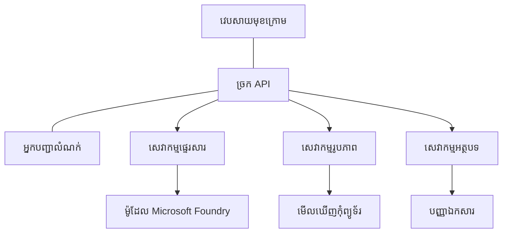

# ការអនុវត្តល្អបំផុតសម្រាប់ទំនើប AI ផលិតកម្មជាមួយ AZD

**ចំណាត់ថ្នាក់ជាប់បញ្ជីសៀវភៅ៖**
- **📚 ផ្ទះវគ្គសិក្សា**: [AZD For Beginners](../../README.md)
- **📖 ជំពូកបច្ចុប្បន្ន**: ជំពូក 8 - គំនិតរចនាសម្ព័ន្ធផលិតកម្ម និងសហគ្រាស
- **⬅️ ជំពូកមុន**: [ជំពូក 7: ការជួសជុលកំហុស](../chapter-07-troubleshooting/debugging.md)
- **⬅️ រួមទាំងពាក់ព័ន្ធ**: [មន្ទិលហាង AI](ai-workshop-lab.md)
- **🎯 បញ្ចប់វគ្គសិក្សា**: [AZD For Beginners](../../README.md)

## ទិដ្ឋភាពទូទៅ

មគ្គុទេសក៍នេះផ្តល់នូវការអនុវត្តល្អបំផុតគ្រប់បែបយ៉ាងសម្រាប់ការដាក់ឲ្យដំណើរការបទបញ្ជាទំនើប AI ដែលបានរៀបចំរួចរាល់ ដោយប្រើ Azure Developer CLI (AZD)។ ស្មើទៅតាមមតិយោបល់ពីសហគមន៍ Microsoft Foundry Discord និងការដាក់ឲ្យដំណើរការពិតប្រាកដរបស់អតិថិជន ការអនុវត្តទាំងនេះដោះស្រាយបញ្ហាទូទៅបំផុតនៅក្នុងប្រព័ន្ធ AI ផលិតកម្ម។

## បញ្ហាគន្លងសំខាន់ៗដែលត្រូវដោះស្រាយ

ផ្អែកលទ្ធផលសំណួរជាសាធារណៈរបស់សហគមន៍ យើងបានកំណត់បញ្ហាសំខាន់ៗដែលអ្នកអភិវឌ្ឍប្រឈមមុខ៖

- **៤៥%** មានការលំបាកជាមួយការដាក់ប្រាក់បម្រើ AI ច្រើនសេវាកម្ម
- **៣៨%** មានបញ្ហាជាមួយការគ្រប់គ្រងព័ត៌មានសំងាត់និងកគ្រោង
- **៣៥%** រកឃើញភាពពិបាកក្នុងការរៀបចំបាន និងការពង្រីក
- **៣២%** ត្រូវការយុទ្ធសាស្ត្រកែលម្អថវិកាប្រើប្រាស់
- **២៩%** ត្រូវការកែលម្អការត្រួតពិនិត្យ និងការជួសជុលកំហុស

## គំរូរចនាសម្ព័ន្ធសម្រាប់ AI ផលិតកម្ម

### គំរូទី ១៖ រចនាសម្ព័ន្ធ Microservices សម្រាប់ AI

**ពេលណាគួរប្រើ**៖ កម្មវិធី AI ស្មុគស្មាញមានមុខងារច្រើន


**ការអនុវត្ត AZD**:

```yaml
# azure.yaml
name: enterprise-ai-platform
services:
  web:
    project: ./web
    host: staticwebapp
  api-gateway:
    project: ./api-gateway
    host: containerapp
  chat-service:
    project: ./services/chat
    host: containerapp
  vision-service:
    project: ./services/vision
    host: containerapp
  text-service:
    project: ./services/text
    host: containerapp
```

### គំរូទី ២៖ ការពិចារណាតាមព្រឹត្តិការណ៍សម្រាប់ដំណើរការ AI

**ពេលណាគួរប្រើ**៖ ការដំណើរការជាប៉ុស្តិ៍ ផ្នែកវិភាគឯកសារ និងធ្វើដំណើរការជាសេវាសំរាបអសិន្ដ្រៃ

```bicep
// Event Hub for AI processing pipeline
resource eventHub 'Microsoft.EventHub/namespaces@2023-01-01-preview' = {
  name: eventHubNamespaceName
  location: location
  sku: {
    name: 'Standard'
    tier: 'Standard'
    capacity: 1
  }
}

// Service Bus for reliable message processing
resource serviceBus 'Microsoft.ServiceBus/namespaces@2022-10-01-preview' = {
  name: serviceBusNamespaceName
  location: location
  sku: {
    name: 'Premium'
    tier: 'Premium'
    capacity: 1
  }
}

// Function App for processing
resource functionApp 'Microsoft.Web/sites@2023-01-01' = {
  name: functionAppName
  location: location
  kind: 'functionapp,linux'
  properties: {
    siteConfig: {
      appSettings: [
        {
          name: 'FUNCTIONS_EXTENSION_VERSION'
          value: '~4'
        }
        {
          name: 'AZURE_OPENAI_ENDPOINT'
          value: '@Microsoft.KeyVault(VaultName=${keyVault.name};SecretName=openai-endpoint)'
        }
      ]
    }
  }
}
```

## ការពិចារណាអំពីសុខភាពភ្នាក់ងារ AI

ពេលកម្មវិធីវេបបែបប្រពៃណីបាក់បែក បញ្ហាអាចឃើញច្បាស់៖ ទំព័រមិនបង្ហាញកំណត់ភ្លាម API បញ្ជូនកំហុស ឬការដាក់ចេញបរាជ័យ។ កម្មវិធីដែលបានជំរុញដោយ AI អាចបាក់បែកដូចគ្នា ប៉ុន្តែវាក៏អាចចាប់ផ្តើមមានវិធានការតូចៗដែលមិនបង្កើតសារ​កំហុសច្បាស់។

ផ្នែកនេះជួយអ្នកបង្កើតគំនិតមួយសម្រាប់ត្រួតពិនិត្យផលបត់ AI ដើម្បីដឹងថាត្រូវស្វែងរកនៅឯណា ពេលអ្វីមិនទៅតាមរបៀបដែលរំពឹងទុក។

### របៀបសុខភាពភ្នាក់ងារ ខុសពីសុខភាពកម្មវិធីរបបប្រពៃណី

កម្មវិធីរបបប្រពៃណី ឬដំណើរការទេ ឬមិនដំណើរការ។ ភ្នាក់ងារ AI អាចមើលទៅដំណើរការ តែបង្កើតលទ្ធផលខ្សោយ។ គិតពីសុខភាពភ្នាក់ងារជាពីរជាន់៖

| ជាន់ | អ្វីគួរត្រួតពិនិត្យ | ទីកន្លែងស្វែងរក |
|-------|---------------------|---------------------|
| **សុខភាពហេដ្ឋារចនាសម្ព័ន្ធ** | សេវាកម្មដំណើរការរឺ? មានធនធានរៀបចំរួច? តើគេអាចទាក់ទងបានឬ? | `azd monitor`, សុខភាពប្រើប្រាស់ Azure Portal, ការចុះបញ្ជីកូនតឺន័រមានដំណើរការ/កម្មវិធី |
| **សុខភាពអាកប្បកិរិយា** | តើភ្នាក់ងារឆ្លើយតបត្រឹមត្រូវរឺ? ពេលវេលាចម្លើយគឺលឿនរឺ? តើម៉ូដែលត្រូវបានហៅត្រឹមត្រូវ? | គន្លង Application Insights, រយៈពេលហៅម៉ូដែល, កំណត់ហេតុគុណភាពចម្លើយ |

សុខភាពហេដ្ឋារចនាសម្ព័ន្ធជារឿងដែលស្គាល់ល្អ - ដូចគ្នាជាមួយកម្មវិធី azd ទាំងអស់។ សុខភាពអាកប្បកិរិយាជាជាន់ថ្មីដែលផលបត់ AI បញ្ចូល។

### ទីកន្លែងស្វែងរកពេលកម្មវិធី AI មានភាពមិនស្មើ

បើកម្មវិធី AI របស់អ្នកមិនបង្កើតលទ្ធផលដូចដែលរំពឹងទុក នេះជាបញ្ជីគំនិតដើម្បីពិនិត្យ៖

1. **ចាប់ផ្តើមពីមូលដ្ឋាន។** កម្មវិធីកំពុងដំណើរការរឺ? តើវាអាចបំពេញឲ្យទៅដល់អាស្រ័យបណ្ដាញបានរឺ? ពិនិត្យ `azd monitor` និងសុខភាពធនធានពេញលេញដូចធម្មតា។
2. **ពិនិត្យការតភ្ជាប់ម៉ូដែល។** តើកម្មវិធីដំណើរការហៅម៉ូដែល AI បានជោគជ័យ? ការហៅម៉ូដែលបរាជ័យឬផុតពេលគឺមូលហេតុសំខាន់បំផុតនៃបញ្ហាកម្មវិធី AI ហើយវានឹងបង្ហាញក្នុងកំណត់ហេតុកម្មវិធី។
3. **មើលថាតើម៉ូដែលទទួលបានអ្វី។** ចម្លើយ AI អាស្រ័យលើការបញ្ចូល (បណ្តាញសារ និងអត្ថបទបន្ថែមណាអ្នកយកផ្នែកនោះមក)។ ប្រសិនបើចម្លើយខុស ចំណូលភាគច្រើនត្រូវបានបញ្ចូលខុស។ ពិនិត្យថាកម្មវិធីរបស់អ្នកកំពុងផ្ញើទិន្នន័យត្រឹមត្រូវទៅម៉ូដែលឬនៅ។
4. **ពិនិត្យរយៈពេលចម្លើយ។** ការហៅម៉ូដែល AI យឺតជាងការហៅ API ទូទៅ។ ប្រសិនបើកម្មវិធីរបស់អ្នកមានអារម្មណ៍យឺតពេក ពិនិត្យថារយៈពេលចម្លើយម៉ូដែលមានការកើនឡើង​ដែររឺទេ - អាចបញ្ជាក់ពីការលំបាក កម្រិតសមត្ថភាព ឬការផ្ទុកប្រាក់នៅតំបន់ជាប់។
5. **ត្រួតពិនិត្យសញ្ញារបស់ការចំណាយ។** ការកើនឡើងមិនធម្មតានៃការប្រើប្រាស់តូកិនឬការហៅ API អាចមានន័យថាមានលុកឡុក អ្នកបញ្ចូលសារខុស ឬការបញ្ជូនឡើងវិញច្រើនពេក។

អ្នកមិនចាំបាច់បានជំនាញឧបករណ៍មើលទេភ្លាមៗទេ។ ចំណុចសំខាន់គឺកម្មវិធី AI មានជាន់អាកប្បកិរិយាបន្ថែមសម្រាប់ត្រួតពិនិត្យ ហើយការត្រួតពិនិត្យដែលបង្កើតរួច ( `azd monitor`) ផ្តល់ចំណុចចាប់ផ្តើមសម្រាប់ស៊ើបអង្កេតទាំងពីរជាន់។

---

## ការអនុវត្តល្អបំផុតសុវត្ថិភាព

### ១. គំរូសុវត្ថិភាព Zero-Trust

**យុទ្ធសាស្ត្រ​អនុវត្ត៖**
- មិនមានការទំនាក់ទំនងបំរើសេវារវាងសេវាដោយគ្មានការផ្ទៀងផ្ទាត់
- ការហៅ API ទាំងអស់ប្រើអត្តសញ្ញាណគ្រប់គ្រង
- វិញ្ញាណបណ្ដាញដោយឯកជនជាមួយចំណុចចូលឯកជន
- គ្រប់គ្រងការចូលប្រើដោយមានសិទ្ធិតិចបំផុត

```bicep
// Managed Identity for each service
resource chatServiceIdentity 'Microsoft.ManagedIdentity/userAssignedIdentities@2023-01-31' = {
  name: 'chat-service-identity'
  location: location
}

// Role assignments with minimal permissions
resource openAIUserRole 'Microsoft.Authorization/roleAssignments@2022-04-01' = {
  scope: openAIAccount
  name: guid(openAIAccount.id, chatServiceIdentity.id, openAIUserRoleDefinitionId)
  properties: {
    roleDefinitionId: subscriptionResourceId('Microsoft.Authorization/roleDefinitions', '5e0bd9bd-7b93-4f28-af87-19fc36ad61bd')
    principalId: chatServiceIdentity.properties.principalId
    principalType: 'ServicePrincipal'
  }
}
```

### ២. គ្រប់គ្រងសម្ងាត់យ៉ាងសុវត្ថិ

**គំរូការតភ្ជាប់ Key Vault**:

```bicep
// Key Vault with proper access policies
resource keyVault 'Microsoft.KeyVault/vaults@2023-02-01' = {
  name: keyVaultName
  location: location
  properties: {
    tenantId: tenant().tenantId
    sku: {
      family: 'A'
      name: 'premium'  // Use premium for production
    }
    enableRbacAuthorization: true  // Use RBAC instead of access policies
    enablePurgeProtection: true    // Prevent accidental deletion
    enableSoftDelete: true
    softDeleteRetentionInDays: 90
  }
}

// Store all AI service credentials
resource openAIKeySecret 'Microsoft.KeyVault/vaults/secrets@2023-02-01' = {
  parent: keyVault
  name: 'openai-api-key'
  properties: {
    value: openAIAccount.listKeys().key1
    attributes: {
      enabled: true
    }
  }
}
```

### ៣. សុវត្ថិភាពបណ្ដាញ

**ការកំណត់ចំណុចចូលឯកជន**:

```bicep
// Virtual Network for AI services
resource virtualNetwork 'Microsoft.Network/virtualNetworks@2023-04-01' = {
  name: vnetName
  location: location
  properties: {
    addressSpace: {
      addressPrefixes: ['10.0.0.0/16']
    }
    subnets: [
      {
        name: 'ai-services-subnet'
        properties: {
          addressPrefix: '10.0.1.0/24'
          privateEndpointNetworkPolicies: 'Disabled'
        }
      }
      {
        name: 'app-services-subnet'
        properties: {
          addressPrefix: '10.0.2.0/24'
          delegations: [
            {
              name: 'Microsoft.Web/serverFarms'
              properties: {
                serviceName: 'Microsoft.Web/serverFarms'
              }
            }
          ]
        }
      }
    ]
  }
}

// Private endpoints for all AI services
resource openAIPrivateEndpoint 'Microsoft.Network/privateEndpoints@2023-04-01' = {
  name: '${openAIAccountName}-pe'
  location: location
  properties: {
    subnet: {
      id: virtualNetwork.properties.subnets[0].id
    }
    privateLinkServiceConnections: [
      {
        name: 'openai-connection'
        properties: {
          privateLinkServiceId: openAIAccount.id
          groupIds: ['account']
        }
      }
    ]
  }
}
```

## សមត្ថភាព និងការពង្រីក

### ១. យុទ្ធសាស្ត្រពង្រីកដោយស្វ័យប្រវត្តិ

**Auto-scaling របស់ Container Apps**:

```bicep
resource containerApp 'Microsoft.App/containerApps@2023-05-01' = {
  name: containerAppName
  location: location
  properties: {
    configuration: {
      ingress: {
        external: true
        targetPort: 8000
        transport: 'http'
      }
    }
    template: {
      scale: {
        minReplicas: 2  // Always have 2 instances minimum
        maxReplicas: 50 // Scale up to 50 for high load
        rules: [
          {
            name: 'http-scaling'
            http: {
              metadata: {
                concurrentRequests: '20'  // Scale when >20 concurrent requests
              }
            }
          }
          {
            name: 'cpu-scaling'
            custom: {
              type: 'cpu'
              metadata: {
                type: 'Utilization'
                value: '70'  // Scale when CPU >70%
              }
            }
          }
        ]
      }
    }
  }
}
```

### ២. យុទ្ធសាស្ត្រការបន្សំស្កេត

**Redis Cache សម្រាប់ចម្លើយ AI**:

```bicep
// Redis Premium for production workloads
resource redisCache 'Microsoft.Cache/redis@2023-04-01' = {
  name: redisCacheName
  location: location
  properties: {
    sku: {
      name: 'Premium'
      family: 'P'
      capacity: 1
    }
    enableNonSslPort: false
    minimumTlsVersion: '1.2'
    redisConfiguration: {
      'maxmemory-policy': 'allkeys-lru'
    }
    // Enable clustering for high availability
    redisVersion: '6.0'
    shardCount: 2
  }
}

// Cache configuration in application
var cacheConnectionString = '${redisCache.properties.hostName}:6380,password=${redisCache.listKeys().primaryKey},ssl=True,abortConnect=False'
```

### ៣. ការបានតុល្យនិងគ្រប់គ្រងចរាចរណ៍

**Application Gateway ជាមួយ WAF**:

```bicep
// Application Gateway with Web Application Firewall
resource applicationGateway 'Microsoft.Network/applicationGateways@2023-04-01' = {
  name: appGatewayName
  location: location
  properties: {
    sku: {
      name: 'WAF_v2'
      tier: 'WAF_v2'
      capacity: 2
    }
    webApplicationFirewallConfiguration: {
      enabled: true
      firewallMode: 'Prevention'
      ruleSetType: 'OWASP'
      ruleSetVersion: '3.2'
    }
    // Backend pools for AI services
    backendAddressPools: [
      {
        name: 'ai-services-pool'
        properties: {
          backendAddresses: [
            {
              fqdn: '${containerApp.properties.configuration.ingress.fqdn}'
            }
          ]
        }
      }
    ]
  }
}
```

## 💰 ការកែលម្អថ្លៃចំណាយ

### ១. ការរើសទំហំធនធានត្រឹមត្រូវ

**ការកំណត់បរិស្ថានជាក់លាក់**:

```bash
# បរិស្ថានអភិវឌ្ឍន៍
azd env new development
azd env set AZURE_OPENAI_SKU "S0"
azd env set AZURE_OPENAI_CAPACITY 10
azd env set AZURE_SEARCH_SKU "basic"
azd env set CONTAINER_CPU 0.5
azd env set CONTAINER_MEMORY 1.0

# បរិស្ថានផលិតកម្ម
azd env new production
azd env set AZURE_OPENAI_SKU "S0"
azd env set AZURE_OPENAI_CAPACITY 100
azd env set AZURE_SEARCH_SKU "standard"
azd env set CONTAINER_CPU 2.0
azd env set CONTAINER_MEMORY 4.0
```

### ២. ការត្រួតពិនិត្យថ្លៃចំណាយ និងថវិកា

```bicep
// Cost management and budgets
resource budget 'Microsoft.Consumption/budgets@2023-05-01' = {
  name: 'ai-workload-budget'
  properties: {
    timePeriod: {
      startDate: '2024-01-01'
      endDate: '2024-12-31'
    }
    timeGrain: 'Monthly'
    amount: 2000  // $2000 monthly budget
    category: 'Cost'
    notifications: {
      warning: {
        enabled: true
        operator: 'GreaterThan'
        threshold: 80
        contactEmails: [
          'finance@company.com'
          'engineering@company.com'
        ]
        contactRoles: [
          'Owner'
          'Contributor'
        ]
      }
      critical: {
        enabled: true
        operator: 'GreaterThan'
        threshold: 95
        contactEmails: [
          'cto@company.com'
        ]
      }
    }
  }
}
```

### ៣. ការប្តូរប្រើការតូកិនអោយមានប្រសិទ្ធភាព

**OpenAI Cost Management**:

```typescript
// ការបង្កើតសញ្ញាត្រង់កម្រិតកម្មវិធី
class TokenOptimizer {
  private readonly maxTokens = 4000;
  private readonly reserveTokens = 500;
  
  optimizePrompt(userInput: string, context: string): string {
    const availableTokens = this.maxTokens - this.reserveTokens;
    const estimatedTokens = this.estimateTokens(userInput + context);
    
    if (estimatedTokens > availableTokens) {
      // កាត់បន្ថយបរិបទ មិនមែនការបញ្ចូលអ្នកប្រើ
      context = this.truncateContext(context, availableTokens - this.estimateTokens(userInput));
    }
    
    return `${context}\n\nUser: ${userInput}`;
  }
  
  private estimateTokens(text: string): number {
    // ការប៉ាន់ប្រមាណប្រហែល៖ 1 សញ្ញាត្រង់ ≈ តួអក្សរ 4
    return Math.ceil(text.length / 4);
  }
}
```

## ការត្រួតពិនិត្យ និងការមើលឃើញ

### ១. Application Insights ពេញលេញ

```bicep
// Application Insights with advanced features
resource applicationInsights 'Microsoft.Insights/components@2020-02-02' = {
  name: applicationInsightsName
  location: location
  kind: 'web'
  properties: {
    Application_Type: 'web'
    WorkspaceResourceId: logAnalyticsWorkspace.id
    SamplingPercentage: 100  // Full sampling for AI apps
    DisableIpMasking: false  // Enable for security
  }
}

// Custom metrics for AI operations
resource aiMetricAlerts 'Microsoft.Insights/metricAlerts@2018-03-01' = {
  name: 'ai-high-error-rate'
  location: 'global'
  properties: {
    description: 'Alert when AI service error rate is high'
    severity: 2
    enabled: true
    scopes: [
      applicationInsights.id
    ]
    evaluationFrequency: 'PT1M'
    windowSize: 'PT5M'
    criteria: {
      'odata.type': 'Microsoft.Azure.Monitor.SingleResourceMultipleMetricCriteria'
      allOf: [
        {
          name: 'high-error-rate'
          metricName: 'requests/failed'
          operator: 'GreaterThan'
          threshold: 10
          timeAggregation: 'Count'
        }
      ]
    }
  }
}
```

### ២. ការត្រួតពិនិត្យ AI ផ្ទាល់ខ្លួន

**ផ្ទាំងគ្រប់គ្រងផ្ទាល់ខ្លួនសម្រាប់មេត្រូ AI**:

```json
// Dashboard configuration for AI workloads
{
  "dashboard": {
    "name": "AI Application Monitoring",
    "tiles": [
      {
        "name": "OpenAI Request Volume",
        "query": "requests | where name contains 'openai' | summarize count() by bin(timestamp, 5m)"
      },
      {
        "name": "AI Response Latency",
        "query": "requests | where name contains 'openai' | summarize avg(duration) by bin(timestamp, 5m)"
      },
      {
        "name": "Token Usage",
        "query": "customMetrics | where name == 'openai_tokens_used' | summarize sum(value) by bin(timestamp, 1h)"
      },
      {
        "name": "Cost per Hour",
        "query": "customMetrics | where name == 'openai_cost' | summarize sum(value) by bin(timestamp, 1h)"
      }
    ]
  }
}
```

### ៣. ការត្រួតពិនិត្យសុខភាព និងពិចារណាអំពីម៉ោងដំណើរការ

```bicep
// Application Insights availability tests
resource availabilityTest 'Microsoft.Insights/webtests@2022-06-15' = {
  name: 'ai-app-availability-test'
  location: location
  tags: {
    'hidden-link:${applicationInsights.id}': 'Resource'
  }
  properties: {
    SyntheticMonitorId: 'ai-app-availability-test'
    Name: 'AI Application Availability Test'
    Description: 'Tests AI application endpoints'
    Enabled: true
    Frequency: 300  // 5 minutes
    Timeout: 120    // 2 minutes
    Kind: 'ping'
    Locations: [
      {
        Id: 'us-east-2-azr'
      }
      {
        Id: 'us-west-2-azr'
      }
    ]
    Configuration: {
      WebTest: '''
        <WebTest Name="AI Health Check" 
                 Id="8d2de8d2-a2b0-4c2e-9a0d-8f9c9a0b8c8d" 
                 Enabled="True" 
                 CssProjectStructure="" 
                 CssIteration="" 
                 Timeout="120" 
                 WorkItemIds="" 
                 xmlns="http://microsoft.com/schemas/VisualStudio/TeamTest/2010" 
                 Description="" 
                 CredentialUserName="" 
                 CredentialPassword="" 
                 PreAuthenticate="True" 
                 Proxy="default" 
                 StopOnError="False" 
                 RecordedResultFile="" 
                 ResultsLocale="">
          <Items>
            <Request Method="GET" 
                     Guid="a5f10126-e4cd-570d-961c-cea43999a200" 
                     Version="1.1" 
                     Url="${webApp.properties.defaultHostName}/health" 
                     ThinkTime="0" 
                     Timeout="120" 
                     ParseDependentRequests="True" 
                     FollowRedirects="True" 
                     RecordResult="True" 
                     Cache="False" 
                     ResponseTimeGoal="0" 
                     Encoding="utf-8" 
                     ExpectedHttpStatusCode="200" 
                     ExpectedResponseUrl="" 
                     ReportingName="" 
                     IgnoreHttpStatusCode="False" />
          </Items>
        </WebTest>
      '''
    }
  }
}
```

## ការសង្រ្គោះគ្រោះថ្នាក់ និងភាពមានស្រាប់ខ្ពស់

### ១. ការដាក់បង្ហោះច្រើនតំបន់

```yaml
# azure.yaml - Multi-region configuration
name: ai-app-multiregion
services:
  api-primary:
    project: ./api
    host: containerapp
    env:
      - AZURE_REGION=eastus
  api-secondary:
    project: ./api
    host: containerapp
    env:
      - AZURE_REGION=westus2
```

```bicep
// Traffic Manager for global load balancing
resource trafficManager 'Microsoft.Network/trafficManagerProfiles@2022-04-01' = {
  name: trafficManagerProfileName
  location: 'global'
  properties: {
    profileStatus: 'Enabled'
    trafficRoutingMethod: 'Priority'
    dnsConfig: {
      relativeName: trafficManagerProfileName
      ttl: 30
    }
    monitorConfig: {
      protocol: 'HTTPS'
      port: 443
      path: '/health'
      intervalInSeconds: 30
      toleratedNumberOfFailures: 3
      timeoutInSeconds: 10
    }
    endpoints: [
      {
        name: 'primary-endpoint'
        type: 'Microsoft.Network/trafficManagerProfiles/azureEndpoints'
        properties: {
          targetResourceId: primaryAppService.id
          endpointStatus: 'Enabled'
          priority: 1
        }
      }
      {
        name: 'secondary-endpoint'
        type: 'Microsoft.Network/trafficManagerProfiles/azureEndpoints'
        properties: {
          targetResourceId: secondaryAppService.id
          endpointStatus: 'Enabled'
          priority: 2
        }
      }
    ]
  }
}
```

### ២. ក្រឡាចត្រង្គទិន្នន័យ និងការសង្រ្គោះ

```bicep
// Backup configuration for critical data
resource backupVault 'Microsoft.DataProtection/backupVaults@2023-05-01' = {
  name: backupVaultName
  location: location
  identity: {
    type: 'SystemAssigned'
  }
  properties: {
    storageSettings: [
      {
        datastoreType: 'VaultStore'
        type: 'LocallyRedundant'
      }
    ]
  }
}

// Backup policy for AI models and data
resource backupPolicy 'Microsoft.DataProtection/backupVaults/backupPolicies@2023-05-01' = {
  parent: backupVault
  name: 'ai-data-backup-policy'
  properties: {
    policyRules: [
      {
        backupParameters: {
          backupType: 'Full'
          objectType: 'AzureBackupParams'
        }
        trigger: {
          schedule: {
            repeatingTimeIntervals: [
              'R/2024-01-01T02:00:00+00:00/P1D'  // Daily at 2 AM
            ]
          }
          objectType: 'ScheduleBasedTriggerContext'
        }
        dataStore: {
          datastoreType: 'VaultStore'
          objectType: 'DataStoreInfoBase'
        }
        name: 'BackupDaily'
        objectType: 'AzureBackupRule'
      }
    ]
  }
}
```

## DevOps និងការរួមបញ្ចូល CI/CD

### ១. GitHub Actions Workflow

```yaml
# .github/workflows/deploy-ai-app.yml
name: Deploy AI Application

on:
  push:
    branches: [main]
  pull_request:
    branches: [main]

jobs:
  test:
    runs-on: ubuntu-latest
    steps:
      - uses: actions/checkout@v4
      
      - name: Setup Python
        uses: actions/setup-python@v4
        with:
          python-version: '3.11'
          
      - name: Install dependencies
        run: |
          pip install -r requirements.txt
          pip install pytest
          
      - name: Run tests
        run: pytest tests/
        
      - name: AI Safety Tests
        run: |
          python scripts/test_ai_safety.py
          python scripts/validate_prompts.py

  deploy-staging:
    needs: test
    if: github.event_name == 'pull_request'
    runs-on: ubuntu-latest
    steps:
      - uses: actions/checkout@v4
      
      - name: Setup AZD
        uses: Azure/setup-azd@v2
        
      - name: Login to Azure
        uses: azure/login@v1
        with:
          creds: ${{ secrets.AZURE_CREDENTIALS }}
          
      - name: Deploy to Staging
        run: |
          azd env select staging
          azd deploy

  deploy-production:
    needs: test
    if: github.ref == 'refs/heads/main'
    runs-on: ubuntu-latest
    steps:
      - uses: actions/checkout@v4
      
      - name: Setup AZD
        uses: Azure/setup-azd@v2
        
      - name: Login to Azure
        uses: azure/login@v1
        with:
          creds: ${{ secrets.AZURE_CREDENTIALS }}
          
      - name: Deploy to Production
        run: |
          azd env select production
          azd deploy
          
      - name: Run Production Health Checks
        run: |
          python scripts/health_check.py --env production
```

### ២. ការផ្ទៀងផ្ទាត់ហេដ្ឋារចនាសម្ព័ន្ធ

```bash
# scripts/validate_infrastructure.sh
#!/bin/bash

echo "Validating AI infrastructure deployment..."

# ពិនិត្យមើលថា សេវាកម្មទាំងអស់ដែលត្រូវការកំពុងរត់
services=("openai" "search" "storage" "keyvault")
for service in "${services[@]}"; do
    echo "Checking $service..."
    if ! az resource list --resource-type "Microsoft.CognitiveServices/accounts" --query "[?contains(name, '$service')]" -o tsv; then
        echo "ERROR: $service not found"
        exit 1
    fi
done

# ផ្ទៀងផ្ទាត់ការដាក់បង្ហាញម៉ូដែល OpenAI
echo "Validating OpenAI model deployments..."
models=$(az cognitiveservices account deployment list --name $AZURE_OPENAI_NAME --resource-group $AZURE_RESOURCE_GROUP --query "[].name" -o tsv)
if [[ ! $models == *"gpt-4.1-mini"* ]]; then
  echo "ERROR: Required model gpt-4.1-mini not deployed"
    exit 1
fi

# សាកល្បងការតភ្ជាប់សេវាកម្ម AI
echo "Testing AI service connectivity..."
python scripts/test_connectivity.py

echo "Infrastructure validation completed successfully!"
```

## បញ្ជីត្រួតពិនិត្យភាពរួចរាល់ផលិតកម្ម

### សុវត្ថិភាព ✅
- [ ] សេវាទាំងអស់ប្រើអត្តសញ្ញាណគ្រប់គ្រង
- [ ] សម្ងាត់បានផ្ទុកក្នុង Key Vault
- [ ] ចំណុចចូលឯកជនបានកំណត់
- [ ] ក្រុមសុវត្ថិភាពបណ្ដាញបានអនុវត្ត
- [ ] RBAC ជាមួយសិទ្ធិតិចបំផុត
- [ ] WAF បានដំឡើងនៅចំណុចចូលសាធារណៈ

### សមត្ថភាព ✅
- [ ] ការកំណត់ auto-scaling
- [ ] ការបន្សំស្កេតបានអនុវត្ត
- [ ] ការតុល្យធារ្យបានកំណត់
- [ ] CDN សម្រាប់មាតិកាស្ថិតិស្ថេរ
- [ ] ការប្រើប្រាស់ connection pooling សម្រាប់មូលដ្ឋានទិន្នន័យ
- [ ] ការបង្កើតប្រសិទ្ធភាពការប្រើ token

### ការត្រួតពិនិត្យ ✅
- [ ] ការកំណត់ Application Insights
- [ ] ការកំណត់មេត្រូផ្ទាល់ខ្លួន
- [ ] ការកំណត់ច្បាប់រោទ៍
- [ ] ផ្ទាំងគ្រប់គ្រងបានបង្កើត
- [ ] ការត្រួតពិនិត្យសុខភាពបានអនុវត្ត
- [ ] នីតិវិធីរក្សាទុកកំណត់ហេតុ

### ភាពជឿជាក់ ✅
- [ ] ការដាក់នៅច្រើនតំបន់
- [ ] ផែនការការរក្សាទុក និងសង្រ្គោះ
- [ ] ការអនុវត្តឧបករណ៍ circuit breaker
- [ ] ការកំណត់នីតិវិធី retry
- [ ] ការធ្វើដំណើរដោយភាពធូរស្បើយ
- [ ] ចំណុចចូលត្រួតពិនិត្យសុខភាព

### ការគ្រប់គ្រងថ្លៃចំណាយ ✅
- [ ] ការជូនដំណឹងថវិកា
- [ ] ការរើសទំហំធនធានត្រឹមត្រូវ
- [ ] ការបញ្ចុះតម្លៃ dev/test
- [ ] ការទិញ reserved instances
- [ ] ផ្ទាំងគ្រប់គ្រងថ្លៃចំណាយ
- [ ] ការពិនិត្យថ្លៃចំណាយជាប្រចាំ

### តម្រូវការគោរព ✅
- [ ] បំពេញលក្ខខណ្ឌស្នាក់នៅទិន្នន័យ
- [ ] ការចុះបញ្ជី audit បានដំណើរការ
- [ ] គោលការណ៍គាំទ្រត្រូវបានអនុវត្ត
- [ ] ស្តង់ដារ​សុវត្ថិភាពបានអនុវត្ត
- [ ] ការវាយតម្លៃសុវត្ថិភាពជាប្រចាំ
- [ ] ផែនការឆ្លើយតបព្រឹត្តិការណ៍

## មាត្រាសមត្ថភាពផ្តាច់មុខ

### មាត្រអនុវត្តផលិតកម្មទូទៅ

| មាត្រ | គោលដៅ | ការត្រួតពិនិត្យ |
|--------|---------|-----------------|
| **ពេលវេលាចម្លើយ** | < 2 វិនាទី | Application Insights |
| **ភាពមានស្រាប់** | 99.9% | ការត្រួតពិនិត្យម៉ោងដំណើរការ |
| **អត្រាកំហុស** | < 0.1% | កំណត់ហេតុកម្មវិធី |
| **ការប្រើប្រាស់តូកិន** | < $500/ខែ | ការគ្រប់គ្រងថ្លៃចំណាយ |
| **អ្នកប្រើប្រាស់តែមួយពេល** | ១០០០+ | ការប្រឡងផ្ទុក |
| **ពេលសង្រ្គោះ** | < 1 ម៉ោង | ការសាកល្បងសង្រ្គោះគ្រោះថ្នាក់ |

### ការប្រឡងផ្ទុក

```bash
# ស្គ្រីបសាកល្បងបង្ហោះសម្រាប់កម្មវិធី AI
python scripts/load_test.py \
  --endpoint https://your-ai-app.azurewebsites.net \
  --concurrent-users 100 \
  --duration 300 \
  --ramp-up 60
```

## 🤝 អនុវត្តល្អបំផុតក្នុងសហគមន៍

ផ្អែកលើមតិយោបល់ពីសហគមន៍ Microsoft Foundry Discord៖

### ការផ្ដល់អនុសាសន៍ក្នុងសហគមន៍:

1. **ចាប់ផ្តើមតូច តែពង្រីកយឺតៗ**: ចាប់ផ្តើមជាមួយ SKU មូលដ្ឋាន ហើយពង្រីកទៅតាមការប្រើប្រាស់ពិតប្រាកដ
2. **ត្រួតពិនិត្យគ្រប់យ៉ាង**: ជំនួយការត្រួតពិនិត្យទាំងមូលចាប់ពីថ្ងៃដំបូង
3. **ស្វ័យប្រវត្តិសុវត្ថិភាព**: ប្រើហេដ្ឋារចនាសម្ព័ន្ធជា​កូដសម្រាប់សុវត្ថិភាពតទៅតាមគន្លង
4. **សាកល្បងយ៉ាងម៉ត់ចត**: រួមបញ្ចូលការសាកល្បង AI ផ្ទាល់ខ្លួននៅក្នុងផ្គុំបម្រើ
5. **ផែនការលើថ្លៃចំណាយ**: ត្រួតពិនិត្យការប្រើប្រាស់តូកិន និងកំណត់ការជូនដំណឹងថវិកាចាប់ពីដំណាក់កាលដំបូង

### កំហុសទូទៅដែលគួរចៀសវាង:

- ❌ កូដ API key ត្រូវបានដាក់ចង្វាក់នៅក្នុងកូដ
- ❌ មិនដាក់ការត្រួតពិនិត្យត្រឹមត្រូវ
- ❌ មិនចាប់អារម្មណ៍លើការគ្រប់គ្រងថ្លៃចំណាយ
- ❌ មិនសាកល្បងស្ថានភាពបរាជ័យ
- ❌ ដាក់ចេញដោយគ្មានការត្រួតពិនិត្យសុខភាព

## ពាក្យបញ្ជា AZD AI CLI និងការពង្រឹង

AZD រួមបញ្ចូលឧបករណ៍និងពាក្យបញ្ជា AI ជាច្រើនជាមួយជំនួយសម្រាប់ធ្វើឲ្យដំណើរការផលិតកម្ម AI ងាយស្រួល។ ឧបករណ៍ទាំងនេះជាស្វ័យប្រវត្តិក្នុងការតភ្ជាប់ពីការអភិវឌ្ឍកន្លែងមូលដ្ឋានទៅការដាក់កូដក្នុងផលិតកម្មសម្រាប់ចំណង់ AI។

### ការពង្រីក AZD សម្រាប់ AI

AZD ប្រើប្រព័ន្ធផ្គុំជំនួយដើម្បីបន្ថែមមុខងារ AI ពិសេស។ តម្លើង និងគ្រប់គ្រងការពង្រីកជាមួយ៖

```bash
# បញ្ជីនៃផ្នែកបន្ថែមទាំងអស់ដែលមាន (រួមទាំង AI)
azd extension list

# ពិនិត្យព័ត៌មានលម្អិតនៃផ្នែកបន្ថែមដែលបានដំឡើង
azd extension show azure.ai.agents

# ដំឡើងផ្នែកបន្ថែមភ្នាក់ងារមូលដ្ឋាន Foundry
azd extension install azure.ai.agents

# ដំឡើងផ្នែកបន្ថែមសំរាប់ការតម្រូវល្អ
azd extension install azure.ai.finetune

# ដំឡើងផ្នែកបន្ថែមម៉ូឌែលផ្ទាល់ខ្លួន
azd extension install azure.ai.models

# កែលម្អផ្នែកបន្ថែមទាំងអស់ដែលបានដំឡើង
azd extension upgrade --all
```

**ការពង្រីក AI ដែលអាចរកបាន៖**

| ការពង្រីក | គោលបំណង | ស្ថានភាព |
|-----------|-----------|----------|
| `azure.ai.agents` | គ្រប់គ្រងសេវាកម្ម Foundry Agent | ប្រើរូបមន្ត |
| `azure.ai.finetune` | ការបង្រួបបង្រួមម៉ូដែល Foundry | ប្រើរូបមន្ត |
| `azure.ai.models` | ម៉ូដែលផ្ទាល់ខ្លួន Foundry | ប្រើរូបមន្ត |
| `azure.coding-agent` | កំណត់ទ្រង់ទ្រាយ coding agent | មានស្រាប់ |

### ការចាប់ផ្តើមគម្រោងភ្នាក់ងារជាមួយ `azd ai agent init`

ពាក្យបញ្ជា `azd ai agent init` អនុញ្ញាតឲ្យបង្កើតគម្រោងភ្នាក់ងារផលិតកម្ម AI រួមបញ្ចូលជាមួយ Microsoft Foundry Agent Service៖

```bash
# ការចាប់ផ្តើម​គម្រោងភ្នាក់ងារថ្មី​ពី manifests ភ្នាក់ងារ
azd ai agent init -m <manifest-path-or-uri>

# ចាប់ផ្តើម និងគោលដៅគម្រោង Foundry ជាក់លាក់
azd ai agent init -m agent-manifest.yaml --project-id <foundry-project-id>

# ចាប់ផ្តើមជាមួយថតប្រភពប្ដូរតាមបំណង
azd ai agent init -m agent-manifest.yaml --src ./agents/my-agent

# គោលដៅ Container Apps ជាម្ចាស់ផ្ទះ
azd ai agent init -m agent-manifest.yaml --host containerapp
```

**ទង់សញ្ញាសំខាន់ៗ៖**

| ទង់សញ្ញា | សេចក្តីពិពណ៌នា |
|----------|------------------|
| `-m, --manifest` | ផ្លូវឬ URI ទៅឯកសារ manifest ភ្នាក់ងារ សម្រាប់បន្ថែមទៅគម្រោង |
| `-p, --project-id` | លេខសម្គាល់គម្រោង Microsoft Foundry សម្រាប់បរិយាកាស azd របស់អ្នក |
| `-s, --src` | ទីតាំងដោនឡូតការ​កំណត់អត្តសញ្ញាណភ្នាក់ងារ (លំនាំដើមជា `src/<agent-id>`) |
| `--host` | ជំនួស host ដើម (ឧ. `containerapp`) |
| `-e, --environment` | បរិយាកាស azd ដែលត្រូវប្រើ |

**គន្លឹះផលិតកម្ម**: ប្រើ `--project-id` ដើម្បីភ្ជាប់ដោយត្រង់នឹងគម្រោង Foundry មានស្រាប់ រក្សាសុវត្ថិភាពកូដភ្នាក់ងារនិងធនធានម៉ាស៊ីនមេពីដើម។

### ពិធីការប្រតិបត្តិ context ម៉ូដែល (MCP) ជាមួយ `azd mcp`

AZD រួមបញ្ចូលគាំទ្រ MCP server នៅក្នុង (ជាលក្ខណៈ Alpha) ដែលអនុញ្ញាតឲ្យភ្នាក់ងារ AI និងឧបករណ៍ផ្សេងៗអាចអភិវឌ្ឍជាមួយធនធាន Azure របស់អ្នកតាម វិធីសាស្ត្រប្រភេទ protocol មួយដែលបានកំណត់ស្តង់ដារ៖

```bash
# ចាប់ផ្ដើមម៉ាស៊ីនមេ MCP សម្រាប់គម្រោងរបស់អ្នក
azd mcp start

# ពិនិត្យវិញនូវច្បាប់យល់ព្រម Copilot បច្ចុប្បន្នសម្រាប់ការប្រតិបត្តិឧបករណ៍
azd copilot consent list
```

ម៉ាស៊ីនម៉ាស៊ីន MCP បង្ហាញ context គម្រោង azd របស់អ្នក — បរិយាកាស សេវាកម្ម និងធនធាន Azure — ទៅឧបករណ៍អភិវឌ្ឍជំនួយ AI។ វាអនុញ្ញាតឲ្យ៖

- **ការដាក់ប្រាក់ជំនួយដោយ AI**: អោយ agents កូដសរសេរចូលដំណើរការនិងបញ្ចូលការដាក់ប្រាក់
- **ការស្វែងរកធនធាន**: ឧបករណ៍ AI អាចស្វែងរកធនធាន Azure ដែលគម្រោងអ្នកប្រើប្រាស់
- **ការគ្រប់គ្រងបរិយាកាស**: ភ្នាក់ងារអាចប្ដូរវិញប្ដូរមកគ្នារវាង dev/staging/production

### ការបង្កើតហេដ្ឋារចនាសម្ព័ន្ធជាមួយ `azd infra generate`

សម្រាប់ទំនើប AI ផលិតកម្ម អ្នកអាចបង្កើត និងផ្លាស់ប្តូរហេដ្ឋារចនាសម្ព័ន្ធជាគូដ (IaC) ជាមុន មិនចាំបាច់ពឹងផ្អែកលើការបង្កើតស្វ័យប្រវត្តិ៖

```bash
# បង្កើតឯកសារ Bicep/Terraform ពីការកំណត់គម្រោងរបស់អ្នក
azd infra generate
```

នេះនឹងសរសេរ IaC ទៅឌីសខ័រដើម្បីអ្នកអាច៖
- ពិនិត្យនិងធ្វើ audit ហេដ្ឋារចនាសម្ព័ន្ធមុនដាក់ប្រាក់
- បន្ថែមគោលការណ៍សុវត្ថិភាពបុគ្គល (ច្បាប់បណ្ដាញ ចំណុចចូលឯកជន)
- រួមបញ្ចូលក្នុងដំណើរការពិនិត្យ IaC មានស្រាប់
- គ្រប់គ្រងកំណែការផ្លាស់ប្តូរហេដ្ឋារចនាសម្ព័ន្ធចំរូងពីកូដកម្មវិធី

### ហ៊ុចជីវចរ ផលិតកម្ម

AZD ផ្តល់ហ៊ុចអនុញ្ញាតឲ្យបញ្ចូលហេតុផលផ្ទាល់ខ្លួននៅក្នុងគ្រប់​ដំណាក់កាលនៃជីវចរផលិតកម្ម — មានសារៈសំខាន់សម្រាប់ដំណើរការទំនើប AI៖

```yaml
# azure.yaml - Production hooks example
name: ai-production-app
hooks:
  preprovision:
    shell: sh
    run: scripts/validate-quotas.sh    # Check AI model quota before provisioning
  postprovision:
    shell: sh
    run: scripts/configure-networking.sh  # Set up private endpoints
  predeploy:
    shell: sh
    run: scripts/run-ai-safety-tests.sh  # Run prompt safety checks
  postdeploy:
    shell: sh
    run: scripts/smoke-test.sh           # Verify agent responses post-deploy
services:
  agent-api:
    project: ./src/agent
    host: containerapp
    hooks:
      predeploy:
        shell: sh
        run: scripts/validate-model-access.sh  # Per-service hook
```

```bash
# ប្រតិបត្តិមូសិកជាក់លាក់ដោយដៃពេលអភិវឌ្ឍន៍
azd hooks run predeploy
```

**ហ៊ុចផ្តល់អនុសាសន៍សម្រាប់ទំនើប AI:**

| ហ៊ុច | ករណីប្រើប្រាស់ |
|-------|-----------------|
| `preprovision` | បញ្ជាក់កម្រិតប័ណ្ណកំណត់សម្រាប់សមត្ថភាពម៉ូដែល AI |
| `postprovision` | កំណត់ចំណុចចូលឯកជន ដាក់បន្តានម៉ូដែល |
| `predeploy` | ប្រតិបត្តិការសុវត្ថិភាព AI និងបញ្ជាក់តម្រង prompt |
| `postdeploy` | ប្រឡងស្ងួតចំពោះចម្លើយភ្នាក់ងារ ផ្ទៀងផ្ទាត់ការតភ្ជាប់ម៉ូដែល |

### ការកំណត់បញ្ជី CI/CD Pipeline

ប្រើ `azd pipeline config` ដើម្បីភ្ជាប់គម្រោងរបស់អ្នកទៅ GitHub Actions ឬ Azure Pipelines ជាមួយការផ្ទៀងផ្ទាត់ Azure ក្នុងសុវត្ថិភាព៖

```bash
# កំណត់រចនាសម្ព័ន្ធបំពង់ CI/CD (អន្តរកម្ម)
azd pipeline config

# កំណត់រចនាសម្ព័ន្ធជាមួយអ្នកផ្គត់ផ្គង់ជាក់លាក់
azd pipeline config --provider github
```

ពាក្យបញ្ជានេះ៖
- បង្កើត principal សេវាកម្មជាមួយសិទ្ធិតិចបំផុត
- កំណត់អត្តសញ្ញាណបណ្ដាញ (គ្មានសម្ងាត់រក្សាទុក)
- បង្កើតឬបច្ចុប្បន្នភាពឯកសារ pipeline
- កំណត់អថេរបរិយាកាសចាំបាច់ក្នុងប្រព័ន្ធ CI/CD

**លំហូរផលិតកម្មជាមួយ pipeline config:**

```bash
# 1. តំឡើងស្ថានបរិយាកាសផលិតកម្ម
azd env new production
azd env set AZURE_OPENAI_CAPACITY 100

# 2. កំណត់រចនាសម្ព័ន្ធបន្ទាត់ដំណើរការ
azd pipeline config --provider github

# 3. បន្ទាត់ដំណើរការប្រតិបត្ដិ azd deploy នៅគ្រប់ការជម្រះទៅ main
```

### បន្ថែមធាតុជាមួយ `azd add`

បញ្ចូលសេវា Azure មួយៗទៅគម្រោងដែលមានស្រាប់៖

```bash
# បន្ថែមគ្រឿងសេវាកម្មថ្មីដោយផ្ទាល់
azd add
```

នេះមានប្រយោជន៍ឥតខ្ចោះសម្រាប់ពង្រីកកម្មវិធី AI ផលិតកម្ម​ — ឧទាហរណ៍ បន្ថែមសេវាកម្មស្វែងរកវ៉ិចទ័រ ចំណុចចូលភ្នាក់ងារថ្មី ឬធាតុក្រុមហ៊ុនត្រួតពិនិត្យទៅកាន់ការដាក់ប្រាក់ស្រាប់។

## ឯកសារបន្ថែម
- **ស៊ុមបរិច្ឆេទ Azure ជាប់ល្អ**៖ [មគ្គុទេសក៍បន្ទុកការងារ AI](https://learn.microsoft.com/azure/well-architected/ai/)
- **ឯកសាររបស់ Microsoft Foundry**៖ [ឯកសារផ្លូវការជាផ្លូវការ](https://learn.microsoft.com/azure/ai-studio/)
- **គំរូសហគមន៍**៖ [គំរូ Azure](https://github.com/Azure-Samples)
- **សហគមន៍ Discord**៖ [បណ្ដាញ #Azure](https://discord.gg/microsoft-azure)
- **ជំនាញភ្នាក់ងារសម្រាប់ Azure**៖ [microsoft/github-copilot-for-azure នៅលើ skills.sh](https://skills.sh/microsoft/github-copilot-for-azure) - មានជំនាញភ្នាក់ងារបើកចំហ ៣៧ សម្រាប់ Azure AI, Foundry, ការបង្ហោះ, ការប្រើប្រាស់ថវិកា, និងការធ្វើរោគវិនិច្ឆ័យ។ ដំឡើងនៅក្នុងកន្លែងកែសម្រួលរបស់អ្នក៖
  ```bash
  npx skills add microsoft/github-copilot-for-azure
  ```

---

**ការរុករកជំពូក៖**
- **📚 ផ្ទះវគ្គរៀន**៖ [AZD សម្រាប់អ្នកធ្វើផ្ទះថ្មី](../../README.md)
- **📖 ជំពូកបច្ចុប្បន្ន**៖ ជំពូក 8 - លំនាំផលិតកម្ម និងសហគ្រិនភាព
- **⬅️ ជំពូកមុន**៖ [ជំពូក 7៖ ការជួសជុលបញ្ហា](../chapter-07-troubleshooting/debugging.md)
- **⬅️ ទំនាក់ទំនងទៀត**៖ [សាលាបណ្ដុះបណ្ដាល AI](ai-workshop-lab.md)
- **� បញ្ចប់វគ្គរៀន**៖ [AZD សម្រាប់អ្នកធ្វើផ្ទះថ្មី](../../README.md)

**ចងចាំ**៖ បន្ទុកការងារ AI ផលិតកម្មទាមទារការធ្វើផែនការយកចិត្តទុកដាក់ ការត្រួតពិនិត្យ និងការប្រសើរឡើងជាប់ៗគ្នា។ ចាប់ផ្តើមជាមួយលំនាំទាំងនេះ និងប្ដូរតាមតម្រូវការពិសេសរបស់អ្នក។

---

<!-- CO-OP TRANSLATOR DISCLAIMER START -->
**ការព្រមាន**៖  
ឯកសារនេះត្រូវបានបកប្រែដោយប្រើសេវាបកប្រែ AI [Co-op Translator](https://github.com/Azure/co-op-translator)។ ខណៈពេលយើងខិតខំសម្រាប់ភាពត្រឹមត្រូវ សូមយល់ថាការបកប្រែដោយស្វ័យប្រវត្តិអាចមានកំហុស ឬភាពមិនត្រឹមត្រូវជាមួយ។ ឯកសារដើមជាភាសាទំនើបគួរត្រូវបានចាត់ទុកជាធរមានផ្លូវការជាដើម។ សម្រាប់ព័ត៌មានសំខាន់ ប្ដូរបកប្រែដោយមនុស្សជំនាញគឺត្រូវបានណែនាំ។ យើងមិនទទួលខុសត្រូវចំពោះការយល់ច្រឡំ ឬការប្រែប្រួលណាមួយដែលកើតមានពីការប្រើប្រាស់ការបកប្រែនេះឡើយ។
<!-- CO-OP TRANSLATOR DISCLAIMER END -->