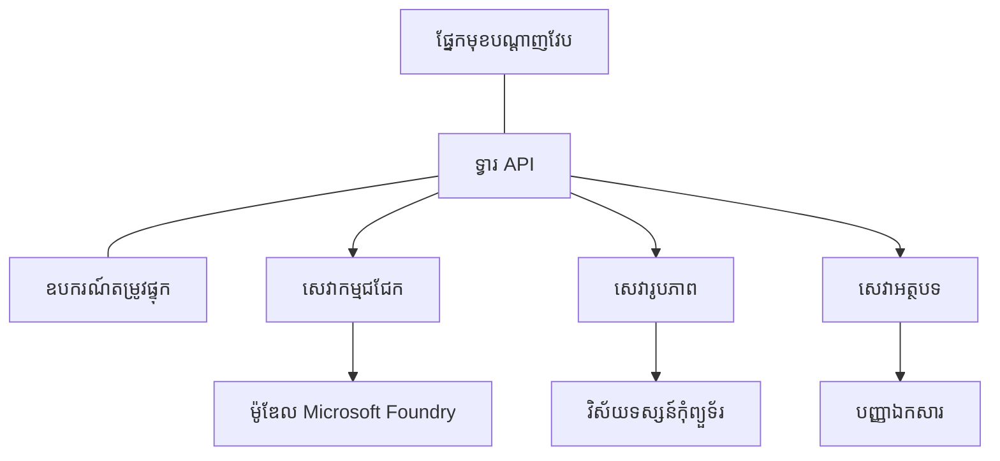

# ការអនុវត្តល្អបំផុតសម្រាប់បន្ទុកការងារ AI ផលិតកម្ម ជាមួយ AZD

**Chapter Navigation:**
- **📚 ទំព័រដើមវគ្គ**: [AZD For Beginners](../../README.md)
- **📖 ជំពូកបច្ចុប្បន្ន**: Chapter 8 - Production & Enterprise Patterns
- **⬅️ ជំពូកមុន**: [Chapter 7: Troubleshooting](../chapter-07-troubleshooting/debugging.md)
- **⬅️ ក៏ទាក់ទង**: [AI Workshop Lab](ai-workshop-lab.md)
- **🎯 បញ្ចប់វគ្គសិក្សា**: [AZD For Beginners](../../README.md)

## ទិដ្ឋភាពទូទៅ

មគ្គុទេសក៍នេះផ្តល់នូវអនុវត្តល្អបំផុតទូលំទូលាយសម្រាប់ដាក់ឲ្យដំណើរការបន្ទុកការងារ AI ដែលរួចរាល់សម្រាប់ផលិតកម្ម ដោយប្រើ Azure Developer CLI (AZD)។ ដោយផ្អែកលើមតិយោបល់ពីសហគមន៍ Microsoft Foundry Discord និងការដាក់ចេញប្រតិបត្តិការពិតនៅភពពេលវេលាពិតប្រាកដ ការអនុវត្តទាំងនេះដោះស្រាយបញ្ហាសារសំខាន់ៗក្នុងប្រព័ន្ធ AI ផលិតកម្ម។

## បញ្ហាសំខាន់ៗដែលបានដោះស្រាយ

ដោយផ្អែកលើលទ្ធផលគោលបំណងស្ទង់មតិពីសហគមន៍ នេះគឺជា​បញ្ហាសំខាន់ៗ​ដែលអ្នកអភិវឌ្ឍប្រឈមមុខ៖

- **45%** ប្រឈមមុខនឹងការដាក់ចេញ AI ដែលមានមុខងារច្រើននៅក្នុងសេវាកម្មច្រើន
- **38%** មានបញ្ហាជាមួយការគ្រប់គ្រងឯកសារជាមួយដេតាបន្ថែម និងសម្ងាត់  
- **35%** រកឃើញថាការរៀបចំសម្រាប់ផលិតកម្ម និងការពង្រីក​មានភាពលំបាក
- **32%** ត្រូវការយុទ្ធសាស្ត្រកាត់បន្ថយចំណាយល្អជាងនេះ
- **29%** ត្រូវការការត្រួតពិនិត្យ និងការរុករកកំហុសកាន់តែប្រសើរ

## គំរូស្ថាបត្យករណ៍សម្រាប់ AI ផលិតកម្ម

### គំរូ 1: ស្ថាបត្យកម្ម AI មីក្រូសេវា

**ពេលប្រើ**: កម្មវិធី AI ស្មុគស្មាញ ដែលមានមុខងារ​ច្រើន



**ការអនុវត្ត AZD**:

```yaml
# azure.yaml
name: enterprise-ai-platform
services:
  web:
    project: ./web
    host: staticwebapp
  api-gateway:
    project: ./api-gateway
    host: containerapp
  chat-service:
    project: ./services/chat
    host: containerapp
  vision-service:
    project: ./services/vision
    host: containerapp
  text-service:
    project: ./services/text
    host: containerapp
```

### គំរូ 2: ការកំណត់ដំណើរការដោយព្រឹត្តិការណ៍សម្រាប់ AI (Event-Driven)

**ពេលប្រើ**: ការប្រមូលជាគូប (batch processing), វិភាគឯកសារ, ដំណើរការមិនសម័យ (asynchronous workflows)

```bicep
// Event Hub for AI processing pipeline
resource eventHub 'Microsoft.EventHub/namespaces@2023-01-01-preview' = {
  name: eventHubNamespaceName
  location: location
  sku: {
    name: 'Standard'
    tier: 'Standard'
    capacity: 1
  }
}

// Service Bus for reliable message processing
resource serviceBus 'Microsoft.ServiceBus/namespaces@2022-10-01-preview' = {
  name: serviceBusNamespaceName
  location: location
  sku: {
    name: 'Premium'
    tier: 'Premium'
    capacity: 1
  }
}

// Function App for processing
resource functionApp 'Microsoft.Web/sites@2023-01-01' = {
  name: functionAppName
  location: location
  kind: 'functionapp,linux'
  properties: {
    siteConfig: {
      appSettings: [
        {
          name: 'FUNCTIONS_EXTENSION_VERSION'
          value: '~4'
        }
        {
          name: 'AZURE_OPENAI_ENDPOINT'
          value: '@Microsoft.KeyVault(VaultName=${keyVault.name};SecretName=openai-endpoint)'
        }
      ]
    }
  }
}
```

## ការគិតអំពីសុខភាពភ្នាក់ងារ AI

ពេលកម្មវិធីវេបបែបបុរាណខូច ការសម្គាល់អាការៈគឺស្គាល់បាន: ទំព័រមិនដំណើរការ, API ត្រឡប់កំហុស, ឬការដាក់ចេញបរាជ័យ។ កម្មវិធីដែលមានឈ្មោះដោយ AI អាចខូចដោយមានអាកប្បកិរិយាដូចគ្នាទាំងនេះ—ប៉ុន្តែវាក៏អាចធ្វើដំណើរមិនត្រឹមត្រូវក្នុងវិធីដែលស្តើងស្ទាត់ និងមិនបង្ហាញសារកំហុសច្បាស់។

ផ្នែកនេះជួយអ្នកសាងសង់គំរូផ្លូវចិត្តសម្រាប់ការត្រួតពិនិត្យបន្ទុកការងារ AI ដើម្បីអ្នកដឹងថាត្រូវស្វែងរកនៅកន្លែងណាពេលមានបញ្ហា។

### របៀបដែលសុខភាពភ្នាក់ងារខុសពីសុខភាពកម្មវិធីធម្មតា

កម្មវិធីធម្មតាអាចដំណើរការ ឬមិនដំណើរការ។ ភ្នាក់ងារ AI អាចបង្ហាញថាដំណើរការ ប៉ុន្តែផលលទ្ធផលអស់សិទ្ធិ។ គិតពីសុខភាពភ្នាក់ងារជាទ្វេស្រទាប់៖

| Layer | What to Watch | Where to Look |
|-------|--------------|---------------|
| **សុខភាពហេដ្ឋារចនាសម្ព័ន្ធ** | តើសេវាកម្មកំពុងដំណើរការ? តើធនធានបានផ្ដល់រួចហើយឬ? តើចំណុចចូលអាចទាក់ទងបានទេ? | `azd monitor`, សុខភាពធនធាននៅក្នុង Azure Portal, កំណត់ហេតុ container/app |
| **សុខភាពអាកប្បកិរិយា** | តើភ្នាក់ងារឆ្លើយតបបានត្រឹមត្រូវទេ? តើចម្លើយបាននៅពេលត្រឹមត្រូវទេ? តើម៉ូដែលត្រូវបានហៅយ៉ាងត្រឹមត្រូវទេ? | កំណត់ត្រា Application Insights, មេត្រិកពេលយឺតនៃការហៅម៉ូដែល, កំណត់ហេតុគុណភាពចម្លើយ |

សុខភាពហេដ្ឋារចនាសម្ព័ន្ធគឺស្គាល់រួច—វាដូចគ្នានៅសម្រាប់កម្មវិធី azd ណាមួយ។ សុខភាពអាកប្បកិរិយា គឺជាស្រទាប់ថ្មីដែលបន្ទុកការងារ AI បន្ថែមចូល។

### កន្លែងដែលត្រូវពិនិត្យពេលកម្មវិធី AI មិនបង្ហាញលក្ខណៈដូចដែលរំពឹងទុក

បើកម្មវិធី AI របស់អ្នកមិនបង្កើតលទ្ធផលដដែលដែលអ្នករំពឹង សូមពិនិត្យតាមបញ្ជីគំនិតនេះ៖

1. **ចាប់ផ្តើមពីមូលដ្ឋាន។** តើកម្មវិធីកំពុងដំណើរការទេ? តើវាអាចទាក់ទងទៅកាន់អាស្រ័យភាពរបស់វាទេ? ពិនិត្យ `azd monitor` និងសុខភាពធនធាន ដូចដែលអ្នកធ្វើសម្រាប់កម្មវិធីណាមួយ។
2. **ពិនិត្យការតភ្ជាប់ទៅម៉ូដែល។** តើកម្មវិធីរបស់អ្នកបានហៅម៉ូដែលដោយជោគជ័យទេ? ករណីហៅម៉ូដែលបរាជ័យ ឬหมดពេលជាទូទៅជាមូលហេតុនិងបំផ្លាញបញ្ហា AI ហើយនឹងបង្ហាញនៅក្នុងកំណត់ហេតុកម្មវិធីរបស់អ្នក។
3. **មើលអ្វីដែលម៉ូដែលបានទទួល។** ចម្លើយ AI អាស្រ័យលើបញ្ចូល (prompt និង context ដែលបានយកមក)។ បើលទ្ធផលខុស បញ្ចូលជាញឹកញាប់ដែរ។ ពិនិត្យថាកម្មវិធីរបស់អ្នកកំពុងផ្ញើទិន្នន័យត្រឹមត្រូវទៅម៉ូដែលឬអត់។
4. **ពិនិត្យពេលយឺតនៃចម្លើយ។** ការហៅម៉ូដែល AI យឺតជាងការហៅ API ទូទៅ។ បើកម្មវិធីមានអារម្មណ៍យឺត សូមពិនិត្យថាពេលឆ្លើយតបម៉ូដែលបានកើនឡើងឬអត់—នេះអាចសញ្ញាការត្រូវបានដាក់កាត់ចរ (throttling), កំណត់សមត្ថភាព ឬការឧបទ្បាញកម្រិតតំបន់។
5. **តាមដានសញ្ញាចំណាយ។** ការកើនឡើងដ៏មិនរំពឹងទុកក្នុងការប្រើ token ឬការហៅ API អាចបង្ហាញពីរបង្វិល, prompt កំណត់ខុស ឬការបញ្ចូនឡើងវិញច្រើនពេក។

អ្នកមិនចាំបាច់ឱ្យមានជំនាញខ្ពស់លើឧបករណ៍ observability ពេលភ្លាមទេ។ ចំណុចសំខាន់គឺកម្មវិធី AI មានស្រទាប់អាកប្បកិរិយាបន្ថែមដែលត្រូវតាមដាន ហើយការត្រួតពិនិត្យដែល built-in របស់ azd (`azd monitor`) ផ្តល់ជាចំណុចចាប់ផ្តើមសម្រាប់ពិនិត្យទាំងពីរស្រទាប់។

---

## កិច្ចអនុវត្តសុវត្ថិភាពល្អបំផុត

### 1. គំរូសុវត្ថិភាព Zero-Trust

**យុទ្ធសាស្ត្រ​អនុវត្ត៖**
- មិនមានការទំនាក់ទំនងពីសេវាមួយទៅសេវាផ្សេងដោយគ្មានការផ្ទៀងផ្ទាត់អត្តសញ្ញាណ
- ការហៅ API ទាំងអស់ប្រើអត្តសញ្ញាណដែលគ្រប់គ្រងដោយប្រព័ន្ធ
- ការផ្តាច់បណ្តាញជាមួយចំណុចចូលឯកជន
- ការត្រួតពិនិត្យការចូលប្រើដោយមានសិទ្ធិតិចបំផុត

```bicep
// Managed Identity for each service
resource chatServiceIdentity 'Microsoft.ManagedIdentity/userAssignedIdentities@2023-01-31' = {
  name: 'chat-service-identity'
  location: location
}

// Role assignments with minimal permissions
resource openAIUserRole 'Microsoft.Authorization/roleAssignments@2022-04-01' = {
  scope: openAIAccount
  name: guid(openAIAccount.id, chatServiceIdentity.id, openAIUserRoleDefinitionId)
  properties: {
    roleDefinitionId: subscriptionResourceId('Microsoft.Authorization/roleDefinitions', '5e0bd9bd-7b93-4f28-af87-19fc36ad61bd')
    principalId: chatServiceIdentity.properties.principalId
    principalType: 'ServicePrincipal'
  }
}
```

### 2. ការគ្រប់គ្រងសម្ងាត់យ៉ាងសុវត្ថិភាព

**គំរូការរួមបញ្ចូល Key Vault**:

```bicep
// Key Vault with proper access policies
resource keyVault 'Microsoft.KeyVault/vaults@2023-02-01' = {
  name: keyVaultName
  location: location
  properties: {
    tenantId: tenant().tenantId
    sku: {
      family: 'A'
      name: 'premium'  // Use premium for production
    }
    enableRbacAuthorization: true  // Use RBAC instead of access policies
    enablePurgeProtection: true    // Prevent accidental deletion
    enableSoftDelete: true
    softDeleteRetentionInDays: 90
  }
}

// Store all AI service credentials
resource openAIKeySecret 'Microsoft.KeyVault/vaults/secrets@2023-02-01' = {
  parent: keyVault
  name: 'openai-api-key'
  properties: {
    value: openAIAccount.listKeys().key1
    attributes: {
      enabled: true
    }
  }
}
```

### 3. សុវត្ថិភាពបណ្តាញ

**ការកំណត់រចនាសម្ព័ន្ធចំណុចចូលឯកជន**:

```bicep
// Virtual Network for AI services
resource virtualNetwork 'Microsoft.Network/virtualNetworks@2023-04-01' = {
  name: vnetName
  location: location
  properties: {
    addressSpace: {
      addressPrefixes: ['10.0.0.0/16']
    }
    subnets: [
      {
        name: 'ai-services-subnet'
        properties: {
          addressPrefix: '10.0.1.0/24'
          privateEndpointNetworkPolicies: 'Disabled'
        }
      }
      {
        name: 'app-services-subnet'
        properties: {
          addressPrefix: '10.0.2.0/24'
          delegations: [
            {
              name: 'Microsoft.Web/serverFarms'
              properties: {
                serviceName: 'Microsoft.Web/serverFarms'
              }
            }
          ]
        }
      }
    ]
  }
}

// Private endpoints for all AI services
resource openAIPrivateEndpoint 'Microsoft.Network/privateEndpoints@2023-04-01' = {
  name: '${openAIAccountName}-pe'
  location: location
  properties: {
    subnet: {
      id: virtualNetwork.properties.subnets[0].id
    }
    privateLinkServiceConnections: [
      {
        name: 'openai-connection'
        properties: {
          privateLinkServiceId: openAIAccount.id
          groupIds: ['account']
        }
      }
    ]
  }
}
```

## សមត្ថភាព និងការពង្រីក

### 1. យុទ្ធសាស្ត្រការដាក់ស្វ័យប្រវត្តិសម្រាប់ការពង្រីក

**Container Apps Auto-scaling**:

```bicep
resource containerApp 'Microsoft.App/containerApps@2023-05-01' = {
  name: containerAppName
  location: location
  properties: {
    configuration: {
      ingress: {
        external: true
        targetPort: 8000
        transport: 'http'
      }
    }
    template: {
      scale: {
        minReplicas: 2  // Always have 2 instances minimum
        maxReplicas: 50 // Scale up to 50 for high load
        rules: [
          {
            name: 'http-scaling'
            http: {
              metadata: {
                concurrentRequests: '20'  // Scale when >20 concurrent requests
              }
            }
          }
          {
            name: 'cpu-scaling'
            custom: {
              type: 'cpu'
              metadata: {
                type: 'Utilization'
                value: '70'  // Scale when CPU >70%
              }
            }
          }
        ]
      }
    }
  }
}
```

### 2. យុទ្ធសាស្រ្ត Caching

**Redis Cache សម្រាប់ចម្លើយ AI**:

```bicep
// Redis Premium for production workloads
resource redisCache 'Microsoft.Cache/redis@2023-04-01' = {
  name: redisCacheName
  location: location
  properties: {
    sku: {
      name: 'Premium'
      family: 'P'
      capacity: 1
    }
    enableNonSslPort: false
    minimumTlsVersion: '1.2'
    redisConfiguration: {
      'maxmemory-policy': 'allkeys-lru'
    }
    // Enable clustering for high availability
    redisVersion: '6.0'
    shardCount: 2
  }
}

// Cache configuration in application
var cacheConnectionString = '${redisCache.properties.hostName}:6380,password=${redisCache.listKeys().primaryKey},ssl=True,abortConnect=False'
```

### 3. ការប៉ះតម្រង់បន្ទុក និងការគ្រប់គ្រងចរាចរណ៍

**Application Gateway ជាមួយ WAF**:

```bicep
// Application Gateway with Web Application Firewall
resource applicationGateway 'Microsoft.Network/applicationGateways@2023-04-01' = {
  name: appGatewayName
  location: location
  properties: {
    sku: {
      name: 'WAF_v2'
      tier: 'WAF_v2'
      capacity: 2
    }
    webApplicationFirewallConfiguration: {
      enabled: true
      firewallMode: 'Prevention'
      ruleSetType: 'OWASP'
      ruleSetVersion: '3.2'
    }
    // Backend pools for AI services
    backendAddressPools: [
      {
        name: 'ai-services-pool'
        properties: {
          backendAddresses: [
            {
              fqdn: '${containerApp.properties.configuration.ingress.fqdn}'
            }
          ]
        }
      }
    ]
  }
}
```

## 💰 ការគ្រប់គ្រងចំណាយ

### 1. ការកំណត់ទំហំធនធានឲ្យសមរម្យ

**ការ​កំណត់រចនាសម្ព័ន្ធតាមបរិយាកាស**:

```bash
# បរិយាកាសអភិវឌ្ឍន៍
azd env new development
azd env set AZURE_OPENAI_SKU "S0"
azd env set AZURE_OPENAI_CAPACITY 10
azd env set AZURE_SEARCH_SKU "basic"
azd env set CONTAINER_CPU 0.5
azd env set CONTAINER_MEMORY 1.0

# បរិយាកាសផលិត
azd env new production
azd env set AZURE_OPENAI_SKU "S0"
azd env set AZURE_OPENAI_CAPACITY 100
azd env set AZURE_SEARCH_SKU "standard"
azd env set CONTAINER_CPU 2.0
azd env set CONTAINER_MEMORY 4.0
```

### 2. ការត្រួតពិនិត្យចំណាយ និងថវិកា

```bicep
// Cost management and budgets
resource budget 'Microsoft.Consumption/budgets@2023-05-01' = {
  name: 'ai-workload-budget'
  properties: {
    timePeriod: {
      startDate: '2024-01-01'
      endDate: '2024-12-31'
    }
    timeGrain: 'Monthly'
    amount: 2000  // $2000 monthly budget
    category: 'Cost'
    notifications: {
      warning: {
        enabled: true
        operator: 'GreaterThan'
        threshold: 80
        contactEmails: [
          'finance@company.com'
          'engineering@company.com'
        ]
        contactRoles: [
          'Owner'
          'Contributor'
        ]
      }
      critical: {
        enabled: true
        operator: 'GreaterThan'
        threshold: 95
        contactEmails: [
          'cto@company.com'
        ]
      }
    }
  }
}
```

### 3. ការបង្កើនប្រសិទ្ធភាពការប្រើ Token

**ការគ្រប់គ្រងចំណាយ OpenAI**:

```typescript
// ការបង្កើនប្រសិទ្ធភាពនៃតូកិននៅកម្រិតកម្មវិធី
class TokenOptimizer {
  private readonly maxTokens = 4000;
  private readonly reserveTokens = 500;
  
  optimizePrompt(userInput: string, context: string): string {
    const availableTokens = this.maxTokens - this.reserveTokens;
    const estimatedTokens = this.estimateTokens(userInput + context);
    
    if (estimatedTokens > availableTokens) {
      // កាត់បន្ថយបរិបទ មិនត្រូវកាត់បន្ថយការបញ្ចូលរបស់អ្នកប្រើ
      context = this.truncateContext(context, availableTokens - this.estimateTokens(userInput));
    }
    
    return `${context}\n\nUser: ${userInput}`;
  }
  
  private estimateTokens(text: string): number {
    // ការប៉ាន់ស្មានប្រហែល៖ 1 តូកិន ≈ 4 តួអក្សរ
    return Math.ceil(text.length / 4);
  }
}
```

## ការត្រួតពិនិត្យ និងការមើលឃើញ

### 1. ការប្រើ Application Insights ដោយទូលំទូលាយ

```bicep
// Application Insights with advanced features
resource applicationInsights 'Microsoft.Insights/components@2020-02-02' = {
  name: applicationInsightsName
  location: location
  kind: 'web'
  properties: {
    Application_Type: 'web'
    WorkspaceResourceId: logAnalyticsWorkspace.id
    SamplingPercentage: 100  // Full sampling for AI apps
    DisableIpMasking: false  // Enable for security
  }
}

// Custom metrics for AI operations
resource aiMetricAlerts 'Microsoft.Insights/metricAlerts@2018-03-01' = {
  name: 'ai-high-error-rate'
  location: 'global'
  properties: {
    description: 'Alert when AI service error rate is high'
    severity: 2
    enabled: true
    scopes: [
      applicationInsights.id
    ]
    evaluationFrequency: 'PT1M'
    windowSize: 'PT5M'
    criteria: {
      'odata.type': 'Microsoft.Azure.Monitor.SingleResourceMultipleMetricCriteria'
      allOf: [
        {
          name: 'high-error-rate'
          metricName: 'requests/failed'
          operator: 'GreaterThan'
          threshold: 10
          timeAggregation: 'Count'
        }
      ]
    }
  }
}
```

### 2. ការត្រួតពិនិត្យពិសេសសម្រាប់ AI

**ផ្ទាំងតាមដានផ្ទាល់ខ្លួនសម្រាប់មេត្រិក AI**:

```json
// Dashboard configuration for AI workloads
{
  "dashboard": {
    "name": "AI Application Monitoring",
    "tiles": [
      {
        "name": "OpenAI Request Volume",
        "query": "requests | where name contains 'openai' | summarize count() by bin(timestamp, 5m)"
      },
      {
        "name": "AI Response Latency",
        "query": "requests | where name contains 'openai' | summarize avg(duration) by bin(timestamp, 5m)"
      },
      {
        "name": "Token Usage",
        "query": "customMetrics | where name == 'openai_tokens_used' | summarize sum(value) by bin(timestamp, 1h)"
      },
      {
        "name": "Cost per Hour",
        "query": "customMetrics | where name == 'openai_cost' | summarize sum(value) by bin(timestamp, 1h)"
      }
    ]
  }
}
```

### 3. ការត្រួតពិនិត្យសុខភាព និងការតាមដាន uptime

```bicep
// Application Insights availability tests
resource availabilityTest 'Microsoft.Insights/webtests@2022-06-15' = {
  name: 'ai-app-availability-test'
  location: location
  tags: {
    'hidden-link:${applicationInsights.id}': 'Resource'
  }
  properties: {
    SyntheticMonitorId: 'ai-app-availability-test'
    Name: 'AI Application Availability Test'
    Description: 'Tests AI application endpoints'
    Enabled: true
    Frequency: 300  // 5 minutes
    Timeout: 120    // 2 minutes
    Kind: 'ping'
    Locations: [
      {
        Id: 'us-east-2-azr'
      }
      {
        Id: 'us-west-2-azr'
      }
    ]
    Configuration: {
      WebTest: '''
        <WebTest Name="AI Health Check" 
                 Id="8d2de8d2-a2b0-4c2e-9a0d-8f9c9a0b8c8d" 
                 Enabled="True" 
                 CssProjectStructure="" 
                 CssIteration="" 
                 Timeout="120" 
                 WorkItemIds="" 
                 xmlns="http://microsoft.com/schemas/VisualStudio/TeamTest/2010" 
                 Description="" 
                 CredentialUserName="" 
                 CredentialPassword="" 
                 PreAuthenticate="True" 
                 Proxy="default" 
                 StopOnError="False" 
                 RecordedResultFile="" 
                 ResultsLocale="">
          <Items>
            <Request Method="GET" 
                     Guid="a5f10126-e4cd-570d-961c-cea43999a200" 
                     Version="1.1" 
                     Url="${webApp.properties.defaultHostName}/health" 
                     ThinkTime="0" 
                     Timeout="120" 
                     ParseDependentRequests="True" 
                     FollowRedirects="True" 
                     RecordResult="True" 
                     Cache="False" 
                     ResponseTimeGoal="0" 
                     Encoding="utf-8" 
                     ExpectedHttpStatusCode="200" 
                     ExpectedResponseUrl="" 
                     ReportingName="" 
                     IgnoreHttpStatusCode="False" />
          </Items>
        </WebTest>
      '''
    }
  }
}
```

## ស្ដារឡើងវិញបន្ទាប់ពីគ្រោះថ្នាក់ និងភាពអាចប្រើបានខ្ពស់

### 1. ការដាក់ប្រតិបត្តិការនៅក្នុងតំបន់ច្រើន

```yaml
# azure.yaml - Multi-region configuration
name: ai-app-multiregion
services:
  api-primary:
    project: ./api
    host: containerapp
    env:
      - AZURE_REGION=eastus
  api-secondary:
    project: ./api
    host: containerapp
    env:
      - AZURE_REGION=westus2
```

```bicep
// Traffic Manager for global load balancing
resource trafficManager 'Microsoft.Network/trafficManagerProfiles@2022-04-01' = {
  name: trafficManagerProfileName
  location: 'global'
  properties: {
    profileStatus: 'Enabled'
    trafficRoutingMethod: 'Priority'
    dnsConfig: {
      relativeName: trafficManagerProfileName
      ttl: 30
    }
    monitorConfig: {
      protocol: 'HTTPS'
      port: 443
      path: '/health'
      intervalInSeconds: 30
      toleratedNumberOfFailures: 3
      timeoutInSeconds: 10
    }
    endpoints: [
      {
        name: 'primary-endpoint'
        type: 'Microsoft.Network/trafficManagerProfiles/azureEndpoints'
        properties: {
          targetResourceId: primaryAppService.id
          endpointStatus: 'Enabled'
          priority: 1
        }
      }
      {
        name: 'secondary-endpoint'
        type: 'Microsoft.Network/trafficManagerProfiles/azureEndpoints'
        properties: {
          targetResourceId: secondaryAppService.id
          endpointStatus: 'Enabled'
          priority: 2
        }
      }
    ]
  }
}
```

### 2. ការបម្រុងទុក និងស្ដារទិន្នន័យ

```bicep
// Backup configuration for critical data
resource backupVault 'Microsoft.DataProtection/backupVaults@2023-05-01' = {
  name: backupVaultName
  location: location
  identity: {
    type: 'SystemAssigned'
  }
  properties: {
    storageSettings: [
      {
        datastoreType: 'VaultStore'
        type: 'LocallyRedundant'
      }
    ]
  }
}

// Backup policy for AI models and data
resource backupPolicy 'Microsoft.DataProtection/backupVaults/backupPolicies@2023-05-01' = {
  parent: backupVault
  name: 'ai-data-backup-policy'
  properties: {
    policyRules: [
      {
        backupParameters: {
          backupType: 'Full'
          objectType: 'AzureBackupParams'
        }
        trigger: {
          schedule: {
            repeatingTimeIntervals: [
              'R/2024-01-01T02:00:00+00:00/P1D'  // Daily at 2 AM
            ]
          }
          objectType: 'ScheduleBasedTriggerContext'
        }
        dataStore: {
          datastoreType: 'VaultStore'
          objectType: 'DataStoreInfoBase'
        }
        name: 'BackupDaily'
        objectType: 'AzureBackupRule'
      }
    ]
  }
}
```

## DevOps និងការរួមបញ្ចូល CI/CD

### 1. លំហូរការងារ GitHub Actions

```yaml
# .github/workflows/deploy-ai-app.yml
name: Deploy AI Application

on:
  push:
    branches: [main]
  pull_request:
    branches: [main]

jobs:
  test:
    runs-on: ubuntu-latest
    steps:
      - uses: actions/checkout@v4
      
      - name: Setup Python
        uses: actions/setup-python@v4
        with:
          python-version: '3.11'
          
      - name: Install dependencies
        run: |
          pip install -r requirements.txt
          pip install pytest
          
      - name: Run tests
        run: pytest tests/
        
      - name: AI Safety Tests
        run: |
          python scripts/test_ai_safety.py
          python scripts/validate_prompts.py

  deploy-staging:
    needs: test
    if: github.event_name == 'pull_request'
    runs-on: ubuntu-latest
    steps:
      - uses: actions/checkout@v4
      
      - name: Setup AZD
        uses: Azure/setup-azd@v2
        
      - name: Login to Azure
        uses: azure/login@v1
        with:
          creds: ${{ secrets.AZURE_CREDENTIALS }}
          
      - name: Deploy to Staging
        run: |
          azd env select staging
          azd deploy

  deploy-production:
    needs: test
    if: github.ref == 'refs/heads/main'
    runs-on: ubuntu-latest
    steps:
      - uses: actions/checkout@v4
      
      - name: Setup AZD
        uses: Azure/setup-azd@v2
        
      - name: Login to Azure
        uses: azure/login@v1
        with:
          creds: ${{ secrets.AZURE_CREDENTIALS }}
          
      - name: Deploy to Production
        run: |
          azd env select production
          azd deploy
          
      - name: Run Production Health Checks
        run: |
          python scripts/health_check.py --env production
```

### 2. ការបញ្ជាក់ហេដ្ឋារចនាសម្ព័ន្ធ

```bash
# scripts/validate_infrastructure.sh
#!/bin/bash

echo "Validating AI infrastructure deployment..."

# ពិនិត្យមើលថា សេវាកម្មទាំងអស់ដែលត្រូវការកំពុងដំណើរការ
services=("openai" "search" "storage" "keyvault")
for service in "${services[@]}"; do
    echo "Checking $service..."
    if ! az resource list --resource-type "Microsoft.CognitiveServices/accounts" --query "[?contains(name, '$service')]" -o tsv; then
        echo "ERROR: $service not found"
        exit 1
    fi
done

# ផ្ទៀងផ្ទាត់ការដាក់ប្រើម៉ូឌែល OpenAI
echo "Validating OpenAI model deployments..."
models=$(az cognitiveservices account deployment list --name $AZURE_OPENAI_NAME --resource-group $AZURE_RESOURCE_GROUP --query "[].name" -o tsv)
if [[ ! $models == *"gpt-4.1-mini"* ]]; then
  echo "ERROR: Required model gpt-4.1-mini not deployed"
    exit 1
fi

# សាកល្បងការតភ្ជាប់ទៅសេវាកម្ម AI
echo "Testing AI service connectivity..."
python scripts/test_connectivity.py

echo "Infrastructure validation completed successfully!"
```

## បញ្ជីត្រួតពិនិត្យភាពរួចរាល់សម្រាប់ផលិតកម្ម

### សុវត្ថិភាព ✅
- [ ] សេវាទាំងអស់ប្រើអត្តសញ្ញាណដែលគ្រប់គ្រងដោយប្រព័ន្ធ
- [ ] សម្ងាត់ផ្ទុកក្នុង Key Vault
- [ ] ចំណុចចូលឯកជនបានកំណត់រចនាសម្ព័ន្ធ
- [ ] ក្រុមសុវត្ថិភាពបណ្តាញបានអនុវត្ត
- [ ] RBAC ជាមួយសិទ្ធិតិចបំផុត
- [ ] WAF បានបើកនៅលើចំណុចចូលសាធារណៈ

### សមត្ថភាព ✅
- [ ] ការដាក់ស្វ័យប្រវត្តិសម្រាប់ការពង្រីកបានកំណត់រួច
- [ ] ការកែតម្រូវ caching បានអនុវត្ត
- [ ] ការបង្វិលបន្ទុកបានកំណត់
- [ ] CDN សម្រាប់មាតិកា​ស្ថិតិស្ថេរ
- [ ] ការបង្កើតការភ្ជាប់ទៅDB ដោយ pooling
- [ ] ការបង្កើនប្រសិទ្ធភាពការប្រើ token

### ការត្រួតពិនិត្យ ✅
- [ ] Application Insights បានកំណត់រួច
- [ ] មេត្រិកផ្ទាល់ខ្លួនបានកំណត់
- [ ] ការកំណត់ច្បាប់ការ alerted បានរៀបចំ
- [ ] ផ្ទាំងតាមដានបានបង្កើត
- [ ] ការត្រួតពិនិត្យសុខភាពបានអនុវត្ត
- [ ] គោលនយោបាយរក្សាទុកកំណត់ហេតុ

### ភាពទំនុកចិត្ត ✅
- [ ] ការដាក់ប្រតិបត្តិការនៅក្នុងតំបន់ច្រើន
- [ ] ផែនការបម្រុងទុក និងស្ដារឡើងវិញ
- [ ] តម្រូវការរកាត់ចរន្ត (circuit breakers) អនុវត្ត
- [ ] គោលការណ៍ retry បានកំណត់
- [ ] ការធ្វើចុះបន្ទាន់យ៉ាងរាបសារ (graceful degradation)
- [ ] ចំណុចចូលសម្រាប់ត្រួតពិនិត្យសុខភាព

### ការគ្រប់គ្រងចំណាយ ✅
- [ ] ការជូនដំណឹងថវិកា បានកំណត់
- [ ] ការកំណត់ទំហំធនធានឲ្យសមរម្យ
- [ ] ការបញ្ចុះតម្លៃសម្រាប់ Dev/test បានអនុវត្ត
- [ ] reserved instances បានទិញ
- [ ] ផ្ទាំងតាមដានចំណាយ
- [ ] ការពិនិត្យចំណាយជាប្រចាំ

### ការអនុលោម ✅
- [ ] បានបំពេញតម្រូវការអាស័យដ្ឋានទិន្នន័យ
- [ ] ការកំណត់ហេតុ audit បានបើក
- [ ] គោលនយោបាយអនុលោមបានអនុវត្ត
- [ ] សន្ទស្សន៍សុវត្ថិភាពបានអនុវត្ត
- [ ] การវាយតម្លៃសុវត្ថិភាពជាប្រចាំ
- [ ] ផែនការឆ្លើយតបព្រឹត្តិការណ៍

## គំរូសមត្ថភាព

### មេត្រិកទូទៅក្នុងផលិតកម្ម

| Metric | Target | Monitoring |
|--------|--------|------------|
| **Response Time** | < 2 seconds | Application Insights |
| **Availability** | 99.9% | Uptime monitoring |
| **Error Rate** | < 0.1% | Application logs |
| **Token Usage** | < $500/month | Cost management |
| **Concurrent Users** | 1000+ | Load testing |
| **Recovery Time** | < 1 hour | Disaster recovery tests |

### ការធ្វើតេស្តបន្ទុក

```bash
# ស្គ្រីបសម្រាប់ធ្វើតេស្តផ្ទុកសម្រាប់កម្មវិធី AI
python scripts/load_test.py \
  --endpoint https://your-ai-app.azurewebsites.net \
  --concurrent-users 100 \
  --duration 300 \
  --ramp-up 60
```

## 🤝 អនុវត្តល្អបំផុតពីសហគមន៍

ដោយផ្អែកលើមតិយោបល់ពីសហគមន៍ Microsoft Foundry Discord:

### ការណែនាំកំពូលពីសហគមន៍:

1. **ចាប់ផ្តើមតូចៗ បន្ដបង្កើនយឺតៗ**: ចាប់ផ្តើមជាមួយ SKU មូលដ្ឋាន ហើយពង្រីកបន្តទៅតាមការប្រើប្រាស់ពិតប្រាកដ
2. **ត្រួតពិនិត្យគ្រប់យ៉ាង**: រៀបចំការត្រួតពិនិត្យទូលំទូលាយចាប់ពីថ្ងៃដើម
3. **ស្វ័យប្រវត្តិសម្រាប់សុវត្ថិភាព**: ប្រើ Infrastructure as Code សម្រាប់សុវត្ថិភាពដែលមានភាពឯកសារដូចគ្នា
4. **សាកល្បងយ៉ាងហ្មត់ចត**: រួមបញ្ចូលការធ្វើតេស្តពិសេសសម្រាប់ AI ក្នុងបណ្ដាញរបស់អ្នក
5. **រៀបចំផែនការសម្រាប់ចំណាយ**: តាមដានការប្រើ token និងកំណត់អការណ៍ថវិកាចាប់ពីដើម

### កំហុសទូទៅដែលត្រូវជៀសវាង:

- ❌ ការដាក់ API keys យ៉ាងរឹងនៅក្នុងកូដ
- ❌ មិនរៀបចំការត្រួតពិនិត្យឲ្យត្រឹមត្រូវ
- ❌ ធ្វើម្ហូបចំណាយអច្បាប់
- ❌ មិនសាកល្បងស្ថានភាពបរាជ័យ
- ❌ ដាក់ចេញដោយគ្មានការត្រួតពិនិត្យសុខភាព

## ពាក្យបញ្ជា AZD AI CLI និងផ្នែកបន្ថែម

AZD រួមមានសំណុំនៃពាក្យបញ្ជាមួយចំនួនដែលផ្តល់អត្ថិភាពពិសេសសម្រាប់ AI និងផ្នែកបន្ថែមដែលធ្វើឲ្យដំណើរការពេញផលិតកម្មសម្រាប់បន្ទុកការងារ AI ងាយស្រួល។ ឧបករណ៍ទាំងនេះជាស្ពានចន្លោះរវាងការអភិវឌ្ឍនៅក្នុងតំបន់មូលដ្ឋាននិងការដាក់ចេញទៅផលិតកម្ម។

### ផ្នែកបន្ថែម AZD សម្រាប់ AI

AZD ប្រើប្រព័ន្ធផ្នែកបន្ថែមដើម្បីបន្ថែមសមត្ថភាពពិសេសសម្រាប់ AI។ តម្លើង និងគ្រប់គ្រងផ្នែកបន្ថែមដោយ៖

```bash
# បញ្ជីផ្នែកបន្ថែមទាំងអស់ដែលមាន (រួមទាំង AI)
azd extension list

# ពិនិត្យលម្អិតអំពីផ្នែកបន្ថែមដែលបានដំឡើង
azd extension show azure.ai.agents

# ដំឡើងផ្នែកបន្ថែម Foundry agents
azd extension install azure.ai.agents

# ដំឡើងផ្នែកបន្ថែម fine-tuning
azd extension install azure.ai.finetune

# ដំឡើងផ្នែកបន្ថែមម៉ូដែលផ្ទាល់ខ្លួន
azd extension install azure.ai.models

# បន្ទាន់សម័យផ្នែកបន្ថែមទាំងអស់ដែលបានដំឡើង
azd extension upgrade --all
```

**ផ្នែកបន្ថែម AI ដែលអាចប្រើបាន៖**

| Extension | Purpose | Status |
|-----------|---------|--------|
| `azure.ai.agents` | ការគ្រប់គ្រង Foundry Agent Service | Preview |
| `azure.ai.skills` | ជំនាញដែលអាចប្រើឡើងវិញសម្រាប់ភ្នាក់ងារ | Preview |
| `azure.ai.connections` | ការតភ្ជាប់ Foundry (ប្រភពទិន្នន័យ, ឧបករណ៍) | Preview |
| `azure.ai.finetune` | ការបង្វឹកម៉ូដែលក្នុង Foundry | Preview |
| `azure.ai.models` | ម៉ូដែលប្តូរតាម Foundry | Preview |
| `azure.coding-agent` | ការកំណត់រចនាសម្ព័ន្ធ coding agent | Available |

> ផ្នែកបន្ថែម `azure.ai.agents` កំពុងអភិវឌ្ឍយ៉ាងលឿន។ វគ្គសិក្សានេះត្រូវបានផ្ទៀងផ្ទាត់ប្រឆាំងនឹង `0.1.40-preview`។ បើកការបញ្ជា `azd extension upgrade --all` ដើម្បីយកសំណុកពាក្យបញ្ជាថ្មីៗ និង `azd extension show azure.ai.agents` ដើម្បីបញ្ជាក់កំណែដែលបានដំឡើង។

**អ្វីទៅជាផ្នែកបន្ថែមថ្មី `skills` និង `connections`?**

មានផ្នែកបន្ថែម preview ពីរបានបង្ហាញរួចជាមួយឧបករណ៍ភ្នាក់ងារ ហើយមានតម្លៃក្នុងការស្វែងយល់ទោះអ្នកជាអ្នកចាប់ផ្ដើមក៏ដោយ៖

- **`azure.ai.skills`** — មួយ **skill** គឺជាសមត្ថភាពដែលអាចប្រើឡើងវិញ (ឧបករណ៍ឬអាកប្បកិរិយាប្រើប្រាស់ដែលបន្ទាប់) ដែលអ្នកអាចភ្ជាប់ចូលទៅភ្នាក់ងារមួយឬច្រើន ជាពិចារណានៃប្លុករាងក្រុមដែលអាចចែករំលែក៖ និយាយថា កំណត់ skill "ស្វែងរកឯកសារ" ឬ "ស្វែងរកបញ្ជាទិញ" មួយដង ហើយប្រើឡើងវិញក្នុងភ្នាក់ងារច្រើន។ នេះធ្វើឲ្យប្រព័ន្ធភ្នាក់ងារច្រើន (ជំពូក 5) មានសមរម្យ និងជៀសវាងការចម្លងកូដ។
- **`azure.ai.connections`** — មួយ **connection** គឺជាការតភ្ជាប់ដែលគ្រប់គ្រងពីគម្រោង Foundry របស់អ្នកទៅប្រភពបន្ទាន់ដែលភ្នាក់ងាររបស់អ្នកត្រូវការជាចាំបាច់—ប្រភពទិន្នន័យ (ដូចជា Azure AI Search), ចំណុចឧបករណ៍ ឬសេវាផ្សេងទៀត។ Connections បម្រើជាកន្លែងកណ្តាលសម្រាប់ *កន្លែង* និង *របៀប* ដែលភ្នាក់ងារACCESSទិន្នន័យ ដូច្នេះព័ត៌មានសំងាត់ និងចំណុចចូលរស់នៅក្នុងមួយកន្លែងដែលគ្រប់គ្រងបាន មិនរាយនៅក្នុងកូដរីករាយឡើយ។

អ្នកមិនចាំបាច់ប្រើពួកនេះដើម្បីដាក់ចេញភ្នាក់ងារដំបូងរបស់អ្នក—សូមនៅជាមួយ `azure.ai.agents` ខណៈអ្នករៀន។ ប្រើ `skills` នៅពេលអ្នកឃើញខ្លួនឯងកំពុងចម្លងឧបករណ៍ដូចគ្នាច្រើនភ្នាក់ងារ និង `connections` នៅពេលភ្នាក់ងារច្រើនចែករំលែកប្រភពទិន្នន័យដូចគ្នា។

### ការចាប់ផ្តើមគម្រោងភ្នាក់ងារជាមួយ `azd ai agent init`

ពាក្យបញ្ជា `azd ai agent init` បង្កើតសុទិដ្ឋិនិយមគម្រោងភ្នាក់ងារ AI ដែលរួចរាល់សម្រាប់ផលិតកម្ម និងរួមបញ្ចូលជាមួយ Microsoft Foundry Agent Service:

```bash
# ចាប់ផ្ដើមគម្រោងភ្នាក់ងារថ្មីពីឯកសារ manifest នៃភ្នាក់ងារ
azd ai agent init -m <manifest-path-or-uri>

# ចាប់ផ្ដើម និងកំណត់គោលដៅទៅគម្រោង Foundry ជាក់លាក់
azd ai agent init -m agent-manifest.yaml --project-id <foundry-project-id>

# ចាប់ផ្ដើមដោយប្រើថតប្រភពផ្ទាល់ខ្លួន
azd ai agent init -m agent-manifest.yaml --src ./agents/my-agent

# កំណត់ Container Apps ជា បរិស្ថាន ដំណើរការ (host)
azd ai agent init -m agent-manifest.yaml --host containerapp
```

**ទង់សំខាន់:** 

| Flag | Description |
|------|-------------|
| `-m, --manifest` | ផ្លូវ ឬ URI ទៅ manifest ភ្នាក់ងារដើម្បីបន្ថែមទៅគម្រោងរបស់អ្នក |
| `-p, --project-id` | Microsoft Foundry Project ID ថ្មីសម្រាប់បរិយាកាស azd របស់អ្នក |
| `-s, --src` | បង់ឯកសារដើម្បីទាញយកនិយមន័យភ្នាក់ងារ (លំនាំដើមទៅ `src/<agent-id>`) |
| `--host` | លៃតម្រូវ host លំនាំដើម (ឧ. `containerapp`) |
| `-e, --environment` | បរិយាកាស azd ដែលត្រូវប្រើ |

**បញ្ហាសម្រាប់ផលិតកម្ម**: ប្រើ `--project-id` ដើម្បីភ្ជាប់ដោយផ្ទាល់ទៅគម្រោង Foundry មានស្រាប់ បន្ថែមកូដភ្នាក់ងារនិងធនធានពពកណាត់ពីដើម។

### ការគ្រប់គ្រងអាយុកាលភ្នាក់ងារ

សែកលើ `init` អន្ដរជាប់ ផ្នែកបន្ថែម `azure.ai.agents` ផ្តល់ពាក្យបញ្ជាសម្រាប់អាយុកាលពេញលេញនៃភ្នាក់ងារដែលផ្តល់សេវា—ធ្វើតេស្ត, វាយតម្លៃ, បង្កើនប្រសិទ្ធភាព និងចេញពីប្រព័ន្ធ:

```bash
# ហៅភ្នាក់ងារដែលបានដាក់ឱ្យដំណើរការ និងមើលពេលវេលាចម្លើយពីម៉ាស៊ីនបម្រើ
# (រយៈពេលយឺតសរុប និង ពេលដល់បៃដំបូង)
azd ai agent invoke

# បង្ហាញកំណត់រចនាសម្ព័ន្ធចំណុចបញ្ចប់ដែលកំពុងដំណើរការ មុនផ្លាស់ប្ដូរ
azd ai agent endpoint show

# បង្កើតសំណុំទិន្នន័យសម្រាប់វាយតម្លៃឲ្យភ្នាក់ងារ
azd ai agent eval generate --dataset ./eval/dataset.jsonl

# ធ្វើឲ្យណែនាំរបស់ភ្នាក់ងារប្រសើរឡើងដោយប្រើទិន្នន័យវាយតម្លៃរបស់អ្នក
# (តម្រូវឲ្យមាន optimization_model ក្នុងគម្រោងភ្នាក់ងារ)
azd ai agent optimize

# ទាញយកកូដប្រភពដែលបានដាក់ចេញសម្រាប់ភ្នាក់ងារដែលផ្អែកលើកូដ និងបានផ្តល់ជាសេវា
# (ជាមួយការផ្ទៀងផ្ទាត់ SHA-256)
azd ai agent code download

# លុបភ្នាក់ងារដែលផ្តល់ជាសេវា និងកំណែទាំងអស់របស់វា
# (--force បញ្ចប់សម័យដែលកំពុងសកម្ម)
azd ai agent delete --force
```

**រង្វង់ជីវិតជាសង្ខេប:**

| Stage | Command | Production use |
|-------|---------|----------------|
| Test | `azd ai agent invoke` | ផ្ទៀងផ្ទាត់ចម្លើយ និងវាស់ពេលយឺត មុនការចេញផ្សាយ |
| Inspect | `azd ai agent endpoint show` | ពិនិត្យ auth/config នៃ endpoint; រកឃើញការបំផ្លាញឆាប់ |
| Measure | `azd ai agent eval generate` | សាងចំណាតវាយតម្លៃដែលអាចធ្វើឡើងម្តងទៀតពីហេតុការណ៍ពិត |
| Improve | `azd ai agent optimize` | លៃតម្រូវសេចក្តីណែនាំអោយបានតាមគុណភាពដែលវាស់បាន |
| Recover | `azd ai agent code download` | ទាញយកប្រភពដែលបានដាក់ចេញពិតសម្រាប់ audit/rollback |
| Retire | `azd ai agent delete --force` | លុបភ្នាក់ងារ និងកំណែកាត់វានៅឡើយស្អាត |

> ពាក្យបញ្ជាខាងលើឈ្មោះជា preview ហើយអាចផ្លាស់ប្ដូរក្នុងការចេញផ្សាយផ្នែកបន្ថែម។ បើក `azd ai agent --help` ដើម្បីមើល subcommands ដែលមាននៅក្នុងកំណែកដែលបានដំឡើង។

### Model Context Protocol (MCP) ជាមួយ `azd mcp`
AZD includes built-in MCP server support (Alpha), enabling AI agents and tools to interact with your Azure resources through a standardized protocol:

```bash
# ចាប់ផ្ដើមម៉ាស៊ីនបម្រើ MCP សម្រាប់គម្រោងរបស់អ្នក
azd mcp start

# ពិនិត្យច្បាប់ការយល់ព្រមបច្ចុប្បន្នរបស់ Copilot សម្រាប់ការប្រើឧបករណ៍
azd copilot consent list
```

ម៉ាស៊ីនបម្រើ MCP បានបង្ហាញបរិបទគម្រោង azd របស់អ្នក—បរិយាកាស សេវាកម្ម និងធនធាន Azure—ដល់ឧបករណ៍អភិវឌ្ឍដែលមានថាមពល AI។ នេះអនុញ្ញាតឱ្យ:

- **AI-assisted deployment**: អនុញ្ញាតឲ្យភ្នាក់ងារកូដសួរសំណួរអំពីស្ថានភាពគម្រោងរបស់អ្នក និងចាប់ផ្តើមការចែកចាយ
- **Resource discovery**: ឧបករណ៍ AI អាចរកឃើញថាធនធាន Azure មួយចំនួនដែលគម្រោងរបស់អ្នកប្រើ
- **Environment management**: ភ្នាក់ងារអាចប្តូរពេលរវាង បរិយាកាស dev/staging/production

### Infrastructure Generation with `azd infra generate`

សម្រាប់ការងារ AI ក្នុងបរិយាកាសផលិតកម្ម អ្នកអាចបង្កើត និងប្ដូរប្លង់ Infrastructure as Code ជំនួសការរំពឹងទុកលើការផ្គត់ផ្គង់ស្វ័យប្រវត្តិ៖

```bash
# បង្កើត​ឯកសារ Bicep/Terraform ពីការបញ្ជាក់គម្រោងរបស់អ្នក
azd infra generate
```

នេះនឹងសរសេរ IaC ទៅក្នុងឌីសដើម្បីឲ្យអ្នកអាច:
- ពិនិត្យ និងធ្វើ audit ទៅលើអាហារដ្ឋានមុនពេលចែកចាយ
- បន្ថែមគោលនយោបាយសន្តិសុខបុគ្គលិក (ច្បាប់បណ្ដាញ, private endpoints)
- បញ្ចូលជាមួយដំណើរការពិនិត្យ IaC មានស្រាប់
- គ្រប់គ្រងកំណែបម្លែងរចនាសម្ព័ន្ធដោយដាច់ពីកូដកម្មវិធី

### Production Lifecycle Hooks

AZD hooks អនុញ្ញាតឲ្យអ្នកបញ្ចូលយុទ្ធសាស្ត្របុគ្គលនៅគ្រប់ដំណាក់កាលនៃជីវចក្រារចនាការចែកចាយ—ដែលសំខាន់សម្រាប់កម្មវិធី AI នៅផលិតកម្ម៖

```yaml
# azure.yaml - Production hooks example
name: ai-production-app
hooks:
  preprovision:
    shell: sh
    run: scripts/validate-quotas.sh    # Check AI model quota before provisioning
  postprovision:
    shell: sh
    run: scripts/configure-networking.sh  # Set up private endpoints
  predeploy:
    shell: sh
    run: scripts/run-ai-safety-tests.sh  # Run prompt safety checks
  postdeploy:
    shell: sh
    run: scripts/smoke-test.sh           # Verify agent responses post-deploy
services:
  agent-api:
    project: ./src/agent
    host: containerapp
    hooks:
      predeploy:
        shell: sh
        run: scripts/validate-model-access.sh  # Per-service hook
```

```bash
# រត់ហ៊ុចជាក់លាក់ដោយដៃនៅក្នុងកំឡុងពេលអភិវឌ្ឍន៍
azd hooks run predeploy
```

**យោង hook ផលិតកម្មដែលបានណែនាំសម្រាប់ការងារ AI៖**

| Hook | ករណីប្រើ |
|------|----------|
| `preprovision` | ផ្ទៀងផ្ទាត់គណៈបញ្ជាក់ subscription សម្រាប់សមត្ថភាពម៉ូឌែល AI |
| `postprovision` | កំណត់ private endpoints, ចែកចាយទំងន់ម៉ូឌែល |
| `predeploy` | រត់តេស្តសុវត្ថិភាព AI, ផ្ទៀងផ្ទាត់ទំរងPrompt |
| `postdeploy` | តេស្តបង្ហាញចម្លើយភ្នាក់ងារ, ធ្វើឲ្យប្រាកដពីការតភ្ជាប់ម៉ូឌែល |

### CI/CD Pipeline Configuration

ប្រើ `azd pipeline config` ដើម្បីភ្ជាប់គម្រោងរបស់អ្នកទៅ GitHub Actions ឬ Azure Pipelines ជាមួយការផ្ទៀងផ្ទាត់អត្តសញ្ញាណ Azure ដែលមានសម្ងាត់៖

```bash
# កំណត់រចនាសម្ព័ន្ធ CI/CD (អន្តរកម្ម)
azd pipeline config

# កំណត់ជាមួយអ្នកផ្គត់ផ្គង់ជាក់លាក់
azd pipeline config --provider github
```

កំណត់បញ្ជានេះ:
- បង្កើត service principal ជាមួយចូលដំណើរការក្បួនល្អបំផុត (least-privilege)
- កំណត់ federated credentials (គ្មានអាថ៌កំបាំងដែលបានរក្សាទុក)
- បង្កើតឬធ្វើបច្ចុប្បន្នភាពឯកសារផ្សព្វផ្សាយ pipeline របស់អ្នក
- កំណត់អថេរបរិយាកាសដែលត្រូវការនៅក្នុងប្រព័ន្ធ CI/CD របស់អ្នក

#### Step-by-step: your first GitHub Actions pipeline

នេះជាមាតិកាគ្រប់ដំណាក់កាលចាប់ពីគម្រោង azd ដែលដំណើរការបាន ដល់ការចែកចាយស្វ័យប្រវត្តិដោយលើកដាក់រាល់ការផុស។

**1. Make sure your project is on GitHub**

```bash
git init
git add .
git commit -m "Initial azd project"
gh repo create my-ai-app --private --source=. --push
```

**2. Run pipeline config**

```bash
azd pipeline config --provider github
```

azd នឹង, ក្នុងរបៀបអន្តរកម្ម:
- សួរថាតើ subscription និងបរិយាកាស Azure ណាដែលត្រូវដាក់កំណត់
- បង្កើត Entra **app registration + service principal** សម្រាប់ pipeline
- កំណត់ **federated credentials (OIDC)**—ដូច្នេះ GitHub អះអាងទៅ Azure ដោយមាន token រយៈពេលខ្លី ហើយ **គ្មានសម្ងាត់ណាមួយត្រូវបានរក្សាទុក**
- បញ្ចូន **អថេរ** ដែលត្រូវការទៅកាន់ repo GitHub របស់អ្នក (`AZURE_CLIENT_ID`, `AZURE_TENANT_ID`, `AZURE_SUBSCRIPTION_ID`, `AZURE_ENV_NAME`, `AZURE_LOCATION`)

**3. Understand the generated workflow**

azd បន្ថែម `.github/workflows/azure-dev.yml`។ ផ្នែកសំខាន់ៗដូចជា៖

```yaml
# .github/workflows/azure-dev.yml
on:
  push:
    branches: [ main ]
  workflow_dispatch:        # lets you run it manually too

permissions:
  id-token: write           # required for OIDC federated login
  contents: read

jobs:
  build:
    runs-on: ubuntu-latest
    env:
      AZURE_CLIENT_ID: ${{ vars.AZURE_CLIENT_ID }}
      AZURE_TENANT_ID: ${{ vars.AZURE_TENANT_ID }}
      AZURE_SUBSCRIPTION_ID: ${{ vars.AZURE_SUBSCRIPTION_ID }}
      AZURE_ENV_NAME: ${{ vars.AZURE_ENV_NAME }}
      AZURE_LOCATION: ${{ vars.AZURE_LOCATION }}
    steps:
      - uses: actions/checkout@v4
      - name: Install azd
        uses: Azure/setup-azd@v2
      - name: Log in with OIDC
        run: azd auth login --client-id "$AZURE_CLIENT_ID" --federated-credential-provider "github" --tenant-id "$AZURE_TENANT_ID"
      - name: Provision infrastructure
        run: azd provision --no-prompt
      - name: Deploy application
        run: azd deploy --no-prompt
```

**4. Verify it works**

```bash
# បញ្ចូនការផ្លាស់ប្តូរ ដើម្បីចាប់ផ្តើម pipeline
git commit -am "Trigger pipeline" --allow-empty
git push
```

បើកផ្ទាំង **Actions** នៅក្នុង repo GitHub របស់អ្នក ហើយមើលលំហាត់កំណត់ដែលរត់ `azd provision` និង `azd deploy` បានដោយស្វ័យប្រវត្តិ។

> **Why federated credentials matter:** សន្លឹក pipeline ប៉ុន្មានចាស់បានរក្សា client secret នៅក្នុង GitHub។ federated credentials OIDC យកសម្ងាត់នោះឲ្យអស់សូន្យ—GitHub នឹងសំណើសុំ token រយៈពេលខ្លីនៅពេលរត់ ដែលមានសុវត្ថិភាពជាង និងមិនចាំបាច់បម្លែង ឬរលកចេញ។ នេះជាការកំណត់ដើមដែល `azd pipeline config` បង្កើតឡើង។

> **Secrets vs. variables:** ឈ្មោះសម្គាល់ដែលមិនមានសុពលភាពសម្ងាត់ (`AZURE_CLIENT_ID`, ល។) គួរត្រូវដាក់ក្នុង **variables** របស់ repo។ ប្រសិនបើកម្មវិធីរបស់អ្នកពិតជាត្រូវការសម្ងាត់នៅពេលកសាង សូមបន្ថែមវាជា GitHub **secret** ហើយយោងវាជាមួយ `${{ secrets.NAME }}`—ប៉ុន្ដែអធិប្បាយប្រើ Key Vault + managed identity នៅ runtime គឺល្អជាង (មើល [ជំពូក 3](../chapter-03-configuration/authsecurity.md))។

**Production workflow with pipeline config:**

```bash
# 1. រៀបចំបរិយាកាសផលិត
azd env new production
azd env set AZURE_OPENAI_CAPACITY 100

# 2. កំណត់រចនាសម្ព័ន្ធបណ្តុំដំណើរការ
azd pipeline config --provider github

# 3. បណ្ដុំដំណើរការ រត់ azd deploy រាល់ពេលមានការបញ្ចូន (push) ទៅសាខា main
```

#### Step-by-step: Azure DevOps Pipelines

ចូលចិត្ត Azure DevOps មុន GitHub Actions? azd គាំទ្រវា​ដោយស្រ្តីថ្នាក់ជាមួយ provider `azdo`។ ឈុតប្រតិបត្តិគឺស្ទើរតែដូចគ្នា—azd បង្កើតឯកសារ pipeline, បង្កើត service connection, និងភ្ជាប់ការផ្ទៀងផ្ទាត់។

**1. Make sure you have an Azure DevOps project**

អ្នកត្រូវការអង្គភាព និងគម្រោងនៅ `https://dev.azure.com/<your-org>`។ បង្កើត Personal Access Token (PAT) ដែលមានសិទ្ធិ **Build (Read & execute)**, **Code (Read & write)**, និង **Service Connections (Read, query & manage)**—azd នឹងស្នើសុំអ្នកសម្រាប់វា។

**2. Configure the pipeline**

```bash
azd pipeline config --provider azdo
```

azd នឹង:
- សួរអំពីអង្គភាព Azure DevOps និងគម្រោងរបស់អ្នក
- បង្កើត (ឬ reuse) **service connection** ទៅ Azure ដោយប្រើ service principal
- កំណត់ **workload identity federation (OIDC)** ដូច្នេះគ្មាន client secret ត្រូវបានរក្សាទុក
- commit ឯកសារ `azure-dev.yml` pipeline definition ទៅ repo របស់អ្នក

**3. Review the generated `azure-dev.yml`**

azd សរសេរ pipeline ដែលផ្គត់ផ្គង់ និងចែកចាយរាល់ពេលមាន push ទៅ `main`៖

```yaml
# azure-dev.yml
trigger:
  - main

pool:
  vmImage: ubuntu-latest

steps:
  - task: setup-azd@1
    displayName: Install azd

  - script: azd provision --no-prompt
    displayName: Provision Infrastructure
    env:
      AZURE_SUBSCRIPTION_ID: $(AZURE_SUBSCRIPTION_ID)
      AZURE_ENV_NAME: $(AZURE_ENV_NAME)
      AZURE_LOCATION: $(AZURE_LOCATION)

  - script: azd deploy --no-prompt
    displayName: Deploy Application
    env:
      AZURE_SUBSCRIPTION_ID: $(AZURE_SUBSCRIPTION_ID)
      AZURE_ENV_NAME: $(AZURE_ENV_NAME)
      AZURE_LOCATION: $(AZURE_LOCATION)
```

**4. Where the variables come from**

azd រក្សាទុកតម្លៃបរិយាកាស (`AZURE_ENV_NAME`, `AZURE_LOCATION`, `AZURE_SUBSCRIPTION_ID`) ជា **variable group** ក្នុង Azure DevOps ដើម្បីឲ្យ pipeline អាចអានបាន។ អ្នកអាចមើល និងកែប្រែវាទៅក្រោម **Pipelines → Library**។

> **Same OIDC benefit as GitHub:** provider `azdo` ក៏កំណត់ workload identity federation ជាមូលដ្ឋានដែរ ដូច្នេះគ្មាន client secret ត្រូវបានរក្សាទុកនៅក្នុង service connection—Azure DevOps នឹងប្តូរទៅ token រយៈពេលខ្លីនៅពេល runtime។ ប្រើ `--auth-type client-credentials` តែប៉ុណ្ណោះ ប្រសិនបើអង្គការរបស់អ្នកមិនអាចប្រើ OIDC ទេ។

**5. Run it**

```bash
git commit -am "Add Azure DevOps pipeline" --allow-empty
git push
```

បើក **Pipelines** នៅក្នុង Azure DevOps ដើម្បីមើល `azd provision` និង `azd deploy` រត់។

### Adding Components with `azd add`

បន្ថែមសេវាកម្ម Azure ជាចំណុចៗ ទៅក្នុងគម្រោងដែលមានស្រាប់៖

```bash
# បន្ថែមផ្នែកសេវាថ្មីដោយអន្តរកម្ម
azd add
```

នេះមានអត្ថប្រយោជន៍ជាពិសេសសម្រាប់ពង្រីកកម្មវិធី AI ផលិតកម្ម—ឧទាហរណ៍ បន្ថែមសេវាក្សែងស្វែងរកវ៉ិចទ័រ (vector search service), ចំណុចបញ្ចប់ភ្នាក់ងារថ្មី, ឬឧបករណ៍ត្រួតពិនិត្យមួយចំណុច ទៅក្នុងការចែកចាយដែលមានស្រាប់។

## Additional Resources

- **Azure Well-Architected Framework**: [ការណែនាំអំពីផ្ទុកការងារ AI](https://learn.microsoft.com/azure/well-architected/ai/)
- **Microsoft Foundry Documentation**: [ឯកសារ​ផ្លូវការ](https://learn.microsoft.com/azure/ai-studio/)
- **Community Templates**: [Azure Samples](https://github.com/Azure-Samples)
- **Discord Community**: [#Azure channel](https://discord.gg/microsoft-azure)
- **Agent Skills for Azure**: [microsoft/github-copilot-for-azure on skills.sh](https://skills.sh/microsoft/github-copilot-for-azure) - 37 ជំនាញភ្នាក់ងារ បើកសម្រាប់ Azure AI, Foundry, ការចែកចាយ, ការបង្វិលថ្លៃ និងវាយតម្លៃជំងឺ។ តម្លើងនៅក្នុងកម្មវិធីកែសម្រួលរបស់អ្នក៖
  ```bash
  npx skills add microsoft/github-copilot-for-azure
  ```

---

**Chapter Navigation:**
- **📚 Course Home**: [AZD For Beginners](../../README.md)
- **📖 Current Chapter**: ជំពូក 8 - រាងទម្រង់ផលិតកម្ម និងសហគ្រាស
- **⬅️ Previous Chapter**: [ជំពូក 7: Troubleshooting](../chapter-07-troubleshooting/debugging.md)
- **⬅️ Also Related**: [AI Workshop Lab](ai-workshop-lab.md)
- **� Course Complete**: [AZD For Beginners](../../README.md)

**ចងចាំ**: ការងារ AI នៅផលិតកម្មត្រូវការការធ្វើប្រាក់ចំណាយ ការតាមដាន និងការ​បង្កើនប្រសិទ្ធភាពជាបន្តបន្ទាប់។ ចាប់ផ្តើមពីគំរូទាំងនេះ ហើយប្ដូរឲ្យសមស្របទៅតាមតម្រូវការជាក់លាក់របស់អ្នក។

---

<!-- CO-OP TRANSLATOR DISCLAIMER START -->
**ការបដិសេធ**:
ឯកសារនេះត្រូវបានបម្លែងភាសា ដោយប្រើសេវាបម្លែងភាសា AI [Co-op Translator](https://github.com/Azure/co-op-translator)។ ទោះយើងខ្ញុំមានក្តីប្រាថ្នាឱ្យបានច្បាស់លាស់ តែសូមយល់ដឹងថាការបម្លែងដោយស្វ័យប្រវត្តិក៏អាចមានកំហុសឬភាពមិនត្រឹមត្រូវ។ ឯកសារដើមជាភាសាទីតាំងគួរត្រូវបានគេប្រើជាប្រភពច្បាស់លាស់។ សម្រាប់ព័ត៌មានសំខាន់ៗ សូមណែនាំឱ្យប្រើប្រាស់ការប្រែដោយមនុស្សជំនាញ។ យើងខ្ញុំមិនទទួលខុសត្រូវចំពោះការយល់ច្រឡំ ឬការបកស្រាយខុសបន្ទាប់ពីការប្រើប្រាស់ការបម្លែងនេះនោះទេ។
<!-- CO-OP TRANSLATOR DISCLAIMER END -->