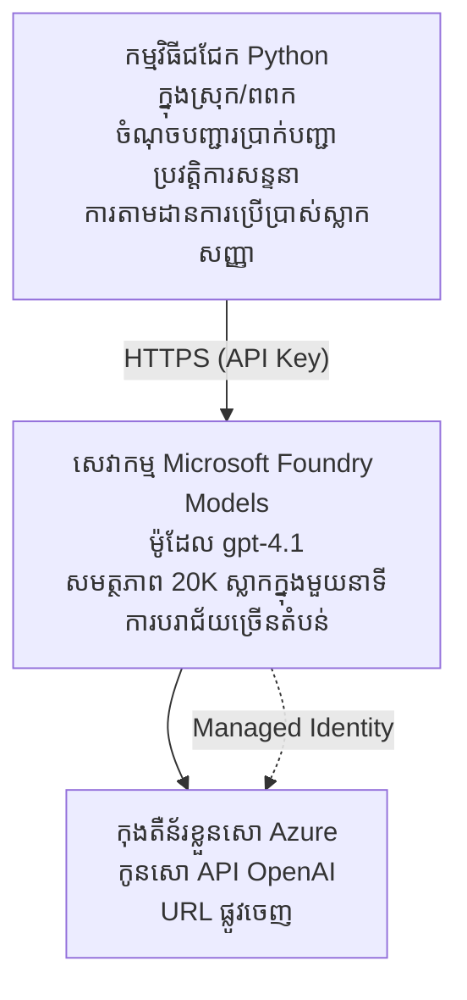

# កម្មវិធីជជែក Microsoft Foundry Models

**ផ្លូវការសិក្សា:** ជាន់មណ្ឌល ⭐⭐ | **ពេលវេលា:** ៣៥-៤៥ នាទី | **ថ្លៃខែ:** $៥០-២០០/ខែ

កម្មវិធីជជែក Microsoft Foundry Models ដែលបានដាក់បញ្ចូលជាមួយ Azure Developer CLI (azd)។ និទ្ទេសនេះបង្ហាញពីការដាក់បញ្ចូល gpt-4.1 ការពារ API Keys និងផ្ទាំងជជែកសាមញ្ញ។

## 🎯 អ្វីដែលអ្នកនឹងរៀន

- ដាក់បញ្ចូលសេវាកម្ម Microsoft Foundry Models ជាមួយម៉ូដែល gpt-4.1  
- ការពារ Key API OpenAI ដោយ Key Vault  
- បង្កើតផ្ទាំងជជែកសាមញ្ញជាមួយ Python  
- តាមដានការប្រើប្រាស់និងថ្លៃ  
- អនុវត្តការកំណត់ល្បឿន និងការដោះស្រាយកំហុស  

## 📦 អ្វីខ្លះបានរួមបញ្ចូល

✅ **សេវាកម្ម Microsoft Foundry Models** - ដាក់បញ្ចូលម៉ូដែល gpt-4.1  
✅ **កម្មវិធីជជែក Python** - ផ្ទាំងជជែក command-line សាមញ្ញ  
✅ **ការបញ្ចូល Key Vault** - ផ្ទុកសោ API ដោយសុវត្ថិភាព  
✅ **ទំព័រ ARM** - ស្ថាបត្យកម្មពេញលេញជាគោលបំណងកូដ  
✅ **តាមដានថ្លៃ** - ការតាមដានការប្រើប្រាស់ Token  
✅ **កំណត់ល្បឿន** - ការពារការបន្ថែមសមត្ថភាព  

## រចនាសម្ព័ន្ធ


## លក្ខខណ្ឌមុនការដាក់បញ្ចូល

### ត្រូវការ

- **Azure Developer CLI (azd)** - [មគ្គុទេសក៍ដំឡើង](https://learn.microsoft.com/azure/developer/azure-developer-cli/install-azd)  
- **ការជាវ Azure** មានសិទ្ធិ OpenAI - [ស្នើរការចូលដំណើរ](https://aka.ms/oai/access)  
- **Python 3.9+** - [ដំឡើង Python](https://www.python.org/downloads/)  

### ផ្ទៀងផ្ទាត់លក្ខខណ្ឌនានា

```bash
# ត្រួតពិនិត្យកំណែ azd (ត្រូវការកំណែ 1.5.0 ឬខ្ពស់ជាងនេះ)
azd version

# បញ្ជាក់ការចូលប្រើ Azure
azd auth login

# ត្រួតពិនិត្យកំណែ Python
python --version  # ឬ python3 --version

# បញ្ជាក់ការចូលប្រើ OpenAI (ត្រួតពិនិត្យក្នុងផតថល Azure)
az cognitiveservices account list-skus \
  --kind OpenAI \
  --location eastus
```

> **⚠️ សំខាន់:** Microsoft Foundry Models ត្រូវការការអនុម័តកម្មវិធី។ ប្រសិនបើអ្នកមិនទាន់បានដាក់ពាក្យ សូមចូលកាន់ [aka.ms/oai/access](https://aka.ms/oai/access)។ ការអនុម័តភាគច្រើនចំណាយពេល ១-២ ថ្ងៃធ្វើការ។

## ⏱️ ពេលវេលាដាក់បញ្ចូល

| ដំណាក់កាល | រយៈពេល | ព្រឹត្តិការណ៍ |
|----------|---------|-------------|
| ផ្ទៀងផ្ទាត់លក្ខខណ្ឌ | ២-៣ នាទី | ផ្ទៀងផ្ទាត់ភាពអាចប្រើបាននៃសមត្ថភាព OpenAI |
| ដាក់បញ្ចូលហេដ្ឋារចនាសម្ព័ន្ធ | ៨-១២ នាទី | បង្កើត OpenAI, Key Vault, ដាក់បញ្ចូលម៉ូដែល |
| កំណត់កម្មវិធី | ២-៣ នាទី | តំឡើងបរិស្ថាន និងថ្នាក់ដឹកនាំ |
| **សរុប** | **១២-១៨ នាទី** | បានរួចរាល់សម្រាប់ជជែកជាមួយ gpt-4.1 |

**សម្គាល់:** ការដាក់បញ្ចូល OpenAI លើកដំបូងអាចយូរជាងនេះដោយសារការផ្តល់ម៉ូដែល។

## ចាប់ផ្តើមរហ័ស

```bash
# នាវាទិញទៅឧទាហរណ៍
cd examples/azure-openai-chat

# ចាប់ផ្តើមបរិយាកាស
azd env new myopenai

# បង្ហាញអ្វីៗទាំងអស់ (ហេដ្ឋារចនាសម្ព័ន្ធ + ការកំណត់)
azd up
# អ្នកនឹងត្រូវបានគេស្នាក់ស្នាលឲ្យ:
# 1. ជ្រើសរើសការជាវ Azure
# 2. ជ្រើសទីតាំងដែលមាន OpenAI (ឧ. eastus, eastus2, westus)
# 3. រង់ចាំ 12-18 នាទីសម្រាប់ការបង្ហាញ

# ដំឡើងភាពអាស្រ័យពាក់ព័ន្ធ Python
pip install -r requirements.txt

# ចាប់ផ្តើមនិយាយជជែក!
python chat.py
```

**លទ្ធផលដែលរំពឹងទុក៖**  
```
🤖 Microsoft Foundry Models Chat Application
Connected to: gpt-4.1 (eastus)
Type your message (or 'quit' to exit)

You: Hello! Tell me about Microsoft Foundry Models.
Assistant: Microsoft Foundry Models Service provides REST API access to OpenAI's powerful language models including gpt-4.1, GPT-3.5-Turbo, and Embeddings...

[Tokens used: 145 | Estimated cost: $0.0044]
```

## ✅ ផ្ទៀងផ្ទាត់ការដាក់បញ្ចូល

### ជំហាន ១៖ ពិនិត្យធនធាន Azure

```bash
# មើលធនធានដែលបានដាក់បញ្ចូល
azd show

# លទ្ធផលដែលរំពឹងទុកបង្ហាញ:
# - សេវាកម្ម OpenAI: (ឈ្មោះធនធាន)
# - Key Vault: (ឈ្មោះធនធាន)
# - ការដាក់បញ្ចូល: gpt-4.1
# - ទីតាំង: eastus (ឬតំបន់ដែលអ្នកបានជ្រើស)
```

### ជំហាន ២៖ សាកល្បង API OpenAI

```bash
# ទទួលយកចំណុចបញ្ចប់ និងកូនសោ OpenAI
OPENAI_ENDPOINT=$(azd env get-value AZURE_OPENAI_ENDPOINT)
OPENAI_KEY=$(azd env get-value AZURE_OPENAI_API_KEY)

# សាកល្បងការហៅ API
curl "$OPENAI_ENDPOINT/openai/deployments/gpt-4.1/chat/completions?api-version=2024-08-01-preview" \
  -H "Content-Type: application/json" \
  -H "api-key: $OPENAI_KEY" \
  -d '{
    "messages": [{"role": "user", "content": "Say hello!"}],
    "max_tokens": 50
  }'
```

**ចម្លើយដែលរំពឹងទុក៖**  
```json
{
  "choices": [
    {
      "message": {
        "role": "assistant",
        "content": "Hello! How can I assist you today?"
      }
    }
  ],
  "usage": {
    "prompt_tokens": 8,
    "completion_tokens": 9,
    "total_tokens": 17
  }
}
```

### ជំហាន ៣៖ ផ្ទៀងផ្ទាត់ការចូលដំណើរការ Key Vault

```bash
# បញ្ជីអាថ៌កំបាំងនៅក្នុង Key Vault
KV_NAME=$(azd env get-value AZURE_KEY_VAULT_NAME)

az keyvault secret list \
  --vault-name $KV_NAME \
  --query "[].name" \
  --output table
```

**សម្ងាត់ដែលរំពឹងទុក៖**  
- `openai-api-key`  
- `openai-endpoint`  

**ចំណុចជោគជ័យ៖**  
- ✅ សេវាកម្ម OpenAI ដាក់បញ្ចូលជាមួយ gpt-4.1  
- ✅ ការហៅ API បង្ហាញការបញ្ចប់ត្រឹមត្រូវ  
- ✅ សម្ងាត់បានផ្ទុកនៅក្នុង Key Vault  
- ✅ ការតាមដានការប្រើ Token ធ្វើការជោគជ័យ  

## រចនាសម្ព័ន្ធគម្រោង

```
azure-openai-chat/
├── README.md                   ✅ This guide
├── azure.yaml                  ✅ AZD configuration
├── infra/                      ✅ Infrastructure as Code
│   ├── main.bicep             ✅ Main Bicep template
│   ├── main.parameters.json   ✅ Parameters
│   └── openai.bicep           ✅ OpenAI resource definition
├── src/                        ✅ Application code
│   ├── chat.py                ✅ Chat interface
│   ├── config.py              ✅ Configuration loader
│   └── requirements.txt       ✅ Python dependencies
└── .gitignore                  ✅ Git ignore rules
```

## លក្ខណៈពិសេសកម្មវិធី

### ផ្ទាំងជជែក (`chat.py`)

កម្មវិធីជជែករួមបញ្ចូល៖

- **ប្រវត្តិការសន្ទនា** - រក្សាការប្រជុំបដិសណ្ឋារក្នុងសារព័ត៌មាន  
- **កំណត់ថ្ងៃទី Token** - តាមដានការប្រើប្រាស់និងប៉ាន់ប្រមាណថ្លៃ  
- **ដោះស្រាយកំហុស** - ដោះស្រាយយ៉ាងទន់ភ្លន់ ពេលកំណត់ល្បឿនឬកំហុស API  
- **ប៉ាន់ប្រមាណថ្លៃ** - គណនាតម្លៃពាក់ព័ន្ធនៃសារទាំងមូល  
- **គាំទ្រចាក់បញ្ចូន** - ជម្រើសចម្លើយចាក់បញ្ចូន  

### ពាក្យបញ្ជា

ពេលជជែក អ្នកអាចប្រើ៖  
- `quit` ឬ `exit` - បញ្ចប់សម័យជជែក  
- `clear` - លុបប្រវត្តិការសន្ទនា  
- `tokens` - បង្ហាញការប្រើប្រាស់ Token សរុប  
- `cost` - បង្ហាញការប៉ាន់ប្រមាណថ្លៃសរុប  

### កំណត់រចនាសម្ព័ន្ធ (`config.py`)

ប្រើកំណត់រចនាសម្ព័ន្ធពីអថេរស្ថានបរិបទ:  
```python
AZURE_OPENAI_ENDPOINT  # ពី Key Vault
AZURE_OPENAI_API_KEY   # ពី Key Vault
AZURE_OPENAI_MODEL     # លំនាំដើម: gpt-4.1
AZURE_OPENAI_MAX_TOKENS # លំនាំដើម: ៨០០
```

## ឧទាហរណ៍ការប្រើប្រាស់

### ជជែកមូលដ្ឋាន

```bash
python chat.py
```

### ជជែកជាមួយម៉ូដែលផ្ទាល់ខ្លួន

```bash
export AZURE_OPENAI_MODEL=gpt-35-turbo
python chat.py
```

### ជជែកជាមួយចាក់បញ្ចូន

```bash
python chat.py --stream
```

### ប្រលងជជែកឧទាហរណ៍

```
You: Explain Microsoft Foundry Models Service in 3 sentences.
Assistant: Microsoft Foundry Models Service is Microsoft Azure's cloud platform offering 
that provides access to OpenAI's powerful language models. It enables developers 
to integrate capabilities like gpt-4.1 into their applications with enterprise-grade 
security and compliance. The service includes features for content filtering, 
abuse monitoring, and responsible AI practices.

[Tokens used: 89 | Estimated cost: $0.0027]

You: What models are available?
Assistant: Microsoft Foundry Models Service offers several model families including gpt-4.1 
(most capable), GPT-3.5-Turbo (faster and cost-effective), and Embeddings models 
for vector search. Each model has different capabilities, pricing, and token limits.

[Tokens used: 67 | Estimated cost: $0.0020]

Total session: 156 tokens | $0.0047
```

## ការគ្រប់គ្រងថ្លៃ

### តម្លៃ Token (gpt-4.1)

| ម៉ូដែល | បញ្ចូល (ក្នុង១,០០០ Token) | ផលចេញ (ក្នុង ១,០០០ Token) |
|-------|------------------------|--------------------------|
| gpt-4.1 | $0.03 | $0.06 |
| GPT-3.5-Turbo | $0.0015 | $0.002 |

### តម្លៃប្រចាំខែប៉ាន់ប្រមាណ

ប្នែកផ្អែកលើរចនាបថប្រើប្រាស់:

| ជម្រៅប្រើប្រាស់ | សារ/ថ្ងៃ | Token/ថ្ងៃ | ថ្លៃប្រចាំខែ |
|-------------|----------|-----------|--------------|
| **ស្រាល** | ២០ សារ | ៣,០០០ Token | $3-5 |
| **មធ្យម** | ១០០ សារ | ១៥,០០០ Token | $15-25 |
| **ធ្ងន់** | ៥០០ សារ | ៧៥,០០០ Token | $75-125 |

**តម្លៃមូលដ្ឋានហេដ្ឋារចនាសម្ព័ន្ធ:** $1-2/ខែ (Key Vault + កំណត់គណនា​តិចតួច)

### គន្លឹះបង្កើតការវិនិយោគថ្លៃ

```bash
# 1. ប្រើ GPT-3.5-Turbo សម្រាប់ភារកិច្ចធម្មតា (ថោកជាង ២០ ដង)
export AZURE_OPENAI_MODEL=gpt-35-turbo

# 2. កាត់បន្ថយចំនួនតូកិនអតិបរមាសម្រាប់ចម្លើយខ្លីជាង
export AZURE_OPENAI_MAX_TOKENS=400

# 3. គ្រប់គ្រងការប្រើប្រាស់តូកិន
python chat.py --show-tokens

# 4. ដាក់សេចក្តីជូនដំណឹងថវិកា
az consumption budget create \
  --budget-name "openai-budget" \
  --amount 50 \
  --time-grain Monthly
```

## ការតាមដាន

### មើលការប្រើប្រាស់ Token

```bash
# ក្នុង Azure Portal:
# OpenAI Resource → Metrics → ជ្រើស "Token Transaction"

# ឬតាមរយៈ Azure CLI:
az monitor metrics list \
  --resource $(azd env get-value AZURE_OPENAI_RESOURCE_ID) \
  --metric "TokenTransaction" \
  --start-time $(date -u -d '1 hour ago' '+%Y-%m-%dT%H:%M:%S') \
  --interval PT1M
```

### មើលកំណត់ត្រា API

```bash
# ផ្ទុកបន្ទាត់កំណត់ហេតុتشخيص
az monitor diagnostic-settings create \
  --resource $(azd env get-value AZURE_OPENAI_RESOURCE_ID) \
  --name openai-logs \
  --logs '[{"category": "Audit", "enabled": true}]' \
  --workspace $(azd env get-value LOG_ANALYTICS_WORKSPACE_ID)

# កំណត់ហេតុសំណួរ
az monitor log-analytics query \
  --workspace $(azd env get-value LOG_ANALYTICS_WORKSPACE_ID) \
  --analytics-query "AzureDiagnostics | where Category == 'Audit' | top 10 by TimeGenerated"
```

## ដោះស្រាយបញ្ហា

### បញ្ហា៖ "ចូលមិនបាន" ខុសឆ្គង

**រោគសញ្ញា:** ៤០៣ បារាំងពេលហៅ API

**ដំណោះស្រាយ:**  
```bash
# 1. ផ្ទៀងផ្ទាត់ការចូលប្រើ OpenAI ត្រូវបានអនុញ្ញាត
az cognitiveservices account show \
  --name $(azd env get-value AZURE_OPENAI_NAME) \
  --resource-group $(azd env get-value AZURE_RESOURCE_GROUP)

# 2. ពិនិត្យកំណត់ API key ត្រឹមត្រូវ
azd env get-value AZURE_OPENAI_API_KEY

# 3. ផ្ទៀងផ្ទាត់រូបមន្ត URL endpoint
azd env get-value AZURE_OPENAI_ENDPOINT
# ត្រូវមានទម្រង់ជា: https://[name].openai.azure.com/
```

### បញ្ហា៖ "ល្បឿនកំណត់លើស"

**រោគសញ្ញា:** ៤២៩ សំណើច្រើនពេក

**ដំណោះស្រាយ:**  
```bash
# 1. ពិនិត្យក្វូតាបច្ចុប្បន្ន
az cognitiveservices account deployment show \
  --name $(azd env get-value AZURE_OPENAI_NAME) \
  --resource-group $(azd env get-value AZURE_RESOURCE_GROUP) \
  --deployment-name gpt-4.1

# 2. ស្នើសុំបន្ថែមក្វូតា (ប្រសិនបើចាំបាច់)
# ទៅកាន់ Azure Portal → រមស្ស OpenAI → ក្វូតា → ស្នើសុំបន្ថែម

# 3. អនុវត្តត្បាញ retry (មានរួចហើយនៅ chat.py)
# កម្មវិធីអនុវត្តការសម្លឹងឡើងវិញដោយស្វ័យប្រវត្តិនិងការពន្យាពេលកើនឡើង
```

### បញ្ហា៖ "រកម៉ូដែលមិនឃើញ"

**រោគសញ្ញា:** ៤០៤ កំហុសសម្រាប់ការដាក់បញ្ចូល

**ដំណោះស្រាយ:**  
```bash
# 1. បញ្ជី​នៃ​ការតំឡើង​ដែល​ឡើង​រួច
az cognitiveservices account deployment list \
  --name $(azd env get-value AZURE_OPENAI_NAME) \
  --resource-group $(azd env get-value AZURE_RESOURCE_GROUP)

# 2. ពិនិត្យ​ឈ្មោះ​ម៉ូដែល​ក្នុង​បរិយាកាស
echo $AZURE_OPENAI_MODEL

# 3. ធ្វើ​បច្ចុប្បន្នភាព​ទៅ​ឈ្មោះ​ការ​តំឡើង​ដែលត្រឹមត្រូវ
export AZURE_OPENAI_MODEL=gpt-4.1  # ឬ gpt-35-turbo
```

### បញ្ហា៖ ការឆ្លើយតបយឺត

**រោគសញ្ញា:** ពេលការឆ្លើយតបយឺត (>៥ វិនាទី)

**ដំណោះស្រាយ:**  
```bash
# 1. ពិនិត្យមើលការពន្យារពេលតំបន់
# បញ្ចូនទៅតំបន់ជិតអ្នកប្រើប្រាស់

# 2. កាត់បន្ថយ max_tokens សម្រាប់ឆ្លើយតបលឿនជាងមុន
export AZURE_OPENAI_MAX_TOKENS=400

# 3. ប្រើការបង្ហូរទិន្នន័យសម្រាប់បទពិសោធន៍អ្នកប្រើល្អប្រសើរ
python chat.py --stream
```

## អនុវត្តសុវត្ថិភាពល្អបំផុត

### ១. រក្សាតូចសោ API Keys

```bash
# កុំធ្វើការ commitkey ទៅកាន់ source control ដោយមិនបានគ្រប់គ្រាន់
# ប្រើ Key Vault (បានកំណត់រួចហើយ)

# ប្ដូរនៅធម្មតា keys ជាប្រចាំ
az cognitiveservices account keys regenerate \
  --name $(azd env get-value AZURE_OPENAI_NAME) \
  --resource-group $(azd env get-value AZURE_RESOURCE_GROUP) \
  --key-name key1
```

### ២. អនុវត្តការត្រួតពិនិត្យមាតិកា

```python
# ម៉ូដែល Microsoft Foundry មានការត្រងខ្លឹមសារជាន់ដើម
# កំណត់រចនាសម្ព័ន្ធក្នុងផ្ទៃបង្ហាញ Azure:
# ធនធាន OpenAI → ឧបករណ៍ត្រងខ្លីុំសារ → បង្កើតឧបករណ៍ត្រងខ្លឹមសារផ្ទាល់ខ្លួន

# ប្រភេទ៖ ការក្អប់ខ្ពើម, ភេទ, ហិង្សា, ធ្វើខូចខ្លួនផ្ទាល់
# កម្រិត៖ ត្រងតិច, មធ្យម, ខ្ពស់
```

### ៣. ប្រើអត្តសញ្ញាណគ្រប់គ្រង (ផលិតកម្ម)

```bash
# សម្រាប់ការតំឡើងផលិតកម្ម ប្រើអត្តសញ្ញាណដែលគ្រប់គ្រង
# ជំនួស API keys (ត្រូវការតំឡើងកម្មវិធីលើ Azure)

# ធ្វើបច្ចុប្បន្នភាព infra/openai.bicep ដើម្បីបញ្ចូល:
# identity: { type: 'SystemAssigned' }
```

## អភិបាលភាព

### រត់ផ្ទាល់ក្នុងម៉ាស៊ីន

```bash
# ដំឡើងការពឹងផ្អែក
pip install -r src/requirements.txt

# កំណត់អថេរបរិស្ថាន
export AZURE_OPENAI_ENDPOINT="https://[name].openai.azure.com/"
export AZURE_OPENAI_API_KEY="your-api-key"
export AZURE_OPENAI_MODEL="gpt-4.1"

# ប្រតិបត្តិការអនុប្បទាន
python src/chat.py
```

### រត់តេស្ត

```bash
# តម្លើងការទាមទារតេស្ត
pip install pytest pytest-cov

# ប្រតិបត្ដិការតេស្ត
pytest tests/ -v

# ជាមួយនឹងការគ្របដណ្តប់
pytest tests/ --cov=src --cov-report=html
```

### ធ្វើបច្ចុប្បន្នភាពដាក់បញ្ចូលម៉ូដែល

```bash
# ផ្សព្វផ្សាយកំណែម៉ូដែលផ្សេងៗ
az cognitiveservices account deployment create \
  --name $(azd env get-value AZURE_OPENAI_NAME) \
  --resource-group $(azd env get-value AZURE_RESOURCE_GROUP) \
  --deployment-name gpt-35-turbo \
  --model-name gpt-35-turbo \
  --model-version "0613" \
  --model-format OpenAI \
  --sku-capacity 20 \
  --sku-name "Standard"
```

## សម្អាតលុប

```bash
# លុបធនធាន Azure ទាំងអស់
azd down --force --purge

# នេះនឹងលុបចោល៖
# - សេវាកម្ម OpenAI
# - គឡព្រះ Key Vault (ជាមួយការលុបប្រកាន់តែ ៩០ ថ្ងៃ)
# - ប្រមុខធនធាន
# - ការដាក់​ឡើងវិញ និងការកំណត់រចនាសម្ព័ន្ធទាំងអស់
```

## ជំហានបន្ទាប់

### ពង្រីកឧទាហរណ៍នេះ

1. **បន្ថែមផ្ទាំងវេប** - សាងសង់ React/Vue ដំណើរការមុខ  
   ```bash
   # បូកសេវាកម្មផ្នែកមុខទៅ azure.yaml
   # បង្ហោះទៅកម្មវិធីវេបស្ថិតិ Azure Static Web Apps
   ```

2. **អនុវត្ត RAG** - បន្ថែមការស្វែងរកឯកសារជាមួយ Azure AI Search  
   ```python
   # ប្រើប្រាស់ Azure Cognitive Search
   # ផ្ទុកឯកសារ និងបង្កើតពិពណ៌វិចទ័រ
   ```

3. **បន្ថែមការហៅមុខងារ** - បើកការប្រើឧបករណ៍  
   ```python
   # កំណត់អនុគមន៍នៅក្នុង chat.py
   # អនុញ្ញាតឱ្យ gpt-4.1 ហៅ API ខាងក្រៅ
   ```

4. **គាំទ្រម៉ូដែលច្រើន** - ដាក់បញ្ចូលម៉ូដែលជាច្រើន  
   ```bash
   # បន្ថែមម៉ូដែល gpt-35-turbo, embeddings
   # អនុវត្តតម្រុយម៉ូដែល logic
   ```

### ឧទាហរណ៍ដែលទាក់ទង

- **[Retail Multi-Agent](../retail-scenario.md)** - ស្ថាបត្យកម្ម multi-agent កម្រិតខ្ពស់  
- **[Database App](../../../../examples/database-app)** - បន្ថែមការផ្ទុកប្រចាំ  
- **[Container Apps](../../../../examples/container-app)** - ដាក់បញ្ចូលជាសេវាកម្ម containerized  

### ប្រភពរៀន

- 📚 [AZD For Beginners Course](../../README.md) - មុខវិជ្ជាស្នូល  
- 📚 [Microsoft Foundry Models Documentation](https://learn.microsoft.com/azure/ai-services/openai/) - ឯកសារផ្លូវការ  
- 📚 [OpenAI API Reference](https://platform.openai.com/docs/api-reference) - ព័ត៌មានលម្អិត API  
- 📚 [Responsible AI](https://www.microsoft.com/ai/responsible-ai) - អនុវត្តឥរិយាបទល្អ  

## ប្រភពបន្ថែម

### ឯកសារ
- **[Microsoft Foundry Models Service](https://learn.microsoft.com/azure/ai-services/openai/)** - មគ្គុទេសក៍ពេញលេញ  
- **[gpt-4.1 Models](https://learn.microsoft.com/azure/ai-services/openai/concepts/models)** - សមត្ថភាពម៉ូដែល  
- **[Content Filtering](https://learn.microsoft.com/azure/ai-services/openai/concepts/content-filter)** - លក្ខណៈសុវត្ថិភាព  
- **[Azure Developer CLI](https://learn.microsoft.com/azure/developer/azure-developer-cli/)** - ឯកសារ azd  

### មេរៀន
- **[OpenAI Quickstart](https://learn.microsoft.com/azure/ai-services/openai/quickstart)** - ដាក់បញ្ចូលដំបូង  
- **[Chat Completions](https://learn.microsoft.com/azure/ai-services/openai/how-to/chatgpt)** - ការបង្កើតកម្មវិធីជជែក  
- **[Function Calling](https://learn.microsoft.com/azure/ai-services/openai/how-to/function-calling)** - លក្ខណៈខ្ពស់  

### ឧបករណ៍
- **[Microsoft Foundry Models Studio](https://oai.azure.com/)** - កន្លែងសាកល្បងតាមវេប  
- **[Prompt Engineering Guide](https://platform.openai.com/docs/guides/prompt-engineering)** - សរសេរការបញ្ជាជាប្រសើរ  
- **[Token Calculator](https://platform.openai.com/tokenizer)** - ប៉ាន់ប្រមាណ Token ប្រើប្រាស់  

### សហគមន៍
- **[Azure AI Discord](https://discord.gg/azure)** - ទទួលបានជំនួយពីសហគមន៍  
- **[GitHub Discussions](https://github.com/Azure-Samples/openai/discussions)** - វេទិកា Q&A  
- **[Azure Blog](https://azure.microsoft.com/blog/tag/azure-openai-service/)** - ព័ត៌មានថ្មីៗ  

---

**🎉 ជោគជ័យ!** អ្នកបានដាក់បញ្ចូល Microsoft Foundry Models ហើយបង្កើតកម្មវិធីជជែកដំណើរការ។ ចាប់ផ្តើមស្វែងយល់ពីសមត្ថភាព gpt-4.1 និងសាកល្បងការបញ្ជាជាច្រើននិងករណីប្រើប្រាស់ផ្សេងៗ។

**សំណួរ?** [បើកបញ្ហា](https://github.com/microsoft/AZD-for-beginners/issues) ឬពិនិត្យ [FAQ](../../resources/faq.md)

**ការព្រមានថ្លៃ:** សូមចងចាំដំណើរការ `azd down` ពេលសាកល្បងរួច ដើម្បីជៀសវាងការចំណាយបន្ដ (~$50-100/ខែសម្រាប់ការប្រើប្រាស់សកម្ម)។

---

<!-- CO-OP TRANSLATOR DISCLAIMER START -->
**ការបដិសេធ**៖
ឯកសារនេះត្រូវបានបកប្រែដោយប្រើសេវាបកប្រែ AI [Co-op Translator](https://github.com/Azure/co-op-translator)។ ខណៈពេលយើងខិតខំប្រឹងប្រែងដើម្បីភាពត្រឹមត្រូវ សូមទោសចំពោះការព្យាយាម ប្រែសម្រួលដោយស្វ័យប្រវត្តិអាចមានកំហុសឬការមិនត្រឹមត្រូវ។ ឯកសារដើមជាភាសាតំណើរដើម គួរត្រូវបានគេចាត់ទុកជាធាតុមានសិទ្ធិខ្ពស់។ សម្រាប់ព័ត៌មានសំខាន់ រាល់ការបកប្រែដោយមនុស្សអ្នកជំនាញត្រូវបានណែនាំ។ យើងមិនទទួលខុសត្រូវចំពោះការយល់ច្រឡំ ឬការបកប្រែខុស សម្រាប់ការប្រើប្រាស់ការបកប្រែនេះឡើយ។
<!-- CO-OP TRANSLATOR DISCLAIMER END -->