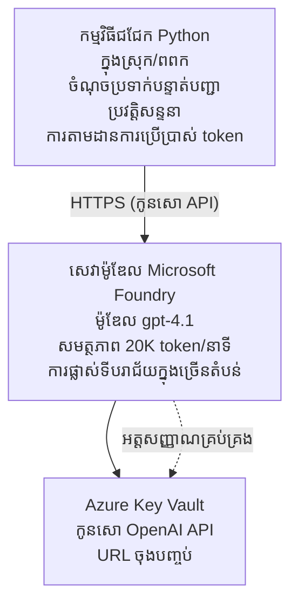

# Microsoft Foundry Models Chat Application

**ផ្លូវការសិក្សា:** មធ្យម ⭐⭐ | **ពេលវេលា:** 35-45 នាទី | **ថ្លៃ:** $50-200/ខែ

កម្មវិធីសេវាកម្មជជែក Microsoft Foundry Models លំអិត ដែលបាន triển តាម Azure Developer CLI (azd)។ ឧទាហរណ៍នេះបង្ហាញពីការដាក់ពិព័រណ៍ gpt-4.1, ការទទួលសិទ្ធិ API យ៉ាងសុវត្ថិភាព, និងចំណុចប្រទាក់ជជែកសាមញ្ញ។

## 🎯 អ្វីដែលអ្នកនឹងរៀន

- ដាក់ពិព័រណ៍ Microsoft Foundry Models Service ជាមួយម៉ូឌែល gpt-4.1
- រក្សាគន្លងកូនសោ OpenAI API ជាមួយ Key Vault
- បង្កើតចំណុចប្រទាក់ជជែកសាមញ្ញជាមួយ Python
- តាមដានការប្រើប្រាស់ token និងថ្លៃឈ្នួល
- អនុវត្តកំណត់អត្រា និងការដោះស្រាយកំហុស

## 📦 អ្វីដែលរួមបញ្ចូល

✅ **Microsoft Foundry Models Service** - ដាក់ពិព័រណ៍ម៉ូឌែល gpt-4.1  
✅ **Python Chat App** - ចំណុចប្រទាក់ជជែកតាមបន្ទាត់ពាក្យសាមញ្ញ  
✅ **Key Vault Integration** - រក្សាទុកកូនសោ API យ៉ាងសុវត្ថិភាព  
✅ **ARM Templates** - ហេដ្ឋារចនាសម្ព័ន្ធជាកូដពេញលេញ  
✅ **Cost Monitoring** - តាមដានការប្រើប្រាស់ token  
✅ **Rate Limiting** - បន្ទុកការការពារការបញ្ចប់quota  

## Architecture



## Prerequisites

### ត្រូវការជាមិនអាចខ្វះ

- **Azure Developer CLI (azd)** - [Install guide](https://learn.microsoft.com/azure/developer/azure-developer-cli/install-azd)
- **Azure subscription** មានសិទ្ធិ OpenAI - [Request access](https://aka.ms/oai/access)
- **Python 3.9+** - [Install Python](https://www.python.org/downloads/)

### ពិនិត្យវិញលក្ខខណ្ឌចាំបាច់

```bash
# ពិនិត្យកំណែ azd (ត្រូវការកំណែ 1.5.0 ឬខ្ពស់ជាងនេះ)
azd version

# ផ្ទៀងផ្ទាត់ការចូលទៅ Azure
azd auth login

# ពិនិត្យកំណែ Python
python --version  # ឬ python3 --version

# ផ្ទៀងផ្ទាត់ការចូលប្រើ OpenAI (ពិនិត្យនៅក្នុង Azure Portal)
az cognitiveservices account list-skus \
  --kind OpenAI \
  --location eastus
```

> **⚠️ សំខាន់៖** Microsoft Foundry Models ត្រូវការការអនុម័តកម្មវិធី។ ប្រសិនបើអ្នកមិនទាន់ដាក់ពាក្យ សូមទស្សនា [aka.ms/oai/access](https://aka.ms/oai/access)។ ការអនុម័តទូទៅចំណាយពេល 1-2 ថ្ងៃធ្វើការ។

## ⏱️ រយៈពេលដាក់ពិព័រណ៍

| Phase | Duration | What Happens |
|-------|----------|--------------|
| Prerequisites check | 2-3 minutes | ផ្ទៀងផ្ទាត់ភាពមានជមញ្ញាកម្ម OpenAI |
| Deploy infrastructure | 8-12 minutes | បង្កើត OpenAI, Key Vault, និងការដាក់ពិព័រណ៍ម៉ូឌែល |
| Configure application | 2-3 minutes | កំណត់បរិយាកាស និងថាសពឹង |
| **Total** | **12-18 minutes** | រៀបចំរួចសម្រាប់ជជែកជាមួយ gpt-4.1 |

**ចំណាំ៖** ការដាក់ពិព័រណ៍ OpenAI ជាលើកដំបូងអាចយឺតជាងនេះដោយសារការផ្គត់ផ្គង់ម៉ូឌែល។

## Quick Start

```bash
# ចូលទៅកាន់ឧទាហរណ៍
cd examples/azure-openai-chat

# ចាប់ផ្តើមរៀបចំបរិយាកាស
azd env new myopenai

# ដាក់ចេញដំណើរការ​អ្វីៗទាំងអស់ (ហេដ្ឋារចនាសម្ព័ន្ធ + ការកំណត់)
azd up
# អ្នកនឹងត្រូវបានសួរឱ្យ:
# 1. ជ្រើសរើសការជាវ Azure
# 2. ជ្រើសទីតាំងដែលមានសេវាកម្ម OpenAI (ឧ. eastus, eastus2, westus)
# 3. រង់ចាំ 12-18 នាទី សម្រាប់ការដាក់ចេញ

# ដំឡើងអាស្រ័យការ Python
pip install -r requirements.txt

# ចាប់ផ្តើមជជែក!
python chat.py
```

**លទ្ធផលដែលរំពឹងទុក៖**
```
🤖 Microsoft Foundry Models Chat Application
Connected to: gpt-4.1 (eastus)
Type your message (or 'quit' to exit)

You: Hello! Tell me about Microsoft Foundry Models.
Assistant: Microsoft Foundry Models Service provides REST API access to OpenAI's powerful language models including gpt-4.1, GPT-3.5-Turbo, and Embeddings...

[Tokens used: 145 | Estimated cost: $0.0044]
```

## ✅ Verify Deployment

### ជំហាន 1៖ ពិនិត្យធនធាន Azure

```bash
# មើលធនធានដែលបានដាក់ឲ្យដំណើរការ
azd show

# លទ្ធផលដែលរំពឹងទុកបង្ហាញ៖
# - សេវា OpenAI: (ឈ្មោះធនធាន)
# - Key Vault: (ឈ្មោះធនធាន)
# - ការដាក់ឲ្យដំណើរការ: gpt-4.1
# - ទីតាំង: eastus (ឬតំបន់ដែលអ្នកបានជ្រើស)
```

### ជំហាន 2៖ សាកល្បង OpenAI API

```bash
# យក endpoint និងកូនសោ API របស់ OpenAI
OPENAI_ENDPOINT=$(azd env get-value AZURE_OPENAI_ENDPOINT)
OPENAI_KEY=$(azd env get-value AZURE_OPENAI_API_KEY)

# សាកល្បងការហៅ API
curl "$OPENAI_ENDPOINT/openai/deployments/gpt-4.1/chat/completions?api-version=2024-08-01-preview" \
  -H "Content-Type: application/json" \
  -H "api-key: $OPENAI_KEY" \
  -d '{
    "messages": [{"role": "user", "content": "Say hello!"}],
    "max_tokens": 50
  }'
```

**ចម្លើយដែលរំពឹងទុក៖**
```json
{
  "choices": [
    {
      "message": {
        "role": "assistant",
        "content": "Hello! How can I assist you today?"
      }
    }
  ],
  "usage": {
    "prompt_tokens": 8,
    "completion_tokens": 9,
    "total_tokens": 17
  }
}
```

### ជំហាន 3៖ ពិនិត្យការចូលទៅ Key Vault

```bash
# បញ្ជីសម្ងាត់នៅក្នុង Key Vault
KV_NAME=$(azd env get-value AZURE_KEY_VAULT_NAME)

az keyvault secret list \
  --vault-name $KV_NAME \
  --query "[].name" \
  --output table
```

**សម្ងាត់ដែលរំពឹងទុក៖**
- `openai-api-key`
- `openai-endpoint`

**ក្រិតជោគជ័យ៖**
- ✅ សេវា OpenAI ធ្វើដំណើរជាមួយ gpt-4.1
- ✅ ការហៅ API ឆ្លើយតបដោយ completion ត្រឹមត្រូវ
- ✅ សម្ងាត់បានរក្សាទុកក្នុង Key Vault
- ✅ ការតាមដានការប្រើប្រាស់ token ធ្វើការ

## Project Structure

```
azure-openai-chat/
├── README.md                   ✅ This guide
├── azure.yaml                  ✅ AZD configuration
├── infra/                      ✅ Infrastructure as Code
│   ├── main.bicep             ✅ Main Bicep template
│   ├── main.parameters.json   ✅ Parameters
│   └── openai.bicep           ✅ OpenAI resource definition
├── src/                        ✅ Application code
│   ├── chat.py                ✅ Chat interface
│   ├── config.py              ✅ Configuration loader
│   └── requirements.txt       ✅ Python dependencies
└── .gitignore                  ✅ Git ignore rules
```

## Application Features

### Chat Interface (`chat.py`)

កម្មវិធីជជែករួមមាន៖

- **Conversation History** - រក្សាសេចក្តីបរិបទឆ្លងកាត់សារ
- **Token Counting** - តាមដានការប្រើប្រាស់ និងកំណត់ថ្លៃកម្រៃ
- **Error Handling** - ដោះស្រាយយ៉ាងទន់ភ្លន់ចំពោះកំណត់អត្រា និងកំហុស API
- **Cost Estimation** - គណនាថ្លៃជាក់ស្តែងក្នុងពេលជាក់លាក់រាល់សារ
- **Streaming Support** - ជួបប្រទៈគាំទ្រឆ្លើយតបប្រភេត streaming ជាជម្រើស

### Commands

ខណៈពេលជជែក អ្នកអាចប្រើ៖
- `quit` or `exit` - បញ្ចប់សម័យ
- `clear` - លប់ប្រវត្តិការជជែក
- `tokens` - បង្ហាញការប្រើប្រាស់ token សរុប
- `cost` - បង្ហាញការប៉ាន់ស្មានថ្លៃសរុប

### Configuration (`config.py`)

ផ្ទុកការកំណត់ពីអថេរសនិទ្ទេសបរិយាកាស៖
```python
AZURE_OPENAI_ENDPOINT  # ពី Key Vault
AZURE_OPENAI_API_KEY   # ពី Key Vault
AZURE_OPENAI_MODEL     # លំនាំដើម: gpt-4.1
AZURE_OPENAI_MAX_TOKENS # លំនាំដើម: 800
```

## Usage Examples

### Basic Chat

```bash
python chat.py
```

### Chat with Custom Model

```bash
export AZURE_OPENAI_MODEL=gpt-35-turbo
python chat.py
```

### Chat with Streaming

```bash
python chat.py --stream
```

### Example Conversation

```
You: Explain Microsoft Foundry Models Service in 3 sentences.
Assistant: Microsoft Foundry Models Service is Microsoft Azure's cloud platform offering 
that provides access to OpenAI's powerful language models. It enables developers 
to integrate capabilities like gpt-4.1 into their applications with enterprise-grade 
security and compliance. The service includes features for content filtering, 
abuse monitoring, and responsible AI practices.

[Tokens used: 89 | Estimated cost: $0.0027]

You: What models are available?
Assistant: Microsoft Foundry Models Service offers several model families including gpt-4.1 
(most capable), GPT-3.5-Turbo (faster and cost-effective), and Embeddings models 
for vector search. Each model has different capabilities, pricing, and token limits.

[Tokens used: 67 | Estimated cost: $0.0020]

Total session: 156 tokens | $0.0047
```

## Cost Management

### តំលៃ token (gpt-4.1)

| Model | Input (per 1K tokens) | Output (per 1K tokens) |
|-------|----------------------|------------------------|
| gpt-4.1 | $0.03 | $0.06 |
| GPT-3.5-Turbo | $0.0015 | $0.002 |

### ធρίςគណនា ថ្លៃប្រចាំខែព្យាបាល

ដោយផ្អែកលើគំរូការប្រើប្រាស់៖

| Usage Level | Messages/Day | Tokens/Day | Monthly Cost |
|-------------|--------------|------------|--------------|
| **Light** | 20 messages | 3,000 tokens | $3-5 |
| **Moderate** | 100 messages | 15,000 tokens | $15-25 |
| **Heavy** | 500 messages | 75,000 tokens | $75-125 |

**ថ្លៃរចនាសម្ព័ន្ធមូលដ្ឋាន៖** $1-2/ខែ (Key Vault + កុំព្យូទ័រតិចតួច)

### គន្លឹះបង្កើនប្រសិទ្ធភាពថ្លៃ

```bash
# 1. ប្រើ GPT-3.5-Turbo សម្រាប់ភារកិច្ចសាមញ្ញ (ថោកជាង 20 ដង)
export AZURE_OPENAI_MODEL=gpt-35-turbo

# 2. បន្ថយចំនួន token អតិបរមា ដើម្បីបានចម្លើយខ្លី
export AZURE_OPENAI_MAX_TOKENS=400

# 3. តាមដានការប្រើប្រាស់ token
python chat.py --show-tokens

# 4. កំណត់ការជូនដំណឹងពីថវិកា
az consumption budget create \
  --budget-name "openai-budget" \
  --amount 50 \
  --time-grain Monthly
```

## Monitoring

### មើលការប្រើប្រាស់ token

```bash
# នៅក្នុង Azure Portal:
# ធនធាន OpenAI → មាត្រដ្ឋាន → ជ្រើស "Token Transaction"

# ឬតាមរយៈ Azure CLI:
az monitor metrics list \
  --resource $(azd env get-value AZURE_OPENAI_RESOURCE_ID) \
  --metric "TokenTransaction" \
  --start-time $(date -u -d '1 hour ago' '+%Y-%m-%dT%H:%M:%S') \
  --interval PT1M
```

### មើលកំណត់ហេតុ API

```bash
# បញ្ចូនកំណត់ហេតូវិភាគ
az monitor diagnostic-settings create \
  --resource $(azd env get-value AZURE_OPENAI_RESOURCE_ID) \
  --name openai-logs \
  --logs '[{"category": "Audit", "enabled": true}]' \
  --workspace $(azd env get-value LOG_ANALYTICS_WORKSPACE_ID)

# កំណត់ហេតុសំណើ
az monitor log-analytics query \
  --workspace $(azd env get-value LOG_ANALYTICS_WORKSPACE_ID) \
  --analytics-query "AzureDiagnostics | where Category == 'Audit' | top 10 by TimeGenerated"
```

## Troubleshooting

### បញ្ហា៖ "Access Denied" Error

**រោគសញ្ញា៖** 403 Forbidden ពេលហៅ API

**ដំណោះស្រាយ៖**
```bash
# 1. ផ្ទៀងផ្ទាត់ថាការចូលប្រើ OpenAI បានអនុម័ត
az cognitiveservices account show \
  --name $(azd env get-value AZURE_OPENAI_NAME) \
  --resource-group $(azd env get-value AZURE_RESOURCE_GROUP)

# 2. ពិនិត្យឲ្យប្រាកដថាកូនសោ API ត្រឹមត្រូវ
azd env get-value AZURE_OPENAI_API_KEY

# 3. ផ្ទៀងផ្ទាត់ទ្រង់ទ្រាយ URL របស់ចំណុចបញ្ចប់
azd env get-value AZURE_OPENAI_ENDPOINT
# 4. គួរតែជា: https://[name].openai.azure.com/
```

### បញ្ហា៖ "Rate Limit Exceeded"

**រោគសញ្ញា៖** 429 Too Many Requests

**ដំណោះស្រាយ៖**
```bash
# 1. ពិនិត្យកម្រិត​ការប្រើ​បច្ចុប្បន្ន
az cognitiveservices account deployment show \
  --name $(azd env get-value AZURE_OPENAI_NAME) \
  --resource-group $(azd env get-value AZURE_RESOURCE_GROUP) \
  --deployment-name gpt-4.1

# 2. សំណើរឱ្យបន្ថែមកម្រិតការប្រើ (ប្រសិនបើចាំបាច់)
# ទៅកាន់ Azure Portal → ធនធាន OpenAI → កំណត់កម្រិត → ស្នើសុំបន្ថែម

# 3. អនុវត្ត​របៀបសាកឡើងវិញ (មានរួចនៅ chat.py)
# កម្មវិធីនឹងសាកឡើងវិញដោយស្វ័យប្រវត្តិ ដោយបន្ថែមពេលនៅរៀងរាល់ព្យាយាមក្នុងអត្រាធរណី
```

### បញ្ហា៖ "Model Not Found"

**រោគសញ្ញា៖** ថន់ 404 សម្រាប់ការដាក់ពិព័រណ៍

**ដំណោះស្រាយ៖**
```bash
# 1. បញ្ជីការដាក់ប្រើដែលមាន
az cognitiveservices account deployment list \
  --name $(azd env get-value AZURE_OPENAI_NAME) \
  --resource-group $(azd env get-value AZURE_RESOURCE_GROUP)

# 2. ផ្ទៀងផ្ទាត់ឈ្មោះម៉ូដែលក្នុងបរិយាកាស
echo $AZURE_OPENAI_MODEL

# 3. ធ្វើបច្ចុប្បន្នភាពទៅឈ្មោះការដាក់ប្រើដែលត្រឹមត្រូវ
export AZURE_OPENAI_MODEL=gpt-4.1  # ឬ gpt-35-turbo
```

### បញ្ហា៖ High Latency

**រោគសញ្ញា៖** ពេលឆ្លើយយឺត (>5 វិនាទី)

**ដំណោះស្រាយ៖**
```bash
# 1. ពិនិត្យការពន្យាពេលតាមតំបន់
# ដាក់ប្រើនៅតំបន់ដែលនៅជិតអ្នកប្រើបំផុត

# 2. បន្ថយ max_tokens ដើម្បីឆ្លើយតបឆាប់ជាង
export AZURE_OPENAI_MAX_TOKENS=400

# 3. ប្រើស្ទ្រីមសម្រាប់បទពិសោធន៍អ្នកប្រើល្អប្រសើរ
python chat.py --stream
```

## Security Best Practices

### 1. Protect API Keys

```bash
# កុំបញ្ចូលកូនសោទៅក្នុងប្រព័ន្ធគ្រប់គ្រងប្រភពកូដ
# ប្រើ Key Vault (បានកំណត់រួចហើយ)

# ប្ដូរកូនសោជាទៀងទាត់
az cognitiveservices account keys regenerate \
  --name $(azd env get-value AZURE_OPENAI_NAME) \
  --resource-group $(azd env get-value AZURE_RESOURCE_GROUP) \
  --key-name key1
```

### 2. Implement Content Filtering

```python
# Microsoft Foundry Models មានមុខងារតម្រងមាតិកាដែលបញ្ចូលមកជាមួយ
# កំណត់នៅក្នុង Azure Portal:
# OpenAI Resource → តម្រងមាតិកា → បង្កើតតម្រងផ្ទាល់ខ្លួន

# ប្រភេទ: សេចក្ដីស្អប់, ផ្លូវភេទ, ហិង្សា, ការបំផ្លាញខ្លួនឯង
# កម្រិតតម្រង: ទាប, មធ្យម, ខ្ពស់
```

### 3. Use Managed Identity (Production)

```bash
# សម្រាប់ការចេញផ្សាយក្នុងបរិបទផលិត សូមប្រើអត្តសញ្ញាណដែលមានការគ្រប់គ្រង
# ជំនួសកូនសោ API (តម្រូវឱ្យកម្មវិធីត្រូវបានបង្ហោះលើ Azure)

# ធ្វើបច្ចុប្បន្នភាព infra/openai.bicep ដើម្បីរួមបញ្ចូល:
# identity: { type: 'SystemAssigned' }
```

## Development

### Run Locally

```bash
# ដំឡើងការពឹងផ្អែក
pip install -r src/requirements.txt

# កំណត់អថេរបរិស្ថាន
export AZURE_OPENAI_ENDPOINT="https://[name].openai.azure.com/"
export AZURE_OPENAI_API_KEY="your-api-key"
export AZURE_OPENAI_MODEL="gpt-4.1"

# រត់កម្មវិធី
python src/chat.py
```

### Run Tests

```bash
# តំឡើងបណ្ណាល័យពឹងផ្អែកសម្រាប់តេស្ត
pip install pytest pytest-cov

# រត់តេស្ត
pytest tests/ -v

# ជាមួយការគ្របដណ្តប់កូដ
pytest tests/ --cov=src --cov-report=html
```

### Update Model Deployment

```bash
# ដាក់ចេញកំណែម៉ូឌែលផ្សេងៗ
az cognitiveservices account deployment create \
  --name $(azd env get-value AZURE_OPENAI_NAME) \
  --resource-group $(azd env get-value AZURE_RESOURCE_GROUP) \
  --deployment-name gpt-35-turbo \
  --model-name gpt-35-turbo \
  --model-version "0613" \
  --model-format OpenAI \
  --sku-capacity 20 \
  --sku-name "Standard"
```

## Clean Up

```bash
# លុបធនធាន Azure ទាំងអស់
azd down --force --purge

# នេះនឹងលុប៖
# - សេវាកម្ម OpenAI
# - Key Vault (មានការលុបទន់រយៈពេល ៩០ ថ្ងៃ)
# - ក្រុមធនធាន
# - ការដាក់ចេញ និងការកំណត់រចនាសម្ព័ន្ធទាំងអស់
```

## Next Steps

### Expand This Example

1. **Add Web Interface** - សាងសង់ frontend React/Vue
   ```bash
   # បន្ថែមសេវាផ្នែកមុខទៅក្នុងឯកសារ azure.yaml
   # ដាក់បង្ហោះទៅកាន់ Azure Static Web Apps
   ```

2. **Implement RAG** - បន្ថែមការស្វែងរកឯកសារជាមួយ Azure AI Search
   ```python
   # ភ្ជាប់ Azure AI Search
   # ផ្ទុកឯកសារ និងបង្កើតសន្ទស្សន៍វ៉ិចទ័រ
   ```

3. **Add Function Calling** - បើកមុខងារប្រើឧបករណ៍
   ```python
   # កំណត់អនុគមន៍នៅក្នុង chat.py
   # អនុញ្ញាតឲ្យ gpt-4.1 ហៅ API ខាងក្រៅ
   ```

4. **Multi-Model Support** - ដាក់ពិព័រណ៍ម៉ូឌែលច្រើន
   ```bash
   # បន្ថែម ម៉ូឌែល gpt-35-turbo និង embeddings
   # អនុវត្តយុទ្ធសាស្ត្រនៃការបញ្ជូនទៅម៉ូឌែល
   ```

### Examples ទាក់ទង

- **[Retail Multi-Agent](../retail-scenario.md)** - វិចិត្រស្ថាបត្យកម្ម multi-agent កម្រិតខ្ពស់
- **[Database App](../../../../examples/database-app)** - បន្ថែមការផ្ទុកឯកសារជាកើតមាន
- **[Container Apps](../../../../examples/container-app)** - ដាក់ពិព័រណ៍ជា​សេវាកម្ម containerized

### ធនធានសិក្សា

- 📚 [AZD For Beginners Course](../../README.md) - ទំព័រមេគណនីវគ្គសិក្សា
- 📚 [Microsoft Foundry Models Documentation](https://learn.microsoft.com/azure/ai-services/openai/) - ឯកសារផ្លូវការយោង
- 📚 [OpenAI API Reference](https://platform.openai.com/docs/api-reference) - ព័ត៌មានលម្អិត API
- 📚 [Responsible AI](https://www.microsoft.com/ai/responsible-ai) - គន្លឹះអនុវត្តល្អៗ

## Additional Resources

### Documentation
- **[Microsoft Foundry Models Service](https://learn.microsoft.com/azure/ai-services/openai/)** - គណនាគ្រប់លម្អិត
- **[gpt-4.1 Models](https://learn.microsoft.com/azure/ai-services/openai/concepts/models)** - សមត្ថភាពម៉ូឌែល
- **[Content Filtering](https://learn.microsoft.com/azure/ai-services/openai/concepts/content-filter)** - មុខងារ​សុវត្ថិភាព
- **[Azure Developer CLI](https://learn.microsoft.com/azure/developer/azure-developer-cli/)** - ឯកសារ azd

### Tutorials
- **[OpenAI Quickstart](https://learn.microsoft.com/azure/ai-services/openai/quickstart)** - ដាក់ពិព័រណ៍ដំបូង
- **[Chat Completions](https://learn.microsoft.com/azure/ai-services/openai/how-to/chatgpt)** - ស្ថាបនាចំណុចប្រទាក់ជជែក
- **[Function Calling](https://learn.microsoft.com/azure/ai-services/openai/how-to/function-calling)** - មុខងារជាជម្រើសកំពូល

### Tools
- **[Microsoft Foundry Models Studio](https://oai.azure.com/)** - បញ្ចូលលេងតាមវែប
- **[Prompt Engineering Guide](https://platform.openai.com/docs/guides/prompt-engineering)** - ការសរសេរពាក្យបញ្ចូនល្អជាងមុន
- **[Token Calculator](https://platform.openai.com/tokenizer)** - ប៉ាន់ស្មានការប្រើប្រាស់ token

### Community
- **[Azure AI Discord](https://discord.gg/azure)** - សុំជំនួយពីសហគមន៍
- **[GitHub Discussions](https://github.com/Azure-Samples/openai/discussions)** - វេទិកាសំណួរ-ចម្លើយ
- **[Azure Blog](https://azure.microsoft.com/blog/tag/azure-openai-service/)** - ព័ត៌មានថ្មីៗ

---

**🎉 ជោគជ័យ!** អ្នកបានដាក់ពិព័រណ៍ Microsoft Foundry Models និងបានស្ថាបនាកម្មវិធីជជែកដែលដំណើរការ។ ចាប់ផ្តើមពិសោធន៍សមត្ថភាព gpt-4.1 និងសាកល្បងជាមួយ prompt និងករណីប្រើប្រាស់ផ្សេងៗ។

**សំនួរ?** [Open an issue](https://github.com/microsoft/AZD-for-beginners/issues) ឬពិនិត្យប្រធានបទ [FAQ](../../resources/faq.md)

**ការជឿជាក់ថ្លៃ៖** កុំភ្លេចរត់ `azd down` ពេលបញ្ចប់ការសាកល្បង ដើម្បីជៀសវាងចំណាយកំពុងដំណើរការ (~$50-100/ខែសម្រាប់ការប្រើប្រាស់សកម្ម)។

---

<!-- CO-OP TRANSLATOR DISCLAIMER START -->
**ការបដិសេធ**:
ឯកសារនេះត្រូវបានបម្លែងភាសា ដោយប្រើសេវាបម្លែងភាសា AI [Co-op Translator](https://github.com/Azure/co-op-translator)។ ទោះយើងខ្ញុំមានក្តីប្រាថ្នាឱ្យបានច្បាស់លាស់ តែសូមយល់ដឹងថាការបម្លែងដោយស្វ័យប្រវត្តិក៏អាចមានកំហុសឬភាពមិនត្រឹមត្រូវ។ ឯកសារដើមជាភាសាទីតាំងគួរត្រូវបានគេប្រើជាប្រភពច្បាស់លាស់។ សម្រាប់ព័ត៌មានសំខាន់ៗ សូមណែនាំឱ្យប្រើប្រាស់ការប្រែដោយមនុស្សជំនាញ។ យើងខ្ញុំមិនទទួលខុសត្រូវចំពោះការយល់ច្រឡំ ឬការបកស្រាយខុសបន្ទាប់ពីការប្រើប្រាស់ការបម្លែងនេះនោះទេ។
<!-- CO-OP TRANSLATOR DISCLAIMER END -->