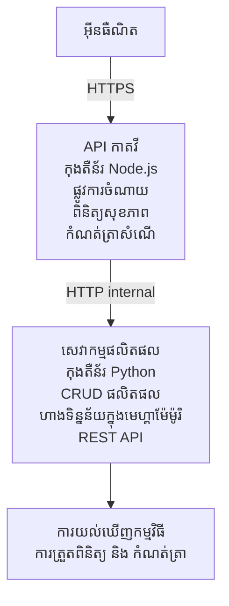

# ស្ថាបត្យកម្ម Microservices - ឧទាហរណ៍កម្មវិធី Container App

⏱️ **ពេល​វេលា​យល់​ព្រម**​: ២៥-៣៥ នាទី | 💰 **ការចំណាយ​គិត​ថា**​: ~$៥០-១០០/ខែ | ⭐ **កម្រិតស្មុគស្មាញ**​: ជាន់ខ្ពស់

ស្ថាបត្យកម្ម microservices **ដែលបានងាយស្រួលប៉ុន្តែមានមុខងារ** ដែលបានដាក់បញ្ចូលទៅ Azure Container Apps ដោយប្រើ AZD CLI. ឧទាហរណ៍នេះបង្ហាញពីការទំនាក់ទំនងសេវាកម្មទៅសេវាកម្ម, ការគ្រប់គ្រង container, និងការត្រួតពិនិត្យជាមួយការតម្លើង ២ សេវាកម្មជាក់ស្តែង។

> **📚 វិធីសាស្រ្តរៀន**: ឧទាហរណ៍នេះចាប់ផ្តើមពីស្ថាបត្យកម្ម ២ សេវាកម្មតិចតួច (API Gateway + Backend Service) ដែលអ្នកអាចដាក់បញ្ចូល និងរៀន។ បន្ទាប់ពីជាប់ចំណេះដឹងនេះយើងផ្តល់ការណែនាំសម្រាប់ពង្រីកទៅបណ្តាញ microservices ពេញលេញ។

## អ្វីដែលអ្នកនឹងរៀន

តាមរយៈការបញ្ចប់ឧទាហរណ៍នេះ អ្នកនឹង:
- ដាក់បញ្ចូល container ច្រើនទៅ Azure Container Apps
- អនុវត្តការទំនាក់ទំនងសេវាកម្មទៅសេវាកម្មដោយប្រើបណ្តាញក្នុង
- កំណត់កម្រិតពហុវេទិកា​តាម​បរិដ្ឋាន និងត្រួតពិនិត្យសុខភាព
- ត្រួតពិនិត្យកម្មវិធីចែកចាយជាមួយ Application Insights
- យល់ដឹងពីរបៀបដាក់បញ្ចូល microservices និងអនុវត្តន៍ល្អបំផុត
- រៀនពីការពង្រីកជាន់ខ្ពស់ពីសំណាញ់សាមញ្ញទៅស្ថាបត្យកម្មស្មុគស្មាញ

## ស្ថាបត្យកម្ម

### ដំណាក់កាល ១: អ្វីដែលយើងកំពុងសាងសង់ (រួមបញ្ចូលក្នុងឧទាហរណ៍នេះ)


**ហេតុអ្វីបានជារួចរាល់សាមញ្ញ?**  
- ✅ ដាក់បញ្ចូល និងយល់ឆាប់រហ័ស (២៥-៣៥ នាទី)  
- ✅ រៀនផ្នែកសំខាន់ៗនៃ microservices ដោយគ្មានកម្ដៅកម្ពស់  
- ✅ កូដដែលដំណើរការបាន អាចកែប្រែ និងសាកល្បងបាន  
- ✅ ចំណាយតិចសម្រាប់ការរៀន (~$៥០-១០០/ខែ ប្រៀបធៀប $៣០០-១៤០០/ខែ)  
- ✅ បង្កើតភាពជឿជាក់មុនបន្ថែមមូលដ្ឋានទិន្នន័យ និងប្រព័ន្ធសារប្រាស្រ័យ

**ប្រៀបធៀប**: គិតថាដូចការរៀនបើកបរតំណក់ទាំងទីតាំងឡានទទេ (២ សេវាកម្ម), សូមបង្កើតជំនាញមូលដ្ឋាន រួចត្រូវបន្តទៅចរាចរណ៍ទីក្រុង (៥+ សេវាកម្មដែលមានមូលដ្ឋានទិន្នន័យ)។

### ដំណាក់កាល ២: ការពង្រីកនា​ពេល​អនាគត (ស្ថាបត្យកម្មយោង)

បន្ទាប់ពីអ្នករៀនជំនាញ ២ សេវាកម្ម អ្នកអាចពង្រីកទៅ:  

```
Full Architecture (Not Included - For Reference)
├── API Gateway (✅ Included)
├── Product Service (✅ Included)
├── Order Service (🔜 Add next)
├── User Service (🔜 Add next)
├── Notification Service (🔜 Add last)
├── Azure Service Bus (🔜 For async communication)
├── Cosmos DB (🔜 For product persistence)
├── Azure SQL (🔜 For order management)
└── Azure Storage (🔜 For file storage)
```
  
មើលផ្នែក "Expansion Guide" នៅចុងឯកសារសម្រាប់ការណែនាំជំហានៗ។

## លក្ខណៈពិសេសរួមបញ្ចូល

✅ **ស្វែងរកសេវាកម្ម**: ស្វែងរកដោយ DNS ដោយស្វ័យប្រវត្តិក្នុងចន្លោះ containers  
✅ **ការប៉ុនប៉ងបញ្ជូន**: បញ្ជូនសមាមាត្រដោយខ្លួនឯងលើច្រើនកូពី  
✅ **កម្មវិធីអូតូ-កំណត់**: កំណត់កម្រិតដោយឡែកសេវាកម្មក្នុងមូលដ្ឋាន HTTP requests  
✅ **ត្រួតពិនិត្យសុខភាព**: តេស្ត liveness និង readiness សម្រាប់សេវាកម្មទាំងពីរ  
✅ **កំណត់ហេតុចែកចាយ**: កំណត់ហេតុចូលកណ្តាលជាមួយ Application Insights  
✅ **បណ្តាញក្នុង**: ទំនាក់ទំនងសេវាកម្មក្នុងយ៉ាងសុវត្ថិភាព  
✅ **ការគ្រប់គ្រង Container**: ដាក់បញ្ចូល និងកំណត់កម្រិតដោយស្វ័យប្រវត្តិ  
✅ **ធ្វើបច្ចុប្បន្នភាពលើកដំណើរការបន្ត**: បច្ចុប្បន្នភាពជាប់ដំណើរការជាមួយការគ្រប់គ្រងការកែសម្រួល  

## ការត្រូវការ

### ឧបករណ៍ដែលត្រូវការ

មុនចាប់ផ្ដើម សូមផ្ទៀងផ្ទាត់ថាអ្នកបានដំឡើងឧបករណ៍ទាំងនេះ៖

1. **[Azure Developer CLI (azd)](https://learn.microsoft.com/azure/developer/azure-developer-cli/install-azd)** (កំណែ 1.0.0 ឬខ្ពស់ជាង)  
   ```bash
   azd version
   # លទ្ធផលដែលរំពឹងទុក៖ azd កំណែ 1.0.0 ឬខ្ពស់ជាងនេះ
   ```
  
2. **[Azure CLI](https://learn.microsoft.com/cli/azure/install-azure-cli)** (កំណែ 2.50.0 ឬខ្ពស់ជាង)  
   ```bash
   az --version
   # លទ្ធផលដែលរំពឹងទុក: azure-cli 2.50.0 ឬខ្ពស់ជាងនេះ
   ```
  
3. **[Docker](https://www.docker.com/get-started)** (សម្រាប់ការអភិវឌ្ឍន៍/សាកល្បងក្នុងសេះ - ជាជម្រើស)  
   ```bash
   docker --version
   # លទ្ធផល​ដែល​ដែល​រំពឹងទុក៖ កំណែ Docker 20.10 ឬខ្ពស់ជាងនេះ
   ```
  

### ការត្រូវការ Azure

- មាន **ការជាវ Azure** សកម្ម ([បង្កើតគណនីឥតគិតថ្លៃ](https://azure.microsoft.com/free/))  
- មានសិទ្ធិបង្កើតធនធានក្នុងការជាវរបស់អ្នក  
- មានតួនាទី **Contributor** លើការជាវឬក្រុមធនធាន  

### ចំណេះដឹងមូលដ្ឋាន

នេះជាឧទាហរណ៍ **ជាន់ខ្ពស់**។ អ្នកគួរតែមាន៖  
- បានបញ្ចប់ [ឧទាហរណ៍ Simple Flask API](../../../../../examples/container-app/simple-flask-api)  
- មានចំណេះដឹងមូលដ្ឋានអំពី ស្ថាបត្យកម្ម microservices  
- ស្គាល់ REST APIs និង HTTP  
- យល់ពីគំនិត container  

**ថ្មីចំពោះ Container Apps?** សូមចាប់ផ្តើមពី [ឧទាហរណ៍ Simple Flask API](../../../../../examples/container-app/simple-flask-api) ដើម្បីរៀនមូលដ្ឋាន។

## ចាប់ផ្ដើមឆាប់ (ជំហានតាមជំហាន)

### ជំហាន ១: Clone និងបើកថត

```bash
git clone https://github.com/microsoft/AZD-for-beginners.git
cd AZD-for-beginners/examples/container-app/microservices
```
  
**✓ ពិនិត្យភាពជោគជ័យ**: ធ្វើការត្រួតពិនិត្យថាអ្នកឃើញ `azure.yaml`:  
```bash
ls
# ត្រូវបានគេរំពឹងទុក៖ README.md, azure.yaml, infra/, src/
```
  

### ជំហាន ២: ចូលប្រើប្រាស់ជាមួយ Azure

```bash
azd auth login
```
  
នេះនឹងបើកកម្មវិធីរុករករបស់អ្នកសម្រាប់ចូលប្រើ Azure។ សូមចុះឈ្មោះដោយគណនី Azure របស់អ្នក។

**✓ ពិនិត្យភាពជោគជ័យ**: អ្នកគួរតែឃើញ៖  
```
Logged in to Azure.
```
  

### ជំហាន ៣: ចាប់ផ្ដើមបរិដ្ឋាន

```bash
azd init
```
  
**ការស្នើសុំដែលអ្នកនឹងឃើញ៖**  
- **ឈ្មោះបរិដ្ឋាន**: បញ្ចូលឈ្មោះខ្លី (ឧ. `microservices-dev`)  
- **ការជាវ Azure**: ជ្រើសការជាវរបស់អ្នក  
- **តំបន់ Azure**: ជ្រើសតំបន់ (ឧ. `eastus`, `westeurope`)  

**✓ ពិនិត្យភាពជោគជ័យ**: អ្នកគួរតែឃើញ៖  
```
SUCCESS: New project initialized!
```
  

### ជំហាន ៤: ដាក់បញ្ចូលរចនាសម្ព័ន្ធ និងសេវាកម្ម

```bash
azd up
```
  
**អ្វីកើតឡើង** (ប្រហែល ៨-១២ នាទី):  
1. បង្កើតបរិដ្ឋាន Container Apps  
2. បង្កើត Application Insights សម្រាប់ត្រួតពិនិត្យ  
3. បង្កើត container API Gateway (Node.js)  
4. បង្កើត container សេវាកម្ម Product Service (Python)  
5. ដាក់បញ្ចូល container ទាំងពីរទៅ Azure  
6. កំណត់បណ្តាញ និងការត្រួតពិនិត្យសុខភាព  
7. ដាក់បញ្ចូលការត្រួតពិនិត្យ និងកំណត់ហេតុ  

**✓ ពិនិត្យភាពជោគជ័យ**: អ្នកគួរតែឃើញ៖  
```
SUCCESS: Your application was deployed to Azure in X minutes Y seconds.
Endpoint: https://api-gateway-<unique-id>.azurecontainerapps.io
```
  
**⏱️ ពេលវេលា**: ៨-១២ នាទី  

### ជំហាន ៥: សាកល្បងការដាក់បញ្ចូល

```bash
# ទទួលយកច្រកចេញ gateway
GATEWAY_URL=$(azd env get-values | grep API_GATEWAY_URL | cut -d '=' -f2 | tr -d '"')

# សាកល្បងសុខភាព API Gateway
curl $GATEWAY_URL/health

# លទ្ធផលដែលរំពឹងទុក៖
# {"status":"healthy","service":"api-gateway","timestamp":"2025-11-19T10:30:00Z"}
```
  
**សាកល្បងសេវាកម្ម product តាមរយៈ gateway**៖  
```bash
# បញ្ជីផលិតផល
curl $GATEWAY_URL/api/products

# លទ្ធផលដែលរំពឹងទុក:
# [
#   {"id":1,"name":"កុំព្យូទ័រយួរ​ដៃ","price":999.99,"stock":50},
#   {"id":2,"name":"មូស","price":29.99,"stock":200},
#   {"id":3,"name":"ក្តារចុច","price":79.99,"stock":150}
# ]
```
  
**✓ ពិនិត្យភាពជោគជ័យ**: ចុងទាំងពីរត្រូវតប JSON ទិន្នន័យដោយគ្មានកំហុស។

---

**🎉 សូមអបអរ!** អ្នកបានដាក់បញ្ចូលស្ថាបត្យកម្ម microservices ទៅ Azure ហើយ!

## រចនាសម្ព័ន្ធគម្រោង

ឯកសារអនុវត្តទាំងអស់បានរួមបញ្ចូល – នេះជាឧទាហរណ៍ពេញលេញដែលដំណើរការបាន៖

```
microservices/
│
├── README.md                         # This file
├── azure.yaml                        # AZD configuration
├── .gitignore                        # Git ignore patterns
│
├── infra/                           # Infrastructure as Code (Bicep)
│   ├── main.bicep                   # Main orchestration
│   ├── abbreviations.json           # Naming conventions
│   ├── core/                        # Shared infrastructure
│   │   ├── container-apps-environment.bicep  # Container environment + registry
│   │   └── monitor.bicep            # Application Insights + Log Analytics
│   └── app/                         # Service definitions
│       ├── api-gateway.bicep        # API Gateway container app
│       └── product-service.bicep    # Product Service container app
│
└── src/                             # Application source code
    ├── api-gateway/                 # Node.js API Gateway
    │   ├── app.js                   # Express server with routing
    │   ├── package.json             # Node dependencies
    │   └── Dockerfile               # Container definition
    └── product-service/             # Python Product Service
        ├── main.py                  # Flask API with product data
        ├── requirements.txt         # Python dependencies
        └── Dockerfile               # Container definition
```
  
**អ្វីដែលមុខងារចំណែកទាំងអស់ធ្វើ**៖

**រចនាសម្ព័ន្ធ (infra/)**:  
- `main.bicep`: គ្រប់គ្រងធនធាន Azure ទាំងមូល និងការទំនាក់ទំនងរបស់ពួកវា  
- `core/container-apps-environment.bicep`: បង្កើតបរិដ្ឋាន Container Apps និង Azure Container Registry  
- `core/monitor.bicep`: ដាក់ Application Insights សម្រាប់កំណត់ហេតុចែកចាយ  
- `app/*.bicep`: ការកំណត់ container app ដោយឡែកជាមួយកម្រិតស្កែល និងការត្រួតពិនិត្យសុខភាព  

**API Gateway (src/api-gateway/)**:  
- សេវាកម្មសាធារណៈដែលផ្ញើសំណើទៅសេវាកម្មក្រោយ  
- អនុវត្តកំណត់ហេតុ, ដោះស្រាយកំហុស, និងដឹកសំណើ  
- បង្ហាញការទំនាក់ទំនង HTTP service-to-service  

**Product Service (src/product-service/)**:  
- សេវាកម្មក្នុងដែលមានបញ្ជីផលិតផល (ក្នុងចងចាំសម្រាប់ភាពសាមញ្ញ)  
- REST API ជាមួយការត្រួតពិនិត្យសុខភាព  
- ឧទាហរណ៍លំនាំ microservice backend

## សេចក្ដីសង្ខេបសេវាកម្ម

### API Gateway (Node.js/Express)

**ព័រទ័រ**: ៨០៨០  
**ចូលដំណើរការ**: សាធារណៈ (ingress ខាងក្រៅ)  
**គោលបំណង**: បញ្ជូនសំណើដែលចូលទៅសេវាកម្មប្រកបដោយសមត្ថភាព  

**ចំណុចផ្លូវចូល**:  
- `GET /` - ព័ត៌មានសេវាកម្ម  
- `GET /health` - ការត្រួតពិនិត្យសុខភាព  
- `GET /api/products` - បញ្ជូនទៅសេវាកម្មផលិតផល (បង្ហាញទាំងអស់)  
- `GET /api/products/:id` - បញ្ជូនទៅសេវាកម្មផលិតផល (យកតាម ID)  

**លក្ខណៈពិសេសសំខាន់**:  
- បញ្ជូនសំណើជាមួយ axios  
- កំណត់ហេតុរួមមួយកន្លែង  
- ដោះស្រាយកំហុស និងគ្រប់គ្រងពេលវេលា  
- ស្វែងរកសេវាកម្មតាម environment variables  
- បញ្ចូលជាមួយ Application Insights  

**កូដសំខាន់** (`src/api-gateway/app.js`):  
```javascript
// ការទំនាក់ទំនងសេវាកម្មខាងក្នុង
app.get('/api/products', async (req, res) => {
  const response = await axios.get(`${PRODUCT_SERVICE_URL}/products`);
  res.json(response.data);
});
```
  

### Product Service (Python/Flask)

**ព័រទ័រ**: ៨០០០  
**ចូលដំណើរការ**: នៅក្នុងតែប៉ុណ្ណោះ (គ្មាន ingress ខាងក្រៅ)  
**គោលបំណង**: គ្រប់គ្រងបញ្ជីផលិតផលជាមួយទិន្នន័យក្នុងចងចាំ  

**ចំណុចផ្លូវចូល**:  
- `GET /` - ព័ត៌មានសេវាកម្ម  
- `GET /health` - ការត្រួតពិនិត្យសុខភាព  
- `GET /products` - បង្ហាញផលិតផលទាំងអស់  
- `GET /products/<id>` - ទទួលផលិតផលតាម ID  

**លក្ខណៈពិសេសសំខាន់**:  
- RESTful API ជាមួយ Flask  
- រក្សាទិន្នន័យផលិតផលក្នុងចងចាំ (សាមញ្ញ ហើយមិនប្រើមូលដ្ឋានទិន្នន័យ)  
- ការត្រួតពិនិត្យសុខភាពជាមួយ probes  
- កំណត់ហេតុមានរចនាសម្ព័ន្ធ  
- បញ្ចូលជាមួយ Application Insights  

**ទិន្នន័យម៉ូដែល**:  
```python
{
  "id": 1,
  "name": "Laptop",
  "description": "High-performance laptop",
  "price": 999.99,
  "stock": 50
}
```
  
**ហេតុអ្វីបានជាក្នុងតែប៉ុណ្ណោះ?**  
សេវាកម្មផលិតផលមិនមានការបង្ហាញផ្ទាល់ខ្លួន។ សំណើទាំងអស់ត្រូវចូលតាម API Gateway ដែលផ្តល់៖  
- សុវត្ថិភាព: ចោលច្រកចូលត្រួតគ្រង  
- ញឹងសមហេតុ: អាចផ្លាស់ប្រែខាងក្រោយដោយគ្មានផលប៉ះពាល់ទៅអតិថិជន  
- ត្រួតពិនិត្យ: កំណត់ហេតុសំណើរួមមួយកន្លែង  

## យល់ដឹងពីការទំនាក់ទំនងសេវាកម្ម

### របៀបសេវាកម្មនិយាយគ្នា

ក្នុងឧទាហរណ៍នេះ API Gateway ទំនាក់ទំនងជាមួយ Product Service ដោយប្រើ **ការហៅ HTTP ក្នុង**៖  

```javascript
// ទ្វារកាពី API (src/api-gateway/app.js)
const PRODUCT_SERVICE_URL = process.env.PRODUCT_SERVICE_URL;

// ធ្វើសំណើ HTTP ខាងក្នុង
const response = await axios.get(`${PRODUCT_SERVICE_URL}/products`);
```
  
**ចំណុចសំខាន់**៖  

1. **ការស្វែងរកដើម្បីរក DNS**: Container Apps ផ្តល់ DNS ដោយស្វ័យប្រវត្តិសម្រាប់សេវាកម្មក្នុង  
   - Product Service FQDN: `product-service.internal.<environment>.azurecontainerapps.io`  
   - ងាយស្រួលជា: `http://product-service` (Container Apps ដោះស្រាយវា)  

2. **មិនបង្ហាញ​សាធារណៈ**: Product Service មាន `external: false` ក្នុង Bicep  
   - ចូលដំណើរការបានតែនៅក្នុងបរិដ្ឋាន Container Apps  
   - មិនអាចចូលពីអ៊ីនធឺរណែតបាន  

3. **អថេរ Environment**: URL សេវាកម្មត្រូវបានបញ្ចូលនៅពេលដាក់បញ្ចូល  
   - Bicep ផ្ញើ FQDN ក្នុងទៅ gateway  
   - គ្មាន URL ដែលកូដមានកំណត់ថេរជាក់លាក់  

**ប្រៀបធៀប**៖ គិតថាវាដូចបន្ទប់ការិយាល័យមួយ។ API Gateway គឺជាគន្លងទទួលភ្ញៀវ (public-facing), ហើយ Product Service គឺជាបន្ទប់ការិយាល័យ (internal only). អ្នកទស្សនា ត្រូវតែចូលតាមគន្លងទទួលភ្ញៀវដើម្បីប្រើបន្ទប់ក្រៅ។

## ជម្រើសដាក់បញ្ចូល

### ដាក់បញ្ចូលពេញលេញ (ផ្តល់អនុសាសន៍)

```bash
# ដាក់ឧបករណ៍គ្រប់គ្រង និង សេវាកម្មទាំងពីរ
azd up
```
  
នេះដាក់បញ្ចូល:  
1. បរិដ្ឋាន Container Apps  
2. Application Insights  
3. Container Registry  
4. Container API Gateway  
5. Container Product Service  

**ពេលវេលា**: ៨-១២ នាទី

### ដាក់បញ្ចូលសេវាកម្មតែមួយ

```bash
# បញ្ចូនសេវាកម្មតែមួយតែប៉ុណ្ណោះ (បន្ទាប់ពី azd up ដំបូង)
azd deploy api-gateway

# ឬបញ្ចូនសេវាកម្មផលិតផល
azd deploy product-service
```
  
**ករណីប្រើប្រាស់**: ពេលអ្នកបានកែសម្រួលកូដក្នុងសេវាណាមួយ ហើយចង់ដាក់បញ្ចូលសេវានោះតែក្នុងម្ដង។

### កំណត់រចនាសម្ព័ន្ធជាថ្មី

```bash
# ប្តូរពារ៉ាម៉ែត្រវាស់ទំហំ
azd env set GATEWAY_MAX_REPLICAS 30

# បម្លែងវិញជាមួយការកំណត់រចនាសម្ព័ន្ធថ្មី
azd up
```
  
## ការកំណត់រចនាសម្ព័ន្ធ

### ការកំណត់កម្រិតស្កែល

សេវាកម្មទាំងពីរត្រូវបានកំណត់អាម៉ាស្កែលដោយផ្អែកលើ HTTP នៅក្នុងឯកសារ Bicep របស់ពួកវា៖

**API Gateway**:  
- កម្លាំងកម្លាំងតិចបំផុត: 2 (តែងតែមាន 2 យ៉ាងហោចណាស់សម្រាប់ប្រសិទ្ធភាព)  
- កម្លាំងកម្លាំងអតិបរមា: 20  
- ការដំណើរការ Scale ។: 50 សំណើសម្រុកក្នុងមួយកូពី  

**Product Service**:  
- កម្លាំងកម្លាំងតិចបំផុត: 1 (អាចកម្រិតទៅសូន្យបានបើចាំបាច់)  
- កម្លាំងកម្លាំងអតិបរមា: 10  
- ការដំណើរការ Scale ។: 100 សំណើសម្រុកក្នុងមួយកូពី  

**ប្ដូរចំណុចស្កែល** (នៅក្នុង `infra/app/*.bicep`):  
```bicep
scale: {
  minReplicas: 1
  maxReplicas: 10
  rules: [
    {
      name: 'http-scale-rule'
      http: {
        metadata: {
          concurrentRequests: '100'  // Adjust this
        }
      }
    }
  ]
}
```
  

### ការចំណាយធនធាន

**API Gateway**:  
- CPU: ១.០ vCPU  
- អង្គចងចាំ: ២ GiB  
- ហេតុផល: ប្រើសម្រាប់ចរាចរណ៍ក្រៅទាំងអស់  

**Product Service**:  
- CPU: ០.៥ vCPU  
- អង្គចងចាំ: ១ GiB  
- ហេតុផល: ប្រតិបត្តិការស្រាលក្នុងចងចាំ  

### ការត្រួតពិនិត្យសុខភាព

សេវាកម្មទាំងពីរមាន liveness និង readiness probes:  

```bicep
probes: [
  {
    type: 'Liveness'
    httpGet: {
      path: '/health'
      port: 8080
    }
    initialDelaySeconds: 10
    periodSeconds: 30
  }
  {
    type: 'Readiness'
    httpGet: {
      path: '/health'
      port: 8080
    }
    initialDelaySeconds: 5
    periodSeconds: 10
  }
]
```
  
**មានន័យដូចជា**:  
- **Liveness**: ប្រសិនបើត្រួតពិនិត្យសុខភាពបរាជ័យ, Container Apps នឹងផ្តើមឡើង container ម្តងទៀត  
- **Readiness**: ប្រសិនបើមិនរួចរាល់, Container Apps នឹងបញ្ឈប់ដឹកចរាចរណ៍ទៅកាន់កូពី នោះ  

## ការត្រួតពិនិត្យ និងការគ្រប់គ្រង

### មើលកំណត់ហេតុសេវាកម្ម

```bash
# មើលកំណត់ហេតុដោយប្រើ azd monitor
azd monitor --logs

# ឬប្រើ Azure CLI សម្រាប់កម្មវិធី Container ជាក់លាក់:
# ផ្ទុកចរន្តកំណត់ហេតុពី API Gateway
az containerapp logs show --name api-gateway --resource-group $RG_NAME --follow

# មើលកំណត់ហេតុសេវាកម្មផលិតផលថ្មីៗ
az containerapp logs show --name product-service --resource-group $RG_NAME --tail 100
```
  
**លទ្ធផលដែលរំពឹង**:  
```
[api-gateway] API Gateway listening on port 8080
[api-gateway] Product Service URL: http://product-service
[api-gateway] GET /api/products 200 - 45ms
[product-service] Retrieved 5 products
```
  

### សំណួរ Application Insights

ចូលទៅកាន់ Application Insights នៅក្នុង Azure Portal, បន្ទាប់មកដំណើរការសំណួរទាំងនេះ៖

**ស្វែងរកសំណើយឺត**:  
```kusto
requests
| where timestamp > ago(1h)
| where duration > 1000  // Requests taking >1 second
| summarize count() by name, cloud_RoleName
| order by count_ desc
```
  
**តាមដានហៅសេវាកម្មទៅសេវាកម្ម**:  
```kusto
dependencies
| where timestamp > ago(1h)
| where type == "Http"
| project timestamp, name, target, duration, success
| order by timestamp desc
```
  
**អត្រា​កំហុស​តាម​សេវាកម្ម**:  
```kusto
exceptions
| where timestamp > ago(24h)
| summarize errorCount = count() by cloud_RoleName, type
| order by errorCount desc
```
  
**បរិមាណសំណើក្នុងរយៈពេល**:  
```kusto
requests
| where timestamp > ago(1h)
| summarize requestCount = count() by bin(timestamp, 5m), cloud_RoleName
| render timechart
```
  

### ចូលទៅកាន់ផ្ទាំងត្រួតពិនិត្យ

```bash
# ទទួលបានព័ត៌មានលម្អិត Application Insights
azd env get-values | grep APPLICATIONINSIGHTS

# បើក Azure Portal មើលតាម​ស្ថានភាព
az monitor app-insights component show \
  --app $(azd env get-values | grep APPLICATIONINSIGHTS_CONNECTION_STRING | cut -d '=' -f2) \
  --resource-group $(azd env get-values | grep AZURE_RESOURCE_GROUP | cut -d '=' -f2) \
  --query "appId" -o tsv
```
  

### មេត្រប្រតិបត្តិការ ផ្ទាល់

1. ទៅកាន់ Application Insights ក្នុង Azure Portal  
2. ចុច "Live Metrics"  
3. មើលសំណើពេលវេលាពិត, ការបរាជ័យ, និងប្រសិទ្ធភាព  
4. សាកល្បងដោយដំណើរការបញ្ជា: `curl $(azd env get-values | grep API_GATEWAY_URL | cut -d '=' -f2 | tr -d '"')/api/products`  

## អនុវត្តការងារជាក់ស្តែង

[ចំណាំ៖ មើលអនុវត្តន៍ពេញលេញនៅផ្នែក "Practical Exercises" ខាងលើសម្រាប់ការបង្រៀនជំហាន-ជំហាន រួមមានការត្រួតពិនិត្យការដាក់បញ្ចូល, កែប្រែទិន្នន័យ, សាកល្បង autoscaling, ដោះស្រាយកំហុស និងបន្ថែមសេវាកម្មទីបី។]

## វិភាគចំណាយ

### ការចំណាយប្រមាណប្រចាំខែ (សម្រាប់ឧទាហរណ៍ ២ សេវាកម្មនេះ)

| ធនធាន | ការកំណត់ | ការចំណាយប្រមាណ |
|----------|--------------|----------------|
| API Gateway | 2-20 កូពី, 1 vCPU, 2GB RAM | $30-150 |
| Product Service | 1-10 កូពី, 0.5 vCPU, 1GB RAM | $15-75 |
| Container Registry | កម្រិតមូលដ្ឋាន | $5 |
| Application Insights | 1-2 GB/ខែ | $5-10 |
| Log Analytics | 1 GB/ខែ | $3 |
| **សរុប** | | **$58-243/ខែ** |

**ការបំបែកចំណាយតាមការប្រើប្រាស់**:  
- **ចរាចរណ៍ស្រាល** (សាកល្បង/រៀន): ~$60/ខែ  
- **ចរាចរណ៍មធ្យម** (ផលិតកម្មតូច): ~$120/ខែ  
- **ចរាចរណ៍ខ្ពស់** (រយៈពេលរវល់): ~$240/ខែ  

### ការបង្កើតអត្រាលេខកូដចំណាយ

1. **កំណត់កម្រិតទៅសូន្យសម្រាប់អភិវឌ្ឍន៍**:  
   ```bicep
   scale: {
     minReplicas: 0  // Save $30-40/month when not in use
     maxReplicas: 10
   }
   ```
  
2. **ប្រើផែនការប្រើប្រាស់សម្រាប់ Cosmos DB** (ពេលដែលអ្នកបន្ថែមវា):  
   - បង់តាមដែលប្រើប្រាស់តែប៉ុណ្ណោះ  
   - គ្មានការបង់អប្បបរមា  

3. **កំណត់សំណំ(Application Insights Sampling)**:  
   ```javascript
   appInsights.defaultClient.config.samplingPercentage = 50; // ការរើស៧៥% នៃសំណើ
   ```
  
4. **សម្អាតពេលមិនចាំបាច់**:  
   ```bash
   azd down
   ```
  

### ជម្រើសកម្រិតឥតគិតថ្លៃ

សម្រាប់ការរៀន/សាកល្បង សូមពិចារណា៖
- ប្រើឥណទាន Azure មិនគិតថ្លៃ (៣០ ថ្ងៃដំបូង)
- រក្សាច្បាប់ចម្លងតិចបំផុត
- លុបបន្ទាប់ពីសាកល្បង (គ្មានកម្រៃបន្ត)

---

## សម្អាត

ដើម្បីចៀសវាងកម្រៃបន្ត, សូមលុបធនធានទាំងអស់៖

```bash
azd down --force --purge
```

**ការបញ្ជាក់ក្រុមហ៊ុន**:
```
? Total resources to delete: 6, are you sure you want to continue? (y/N)
```

វាយ `y` ដើម្បីបញ្ជាក់។

**អ្វីដែលត្រូវបានលុប**៖
- បរិយាកាស Container Apps
- Container Apps ទាំងពីរ (gateway & សេវាកម្មផលិតផល)
- Container Registry
- Application Insights
- Log Analytics Workspace
- Resource Group

**✓ វាយតម្លៃការសម្អាត**:
```bash
az group list --query "[?starts_with(name,'rg-microservices')]" --output table
```

គួរត្រូវបង្ហាញទទេ។

---

## មគ្គុទេសក៍ពង្រីក៖ ពី 2 ទៅ 5+ សេវាកម្ម

នៅពេលដែលអ្នកចេះលើស្ថាបត្យកម្ម 2 សេវាកម្មនេះរួច អ្នកអាចពង្រីកដូចខាងក្រោម៖

### ជំហានទី 1៖ បន្ថែមការស្ដារទុកទិន្នន័យ (ជំហានបន្ទាប់)

**បន្ថែម Cosmos DB សម្រាប់សេវាកម្មផលិតផល**៖

1. បង្កើត `infra/core/cosmos.bicep`៖
   ```bicep
   resource cosmosAccount 'Microsoft.DocumentDB/databaseAccounts@2023-04-15' = {
     name: name
     location: location
     kind: 'GlobalDocumentDB'
     properties: {
       databaseAccountOfferType: 'Standard'
       locations: [{ locationName: location, failoverPriority: 0 }]
     }
   }
   ```

2. បន្ទាន់សម័យសេវាកម្មផលិតផលឲ្យប្រើ Cosmos DB ជំនួសទិន្នន័យនៅក្នុងម៉េចមេមូរី

3. ថ្លៃប្រតិបត្តិការបន្ថែមសមាបាត៖ ~25 ដុល្លារ/ខែ (serverless)

### ជំហានទី 2៖ បន្ថែមសេវាកម្មទីបី (ការគ្រប់គ្រងការបញ្ជាទិញ)

**បង្កើតសេវាកម្មបញ្ជាទិញ**៖

1. ផតថលថ្មី៖ `src/order-service/` (Python/Node.js/C#)
2. Bicep ថ្មី៖ `infra/app/order-service.bicep`
3. បន្ទាន់សម័យ API Gateway ដើម្បីផ្ញើ /api/orders
4. បន្ថែម Azure SQL Database សម្រាប់ការស្ដារបញ្ជាទិញ

**រចនាសម្ព័ន្ធក្លាយជា**៖
```
API Gateway → Product Service (Cosmos DB)
           → Order Service (Azure SQL)
```

### ជំហានទី 3៖ បន្ថែមការទំនាក់ទំនងសកម្ម (Service Bus)

**អនុវត្តស្ថាបត្យកម្មបញ្ហាឧបសម្ព័ន្ធព្រឹត្តិការ**៖

1. បន្ថែម Azure Service Bus: `infra/core/servicebus.bicep`
2. សេវាកម្មផលិតផលផ្សព្វផ្សាយព្រឹត្តិការណ៍ "ProductCreated"
3. សេវាកម្មបញ្ជាទិញជាវព្រឹត្តិការណ៍ផលិតផល
4. បន្ថែមសេវាកម្មជូនដំណឹងដើម្បីដំណើរការព្រឹត្តិការណ៍

**គំរូ**៖ សំណើ/ការឆ្លើយតប (HTTP) + បញ្ហាឧបសម្ព័ន្ធព្រឹត្តិការណ៍ (Service Bus)

### ជំហានទី 4៖ បន្ថែមការផ្ទៀងផ្ទាត់អ្នកប្រើប្រាស់

**អនុវត្តសេវាកម្មអ្នកប្រើប្រាស់**៖

1. បង្កើត `src/user-service/` (Go/Node.js)
2. បន្ថែម Azure AD B2C ឬការផ្ទៀងផ្ទាត់ JWT ផ្ទាល់ខ្លួន
3. API Gateway ផ្ទៀងផ្ទាត់សញ្ញារ
4. សេវាកម្មពិនិត្យសិទ្ធិអ្នកប្រើប្រាស់

### ជំហានទី 5៖ ត្រៀមរៀបចំសម្រាប់ផលិតកម្ម

**បន្ថែមផ្នែកទាំងនេះ៖**
- Azure Front Door (ការតុល្យយោបល់បញ្ចេញសកល)
- Azure Key Vault (ការគ្រប់គ្រងសម្ងាត់)
- Azure Monitor Workbooks (ផ្ទាំងច្រកផ្ទៃតាប្លូផ្ទាល់ខ្លួន)
- CI/CD Pipeline (GitHub Actions)
- ការបញ្ចូនហ៍ Blue-Green
- Managed Identity សម្រាប់សេវាកម្មទាំងអស់

**ថ្លៃរចនាសម្ព័ន្ធផលិតកម្មពេញលេញ**៖ ~300-1,400 ដុល្លារ/ខែ

---

## រៀនបន្ថែម

### ឯកសារពាក់ព័ន្ធ
- [ឯកសារ Azure Container Apps](https://learn.microsoft.com/azure/container-apps/)
- [មគ្គុទេសក៍ស្ថាបត្យកម្ម Microservices](https://learn.microsoft.com/azure/architecture/guide/architecture-styles/microservices)
- [Application Insights សម្រាប់ Distributed Tracing](https://learn.microsoft.com/azure/azure-monitor/app/distributed-tracing)
- [ឯកសារអ្នកអភិវឌ្ឍន៍ Azure CLI](https://learn.microsoft.com/azure/developer/azure-developer-cli/)

### ជំហានបន្ទាប់នៅក្នុងវគ្គនេះ
- ← មុន៖ [Simple Flask API](../../../../../examples/container-app/simple-flask-api) - ឧទាហរណ៍តែមួយជាសៀវភៅសេវា
- → បន្ទាប់៖ [មគ្គុទេសក៍រួមបញ្ចូល AI](../../../../../examples/docs/ai-foundry) - បន្ថែមសមត្ថភាព AI
- 🏠 [ទំព័រដើមវគ្គ](../../README.md)

### ការប្រៀបធៀប៖ ពេលណាដើម្បីប្រើអ្វី

**កម្មវិធី Container តែមួយ** (ឧទាហរណ៍ Simple Flask API):
- ✅ កម្មវិធីសាមញ្ញ
- ✅ រចនាសម្ព័ន្ធ Monolithic
- ✅ លឿនក្នុងការដំឡើង
- ❌ កំណត់សមត្ថភាពរក្សាទុកលំដាប់
- **ថ្លៃ**៖ ~15-50 ដុល្លារ/ខែ

**Microservices** (ឧទាហរណ៍នេះ):
- ✅ កម្មវិធីស្មុគស្មាញ
- ✅ កំណត់លំនឹងដោយឡែកសម្រាប់សេវាកម្មនីមួយៗ
- ✅ ក្រុមឯករាជ្យ (សេវាកម្មផ្សេងៗ ក្រុមផ្សេងៗ)
- ❌ ការគ្រប់គ្រងស្មុគស្មាញជាង
- **ថ្លៃ**៖ ~60-250 ដុល្លារ/ខែ

**Kubernetes (AKS)**:
- ✅ ការគ្រប់គ្រង និងបត់បែនខ្ពស់
- ✅ សមត្ថភាពធ្វើការនៅលើផ្លាតហ្វ័រម៍មេឌៀជាច្រើន
- ✅ បណ្តាញកម្រិតខ្ពស់
- ❌ តម្រូវជំនាញ Kubernetes
- **ថ្លៃ**៖ ~150-500 ដុល្លារ/ខែចាប់ពីក្រោម

**ការណែនាំ**៖ ចាប់ផ្តើមជាមួយ Container Apps (ឧទាហរណ៍នេះ), ធ្វើជំហានទៅ AKS បើត្រូវការមុខងារផ្ទាល់ខ្លួនប្រព័ន្ធ Kubernetes ។

---

## សំនួរញឹកញាប់

**Q: ហេតុអ្វីតែ 2 សេវាកម្មតែប៉ុណ្ណោះ មិនច្រើនជាងនេះ?**  
A: ដើម្បីរៀនជំហានលំដាប់។ រៀនមូលដ្ឋាន (ការទំនាក់ទំនងសេវាកម្ម, ការត្រួតពិនិត្យ, ការកំណត់លំនឹង) ជាមួយឧទាហរណ៍សាមញ្ញមុនពេលចូលរួមភាពស្មុគស្មាញ។ គំរូដែលអ្នករៀននៅទីនេះអាចអនុវត្តបានដល់ស្ថាបត្យកម្ម ១០០ សេវាកម្ម។

**Q: តើខ្ញុំអាចបន្ថែមសេវាកម្មបន្ថែមដោយខ្លួនឯងបានទេ?**  
A: ច្បាស់លាស់! តាមដានមគ្គុទេសក៍ពង្រីកខាងលើ។ សេវាកម្មថ្មីនីមួយៗត្រូវបង្កើតថត src, បង្កើតឯកសារ Bicep, បន្ទាន់សម័យ azure.yaml, និងដាក់ចេញ។

**Q: តើវាជាស្រេចសម្រាប់ផលិតកម្មទេ?**  
A: វាជាគ្រឹះរឹងមាំ។ សម្រាប់ផលិតកម្ម បន្ថែម៖ managed identity, Key Vault, database កាន់តែស្ថិតស្ថេរ, ដំណាល CI/CD, ការជូនដំណឹងមើលលទ្ធផល, និងយុទ្ធសាស្រ្តបម្រុងទុក។

**Q: ហេតុអ្វីមិនប្រើ Dapr ឬ service mesh ផ្សេងទេ?**  
A: រក្សារងាយស្រួលសម្រាប់ការរៀន។ នៅពេលអ្នកយល់ដឹងបណ្តាញ Container Apps ដើម អ្នកអាចបន្ថែម Dapr សម្រាប់ស្ថានភាពខ្ពស់។

**Q: តើធ្វើដូចម្តេចដើម្បីពិនិត្យកំហុសក្នុងម៉ាស៊ីនផ្ទាល់ខ្លួន?**  
A: រត់សេវាកម្មនៅលើម៉ាស៊ីនដោយប្រើ Docker៖
```bash
cd src/api-gateway
docker build -t local-gateway .
docker run -p 8080:8080 -e PRODUCT_SERVICE_URL=http://localhost:8000 local-gateway
```

**Q: តើខ្ញុំអាចប្រើភាសាកម្មវិធីផ្សេងៗបានទេ?**  
A: បាទ/ចាស! ឧទាហរណ៍នេះបង្ហាញ Node.js (gateway) + Python (សេវាកម្មផលិតផល)។ អ្នកអាចច្របល់ភាសាណាមួយដែលអាចរត់ក្នុង container បាន។

**Q: តើខ្ញុំមិនមានឥណទាន Azure ទេ តើត្រូវធ្វើដូចម្តេច?**  
A: ប្រើថ្នាក់ឥណទាន Azure មិនគិតថ្លៃ (៣០ ថ្ងៃដំបូងជាមួយគណនីថ្មី) ឬដាក់ចេញសម្រាប់ការសាកល្បងខ្លី ហើយលុបភ្លាម។

---

> **🎓 សង្ខេបផ្លូវរៀន**៖ អ្នកបានរៀនដាក់ចេញស្ថាបត្យកម្មសេវាកម្មច្រើនជាមួយការកំណត់លំនឹងស្វ័យប្រវត្តិ, បណ្តាញក្នុងស្រុក, ការត្រួតពិនិត្យមជ្ឈមណ្ឌល, និងគំរូត្រៀមផលិតកម្ម។ គ្រឹះនេះបង្ហាញអ្នកទៅរក ប្រព័ន្ធចែកចាយស្មុគស្មាញ និងស្ថាបត្យកម្ម microservices សម្រាប់សហគ្រាស។

**📚 ទិសដៅវគ្គរៀន៖**
- ← មុន៖ [Simple Flask API](../../../../../examples/container-app/simple-flask-api)
- → បន្ទាប់៖ [ឧទាហរណ៍រួមបញ្ចូល Database](../../../../../examples/database-app)
- 🏠 [ទំព័រដើមវគ្គ](../../../README.md)
- 📖 [អនុវត្តContainer Apps ល្អបំផុត](../../../docs/chapter-04-infrastructure/deployment-guide.md)

---

<!-- CO-OP TRANSLATOR DISCLAIMER START -->
**ការមិនទទួលខុសត្រូវ**:  
ឯកសារនេះត្រូវបានបកប្រែដោយប្រើសេវាបកប្រែ AI [Co-op Translator](https://github.com/Azure/co-op-translator)។ ខណៈពេលដែលយើងខិតខំរកភាពត្រឹមត្រូវ សូមយល់ថាការបកប្រែដោយស្វ័យប្រវត្តិក្នុងខ្លះអាចមានកំហុស ឬការខុសឆ្គង។ ឯកសារដើមដែលមានភាសាដើមគួរត្រូវបានចាត់ទុកជាផ្នែកណែនាំដ៏ត្រឹមត្រូវ។ សម្រាប់ព័ត៌មានសំខាន់ៗ ខាងណានេះគួរត្រូវបានបកប្រែដោយអ្នកជំនាញមនុស្សជាផ្លូវការ។ យើងមិនទទួលខុសត្រូវចំពោះករណីចាប់អារម្មណ៍ខុស ឬការបកប្រែដែលមិនត្រឹមត្រូវដែលកើតមានពីការប្រើប្រាស់ការបកប្រែនេះឡើយ។
<!-- CO-OP TRANSLATOR DISCLAIMER END -->