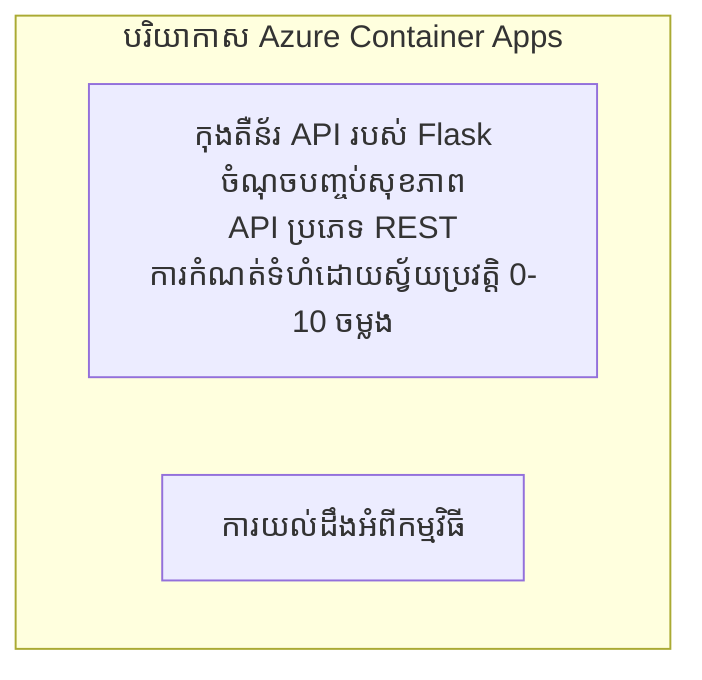

# Simple Flask API - Container App Example

**Learning Path:** Beginner ⭐ | **Time:** 25-35 minutes | **Cost:** $0-15/month

កម្មវិធី Python Flask REST API ពេញលេញដែលដំណើរការ និងបានដាក់នៅលើ Azure Container Apps ដោយប្រើ Azure Developer CLI (azd)។ ឧទាហរណ៍នេះបង្ហាញពីការដាក់កុងតឺន័រ ការកំណត់ auto-scaling និងមូលដ្ឋានការត្រួតពិនិត្យ។

## 🎯 What You'll Learn

- ដាក់កម្មវិធី Python ដែលបានលាយជាកុងតឺន័រទៅ Azure
- កំណត់ auto-scaling ជាមួយ scale-to-zero
- អនុមោគ probes សុខភាព និង readiness checks
- ត្រួតពិនិត្យកំណត់ហេតុនិង métriques របស់កម្មវិធី
- ប្រើ Azure Developer CLI សម្រាប់ដាក់ប្រតិបត្តិការយ៉ាងរហ័ស

## 📦 What's Included

✅ **Flask Application** - REST API ពេញលេញមានប្រតិបត្តិការ CRUD (`src/app.py`)  
✅ **Dockerfile** - ការកំណត់កុងតឺន័រសម្រាប់ produção  
✅ **Bicep Infrastructure** - Περιβάλλον Container Apps និងការដាក់ API  
✅ **AZD Configuration** - ការកំណត់ដាក់មួយពាក្យបញ្ជា  
✅ **Health Probes** - ការត្រួតពិនិត្យ liveness និង readiness បានកំណត់  
✅ **Auto-scaling** - 0-10 replicas អាស្រ័យលើប្រាក់ចំណូល HTTP  

## Architecture



## Prerequisites

### Required
- **Azure Developer CLI (azd)** - [Install guide](https://learn.microsoft.com/azure/developer/azure-developer-cli/install-azd)
- **Azure subscription** - [Free account](https://azure.microsoft.com/free/)
- **Docker Desktop** - [Install Docker](https://www.docker.com/products/docker-desktop/) (សម្រាប់ការធ្វើតេស្តក្នុងម៉ាស៊ីនតំបន់បណ្តាញ)

### Verify Prerequisites

```bash
# ពិនិត្យកំណែ azd (ត្រូវការកំណែ 1.5.0 ឬខ្ពស់ជាង)
azd version

# ផ្ទៀងផ្ទាត់ការចូលទៅកាន់ Azure
azd auth login

# ពិនិត្យ Docker (ជាជម្រើស, សម្រាប់ការសាកល្បងក្នុងបរិយាកាសក្នុងស្រុក)
docker --version
```

## ⏱️ Deployment Timeline

| Phase | Duration | What Happens |
|-------|----------|--------------||
| Environment setup | 30 seconds | Create azd environment |
| Build container | 2-3 minutes | Docker build Flask app |
| Provision infrastructure | 3-5 minutes | Create Container Apps, registry, monitoring |
| Deploy application | 2-3 minutes | Push image and deploy to Container Apps |
| **Total** | **8-12 minutes** | ការដាក់ពេញលេញបានរៀបចំរួចរាល់ |

## Quick Start

```bash
# ចូលទៅកាន់ឧទាហរណ៍
cd examples/container-app/simple-flask-api

# ចាប់ផ្តើមបរិយាកាស (ជ្រើសឈ្មោះមិនស្ទួន)
azd env new myflaskapi

# ដាក់ដំណើរការ​អ្វីៗ​ទាំងអស់ (ហេដ្ឋារចនាសម្ព័ន្ធ + កម្មវិធី)
azd up
# អ្នកនឹងត្រូវបានស្នើឱ្យ:
# 1. ជ្រើសការជាវ Azure
# 2. ជ្រើសទីតាំង (ឧទាហរណ៍: eastus2)
# 3. រង់ចាំ 8-12 នាទី សម្រាប់ការដាក់ដំណើរការ

# ទទួលយកចំណុចបញ្ចប់ API របស់អ្នក
azd env get-values

# សាកល្បង API
curl $(azd env get-value API_ENDPOINT)/health
```

**Expected Output:**
```json
{
  "status": "healthy",
  "timestamp": "2025-11-19T10:30:00Z",
  "service": "simple-flask-api",
  "version": "1.0.0"
}
```

## ✅ Verify Deployment

### Step 1: Check Deployment Status

```bash
# មើលសេវាកម្មដែលបានដាក់ចេញ
azd show

# លទ្ធផលដែលរំពឹងទុកបង្ហាញ៖
# - សេវាកម្ម: api
# - ចំណុចបញ្ចប់: https://ca-api-[env].xxx.azurecontainerapps.io
# - ស្ថានភាព: កំពុងរត់
```

### Step 2: Test API Endpoints

```bash
# យកចំណុចបញ្ចប់ API
API_URL=$(azd env get-value API_ENDPOINT)

# សាកល្បងសុខភាព
curl $API_URL/health

# សាកល្បងចំណុចបញ្ចប់មូលដ្ឋាន
curl $API_URL/

# បង្កើតធាតុមួយ
curl -X POST $API_URL/api/items \
  -H "Content-Type: application/json" \
  -d '{"name": "Test Item", "description": "My first item"}'

# យកធាតុទាំងអស់
curl $API_URL/api/items
```

**Success Criteria:**
- ✅ endpoint សុខភាព ផ្ញើតម្លៃ HTTP 200
- ✅ endpoint មេ បង្ហាញព័ត៌មាន API
- ✅ POST បង្កើតធាតុថ្មី និងត្រឡប់ HTTP 201
- ✅ GET ត្រឡប់ធាតុដែលបានបង្កើត

### Step 3: View Logs

```bash
# ផ្សាយកំណត់ហេតុផ្ទាល់ដោយប្រើ azd monitor
azd monitor --logs

# ឬប្រើ Azure CLI:
az containerapp logs show --name api --resource-group $RG_NAME --follow

# អ្នកគួរតែឃើញ:
# - សារចាប់ផ្តើមរបស់ Gunicorn
# - កំណត់ហេតុសំណើ HTTP
# - កំណត់ហេតុព័ត៌មានអំពីកម្មវិធី
```

## Project Structure

```
simple-flask-api/
├── azure.yaml              # AZD configuration
├── infra/
│   ├── main.bicep         # Main infrastructure
│   ├── main.parameters.json
│   └── app/
│       ├── container-env.bicep
│       └── api.bicep
└── src/
    ├── app.py             # Flask application
    ├── requirements.txt
    └── Dockerfile
```

## API Endpoints

| Endpoint | Method | Description |
|----------|--------|-------------|
| `/health` | GET | ការត្រួតពិនិត្យសុខភាព |
| `/api/items` | GET | បង្ហាញបញ្ជីធាតុទាំងអស់ |
| `/api/items` | POST | បង្កើតធាតុថ្មី |
| `/api/items/{id}` | GET | ទទួលបានធាតុជាក់លាក់ |
| `/api/items/{id}` | PUT | បន្ទាន់សម័យធាតុ |
| `/api/items/{id}` | DELETE | លុបធាតុ |

## Configuration

### Environment Variables

```bash
# កំណត់ការកំណត់ផ្ទាល់ខ្លួន
azd env set PORT 8000
azd env set LOG_LEVEL info
azd env set MAX_REPLICAS 20
```

### Scaling Configuration

API នេះធ្វើការ scale អូតូម៉ាទិកអាស្រ័យលើចរាចរណ៍ HTTP:
- **Min Replicas**: 0 (scale ទៅសូន្យពេលឥតប្រើ)
- **Max Replicas**: 10
- **Concurrent Requests per Replica**: 50

## Development

### Run Locally

```bash
# ដំឡើងការ​ពឹងផ្អែក
cd src
pip install -r requirements.txt

# រត់កម្មវិធី
python app.py

# សាកល្បងក្នុងស្រុក
curl http://localhost:8000/health
```

### Build and Test Container

```bash
# កសាងរូបភាព Docker
docker build -t flask-api:local ./src

# ដំណើរការ កុងតឺន័រ នៅក្នុងម៉ាស៊ីនផ្ទាល់
docker run -p 8000:8000 flask-api:local

# សាកល្បង កុងតឺន័រ
curl http://localhost:8000/health
```

## Deployment

### Full Deployment

```bash
# ដាក់ឲ្យដំណើរការ ហេដ្ឋារចនាសម្ព័ន្ធ និងកម្មវិធី
azd up
```

### Code-Only Deployment

```bash
# ដាក់ចេញតែកូដកម្មវិធី (ហេដ្ឋារចនាសម្ព័ន្ធនៅដដែល)
azd deploy api
```

### Update Configuration

```bash
# ​ធ្វើបច្ចុប្បន្នភាពអថេរបរិស្ថាន
azd env set API_KEY "new-api-key"

# ​បញ្ចូនឡើងវិញជាមួយការកំណត់ថ្មី
azd deploy api
```

## Monitoring

### View Logs

```bash
# ស្ទ្រីមកំណត់ហេតុបន្តផ្ទាល់ដោយប្រើ azd monitor
azd monitor --logs

# ឬប្រើ Azure CLI សម្រាប់ Container Apps:
az containerapp logs show --name api --resource-group $RG_NAME --follow

# មើល 100 បន្ទាត់ចុងក្រោយ
az containerapp logs show --name api --resource-group $RG_NAME --tail 100
```

### Monitor Metrics

```bash
# បើកផ្ទាំងតាមដាន Azure Monitor
azd monitor --overview

# មើលមាត្រដ្ឋានជាក់លាក់
az monitor metrics list \
  --resource $(azd show --output json | jq -r '.services.api.resourceId') \
  --metric "Requests,ResponseTime"
```

## Testing

### Health Check

```bash
curl $(azd show --output json | jq -r '.services.api.endpoint')/health
```

Expected response:
```json
{
  "status": "healthy",
  "timestamp": "2025-11-19T10:30:00Z"
}
```

### Create Item

```bash
curl -X POST $(azd show --output json | jq -r '.services.api.endpoint')/api/items \
  -H "Content-Type: application/json" \
  -d '{"name": "Test Item", "description": "A test item"}'
```

### Get All Items

```bash
curl $(azd show --output json | jq -r '.services.api.endpoint')/api/items
```

## Cost Optimization

ការដាក់នេះប្រើ scale-to-zero ដូច្នេះអ្នកនឹងចំណាយតែពេលដែល API កំពុងដំណើរការ៖

- **Idle cost**: ~$0/month (scale ទៅសូន្យ)
- **Active cost**: ~$0.000024/second per replica
- **Expected monthly cost** (ការ​ប្រើប្រាស់ស្រាល): $5-15

### Reduce Costs Further

```bash
# កាត់បន្ថយចំនួន replicas អតិបរមាសម្រាប់ dev
azd env set MAX_REPLICAS 3

# ប្រើពេលរង់ចាំទំនេរដែលខ្លីជាង
azd env set SCALE_TO_ZERO_TIMEOUT 300  # 5 នាទី
```

## Troubleshooting

### Container Won't Start

```bash
# ពិនិត្យកំណត់ហេតុខុងតឺន័រដោយប្រើ Azure CLI
az containerapp logs show --name api --resource-group $RG_NAME --tail 100

# ផ្ទៀងផ្ទាត់ថា Docker image បានសាងសង់នៅលើម៉ាស៊ីនក្នុងស្រុក
docker build -t test ./src
```

### API Not Accessible

```bash
# ផ្ទៀងផ្ទាត់ថា អ៊ីង្រេស ជា​ខាងក្រៅ
az containerapp show --name api --resource-group rg-simple-flask-api \
  --query properties.configuration.ingress.external
```

### High Response Times

```bash
# ពិនិត្យការប្រើប្រាស់ CPU/អង្គចងចាំ
az monitor metrics list \
  --resource $(azd show --output json | jq -r '.services.api.resourceId') \
  --metric "CPUPercentage,MemoryPercentage"

# បង្កើនធនធាន ប្រសិនបើចាំបាច់
az containerapp update --name api --resource-group rg-simple-flask-api \
  --cpu 1.0 --memory 2Gi
```

## Clean Up

```bash
# លុបធនធានទាំងអស់
azd down --force --purge
```

## Next Steps

### Expand This Example

1. **Add Database** - បញ្ចូល Azure Cosmos DB ឬ SQL Database
   ```bash
   # បន្ថែមម៉ូឌុល Cosmos DB ទៅ infra/main.bicep
   # អាប់ដេត app.py ជាមួយការតភ្ជាប់មូលដ្ឋានទិន្នន័យ
   ```

2. **Add Authentication** - អនុវត្ត Microsoft Entra ID ឬ API keys
   ```python
   # បន្ថែម middleware សម្រាប់ផ្ទៀងផ្ទាត់អត្តសញ្ញាណទៅក្នុង app.py
   from functools import wraps
   ```

3. **Set Up CI/CD** - GitHub Actions workflow
   ```yaml
   # Create .github/workflows/deploy.yml
   name: Deploy to Azure
   on: [push]
   ```

4. **Add Managed Identity** - សុវត្ថិភាពក្នុងការចូលដំណើរការ Azure services
   ```bicep
   # Update infra/app/api.bicep
   identity: { type: 'SystemAssigned' }
   ```

### Related Examples

- **[Database App](../../../../../examples/database-app)** - ឧទាហរណ៍ពេញលេញជាមួយ SQL Database
- **[Microservices](../../../../../examples/container-app/microservices)** - ស្ថាបត្យកម្ម multi-service
- **[Container Apps Master Guide](../README.md)** - គំរូ container ទាំងអស់

### Learning Resources

- 📚 [AZD For Beginners Course](../../../README.md) - ទំព័រដើមរបស់វគ្គសិក្សា
- 📚 [Container Apps Patterns](../README.md) - គំរូដាក់បញ្ចូលបន្ថែម
- 📚 [AZD Templates Gallery](https://azure.github.io/awesome-azd/) - គំរូសហគមន៍

## Additional Resources

### Documentation
- **[Flask Documentation](https://flask.palletsprojects.com/)** - មាគ្គុទេសក៍ framework Flask
- **[Azure Container Apps](https://learn.microsoft.com/azure/container-apps/)** - ឯកសារ​ផ្លូវការ Azure
- **[Azure Developer CLI](https://learn.microsoft.com/azure/developer/azure-developer-cli/)** - ឯកសារอ้างอิงคำสั่ง azd

### Tutorials
- **[Container Apps Quickstart](https://learn.microsoft.com/azure/container-apps/quickstart-portal)** - ដាក់កម្មវិធីដំបូងរបស់អ្នក
- **[Python on Azure](https://learn.microsoft.com/azure/developer/python/)** - មគ្គុទេសក៍អភិវឌ្ឍ Python
- **[Bicep Language](https://learn.microsoft.com/azure/azure-resource-manager/bicep/)** - ហេតុការណ៍ Infrastructure as code

### Tools
- **[Azure Portal](https://portal.azure.com)** - គ្រប់គ្រងធនធានតាមរូបភាព
- **[VS Code Azure Extension](https://marketplace.visualstudio.com/items?itemName=ms-azuretools.vscode-azurecontainerapps)** - ការរួមបញ្ចូល IDE

---

**🎉 Congratulations!** អ្នកបានដាក់ Flask API ដែលអាចប្រើក្នុងផលិតកម្មទៅ Azure Container Apps ជាមួយ auto-scaling និងការត្រួតពិនិត្យរួចរាល់។

**Questions?** [Open an issue](https://github.com/microsoft/AZD-for-beginners/issues) or check the [FAQ](../../../resources/faq.md)

---

<!-- CO-OP TRANSLATOR DISCLAIMER START -->
**ការបដិសេធ**:
ឯកសារនេះត្រូវបានបម្លែងភាសា ដោយប្រើសេវាបម្លែងភាសា AI [Co-op Translator](https://github.com/Azure/co-op-translator)។ ទោះយើងខ្ញុំមានក្តីប្រាថ្នាឱ្យបានច្បាស់លាស់ តែសូមយល់ដឹងថាការបម្លែងដោយស្វ័យប្រវត្តិក៏អាចមានកំហុសឬភាពមិនត្រឹមត្រូវ។ ឯកសារដើមជាភាសាទីតាំងគួរត្រូវបានគេប្រើជាប្រភពច្បាស់លាស់។ សម្រាប់ព័ត៌មានសំខាន់ៗ សូមណែនាំឱ្យប្រើប្រាស់ការប្រែដោយមនុស្សជំនាញ។ យើងខ្ញុំមិនទទួលខុសត្រូវចំពោះការយល់ច្រឡំ ឬការបកស្រាយខុសបន្ទាប់ពីការប្រើប្រាស់ការបម្លែងនេះនោះទេ។
<!-- CO-OP TRANSLATOR DISCLAIMER END -->