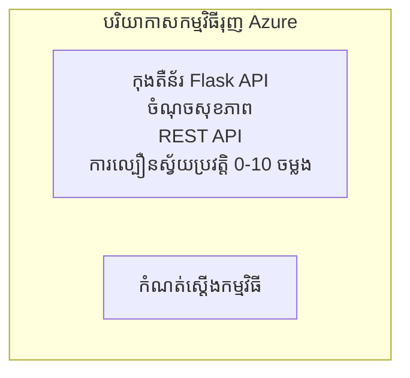

# ឧទាហរណ៍កម្មវិធី Container API Flask សាមញ្ញ

**ផ្លូវការសិក្សា:** អ្នកចាប់ផ្តើម ⭐ | **ពេលវេលា:** 25-35 នាទី | **ថ្លៃ:** $0-15/ខែ

API Flask REST Python ទាំងមូល ដែលបានដាក់ពាណិជ្ជកម្មទៅ Azure Container Apps ប្រើ Azure Developer CLI (azd)។ ឧទាហរណ៍នេះបង្ហាញពីការដាក់ពាណិជ្ជកម្ម container, auto-scaling, និងមូលដ្ឋានមើលតាម។

## 🎯 អ្វីដែលអ្នកនឹងរៀន

- ដាក់ពាណិជ្ជកម្មកម្មវិធី Python ដែលមាន container ទៅ Azure
- កំណត់ auto-scaling ជាមួយ scale-to-zero
- អនុវត្តការស្ទង់សុខភាពនិងការត្រួតពិនិត្យភាពរួចរាល់
- តាមដានកំណត់ហេតុនិងមាត្រដ្ឋានកម្មវិធី
- ប្រើ Azure Developer CLI សម្រាប់ការដាក់ពាណិជ្ជកម្មលឿន

## 📦 អ្វីដែលបានរួមបញ្ចូល

✅ **កម្មវិធី Flask** - REST API ពេញលេញជាមួយប្រតិបត្តិការកែប្រែ (`src/app.py`)  
✅ **Dockerfile** - ការកំណត់ container សម្រាប់ផលិតកម្ម  
✅ **គ្រឹះស្ថាន Bicep** - បរិយាកាស Container Apps និងការដាក់ពាណិជ្ជកម្ម API  
✅ **កំណត់ AZD** - ការរៀបចំពាណិជ្ជកម្មដោយពាក្យបញ្ជាដាច់ខាត  
✅ **ការស្ទង់សុខភាព** - ការត្រួតពិនិត្យភាពរស់ និងភាពរួចរាល់  
✅ **Auto-scaling** - 0-10 អនុស្សាវរីយ៍ ដោយផ្អែកលើបំណង HTTP  

## សំណុំរចនាសម្ព័ន្ធ


## ពាក្យជាមុន

### ត្រូវការប្រើប្រាស់
- **Azure Developer CLI (azd)** - [មគ្គុទេសក៍ដំឡើង](https://learn.microsoft.com/azure/developer/azure-developer-cli/install-azd)
- **ការជាវ Azure** - [គណនីឥតគិតថ្លៃ](https://azure.microsoft.com/free/)
- **Docker Desktop** - [ដំឡើង Docker](https://www.docker.com/products/docker-desktop/) (សម្រាប់តេស្តនៅក្នុងមូលដ្ឋាន)

### ផ្ទៀងផ្ទាត់ពាក្យជាមុន

```bash
# ពិនិត្យមើលកំណែ azd (ត្រូវការមាន 1.5.0 ឬខ្ពស់ជាងនេះ)
azd version

# ធ្វើការផ្ទៀងផ្ទាត់ការចូលប្រើ Azure
azd auth login

# ពិនិត្យមើល Docker (ជាចំណាយបន្ថែម សម្រាប់ការធ្វើតេស្តក្នុងភូមិសាស្ត្រ)
docker --version
```

## ⏱️ កាលវិភាគដាក់ពាណិជ្ជកម្ម

| ជំហាន | រយៈពេល | ព្រឹត្តិការណ៍ |
|--------|---------|--------------|
| រៀបចំបរិយាកាស | 30 វិនាទី | បង្កើតបរិយាកាស azd |
| សង់ container | 2-3 នាទី | Docker សង់កម្មវិធី Flask |
| ផ្តល់គ្រឹះស្ថាន | 3-5 នាទី | បង្កើត Container Apps, បណ្ណាល័យ, មើលតាម |
| ដាក់ពាណិជ្ជកម្មកម្មវិធី | 2-3 នាទី | បញ្ចូលរូបភាព និងដាក់ពាណិជ្ជកម្មទៅ Container Apps |
| **សរុប** | **8-12 នាទី** | ដាក់ពាណិជ្ជកម្មរួចរាល់ |

## ចាប់ផ្តើមរហ័ស

```bash
# នាវែចទៅឧទាហរណ៍
cd examples/container-app/simple-flask-api

# ចាប់ផ្តើមបរិស្ថាន (ជ្រើសឈ្មោះមានតែមួយ)
azd env new myflaskapi

# ដាក់បង្ហាញគ្រប់យ៉ាង (ហេដ្ឋារចនាសម្ព័ន្ធ + កម្មវិធី)
azd up
# អ្នកនឹងត្រូវបានស្នើឱ្យ:
# 1. ជ្រើសដើម្បីចុះឈ្មោះ Azure
# 2. ជ្រើសទីតាំង (ឧ. eastus2)
# 3. រង់ចាំ 8-12 នាទីសម្រាប់ការដាក់បង្ហាញ

# ទទួលបានចំណុចចេញ API របស់អ្នក
azd env get-values

# សាកល្បង API
curl $(azd env get-value API_ENDPOINT)/health
```

**លទ្ធផលរំពឹងទុក៖**
```json
{
  "status": "healthy",
  "timestamp": "2025-11-19T10:30:00Z",
  "service": "simple-flask-api",
  "version": "1.0.0"
}
```

## ✅ ផ្ទៀងផ្ទាត់ការដាក់ពាណិជ្ជកម្ម

### ជំហាន 1: ពិនិត្យស្ថានភាពដាក់ពាណិជ្ជកម្ម

```bash
# មើលសេវាកម្មដែលបានចាក់បញ្ចូល
azd show

# លទ្ធផលដែលរំពឹងទុកបង្ហាញៈ
# - សេវាកម្មៈ api
# - ចំណុចបញ្ចូលចុងក្រោយៈ https://ca-api-[env].xxx.azurecontainerapps.io
# - ស្ថានភាពៈ កំពុងដំណើរការ
```

### ជំហាន 2: សាកល្បងចំណុចចូល API

```bash
# ទទួលបានចំណុចបញ្ចប់ API
API_URL=$(azd env get-value API_ENDPOINT)

# ពិនិត្យសុខភាព
curl $API_URL/health

# ពិនិត្យចំណុចបញ្ចប់ឬត
curl $API_URL/

# បង្កើតធាតុមួយ
curl -X POST $API_URL/api/items \
  -H "Content-Type: application/json" \
  -d '{"name": "Test Item", "description": "My first item"}'

# ទទួលបានធាតុទាំងអស់
curl $API_URL/api/items
```

**លក្ខខណ្ឌជោគជ័យ៖**
- ✅ ចំនុចសុខភាពតបតាម HTTP 200
- ✅ ចំនុចដើមបង្ហាញព័ត៌មាន API
- ✅ POST បង្កើតធាតុនិងតបតាម HTTP 201
- ✅ GET តបវិញធាតុដែលបានបង្កើត

### ជំហាន 3: មើលកំណត់ហេតុ

```bash
# វេចខ្ទាតកំណត់ហេតុផ្សាយបន្តផ្ទាល់ប្រើ azd monitor
azd monitor --logs

# ឬប្រើ Azure CLI:
az containerapp logs show --name api --resource-group $RG_NAME --follow

# អ្នកគួរតែឃើញ:
# - សារ​ផ្ដើម​ដំណើរការ Gunicorn
# - កំណត់ហេតុ​សំណើ HTTP
# - កំណត់ហេតុ​ព័ត៌មាន​កម្មវិធី
```

## រចនាសម្ព័ន្ធគម្រោង

```
simple-flask-api/
├── azure.yaml              # AZD configuration
├── infra/
│   ├── main.bicep         # Main infrastructure
│   ├── main.parameters.json
│   └── app/
│       ├── container-env.bicep
│       └── api.bicep
└── src/
    ├── app.py             # Flask application
    ├── requirements.txt
    └── Dockerfile
```

## ចំណុចចូល API

| ចំណុចចូល | វិធីសាស្ត្រ | ការពិពណ៌នា |
|------------|------------|--------------|
| `/health` | GET | ពិនិត្យសុខភាព |
| `/api/items` | GET | បញ្ជីធាតុទាំងអស់ |
| `/api/items` | POST | បង្កើតធាតុថ្មី |
| `/api/items/{id}` | GET | ទទួលបានធាតុជាក់លាក់ |
| `/api/items/{id}` | PUT | កែប្រែធាតុ |
| `/api/items/{id}` | DELETE | លុបធាតុ |

## កំណត់រចនាសម្ព័ន្ធ

### អថេរបរិយាកាស

```bash
# កំណត់ការកំណត់បំណងផ្ទាល់ខ្លួន
azd env set PORT 8000
azd env set LOG_LEVEL info
azd env set MAX_REPLICAS 20
```

### កំណត់រាងការបង្វិល

API បង្វិលដោយស្វ័យប្រវត្តិបើកផ្អែកលើចរន្ត HTTP៖
- **អនុស្សាវរីយ៍តិចបំផុត**: 0 (បង្វិលទៅសូន្យពេលគ្មានសកម្មភាព)
- **អនុស្សាវរីយ៍អតិបរមា**: 10
- **ការស្នើសុំសមស្របក្នុងមួយអនុស្សាវរីយ៍**: 50

## ការអភិវឌ្ឍ

### រត់នៅក្នុងមូលដ្ឋាន

```bash
# ដំឡើងការពឹងផ្អែក
cd src
pip install -r requirements.txt

# រំកិលកម្មវិធី
python app.py

# សាកល្បងក្នុងស្រុក
curl http://localhost:8000/health
```

### សង់និងសាកល្បង container

```bash
# សាងសង់រូបភាព Docker
docker build -t flask-api:local ./src

# ប្រតិបត្តិធុងឡើងនៅក្នុងហោសថ៍
docker run -p 8000:8000 flask-api:local

# សាកល្បងធុង
curl http://localhost:8000/health
```

## ដាក់ពាណិជ្ជកម្ម

### ដាក់ពាណិជ្ជកម្មពេញលេញ

```bash
# ចុះដំណើរការឧបករណ៍គ្រប់គ្រង និងកម្មវិធី
azd up
```

### ដាក់ពាណិជ្ជកម្មតែcode

```bash
# ដាក់បញ្ចូលកូដកម្មវិធីតែប៉ុន្តែ (គ្រឹះស្ថានមិនផ្លាស់ប្តូរ)
azd deploy api
```

### ធ្វើបច្ចុប្បន្នភាពកំណត់រចនាសម្ព័ន្ធ

```bash
# បន្ទាន់សម័យអថេរបរិស្ថាន
azd env set API_KEY "new-api-key"

# បញ្ចូនឡើងវិញជាមួយការកំណត់រចនាសម្ព័ន្ធថ្មី
azd deploy api
```

## មើលតាម

### មើលកំណត់ហេតុ

```bash
# បញ្ចូនស្ទ្រីមកំណត់ហេតុកំពាល់ជីវិតដោយប្រើ azd monitor
azd monitor --logs

# ឬប្រើ Azure CLI សម្រាប់ Container Apps:
az containerapp logs show --name api --resource-group $RG_NAME --follow

# មើលបន្ទាត់ចុងក្រោយ ១០០ បន្ទាត់
az containerapp logs show --name api --resource-group $RG_NAME --tail 100
```

### តាមដានមាត្រដ្ឋាន

```bash
# បើកផ្ទាំងត្រួតពិនិត្យ Azure Monitor
azd monitor --overview

# មើលមេទ្រិកជាក់លាក់
az monitor metrics list \
  --resource $(azd show --output json | jq -r '.services.api.resourceId') \
  --metric "Requests,ResponseTime"
```

## សាកល្បង

### ពិនិត្យសុខភាព

```bash
curl $(azd show --output json | jq -r '.services.api.endpoint')/health
```

លទ្ធផលរំពឹងទុក៖
```json
{
  "status": "healthy",
  "timestamp": "2025-11-19T10:30:00Z"
}
```

### បង្កើតធាតុ

```bash
curl -X POST $(azd show --output json | jq -r '.services.api.endpoint')/api/items \
  -H "Content-Type: application/json" \
  -d '{"name": "Test Item", "description": "A test item"}'
```

### ទទួលបានធាតុទាំងអស់

```bash
curl $(azd show --output json | jq -r '.services.api.endpoint')/api/items
```

## ការបញ្ចុះថ្លៃ

ការដាក់ពាណិជ្ជកម្មនេះប្រើ scale-to-zero ដូច្នេះអ្នកបង់តែពេល API កំពុងដំណើរការ៖

- **ថ្លៃនៅពេលស្ងប់ស្ងាត់**: ~$0/ខែ (បង្វិលទៅសូន្យ)
- **ថ្លៃពេលសកម្ម**: ~$0.000024/វិនាទី ក្នុងមួយអនុស្សាវរីយ៍
- **ថ្លៃសរុបប្រចាំខែរំពឹងទុក** (ប្រើប្រាស់ខ្លះ): $5-15

### បន្ថយថ្លៃបន្ថែមទៀត

```bash
# ធ្វាក់ចុះចម្លងអតិបរមាសម្រាប់ dev
azd env set MAX_REPLICAS 3

# ប្រើពេលវេលាជាប់ទន់ខ្លីជាងនេះ
azd env set SCALE_TO_ZERO_TIMEOUT 300  # ៥ នាទី
```

## ការដោះស្រាយបញ្ហា

### Container មិនចាប់ផ្ដើម

```bash
# ពិនិត្យកំណត់ហេតុ container ដោយប្រើ Azure CLI
az containerapp logs show --name api --resource-group $RG_NAME --tail 100

# សម្រួលការបង្កើតរូប Docker ក្នុងកន្លែងម៉ាស៊ីនមូលដ្ឋាន
docker build -t test ./src
```

### API មិនអាចចូលដំណើរការ

```bash
# ត្រួតពិនិត្យឲ្យប្រាកដថា​ការ​ចូល​គឺ​ពីក្រៅ
az containerapp show --name api --resource-group rg-simple-flask-api \
  --query properties.configuration.ingress.external
```

### ពេលឆ្លើយតបខ្ពស់

```bash
# ដំឡើងការប្រើប្រាស់ CPU/យ៉ាងខ្សោយ
az monitor metrics list \
  --resource $(azd show --output json | jq -r '.services.api.resourceId') \
  --metric "CPUPercentage,MemoryPercentage"

# ពង្រីកធនធានបើចាំបាច់
az containerapp update --name api --resource-group rg-simple-flask-api \
  --cpu 1.0 --memory 2Gi
```

## សម្អាត

```bash
# លុបធនធានទាំងអស់
azd down --force --purge
```

## ជំហានបន្ទាប់

### ពង្រីកឧទាហរណ៍នេះ

1. **បន្ថែមមូលដ្ឋានទិន្នន័យ** - សម្របសម្រួល Azure Cosmos DB ឬ SQL Database  
   ```bash
   # បន្ថែមម៉ូឌុល Cosmos DB ទៅ infra/main.bicep
   # អាប់ដេត app.py ជាមួយការតភ្ជាប់ទិន្នន័យ
   ```
  
2. **បន្ថែមការផ្ទៀងផ្ទាត់** - អនុវត្ត Azure AD ឬសោ API  
   ```python
   # បន្ថែម middleware អះអាងសម្ងាត់ទៅ app.py
   from functools import wraps
   ```
  
3. **រៀបចំ CI/CD** - ការងារសកម្ម GitHub  
   ```yaml
   # Create .github/workflows/deploy.yml
   name: Deploy to Azure
   on: [push]
   ```
  
4. **បន្ថែម Managed Identity** - ការពារការចូលប្រើសេវាកម្ម Azure  
   ```bicep
   # Update infra/app/api.bicep
   identity: { type: 'SystemAssigned' }
   ```
  
### ឧទាហរណ៍ដែលទាក់ទង

- **[កម្មវិធី Database](../../../../../examples/database-app)** - ឧទាហរណ៍ជាក់លាក់ជាមួយ SQL Database  
- **[Microservices](../../../../../examples/container-app/microservices)** - រចនាសម្ព័ន្ធម៉ាស៊ីនបម្រើច្រើន  
- **[មគ្គុទេសក៍ Container Apps](../README.md)** - គំរូ container ទាំងអស់  

### ធនធានសិក្សា

- 📚 [វគ្គ AZD សម្រាប់អ្នកចាប់ផ្តើម](../../../README.md) - ផ្ទះវគ្គសិក្សា  
- 📚 [រចនាសម្ព័ន្ធ Container Apps](../README.md) - គំរូដាក់ពាណិជ្ជកម្មបន្ថែម  
- 📚 [បណ្ណាកម្ម AZD](https://azure.github.io/awesome-azd/) - គំរូសហគមន៍  

## ធនធានបន្ថែម

### ឯកសារ
- **[ឯកសារ Flask](https://flask.palletsprojects.com/)** - មគ្គុទេសក៍ Flask framework  
- **[Azure Container Apps](https://learn.microsoft.com/azure/container-apps/)** - ឯកសារផ្លូវការរបស់ Azure  
- **[Azure Developer CLI](https://learn.microsoft.com/azure/developer/azure-developer-cli/)** - ឯកសារពាក្យបញ្ជា azd  

### មេរៀន
- **[Quickstart Container Apps](https://learn.microsoft.com/azure/container-apps/quickstart-portal)** - ដាក់កម្មវិធីដំបូងរបស់អ្នក  
- **[Python នៅលើ Azure](https://learn.microsoft.com/azure/developer/python/)** - មគ្គុទេសក៍អភិវឌ្ឍ Python  
- **[ភាសា Bicep](https://learn.microsoft.com/azure/azure-resource-manager/bicep/)** - គ្រឹះស្ថានជាកូដ  

### ឧបករណ៍
- **[ផតថល Azure](https://portal.azure.com)** - គ្រប់គ្រងធនធានដោយភ្លាម  
- **[កម្មវិធី VS Code Azure Extension](https://marketplace.visualstudio.com/items?itemName=ms-azuretools.vscode-azurecontainerapps)** - តភ្ជាប់ IDE  

---

**🎉 សូមស្វាគមន៍!** អ្នកបានដាក់ API Flask សម្រាប់ផលិតកម្មទៅ Azure Container Apps ជោគជ័យជាមួយ auto-scaling និងមើលតាម។

**សំណួរ?** [បើកបញ្ហា](https://github.com/microsoft/AZD-for-beginners/issues) ឬពិនិត្យ [FAQ](../../../resources/faq.md)

---

<!-- CO-OP TRANSLATOR DISCLAIMER START -->
**ការបដិសេធ**:  
ឯកសារនេះត្រូវបានបកប្រែដោយប្រើសេវាកម្មបកប្រែ AI [Co-op Translator](https://github.com/Azure/co-op-translator)។ ខណៈពេលដែលយើងខិតខំសម្រាប់ភាពត្រឹមត្រូវ សូមកត់សម្គាល់ថា ការបកប្រែដោយស្វ័យប្រវត្តិអាចមានកំហុស ឬភាពមិនភាពត្រឹមត្រូវ។ ឯកសារដើមក្នុងភាសាទាំងមូលគួរត្រូវបានគេគិតថាជា ប្រភពដែលមានសិទ្ធិលើព័ត៌មាន។ សម្រាប់ព័ត៌មានសំខាន់ៗ ការបកប្រែដោយអ្នកជំនាញមនុស្សគឺបានផ្តល់អនុសាសន៍។ យើងមិនទទួលខុសត្រូវចំពោះការអះអាង ឬការបកប្រែខុសគ្នាណាមួយដែលកើតឡើងពីការប្រើប្រាស់ការបកប្រែនេះទេ។
<!-- CO-OP TRANSLATOR DISCLAIMER END -->