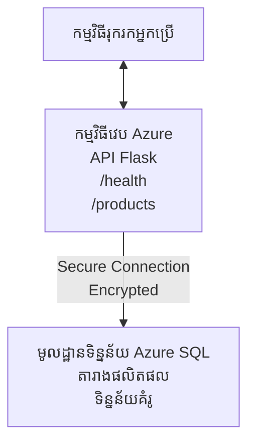

# ការដាក់បញ្ចូលមូលដ្ឋានទិន្នន័យ Microsoft SQL និងកម្មវិធីវែបជាមួយ AZD

⏱️ **ពេលវេលាកំណត់ប៉ាន់ប្រមាណ**៖ 20-30 នាទី | 💰 **ថ្លៃដើមប៉ាន់ប្រមាណ**៖ ~ $15-25/ខែ | ⭐ **កម្រិតភាពស្មុគស្មាញ**៖ ផ្នែកមធ្យម

ឧទាហរណ៍ **ពេញលេញ និងដំណើរការបាន** នេះ បង្ហាញពីវិធីប្រើប្រាស់ [Azure Developer CLI (azd)](https://learn.microsoft.com/azure/developer/azure-developer-cli/) ដើម្បីដាក់បញ្ចូលកម្មវិធីវែប Python Flask ជាមួយមូលដ្ឋានទិន្នន័យ Microsoft SQL ទៅ Azure។ កូដទាំងអស់មានរួច និងបានសាកល្បង—មិនត្រូវការពឹងផ្អែកខាងក្រៅទេ។

## អ្វីដែលអ្នកនឹងរៀបរាប់

ដោយបញ្ចប់ឧទាហរណ៍នេះ អ្នកនឹង:
- ដាក់បញ្ចូលកម្មវិធីបន្ទាប់បន្តគ្នាច្រើនជាន់ (កម្មវិធីវែប + មូលដ្ឋានទិន្នន័យ) ដោយប្រើរចនាសម្ព័ន្ធជាកូដ
- កំណត់ការតភ្ជាប់មូលដ្ឋានទិន្នន័យយ៉ាងសុវត្ថិភាពដោយគ្មានការចងក្រងលេខសម្ងាត់
- តាមដានសុខភាពកម្មវិធីជាមួយ Application Insights
- គ្រប់គ្រងធនធាន Azure យ៉ាងមានប្រសិទ្ធិភាពជាមួយ AZD CLI
- អនុវត្តអនុប្រតិបត្តិនល្អបំផុតរបស់ Azure សម្រាប់សុវត្ថិភាព ការបង្កើនសមត្ថភាព និងការតាមដាន

## ទិដ្ឋភាពទូទៅនៃឧទាហរណ៍
- **កម្មវិធីវែប**៖ Python Flask REST API ជាមួយការតភ្ជាប់មូលដ្ឋានទិន្នន័យ
- **មូលដ្ឋានទិន្នន័យ**៖ Azure SQL Database ជាមួយទិន្នន័យគំរូ
- **រចនាសម្ព័ន្ធ**៖ ត្រូវបានបញ្ជាក់ដោយប្រើ Bicep (ទម្រង់ប្លង់អាចប្រើឡើងវិញ)
- **ការដាក់បញ្ចូល**៖ ជាការស្វ័យប្រវត្តិយ៉ាងពេញលេញដោយបញ្ជា `azd`
- **ការត្រួតពិនិត្យ**៖ Application Insights សម្រាប់បញ្ជីកំណត់ហេតុ និងទិន្នន័យឆ្លងកាត់

## តម្រូវការ 

### ឧបករណ៍តម្រូវការ

មុនចាប់ផ្តើម សូមពិនិត្យឲ្យប្រាកដថាមានឧបករណ៍ខាងក្រោមតម្លើងរួច:

1. **[Azure CLI](https://learn.microsoft.com/cli/azure/install-azure-cli)** (កំណែ 2.50.0 ឬខ្ពស់ជាង)
   ```sh
   az --version
   # លទ្ធផលដែលរំពឹងទុក: azure-cli 2.50.0 ឬខ្ពស់ជាងនេះ
   ```

2. **[Azure Developer CLI (azd)](https://learn.microsoft.com/azure/developer/azure-developer-cli/install-azd)** (កំណែ 1.0.0 ឬខ្ពស់ជាង)
   ```sh
   azd version
   # លទ្ធផលដែលរំពឹងទុក៖ azd ជំនាន់ 1.0.0 ឬខ្ពស់ជាងនេះ
   ```

3. **[Python 3.8+](https://www.python.org/downloads/)** (សម្រាប់អភិវឌ្ឍន៍ក្នុងស្រុក)
   ```sh
   python --version
   # លទ្ធផលដែលរំពឹងទុក៖ Python 3.8 ឬខ្ពស់ជាងនេះ
   ```

4. **[Docker](https://www.docker.com/get-started)** (ជាជម្រើស, សម្រាប់អភិវឌ្ឍន៍ container នៅក្នុងផ្លូវ)
   ```sh
   docker --version
   # លទ្ធផលដែលរំពឹងទុក៖ កំណែ Docker 20.10 ឬខ្ពស់ជាងនេះ
   ```

### តម្រូវការ Azure

- មាន **ការជាវ Azure សកម្ម** ([បង្កើតគណនីដោយឥតគិតថ្លៃ](https://azure.microsoft.com/free/))
- មានសិទ្ធិក្នុងការបង្កើតធនធាននៅក្នុងការជាវរបស់អ្នក
- តួនាទី **ម្ចាស់** ឬ **អ្នករួមចំណែក** លើការជាវ ឬក្រុមធនធាន

### តម្រូវការជំនាញ

នេះជាឧទាហរណ៍ **កម្រិតមធ្យម**។ អ្នកគួរតែស្គាល់:
- ការប្រតិបត្តិការជាមួយបញ្ជារបញ្ជា
- គំនិតមូលដ្ឋានអំពីពពក (ធនធាន, ក្រុមធនធាន)
- ការយល់ដឹងមូលដ្ឋានអំពីកម្មវិធីវែប និងមូលដ្ឋានទិន្នន័យ

**ថ្មីចំពោះ AZD?** សូមចាប់ផ្តើមជាមួយ [មាគ៌ាដំបូង](../../docs/chapter-01-foundation/azd-basics.md) មុន។

## រចនាសម្ព័ន្ធ

ឧទាហរណ៍នេះដាក់ជូនរចនាសម្ព័ន្ធ ២ ជាន់ ជាមួយកម្មវិធីវែប និងមូលដ្ឋានទិន្នន័យ SQL ៖


**ការដាក់ធនធាន**៖
- **Resource Group**៖ ធុងបំណែកសម្រាប់ធនធានទាំងអស់
- **App Service Plan**៖ ចំណត Linux (ជាន់ B1 សម្រាប់គុណភាពថ្លៃថោក)
- **Web App**៖ រត់ Python 3.11 ជាមួយកម្មវិធី Flask
- **SQL Server**៖ ម៉ាស៊ីនមូលដ្ឋានទិន្នន័យដែលគ្រប់គ្រង និងប្រើ TLS 1.2 យ៉ាងតិច
- **SQL Database**៖ ជាន់មូលដ្ឋាន (2GB សមស្របសម្រាប់អភិវឌ្ឍន៍/សាកល្បង)
- **Application Insights**៖ តាមដាន និងកំណត់ហេតុ
- **Log Analytics Workspace**៖ កន្លែងផ្ទុកកំណត់ហេតុមជ្ឈមណ្ឌល

**កិរិយាសេចក្តីសម្រង់**៖ គិតឲ្យដូចជារមណីយដ្ឋាន (កម្មវិធីវែប) មានត្រជាក់ក្នុងឃ្លាំងថ្នល់ (មូលដ្ឋានទិន្នន័យ)។ អតិថិជនបញ្ជាទិញពីមឺនុយ (ចំណុច API) ហើយផ្ទះបាយ (កម្មវិធី Flask) យកសារពើភ័ណ្ឌ (ទិន្នន័យ) ពីត្រជាក់។ អ្នកគ្រប់គ្រងភោជនីយដ្ឋាន (Application Insights) តាមដានអ្វីៗគ្រប់យ៉ាងកើតឡើង។

## រចនាសម្ព័ន្ធថតឯកសារ

ឯកសារទាំងអស់រួមបញ្ចូលក្នុងឧទាហរណ៍នេះ—មិនត្រូវការពឹងផ្អែកខាងក្រៅទេ៖

```
examples/database-app/
│
├── README.md                    # This file
├── azure.yaml                   # AZD configuration file
├── .env.sample                  # Sample environment variables
├── .gitignore                   # Git ignore patterns
│
├── infra/                       # Infrastructure as Code (Bicep)
│   ├── main.bicep              # Main orchestration template
│   ├── abbreviations.json      # Azure naming conventions
│   └── resources/              # Modular resource templates
│       ├── sql-server.bicep    # SQL Server configuration
│       ├── sql-database.bicep  # Database configuration
│       ├── app-service-plan.bicep  # Hosting plan
│       ├── app-insights.bicep  # Monitoring setup
│       └── web-app.bicep       # Web application
│
└── src/
    └── web/                    # Application source code
        ├── app.py              # Flask REST API
        ├── requirements.txt    # Python dependencies
        └── Dockerfile          # Container definition
```

**គោលបំណងរាល់ឯកសារ**៖
- **azure.yaml**៖ ប្រាប់ AZD អំពីអ្វីដែលត្រូវដាក់ និងនៅកន្លែងណា
- **infra/main.bicep**៖ ចងចាំធនធាន Azure ទាំងអស់
- **infra/resources/*.bicep**៖ ការបញ្ជាក់ធនធានបុគ្គល (អាចប្រើឡើងវិញ)
- **src/web/app.py**៖ កម្មវិធី Flask ជាមួយលក្ខណៈអនុវត្ត មូលដ្ឋានទិន្នន័យ
- **requirements.txt**៖ ពារ្រៀបនេយក្រុម Python
- **Dockerfile**៖ គន្លងនៃក្រុមគ្រប់គ្រង container សម្រាប់ដាក់បញ្ចូល

## ការចាប់ផ្តើមយ៉ាងលឿន (ជាទិន្នន័យជាដំណាក់កាល)

### ជំហាន 1: Clone និងរុករក

```sh
git clone https://github.com/microsoft/AZD-for-beginners.git
cd AZD-for-beginners/examples/database-app
```

**✓ ឆែកចាំផុតប៉ុន្មាន**៖ ត្រួតពិនិត្យដែលអ្នកឃើញ `azure.yaml` និងថត `infra/` ៖
```sh
ls
# ផ្ដល់អនុសាសន៍: README.md, azure.yaml, infra/, src/
```

### ជំហាន 2: ឯកសារអ្នកប្រើជាមួយ Azure

```sh
azd auth login
```

នេះបើកកម្មវិធីរុករករបស់អ្នកសម្រាប់ផ្ទៀងផ្ទាត់ Azure។ ចូលប្រើជាមួយគណនី Azure របស់អ្នក។

**✓ ឆែកចាំផុតប៉ុន្មាន**៖ អ្នកគួរតែឃើញ៖
```
Logged in to Azure.
```

### ជំហាន 3: ចាប់ផ្តើមបរិយាកាស

```sh
azd init
```

**អ្វីកើតឡើង**៖ AZD បង្កើតការកំណត់ក្នុងស្រុកសម្រាប់ការដាក់បញ្ចូល។

**សំណួរសម្រាប់អ្នក**៖
- **ឈ្មោះបរិយាកាស**៖ បញ្ចូលឈ្មោះខ្លី (ឧ. `dev`, `myapp`)
- **ការជាវ Azure**៖ ជ្រើសការជាវពីបញ្ជី
- **ទីតាំង Azure**៖ ជ្រើសតំបន់ (ឧ. `eastus`, `westeurope`)

**✓ ឆែកចាំផុតប៉ុន្មាន**៖ អ្នកគួរតែឃើញ៖
```
SUCCESS: New project initialized!
```

### ជំហាន 4: បង្កើតធនធាន Azure

```sh
azd provision
```

**អ្វីកើតឡើង**៖ AZD ដាក់ធនធានទាំងអស់ (ប្រហែល 5-8 នាទី):
1. បង្កើត resource group
2. បង្កើត SQL Server និង Database
3. បង្កើត App Service Plan
4. បង្កើត Web App
5. បង្កើត Application Insights
6. កំណត់បណ្ដាញ និងសុវត្ថិភាព

**អ្នកត្រូវផ្ដល់**:
- **ឈ្មោះអ្នកគ្រប់គ្រង SQL**៖ បញ្ចូលឈ្មោះអ្នកប្រើ (ឧ. `sqladmin`)
- **ពាក្យសម្ងាត់អ្នកគ្រប់គ្រង SQL**៖ បញ្ចូលពាក្យសម្ងាត់ខ្លាំង (សូមរក្សាទុក!)

**✓ ឆែកចាំផុតប៉ុន្មាន**៖ អ្នកគួរតែឃើញ៖
```
SUCCESS: Your application was provisioned in Azure in X minutes Y seconds.
You can view the resources created under the resource group rg-<env-name> in Azure Portal:
https://portal.azure.com/#@/resource/subscriptions/.../resourceGroups/rg-<env-name>
```

**⏱️ ពេលវេលា**៖ 5-8 នាទី

### ជំហាន 5: ដាក់បញ្ចូលកម្មវិធី

```sh
azd deploy
```

**អ្វីកើតឡើង**៖ AZD បង្កើត និងដាក់កម្មវិធី Flask របស់អ្នក:
1. បញ្ចូលកម្មវិធី Python
2. បង្កើត container Docker
3. បញ្ចូលទៅក្នុង Azure Web App
4. ចាប់ផ្តើមមូលដ្ឋានទិន្នន័យជាមួយទិន្នន័យគំរូ
5. ចាប់ផ្តើមកម្មវិធី

**✓ ឆែកចាំផុតប៉ុន្មាន**៖ អ្នកគួរតែឃើញ៖
```
SUCCESS: Your application was deployed to Azure in X minutes Y seconds.
You can view the resources created under the resource group rg-<env-name> in Azure Portal:
https://portal.azure.com/#@/resource/subscriptions/.../resourceGroups/rg-<env-name>
```

**⏱️ ពេលវេលា**៖ 3-5 នាទី

### ជំហាន 6: បើកកម្មវិធី

```sh
azd browse
```

នេះបើកកម្មវិធីវែបដែលបានដាក់បញ្ចូលនៅលើកម្មវិធីរុករករបស់អ្នក នៅ `https://app-<unique-id>.azurewebsites.net`

**✓ ឆែកចាំផុតប៉ុន្មាន**៖ អ្នកគួរតែឃើញចេញជា JSON ៖
```json
{
  "message": "Welcome to the Database App API",
  "endpoints": {
    "/": "This help message",
    "/health": "Health check endpoint",
    "/products": "List all products",
    "/products/<id>": "Get product by ID"
  }
}
```

### ជំហាន 7: សាកល្បងចំណុច API

**ត្រួតពិនិត្យសុខភាព** (បញ្ជាក់ការតភ្ជាប់មូលដ្ឋានទិន្នន័យ):
```sh
curl https://app-<your-id>.azurewebsites.net/health
```

**ការឆ្លើយតបរំពឹងទុក**:
```json
{
  "status": "healthy",
  "database": "connected"
}
```

**បញ្ជីផលិតផល** (ទិន្នន័យគំរូ):
```sh
curl https://app-<your-id>.azurewebsites.net/products
```

**ការឆ្លើយតបរំពឹងទុក**:
```json
[
  {
    "id": 1,
    "name": "Laptop",
    "description": "High-performance laptop",
    "price": 1299.99,
    "created_at": "2025-11-19T10:30:00"
  },
  ...
]
```

**ទទួលយកផលិតផលតែមួយ**:
```sh
curl https://app-<your-id>.azurewebsites.net/products/1
```

**✓ ឆែកចាំផុតប៉ុន្មាន**៖ ចំណុច API ទាំងអស់ត្រលប់មកទិន្នន័យ JSON ដោយគ្មានកំហុស។

---

**🎉 សូមអបអរសាទរ!** អ្នកបានដាក់កម្មវិធីវែបជាមួយមូលដ្ឋានទិន្នន័យទៅ Azure ដោយប្រើ AZD ដោយជោគជ័យ ។

## ការកំណត់កម្រិតជ្រៅ

### អថេរបរិស្ថាន

លេខសម្ងាត់ត្រូវបានគ្រប់គ្រងយ៉ាងសុវត្ថិភាពតាមរយៈកំណត់រចនាសម្ព័ន្ធ Azure App Service—**មិនដែលចងក្រងក្នុងកូដប្រភព**។

**កំណត់ដោយស្វ័យប្រវត្តិដោយ AZD**៖
- `SQL_CONNECTION_STRING`៖ ខ្សែការតភ្ជាប់មូលដ្ឋានទិន្នន័យជាមួយពាក្យសម្ងាត់ mã hóa
- `APPLICATIONINSIGHTS_CONNECTION_STRING`៖ ចំណុចទាក់ទងឆ្លើយតបសម្រាប់ Application Insights
- `SCM_DO_BUILD_DURING_DEPLOYMENT`៖ អនុញ្ញាតឲ្យដំឡើងផ្នែកពឹងផ្អែកដោយស្វ័យប្រវត្តិ

**ទីដែលលេខសម្ងាត់ត្រូវរក្សា**៖
1. ពេល `azd provision` អ្នកផ្ដល់ពាក្យសម្ងាត់ SQL តាមការបង្ហាញសុវត្ថិភាព
2. AZD រក្សាទុកក្នុងឯកសារ `.azure/<env-name>/.env` ផ្ទាល់ខ្លួន (មិនដាក់ Git)
3. AZD បញ្ចូលឡើងក្នុងកំណត់រចនាសម្ព័ន្ធ Azure App Service ( mã hóaពេលផ្ទុក)
4. កម្មវិធីអានតាមរយៈ `os.getenv()` នៅពេលរត់

### អភិវឌ្ឍន៍ក្នុងស្រុក

សម្រាប់សាកល្បងក្នុងស្រុក បង្កើតឯកសារ `.env` ពីគំរូ៖

```sh
cp .env.sample .env
# កែសម្រួល .env ជាមួយការតភ្ជាប់មូលដ្ឋានទិន្នន័យក្នុងតំបន់របស់អ្នក
```

**លំហូរអភិវឌ្ឍន៍ក្នុងផ្លូវ**:
```sh
# តំឡើងការពឹងផ្អែក
cd src/web
pip install -r requirements.txt

# កំណត់អថេរបរិស្ថាន
export SQL_CONNECTION_STRING="your-local-connection-string"

# រត់កម្មវិធី
python app.py
```

**សាកល្បងក្នុងផ្លូវ**:
```sh
curl http://localhost:8000/health
# គ្រោងទុក: {"status": "healthy", "database": "connected"}
```

### រចនាសម្ព័ន្ធជាកូដ

ធនធាន Azure ទាំងអស់ត្រូវបានកំណត់ក្នុង **ទម្រង់ Bicep** (ថត `infra/`):

- **រចនាសម្ព័ន្ធប្លង់**៖ ឯកសារបុគ្គលសម្រាប់ប្រើឡើងវិញ
- **អាចប្តូរបែបប្រើប្រាស់បាន**៖ កែប្រែ SKU, តំបន់, នាមករ
- **អនុវត្តអនុប្រតិបត្តិល្អបំផុត**៖ តាមគន្លងការអនុវត្តន៍តម្លៃវិជ្ជាជីវៈរបស់ Azure
- **តាមដានកំណែ**៖ ការផ្លាស់ប្តូរការងារត្រូវបានតាមដាននៅក្នុង Git

**ឧទាហរណ៍កែប្រែ**៖
ដើម្បីប្ដូរជាន់មូលដ្ឋានទិន្នន័យ កែឯកសារ `infra/resources/sql-database.bicep`៖
```bicep
sku: {
  name: 'Standard'  // Changed from 'Basic'
  tier: 'Standard'
  capacity: 10
}
```

## អនុប្រតិបត្តិល្អសុវត្ថិភាព

ឧទាហរណ៍នេះអនុវត្តន៍អនុប្រតិបត្តិល្អបំផុតសុវត្ថិភាព Azure៖

### 1. **គ្មានលេខសម្ងាត់ក្នុងកូដប្រភព**
- ✅ លេខសម្ងាត់រក្សាទុកក្នុង កំណត់រចនាសម្ព័ន្ធ Azure App Service ( mã hóa)
- ✅ ឯកសារ `.env` មិនបញ្ចូលក្នុង Git តាម `.gitignore`
- ✅ លេខសម្ងាត់ផ្ដល់តាមប៉ារ៉ាម៉ែត្រដែនសុវត្ថិភាពនៅពេល provision

### 2. **ការតភ្ជាប់ mã hóa**
- ✅ TLS 1.2 យ៉ាងតិចសម្រាប់ម៉ាស៊ីន SQL Server
- ✅ អនុវត្ត HTTPS ដូចតែ Web App
- ✅ ការតភ្ជាប់មូលដ្ឋានទិន្នន័យប្រើបណ្តាញ mã hóa

### 3. **សុវត្ថិភាពបណ្ដាញ**
- ✅ ការកំណត់អនុញ្ញាត firewall SQL Server សម្រាប់ Azure services តែប៉ុណ្ណោះ
- ✅ ការផ្អាកការចូលប្រើបណ្ដាញសាធារណៈ (អាចកំណត់អោយតឹងរឹងជាងនេះជាមួយ Private Endpoints)
- ✅ បិទ FTPS នៅលើ Web App

### 4. **ការផ្ទៀងផ្ទាត់ និងផ្ដល់សិទ្ធិ**
- ⚠️ **បច្ចុប្បន្ន**៖ ការផ្ទៀងផ្ទាត់ SQL (ឈ្មោះអ្នកប្រើ/ពាក្យសម្ងាត់)
- ✅ **ផ្នែកផលិតកម្មផ្ដល់អនុសាសន៍**៖ ប្រើ Managed Identity របស់ Azure សម្រាប់ការផ្ទៀងផ្ទាត់ដោយគ្មានពាក្យសម្ងាត់

**ដើម្បីបង្កើនទៅ Managed Identity** (សម្រាប់ផលិតកម្ម):
1. បើក managed identity លើ Web App
2. ផ្ដល់សិទ្ធិ SQL សម្រាប់ managed identity
3. បន្ទាន់សម័យខ្សែការតភ្ជាប់ឲ្យប្រើ managed identity
4. ដកការផ្ទៀងផ្ទាត់ផ្អែកលើពាក្យសម្ងាត់ចេញ

### 5. **ការត្រួតពិនិត្យ និងការអនុវត្តតាមវិន័យ**
- ✅ Application Insights កត់ត្រាសំណើ និងកំហុសទាំងអស់
- ✅ ការត្រួតពិនិត្យ SQL Database បានបើក (អាចកំណត់សម្រាប់ការអនុវត្តតាមវិន័យ)
- ✅ ធនធានទាំងអស់បានបញ្ចូលស្លាកសញ្ញាសម្រាប់ការគ្រប់គ្រង

**បញ្ជីត្រួតពិនិត្យសុវត្ថិភាពមុនផលិតកម្ម**៖
- [ ] បើក Azure Defender សម្រាប់ SQL
- [ ] កំណត់ Private Endpoints សម្រាប់ SQL Database
- [ ] បើក Web Application Firewall (WAF)
- [ ] អនុវត្ត Azure Key Vault សម្រាប់បង្វិលលេខសម្ងាត់
- [ ] កំណត់ការផ្ទៀងផ្ទាត់ Azure AD
- [ ] បើកកំណត់ហេតុវាយតម្លៃសម្រាប់ធនធានទាំងអស់

## ការបង្កើនប្រសិទ្ធភាពថ្លៃ

**ថ្លៃប្រចាំខែប៉ាន់ប្រមាណ** (ចាប់ពីខែវិច្ឆិកា 2025):

|ធនធាន | SKU/ជាន់ | ថ្លៃប៉ាន់ប្រមាណ |
|----------|----------|----------------|
| App Service Plan | B1 (មូលដ្ឋាន) | ~ $13/ខែ |
| SQL Database | មូលដ្ឋាន (2GB) | ~ $5/ខែ |
| Application Insights | បង់​តាម​ប្រាក់ប្រើប្រាស់ | ~ $2/ខែ (ចរន្តតិច) |
| **សរុប** | | **~ $20/ខែ** |

**💡 ហេតុផលសន្សំថ្លៃ**៖

1. **ប្រើជាន់ឥតគិតថ្លៃសម្រាប់រៀន**៖
   - App Service: ជាន់ F1 (ឥតគិតថ្លៃ, ម៉ោងកំណត់)
   - SQL Database: ប្រើ Azure SQL Database serverless
   - Application Insights: ចាប់យកទិន្នន័យ 5GB/ខែឥតគិតថ្លៃ

2. **បញ្ឈប់ធនធានពេលមិនប្រើ**:
   ```sh
   # បញ្ឈប់កម្មវិធីវែប (មូលដ្ឋានទិន្នន័យនៅតែចំណាយ)
   az webapp stop --name <app-name> --resource-group <rg-name>
   
   # ចាប់ផ្ដើមឡើងវិញពេលចាំបាច់
   az webapp start --name <app-name> --resource-group <rg-name>
   ```

3. **លុបធនធានទាំងអស់បន្ទាប់ពីសាកល្បង**:
   ```sh
   azd down
   ```
  វានឹងលុបធនធានទាំងអស់ និងបញ្ឈប់កម្ចី។

4. **អភិវឌ្ឍន៍ និងផលិតកម្ម SKU**:
   - **អភិវឌ្ឍ**៖ ជាន់មូលដ្ឋាន (ប្រើក្នុងឧទាហរណ៍នេះ)
   - **ផលិតកម្ម**៖ ជាន់ស្តង់ដារ/ព្រីមីយ៉ាំ មានការរឹងមាំបន្ថែម

**ការតាមដានថ្លៃ**:
- មើលថ្លៃនៅក្នុង [Azure Cost Management](https://portal.azure.com/#view/Microsoft_Azure_CostManagement)
- បង្កើតការជូនដំណឹងថ្លៃសម្រាប់ការពារពីករណីហេតុការណ៍អវិជ្ជមាន
- ដាក់ស្លាកធនធានទាំងអស់ជាមួយ `azd-env-name` សម្រាប់តាមដាន

**ជម្រើសជាន់ឥតគិតថ្លៃ**៖
សម្រាប់គោលបំណងរៀន អ្នកអាចកែប្រែ `infra/resources/app-service-plan.bicep`:
```bicep
sku: {
  name: 'F1'  // Free tier
  tier: 'Free'
}
```
**Note**: ជាន់ឥតគិតថ្លៃមានកំណត់ (CPU 60 នាទី/ថ្ងៃ, មិនមាន always-on)។

## ការតាមដាន និងការត្រួតពិនិត្យ

### ការបញ្ចូល Application Insights

ឧទាហរណ៍នេះរួមបញ្ចូល **Application Insights** សម្រាប់ការតាមដានពង្រឹង៖

**អ្វីដែលត្រូវតាមដាន**៖
- ✅ សំណើ HTTP (ពេលយឺត អំពើស្ថាន ប្រភេទចំណុច)
- ✅ កំហុស និងករណីបញ្ហាកម្មវិធី
- ✅ កំណត់ហេតុផ្ទាល់ខ្លួនពីកម្មវិធី Flask
- ✅ សុខភាពការតភ្ជាប់មូលដ្ឋានទិន្នន័យ
- ✅ គុណភាពការងារ (CPU, ចងចាំ)

**ចូលទៅកាន់ Application Insights**៖
1. បើក [Azure Portal](https://portal.azure.com)
2. ទៅកាន់ resource group របស់អ្នក (`rg-<env-name>`)
3. ចុចលើធនធាន Application Insights (`appi-<unique-id>`)

**សំណួរជួយ** (Application Insights → កំណត់ហេតុ):

**មើលសំណើទាំងអស់**៖
```kusto
requests
| where timestamp > ago(1h)
| order by timestamp desc
| project timestamp, name, url, resultCode, duration
```

**ស្វែងរកកំហុស**៖
```kusto
exceptions
| where timestamp > ago(24h)
| order by timestamp desc
| project timestamp, type, outerMessage, operation_Name
```

**ពិនិត្យចំណុចសុខភាព**៖
```kusto
requests
| where name contains "health"
| summarize count() by resultCode, bin(timestamp, 1h)
```

### ការត្រួតពិនិត្យមូលដ្ឋានទិន្នន័យ SQL

**ការត្រួតពិនិត្យមូលដ្ឋានទិន្នន័យ SQL បានបើក** ដើម្បីតាមដាន៖
- លំនាំចូលប្រើមូលដ្ឋានទិន្នន័យ
- ការបរាជ័យក្នុងការចូល
- ការកែប្រែស្កីម៉ា
- ការចូលប្រើទិន្នន័យ (សម្រាប់ការអនុវត្តតាមវិន័យ)

**ចូលទៅកំណត់ហេតុនៃ Audit**៖
1. Azure Portal → SQL Database → Auditing
2. មើលកំណត់ហេតុក្នុង Log Analytics workspace

### ការតាមដានជាប់ជានិច្ច

**មើលគុណភាពរស់**៖
1. Application Insights → Live Metrics
2. មើលសំណើ ការបរាជ័យ និងគុណភាពក្នុងពេលជាក់ស្តែង

**កំណត់ការជូនដំណឹង**៖
បង្កើតការជូនដំណឹងសម្រាប់ព្រឹត្តិការណ៍សំខាន់ៗ៖
- កំហុស HTTP 500 ខ្ពស់ជាង 5 ក្នុង 5 នាទី
- ការបរាជ័យក្នុងការតភ្ជាប់មូលដ្ឋានទិន្នន័យ
- ពេលឆ្លើយតបយឺត (> 2 វិនាទី)

**ឧទាហរណ៍បង្កើតការជូនដំណឹង**៖
```sh
az monitor metrics alert create \
  --name "High-Response-Time" \
  --resource-group <rg-name> \
  --scopes <app-insights-resource-id> \
  --condition "avg requests/duration > 2000" \
  --description "Alert when response time exceeds 2 seconds"
```

## ការដោះស្រាយបញ្ហា
### បញ្ហាប្រចាំ និងដំណោះស្រាយ

#### 1. `azd provision` បរាជ័យជាមួយ "ទីតាំង​មិនមាន​ប្រើប្រាស់​បាន"

**រោគសញ្ញា**:  
```
Error: The subscription is not registered for the resource type 'components' in the location 'centralus'.
```
  
**ដំណោះស្រាយ**:  
ជ្រើសរើសតំបន់ Azure ផ្សេង ឬចុះឈ្មោះអ្នកផ្គត់ផ្គង់ធនធាន:  
```sh
az provider register --namespace Microsoft.Insights
```
  
#### 2. ការតភ្ជាប់ SQL បរាជ័យនៅពេលបញ្ចូល

**រោគសញ្ញា**:  
```
pyodbc.OperationalError: ('08001', '[08001] [Microsoft][ODBC Driver 18 for SQL Server]TCP Provider...')
```
  
**ដំណោះស្រាយ**:  
- ផ្ទៀងផ្ទាត់ថា firewall SQL Server អនុញ្ញาตឲ្យសេវាកម្ម Azure (បានកំណត់ដោយស្វ័យប្រវត្តិ)  
- ពិនិត្យពាក្យសម្ងាត់គ្រប់គ្រង SQL ត្រូវបានបញ្ចូលត្រឹមត្រូវក្នុងពេល `azd provision`  
- ប្រាកដថា SQL Server បាន provision ពេញលេញ (អាចចំណាយពេល 2-3 នាទី)  

**ផ្ទៀងផ្ទាត់ការតភ្ជាប់**:  
```sh
# ពីរន្ធទីកម្ម Azure, ទៅកាន់មូលដ្ឋានទិន្នន័យ SQL → កម្មវិធីកែសម្រួល​សំណួរ
# ព្យាយាមភ្ជាប់ជាមួយគណនីអ្នក
```
  
#### 3. កម្មវិធីវេបបង្ហាញ "កំហុសកម្មវិធី"

**រោគសញ្ញា**:  
កម្ម៉ាំប្រោសើបង្ហាញទំព័រកំហុសទូទៅ។

**ដំណោះស្រាយ**:  
ពិនិត្យកំណត់ត្រាកម្មវិធី:  
```sh
# មើលកំណត់ត្រាចុងក្រោយ
az webapp log tail --name <app-name> --resource-group <rg-name>
```
  
**ហេតុផលទូទៅ**:  
- ខ្វះអថេរបរិស្ថាន (ពិនិត្យ App Service → Configuration)  
- ការតំឡើងកញ្ចប់ Python បរាជ័យ (ពិនិត្យកំណត់ត្រាបញ្ចូល)  
- កំហុសចាប់ផ្តើមមូលដ្ឋានទិន្នន័យ (ពិនិត្យការតភ្ជាប់ SQL)  

#### 4. `azd deploy` បរាជ័យជាមួយ "កំហុសសាងសង់"

**រោគសញ្ញា**:  
```
Error: Failed to build project
```
  
**ដំណោះស្រាយ**:  
- ប្រាកដថា `requirements.txt` គ្មានកំហុសវចនាសម្ព័ន្ធ  
- ពិនិត្យថា Python 3.11 បានបញ្ជាក់នៅក្នុង `infra/resources/web-app.bicep`  
- ផ្ទៀងផ្ទាត់ Dockerfile មានរូបភាពមូលដ្ឋានត្រឹមត្រូវ  

**ដោះស្រាយបញ្ហាទីតាំង**:  
```sh
cd src/web
docker build -t test-app .
docker run -p 8000:8000 test-app
```
  
#### 5. "មិនមានសិទ្ធិ" នៅពេលរត់ពាក្យបញ្ជា AZD

**រោគសញ្ញា**:  
```
ERROR: (Unauthorized) The client '<id>' with object id '<id>' does not have authorization
```
  
**ដំណោះស្រាយ**:  
ធ្វើការចូលប្រើសារជាថ្មីជាមួយ Azure:  
```sh
# ត្រូវការ​សម្រាប់​ដំណើរការ AZD
azd auth login

# ជម្រើសបើអ្នកក៏ប្រើពាក្យបញ្ជា Azure CLI ផ្ទាល់ផងដែរ
az login
```
  
ផ្ទៀងផ្ទាត់ថាអ្នកមានសិទ្ធិត្រឹមត្រូវ (តួនាទី Contributor) លើការជាវ។

#### 6. គ្រប់ចំណាយមូលដ្ឋានទិន្នន័យខ្ពស់

**រោគសញ្ញា**:  
វិក្កយបត្រអចិន្រ្តៃយ៍ Azure។

**ដំណោះស្រាយ**:  
- ពិនិត្យថាអ្នកមិនភ្លេចរត់ `azd down` បន្ទាប់ពីសាកល្បង  
- ផ្ទៀងផ្ទាត់ថា SQL Database ប្រើថ្នាក់គោល (មិនមែន Premium)  
- ពិនិត្យថ្លៃដើមក្នុង Azure Cost Management  
- តំឡើងការជូនដំណឹងថ្លៃដើម  

### រកជំនួយ

**មើលអថេរបរិស្ថាន AZD ទាំងអស់**:  
```sh
azd env get-values
```
  
**ពិនិត្យสถานភាពបញ្ចូល**:  
```sh
az webapp show --name <app-name> --resource-group <rg-name> --query state
```
  
**ចូលប្រើកំណត់ត្រាកម្មវិធី**:  
```sh
az webapp log download --name <app-name> --resource-group <rg-name> --log-file app-logs.zip
```
  
**ត្រូវការជំនួយបន្ថែម?**  
- [AZD Troubleshooting Guide](../../docs/chapter-07-troubleshooting/common-issues.md)  
- [Azure App Service Troubleshooting](https://learn.microsoft.com/azure/app-service/troubleshoot-diagnostic-logs)  
- [Azure SQL Troubleshooting](https://learn.microsoft.com/azure/azure-sql/database/troubleshoot-common-errors-issues)  

## លំហាត់អនុវត្ត

### លំហាត់ 1: ផ្ទៀងផ្ទាត់ការបញ្ចូលរបស់អ្នក (អ្នកចាប់ផ្តើម)

**គោលបំណង**: បញ្ជាក់ថាធនធានទាំងអស់ត្រូវបានបញ្ចូល និងកម្មវិធីកំពុងដំណើរការ។

**ជំហាន**:  
1. បញ្ជីធនធានទាំងអស់នៅក្នុងក្រុមធនធានរបស់អ្នក:  
   ```sh
   az resource list --resource-group rg-<env-name> --output table
   ```
   **រំពឹងទុក**: មានធនធាន 6-7 (Web App, SQL Server, SQL Database, App Service Plan, Application Insights, Log Analytics)  

2. សាកល្បងចំណុច API ទាំងអស់:  
   ```sh
   curl https://app-<your-id>.azurewebsites.net/
   curl https://app-<your-id>.azurewebsites.net/health
   curl https://app-<your-id>.azurewebsites.net/products
   curl https://app-<your-id>.azurewebsites.net/products/1
   ```
   **រំពឹងទុក**: ទាំងអស់តបថា JSON ត្រឹមត្រូវគ្មានកំហុស  

3. ពិនិត្យ Application Insights:  
   - ទៅកាន់ Application Insights នៅក្នុង Azure Portal  
   - ចូលទៅ "Live Metrics"  
   - បន្ទាន់សម័យកម្ម៉ាំប្រោសរបស់អ្នក នៅលើវេបសាយ  
   **រំពឹងទុក**: មើលឃើញសំណើដែលកើតមានជាពេលវេលាពិតប្រាកដ  

**លទ្ធផលជោគជ័យ**: ធនធានទាំង 6-7 មាន, ចំណុចទាំងអស់តបសំណើ, Live Metrics បង្ហាញសកម្មភាព។  

---

### លំហាត់ 2: បន្ថែមចំណុច API ថ្មី (មធ្យមមធ្យម)

**គោលបំណង**: បន្ថែមចំណុច endpoint ថ្មីនៅក្នុងកម្មវិធី Flask។

**កូដចាប់ផ្តើម**: ចំណុចលទ្ធផលបច្ចុប្បន្ននៅ `src/web/app.py`

**ជំហាន**:  
1. កែប្រែ `src/web/app.py` និងបន្ថែមចំណុចថ្មី បន្ទាប់ពីមុខងារ `get_product()`:  
   ```python
   @app.route('/products/search/<keyword>')
   def search_products(keyword):
       """Search products by name or description."""
       try:
           conn = get_db_connection()
           cursor = conn.cursor()
           cursor.execute(
               "SELECT id, name, description, price, created_at FROM products WHERE name LIKE ? OR description LIKE ?",
               (f'%{keyword}%', f'%{keyword}%')
           )
           
           products = []
           for row in cursor.fetchall():
               products.append({
                   'id': row[0],
                   'name': row[1],
                   'description': row[2],
                   'price': float(row[3]) if row[3] else None,
                   'created_at': row[4].isoformat() if row[4] else None
               })
           
           cursor.close()
           conn.close()
           
           logger.info(f"Search for '{keyword}' returned {len(products)} results")
           return jsonify(products), 200
           
       except Exception as e:
           logger.error(f"Error searching products: {str(e)}")
           return jsonify({'error': str(e)}), 500
   ```
  
2. បញ្ចូលកម្មវិធីបានបន្ថែម:  
   ```sh
   azd deploy
   ```
  
3. សាកល្បងចំណុចថ្មី:  
   ```sh
   curl https://app-<your-id>.azurewebsites.net/products/search/laptop
   ```
   **រំពឹងទុក**: តបដោយបញ្ជីផលិតផលដែលត្រូវនឹង "laptop"  

**លទ្ធផលជោគជ័យ**: ចំណុចថ្មីដំណើរការ តបលទ្ធផលដែលបានចម្រាញ់ និងបង្ហាញក្នុងកំណត់ត្រា Application Insights។  

---

### លំហាត់ 3: បន្ថែមការត្រួតពិនិត្យ និងការជូនដំណឹង (កម្រិតខ្ពស់)

**គោលបំណង**: ចាត់ចែងការត្រួតពិនិត្យប្រកួតប្រជែងជាមួយការជូនដំណឹង។

**ជំហាន**:  
1. បង្កើតការជូនដំណឹងសម្រាប់កំហុស HTTP 500:  
   ```sh
   # ទទួលបានលេខសម្គាល់ធនធាន Application Insights
   AI_ID=$(az monitor app-insights component show \
     --app appi-<your-id> \
     --resource-group rg-<env-name> \
     --query id -o tsv)
   
   # បង្កើតការព្រមាន
   az monitor metrics alert create \
     --name "High-Error-Rate" \
     --resource-group rg-<env-name> \
     --scopes $AI_ID \
     --condition "count requests/failed > 5" \
     --window-size 5m \
     --evaluation-frequency 1m \
     --description "Alert when >5 failed requests in 5 minutes"
   ```
  
2. បង្ករកំហុសដើម្បីបណ្តាលឲ្យការជូនដំណឹងបញ្ជូន:  
   ```sh
   # សំណើរសុំផលិតផលដែលមិនមាន
   for i in {1..10}; do curl https://app-<your-id>.azurewebsites.net/products/999; done
   ```
  
3. ពិនិត្យថាតើការជូនដំណឹងបានបើកដំណើរការរឺអត់:  
   - Azure Portal → Alerts → Alert Rules  
   - ពិនិត្យអ៊ីម៉ែលរបស់អ្នក (បើបានកំណត់)  

**លទ្ធផលជោគជ័យ**: ច្បាប់ការជូនដំណឹងត្រូវបានបង្កើត បង្កើតករណីកំហុស និងទទួលបានការជូនដំណឹង។  

---

### លំហាត់ 4: ការផ្លាស់ប្តូររចនាសម្ព័ន្ធមូលដ្ឋានទិន្នន័យ (កម្រិតខ្ពស់)

**គោលបំណង**: បន្ថែមតារាងថ្មី និងកែប្រែកម្មវិធីឲ្យប្រើវា។

**ជំហាន**:  
1. តភ្ជាប់ទៅ SQL Database តាមរយៈ Azure Portal Query Editor  

2. បង្កើតតារាង `categories` ថ្មី:  
   ```sql
   CREATE TABLE categories (
       id INT PRIMARY KEY IDENTITY(1,1),
       name NVARCHAR(50) NOT NULL,
       description NVARCHAR(200)
   );
   
   INSERT INTO categories (name, description) VALUES
   ('Electronics', 'Electronic devices and accessories'),
   ('Office Supplies', 'Office equipment and supplies');
   
   -- Add category to products table
   ALTER TABLE products ADD category_id INT;
   UPDATE products SET category_id = 1; -- Set all to Electronics
   ```
  
3. កែប្រែ `src/web/app.py` ដើម្បីបញ្ចូលព័ត៌មានប្រភេទក្នុងចម្លើយ  

4. បញ្ចូល និងសាកល្បង  

**លទ្ធផលជោគជ័យ**: តារាងថ្មីមាន, ផលិតផលបង្ហាញព័ត៌មានប្រភេទ, កម្មវិធីនៅតែដំណើរការ។  

---

### លំហាត់ 5: អនុវត្តបន្ថែម Caching (ជំនាន់ខ្ពស់)

**គោលបំណង**: បន្ថែម Azure Redis Cache ដើម្បីបង្កើនប្រសិទ្ធិភាព។

**ជំហាន**:  
1. បន្ថែម Redis Cache ទៅក្នុង `infra/main.bicep`  
2. កែប្រែ `src/web/app.py` ដើម្បី cache សំណើផលិតផល  
3. វាស់ការកែលម្អកម្រិតប្រសិទ្ធិភាពដោយប្រើ Application Insights  
4. ប្រៀបធៀបពេលតបសំណើមុន/បន្ទាប់ caching  

**លទ្ធផលជោគជ័យ**: Redis ត្រូវបានបញ្ចូល, caching ធ្វើការ, ពេលវិលតប​បានកែលម្អជាង 50%។  

**គន្លឹះ**: ចាប់ផ្តើមជាមួយ [Azure Cache for Redis documentation](https://learn.microsoft.com/azure/azure-cache-for-redis/).  

---

## ការសម្អាត

ដើម្បីជៀសវាងការចំណាយបន្តជាប្រចាំ, លុបធនធានទាំងអស់ពេលស្នាក់នៅចុង:  

```sh
azd down
```
  
**ការបញ្ជាក់**:  
```
? Total resources to delete: 7, are you sure you want to continue? (y/N)
```
  
វាយ `y` ដើម្បីបញ្ជាក់។  

**✓ ពិនិត្យភាពជោគជ័យ**:  
- ធនធានទាំងអស់ត្រូវបានលុបចេញពី Azure Portal  
- គ្មានការចំណាយបន្ត  
- ហ្វុលដ័រផ្ទាល់ខ្លួន `.azure/<env-name>` អាចលុបបាន  

**ជម្រើសផ្សេង** (រក្សាទុករចនាសម្ព័ន្ធ, លុបទិន្នន័យ):  
```sh
# លុបក្រុមធនធានតែក្នុងតែ (រក្សាទុកការកំណត់ AZD)
az group delete --name rg-<env-name> --yes
```
## រៀនបន្ថែម

### ឯកសារលម្អិតពាក់ពន្ធ័  
- [Azure Developer CLI Documentation](https://learn.microsoft.com/azure/developer/azure-developer-cli/)  
- [Azure SQL Database Documentation](https://learn.microsoft.com/azure/azure-sql/database/)  
- [Azure App Service Documentation](https://learn.microsoft.com/azure/app-service/)  
- [Application Insights Documentation](https://learn.microsoft.com/azure/azure-monitor/app/app-insights-overview)  
- [Bicep Language Reference](https://learn.microsoft.com/azure/azure-resource-manager/bicep/)  

### ជំហានបន្ទាប់នៅក្នុងវគ្គនេះ  
- **[Container Apps Example](../../../../examples/container-app)**: បញ្ចូលសេវាមីក្រូជាមួយ Azure Container Apps  
- **[AI Integration Guide](../../../../docs/ai-foundry)**: បន្ថែមសមត្ថភាព AI ទៅកម្មវិធីរបស់អ្នក  
- **[Deployment Best Practices](../../docs/chapter-04-infrastructure/deployment-guide.md)**: លក្ខណៈដំណាក់កាលបញ្ចូលផលិតកម្ម  

### ប្រធានបទកម្រិតខ្ពស់  
- **Managed Identity**: ដកពាក្យសម្ងាត់ចេញ និងប្រើការផ្ទៀងផ្ទាត់ Azure AD  
- **Private Endpoints**: សុវត្ថិភាពការតភ្ជាប់មូលដ្ឋានទិន្នន័យក្នុងបណ្តាញ virtual  
- **CI/CD Integration**: ស្វ័យប្រវត្តិការបញ្ចូលជាមួយ GitHub Actions ឬ Azure DevOps  
- **Multi-Environment**: ចាត់ចែងបរិស្ថាន dev, staging និង production  
- **Database Migrations**: ប្រើ Alembic ឬ Entity Framework សម្រាប់ការផ្លាស់ប្តូររចនាសម្ព័ន្ធ  

### ការប្រៀបធៀបជាមួយវិធីសាស្រ្តផ្សេងៗ

**AZD ប្រៀបធៀប ARM Templates**:  
- ✅ AZD: កម្រិតខ្ពស់ សម្រួលបញ្ជា  
- ⚠️ ARM: សរសេរវិចិត្រធំ សម្រួលលម្អិត  

**AZD ប្រៀប Terraform**:  
- ✅ AZD: ផ្តោតលើ Azure ការបង្រួមជាមួយសេវាកម្ម Azure  
- ⚠️ Terraform: គាំទ្របព្ជាប់ពហុ Cloud សហគមធំ  

**AZD ប្រៀប Azure Portal**:  
- ✅ AZD: អាចធ្វើកំណត់ថែមទៀត, version control, ស្វ័យប្រវត្តិកម្ម  
- ⚠️ Portal: ចុចដោយដៃ ការបញ្ជូនម៉ោងលំបាក  

**គិតថា AZD ជា**: Docker Compose សម្រាប់ Azure - ការកំណត់ងាយស្រួលសម្រាប់ការបញ្ចូលខ្ពស់។

---

## សំណួរញឹកញាប់

**ស: តើខ្ញុំអាចប្រើភាសាផ្សេងទៀតបានទេ?**  
ច: បាទ! ជំនួស `src/web/` ជាមួយ Node.js, C#, Go ឬភាសាផ្សេងៗ។ កែប្រែ `azure.yaml` និង Bicep ពាក់ព័ន្ធ។  

**ស: តើខ្ញុំអាចបន្ថែមមូលដ្ឋានទិន្នន័យបន្ថែមទៀតទេ?**  
ច: ប្រាកដ! បន្ថែមម៉ូឌុល SQL Database ថ្មីក្នុង `infra/main.bicep` ឬប្រើ PostgreSQL/MySQL ពីសេវា Azure Database។  

**ស: តើខ្ញុំអាចប្រើវាសម្រាប់ផលិតកម្មបានទេ?**  
ច: វាជាចំណុចចាប់ផ្តើម។ សម្រាប់ផលិតកម្ម បន្ថែម identity គ្រប់គ្រង, private endpoints, redundancy, backup, WAF និងត្រួតពិនិត្យកាន់តែម៉ឺងម៉ាត់។  

**ស: តើខ្ញុំអាចប្រើ container ជំនួសការបញ្ចូលកូដបានទេ?**  
ច: សូមមើល [Container Apps Example](../../../../examples/container-app) ដែលប្រើ Docker container ទាំងមូល។  

**ស: តើធ្វើដូចម្តេចដើម្បីតភ្ជាប់ទៅមូលដ្ឋានទិន្នន័យពីម៉ាស៊ីនក្នុងស្រុក?**  
ច: បន្ថែម IP អ្នកទៅ firewall SQL Server:  
```sh
az sql server firewall-rule create \
  --resource-group rg-<env-name> \
  --server sql-<unique-id> \
  --name AllowMyIP \
  --start-ip-address <your-ip> \
  --end-ip-address <your-ip>
```
  
**ស: តើខ្ញុំអាចប្រើមូលដ្ឋានទិន្នន័យដែលមានរួចជំនួសបង្កើតថ្មីបានទេ?**  
ច: បាទ, កែប្រែ `infra/main.bicep` ដើម្បីយោងទៅ SQL Server មានរួចហើយ ហើយកែប្រអប៉ារ៉ាម៉ែត្រ connection string។  

---

> **សម្គាល់**: ឧទាហរណ៍នេះបង្ហាញអំពីការអនុវត្តល្អបំផុតសម្រាប់ការបញ្ចូល web app ជាមួយមូលដ្ឋានទិន្នន័យដោយប្រើ AZD។ វាមានកូដដំណើរការ ឯកសារពេញលេញ និងលំហាត់អនុវត្តដើម្បីពង្រឹងការរៀន។ សម្រាប់ការបញ្ចូលផលិតកម្ម សូមពិនិត្យមើលសុវត្ថិភាព ការបង្រួម ការព្រមព្រៀង និងតម្រូវការចំណាយពាក់ព័ន្ធអង្គការអ្នក។

**📚 នាវានាំវគ្គ**:  
- ← មុន: [Container Apps Example](../../../../examples/container-app)  
- → បន្ទាប់: [AI Integration Guide](../../../../docs/ai-foundry)  
- 🏠 [ផ្ទះវគ្គ](../../README.md)

---

<!-- CO-OP TRANSLATOR DISCLAIMER START -->
**ការព្រមាន**៖  
ឯកសារនេះត្រូវបានបកប្រែដោយប្រើសេវាកម្មបកប្រែ AI [Co-op Translator](https://github.com/Azure/co-op-translator)។ ខណៈពេលដែលយើងខិតខំដើម្បីឲ្យបានភាពត្រឹមត្រូវ សូមយល់ឲ្យបានថា ការបកប្រែដោយស្វ័យប្រវត្តិសម្តែងអាចមានកំហុស ឬមិនត្រឹមត្រូវខ្លះ។ ឯកសារដើមនៅក្នុងភាសាដើមគួរត្រូវបានចាត់ទុកជាមូលដ្ឋានដែលមានសម្បទាន។ សម្រាប់ព័ត៌មានដ៏សំខាន់ សូមណែនាំឲ្យមានការបកប្រែដោយអ្នកជំនាញមនុស្ស។ យើងមិនទទួលបន្ទុកចំពោះការយល់ច្រឡំ ឬការបកប្រែខុសឆ្គងណាមួយដែលកើតឡើងពីការប្រើប្រាស់ការបកប្រែនេះទេ។
<!-- CO-OP TRANSLATOR DISCLAIMER END -->