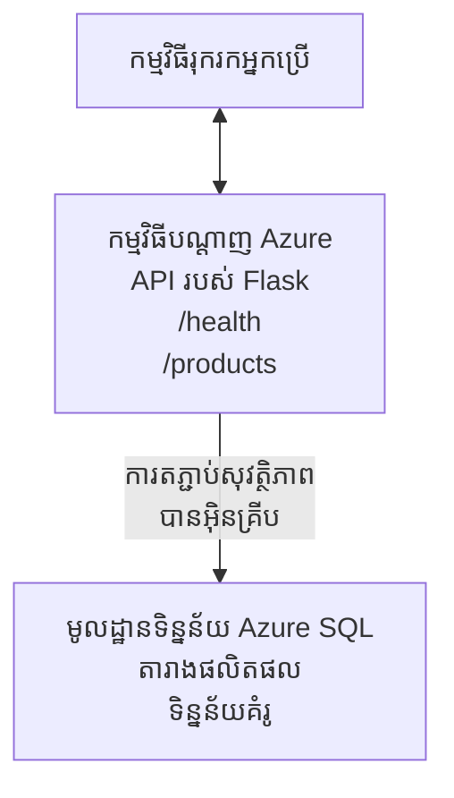

# បញ្ចេញមូលដ្ឋានទិន្នន័យ Microsoft SQL និងកម្មវិធីវេបដោយប្រើ AZD

⏱️ **ពេលហាម៉ាត់ដែលកំណត់**: 20-30 នាទី | 💰 **ថ្លៃប្រាក់ស្មើៗ**: ~$15-25/ខែ | ⭐ **កម្រិតស្មុគស្មាញ**: មធ្យម

ឧទាហរណ៍ **ពេញលេញ និងដំណើរការได้** នេះ បង្ហាញពីរបៀបប្រើ [Azure Developer CLI (azd)](https://learn.microsoft.com/azure/developer/azure-developer-cli/) ដើម្បីបញ្ចេញកម្មវិធី Python Flask សម្រាប់វេប ជាមួយមូលដ្ឋានទិន្នន័យ Microsoft SQL ទៅ Azure។ លទ្ធផលទាំងអស់មានរួច និងបានសាកល្បង—មិនទាមទារអាស្រ័យភាពខាងក្រៅ។

## អ្វីដែលអ្នកនឹងស្គាល់

ដោយបញ្ចប់ឧទាហរណ៍នេះ អ្នកនឹងបាន:
- បញ្ចេញកម្មវិធីពហុស្រទាប់ (web app + database) ដោយប្រើ infrastructure-as-code
- កំណត់ការតភ្ជាប់មូលដ្ឋានទិន្នន័យយ៉ាងសុវត្ថិភាពដោយមិនដាក់សម្ងាត់ក្នុងកូដ
- តាមដានសុខភាពកម្មវិធីជាមួយ Application Insights
- គ្រប់គ្រងធនធាន Azure យ៉ាងមានប្រសិទ្ធភាពជាមួយ AZD CLI
- អាប់ភ្លឺតាមអនុសាសន៍ល្អបំផុតរបស់ Azure សម្រាប់សុវត្ថិភាព ការបន្សំថ្លៃ និងការបង្កើតទេសភាព

## ទិដ្ឋភាពទូទៅនៃសេចក្តីស្ថាន

- **Web App**: Python Flask REST API មានការតភ្ជាប់ទៅម៉ូលដ្ឋានទិន្នន័យ
- **Database**: Azure SQL Database មានទិន្នន័យគំរូ
- **Infrastructure**: Provisioned ដោយ Bicep (ទំព័រម៉ូឌុល អាចប្រើម្ដងទៀត)
- **Deployment**: ដំណើរការជាស្វ័យប្រវត្តិដោយបញ្ចូល `azd` commands
- **Monitoring**: Application Insights សម្រាប់កំណត់ហេតុនិងទេឡេម៉េត្រី

## តម្រូវការមុនចាប់ផ្តើម

### ឧបករណ៍ដែលត្រូវការ

មុនចាប់ផ្តើម សូមផ្ទៀងផ្ទាត់ថាអ្នកមានឧបករណ៍ទាំងនេះដំឡើងរួច:

1. **[Azure CLI](https://learn.microsoft.com/cli/azure/install-azure-cli)** (កំណែ 2.50.0 ឬខ្ពស់ជាងនេះ)
   ```sh
   az --version
   # លទ្ធផលដែលរំពឹងទុក: azure-cli 2.50.0 ឬកំណែខ្ពស់ជាងនេះ
   ```

2. **[Azure Developer CLI (azd)](https://learn.microsoft.com/azure/developer/azure-developer-cli/install-azd)** (កំណែ 1.0.0 ឬខ្ពស់ជាងនេះ)
   ```sh
   azd version
   # លទ្ធផលដែលរំពឹងទុក: azd កំណែ 1.0.0 ឬខ្ពស់ជាង
   ```

3. **[Python 3.8+](https://www.python.org/downloads/)** (សម្រាប់ការអភិវឌ្ឍនៅលើម៉ាស៊ីនស្រុក)
   ```sh
   python --version
   # លទ្ធផលដែលរំពឹងទុក: Python 3.8 ឬខ្ពស់ជាង
   ```

4. **[Docker](https://www.docker.com/get-started)** (ចំណាប់អារម្មណ៍, សម្រាប់ការអភិវឌ្ឍនៅក្នុងកុងតឺនเน័រ)
   ```sh
   docker --version
   # លទ្ធផលដែលរំពឹងទុក: កំណែ Docker 20.10 ឬថ្មីជាង
   ```

### តម្រូវការរបស់ Azure

- មាន **ជាវ Azure** សកម្ម ([create a free account](https://azure.microsoft.com/free/))
- សិទ្ធិច្រើនគ្រប់គ្រងដើម្បីបង្កើតធនធាននៅក្នុងជាវរបស់អ្នក
- តួនាទី **Owner** ឬ **Contributor** លើ subscription ឬ resource group

### ចំណេះដឹងមុនចាប់ផ្តើម

នេះគឺជាឧទាហរណ៍កម្រិត **មធ្យម**។ អ្នកគួរតែស្គាល់:
- ប្រតិបត្តិការមូលដ្ឋានបញ្ជារ
- គំនិតមូលដ្ឋានអំពី cloud (ធនធាន, resource groups)
- ការយល់ដឹងមូលដ្ឋានអំពីកម្មវិធីវេប និងមូលដ្ឋានទិន្នន័យ

**ថ្មីចំពោះ AZD?** ឈានទៅកាន់ [Getting Started guide](../../docs/chapter-01-foundation/azd-basics.md) ជាលើកដំបូង។

## ស្ថាបត្យកម្ម

ឧទាហរណ៍នេះបញ្ចេញស្ថាបត្យកម្មពីរអន្តរជាប់គ្នា មានកម្មវិធីវេប និងមូលដ្ឋានទិន្នន័យ:



**ការបញ្ចេញធនធាន:**
- **Resource Group**: ថង់បំបែកសម្រាប់ធនធានទាំងអស់
- **App Service Plan**: ថាសផ្តល់ជូនលើ Linux (កម្រិត B1 សម្រាប់សន្សំថ្លៃ)
- **Web App**: Python 3.11 runtime ជាមួយកម្មវិធី Flask
- **SQL Server**: ម៉ាស៊ីនមេDB ដែលគ្រប់គ្រង មាន TLS 1.2 យ៉ាងតិច
- **SQL Database**: កម្រិត Basic (2GB, សមស្របសម្រាប់អភិវឌ្ឍន៍/សាកល្បង)
- **Application Insights**: សម្រាប់ការតាមដាន និងកំណត់ហេតុ
- **Log Analytics Workspace**: អាងរក្សាកំណត់ហេតុមួយមជ្ឈមណ្ឌល

**ការប្រៀបធៀប**: គិតថាដូចជាហាងភោជនីយដ្ឋាន (web app) មានទូផ្ទះត្រជាក់ (database)។ អតិថិជនបញ្ជាទិញពីមុខមឺនុយ (API endpoints), ផ្ទះបាយ (Flask app) នាំយកគ្រឿងផ្សំនិងទិន្នន័យពីទូផ្ទះត្រជាក់។ អ្នកគ្រប់គ្រងហាង (Application Insights) តាមដានគ្រប់អ្វីដែលកើតឡើង។

## រចនាសម្ព័ន្ធថតឯកសារ

ឯកសារទាំងអស់បានរួមបញ្ចូលក្នុងឧទាហរណ៍នេះ—មិនទាមទារអាស្រ័យភាពខាងក្រៅ:

```
examples/database-app/
│
├── README.md                    # This file
├── azure.yaml                   # AZD configuration file
├── .env.sample                  # Sample environment variables
├── .gitignore                   # Git ignore patterns
│
├── infra/                       # Infrastructure as Code (Bicep)
│   ├── main.bicep              # Main orchestration template
│   ├── abbreviations.json      # Azure naming conventions
│   └── resources/              # Modular resource templates
│       ├── sql-server.bicep    # SQL Server configuration
│       ├── sql-database.bicep  # Database configuration
│       ├── app-service-plan.bicep  # Hosting plan
│       ├── app-insights.bicep  # Monitoring setup
│       └── web-app.bicep       # Web application
│
└── src/
    └── web/                    # Application source code
        ├── app.py              # Flask REST API
        ├── requirements.txt    # Python dependencies
        └── Dockerfile          # Container definition
```

**ឯកសាររៀងរាល់ឯកសារធ្វើអ្វី:**
- **azure.yaml**: អោយ AZD ដឹងអំពីអ្វីដែលត្រូវបញ្ចេញ និងនៅទីណា
- **infra/main.bicep**: រៀបចំធនធាន Azure ទាំងអស់
- **infra/resources/*.bicep**: និយមន័យធនធានដាច់ផ្សេងៗ (ម៉ូឌុលសម្រាប់ប្រើម្ដងទៀត)
- **src/web/app.py**: កម្មវិធី Flask មានលក្ខណៈលីស៊ីម និងតុល្យភាពមូលដ្ឋានទិន្នន័យ
- **requirements.txt**: លទ្ធផលសាមញ្ញនៃកញ្ចប់ Python
- **Dockerfile**: ណែនាំសម្រាប់ធ្វើ container ដើម្បីបញ្ចេញ

## វិលស្ដាប់ឆាប់ (ជាចំណុចជំហ៊ាន)

### ជំហ៊ាន 1: Clone និង បញ្ជូនទៅថត

```sh
git clone https://github.com/microsoft/AZD-for-beginners.git
cd AZD-for-beginners/examples/database-app
```

**✓ ការត្រួតពិនិត្យជោគជ័យ**: ផ្ទៀងផ្ទាត់ថាអ្នកឃើញ `azure.yaml` និងថត `infra/`:
```sh
ls
# រំពឹងទុក: README.md, azure.yaml, infra/, src/
```

### ជំហ៊ាន 2: Authenticate ជាមួយ Azure

```sh
azd auth login
```

នេះនឹងបើកកម្មវិធីរុករករបស់អ្នកសម្រាប់ការផ្ទៀងផ្ទាត់ Azure។ កត់ឈ្មោះចូលជាមួយគណនី Azure របស់អ្នក។

**✓ ការត្រួតពិនិត្យជោគជ័យ**: អ្នកគួរតែឃើញ:
```
Logged in to Azure.
```

### ជំហ៊ាន 3: ចាប់ផ្តើមបរិយាកាស

```sh
azd init
```

**អ្វីដែលកើតឡើង**: AZD បង្កើតការកំណត់រចនាសម្ព័ន្ធលើម៉ាស៊ីនស្រុកសម្រាប់ការបញ្ចេញរបស់អ្នក។

**ការនឹងលេចឡើងដែលអ្នកនឹងឃើញ**:
- **Environment name**: បញ្ចូលឈ្មោះខ្លី (ឧ. `dev`, `myapp`)
- **Azure subscription**: ជ្រើសជាវរបស់អ្នកពីបញ្ជី
- **Azure location**: ជ្រើសតំបន់មួយ (ឧ. `eastus`, `westeurope`)

**✓ ការត្រួតពិនិត្យជោគជ័យ**: អ្នកគួរតែឃើញ:
```
SUCCESS: New project initialized!
```

### ជំហ៊ាន 4: ប្រគល់ធនធាន Azure

```sh
azd provision
```

**អ្វីដែលកើតឡើង**: AZD បញ្ចេញរចនាសម្ព័ន្ធទាំងអស់ (ចំណាយរយៈពេល 5-8 នាទី):
1. បង្កើត resource group
2. បង្កើត SQL Server និង Database
3. បង្កើត App Service Plan
4. បង្កើត Web App
5. បង្កើត Application Insights
6. កំណត់បណ្តាញ និងសុវត្ថិភាព

**អ្នកនឹងត្រូវបានស្នើសុំសម្រាប់**:
- **SQL admin username**: បញ្ចូលឈ្មោះអ្នកប្រើ (ឧ. `sqladmin`)
- **SQL admin password**: បញ្ចូលពាក្យសម្ងាត់ស៊ាំមាំ (រក្សាទុកវាទុក!)

**✓ ការត្រួតពិនិត្យជោគជ័យ**: អ្នកគួរតែឃើញ:
```
SUCCESS: Your application was provisioned in Azure in X minutes Y seconds.
You can view the resources created under the resource group rg-<env-name> in Azure Portal:
https://portal.azure.com/#@/resource/subscriptions/.../resourceGroups/rg-<env-name>
```

**⏱️ ពេលវេលា**: 5-8 នាទី

### ជំហ៊ាន 5: បញ្ចេញកម្មវិធី

```sh
azd deploy
```

**អ្វីដែលកើតឡើង**: AZD សង់ និងបញ្ចេញកម្មវិធី Flask របស់អ្នក:
1. ដាក់កញ្ចប់កម្មវិធី Python
2. សង់ Docker container
3. ជូនទៅ Azure Web App
4. ចាប់ផ្តើមមូលដ្ឋានទិន្នន័យដោយទិន្នន័យគំរូ
5. ដំណើរការកម្មវិធី

**✓ ការត្រួតពិនិត្យជោគជ័យ**: អ្នកគួរតែឃើញ:
```
SUCCESS: Your application was deployed to Azure in X minutes Y seconds.
You can view the resources created under the resource group rg-<env-name> in Azure Portal:
https://portal.azure.com/#@/resource/subscriptions/.../resourceGroups/rg-<env-name>
```

**⏱️ ពេលវេលា**: 3-5 នាទី

### ជំហ៊ាន 6: ត្រៀមកម្មវិធីក្នុងកម្មវិធីរុករក

```sh
azd browse
```

នេះនឹងបើកកម្មវិធីវេបដែលបានបញ្ចេញរបស់អ្នកនៅក្នុងរុករក ក្នុង `https://app-<unique-id>.azurewebsites.net`

**✓ ការត្រួតពិនិត្យជោគជ័យ**: អ្នកគួរតែឃើញ JSON output:
```json
{
  "message": "Welcome to the Database App API",
  "endpoints": {
    "/": "This help message",
    "/health": "Health check endpoint",
    "/products": "List all products",
    "/products/<id>": "Get product by ID"
  }
}
```

### ជំហ៊ាន 7: សាកល្បង API Endpoints

**Health Check** (ផ្ទៀងផ្ទាត់ការតភ្ជាប់ទៅមូលដ្ឋានទិន្នន័យ):
```sh
curl https://app-<your-id>.azurewebsites.net/health
```

**ការឆ្លើយតបដែលរំពឹងទុក**:
```json
{
  "status": "healthy",
  "database": "connected"
}
```

**បញ្ជីផលិតផល** (ទិន្នន័យគំរូ):
```sh
curl https://app-<your-id>.azurewebsites.net/products
```

**ការឆ្លើយតបដែលរំពឹងទុក**:
```json
[
  {
    "id": 1,
    "name": "Laptop",
    "description": "High-performance laptop",
    "price": 1299.99,
    "created_at": "2025-11-19T10:30:00"
  },
  ...
]
```

**ទទួលបានផលិតផលតែមួយ**:
```sh
curl https://app-<your-id>.azurewebsites.net/products/1
```

**✓ ការត្រួតពិនិត្យជោគជ័យ**: Endpoint ទាំងអស់ត្រូវតែផ្តល់ JSON ដោយគ្មានកំហុស។

---

**🎉 សូមអបអរសាទរ!** អ្នកបានបញ្ចេញកម្មវិធីវេបជាមួយមូលដ្ឋានទិន្នន័យទៅ Azure ដោយប្រើ AZD បានសម្រេច។

## ការពិភាក្សាពីកំណត់រចនាសម្ព័ន្ធ

### បរិវេណអថេរ

អាថ៌កំបាំងត្រូវបានគ្រប់គ្រងយ៉ាងសុវត្ថិភាពតាមរយៈការកំណត់ App Service របស់ Azure—**មិនដែលដាក់សម្ងាត់ក្នុងកូដដើម**។

**បានកំណត់ដោយស្វ័យប្រវ័ត្ដដោយ AZD**:
- `SQL_CONNECTION_STRING`: កូខ្សែការតភ្ជាប់ទៅមូលដ្ឋានទិន្នន័យដែលមានសម្ងាត់បានเข้ mã
- `APPLICATIONINSIGHTS_CONNECTION_STRING`: ចំណុចទទួលទេឡេម៉េត្រីសម្រាប់ការតាមដាន
- `SCM_DO_BUILD_DURING_DEPLOYMENT`: បើកការដំឡើងពាក្យបណ្ណាចញ្ចួលដោយស្វ័យប្រវត្តិ

**កន្លែងដែលអាថ៌កំបាំងត្រូវបានរក្សាទុក**:
1. ក្នុងពេល `azd provision`, អ្នកផ្តល់អត្តសញ្ញាណ SQL តាមការស្នើសុំសុវត្ថិភាព
2. AZD រក្សាអ្នកនៅក្នុងឯកសារ `.azure/<env-name>/.env` លើម៉ាស៊ីនស្រុក (ច្រានចោលក្នុង Git)
3. AZD ចាក់បញ្ចូលវាទៅក្នុងការកំណត់ Azure App Service (បង្ហាប់នៅស្ថិតនៅក្នុងស្ថានភាពឃ្លាំ)
4. កម្មវិធីអានវាតាម `os.getenv()` នៅពេលរត់

### ការអភិវឌ្ឍនៅលើម៉ាស៊ីនស្រុក

សម្រាប់ការប្រឡងក្នុងស្រុក បង្កើតឯកសារ `.env` ពីគំរូ:

```sh
cp .env.sample .env
# កែសម្រួល​ឯកសារ .env ដើម្បីកំណត់ព័ត៌មានតភ្ជាប់ទៅមូលដ្ឋានទិន្នន័យក្នុងស្រុករបស់អ្នក
```

**សេចក្តីអនុវត្តការអភិវឌ្ឍក្នុងស្រុក**:
```sh
# ដំឡើងការពឹងផ្អែក
cd src/web
pip install -r requirements.txt

# កំណត់អថេរបរិស្ថាន
export SQL_CONNECTION_STRING="your-local-connection-string"

# រត់កម្មវិធី
python app.py
```

**សាកល្បងនៅលើម៉ាស៊ីនស្រុក**:
```sh
curl http://localhost:8000/health
# រំពឹង: {"ស្ថានភាព": "មានសុខភាពល្អ", "មូលដ្ឋានទិន្នន័យ": "បានភ្ជាប់"}
```

### Infrastructure-as-Code

ធនធាន Azure ទាំងអស់បានកំណត់ក្នុង **Bicep templates** (`infra/` folder):

- **រចនាសម្ព័ន្ធម៉ូឌុល**: ប្រភេទធនធាននីមួយៗមានឯកសារផ្ទាល់ខ្លួនសម្រាប់អាចប្រើម្ដងទៀត
- **មានប៉ារ៉ាម៉ែត្រ**: អ្នកអាចប្ដូរទំហំ SKU, តំបន់, និងបទបញ្ជារិននាម
- **អនុភាពល្អបំផុត**: ស្របតាមស្តង់ដារ naming និងលំនាំសុវត្ថិភាពរបស់ Azure
- **គ្រប់គ្រងជាមួយ Git**: ការផ្លាស់ប្តូររចនាសម្ព័ន្ធត្រូវបានតាមដាននៅក្នុង Git

**ឧទាហរណ៍ប្ដូរ**:
ដើម្បីប្ដូរទំរង់កម្រិតមូលដ្ឋានទិន្នន័យ សូមកែ `infra/resources/sql-database.bicep`:
```bicep
sku: {
  name: 'Standard'  // Changed from 'Basic'
  tier: 'Standard'
  capacity: 10
}
```

## សន្តិសុខអនុវត្តល្អបំផុត

ឧទាហរណ៍នេះអនុវត្តន៍តាមអនុសាសន៍សន្តិសុខល្អបំផុតរបស់ Azure:

### 1. **គ្មានអាថ៌កំបាំងក្នុងកូដដើម**
- ✅ អត្តសញ្ញាណបានរក្សាទុកក្នុងការកំណត់ Azure App Service (បានបង្ហាប់)
- ✅ ឯកសារ `.env` បានដកចេញពី Git តាម `.gitignore`
- ✅ អាថ៌កំបាំងឆ្លងកាត់ប៉ារ៉ាម៉ែត្រសុវត្ថិភាពក្នុងពេល provision

### 2. **ការតភ្ជាប់បានស្គាល់**
- ✅ TLS 1.2 យ៉ាងតិច សម្រាប់ SQL Server
- ✅ ការប្រើ HTTPS រួមតែប៉ុណ្ណោះសម្រាប់ Web App
- ✅ ការតភ្ជាប់ទៅមូលដ្ឋានទិន្នន័យប្រើបណ្តាញដែលបានបង្ហាប់

### 3. **សន្តិសុខបណ្តាញ**
- ✅ កុងហ្វីកនៃ firewall របស់ SQL Server អនុញ្ញាតសេវាកម្ម Azure តែប៉ុណ្ណោះ
- ✅ ការចូលប្រព័ន្ធសាធារណៈត្រូវបានកំណត់ (អាចត្រូវបានឃាបខ្លួនបន្ថែមជាមួយ Private Endpoints)
- ✅ FTPS បានបិទលើ Web App

### 4. **ការផ្ទៀងផ្ទាត់និងសមត្ថភាពអនុញ្ញាតិ**
- ⚠️ **បច្ចុប្បន្ន**: SQL authentication (username/password)
- ✅ **ផែនការដើម្បីផលិតកម្ម**: ប្រើ Azure Managed Identity សម្រាប់ការផ្ទៀងផ្ទាត់ដោយគ្មានពាក្យសម្ងាត់

**ដើម្បីធ្វើអាប់ក្រេសទៅ Managed Identity** (សម្រាប់ផលិតកម្ម):
1. បើក managed identity លើ Web App
2. ផ្តល់សិទ្ធិ SQL ឲ្យ identity
3. ប្ដូរខ្សែការតភ្ជាប់ទៅប្រើ managed identity
4. ដកការផ្ទៀងផ្ទាត់ដោយពាក្យសម្ងាត់ចេញ

### 5. **ការត្រួតពិនិត្យ និងអនុលោម**
- ✅ Application Insights ធ្វើកំណត់ហេតុនិងកំហុសទាំងអស់
- ✅ SQL Database auditing បានបើក (អាចកំណត់សម្រាប់ការអនុលោម)
- ✅ ធនធានទាំងអស់មាន tag សម្រាប់ការគ្រប់គ្រង

**បញ្ជីត្រួតពិនិត្យសន្តិសុខ មុនផលិតកម្ម**:
- [ ] បើក Azure Defender សម្រាប់ SQL
- [ ] កុងហ្វីក Private Endpoints សម្រាប់ SQL Database
- [ ] បើក Web Application Firewall (WAF)
- [ ] អនុវត្ត Azure Key Vault សម្រាប់ការប្ដូរអាថ៌កំបាំង
- [ ] កុងហ្វីក Microsoft Entra ID សម្រាប់ការផ្ទៀងផ្ទាត់
- [ ] បើក diagnostic logging សម្រាប់ធនធានទាំងអស់

## ការបន្សំថ្លៃ

**ការវាយប្រមាណថ្លៃប្រចាំខែ** (ត្រឹមខែវិទ្យុវិទ្យា 2025):

| Resource | SKU/Tier | Estimated Cost |
|----------|----------|----------------|
| App Service Plan | B1 (Basic) | ~$13/month |
| SQL Database | Basic (2GB) | ~$5/month |
| Application Insights | Pay-as-you-go | ~$2/month (low traffic) |
| **Total** | | **~$20/month** |

**💡 យុទ្ធសាស្ត្រសន្សំថ្លៃ**:

1. **ប្រើកម្រិតឥតគិតថ្លៃសម្រាប់ការសិក្សា**:
   - App Service: F1 tier (ឥតគិតថ្លៃ, ម៉ោងកំណត់)
   - SQL Database: ប្រើ Azure SQL Database serverless
   - Application Insights: 5GB/ខែ ingest ឥតគិតថ្លៃ

2. **បញ្ឈប់ធនធានពេលមិនប្រើ**:
   ```sh
   # បិទកម្មវិធីវេប (មូលដ្ឋានទិន្នន័យនៅតែគិតថ្លៃ)
   az webapp stop --name <app-name> --resource-group <rg-name>
   
   # ចាប់ផ្តើមឡើងវិញពេលចាំបាច់
   az webapp start --name <app-name> --resource-group <rg-name>
   ```

3. **លុបអ្វីគ្រប់យ៉ាងបន្ទាប់ពីសាកល្បង**:
   ```sh
   azd down
   ```
   នេះនឹងលុបធនធានទាំងអស់ និងបញ្ឈប់ការទូទាត់ថ្លៃ។

4. **SKU សម្រាប់អភិវឌ្ឍន៍ និងផលិតកម្ម**:
   - **អភិវឌ្ឍន៍**: កម្រិត Basic (បានប្រើក្នុងឧទាហរណ៍នេះ)
   - **ផលិតកម្ម**: កម្រិត Standard/Premium ជាមួយភាព redundant

**ការតាមដានថ្លៃ**:
- មើលថ្លៃនៅ [Azure Cost Management](https://portal.azure.com/#view/Microsoft_Azure_CostManagement)
- កំណត់ការជូនដំណឹងថ្លៃដើម្បីជៀសវាងការភ្ញាក់ផ្អើល
- តាក់ធនធានទាំងអស់ជាមួយ `azd-env-name` សម្រាប់ការតាមដាន

**ជម្រើសកម្រិតឥតគិតថ្លៃ**:
សម្រាប់គោលបំណងសិក្សា អ្នកអាចកែ `infra/resources/app-service-plan.bicep`:
```bicep
sku: {
  name: 'F1'  // Free tier
  tier: 'Free'
}
```
**កំណត់ចំណាំ**: កម្រិតឥតគិតថ្លៃមានកំណោយ (60 នាទី/ថ្ងៃ CPU, មិនមាន always-on)។

## ការតាមដាន និងសមត្ថភាពធ្វើដឹង

### សមាកម្ម Application Insights

ឧទាហរណ៍នេះរួមបញ្ចូល **Application Insights** សម្រាប់ការតាមដានប្រកបដោយមាតិកា:

**អ្វីដែលត្រូវតាមដាន**:
- ✅ សំណើ HTTP (latency, status codes, endpoints)
- ✅ កំហុស និង exceptions របស់កម្មវិធី
- ✅ កំណត់ហេតុផ្ទាល់ខ្លួនពី Flask app
- ✅ សុខភាពការតភ្ជាប់ទៅមូលដ្ឋានទិន្នន័យ
- ✅ ម៉េត្រសមត្ថភាព (CPU, memory)

**ចូលទៅកាន់ Application Insights**:
1. បើក [Azure Portal](https://portal.azure.com)
2. ទៅកាន់ resource group របស់អ្នក (`rg-<env-name>`)
3. ចុចលើធនធាន Application Insights (`appi-<unique-id>`)

**ច QUERY ដែលមានប្រយោជន៍** (Application Insights → Logs):

**មើលសំណើទាំងអស់**:
```kusto
requests
| where timestamp > ago(1h)
| order by timestamp desc
| project timestamp, name, url, resultCode, duration
```

**រកកំហុស**:
```kusto
exceptions
| where timestamp > ago(24h)
| order by timestamp desc
| project timestamp, type, outerMessage, operation_Name
```

**ពិនិត្យ Endpoint សុខភាព**:
```kusto
requests
| where name contains "health"
| summarize count() by resultCode, bin(timestamp, 1h)
```

### ការចងចាំ auditing របស់ SQL Database

**SQL Database auditing បានបើក** ដើម្បីតាមដាន:
- លំនាំការចូលប្រើមូលដ្ឋានទិន្នន័យ
- ភាពរំលងចូលដែលសំរាប់មិនជោគជ័យ
- ការផ្លាស់ប្តូរ schema
- ការចូលប្រើទិន្នន័យ (សម្រាប់អនុលោម)

**ចូលទៅកាន់កំណត់ហេតុ Audit**:
1. Azure Portal → SQL Database → Auditing
2. មើលកំណត់ហេតុនៅ Log Analytics workspace

### ការតាមដានពេលជាក់ស្តែង

**មើលម៉ែត្រប្រ LIVE**:
1. Application Insights → Live Metrics
2. មើលសំណើ បរាជ័យ និងសមត្ថភាពក្នុងពេលជាក់ស្តែង

**ចាប់ផ្តើមការជូនដំណឹង**:
បង្កើតការជូនដំណឹងសម្រាប់ព្រឹត្តិការណ៍សំខាន់ៗ:
- HTTP 500 errors > 5 ក្នុង 5 នាទី
- ភាពបរាជ័យក្នុងការតភ្ជាប់មូលដ្ឋានទិន្នន័យ
- ពេលប្រតិបត្តិការកើនខ្ពស់ (>2 វិនាទី)

**ឧទាហរណ៍ការបង្កើតការជូនដំណឹង**:
```sh
az monitor metrics alert create \
  --name "High-Response-Time" \
  --resource-group <rg-name> \
  --scopes <app-insights-resource-id> \
  --condition "avg requests/duration > 2000" \
  --description "Alert when response time exceeds 2 seconds"
```

## ការដោះស្រាយបញ្ហា
### បញ្ហាធម្មតា និង ដំណោះស្រាយ

#### 1. `azd provision` បរាជ័យ ដោយ "Location not available"

**រោគសញ្ញា**:
```
Error: The subscription is not registered for the resource type 'components' in the location 'centralus'.
```

**ដំណោះស្រាយ**:
ជ្រើសតំបន់ Azure ផ្សេង ឬ ចុះបញ្ជី resource provider:
```sh
az provider register --namespace Microsoft.Insights
```

#### 2. ការតភ្ជាប់ SQL បរាជ័យ ក្នុងពេលដាក់ឲ្យដំណើការ

**រោគសញ្ញា**:
```
pyodbc.OperationalError: ('08001', '[08001] [Microsoft][ODBC Driver 18 for SQL Server]TCP Provider...')
```

**ដំណោះស្រាយ**:
- ផ្ទៀងផ្ទាត់ថា firewall របស់ SQL Server អនុញ្ញាតឱ្យសេវាកម្ម Azure (ត្រូវបានកំណត់ដោយស្វ័យប្រវត្តិ)
- ពិនិត្យពាក្យសម្ងាត់ admin SQL ត្រូវបានបញ្ចូលត្រឹមត្រូវក្នុងពេល `azd provision`
- ប្រាកដថា SQL Server ត្រូវបាន provision ទូលំទូលាយ (អាចចំណាយ 2-3 នាទី)

**ផ្ទៀងផ្ទាត់ការតភ្ជាប់**:
```sh
# ពី Azure Portal ទៅកាន់ SQL Database → កម្មវិធីកែសម្រួលសំណួរ
# ព្យាយាមភ្ជាប់ដោយប្រើព័ត៌មានសម្គាល់ចូលរបស់អ្នក
```

#### 3. Web App បង្ហាញ "Application Error"

**រោគសញ្ញា**:
រុករកបង្ហាញទំព័រកំហុសទូទៅ។

**ដំណោះស្រាយ**:
ពិនិត្យកំណត់ហេតុកម្មវិធី:
```sh
# មើលកំណត់ហេតុថ្មីៗ
az webapp log tail --name <app-name> --resource-group <rg-name>
```

**មូលហេតុធម្មតា**:
- ខ្វះអថេរបរិស្ថាន (ពិនិត្យ App Service → Configuration)
- ការតំឡើង package Python បរាជ័យ (ពិនិត្យកំណត់ហេតុនៃការដាក់ប្រើ)
- កំហុសការចាប់ផ្តើមប្រព័ន្ធទិន្នន័យ (ពិនិត្យការតភ្ជាប់ SQL)

#### 4. `azd deploy` បរាជ័យ ដោយ "Build Error"

**រោគសញ្ញា**:
```
Error: Failed to build project
```

**ដំណោះស្រាយ**:
- ប្រាកដថា `requirements.txt` មិនមានកំហុសវេយ្យាករណ៍
- ពិនិត្យថា Python 3.11 ត្រូវបានបញ្ជាក់ក្នុង `infra/resources/web-app.bicep`
- ផ្ទៀងផ្ទាត់ថា Dockerfile មាន base image ត្រឹមត្រូវ

**ដោះស្រាយក្នុងកុំព្យូទ័រមូលដ្ឋាន**:
```sh
cd src/web
docker build -t test-app .
docker run -p 8000:8000 test-app
```

#### 5. "Unauthorized" ពេលរត់បញ្ជា AZD

**រោគសញ្ញា**:
```
ERROR: (Unauthorized) The client '<id>' with object id '<id>' does not have authorization
```

**ដំណោះស្រាយ**:
ចូលឡើងវិញជាមួយ Azure:
```sh
# ចាំបាច់សម្រាប់ដំណើរការ AZD
azd auth login

# ជាជម្រើស ប្រសិនបើអ្នកក៏ប្រើពាក្យបញ្ជា Azure CLI ដោយផ្ទាល់
az login
```

ផ្ទៀងផ្ទាត់ថាអ្នកមានសិទ្ធិត្រឹមត្រូវ (តួនាទី Contributor) លើ subscription។

#### 6. ការចំណាយឧបករណ៍ទិន្នន័យខ្ពស់

**រោគសញ្ញា**:
វិក័យប័ត្រ Azure មិនរំពឹងទុក។

**ដំណោះស្រាយ**:
- ពិនិត្យមើលថាតើអ្នកភ្លេចរត់ `azd down` បន្ទាប់ពីសាកល្បង
- ផ្ទៀងផ្ទាត់ថា SQL Database កំពុងប្រើ tier Basic (មិនមែន Premium)
- ពិនិត្យចំណាយនៅក្នុង Azure Cost Management
- កំណត់ការជូនដំណឹងចំពោះចំណាយ

### សុំជំនួយ

**មើលអថេរបរិស្ថាន AZD ទាំងអស់**:
```sh
azd env get-values
```

**ពិនិត្យស្ថានភាពដាក់ប្រើ**:
```sh
az webapp show --name <app-name> --resource-group <rg-name> --query state
```

**ចូលកំណត់ហេតុកម្មវិធី**:
```sh
az webapp log download --name <app-name> --resource-group <rg-name> --log-file app-logs.zip
```

**ត្រូវការជំនួយបន្ថែម?**
- [មគ្គុទេសក៍ដោះស្រាយបញ្ហា AZD](../../docs/chapter-07-troubleshooting/common-issues.md)
- [ការដោះស្រាយបញ្ហា Azure App Service](https://learn.microsoft.com/azure/app-service/troubleshoot-diagnostic-logs)
- [ការដោះស្រាយបញ្ហា Azure SQL](https://learn.microsoft.com/azure/azure-sql/database/troubleshoot-common-errors-issues)

## លំហាត់អនុវត្ត

### លំហាត់ 1: ផ្ទៀងផ្ទាត់ការដាក់ប្រើរបស់អ្នក (ចាប់ផ្ដើម)

**គោលដៅ**: បញ្ជាក់ថាធនធានទាំងអស់បានដាក់ប្រើ និងកម្មវិធីដំណើរការ។

**ជំហាន**:
1. រាយបញ្ជីធនធានទាំងអស់នៅក្នុងក្រុមធនធានរបស់អ្នក:
   ```sh
   az resource list --resource-group rg-<env-name> --output table
   ```
   **រំពឹងទុក**: 6-7 ធនធាន (Web App, SQL Server, SQL Database, App Service Plan, Application Insights, Log Analytics)

2. សាកល្បងចំណុចចូល API ទាំងអស់:
   ```sh
   curl https://app-<your-id>.azurewebsites.net/
   curl https://app-<your-id>.azurewebsites.net/health
   curl https://app-<your-id>.azurewebsites.net/products
   curl https://app-<your-id>.azurewebsites.net/products/1
   ```
   **រំពឹងទុក**: ទាំងអស់បញ្ជូន JSON ត្រឹមត្រូវដោយគ្មានកំហុស

3. ពិនិត្យ Application Insights:
   - ចូលទៅកាន់ Application Insights ក្នុង Azure Portal
   - ទៅកាន់ "Live Metrics"
   - បញ្ច刷新(Refresh) រុករករបស់អ្នកលើ web app
   **រំពឹងទុក**: ឃើញ request កើតឡើងក្នុងពេលពិត

**លក្ខខណ្ឌជោគជ័យ**: មានធនធាន 6-7 ធនធាន សេចក្តីទាំងអស់បញ្ជូនទិន្នន៍ និង Live Metrics បង្ហាញសកម្មភាព។

---

### លំហាត់ 2: បន្ថែមចំណុចចូល API ថ្មី (មធ្យម)

**គោលដៅ**: ពង្រឹងកម្មវិធី Flask ដោយបន្ថែមចំណុចចូលថ្មីមួយ។

**កូដចាប់ផ្ដើម**: ចំណុចចូលបច្ចុប្បន្ននៅក្នុង `src/web/app.py`

**ជំហាន**:
1. កែសម្រួល `src/web/app.py` និងបន្ថែមចំណុចចូលថ្មីក្រោយមុខងារ `get_product()`:
   ```python
   @app.route('/products/search/<keyword>')
   def search_products(keyword):
       """Search products by name or description."""
       try:
           conn = get_db_connection()
           cursor = conn.cursor()
           cursor.execute(
               "SELECT id, name, description, price, created_at FROM products WHERE name LIKE ? OR description LIKE ?",
               (f'%{keyword}%', f'%{keyword}%')
           )
           
           products = []
           for row in cursor.fetchall():
               products.append({
                   'id': row[0],
                   'name': row[1],
                   'description': row[2],
                   'price': float(row[3]) if row[3] else None,
                   'created_at': row[4].isoformat() if row[4] else None
               })
           
           cursor.close()
           conn.close()
           
           logger.info(f"Search for '{keyword}' returned {len(products)} results")
           return jsonify(products), 200
           
       except Exception as e:
           logger.error(f"Error searching products: {str(e)}")
           return jsonify({'error': str(e)}), 500
   ```

2. ដាក់ឲ្យដំណើរការកម្មវិធីដែលបានបន្ថែម:
   ```sh
   azd deploy
   ```

3. សាកល្បងចំណុចចូលថ្មី:
   ```sh
   curl https://app-<your-id>.azurewebsites.net/products/search/laptop
   ```
   **រំពឹងទុក**: ត្រឡប់ផលិតផលដែលសមនឹង "laptop"

**លក្ខខណ្ឌជោគជ័យ**: ចំណុចចូលថ្មីដំណើរការ ត្រឡប់លទ្ធផលដែលត្រូវបានចម្រាញ់ ហើយបង្ហាញក្នុងកំណត់ហេតុ Application Insights។

---

### លំហាត់ 3: បន្ថែមការត្រួតពិនិត្យ និងការជូនដំណឹង (កម្រិតខ្ពស់)

**គោលដៅ**: កំណត់ការត្រួតពិនិត្យប្រកបដោយប្រយ័ត្ន ជាមួយនឹងការជូនដំណឹង។

**ជំហាន**:
1. បង្កើត alert សម្រាប់កំហុស HTTP 500:
   ```sh
   # ទទួលបានលេខសម្គាល់ធនធានរបស់ Application Insights
   AI_ID=$(az monitor app-insights component show \
     --app appi-<your-id> \
     --resource-group rg-<env-name> \
     --query id -o tsv)
   
   # បង្កើតការព្រមាន
   az monitor metrics alert create \
     --name "High-Error-Rate" \
     --resource-group rg-<env-name> \
     --scopes $AI_ID \
     --condition "count requests/failed > 5" \
     --window-size 5m \
     --evaluation-frequency 1m \
     --description "Alert when >5 failed requests in 5 minutes"
   ```

2. បង្ករឲ្យ alert ដំណើរការ ដោយបង្កកំហុស:
   ```sh
   # ស្នើសុំផលិតផលដែលមិនមាន
   for i in {1..10}; do curl https://app-<your-id>.azurewebsites.net/products/999; done
   ```

3. ពិនិត្យថា alert បានផ្គត់ផ្គង់៖
   - Azure Portal → Alerts → Alert Rules
   - ពិនិត្យអ៊ីមែលរបស់អ្នក (បើបានកំណត់)

**លក្ខខណ្ឌជោគជ័យ**: ការកំណត់ rule alert ត្រូវបានបង្កើត ដំណើរការលើកំហុស និងទទួលបានសេចក្តីជូនដំណឹង។

---

### លំហាត់ 4: ការផ្លាស់ប្តូររចនាសម្ព័ន្ធ Database (កម្រិតខ្ពស់)

**គោលដៅ**: បន្ថែមតារាងថ្មី និងកែប្រែកម្មវិធីឲ្យប្រើវា។

**ជំហាន**:
1. តភ្ជាប់ទៅ SQL Database តាមរយៈ Azure Portal Query Editor

2. បង្កើតតារាង `categories` ថ្មី:
   ```sql
   CREATE TABLE categories (
       id INT PRIMARY KEY IDENTITY(1,1),
       name NVARCHAR(50) NOT NULL,
       description NVARCHAR(200)
   );
   
   INSERT INTO categories (name, description) VALUES
   ('Electronics', 'Electronic devices and accessories'),
   ('Office Supplies', 'Office equipment and supplies');
   
   -- Add category to products table
   ALTER TABLE products ADD category_id INT;
   UPDATE products SET category_id = 1; -- Set all to Electronics
   ```

3. បន្ថែមព័ត៌មាន category ទៅក្នុង `src/web/app.py` ក្នុងការឆ្លើយតប

4. ដាក់ពង្រីក និងសាកល្បង

**លក្ខខណ្ឌជោគជ័យ**: មានតារាងថ្មី ผลិតផលបង្ហាញព័ត៌មាន category និងកម្មវិធីនៅស្ថានភាពដំណើរការ។

---

### លំហាត់ 5: អនុវត្ត Caching (ជំនាញខ្ពស់)

**គោលដៅ**: បន្ថែម Azure Redis Cache ដើម្បីបង្កើនល្បឿន។

**ជំហាន**:
1. បន្ថែម Redis Cache ទៅ `infra/main.bicep`
2. កែសម្រួល `src/web/app.py` ដើម្បី cache ការស្វែងរកផលិតផល
3. វិភាគកំណត់តម្លៃប្រសិទ្ធភាពជាមួយ Application Insights
4. ប្រៀបធៀបទំនេីបទម្លើងមុន/បន្ទាប់ caching

**លក្ខខណ្ឌជោគជ័យ**: Redis ត្រូវបានដាក់ពង្រីក, caching ធ្វើការ និងពេលឆ្លើយតបបន្ថយចុះ >50%។

**កំណត់សម្គាល់**: ចាប់ផ្ដើមជាមួយ [Azure Cache for Redis documentation](https://learn.microsoft.com/azure/azure-cache-for-redis/)។

---

## ការលុបចោល

ដើម្បីជៀសវាងការបង់ប្រាក់បន្ត សូមលុបទៅលើធនធានទាំងអស់បន្ទាប់ពីបញ្ចប់៖

```sh
azd down
```

**សំណួរបញ្ជាក់**:
```
? Total resources to delete: 7, are you sure you want to continue? (y/N)
```

វាយ `y` ដើម្បីបញ្ជាក់។

**✓ ការផ្ទៀងផ្ទាត់ជោគជ័យ**: 
- ធនធានទាំងអស់ត្រូវបានលុបចេញពី Azure Portal
- គ្មានការបង់ប្រាក់បន្ត
- ដ៏ថតផ្ទាំង `.azure/<env-name>` ទៅក្នុងម៉ាស៊ីននៅក្នុងស្រុកអាចលុបបាន

**ជម្រុញជាជម្រើស** (រក្សា infrastructure, លុបទិន្នន័យ):
```sh
# លុបតែក្រុមធនធាន (រក្សាទុកកំណត់រចនាសម្ព័ន្ធ AZD)
az group delete --name rg-<env-name> --yes
```
## យល់ដឹងបន្ថែម

### ឯកសារដែលទាក់ទង
- [Azure Developer CLI Documentation](https://learn.microsoft.com/azure/developer/azure-developer-cli/)
- [Azure SQL Database Documentation](https://learn.microsoft.com/azure/azure-sql/database/)
- [Azure App Service Documentation](https://learn.microsoft.com/azure/app-service/)
- [Application Insights Documentation](https://learn.microsoft.com/azure/azure-monitor/app/app-insights-overview)
- [Bicep Language Reference](https://learn.microsoft.com/azure/azure-resource-manager/bicep/)

### ជំហានបន្ទាប់ក្នុងវគ្គនេះ
- **[Container Apps Example](../../../../examples/container-app)**: ដាក់ microservices ជាមួយ Azure Container Apps
- **[AI Integration Guide](../../../../docs/ai-foundry)**: បន្ថែមសមត្ថភាព AI ទៅក្នុងកម្មវិធីរបស់អ្នក
- **[Deployment Best Practices](../../docs/chapter-04-infrastructure/deployment-guide.md)**: លំនាំល្អសម្រាប់ដាក់ប្រើក្នុងកម្មវិធីផលិតកម្ម

### ប្រធានបទកម្រិតខ្ពស់
- **Managed Identity**: ដកពាក្យសម្ងាត់ចេញ ហើយប្រើការផ្ទៀងផ្ទាត់ Microsoft Entra ID
- **Private Endpoints**: សុវត្ថិភាពការតភ្ជាប់ฐานទិន្នន័យក្នុងشبិកvirtual network
- **CI/CD Integration**: ធ្វើឲ្យដាក់ប្រើស្វ័យវរាមជាមួយ GitHub Actions ឬ Azure DevOps
- **Multi-Environment**: កំណត់ dev, staging, និង production environments
- **Database Migrations**: ប្រើ Alembic ឬ Entity Framework សម្រាប់ versioning រចនាសម្ព័ន្ធ

### ការប្រៀបធៀបជាមួយវិធីសាស្ត្រផ្សេងៗ

**AZD ទល់ស្នាម ARM Templates**:
- ✅ AZD: abstraction កម្រិតខ្ពស់, ពាក្យបញ្ជាសម្រួល
- ⚠️ ARM: អក្ខរកម្មវែង, គ្រប់គ្រងលម្អិត

**AZD ទល់ស្នាម Terraform**:
- ✅ AZD: ប្រព័ន្ធ Azure-native, ប្រតិបត្តិសហការជាមួយសេវាកម្ម Azure
- ⚠️ Terraform: គាំទ្រមេឌៀច្រើន, មានអ៊ុយ ecosystem ធំបំផុត

**AZD ទល់ស្នាម Azure Portal**:
- ✅ AZD: អាចធ្វើឡើងសារឡើងវិញ, version-controlled, អាចអូតូម៉ាទ័រ
- ⚠️ Portal: ការចុចដោយដៃ, ពិបាកកើតឡើងឡើងវិញ

**គិតថា AZD គឺ**: Docker Compose សម្រាប់ Azure—ការកំណត់ដែលសាមញ្ញសម្រាប់ការដាក់ប្រើស្មុគស្មាញ។

---

## សំណួរដែលសួរញឹកញាប់

**Q: តើខ្ញុំអាចប្រើភាសាកម្មវិធីផ្សេងបានទេ?**  
A: បាន! ប្ដូរ `src/web/` ជា Node.js, C#, Go, ឬភាសាណាមួយដែលអ្នកចង់បាន។ បន្ទាប់មកធ្វើបច្ចុប្បន្នភាព `azure.yaml` និង Bicep តាមគន្លង។

**Q: តើធ្វើដូចម្តេចដើម្បីបន្ថែមប្រព័ន្ធទិន្នន័យបន្ថែម?**  
A: បន្ថែម module SQL Database មួយទៀតក្នុង `infra/main.bicep` ឬប្រើ PostgreSQL/MySQL ពីសេវាកម្ម Azure Database ។

**Q: តើខ្ញុំអាចប្រើនេះសម្រាប់ផលិតកម្មបានទេ?**  
A: នេះជាចំណុចចាប់ផ្តើម។ សម្រាប់ផលិតកម្ម សូមបន្ថែម៖ managed identity, private endpoints, redundancy, ទាន់ស្ដាប់ backup, WAF, និង monitoring ដែលកើនឡើង។

**Q: តើខ្ញុំចង់ប្រើ containers ជំនួសការដាក់កូដគ្រាន់តែដូចម្តេច?**  
A: ពិនិត្យមើល [Container Apps Example](../../../../examples/container-app) ដែលប្រើ Docker containers ជាទូទៅ។

**Q: តើធ្វើដូចម្តេចដើម្បីតភ្ជាប់ទៅ database ពីកុំព្យូទ័រស្រុកខ្ញុំ?**  
A: បន្ថែម IP របស់អ្នកទៅ firewall របស់ SQL Server:
```sh
az sql server firewall-rule create \
  --resource-group rg-<env-name> \
  --server sql-<unique-id> \
  --name AllowMyIP \
  --start-ip-address <your-ip> \
  --end-ip-address <your-ip>
```

**Q: តើខ្ញុំអាចប្រើ database ដែលមានរួចមុនជំនួសការបង្កើតថ្មីបានទេ?**  
A: បាន, កែប្រែ `infra/main.bicep` ដើម្បីយោងទៅ SQL Server ដែលមានរួច និងធ្វើបច្ចុប្បន្នភាព parameters សម្រាប់ connection string។

---

> **សម្គាល់:** ឧទាហរណ៍នេះបង្ហាញពីការអនុវត្តល្អបំផុតសម្រាប់ការដាក់ប្រើ web app ជាមួយ database ដោយប្រើ AZD។ វាបញ្ចូលកូដដែលដំណើរការ ឯកសារ​ពិពណ៌នា​ពេញលេញ និងលំហាត់អនុវត្តដើម្បីបង្រួមការរៀន។ សម្រាប់ការដាក់ប្រើក្នុងផលិតកម្ម សូមពិនិត្យសុវត្ថិភាព ការតម្កល់ទិន្នន័យ ការវិភាគ និងតម្រូវការចំណាយដែលពាក់ព័ន្ធនឹងអង្គការរបស់អ្នក។

**📚 ចរាចរណ៏វគ្គសិក្សា:**
- ← មុន៖ [Container Apps Example](../../../../examples/container-app)
- → បន្ទាប់៖ [AI Integration Guide](../../../../docs/ai-foundry)
- 🏠 [ទំព័រដើមវគ្គសិក្សា](../../README.md)

---

<!-- CO-OP TRANSLATOR DISCLAIMER START -->
**ការបដិសេធ**:
ឯកសារនេះត្រូវបានបម្លែងភាសា ដោយប្រើសេវាបម្លែងភាសា AI [Co-op Translator](https://github.com/Azure/co-op-translator)។ ទោះយើងខ្ញុំមានក្តីប្រាថ្នាឱ្យបានច្បាស់លាស់ តែសូមយល់ដឹងថាការបម្លែងដោយស្វ័យប្រវត្តិក៏អាចមានកំហុសឬភាពមិនត្រឹមត្រូវ។ ឯកសារដើមជាភាសាទីតាំងគួរត្រូវបានគេប្រើជាប្រភពច្បាស់លាស់។ សម្រាប់ព័ត៌មានសំខាន់ៗ សូមណែនាំឱ្យប្រើប្រាស់ការប្រែដោយមនុស្សជំនាញ។ យើងខ្ញុំមិនទទួលខុសត្រូវចំពោះការយល់ច្រឡំ ឬការបកស្រាយខុសបន្ទាប់ពីការប្រើប្រាស់ការបម្លែងនេះនោះទេ។
<!-- CO-OP TRANSLATOR DISCLAIMER END -->