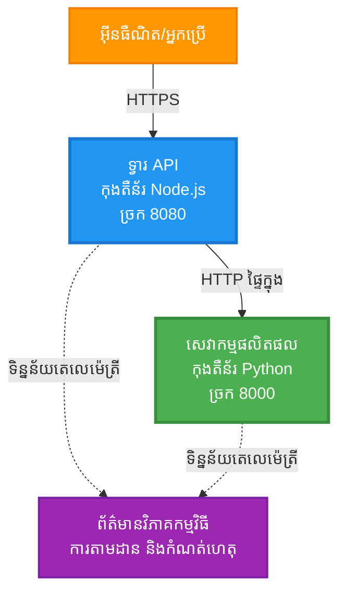
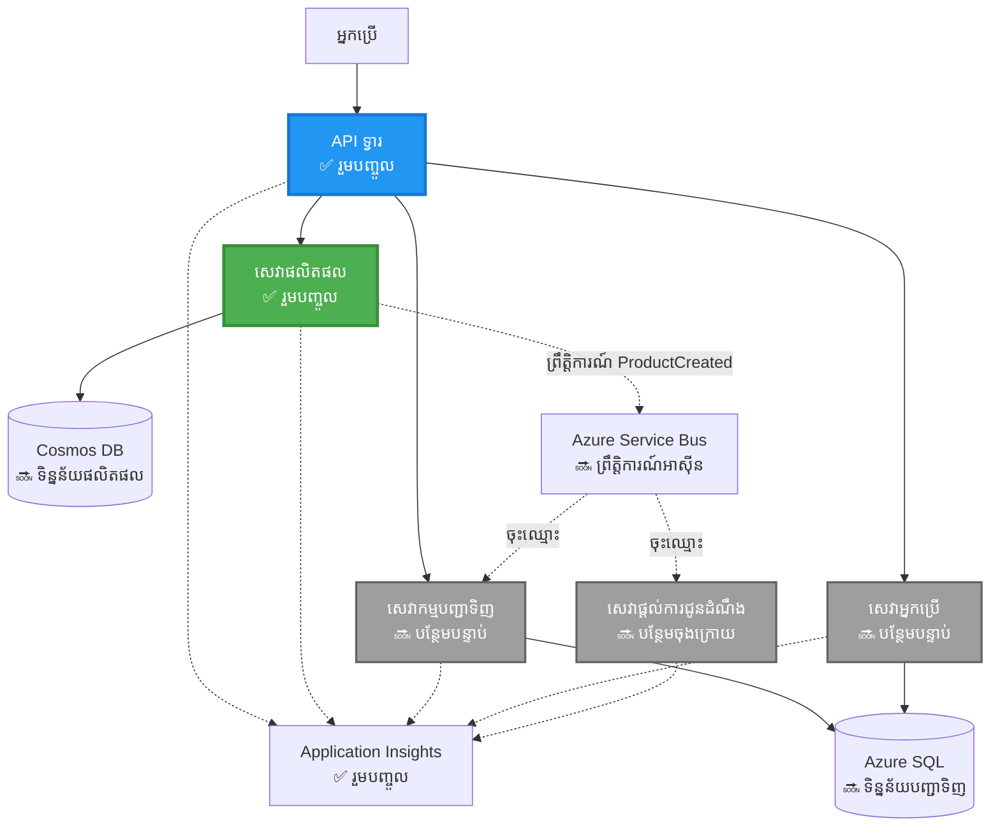
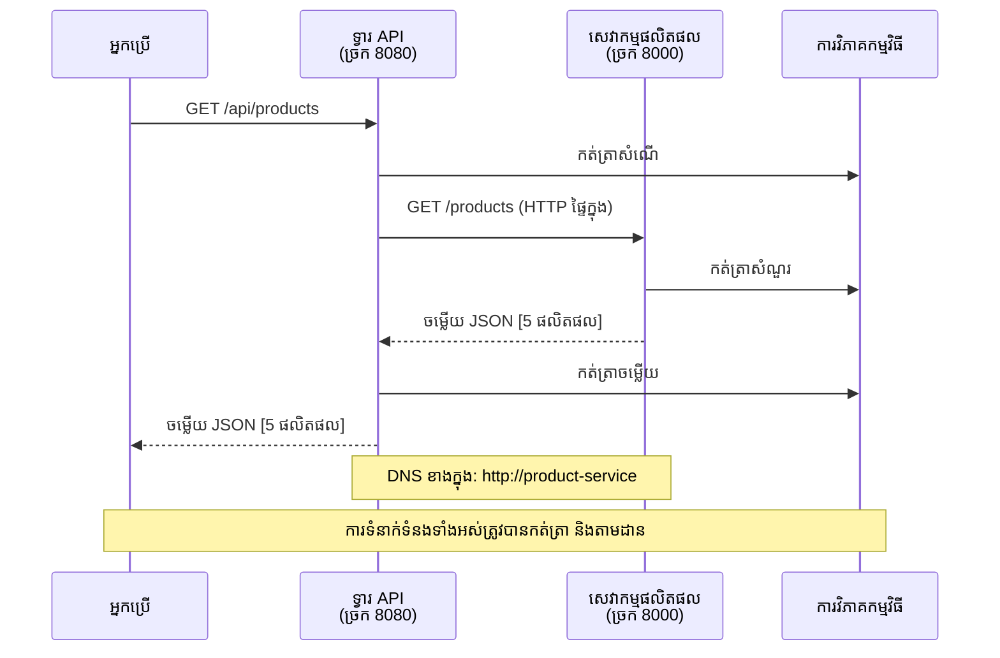

# ស្ថាបត្យកម្ម​មីក្រូសេវា - ឧទាហរណ៍ Container App

⏱️ **ពេលបានចំលែកដោយប្រហាក់ប្រហែល**: 25-35 នាទី | 💰 **ថ្លៃប្រហាក់ប្រហែល**: ~$50-100/ខែ | ⭐ **ចំម្រាស់**: កម្រិតខ្ពស់

**📚 ផ្លូវការសិក្សា:**
- ← មុននេះ: [Flask API សាមញ្ញ](../../../../examples/container-app/simple-flask-api) - មូលដ្ឋាន container එකតែមួយ
- 🎯 **អ្នកនៅទីនេះ**: ស្ថាបត្យកម្ម​មីក្រូសេវា (មូលដ្ឋាន 2 សេវា)
- → បន្ទាប់: [ការរួមបញ្ចូល AI](../../../../docs/ai-foundry) - បន្ថែមបញ្ញាសម្រាប់សេវារបស់អ្នក
- 🏠 [ទំព័រផ្ទះវគ្គ](../../README.md)

---

ស្ថាបត្យកម្ម​មីក្រូសេវា ដែលបានបង្រួមបែបប៉ុន្តែនៅតែប្រើបាន ដែលបានដាក់នៅលើ Azure Container Apps ដោយប្រើ AZD CLI។ ឧទាហរណ៍នេះបង្ហាញពីការទំនាក់ទំនងរវាងសេវា, ការរៀបចំ container, និងការត្រួតពិនិត្យជាមួយការកំណត់តម្លើង 2 សេវាដែលអាចប្រើបានជាផ្ទាល់។

> **📚 វិធីសាស្ត្រសិក្សា**: ឧទាហរណ៍នេះចាប់ផ្តើមជាមួយស្ថាបត្យកម្ម 2 សេវា តូច (API Gateway + Backend Service) ដែលអ្នកអាចដាក់បញ្ចូលបានពិត និងសិក្សាពីវា។ បន្ទាប់ពីយល់ដឹងល្អលើមូលដ្ឋាននេះ យើងនឹងផ្ដល់ការណែនាំសម្រាប់ពង្រីកទៅជាបរិយាកាសមីក្រូសេវាច្រើន។

## អ្វីដែលអ្នកនឹងរៀន

ដោយបញ្ចប់ឧទាហរណ៍នេះ អ្នកនឹង:
- ដាក់ container ច្រើនទៅ Azure Container Apps
- អនុវត្តការទំនាក់ទំនងរវាងសេវា (service-to-service) ជាមួយបណ្តាញផ្ទៃក្នុង
- កំណត់ការកើន/ថយតាមបរិបទ និងការត្រួតពិនិត្យសុខភាព
- ត្រួតពិនិត្យកម្មវិធីចែកចាយជាមួយ Application Insights
- យល់ពីគំរូការដាក់ផ្សាយមីក្រូសេវា និងអនុព័ន្ធល្អៗ
- រៀនពីការពង្រីកយ៉ាងជំហូរពីសាមញ្ញទៅស្ថាបត្យកម្មស្មុគស្មាញ

## ស្ថាបត្យកម្ម

### ជំហានទី1: អ្វីដែលយើងកំពុងបង្កើត (មានក្នុងឧទាហរណ៍នេះ)


**ព័ត៌មានលម្អិតអំពីធាតុផ្សំនៃប្រព័ន្ធ:**

| ធាតុ | គោលបំណង | ការចូលប្រើ | ធនធាន |
|-----------|---------|--------|-----------|
| **API Gateway** | បញ្ជូនសំណើពីខាងក្រៅទៅសេវាកម្មខាងក្រោយ | សាធារណៈ (HTTPS) | 1 vCPU, 2GB RAM, 2-20 replicas |
| **Product Service** | គ្រប់គ្រងបញ្ជីផលិតផលដោយប្រើទិន្នន័យក្នុងអង្គចងចាំ | ក្នុងផ្ទៃក្នុងតែប៉ុណ្ណោះ | 0.5 vCPU, 1GB RAM, 1-10 replicas |
| **Application Insights** | កំណត់ហេតុមួយកណ្តាល និងការតាមដានចែកចាយ | Azure Portal | 1-2 GB/ខែ នៃការរុញទិន្នន័យ |

**ហេតុអ្វីចាប់ផ្តើមដោយសាមញ្ញ?**
- ✅ ដាក់បញ្ចូល និងយល់បានយ៉ាងពេញលេញក្នុងពេលខ្លី (25-35 នាទី)
- ✅ រៀនគំរូមីក្រូសេវាមូលដ្ឋានដោយគ្មានការជ្រុះចូលស្មុគស្មាញ
- ✅ មានកូដដែលដំណើរការបាន អ្នកអាចកែប្រែ និងសាកល្បង
- ✅ ថ្លៃសិក្សាបន្ថយ (~$50-100/ខែ បើប្រៀបធៀបនឹង $300-1400/ខែ)
- ✅ ចម្លងទុកចិត្តមុនពេលបន្ថែមមូលដ្ឋានទិន្នន័យ និងប្រព័ន្ធជញ្ជូនសារ

**ទំនៀមទំនាច**: សូមគិតថាវានៅដូចជាការរៀនបើកឡាន។ អ្នកចាប់ផ្តើមជាមួយទីធ្លាំងចតឡានទទេ (2 សេវា), រៀនមូលដ្ឋានរួចហើយបន្តទៅចរាចរណ៍ក្នុងទីក្រុង (5+ សេវា ជាមួយមូលដ្ឋានទិន្នន័យ)។

### ជំហានទី2: ការពង្រីកនៅអនាគត (ស្ថាបត្យកម្មយោង)

ក្រោយពេលអ្នកចេះលេងស្ថាបត្យកម្ម 2 សេវា អ្នកអាចពង្រីកទៅ:


មើលផ្នែក "Expansion Guide" នៅចុងឯកសារ សម្រាប់ការណែនាំជជ្ជល់ជំហានដោយជំហាន។

## លក្ខណៈពិសេសដែលបញ្ចូល

✅ **ស្វែងរកសេវា**: ស្វែងរកដោយ DNS ដោយស្វ័យប្រវត្តិរវាង containers  
✅ **បេចបោះលើផ្លូវបន្ទុក**: បេចបោះលើផ្លូវបន្ទុកក្នុងឯកសារ replicas  
✅ **កំណត់ផ្ទាល់ខ្លួន**: ការកំណត់ទំងន់ដោយស្វ័យប្រវត្តិ សម្រាប់សេវាទាំងអស់ផ្អែកលើ HTTP  
✅ **ត្រួតពិនិត្យសុខភាព**: Liveness និង readiness probes សម្រាប់សេវាទាំងពីរ  
✅ **កំណត់ហេតុចែកចាយ**: កំណត់ហេតុមួយកណ្តាលជាមួយ Application Insights  
✅ **បណ្ដាញផ្ទៃក្នុង**: ការទំនាក់ទំនងសេវា-ទៅ-សេវា ទាន់សុវត្ថិភាព  
✅ **ការរៀបចំ Container**: ដាក់ប្រើ និងស្កាល់ដោយស្វ័យប្រវត្តិ  
✅ **បច្ចុប្បន្នភាពគ្មានពេលឈប់សម្រាក**: ការអាប់ដេតជាជួរដោយមានការគ្រប់គ្រង revision  

## ការត្រៀមមុន

### ឧបករណ៍ដែលត្រូវការ

មុនចាប់ផ្តើម សូមពិនិត្យថាអ្នកបានដំឡើងឧបករណ៍ទាំងនេះ:

1. **[Azure Developer CLI (azd)](https://learn.microsoft.com/azure/developer/azure-developer-cli/install-azd)** (កំណែ 1.0.0 ឬខ្ពស់ជាង)
   ```bash
   azd version
   # លទ្ធផលដែលរំពឹងទុក: កំណែ azd 1.0.0 ឬខ្ពស់ជាងនេះ
   ```

2. **[Azure CLI](https://learn.microsoft.com/cli/azure/install-azure-cli)** (កំណែ 2.50.0 ឬខ្ពស់ជាង)
   ```bash
   az --version
   # លទ្ធផលដែលរំពឹងទុក: azure-cli 2.50.0 ឬខ្ពស់ជាងនេះ
   ```

3. **[Docker](https://www.docker.com/get-started)** (សម្រាប់អភិវឌ្ឍ/សាកល្បងក្នុងមូលដ្ឋាន - ជាជម្រើស)
   ```bash
   docker --version
   # លទ្ធផលដែលរំពឹងទុក: កំណែ Docker 20.10 ឬខ្ពស់ជាង
   ```

### ពិនិត្យការតភ្ជាប់របស់អ្នក

រត់បញ្ជាខាងក្រោមដើម្បីប្រាកដថាអ្នកបានត្រៀមរួច:

```bash
# ពិនិត្យ Azure Developer CLI
azd version
# ✅ ត្រូវមាន៖ azd ជំនាន់ 1.0.0 ឬខ្ពស់ជាងនេះ

# ពិនិត្យ Azure CLI
az --version
# ✅ ត្រូវមាន៖ azure-cli 2.50.0 ឬខ្ពស់ជាងនេះ

# ពិនិត្យ Docker (ជាជម្រើស)
docker --version
# ✅ ត្រូវមាន៖ Docker ជំនាន់ 20.10 ឬខ្ពស់ជាងនេះ
```

**លក្ខណៈជោគជ័យ**: បញ្ជាពីរាល់ពាក្យបញ្ជាត្រូវតែបញ្ចេញលេខកំណែ ដែលស្របឬលើសកម្រិតអប្បបរមា។

### តម្រូវការរបស់ Azure

- មាន **subscription Azure** សកម្ម ([បង្កើតគណនីដោយឥតគិតថ្លៃ](https://azure.microsoft.com/free/))
- ការអនុញ្ញាតក្នុងការបង្កើតធនធាននៅក្នុង subscription របស់អ្នក
- តួនាទី **Contributor** នៅលើ subscription ឬ resource group

### ចំណេះដឹងមុន

នេះជាឧទាហរណ៍កម្រិតខ្ពស់។ អ្នកគួរតែមាន:
- បានបញ្ចប់ [Flask API សាមញ្ញ](../../../../examples/container-app/simple-flask-api) 
- យល់ដឹងមូលដ្ឋានអំពីស្ថាបត្យកម្ម​មីក្រូសេវា
- ស្គាល់ REST APIs និង HTTP មូលដ្ឋាន
- យល់ដឹងអំពីមូលដ្ឋាន container

**ថ្មីចំពោះ Container Apps?** ចាប់ផ្តើមជាមួយ [Flask API សាមញ្ញ](../../../../examples/container-app/simple-flask-api) មុនដើម្បីរៀនមូលដ្ឋាន។

## ចាប់ផ្តើមឆាប់ (ជាជំហានដោយជំហាន)

### ជំហាន 1: Clone និង ផ្លាស់ទីទៅថតគំរោង

```bash
git clone https://github.com/microsoft/AZD-for-beginners.git
cd AZD-for-beginners/examples/microservices
```

**✓ ផ្ទៀងផ្ទាត់ជោគជ័យ**: ពិនិត្យថាអ្នកឃើញ `azure.yaml`:
```bash
ls
# រំពឹង: README.md, azure.yaml, infra/, src/
```

### ជំហាន 2: Authenticate ជាមួយ Azure

```bash
azd auth login
```

នេះនឹងបើកកម្មវិធីរុករករបស់អ្នកសម្រាប់ការផ្ទៀងផ្ទាត់ Azure។ ចូល gamit អ្នកប្រើប្រាស់ Azure របស់អ្នក។

**✓ ផ្ទៀងផ្ទាត់ជោគជ័យ**: អ្នកគួររៀបឃើញ:
```
Logged in to Azure.
```

### ជំហាន 3: ដំឡើងបរិយាកាស (Initialize the Environment)

```bash
azd init
```

**សំណួរដែលអ្នកនឹងឃើញ**:
- **Environment name**: បញ្ចូលឈ្មោះខ្លី (ឧ. `microservices-dev`)
- **Azure subscription**: ជ្រើស subscription របស់អ្នក
- **Azure location**: ជ្រើសតំបន់ (ឧ. `eastus`, `westeurope`)

**✓ ផ្ទៀងផ្ទាត់ជោគជ័យ**: អ្នកគួររៀបឃើញ:
```
SUCCESS: New project initialized!
```

### ជំហាន 4: ដាក់ប្រោសដ្ឋាន និង សេវាកម្ម

```bash
azd up
```

**អ្វីដែលកើតឡើង** (ចំណាយ 8-12 នាទី):

```mermaid
graph LR
    A[azd up] --> B[បង្កើតក្រុមធនធាន]
    B --> C[ដាក់ប្រើ Container Registry]
    C --> D[ដាក់ប្រើ Log Analytics]
    D --> E[ដាក់ប្រើ App Insights]
    E --> F[បង្កើតបរិយាកាស Container]
    F --> G[បង្កើតរូបភាព API Gateway]
    F --> H[បង្កើតរូបភាពសេវាកម្មផលិតផល]
    G --> I[រុញទៅ Registry]
    H --> I
    I --> J[ដាក់ប្រើ API Gateway]
    I --> K[ដាក់ប្រើសេវាកម្មផលិតផល]
    J --> L[កំណត់ Ingress និងការត្រួតពិនិត្យសុខភាព]
    K --> L
    L --> M[ការដាក់ប្រើបានសម្រេច ✓]
    
    style A fill:#2196F3,stroke:#1976D2,stroke-width:3px,color:#fff
    style M fill:#4CAF50,stroke:#388E3C,stroke-width:3px,color:#fff
```


**✓ ផ្ទៀងផ្ទាត់ជោគជ័យ**: អ្នកគួររៀបឃើញ:
```
SUCCESS: Your application was deployed to Azure in X minutes Y seconds.
Endpoint: https://api-gateway-<unique-id>.azurecontainerapps.io
```

**⏱️ ពេលវេលា**: 8-12 នាទី

### ជំហាន 5: សាកល្បងការដាក់ប្រោសដ្ឋាន

```bash
# ទទួលចំណុចបញ្ចប់ (endpoint) របស់ Gateway
GATEWAY_URL=$(azd env get-values | grep API_GATEWAY_URL | cut -d '=' -f2 | tr -d '"')

# សាកល្បងសុខភាពរបស់ API Gateway
curl $GATEWAY_URL/health
```

**✅ លទ្ធផលដែលរំពឹងទុក:**
```json
{
  "status": "healthy",
  "service": "api-gateway",
  "timestamp": "2025-11-19T10:30:00Z"
}
```

**សាកល្បងសេវាប្រភេទផលិតផល តាមរយៈ gateway**:
```bash
# បញ្ជីផលិតផល
curl $GATEWAY_URL/api/products
```

**✅ លទ្ធផលដែលរំពឹងទុក:**
```json
[
  {"id":1,"name":"Laptop","price":999.99,"stock":50},
  {"id":2,"name":"Mouse","price":29.99,"stock":200},
  {"id":3,"name":"Keyboard","price":79.99,"stock":150}
]
```

**✓ ផ្ទៀងផ្ទាត់ជោគជ័យ**: ចំណុចចូលទាំងពីរត្រូវតែបង្វិលត្រឡប់ទិន្នន័យ JSON ដោយគ្មានកំហុស។

---

**🎉 អបអរសាទរ!** អ្នកបានដាក់ស្ថាបត្យកម្ម​មីក្រូសេវា ទៅលើ Azure បានរួចរាល់!

## រចនាសម្ព័ន្ធគម្រោង

ឯកសារការអនុវត្តទាំងអស់បានបញ្ចូល—នេះគឺជាឧទាហរណ៍ពេញលេញ និងដំណើរការ:

```
microservices/
│
├── README.md                         # This file
├── azure.yaml                        # AZD configuration
├── .gitignore                        # Git ignore patterns
│
├── infra/                           # Infrastructure as Code (Bicep)
│   ├── main.bicep                   # Main orchestration
│   ├── abbreviations.json           # Naming conventions
│   ├── core/                        # Shared infrastructure
│   │   ├── container-apps-environment.bicep  # Container environment + registry
│   │   └── monitor.bicep            # Application Insights + Log Analytics
│   └── app/                         # Service definitions
│       ├── api-gateway.bicep        # API Gateway container app
│       └── product-service.bicep    # Product Service container app
│
└── src/                             # Application source code
    ├── api-gateway/                 # Node.js API Gateway
    │   ├── app.js                   # Express server with routing
    │   ├── package.json             # Node dependencies
    │   └── Dockerfile               # Container definition
    └── product-service/             # Python Product Service
        ├── main.py                  # Flask API with product data
        ├── requirements.txt         # Python dependencies
        └── Dockerfile               # Container definition
```

**តើធាតុនីមួយៗធ្វើអ្វី:**

**Infrastructure (infra/)**:
- `main.bicep`: រៀបចំធនធាន Azure ទាំងអស់ និងការពឹងផ្អែករបស់ពួកវា
- `core/container-apps-environment.bicep`: បង្កើតបរិយាកាស Container Apps និង Azure Container Registry
- `core/monitor.bicep`: កំណត់ Application Insights សម្រាប់កំណត់ហេតុចែកចាយ
- `app/*.bicep`: ការកំណត់ Container App ផ្ទាល់ខ្លួន ជាមួយការកំណត់ស្កាល់ និងការផ្ទៀងផ្ទាត់សុខភាព

**API Gateway (src/api-gateway/)**:
- សេវាដែលមុខងារសាធារណៈ ដើម្បីបញ្ជូនសំណើទៅសេវាខាងក្រោយ
- អនុវត្តកំណត់ហេតុ, ការដោះស្រាយកំហុស, និងការបញ្ជូនសំណើ
- បង្ហាញការទំនាក់ទំនង HTTP រវាងសេវា

**Product Service (src/product-service/)**:
- សេវាផ្ទៃក្នុង ដែលមានបញ្ជីផលិតផល (នៅក្នុងអង្គចងចាំសាមញ្ញ)
- REST API មានการตรวจสอบសុខភាព
- ឧទាហរណ៍នៃគំរូសេវាកម្មខាងក្រោយ

## ទិដ្ឋភាពសេវាកម្ម

### API Gateway (Node.js/Express)

**Port**: 8080  
**Access**: សាធារណៈ (external ingress)  
**គោលបំណង**: បញ្ជូនសំណើចូលទៅសេវាកម្មខាងក្រោយដែលសមរម្យ  

**Endpoints**:
- `GET /` - ព័ត៌មានសេវា
- `GET /health` - ចំណុចផ្ទៀងផ្ទាត់សុខភាព
- `GET /api/products` - បញ្ជូនទៅសេវាប្រើផលិតផល (បង្ហាញទាំងអស់)
- `GET /api/products/:id` - បញ្ជូនទៅសេវាប្រើផលិតផល (យកដោយ ID)

**លក្ខណៈសំខាន់**:
- បញ្ជូនសំណើដោយប្រើ axios
- កំណត់ហេតុមួយកណ្តាល
- ការដោះស្រាយកំហុស និងការគ្រប់គ្រងពេលកំណត់
- ស្វែងរកសេវាដោយប្រើអថេរបរិយាកាស
- រួមបញ្ចូល Application Insights

**Highlight Code** (`src/api-gateway/app.js`):
```javascript
// ការទំនាក់ទំនងរវាងសេវាកម្មខាងក្នុង
app.get('/api/products', async (req, res) => {
  const response = await axios.get(`${PRODUCT_SERVICE_URL}/products`, {
    timeout: 5000
  });
  res.json(response.data);
});
```

### Product Service (Python/Flask)

**Port**: 8000  
**Access**: ក្នុងផ្ទៃក្នុងតែប៉ុណ្ណោះ (គ្មាន external ingress)  
**គោលបំណង**: គ្រប់គ្រងបញ្ជីផលិតផលដោយប្រើទិន្នន័យក្នុងអង្គចងចាំ  

**Endpoints**:
- `GET /` - ព័ត៌មានសេវា
- `GET /health` - ចំណុចផ្ទៀងផ្ទាត់សុខភាព
- `GET /products` - បង្ហាញផលិតផលទាំងអស់
- `GET /products/<id>` - ទទួលផលិតផលដោយ ID

**លក្ខណៈសំខាន់**:
- RESTful API ជាមួយ Flask
- ការផ្ទុកផលិតផលក្នុងអង្គចងចាំ (សាមញ្ញ មិនត្រូវការទិន្នន័យបណ្តុំ)
- ត្រួតពិនិត្យសុខភាពជាមួយ probes
- កំណត់ហេតុដាក់ស្របរចនាសម្ព័ន្ធ
- រួមបញ្ចូល Application Insights

**ម៉ូដែលទិន្នន័យ**:
```python
{
  "id": 1,
  "name": "Laptop",
  "description": "High-performance laptop",
  "price": 999.99,
  "stock": 50
}
```

**ហេតុអ្វីបានជា ក្នុងផ្ទៃក្នុងប៉ុណ្ណោះ?**
សេវាប្រើផលិតផលមិនត្រូវបានបង្ហាញទៅសាធារណៈទេ។ សំណើទាំងអស់ត្រូវតែចូលតាម API Gateway ដែលផ្ដល់:
- សុវត្ថិភាព: ច្រកចូលដែលគ្រប់គ្រងបាន
- ភាពបត់បែន: អាចផ្លាស់ប្ដូរសេវាកម្មខាងក្រោយដោយមិនប៉ះពាល់ទៅឱ្យអ្នកប្រើ
- ការត្រួតពិនិត្យ: កំណត់ហេតុសំណើមួយកណ្តាល

## យល់ដឹងអំពីការទំនាក់ទំនងរវាងសេវា

### របៀបដែលសេវាលេងជាមួយគ្នា


ក្នុងឧទាហរណ៍នេះ API Gateway ទំនាក់ទំនងជាមួយ Product Service ដោយប្រើ **Internal HTTP calls**:

```javascript
// ទ្វារ API (src/api-gateway/app.js)
const PRODUCT_SERVICE_URL = process.env.PRODUCT_SERVICE_URL;

// ធ្វើសំណើ HTTP ផ្ទៃក្នុង
const response = await axios.get(`${PRODUCT_SERVICE_URL}/products`);
```

**ចំណុចសំខាន់**:

1. **ស្វែងរកដោយ DNS**: Container Apps ផ្ដល់ DNS ស្វ័យប្រវត្តិសម្រាប់សេវាផ្ទៃក្នុង
   - Product Service FQDN: `product-service.internal.<environment>.azurecontainerapps.io`
   - សាមញ្ញជា: `http://product-service` (Container Apps ដោះស្រាយវា)

2. **គ្មានការបង្ហាញសាធារណៈ**: Product Service មាន `external: false` នៅក្នុង Bicep
   - អាចចូលបានតែនៅក្នុងបរិយាកាស Container Apps តែប៉ុណ្ណោះ
   - មិនអាចចូលពីអ៊ីនធឺណេតបាន

3. **អថេរបរិយាកាស**: URLs សេវាត្រូវបានចាក់បញ្ចូលនៅពេលដាក់បញ្ចូល
   - Bicep ផ្ញើ FQDN ផ្ទៃក្នុងទៅ gateway
   - មិនមាន URL ត្រូវបាន hardcode ក្នុងកូដកម្មវិធី

**ទំនៀមទំនាច**: សូមគិតថាវានៅដូចជាបន្ទប់ការិយាល័យ។ API Gateway គឺជាស្លាបព្រិលទទួលភ្ញៀវ (public-facing), និង Product Service ជាបន្ទប់ការិយាល័យ (internal only)। អ្នកទស្សនាត្រូវតែចូលតាមទីទទួលដើម្បីទៅកាន់បន្ទប់ណាមួយ។

## ជម្រើសការដាក់បញ្ចូល

### ដាក់បញ្ចូលពេញលេញ (Highly Recommended)

```bash
# ដាក់ប្រើហេដ្ឋារចនាសម្ព័ន្ធ និងសេវាកម្មទាំងពីរ
azd up
```

នេះនឹងដាក់:
1. បរិយាកាស Container Apps
2. Application Insights
3. Container Registry
4. Container API Gateway
5. Container Product Service

**ពេលវេលា**: 8-12 នាទី

### ដាក់បញ្ចូលសេវាឯកតា

```bash
# ដាក់ប្រើ​តែ​សេវាកម្ម​មួយ (បន្ទាប់ពីដំណើរការ azd up ដំបូង)
azd deploy api-gateway

# ឬដាក់ប្រើ​សេវាកម្ម​ផលិតផល
azd deploy product-service
```

**ករណីប្រើប្រាស់**: នៅពេលដែលអ្នកបានធ្វើបច្ចុប្បន្នភាពកូដនៅសេវាមួយ និងចង់ដាក់ឡើងវិញតែសេវានោះប៉ុណ្ណោះ។

### កែប្រែការកំណត់រចនាសម្ព័ន្ធ

```bash
# ប្ដូរព៉ារ៉ាម៉ែត្រ​ស្កាល
azd env set GATEWAY_MAX_REPLICAS 30

# ដាក់ចេញឡើងវិញជាមួយការកំណត់ថ្មី
azd up
```

## ការកំណត់រចនាសម្ព័ន្ធ

### ការកំណត់ការកើន/ថយ (Scaling Configuration)

សេវាទាំងពីរត្រូវបានកំណត់ជាមួយ autoscaling ដើរតាម HTTP នៅក្នុងឯកសារ Bicep របស់ពួកវា:

**API Gateway**:
- Min replicas: 2 (យើងតែងតែមានយ៉ាងហោចណាស់ 2 សម្រាប់ភាពអាចប្រើបាន)
- Max replicas: 20
- ការបញ្ជ-trigger ស្កែល: 50 concurrent requests ក្នុងមួយ replica

**Product Service**:
- Min replicas: 1 (អាចស្កែលទៅសូន្យបាន ប្រសិនបើទាមទារតិច)
- Max replicas: 10
- ការបញ្ជ-trigger ស្កែល: 100 concurrent requests ក្នុងមួយ replica

**កែសម្រួលការកំណត់ស្កែល** (នៅក្នុង `infra/app/*.bicep`):
```bicep
scale: {
  minReplicas: 1
  maxReplicas: 10
  rules: [
    {
      name: 'http-scale-rule'
      http: {
        metadata: {
          concurrentRequests: '100'  // Adjust this
        }
      }
    }
  ]
}
```

### ការចែកចាយធនធាន

**API Gateway**:
- CPU: 1.0 vCPU
- Memory: 2 GiB
- មូលហេតុ: ធន់ទ្រាំចរាចរណ៍ខាងក្រៅទាំងអស់

**Product Service**:
- CPU: 0.5 vCPU
- Memory: 1 GiB
- មូលហេតុ: ប្រតិបត្តិការថ្មីៗក្នុងអង្គចងចាំ

### ការផ្ទៀងផ្ទាត់សុខភាព

សេវាទាំងពីររួមមាន liveness និង readiness probes:

```bicep
probes: [
  {
    type: 'Liveness'
    httpGet: {
      path: '/health'
      port: 8080
    }
    initialDelaySeconds: 10
    periodSeconds: 30
  }
  {
    type: 'Readiness'
    httpGet: {
      path: '/health'
      port: 8080
    }
    initialDelaySeconds: 5
    periodSeconds: 10
  }
]
```

**អ្វីដែលមានន័យ**:
- **Liveness**: ប្រសិនបើការផ្ទៀងផ្ទាត់សុខភាពបរាជ័យ, Container Apps នឹងចាប់ផ្តើមឡើងវិញ container នោះ
- **Readiness**: ប្រសិនបើមិនឈានដល់ស្ថានភាពរួច, Container Apps នឹងបញ្ឈប់ការបញ្ជូនចរាចរណ៍ទៅ replica នោះ

## ការត្រួតពិនិត្យ & ការមើលឃើញ (Observability)

### មើលកំណត់ហេតុសេវា

```bash
# មើលកំណត់ហេតុដោយប្រើ azd monitor
azd monitor --logs

# ឬប្រើ Azure CLI សម្រាប់ Container Apps ជាក់លាក់:
# ចាក់ស្ទ្រីមកំណត់ហេតុពី API Gateway
az containerapp logs show --name api-gateway --resource-group $RG_NAME --follow

# មើលកំណត់ហេតុល่าสุดរបស់សេវាផលិតផល
az containerapp logs show --name product-service --resource-group $RG_NAME --tail 100
```

**លទ្ធផលដែលរំពឹងទុក**:
```
[api-gateway] API Gateway listening on port 8080
[api-gateway] Product Service URL: http://product-service
[api-gateway] GET /api/products 200 - 45ms
[product-service] Retrieved 5 products
```

### ជំនួសសំណួរ Application Insights

ចូលទៅកាន់ Application Insights ក្នុង Azure Portal, បន្ទាប់មករត់សំណួរទាំងនេះ:

**ស្វែងរកសំណើយឺត**:
```kusto
requests
| where timestamp > ago(1h)
| where duration > 1000  // Requests taking >1 second
| summarize count() by name, cloud_RoleName
| order by count_ desc
```

**តាមដានការហៅពីសេវាទៅសេវា**:
```kusto
dependencies
| where timestamp > ago(1h)
| where type == "Http"
| project timestamp, name, target, duration, success
| order by timestamp desc
```

**អត្រាកំហុសដោយសេវា**:
```kusto
exceptions
| where timestamp > ago(24h)
| summarize errorCount = count() by cloud_RoleName, type
| order by errorCount desc
```

**បរិមាណសំណើៗក្នុងពេលវេលា**:
```kusto
requests
| where timestamp > ago(1h)
| summarize requestCount = count() by bin(timestamp, 5m), cloud_RoleName
| render timechart
```

### ចូលទៅផ្ទាំងត្រួតពិនិត្យមើល

```bash
# យកព័ត៌មានលម្អិតពី Application Insights
azd env get-values | grep APPLICATIONINSIGHTS

# បើកការត្រួតពិនិត្យក្នុង Azure Portal
az monitor app-insights component show \
  --app $(azd env get-values | grep APPLICATIONINSIGHTS_CONNECTION_STRING | cut -d '=' -f2) \
  --resource-group $(azd env get-values | grep AZURE_RESOURCE_GROUP | cut -d '=' -f2) \
  --query "appId" -o tsv
```

### ទិន្នន័យពេលពិត (Live Metrics)

1. ទៅកាន់ Application Insights នៅក្នុង Azure Portal
2. ចុច "Live Metrics"
3. មើលសំណើពេលពិត, ការបរាជ័យ និងសមត្ថភាព
4. សាកល្បងដោយរត់: `curl $(azd env get-values | grep API_GATEWAY_URL | cut -d '=' -f2 | tr -d '"')/api/products`

## លំហាត់អនុវត្តិ

### លំហាត់ 1: បន្ថែម Endpoint ផលិតផលថ្មី ⭐ (ងាយ)

**គោលដៅ**: បន្ថែម POST endpoint ដើម្បីបង្កើតផលិតផលថ្មី

**ចំណុចចាប់ផ្តើម**: `src/product-service/main.py`

**ជំហាន**:

1. បន្ថែម endpoint នេះនៅក្រោយ function `get_product` ក្នុង `main.py`:

```python
@app.route('/products', methods=['POST'])
def create_product():
    """Create a new product"""
    data = request.get_json()
    
    # ផ្ទៀងផ្ទាត់វាលដែលចាំបាច់
    if not data or 'name' not in data or 'price' not in data:
        return jsonify({'error': 'Missing required fields: name, price'}), 400
    
    new_id = max(p['id'] for p in products) + 1
    new_product = {
        'id': new_id,
        'name': data['name'],
        'description': data.get('description', ''),
        'price': float(data['price']),
        'stock': int(data.get('stock', 0))
    }
    products.append(new_product)
    logger.info(f"Created product {new_id}")
    return jsonify(new_product), 201
```

2. បន្ថែម route POST ទៅ API Gateway (`src/api-gateway/app.js`):

```javascript
// បន្ថែមនេះក្រោយពីផ្លូវ GET /api/products
app.post('/api/products', async (req, res) => {
  try {
    console.log(`Forwarding POST request to ${PRODUCT_SERVICE_URL}/products`);
    const response = await axios.post(`${PRODUCT_SERVICE_URL}/products`, req.body, {
      timeout: 5000
    });
    res.status(201).json(response.data);
  } catch (error) {
    console.error('Error calling product service:', error.message);
    res.status(503).json({
      error: 'Product service unavailable',
      message: error.message
    });
  }
});
```

3. ដាក់ឡើងវិញសេវាទាំងពីរ:

```bash
azd deploy product-service
azd deploy api-gateway
```

4. សាកល្បង endpoint ថ្មី:

```bash
GATEWAY_URL=$(azd env get-values | grep API_GATEWAY_URL | cut -d '=' -f2 | tr -d '"')

# បង្កើតផលិតផលថ្មី
curl -X POST $GATEWAY_URL/api/products \
  -H "Content-Type: application/json" \
  -d '{"name":"USB Cable","price":9.99,"stock":500}'
```

**✅ លទ្ធផលដែលបានរំពឹងទុក៖**
```json
{"id":6,"name":"USB Cable","description":"","price":9.99,"stock":500}
```

5. ពិនិត្យមើលវាថាតើវាបង្ហាញនៅក្នុងបញ្ជីដែរឬទេ៖

```bash
curl $GATEWAY_URL/api/products
# ឥឡូវនេះគួរតែបង្ហាញផលិតផលចំនួន 6 រួមមានខ្សែ USB ថ្មី
```

**គោលការណ៍ជោគជ័យ**៖
- ✅ សំណើ POST ត្រឡប់ HTTP 201
- ✅ ផលិតផលថ្មីបង្ហាញនៅក្នុងបញ្ជី GET /api/products
- ✅ ផលិតផលមាន ID កើនឡើងដោយស្វ័យប្រវត្តិ

**ពេលវេលា**៖ 10-15 នាទី

---

### លំហាត់ 2៖ ផ្លាស់ប្តូរនីតិវិធី Autoscaling ⭐⭐ (មធ្យម)

**គោលដៅ**៖ បំលែងសេវាកម្មផលិតផលឲ្យធ្វើការលាយឡំយ៉ាងខ្លាំង

**ចំណុចចាប់ផ្តើម**៖ `infra/app/product-service.bicep`

**ជំហាន**៖

1. បើក `infra/app/product-service.bicep` ហើយស្វែងរកប្លុក `scale` (ប្រហែលបន្ទាត់ 95)

2. ប្តូរពី៖
```bicep
scale: {
  minReplicas: 1
  maxReplicas: 10
  rules: [
    {
      name: 'http-scale-rule'
      http: {
        metadata: {
          concurrentRequests: '100'  // OLD
        }
      }
    }
  ]
}
```

ទៅជា៖
```bicep
scale: {
  minReplicas: 2  // Always have 2 running
  maxReplicas: 20  // Allow more scaling
  rules: [
    {
      name: 'http-scale-rule'
      http: {
        metadata: {
          concurrentRequests: '20'  // Scale at lower threshold
        }
      }
    }
  ]
}
```

3. បន្ទាប់បន្សំស្ថាបត្យកម្មឡើងវិញ៖

```bash
azd up
```

4. ពិនិត្យមើលការកំណត់ការលាយឡំថ្មី៖

```bash
az containerapp show \
  --name $(azd env get-values | grep PRODUCT_SERVICE | head -1 | cut -d '/' -f5) \
  --resource-group $(azd env get-values | grep AZURE_RESOURCE_GROUP | cut -d '=' -f2 | tr -d '"') \
  --query "properties.template.scale" -o json
```

**✅ លទ្ធផលដែលបានរំពឹងទុក៖**
```json
{
  "minReplicas": 2,
  "maxReplicas": 20,
  "rules": [...]
}
```

5. សាកល្បង autoscaling ជាមួយផ្ទុក៖

```bash
# បង្កើតសំណើច្រើនស្របពេល
for i in {1..500}; do curl $GATEWAY_URL/api/products & done

# មើលការពង្រីកកើតឡើងដោយប្រើ Azure CLI
az containerapp logs show --name product-service --resource-group $RG_NAME --follow
# ស្វែងរក: ព្រឹត្តិការណ៍ការពង្រីករបស់ Container Apps
```

**គោលការណ៍ជោគជ័យ**៖
- ✅ សេវាកម្មផលិតផលរត់យ៉ាងហោចណាស់ 2 ចម្លងតែងតែមាន
- ✅ នៅក្រោមផ្ទុក លាយឡំទៅលើច្រើនជាង 2 ចម្លង
- ✅ កំពូល Azure បង្ហាញនីតិវិធីលាយឡំថ្មី

**ពេលវេលា**៖ 15-20 នាទី

---

### លំហាត់ 3៖ បញ្ចូលសំណួរត្រួតពិនិត្យផ្ទាល់ខ្លួន ⭐⭐ (មធ្យម)

**គោលដៅ**៖ បង្កើតសំណួរ Application Insights ផ្ទាល់ខ្លួនសម្រាប់តាមដានការសមត្ថភាព API ផលិតផល

**ជំហាន**៖

1. ទៅកាន់ Application Insights នៅ Azure Portal៖
   - ទៅកាន់ Azure Portal
   - ស្វែងរកក្រុមធនធានរបស់អ្នក (rg-microservices-*)
   - ចុចលើធនធាន Application Insights

2. ចុច "Logs" នៅម៉ឺនុយផ្នែកឆ្វេង

3. បង្កើតសំណួរនេះ៖

```kusto
requests
| where timestamp > ago(1h)
| where name contains "products"
| summarize 
    RequestCount = count(),
    AvgDuration = avg(duration),
    P95Duration = percentile(duration, 95),
    SuccessRate = 100.0 * countif(success == true) / count()
  by bin(timestamp, 5m)
| render timechart
```

4. ចុច "Run" ដើម្បីប្រតិបត្តិសំណួរ

5. រក្សាទុកសំណួរ៖
   - ចុច "Save"
   - ឈ្មោះ៖ "Product API Performance"
   - ប្រភេទ៖ "Performance"

6. បង្កើតចរាចរប្រលង៖

```bash
for i in {1..100}; do curl $GATEWAY_URL/api/products; sleep 1; done
```

7. បន្ទាន់សម័យសំណួរដើម្បីមើលទិន្នន័យ

**✅ លទ្ធផលដែលបានរំពឹងទុក៖**
- ផ្ទាំងបង្ហាញចំនួនសំណើរៗតាមពេលវេលា
- រយៈពេលមធ្យម < 500ms
- អត្រាជោគជ័យ = 100%
- ប្លុកពេលវេលា 5 នាទី

**គោលការណ៍ជោគជ័យ**៖
- ✅ សំណួរបង្ហាញសំណើ 100+ ច្រើន
- ✅ អត្រាជោគជ័យ 100%
- ✅ រយៈពេលមធ្យម < 500ms
- ✅ ផ្ទាំងបង្ហាញប្លុកពេលវេលា 5 នាទី

**លទ្ធផលការសិក្សា**៖ យល់ដឹងពីរបៀបត្រួតពិនិត្យសមត្ថភាពសេវាកម្មជាមួយសំណួរផ្ទាល់ខ្លួន

**ពេលវេលា**៖ 10-15 នាទី

---

### លំហាត់ 4៖ អនុវត្តតារាង Retry ⭐⭐⭐ (អតិបរមា)

**គោលដៅ**៖ បន្ថែម​តារាង retry ទៅ API Gateway នៅពេលសេវាកម្មផលិតផលមិនអាចប្រើបានបណ្ដោះអាសន្ន

**ចំណុចចាប់ផ្តើម**៖ `src/api-gateway/app.js`

**ជំហាន**៖

1. តំឡើងបណ្ណាល័យ retry៖

```bash
cd src/api-gateway
npm install axios-retry --save
cd ../..
```

2. បច្ចុប្បន្នភាព `src/api-gateway/app.js` (បន្ថែមបន្ទាប់ពីបញ្ជូន axios):

```javascript
const axiosRetry = require('axios-retry');

// កំណត់យុទ្ធសាស្ត្រព្យាយាមឡើងវិញ
axiosRetry(axios, {
  retries: 3,
  retryDelay: (retryCount) => {
    return retryCount * 1000; // 1 វិនាទី, 2 វិនាទី, 3 វិនាទី
  },
  retryCondition: (error) => {
    // ព្យាយាមម្តងទៀតនៅពេលមានកំហុសបណ្តាញ ឬ កូដស្ថានភាព 5xx
    return axiosRetry.isNetworkOrIdempotentRequestError(error) ||
           (error.response && error.response.status >= 500);
  }
});

console.log('Retry logic configured: 3 retries with exponential backoff');
```

3. បន្ទាប់បន្សំ API Gateway:

```bash
azd deploy api-gateway
```

4. សាកល្បងអាកប្បកិរិយា retry ដោយសមល្បងករណីសេវាកម្មបរាជ័យ៖

```bash
# កំណត់សេវាកម្មផលិតផលទៅ 0 (សាកល្បងស្ថានភាពបរាជ័យ)
az containerapp update \
  --name $(azd env get-values | grep PRODUCT_SERVICE | head -1 | cut -d '/' -f5) \
  --resource-group $(azd env get-values | grep AZURE_RESOURCE_GROUP | cut -d '=' -f2 | tr -d '"') \
  --min-replicas 0 \
  --max-replicas 0

# ព្យាយាមចូលប្រើផលិតផល (នឹងព្យាយាមឡើងវិញ 3 ដង)
time curl -v $GATEWAY_URL/api/products
# សង្កេត៖ ការឆ្លើយតបប្រហែល 6 វិនាទី (1s + 2s + 3s នៃការព្យាយាមឡើងវិញ)

# ស្ដារឡើងវិញសេវាកម្មផលិតផល
az containerapp update \
  --name $(azd env get-values | grep PRODUCT_SERVICE | head -1 | cut -d '/' -f5) \
  --resource-group $(azd env get-values | grep AZURE_RESOURCE_GROUP | cut -d '=' -f2 | tr -d '"') \
  --min-replicas 1 \
  --max-replicas 10
```

5. មើលកំណត់ត្រា retry៖

```bash
az containerapp logs show --name api-gateway --resource-group $RG_NAME --tail 50
# ស្វែងរក: សារ​ស្តីពី​ការ​ព្យាយាម​ម្តងទៀត
```

**✅ អាកប្បកិរិយាដែលបានរំពឹងទុក៖**
- សំណើរ retry 3 ដងមុនពេលបរាជ័យ
- រាល់ពេល retry កើនរយៈពេលរំពឹង (1s, 2s, 3s)
- សំណើរជោគជ័យបន្ទាប់ពីសេវាកម្មចាប់ផ្ដើមឡើងវិញ
- កំណត់ត្រាបង្ហាញការព្យួរនៅពេល retry

**គោលការណ៍ជោគជ័យ**៖
- ✅ សំណើប្រេីប្រាស់ retry 3 ដងមុនបរាជ័យ
- ✅ រាល់ retry រយៈពេលរំពឹងជាបម្លែងបូកបន្ថែម
- ✅ សំណើរជោគជ័យបន្ទាប់ពីសេវាកម្មចាប់ផ្ដើមឡើងវិញ
- ✅ កំណត់ត្រាបង្ហាញការព្យួរសំណើរ

**លទ្ធផលការសិក្សា**៖ យល់ដឹងពីលំនាំភាពរឹងមាំនៅក្នុងមីក្រូសេវា (circuit breakers, retries, timeouts)

**ពេលវេលា**៖ 20-25 នាទី

---

## ចំណុចត្រួតពិនិត្យចំណាំ

បន្ទាប់ពីបញ្ចប់ឧទាហរណ៍នេះ សូមពិនិត្យការយល់ដឹងរបស់អ្នក៖

### 1. ការទំនាក់ទំនងសេវា ✓

សាកល្បងចំណេះដឹងរបស់អ្នក៖
- [ ] តើអ្នកអាចពន្យល់ថា API Gateway ស្វែងរកសេវាកម្មផលិតផលម៉េចមែន? (ស្វែងរកសេវាកម្មផ្អែកលើ DNS)
- [ ] តើមានអ្វីកើតឡើងបើសេវាកម្មផលិតផលបរាជ័យ? (Gateway ត្រឡប់កំហុស 503)
- [ ] តើអ្នកនឹងបន្ថែមសេវាកម្មទីបីយ៉ាងដូចម្តេច? (បង្កើតឯកសារ Bicep ថ្មី, បន្ថែមទៅ main.bicep, បង្កើតថត src)

**ការពិនិត្យតាមអនុវត្តន៍៖**
```bash
# ធ្វើសមនិមិត្តនៃការបរាជ័យរបស់សេវា
az containerapp update --name <product-service-name> --min-replicas 0 --max-replicas 0
curl $GATEWAY_URL/api/products
# ✅ រំពឹង: 503 សេវាកម្មមិនអាចប្រើបាន

# ស្តារសេវាកម្មឡើងវិញ
az containerapp update --name <product-service-name> --min-replicas 1 --max-replicas 10
```

### 2. ការត្រួតពិនិត្យ និងមើលឃើញ ✓

សាកល្បងចំណេះដឹងរបស់អ្នក៖
- [ ] តើអ្នកមើលឃើញកំណត់ត្រាចែកចាយនៅកន្លែងណា? (Application Insights នៅ Azure Portal)
- [ ] តើអ្នកតាមដានសំណើរយឺតផ្តល់ដូចម្តេច? (សំណួរ Kusto៖ `requests | where duration > 1000`)
- [ ] តើអ្នកអាចកំណត់បានថាសេវាណាមួយធ្វើឲ្យកើតមានកំហុសបានដែរឬទេ? (ពិនិត្យវាល `cloud_RoleName` នៅក្នុងកំណត់ត្រា)

**ការពិនិត្យតាមអនុវត្តន៍៖**
```bash
# បង្កើតការសំដែងសំណើដែលយឺត
curl "$GATEWAY_URL/api/products?delay=2000"

# ស្វែងរកសំណើដែលយឺតនៅក្នុង Application Insights
# ចូលទៅកាន់ Azure Portal → Application Insights → Logs
# រត់: requests | where duration > 1000 | project timestamp, name, duration, cloud_RoleName
```

### 3. ការលាយឡំ និងសមត្ថភាព ✓

សាកល្បងចំណេះដឹងរបស់អ្នក៖
- [ ] តើអ្វីជាកត្តាដែលធ្វើឲ្យ autoscaling កើតឡើង? (ច្បាប់សំណើ HTTP concurrent requests: 50 សម្រាប់ gateway, 100 សម្រាប់ product)
- [ ] តើមានចម្លងប៉ុន្មានកំពុងដំណើរការឥឡូវនេះ? (ពិនិត្យជាមួយ `az containerapp revision list`)
- [ ] តើអ្នកនឹងលាយឡំសេវាកម្មផលិតផលទៅ 5 ចម្លងយ៉ាងណា? (បន្ទាន់សម័យ minReplicas នៅក្នុង Bicep)

**ការពិនិត្យតាមអនុវត្តន៍៖**
```bash
# បង្កើតបន្ទុក ដើម្បីសាកល្បងការកំណត់ទំហំដោយស្វ័យប្រវត្តិ
for i in {1..1000}; do curl $GATEWAY_URL/api/products & done

# មើល​ចំនួន replicas កើនឡើង ដោយប្រើ Azure CLI
az containerapp logs show --name api-gateway --resource-group $RG_NAME --follow
# ✅ រំពឹងទុក៖ នឹងឃើញ​ព្រឹត្តិការណ៍​ការកំណត់ទំហំ​នៅ​ក្នុង​កំណត់ហេតុ
```

**គោលការណ៍ជោគជ័យ**៖ អ្នកអាចឆ្លើយបានគ្រប់សំណួរនិងពិនិត្យជាមួយពាក្យបញ្ជាផ្ទាល់ខ្លួន។

---

## វិភាគថ្លៃដើម

### ការចំណាយប្រចាំខែដែលត្រូវបានគណនាថ្មី (សម្រាប់ឧទាហរណ៍ 2-សេវា)

| ធនធាន | ការកំណត់ | ថ្លៃដើមប្រហាក់ប្រហែល |
|----------|--------------|----------------|
| API Gateway | 2-20 ចម្លង, 1 vCPU, 2GB RAM | $30-150 |
| សេវាកម្មផលិតផល | 1-10 ចម្លង, 0.5 vCPU, 1GB RAM | $15-75 |
| ថតឧបករណ៍ Container | ថ្នាក់មូលដ្ឋាន | $5 |
| Application Insights | 1-2 GB/ខែ | $5-10 |
| Log Analytics | 1 GB/ខែ | $3 |
| **សរុប** | | **$58-243/ខែ** |

### ការបំបែកថ្លៃតាមការប្រើប្រាស់

**ចរាចរតិច** (សាកល្បង/សិក្សា): ~$60/ខែ
- API Gateway: 2 ចម្លង × 24/7 = $30
- សេវាកម្មផលិតផល: 1 ចម្លង × 24/7 = $15
- ត្រួតពិនិត្យ + ថត = $13

**ចរាចរមធ្យម** (ផលិតកម្មតូច): ~$120/ខែ
- API Gateway: 5 ចម្លងមធ្យម = $75
- សេវាកម្មផលិតផល: 3 ចម្លងមធ្យម = $45
- ត្រួតពិនិត្យ + ថត = $13

**ចរាចរខ្លាំង** (រយៈពេលរវល់): ~$240/ខែ
- API Gateway: 15 ចម្លងមធ្យម = $225
- សេវាកម្មផលិតផល: 8 ចម្លងមធ្យម = $120
- ត្រួតពិនិត្យ + ថត = $13

### គន្លឹះបង្កើនប្រសិទ្ធភាពថ្លៃ

1. **លាយឡំទៅសូន្យសម្រាប់អភិវឌ្ឍន៍**៖
   ```bicep
   scale: {
     minReplicas: 0  // Save $30-40/month when not in use
     maxReplicas: 10
   }
   ```

2. **ប្រើផែនការ Consumption សម្រាប់ Cosmos DB** (ពេលអ្នកបន្ថែមវា):
   - បង់ប្រាក់តែសម្រាប់អ្វីដែលអ្នកប្រើ
   - គ្មានកម្រៃអប្បបរមា

3. **កំណត់ Sampling សម្រាប់ Application Insights**៖
   ```javascript
   appInsights.defaultClient.config.samplingPercentage = 50; // យកគំរូ 50% នៃសំណើ
   ```

4. **សម្អាតរបាយការណ៍ពេលមិនពិបាក**៖
   ```bash
   azd down --force --purge
   ```

### ជម្រើសថ្នាក់ឥតគិតថ្លៃ

សម្រាប់ការសិក្សា/សាកល្បង ពិចារណា៖
- ✅ ប្រើឥណទានឥតគិតថ្លៃ Azure ($200 សម្រាប់ 30 ថ្ងៃដំបូងជាមួយគណនីថ្មី)
- ✅ រក្សាចម្លងអប្បបរមា (សន្សំថ្លៃ ~50%)
- ✅ លុបបំបាត់បន្ទាប់ពីសាកល្បង (គ្មានចំណាយបន្ត)
- ✅ លាយឡំទៅសូន្យចន្លោះរវល់សិក្សា

**ឧទាហរណ៍**៖ រត់ឧទាហរណ៍នេះ 2 ម៉ោង/ថ្ងៃ × 30 ថ្ងៃ = ~$5/ខែ ផ្ទុយពី $60/ខែ

---

## ជំនួយឆាប់រហ័សសម្រាប់ការដោះស្រាយបញ្ហា

### បញ្ហា៖ `azd up` បរាជ័យជាមួយ "Subscription not found"

**ដំណោះស្រាយ**៖
```bash
# ចូលម្តងទៀតជាមួយការជាវជាក់លាក់
az account set --subscription <your-subscription-id>
azd env set AZURE_SUBSCRIPTION_ID <your-subscription-id>
azd up
```

### បញ្ហា៖ API Gateway ត្រឡប់ 503 "Product service unavailable"

**វាយតម្លៃ**៖
```bash
# ពិនិត្យកំណត់ហេតុសេវាកម្មផលិតផលដោយប្រើ Azure CLI
az containerapp logs show --name product-service --resource-group $RG_NAME --tail 50

# ពិនិត្យសុខភាពសេវាកម្មផលិតផល
az containerapp show \
  --name $(azd env get-values | grep PRODUCT_SERVICE | head -1 | cut -d '/' -f5) \
  --resource-group $(azd env get-values | grep AZURE_RESOURCE_GROUP | cut -d '=' -f2 | tr -d '"') \
  --query "properties.runningStatus"
```

**មូលហេតុទូទៅ**៖
1. សេវាកម្មផលិតផលមិនបានចាប់ផ្ដើម (ពិនិត្យកំណត់ត្រាសម្រាប់កំហុស Python)
2. ការត្រួតពិនិត្យសុខភាពបរាជ័យ (ផ្ទៀងផ្ទាត់ `/health` endpoint ដំណើរការ)
3. ការសាងសង់រូបភាព container បរាជ័យ (ពិនិត្យថតរូបភាព)

### បញ្ហា៖ Autoscaling មិនដំណើរការ

**វាយតម្លៃ**៖
```bash
# ពិនិត្យចំនួនចម្លងបច្ចុប្បន្ន
az containerapp revision list \
  --name $(azd env get-values | grep API_GATEWAY | head -1 | cut -d '/' -f5) \
  --resource-group $(azd env get-values | grep AZURE_RESOURCE_GROUP | cut -d '=' -f2 | tr -d '"') \
  --query "[].properties.replicas"

# បង្កើតបន្ទុកសម្រាប់សាកល្បង
for i in {1..1000}; do curl $GATEWAY_URL/api/products & done

# តាមដានព្រឹត្តិការណ៍ពង្រីកដោយប្រើ Azure CLI
az containerapp logs show --name api-gateway --resource-group $RG_NAME --follow | grep -i scale
```

**មូលហេតុទូទៅ**៖
1. ផ្ទុកមិនខ្ពស់គ្រប់គ្រាន់ដើម្បីបង្ករច្បាប់ការលាយឡំ (ត្រូវការខាងលើ 50 សំណើធុន)
2. ចម្លងអតិបរមាបានឈានដល់ហើយ (ពិនិត្យការកំណត់ Bicep)
3. ច្បាប់លាយឡំកំណត់ខុសនៅក្នុង Bicep (បញ្ជាក់តម្លៃ concurrentRequests)

### បញ្ហា៖ Application Insights មិនបង្ហាញកំណត់ត្រា

**វាយតម្លៃ**៖
```bash
# ផ្ទៀងផ្ទាត់ថា ខ្សែតភ្ជាប់ត្រូវបានកំណត់
azd env get-values | grep APPLICATIONINSIGHTS

# ពិនិត្យមើលថា សេវាកម្មកំពុងផ្ញើទិន្នន័យតាមដាន
az monitor app-insights component show \
  --app $(azd env get-values | grep APPLICATIONINSIGHTS_NAME | cut -d '=' -f2 | tr -d '"') \
  --resource-group $(azd env get-values | grep AZURE_RESOURCE_GROUP | cut -d '=' -f2 | tr -d '"') \
  --query "properties.InstrumentationKey"
```

**មូលហេតុទូទៅ**៖
1. ខ្សែភ្ជាប់មិនបានផ្ញើទៅ container (ពិនិត្យ environment variables)
2. SDK Application Insights មិនតំឡើង (បញ្ជាក់ការនាំចូលនៅក្នុងកូដ)
3. Firewall រាំងស្ទះជូនភាព telemetery (ពិបាកកើតមាន បញ្ជាក់ច្បាប់បណ្តាញ)

### បញ្ហា៖ Docker build បរាជ័យក្នុងជំរៅ

**វាយតម្លៃ**៖
```bash
# សាកល្បងការបង្កើត API Gateway
cd src/api-gateway
docker build -t test-gateway .

# សាកល្បងការបង្កើតសេវាកម្មផលិតផល
cd ../product-service
docker build -t test-product .
```

**មូលហេតុទូទៅ**៖
1. ខ្វះការពឹងផ្អែកនៅ package.json/requirements.txt
2. កំហុសអក្សរសញ្ជាតិ Dockerfile
3. បញ្ហាបណ្តាញក្នុងការទាញយក dependencies

**នៅតែមានបញ្ហា?** សូមមើល [មគ្គុទេសក៍បញ្ហាទូទៅ](../../docs/chapter-07-troubleshooting/common-issues.md) ឬ [Azure Container Apps Troubleshooting](https://learn.microsoft.com/azure/container-apps/troubleshooting)

---

## សម្អាត

ដើម្បីជៀសវាងការចំណាយបន្ត អ្នកត្រូវលុបធនធានទាំងអស់៖

```bash
azd down --force --purge
```

**ការបញ្ជាក់បញ្ជា៖**
```
? Total resources to delete: 6, are you sure you want to continue? (y/N)
```

វាយ `y` ដើម្បីបញ្ចាក់។

**អ្វីដែលត្រូវបានលុប៖**
- បរិវេណ Container Apps
- អេប Container Apps ពីរនេះ (gateway & product service)
- ថត Container Registry
- Application Insights
- កន្លែង Log Analytics Workspace
- ក្រុមធនធាន

**✓ ពិនិត្យសម្អាត**៖
```bash
az group list --query "[?starts_with(name,'rg-microservices')]" --output table
```

គួរត្រូវតែត្រឡប់ទៅទទេ។

---

## មាគ្គុទេសក៍ពង្រីក៖ ពី 2 ទៅ 5+ សេវា

ពេលដែលអ្នកបានជំនាញនៅស្ថាបត្យកម្ម 2 សេវានេះហើយ វា​ជា​ដំណាក់កាល​ពីរ៖

### ដំណាក់កាល 1៖ បន្ថែមការផ្ទុកទុកទិន្នន័យ (ជំហានបន្ទាប់)

**បន្ថែម Cosmos DB សម្រាប់សេវាកម្មផលិតផល**៖

1. បង្កើត `infra/core/cosmos.bicep`៖
   ```bicep
   resource cosmosAccount 'Microsoft.DocumentDB/databaseAccounts@2023-04-15' = {
     name: name
     location: location
     kind: 'GlobalDocumentDB'
     properties: {
       databaseAccountOfferType: 'Standard'
       consistencyPolicy: { defaultConsistencyLevel: 'Session' }
       locations: [{ locationName: location, failoverPriority: 0 }]
     }
   }
   ```

2. បច្ចុប្បន្នភាពសេវាកម្មផលិតផលឲ្យប្រើ Azure Cosmos DB Python SDK ជំនួសវិញទិន្នន័យក្នុងចិត្ត

3. ថ្លៃបន្ថែមប្រហែល៖ ~$25/ខែ (serverless)

### ដំណាក់កាល 2៖ បន្ថែមសេវាកម្មទីបី (ការគ្រប់គ្រងការបញ្ជាទិញ)

**បង្កើតសេវាកម្មអាណាត់បញ្ជាទិញ**៖

1. ថតថ្មី៖ `src/order-service/` (Python/Node.js/C#)
2. Bicep ថ្មី៖ `infra/app/order-service.bicep`
3. បច្ចុប្បន្នភាព API Gateway ដើម្បីផ្ញើរទៅ `/api/orders`
4. បន្ថែម Azure SQL Database សម្រាប់បញ្ជាទិញ

**ស្ថាបត្យកម្មក្លាយជា**៖
```
API Gateway → Product Service (Cosmos DB)
           → Order Service (Azure SQL)
```

### ដំណាក់កាល 3៖ បន្ថែមការទំនាក់ទំនង Async (Service Bus)

**អនុវត្តស្ថាបត្យកម្មដោយព្រឹត្តិការ**៖

1. បន្ថែម Azure Service Bus៖ `infra/core/servicebus.bicep`
2. សេវាកម្មផលិតផលផ្សព្វផ្សាយព្រឹត្តិការណ៍ "ProductCreated"
3. សេវាកម្មបញ្ជាទិញជាវព្រឹត្តិការណ៍ផលិតផល
4. បន្ថែមសេវាកម្មអំពាវនាវដើម្បីដំណើរការព្រឹត្តិការណ៍

**លំនាំ**៖ សំណើ/ចម្លើយ (HTTP) + ព្រឹត្តិការណ៍បញ្ជា (Service Bus)

### ដំណាក់កាល 4៖ បន្ថែមការផ្ទៀងផ្ទាត់អ្នកប្រើ

**អនុវត្តសេវាកម្មអ្នកប្រើ**៖

1. បង្កើត `src/user-service/` (Go/Node.js)
2. បន្ថែម Azure AD B2C ឬ authentication JWT ផ្ទាល់ខ្លួន
3. API Gateway ផ្ទៀងផ្ទាត់ token មុនផ្ញើរបន្ត
4. សេវាកម្មត្រួតពិនិត្យសិទ្ធិអ្នកប្រើ

### ដំណាក់កាល 5៖ ស្រេចរៀបចំការផលិត

**បន្ថែមផ្នែកទាំងនេះ**៖
- ✅ Azure Front Door (ផ្ទុកផ្នែកលទ្ធផលស្វ័យប្រវត្តិជាតិសកល)
- ✅ Azure Key Vault (ការគ្រប់គ្រងសម្ងាត់)
- ✅ Azure Monitor Workbooks (ផ្ទាំងបញ្ជារផ្ទាល់ខ្លួន)
- ✅ CI/CD Pipeline (GitHub Actions)
- ✅ การ​ផ្សព្វផ្សាយ​ប្លូធៀប្លូស (Blue-Green Deployments)
- ✅ Managed Identity សម្រាប់សេវាកម្មទាំងអស់

**ថ្លៃស្ថាបត្យកម្មផលិតកម្មពេញលេញ**៖ ~$300-1,400/ខែ

---

## យល់ដឹងបន្ថែម

### អត្ថបទទាក់ទង
- [ឯកសារខាង Azure Container Apps](https://learn.microsoft.com/azure/container-apps/)
- [មគ្គុទេសក៍ស្ថាបត្យកម្ម Microservices](https://learn.microsoft.com/azure/architecture/guide/architecture-styles/microservices)
- [Application Insights សម្រាប់ការតាមដានចែកចាយ](https://learn.microsoft.com/azure/azure-monitor/app/distributed-tracing)
- [ឯកសារលក្ខណៈ Azure Developer CLI](https://learn.microsoft.com/azure/developer/azure-developer-cli/)

### ជំហានបន្ទាប់នៅក្នុងវគ្គនេះ
- ← មុន៖ [Simple Flask API](../../../../examples/container-app/simple-flask-api) - ឧទាហរណ៍ single-container សម្រាប់អ្នកដង្ហើយ
- → បន្ទាប់៖ [AI Integration Guide](../../../../docs/ai-foundry) - បន្ថែមសមត្ថភាព AI
- 🏠 [ទំព័រដើមវគ្គ](../../README.md)

### ការប្រៀបធៀប៖ ពេលណាអាចប្រើអ្វី

| លក្ខណៈ | Single Container | Microservices (នេះ) | Kubernetes (AKS) |
|---------|-----------------|---------------------|------------------|
| **ប្រើសម្រាប់** | កម្មវិធីសាមញ្ញ | កម្មវិធីស្មុគស្មាញ | កម្មវិធីសហគ្រាស |
| **ការលាយឡំ** | សេវាកម្មតែមួយ | លាយឡំតាមសេវា | តម្លៃបំផុតសម្រាប់បតបន្លា |
| **ស្មុគស្មាញ** | ដាច់ | មធ្យម | ខ្ពស់ |
| **ទំហំក្រុម** | អ្នកអភិវឌ្ឍ 1-3 | អ្នកអភិវឌ្ឍ 3-10 | អ្នកអភិវឌ្ឍ 10+ |
| **ថ្លៃ** | ~$15-50/ខែ | ~$60-250/ខែ | ~$150-500/ខែ |
| **ពេលវេលាបង្ហោះ** | 5-10 នាទី | 8-12 នាទី | 15-30 នាទី |
| **ល្អបំផុតសម្រាប់** | MVPs, គំរូ | កម្មវិធីផលិត | គន្លងពហុពពក, បណ្តាញជាន់ខ្ពស់ |

**អនុសាសន៍**៖ ចាប់ផ្តើមជាមួយ Container Apps (ឧទាហរណ៍នេះ), ផ្លាស់ទៅ AKS បើត្រូវការ feature ពិសេស Kubernetes។

---

## សំណួរដែលបានសួរញឹកញាប់

**Q: ហេតុអ្វីមានតែ 2 សេវា តែគ្មាន 5+?**  
A: បម្លាស់ប្តូរជាអប់រំ។ អនុវត្តចំណុចមូលដ្ឋាន (ការទំនាក់ទំនងសេវាកម្ម, ការត្រួតពិនិត្យ, ការកំណត់ទំហំ) ជាមួយឧទាហរណ៍សម្រួលមួយមុនពេលបន្ថែមភាពស្មុគស្មាញ។ លំនាំដែលអ្នករៀននៅទីនេះអាចប្រើបានសម្រាប់ស្ថិតិការប្រព័ន្ធសេវាកម្មចំនួន ១០០។

**Q: តើខ្ញុំអាចបន្ថែមសេវាកម្មបន្ថែមដោយខ្លួនឯងបានទេ?**  
A: បាប! សូមអនុវត្តតាមមគ្គុទេសក៍ពង្រីកខាងលើ។ សេវាកម្មថ្មីនីមួយៗស្តាប់តាមលំនាំដូចគ្នា៖ បង្កើតថត src, បង្កើតឯកសារ Bicep, អាប់ដេត azure.yaml, បញ្ជូន។

**Q: តើវាស្រាប់ត្រៀមសម្រាប់ផលិតផលឬ?**  
A: វាជាផ្នែកមូលដ្ឋានដ៏រឹងមាំ។ សម្រាប់ផលិតផល បន្ថែម៖ អត្តសញ្ញាណគ្រប់គ្រង, Key Vault, មូលដ្ឋានទិន្នន័យដែលថែរក្សាទំហំ, ទំព័រដំណើរការ CI/CD, ការព្រៀងប្រយ័ត្នត្រួតពិនិត្យ, និងយុទ្ធសាស្រ្តបម្រុងទុក។

**Q: ហេតុអ្វីបានជាមិនប្រើ Dapr ឬបណ្តាញសេវាកម្មផ្សេងទៀត?**  
A: រក្សាឲ្យសាមញ្ញសម្រាប់ការរៀន។ ពេលដែលអ្នកយល់ពីបណ្តាញ Container Apps ដើម អ្នកអាចបន្ថែម Dapr សម្រាប់នីតិវិធីខ្ពស់ជាងនេះ (ការគ្រប់គ្រងស្ថានភាព, pub/sub, bindings)។

**Q: តើយ៉ាងដូចម្តេចខ្ញុំអាចដោះស្រាយបញ្ហាពេលដំណើរការនៅក្នុងកន្លែងម៉ាស៊ីនខ្ញុំ?**  
A: រត់សេវាកម្មនៅក្នុងម៉ាស៊ីនតាមរយៈ Docker៖  
```bash
cd src/api-gateway
docker build -t local-gateway .
docker run -p 8080:8080 -e PRODUCT_SERVICE_URL=http://localhost:8000 local-gateway
```
  
**Q: តើខ្ញុំអាចប្រើភាសាប្រព័ន្ធផ្សេងៗបានទេ?**  
A: បាទ! ឧទាហរណ៍នេះបង្ហាញ Node.js (gateway) + Python (សេវាកម្មផលិតផល)។ អ្នកអាចច្រកភាសាណាដែលអាចដំណើរការនៅក្នុងកម្ម៉ង់ភាគ: C#, Go, Java, Ruby, PHP, ល។ 

**Q: តើប្រសិនបើខ្ញុំមិនមានកម្រៃឥណទាន Azure?**  
A: ប្រើថ្នាក់ឥតគិតថ្លៃ Azure (៣០ ថ្ងៃដំបូងសម្រាប់គណនីថ្មីទទួលបានកម្រៃឥណទាន $200) ឬបញ្ជូនសម្រាប់រយៈពេលសាកល្បងខ្លីៗ ហើយលុបភ្លាមៗ។ ឧទាហរណ៍នេះមានថ្លៃប្រហែល $2/ថ្ងៃ។

**Q: តើវាផ្សេងពី Azure Kubernetes Service (AKS) យ៉ាងដូចម្តេច?**  
A: Container Apps សាមញ្ញជាង (មិនចាំបាច់ចេះ Kubernetes) ប៉ុន្តែមានកំណត់តិចជាង។ AKS ផ្តល់ការគ្រប់គ្រង Kubernetes ពេញលេញតែតម្រូវឲ្យមានជំនាញច្រើន។ ចាប់ផ្តើមជាមួយ Container Apps ហើយបន្តទៅ AKS ប្រសិនបើចាំបាច់។

**Q: តើខ្ញុំអាចប្រើវាជាមួយសេវាកម្ម Azure ដែលមានរួចហើយឬ?**  
A: បាទ! អ្នកអាចភ្ជាប់ទៅមូលដ្ឋានទិន្នន័យ, គណនីផ្ទុកទិន្នន័យ, Service Bus, ល។ កែប្រែឯកសារ Bicep ដើម្បីយោងឯកសារដែលមានរួចជំនួសការបង្កើតថ្មី។

---

> **🎓 សង្ខេបផ្លូវការរៀន**: អ្នកបានរៀនរបៀបបញ្ជូនស្ថិតិការសេវាកម្មច្រើនជាមួយការកំណត់ទំហំស្វ័យប្រវត្តិ, បណ្តាញក្នុង, ការត្រួតពិនិត្យមជ្ឈមណ្ឌល, និងលំនាំដំណើរការសម្រាប់ផលិតផល។ ផ្នែកមូលដ្ឋាននេះរៀបចំអ្នកសម្រាប់ប្រព័ន្ធចែកចាយស្មុគស្មាញ និងស្ថិតិការមីក្រូសេវាកម្មសហគ្រាស។

**📚 ស្ដាប់មើលវគ្គសិក្សា៖**  
- ← មុន៖ [Simple Flask API](../../../../examples/container-app/simple-flask-api)  
- → បន្ទាប់៖ [Database Integration Example](../../../../database-app)  
- 🏠 [ទំព័រដើមវគ្គសិក្សា](../../README.md)  
- 📖 [អនុពល Container Apps ល្អបំផុត](../../docs/chapter-04-infrastructure/deployment-guide.md)  

---

**✨ សូមអបអរសាទរ!** អ្នកបានបញ្ចប់ឧទាហរណ៍មីក្រូសេវាកម្ម។ ឥឡូវនេះអ្នកយល់ពីរបៀបសាងសង់ បញ្ជូន និងត្រួតពិនិត្យកម្មវិធីចែកចាយនៅលើ Azure Container Apps។ តើអ្នកស្ថិតនៅសម្រាប់បន្ថែមមុខងារ AI ទេ? សូមមើល [មគ្គុទេសក៍ការតភ្ជាប់ AI](../../../../docs/ai-foundry)!

---

<!-- CO-OP TRANSLATOR DISCLAIMER START -->
**ការបដិសេធ**៖  
ឯកសារនេះត្រូវបានបកប្រែដោយប្រើសេវាបកប្រែ AI [Co-op Translator](https://github.com/Azure/co-op-translator)។ ខណៈពេលយើងខិតខំប្រឹងប្រែងដើម្បីផ្តល់ភាពត្រឹមត្រូវ សូមយកចិត្តទុកដាក់ថាការបកប្រែដោយស្វ័យប្រវត្តិអាចមានកំហុស ឬការខុសឆ្គង។ ឯកសារដើមដោយភាសាទីបុព្វជាគន្លងប្រភពដើមដែលត្រូវបានទទួលស្គាល់ជាអ្នកដឹកនាំ។ សម្រាប់ព័ត៌មានសំខាន់ៗ សូមផ្តល់អាទិភាពការបកប្រែដោយមនុស្សជំនាញ។ យើងមិនទទួលខុសត្រូវចំពោះការយល់ច្រឡំ ឬការបកស្រាយខុសដែលកើតមានពីការប្រើប្រាស់ការបកប្រែនេះឡើយ។
<!-- CO-OP TRANSLATOR DISCLAIMER END -->