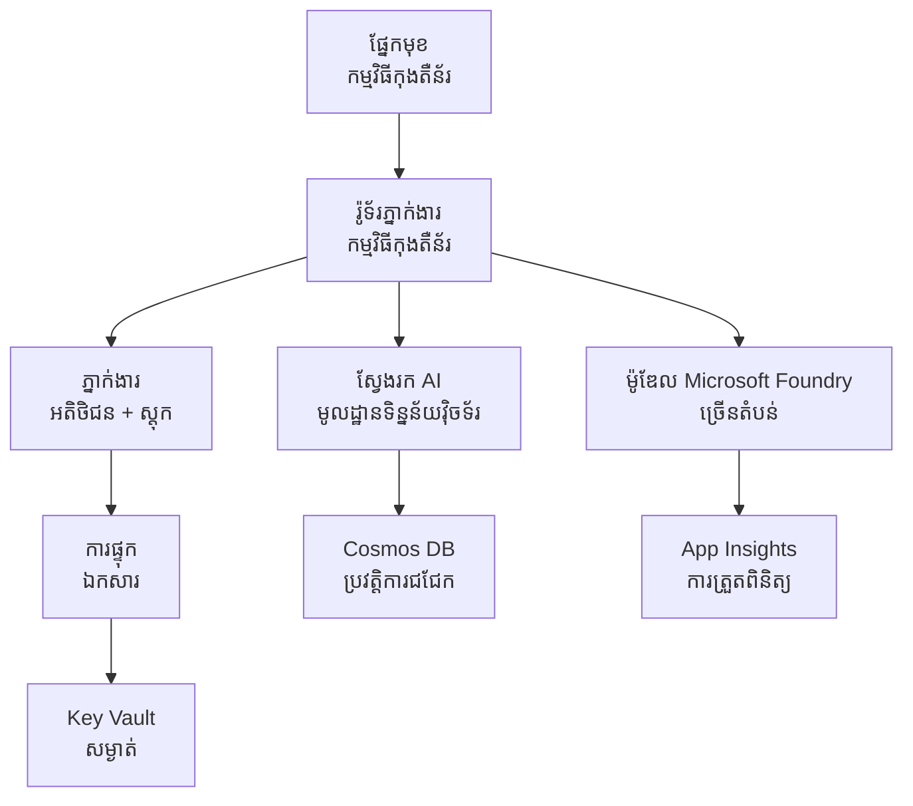

# Retail Multi-Agent Solution - Infrastructure Template

**Chapter 5: Production Deployment Package**
- **📚 Course Home**: [AZD For Beginners](../../README.md)
- **📖 Related Chapter**: [Chapter 5: Multi-Agent AI Solutions](../../README.md#-chapter-5-multi-agent-ai-solutions-advanced)
- **📝 Scenario Guide**: [Complete Architecture](../retail-scenario.md)
- **🎯 Quick Deploy**: [One-Click Deployment](#-quick-deployment)

> **⚠️ INFRASTRUCTURE TEMPLATE ONLY**  
> គំរូ ARM នេះបង្កើត **ធនធាន Azure** សម្រាប់​ប្រព័ន្ធ​មហាសេនានុវត្ត multi-agent។  
>  
> **អ្វីដែលត្រូវបានដាក់តាំង (15-25 នាទី):**
> - ✅ សេវាកម្ម Microsoft Foundry Models (gpt-4.1, gpt-4.1-mini, embeddings ជា 3 តំបន់)
> - ✅ សេវា Azure AI Search (ទទេ, រៀបចំដាក់សន្ទស្សន៍បាន)
> - ✅ Container Apps (រូបភាព placeholder, រៀបចំសម្រាប់កូដរបស់អ្នក)
> - ✅ Storage, Cosmos DB, Key Vault, Application Insights
>  
> **អ្វីខ្លះដែលមិនមាន (ទាមទារការអភិវឌ្ឍ):**
> - ❌ កូដអនុវត្តន៍ Agent (Customer Agent, Inventory Agent)
> - ❌ ទ្រឹស្តី routing និង endpoints API
> - ❌ UI chat មុខងារ frontend
> - ❌ ស្គីម៉ាស៊ែត search index និង data pipelines
> - ❌ **ការប៉ាន់ប្រមាណពេលអភិវឌ្ឍ៖ 80-120 ម៉ោង**
>  
> **ប្រើគំរូនេះប្រសិនបើ:**
> - ✅ អ្នកចង់ provision វិទ្យាស្ថាន Azure សម្រាប់គម្រោង multi-agent
> - ✅ អ្នកមានផែនការ​អភិវឌ្ឍកូដ agent លក់ពីរបៀបផ្សេងពីគ្នា
> - ✅ អ្នកត្រូវការមូលដ្ឋាន infrastructure សម្រាប់ផលិតកម្ម
>  
> **កុំប្រើប្រសិនបើ:**
> - ❌ អ្នករង់ចាំដំបូង demo multi-agent ដែលរត់បានភ្លាមៗ
> - ❌ អ្នកកំពុងស្វែងរកឧទាហរណ៍កូដកម្មវិធីពេញលេញ

## Overview

ថតនេះមានគំរូ Azure Resource Manager (ARM) ដ៏ទូលំទូលាយសម្រាប់ដាក់ចូល **មូលដ្ឋានហេដ្ឋារចនាសម្ព័ន្ធ** នៃប្រព័ន្ធគាំទ្រអតិថិជន multi-agent។ គំរូនេះ provision សេវាកម្ម Azure ទាំងអស់ដែលចាំបាច់ រៀបចំបានត្រឹមត្រូវ និងភ្ជាប់គ្នា ដើម្បីសម្រាប់ការអភិវឌ្ឍកម្មវិធីរបស់អ្នក។

**បន្ទាប់ពីដាក់ចូល អ្នកនឹងមាន:** មូលដ្ឋាន Azure រួចសម្រាប់ការផលិត  
**ដើម្បីបញ្ចប់ប្រព័ន្ធ អ្នកត្រូវការ:** កូដ agent, UI មុខងារ frontend, និងការកំណត់ទិន្នន័យ (មើល [Architecture Guide](../retail-scenario.md))

## 🎯 What Gets Deployed

### Core Infrastructure (Status After Deployment)

✅ **សេវាកម្ម Microsoft Foundry Models** (រួចសម្រាប់ការហៅ API)
  - តំបន់ដើម: ការដាក់ចូល gpt-4.1 (សមត្ថភាព 20K TPM)
  - តំបន់ទីពីរ: ការដាក់ចូល gpt-4.1-mini (សមត្ថភាព 10K TPM)
  - តំបន់ទីបី: ម៉ូដែល Text embeddings (សមត្ថភាព 30K TPM)
  - តំបន់ផ្ដល់ការវាយតម្លៃ: ម៉ូដែល gpt-4.1 grader (សមត្ថភាព 15K TPM)
  - **ស្ថានភាព:** ប្រតិបត្តិការ ដាច់ខ្ពស់ - អាចហៅ API បានភ្លាម

✅ **Azure AI Search** (ទទេ - រៀបចំសម្រាប់ការកំណត់)
  - លទ្ធភាពស្វែងរកវ៉ិកទ័រ (vector search) បានបើក
  - ស្តង់ដាត tier ជាមួយ 1 partition, 1 replica
  - **ស្ថានភាព:** សេវាកម្មកំពុងរត់ ប៉ុន្តែត្រូវការបង្កើតសន្ទស្សន៍ (index)
  - **សកម្មភាពចាំបាច់:** បង្កើត search index ជាមួយស្គីម៉ាសរបស់អ្នក

✅ **Azure Storage Account** (ទទេ - រៀបចំសម្រាប់ផ្ទុកឯកសារ)
  - Blob containers: `documents`, `uploads`
  - ការកំណត់សុវត្ថិភាព (HTTPS only, គ្មានចូលសាធារណៈ)
  - **ស្ថានភាព:** រៀបចំសម្រាប់ទទួលឯកសារ
  - **សកម្មភាពចាំបាច់:** អាប់ឡូដទិន្នន័យផលិតផល និងឯកសារ

⚠️ **Container Apps Environment** (បានដាក់រូបភាព placeholder)
  - អបភេន router app (nginx default image)
  - អបភេន frontend app (nginx default image)
  - កំណត់ auto-scaling (0-10 instances)
  - **ស្ថានភាព:** រត់ containers placeholder
  - **សកម្មភាពចាំបាច់:** បន្ថែម និងដាក់ចូលកម្មវិធី agent របស់អ្នក

✅ **Azure Cosmos DB** (ទទេ - រៀបចំសម្រាប់ទិន្នន័យ)
  - Database និង container ត្រូវបានកំនត់ជាមុន
  - បង្រួមសម្រាប់ប្រតិបត្តិការផ្ទាល់ទាប-latency
  - TTL បានបើកសម្រាប់ការសម្អាតដោយស្វ័យប្រវត្តិ
  - **ស្ថានភាព:** រៀបចំសម្រាប់ផ្ទុកប្រវត្តិបញ្ហាសន្ទនា (chat history)

✅ **Azure Key Vault** (ជាជម្រើស - រៀបចំសម្រាប់សម្ងាត់)
  - Soft delete បានបើក
  - RBAC បានកំណត់សម្រាប់ managed identities
  - **ស្ថានភាព:** រៀបចំសម្រាប់ផ្ទុក API keys និង connection strings

✅ **Application Insights** (ជាជម្រើស - ការតាមដានកម្មវិធីមានសកម្មភាព)
  - ការភ្ជាប់ទៅ Log Analytics workspace
  - វិមាត្រ និងសញ្ញាផ្ទាល់ខ្លួនបានកំណត់
  - **ស្ថានភាព:** រៀបចំសម្រាប់ទទួល telemetry ពីកម្មវិធីរបស់អ្នក

✅ **Document Intelligence** (រួចសម្រាប់ការហៅ API)
  - តំណាក់ S0 សម្រាប់បញ្ចូលកម្មវិធីផលិតកម្ម
  - **ស្ថានភាព:** រៀបចំសម្រាប់ដំណើរការ​ឯកសារដែលបានអាប់ឡូដ

✅ **Bing Search API** (រួចសម្រាប់ការហៅ API)
  - តំណាក់ S1 សម្រាប់ការស្វែងរកពេលវេលានៅពេលជាក់ស្តែង
  - **ស្ថានភាព:** រៀបចំសម្រាប់ការស្វែងរកវត្ដមានបណ្ដាញ

### Deployment Modes

| Mode | OpenAI Capacity | Container Instances | Search Tier | Storage Redundancy | Best For |
|------|-----------------|---------------------|-------------|-------------------|----------|
| **Minimal** | 10K-20K TPM | 0-2 replicas | Basic | LRS (Local) | Dev/test, learning, proof-of-concept |
| **Standard** | 30K-60K TPM | 2-5 replicas | Standard | ZRS (Zone) | Production, moderate traffic (<10K users) |
| **Premium** | 80K-150K TPM | 5-10 replicas, zone-redundant | Premium | GRS (Geo) | Enterprise, high traffic (>10K users), 99.99% SLA |

**Cost Impact:**
- **Minimal → Standard:** ~4x ការកើនថ្លៃ ($100-370/mo → $420-1,450/mo)
- **Standard → Premium:** ~3x ការកើនថ្លៃ ($420-1,450/mo → $1,150-3,500/mo)
- **ជ្រើសរើសដោយផ្អែកលើ:** ទម្ងន់ឆន្ទៈ, លទ្ធភាព SLA, ឬកំណត់ថវិកា

**Capacity Planning:**
- **TPM (Tokens Per Minute):** សរុបទាំងអស់នៅលើការដាក់ចូលម៉ូដែលទាំងអស់
- **Container Instances:** ជួរការប្រែប្រួល auto-scaling (min-max replicas)
- **Search Tier:** ធ្វើឱ្យមានឥទ្ធិពលលើប្រសិទ្ធភាពសំណើ និងកំណត់ទំហំសន្ទស្សន៍

## 📋 Prerequisites

### Required Tools
1. **Azure CLI** (version 2.50.0 or higher)
   ```bash
   az --version  # ពិនិត្យកំណែ
   az login      # ផ្ទៀងផ្ទាត់
   ```

2. **Active Azure subscription** with Owner or Contributor access
   ```bash
   az account show  # ផ្ទៀងផ្ទាត់ការជាវ
   ```

### Required Azure Quotas

មុនការដាក់ចូល សូមពិនិត្យ quotas នៅតំបន់ដែលអ្នកគោលដៅ៖

```bash
# ពិនិត្យភាពអាចប្រើបាននៃម៉ូដែល Microsoft Foundry នៅក្នុងតំបន់របស់អ្នក
az cognitiveservices account list-skus \
  --kind OpenAI \
  --location eastus2

# ផ្ទៀងផ្ទាត់កម្រិតកំណត់របស់ OpenAI (ឧទាហរណ៍សម្រាប់ gpt-4.1)
az cognitiveservices usage list \
  --location eastus2 \
  --query "[?name.value=='OpenAI.Standard.gpt-4.1']"

# ពិនិត្យកម្រិតកំណត់នៃ Container Apps
az provider show \
  --namespace Microsoft.App \
  --query "resourceTypes[?resourceType=='managedEnvironments'].locations"
```

**Minimum Required Quotas:**
- **Microsoft Foundry Models:** 3-4 model deployments across regions
  - gpt-4.1: 20K TPM (Tokens Per Minute)
  - gpt-4.1-mini: 10K TPM
  - text-embedding-ada-002: 30K TPM
  - **ចំណាំ:** gpt-4.1 អាចមានបញ្ជីរង់ចាំនៅខ្លះតំបន់ - សូមពិនិត្យ [model availability](https://learn.microsoft.com/azure/ai-services/openai/concepts/models)
- **Container Apps:** Managed environment + 2-10 container instances
- **AI Search:** Standard tier (Basic insufficient for vector search)
- **Cosmos DB:** Standard provisioned throughput

**If quota insufficient:**
1. Go to Azure Portal → Quotas → Request increase
2. Or use Azure CLI:
   ```bash
   az support tickets create \
     --ticket-name "OpenAI-Quota-Increase" \
     --severity "minimal" \
     --description "Request quota increase for Microsoft Foundry Models gpt-4.1 in eastus2"
   ```
3. Consider alternative regions with availability

## 🚀 Quick Deployment

### Option 1: Using Azure CLI

```bash
# ចម្លងឬទាញយកឯកសារគំរូ
git clone <repository-url>
cd examples/retail-multiagent-arm-template

# ធ្វើឱ្យស្គ្រីបដាក់ចេញអាចអនុវត្តបាន
chmod +x deploy.sh

# ដាក់ចេញដោយការកំណត់លំនាំដើម
./deploy.sh -g myResourceGroup

# ដាក់ចេញសម្រាប់បរិស្ថានផលិតកម្ម ជាមួយមុខងារជាន់ខ្ពស់
./deploy.sh -g myProdRG -e prod -m premium -l eastus2
```

### Option 2: Using Azure Portal

[](https://portal.azure.com/#create/Microsoft.Template/uri/https%3A%2F%2Fraw.githubusercontent.com%2Fmicrosoft%2Fazd-for-beginners%2Fmain%2Fexamples%2Fretail-multiagent-arm-template%2Fazuredeploy.json)

### Option 3: Using Azure CLI directly

```bash
# បង្កើតក្រុមធនធាន
az group create --name myResourceGroup --location eastus2

# ដាក់ប្រើទម្រង់
az deployment group create \
  --resource-group myResourceGroup \
  --template-file azuredeploy.json \
  --parameters azuredeploy.parameters.json
```

## ⏱️ Deployment Timeline

### What to Expect

| Phase | Duration | What Happens |
|-------|----------|--------------||
| **Template Validation** | 30-60 seconds | Azure validates ARM template syntax and parameters |
| **Resource Group Setup** | 10-20 seconds | Creates resource group (if needed) |
| **OpenAI Provisioning** | 5-8 minutes | Creates 3-4 OpenAI accounts and deploys models |
| **Container Apps** | 3-5 minutes | Creates environment and deploys placeholder containers |
| **Search & Storage** | 2-4 minutes | Provisions AI Search service and storage accounts |
| **Cosmos DB** | 2-3 minutes | Creates database and configures containers |
| **Monitoring Setup** | 2-3 minutes | Sets up Application Insights and Log Analytics |
| **RBAC Configuration** | 1-2 minutes | Configures managed identities and permissions |
| **Total Deployment** | **15-25 minutes** | Complete infrastructure ready |

**After Deployment:**
- ✅ **Infrastructure Ready:** All Azure services provisioned and running
- ⏱️ **Application Development:** 80-120 hours (your responsibility)
- ⏱️ **Index Configuration:** 15-30 minutes (requires your schema)
- ⏱️ **Data Upload:** Varies by dataset size
- ⏱️ **Testing & Validation:** 2-4 hours

---

## ✅ Verify Deployment Success

### Step 1: Check Resource Provisioning (2 minutes)

```bash
# ផ្ទៀងផ្ទាត់ថាធនធានទាំងអស់បានដាក់ប្រើដោយជោគជ័យ
az resource list \
  --resource-group myResourceGroup \
  --query "[?provisioningState!='Succeeded'].{Name:name, Status:provisioningState, Type:type}" \
  --output table
```

**Expected:** Empty table (all resources show "Succeeded" status)

### Step 2: Verify Microsoft Foundry Models Deployments (3 minutes)

```bash
# បញ្ជីគណនី OpenAI ទាំងអស់
az cognitiveservices account list \
  --resource-group myResourceGroup \
  --query "[?kind=='OpenAI'].{Name:name, Location:location, Status:properties.provisioningState}" \
  --output table

# ពិនិត្យការបង្ហោះម៉ូឌែលនៅតំបន់ចម្បង
OPENAI_NAME=$(az cognitiveservices account list \
  --resource-group myResourceGroup \
  --query "[?kind=='OpenAI'] | [0].name" -o tsv)

az cognitiveservices account deployment list \
  --name $OPENAI_NAME \
  --resource-group myResourceGroup \
  --output table
```

**Expected:** 
- 3-4 OpenAI accounts (primary, secondary, tertiary, evaluation regions)
- 1-2 model deployments per account (gpt-4.1, gpt-4.1-mini, text-embedding-ada-002)

### Step 3: Test Infrastructure Endpoints (5 minutes)

```bash
# យក URL របស់កម្មវិធីកុងតឺន័រ
az containerapp list \
  --resource-group myResourceGroup \
  --query "[].{Name:name, URL:properties.configuration.ingress.fqdn, Status:properties.runningStatus}" \
  --output table

# សាកល្បងចុងបញ្ចប់ router (រូបភាពជំនួសនឹងឆ្លើយតប)
ROUTER_URL=$(az containerapp show \
  --name retail-router \
  --resource-group myResourceGroup \
  --query "properties.configuration.ingress.fqdn" -o tsv)

echo "Testing: https://$ROUTER_URL"
curl -I https://$ROUTER_URL || echo "Container running (placeholder image - expected)"
```

**Expected:** 
- Container Apps show "Running" status
- Placeholder nginx responds with HTTP 200 or 404 (no application code yet)

### Step 4: Verify Microsoft Foundry Models API Access (3 minutes)

```bash
# ទទួលបាន endpoint និង key របស់ OpenAI
OPENAI_ENDPOINT=$(az cognitiveservices account show \
  --name $OPENAI_NAME \
  --resource-group myResourceGroup \
  --query "properties.endpoint" -o tsv)

OPENAI_KEY=$(az cognitiveservices account keys list \
  --name $OPENAI_NAME \
  --resource-group myResourceGroup \
  --query "key1" -o tsv)

# សាកល្បងការដាក់ឲ្យដំណើរការ gpt-4.1
curl "${OPENAI_ENDPOINT}openai/deployments/gpt-4.1/chat/completions?api-version=2024-08-01-preview" \
  -H "Content-Type: application/json" \
  -H "api-key: $OPENAI_KEY" \
  -d '{
    "messages": [{"role": "user", "content": "Say hello"}],
    "max_tokens": 10
  }'
```

**Expected:** JSON response with chat completion (confirms OpenAI is functional)

### What's Working vs. What's Not

**✅ Working After Deployment:**
- Microsoft Foundry Models models deployed and accepting API calls
- AI Search service running (empty, no indexes yet)
- Container Apps running (placeholder nginx images)
- Storage accounts accessible and ready for uploads
- Cosmos DB ready for data operations
- Application Insights collecting infrastructure telemetry
- Key Vault ready for secret storage

**❌ Not Working Yet (Requires Development):**
- Agent endpoints (no application code deployed)
- Chat functionality (requires frontend + backend implementation)
- Search queries (no search index created yet)
- Document processing pipeline (no data uploaded)
- Custom telemetry (requires application instrumentation)

**Next Steps:** See [Post-Deployment Configuration](#-post-deployment-next-steps) to develop and deploy your application

---

## ⚙️ Configuration Options

### Template Parameters

| Parameter | Type | Default | Description |
|-----------|------|---------|-------------|
| `projectName` | string | "retail" | Prefix for all resource names |
| `location` | string | Resource group location | Primary deployment region |
| `secondaryLocation` | string | "westus2" | Secondary region for multi-region deployment |
| `tertiaryLocation` | string | "francecentral" | Region for embeddings model |
| `environmentName` | string | "dev" | Environment designation (dev/staging/prod) |
| `deploymentMode` | string | "standard" | Deployment configuration (minimal/standard/premium) |
| `enableMultiRegion` | bool | true | Enable multi-region deployment |
| `enableMonitoring` | bool | true | Enable Application Insights and logging |
| `enableSecurity` | bool | true | Enable Key Vault and enhanced security |

### Customizing Parameters

Edit `azuredeploy.parameters.json`:

```json
{
  "$schema": "https://schema.management.azure.com/schemas/2019-04-01/deploymentParameters.json#",
  "contentVersion": "1.0.0.0",
  "parameters": {
    "projectName": {
      "value": "mycompany"
    },
    "environmentName": {
      "value": "prod"
    },
    "deploymentMode": {
      "value": "premium"
    },
    "location": {
      "value": "eastus2"
    }
  }
}
```

## 🏗️ Architecture Overview


## 📖 Deployment Script Usage

ស្គ្រីប `deploy.sh` ផ្តល់បទពិសោធន៍ដាក់ចូលជាផ្ទាល់ខ្លួន៖

```bash
# បង្ហាញជំនួយ
./deploy.sh --help

# ការដាក់ប្រើមូលដ្ឋាន
./deploy.sh -g myResourceGroup

# ការដាក់ប្រើកម្រិតខ្ពស់ជាមួយការកំណត់ផ្ទាល់ខ្លួន
./deploy.sh \
  -g myProductionRG \
  -p companyname \
  -e prod \
  -m premium \
  -l eastus2

# ការដាក់ប្រើសម្រាប់អភិវឌ្ឍន៍ដោយមិនមានពហុតំបន់
./deploy.sh \
  -g myDevRG \
  -e dev \
  -m minimal \
  --no-multi-region \
  --no-security
```

### Script Features

- ✅ **Prerequisites validation** (Azure CLI, login status, template files)
- ✅ **Resource group management** (creates if doesn't exist)
- ✅ **Template validation** before deployment
- ✅ **Progress monitoring** with colored output
- ✅ **Deployment outputs** display
- ✅ **Post-deployment guidance**

## 📊 Monitoring Deployment

### Check Deployment Status

```bash
# បញ្ជីការដាក់ចេញ
az deployment group list --resource-group myResourceGroup --output table

# ទទួលព័ត៌មានលម្អិតអំពីការដាក់ចេញ
az deployment group show \
  --resource-group myResourceGroup \
  --name retail-deployment-YYYYMMDD-HHMMSS

# តាមដានដំណើរការនៃការដាក់ចេញ
az deployment group create \
  --resource-group myResourceGroup \
  --template-file azuredeploy.json \
  --parameters azuredeploy.parameters.json \
  --verbose
```

### Deployment Outputs

បន្ទាប់ពីដាក់ចូលជោគជ័យ ចេញលទ្ធផលដូចខាងក្រោមមាន៖

- **Frontend URL**: Public endpoint for the web interface
- **Router URL**: API endpoint for the agent router
- **OpenAI Endpoints**: Primary and secondary OpenAI service endpoints
- **Search Service**: Azure AI Search service endpoint
- **Storage Account**: Name of the storage account for documents
- **Key Vault**: Name of the Key Vault (if enabled)
- **Application Insights**: Name of the monitoring service (if enabled)

## 🔧 Post-Deployment: Next Steps
> **📝 សំខាន់៖** រចនាសម្ព័ន្ធត្រូវបានដាក់ចេញរួចហើយ ប៉ុន្តែអ្នកត្រូវអភិវឌ្ឍន៍ និងដាក់ចេញកូដកម្មវិធី។

### ដំណាក់កាល 1: អភិវឌ្ឍកម្មវិធីភ្នាក់ងារ (ជាការទទួលខុសត្រូវរបស់អ្នក)

The ARM template creates **empty Container Apps** with placeholder nginx images. You must:

**ការអភិវឌ្ឍដែលទាមទារ៖**
1. **ការអនុវត្តភ្នាក់ងារ** (30-40 ម៉ោង)
   - ភ្នាក់ងារបម្រើអតិថិជន ដែលភ្ជាប់ជាមួយ gpt-4.1
   - ភ្នាក់ងារគ្រប់គ្រងសារពើភ័ណ្ឌ ដែលភ្ជាប់ជាមួយ gpt-4.1-mini
   - យុទ្ធសាស្ត្របែងចែកភ្នាក់ងារ

2. **ការអភិវឌ្ឍផ្នែកមុខ** (20-30 ម៉ោង)
   - ផ្ទាំងចែកជជែក UI (React/Vue/Angular)
   - មុខងារ​អាប់ឡូដ​ឯកសារ
   - ការបង្ហាញ និងទ្រង់ទ្រាយចម្លើយ

3. **សេវាផ្នែកក្រោយ** (12-16 ម៉ោង)
   - FastAPI ឬ Express router
   - middleware សម្រាប់ផ្ទៀងផ្ទាត់អត្តសញ្ញាណ
   - ការភ្ជាប់ telemetry

**មើលៈ** [មគ្គុទេសក៍រចនាសម្ព័ន្ធ](../retail-scenario.md) សម្រាប់លំនាំអនុវត្តលម្អិត និងឧទាហរណ៍កូដ

### ដំណាក់កាល 2: កំណត់រចនាសម្ព័ន្ធ AI Search Index (15-30 នាទី)

Create a search index matching your data model:

```bash
# យកព័ត៌មានលម្អិតអំពីសេវាស្វែងរក
SEARCH_NAME=$(az search service list \
  --resource-group myResourceGroup \
  --query "[0].name" -o tsv)

SEARCH_KEY=$(az search admin-key show \
  --service-name $SEARCH_NAME \
  --resource-group myResourceGroup \
  --query "primaryKey" -o tsv)

# បង្កើតសន្ទស្សន៍ដោយប្រើរចនាសម្ព័ន្ធរបស់អ្នក (ឧទាហរណ៍)
curl -X POST "https://${SEARCH_NAME}.search.windows.net/indexes?api-version=2023-11-01" \
  -H "Content-Type: application/json" \
  -H "api-key: ${SEARCH_KEY}" \
  -d '{
    "name": "products",
    "fields": [
      {"name": "id", "type": "Edm.String", "key": true},
      {"name": "title", "type": "Edm.String", "searchable": true},
      {"name": "content", "type": "Edm.String", "searchable": true},
      {"name": "category", "type": "Edm.String", "filterable": true},
      {"name": "content_vector", "type": "Collection(Edm.Single)", 
       "searchable": true, "dimensions": 1536, "vectorSearchProfile": "default"}
    ],
    "vectorSearch": {
      "algorithms": [{"name": "default", "kind": "hnsw"}],
      "profiles": [{"name": "default", "algorithm": "default"}]
    }
  }'
```

**ធនធាន៖**
- [រចនាស៊េមាសម្រាប់សន្ទស្សន៍ស្វែងរក AI](https://learn.microsoft.com/azure/search/search-what-is-an-index)
- [ការកំណត់រចនាសម្ព័ន្ធស្វែងរកវ៉ិចទ័រ](https://learn.microsoft.com/azure/search/vector-search-how-to-create-index)

### ដំណាក់កាល 3: អាប់ឡូដទិន្នន័យរបស់អ្នក (ពេលវេលាផ្លាស់ប្ដូរ)

Once you have product data and documents:

```bash
# ទទួលព័ត៌មានលម្អិតនៃគណនីផ្ទុក
STORAGE_NAME=$(az storage account list \
  --resource-group myResourceGroup \
  --query "[0].name" -o tsv)

STORAGE_KEY=$(az storage account keys list \
  --account-name $STORAGE_NAME \
  --resource-group myResourceGroup \
  --query "[0].value" -o tsv)

# ផ្ទុកឯកសាររបស់អ្នក
az storage blob upload-batch \
  --destination documents \
  --source /path/to/your/product/docs \
  --account-name $STORAGE_NAME \
  --account-key $STORAGE_KEY

# ឧទាហរណ៍: ផ្ទុកឯកសារតែមួយ
az storage blob upload \
  --container-name documents \
  --name "product-manual.pdf" \
  --file /path/to/product-manual.pdf \
  --account-name $STORAGE_NAME \
  --account-key $STORAGE_KEY
```

### ដំណាក់កាល 4: សាងសង់ និងផ្សព្វផ្សាយកម្មវិធីរបស់អ្នក (8-12 ម៉ោង)

Once you've developed your agent code:

```bash
# 1. បង្កើត Azure Container Registry (បើចាំបាច់)
az acr create \
  --name myregistry \
  --resource-group myResourceGroup \
  --sku Basic

# 2. សាងសង់ និងបញ្ជូនរូបភាព agent router
docker build -t myregistry.azurecr.io/agent-router:v1 /path/to/your/router/code
az acr login --name myregistry
docker push myregistry.azurecr.io/agent-router:v1

# 3. សាងសង់ និងបញ្ជូនរូបភាពផ្នែកមុខ
docker build -t myregistry.azurecr.io/frontend:v1 /path/to/your/frontend/code
docker push myregistry.azurecr.io/frontend:v1

# 4. បន្ទាន់សម័យ Container Apps ជាមួយរូបភាពរបស់អ្នក
az containerapp update \
  --name retail-router \
  --resource-group myResourceGroup \
  --image myregistry.azurecr.io/agent-router:v1

az containerapp update \
  --name retail-frontend \
  --resource-group myResourceGroup \
  --image myregistry.azurecr.io/frontend:v1

# 5. កំណត់អថេរបរិស្ថាន
az containerapp update \
  --name retail-router \
  --resource-group myResourceGroup \
  --set-env-vars \
    OPENAI_ENDPOINT=secretref:openai-endpoint \
    OPENAI_KEY=secretref:openai-key \
    SEARCH_ENDPOINT=secretref:search-endpoint \
    SEARCH_KEY=secretref:search-key
```

### ដំណាក់កាល 5: សាកល្បងកម្មវិធីរបស់អ្នក (2-4 ម៉ោង)

```bash
# ទទួល URL នៃកម្មវិធីរបស់អ្នក
ROUTER_URL=$(az containerapp show \
  --name retail-router \
  --resource-group myResourceGroup \
  --query "properties.configuration.ingress.fqdn" -o tsv)

# សាកល្បង endpoint នៃភ្នាក់ងារ (ពេលដែលកូដរបស់អ្នកត្រូវបានដាក់ប្រើ)
curl -X POST "https://${ROUTER_URL}/chat" \
  -H "Content-Type: application/json" \
  -d '{
    "message": "Hello, I need help with my order",
    "agent": "customer"
  }'

# ពិនិត្យកំណត់ហេតុនៃកម្មវិធី
az containerapp logs show \
  --name retail-router \
  --resource-group myResourceGroup \
  --follow
```

### ធនធានសម្រាប់អនុវត្ត

**ស្ថាបត្យកម្ម និងការរចនា:**
- 📖 [មគ្គុទេសក៍រចនាសម្ព័ន្ធពេញលេញ](../retail-scenario.md) - លំនាំអនុវត្តលម្អិត
- 📖 [លំនាំរចនាសម្រាប់ប្រព័ន្ធភ្នាក់ងារច្រើន](https://learn.microsoft.com/azure/architecture/ai-ml/guide/multi-agent-systems)

**ឧទាហរណ៍កូដ:**
- 🔗 [គំរូជជែក Microsoft Foundry Models](https://github.com/Azure-Samples/azure-search-openai-demo) - លំនាំ RAG
- 🔗 [Semantic Kernel](https://github.com/microsoft/semantic-kernel) - ស៊ុមភ្នាក់ងារ (C#)
- 🔗 [LangChain Azure](https://github.com/langchain-ai/langchain) - ការរៀបចំភ្នាក់ងារ (Python)
- 🔗 [AutoGen](https://github.com/microsoft/autogen) - ការសន្ទនាពីភ្នាក់ងារច្រើន

**ការវាយតម្លៃកម្លាំងការងារសរុប៖**
- Infrastructure deployment: 15-25 minutes (✅ សម្រេចរួច)
- Application development: 80-120 hours (🔨 ការងាររបស់អ្នក)
- Testing and optimization: 15-25 hours (🔨 ការងាររបស់អ្នក)

## 🛠️ ការដោះស្រាយបញ្ហា

### បញ្ហាធម្មតា

#### 1. កម្រិត Microsoft Foundry Models ធ្វើការលើស

```bash
# ពិនិត្យការប្រើប្រាស់ក្វូតាបច្ចុប្បន្ន
az cognitiveservices usage list --location eastus2

# ស្នើសុំបន្ថែមក្វូតា
az support tickets create \
  --ticket-name "OpenAI-Quota-Increase" \
  --severity "minimal" \
  --description "Request quota increase for Microsoft Foundry Models in region X"
```

#### 2. ការដាក់ចេញ Container Apps បរាជ័យ

```bash
# ពិនិត្យកំណត់ហេតុនៃកម្មវិធីក្នុងកុងតឺន័រ
az containerapp logs show \
  --name retail-router \
  --resource-group myResourceGroup \
  --follow

# ចាប់ផ្ដើមកម្មវិធីក្នុងកុងតឺន័រឡើងវិញ
az containerapp revision restart \
  --name retail-router \
  --resource-group myResourceGroup
```

#### 3. ការចាប់ផ្តើមសេវាកម្មស្វែងរក

```bash
# ត្រួតពិនិត្យស្ថានភាពសេវាកម្មស្វែងរក
az search service show \
  --name <search-service-name> \
  --resource-group myResourceGroup

# សាកល្បងការតភ្ជាប់នៃសេវាស្វែងរក
curl -X GET "https://<search-service-name>.search.windows.net/indexes?api-version=2023-11-01" \
  -H "api-key: <search-admin-key>"
```

### ការផ្ទៀងផ្ទាត់ការដាក់ចេញ

```bash
# ផ្ទៀងផ្ទាត់ថាធនធានទាំងអស់ត្រូវបានបង្កើត
az resource list \
  --resource-group myResourceGroup \
  --output table

# ពិនិត្យសុខភាពនៃធនធាន
az resource list \
  --resource-group myResourceGroup \
  --query "[?provisioningState!='Succeeded'].{Name:name, Status:provisioningState, Type:type}" \
  --output table
```

## 🔐 ការពិចារណាសុវត្ថិភាព

### ការគ្រប់គ្រងកូនសោ
- របៀបសម្ងាត់ទាំងអស់ត្រូវបានផ្ទុកក្នុង Azure Key Vault (ពេលបើក)
- Container apps ប្រើ managed identity សម្រាប់ការផ្ទៀងផ្ទាត់អត្តសញ្ញាណ
- គណនី Storage មានការកំណត់លំនាំដើមសុវត្ថិភាព (HTTPS តែប៉ុណ្ណោះ, មិនមានការចូលដំណើរការមេឃ្លូបសាធារណៈ)

### សុវត្ថិភាពបណ្តាញ
- Container apps ប្រើបណ្តាញខាងក្នុងនៅពេលដែលអាចធ្វើបាន
- សេវាស្វែងរកត្រូវបានកំណត់ជាមួយជម្រើស private endpoints
- Cosmos DB ត្រូវបានកំណត់ជាមួយសិទ្ធិអប្បបរិមាដែលចាំបាច់បំផុត

### ការកំណត់ RBAC
```bash
# ផ្តល់តួនាទីដែលចាំបាច់សម្រាប់អត្តសញ្ញាណដែលបានគ្រប់គ្រង
az role assignment create \
  --assignee <container-app-managed-identity> \
  --role "Cognitive Services OpenAI User" \
  --scope <openai-resource-id>
```

## 💰 ការកែលម្អតម្លៃដំណើរ

### ការគណនា​ចំនួនកម្រៃ (ប្រចាំខែ, USD)

| ម៉ូដ | OpenAI | Container Apps | Search | Storage | សរុបប្រមាណ |
|------|--------|----------------|--------|---------|------------|
| អប្បបរមា | $50-200 | $20-50 | $25-100 | $5-20 | $100-370 |
| ស្ដង់ដារ | $200-800 | $100-300 | $100-300 | $20-50 | $420-1450 |
| ប្រណីត | $500-2000 | $300-800 | $300-600 | $50-100 | $1150-3500 |

### ការត្រួតពិនិត្យថ្លៃ

```bash
# កំណត់ការជូនដំណឹងពីថវិកា
az consumption budget create \
  --account-name <subscription-id> \
  --budget-name "retail-budget" \
  --amount 500 \
  --time-grain Monthly \
  --start-date 2024-01-01 \
  --end-date 2024-12-31
```

## 🔄 អាប់ដេត និងថែទាំ

### អាប់ដេតទម្រង់
- គ្រប់គ្រងកំណែឯកសារ ARM template
- សាកល្បងការផ្លាស់ប្ដូរនៅបរិយាកាសអភិវឌ្ឍន៍ជាមុន
- ប្រើរបៀបដាក់ចេញ incremental សម្រាប់ការអាប់ដេត

### ការអាប់ដេតធនធាន
```bash
# ធ្វើបច្ចុប្បន្នភាពជាមួយប៉ារ៉ាម៉ែត្រថ្មី
az deployment group create \
  --resource-group myResourceGroup \
  --template-file azuredeploy.json \
  --parameters azuredeploy.parameters.json \
  --mode Incremental
```

### ការបម្រុងទុក និងស្ដារឡើងវិញ
- ការបម្រុងទុកស្វ័យប្រវត្តិ Cosmos DB ត្រូវបានបើក
- មុខងារ soft delete របស់ Key Vault ត្រូវបានបើក
- កំណែ Container app ត្រូវបានរក្សាទុកសម្រាប់ធ្វើ rollback

## 📞 ការគាំទ្រ

- **បញ្ហា Template**: [GitHub Issues](https://github.com/microsoft/azd-for-beginners/issues)
- **ការគាំទ្រ Azure**: [Azure Support Portal](https://portal.azure.com/#blade/Microsoft_Azure_Support/HelpAndSupportBlade)
- **សហគមន៍**: [Azure AI Discord](https://discord.gg/microsoft-azure)

---

**⚡ តើ​អ្នក​ត្រៀមរួច​ហើយ​ដើម្បី​ដាក់ចេញដំណោះស្រាយភ្នាក់ងារ​ច្រើនទេ?**

ចាប់ផ្តើមដោយ: `./deploy.sh -g myResourceGroup`

---

<!-- CO-OP TRANSLATOR DISCLAIMER START -->
**ការមិនទទួលខុសត្រូវ**:
ឯកសារនេះបានបកប្រែដោយប្រើសេវាបកប្រែដោយបញ្ញាសិប្បនិម្មិត [Co-op Translator](https://github.com/Azure/co-op-translator)។ បើទោះបីយើងខិតខំរកភាពត្រឹមត្រូវក្តីក៏ដោយ សូមជ្រាបថាការបកប្រែដោយស្វ័យប្រវត្តិអាចមានកំហុស ឬភាពមិនច្បាស់លាស់បាន។ សូមយកឯកសារដើមដែលសរសេរជាភាសាដើម ដើម្បីជាប្រភពដែលទុកចិត្តបាន។ សម្រាប់ព័ត៌មានសំខាន់ៗ យើងសូមណែនាំឱ្យប្រើការបកប្រែដោយមនុស្សជំនាញវិជ្ជាជីវៈ។ យើងមិនទទួលខុសត្រូវចំពោះការយល់ច្រឡំ ឬការបកស្រាយខុសដែលកើតមានពីការប្រើប្រាស់ការបកប្រែនេះនោះទេ។
<!-- CO-OP TRANSLATOR DISCLAIMER END -->