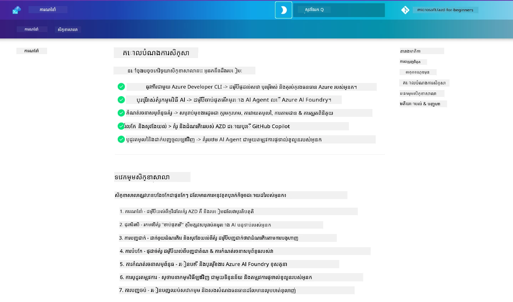

<div align="center">
  <div style="background: linear-gradient(135deg, #0078d4, #106ebe); border-radius: 10px; padding: 20px; margin: 20px 0; box-shadow: 0 4px 15px rgba(0, 120, 212, 0.3); border: 2px solid #005a9e;">
    <h2 style="color: white; margin: 0; font-size: 24px; text-shadow: 1px 1px 2px rgba(0,0,0,0.3);">
      🎯 សិក្ខាសាលា AZD សម្រាប់អ្នកអភិវឌ្ឍន៍ AI
    </h2>
    <p style="color: white; margin: 10px 0 0 0; font-size: 16px; text-shadow: 1px 1px 2px rgba(0,0,0,0.3);">
      <strong>សិក្ខាសាលាអនុវត្តសម្រាប់សាងសង់កម្មវិធី AI ជាមួយ Azure Developer CLI។</strong><br>
      បញ្ចប់ 7 ម៉ូឌុល ដើម្បីទទួលបានជំនាញលើទម្រង់ AZD និងដំណើរការដាក់បញ្ចូល AI។
    </p>
    <div style="margin-top: 15px;">
      <span style="background: rgba(255,255,255,0.2); padding: 5px 10px; border-radius: 15px; color: white; font-size: 14px;">
        📅 បច្ចុប្បន្នភាពចុងក្រោយ៖ មីនា 2026
      </span>
    </div>
  </div>
</div>

# AZD សម្រាប់អ្នកអភិវឌ្ឍន៍ AI

សូមស្វាគមន៍​មកកាន់​សិក្ខាសាលាអនុវត្តនេះ សម្រាប់រៀន​អំពី Azure Developer CLI (AZD) ជាមួយ​ការ​ផ្តោតលើ​ការ​ដាក់បញ្ចូលកម្មវិធី AI។ សិក្ខាសាលានេះ​ជួយអ្នកទទួលបានការយល់ដឹងអនុវត្តចំពោះទម្រង់ AZD តាម 3 ជំហាន៖

1. ការស្វែងរក - រកទម្រង់ដែលសមសម្រាប់អ្នក។
1. ការដាក់ឡើង - ដាក់ឡើង និងផ្ទៀងផ្ទាត់ថាវាដំណើរការ។
1. ការកែតម្រូវ - កែប្រែ និងធ្វើស្វែងជូត ដើម្បីឱ្យវាជារបស់អ្នក!

Over the course of this workshop, you will also be introduced to core developer tools and workflows, to help you streamline your end-to-end development journey.

<br/>

## មគ្គុទេសក៍នៅលើកម្មវិធីរុករក

មេរៀនសិក្ខាសាលានេះមានជា Markdown។ អ្នកអាចរុករកពួកវាដោយផ្ទាល់នៅលើ GitHub - ឬបើកមើលជាមុននៅលើកម្មវិធីរុករកដូចដែលបង្ហាញនៅក្នុងរូបថតខាងក្រោម។



To use this option - fork the repository to your profile, and launch GitHub Codespaces. Once the VS Code terminal is active, type this command:

This browser preview works in GitHub Codespaces, dev containers, or a local clone with Python and MkDocs installed.

```bash title="" linenums="0"
mkdocs serve > /dev/null 2>&1 &
```

In a few seconds, you will see a pop-up dialog. Select the option to `Open in browser`. The web-based guide will now open in a new browser tab. Some benefits of this preview:

1. **ការស្វែងរកក្នុងកម្មវិធី** - ស្វែងរកពាក្យគន្លឹះ ឬមេរៀនបានយ៉ាងឆាប់រហ័ស។
1. **រូបតំណាងចម្លង** - រំកិលម៉ៅស៍លើប្រអប់កូដ ដើម្បីឃើញជម្រើសនេះ
1. **ប្ដូរម៉ូដ (Theme toggle)** - ផ្លាស់ប្តូរវិញរវាងរចនាបទងងឹត និងរចនាបទភ្លឺ
1. **ទទួលជំនួយ** - ចុចរូបតំណាង Discord នៅខ្លែងជើងដើម្បីចូលរួម!

<br/>

## សង្ខេបសិក្ខាសាលា

**រយៈពេល:** 3-4 ម៉ោង  
**កំរិត:** ពីអ្នកចាប់ផ្តើមទៅកម្រិតមធ្យម  
**លក្ខខណ្ឌមុន:** មានបទពិសោធន៍មូលដ្ឋានលើ Azure, គំនិតផ្នែក AI, VS Code និងឧបករណ៍បន្ទាត់ពាក្យបញ្ជា។

This is a hands-on workshop where you learn by doing. Once you have completed the exercises, we recommend reviewing the AZD For Beginners curriculum to continue your learning journey into Security and Productivity best practices.

| ពេលវេលា| ម៉ូឌុល  | គោលបំណង |
|:---|:---|:---|
| 15 mins | [ការណែនាំ](docs/instructions/0-Introduction.md) | រៀបចំ​បរិបទ, យល់ពីគោលដៅ |
| 30 mins | [ជ្រើសទម្រង់ AI](docs/instructions/1-Select-AI-Template.md) | ស្វែងរកជម្រើស និងជ្រើសការចាប់ផ្ដើម | 
| 30 mins | [ធ្វើអះអាងទម្រង់ AI](docs/instructions/2-Validate-AI-Template.md) | ដាក់ឧបករណ៍ដ៏លំនាំទៅ Azure |
| 30 mins | [បែកសមាសទម្រង់ AI](docs/instructions/3-Deconstruct-AI-Template.md) | ស្វែងរករចនាសម្ព័ន្ធ និងកំណត់រចនាសម្ព័ន្ធ |
| 30 mins | [កំណត់ទម្រង់ AI](docs/instructions/4-Configure-AI-Template.md) | សកម្មភាព និងសាកល្បងមុខងារដែលមាន |
| 30 mins | [ផ្ទាល់ខ្លួនទម្រង់ AI](docs/instructions/5-Customize-AI-Template.md) | ប្ដូរទម្រង់ឱ្យសមស្របនឹងតម្រូវការរបស់អ្នក |
| 30 mins | [បំបែកហេដ្ឋារចនាសម្ព័ន្ធ](docs/instructions/6-Teardown-Infrastructure.md) | សម្អាត និងដោះដូរសាច់ធនធាន |
| 15 mins | [ចុងក្រោយ & ជំហានបន្ទាប់](docs/instructions/7-Wrap-up.md) | ខ្លឹមសារ​គ្រប់គ្រាន់​សម្រាប់រៀន​បន្ថែម និងបញ្ហាសិក្ខាសាលា |

<br/>

## អ្វីដែលអ្នកនឹងរៀន

សូមគិតទម្រង់ AZD ជាបន្ទុកសម្រាប់រៀន ដើម្បីស្វែងរកលទ្ធភាពនានានៃឧបករណ៍ និងកិច្ចការសម្រាប់ការអភិវឌ្ឍពីដើមដល់ចុងលើ Microsoft Foundry។ នៅចុងនៃសិក្ខាសាលានេះ អ្នកគួរតែមានអារម្មណ៍អានុភាពចំពោះឧបករណ៍និងគំនិតនានា​ក្នុងបរិបទនេះ។

| គំនិត  | គោលបំណង |
|:---|:---|
| **Azure Developer CLI** | យល់ពីបញ្ជា និងដំណើរការឧបករណ៍ |
| **AZD Templates**| យល់ពីរចនាសម្ព័ន្ធគម្រោង និងកំណត់រចនាសម្ព័ន្ធ |
| **Azure AI Agent**| ផ្តល់ និងដាក់បញ្ចូលគម្រោង Microsoft Foundry |
| **Azure AI Search**| ធ្វើឱ្យមាន context engineering ជាមួយ agents |
| **Observability**| ស្វែងរក tracing, monitoring និងការវាយតម្លៃ |
| **Red Teaming**| ស្វែងរកការធ្វើតេស្តប្រកួតប្រជែង និងវិធានការការពារ |

<br/>

## រចនាសម្ព័ន្ធសិក្ខាសាលា

សិក្ខាសាលានេះសម្រេចរៀបចំដើម្បីនឹកសួនអ្នកពីការស្វែងរកទម្រង់ ទៅកាន់ការដាក់ឡើង ការបែកសមាស និងការកែតម្រូវ - ប្រើទម្រង់ចាប់ផ្ដើមផ្លូវការនៃ [Getting Started with AI Agents](https://github.com/Azure-Samples/get-started-with-ai-agents) ជាការចាប់ផ្ដើម។

### [Module 1: ជ្រើសទម្រង់ AI](docs/instructions/1-Select-AI-Template.md) (30 mins)

- តើទម្រង់ AI ជាអ្វី?
- តើខ្ញុំអាចរកទម្រង់ AI នៅឯណា?
- តើធ្វើដូចម្ដេចដើម្បីចាប់ផ្ដើមសាងសង់ AI Agents?
- **Lab**: Quickstart ក្នុង Codespaces ឬ dev container

### [Module 2: ធ្វើអះអាងទម្រង់ AI](docs/instructions/2-Validate-AI-Template.md) (30 mins)

- តើស្ថាបត្យកម្មទម្រង់ AI ជាអ្វី?
- តើដំណើរការ AZD Development ជាអ្វី?
- តើខ្ញុំអាចទទួលជំនួយពី AZD Development ដោយរបៀបណា?
- **Lab**: ដាក់ឡើង និងធ្វើអះអាងទម្រង់ AI Agents

### [Module 3: បែកសមាសទម្រង់ AI](docs/instructions/3-Deconstruct-AI-Template.md) (30 mins)

- ស្វែងរកបរិយាកាសរបស់អ្នកនៅក្នុង `.azure/` 
- ស្វែងរកការរៀបចំធនធានរបស់អ្នកនៅក្នុង `infra/` 
- ស្វែងរកកំណត់រចនាសម្ព័ន្ធ AZD របស់អ្នកក្នុង `azure.yaml`s
- **Lab**: កែប្រែ Environment Variables & Redeploy

### [Module 4: កំណត់ទម្រង់ AI](docs/instructions/4-Configure-AI-Template.md) (30 mins)
- ស្វែងរក៖ Retrieval Augmented Generation
- ស្វែងរក៖ Agent Evaluation & Red Teaming
- ស្វែងរក៖ Tracing & Monitoring
- **Lab**: ស្វែងរក AI Agent + Observability 

### [Module 5: ផ្ទាល់ខ្លួនទម្រង់ AI](docs/instructions/5-Customize-AI-Template.md) (30 mins)
- កំណត់: PRD ជាមួយតម្រូវការសេណារីយ៉ូ
- កំណត់: Environment Variables សម្រាប់ AZD
- អនុវត្ត: Lifecycle Hooks សម្រាប់ភារកិច្ចបន្ថែម
- **Lab**: ប្ដូរទម្រង់សម្រាប់សេណារីយ៉ូរបស់ខ្ញុំ

### [Module 6: បំបែកហេដ្ឋារចនាសម្ព័ន្ធ](docs/instructions/6-Teardown-Infrastructure.md) (30 mins)
- សារជាខ្សែ: តើទម្រង់ AZD ជាអ្វី?
- សារជាខ្សែ: ហេតុអ្វីបានជាគួរប្រើ Azure Developer CLI?
- ជំហានបន្ទាប់: សាកល្បងទម្រង់ផ្សេងទៀត!
- **Lab**: ដោះលែងហេដ្ឋារចនាសម្ព័ន្ធ & សម្អាត

<br/>

## ការប្រកួតក្នុងសិក្ខាសាលា

ចង់តស៊ូមុខឯងដើម្បីធ្វើច្រើនទៀតទេ? នៅទីនេះមានសំណើគម្រោងខ្លះៗ - ឬចែករំលែកគំនិតរបស់អ្នកជាមួយយើង!!

| គម្រោង | ការ​ពិពណ៌នា |
|:---|:---|
|1. **បែកសមាសធាតុខ្នាតមួយនៃទម្រង់ AI ស្មុគស្មាញ** | ប្រើដំណើរការ និងឧបករណ៍ដែលយើងបានរៀបរាប់ ហើយសាកល្បងមើលថាតើអ្នកអាចដាក់ឡើង, ផ្ទៀងផ្ទាត់ និងកែតម្រូវទម្រង់ដំណោះស្រាយ AI ផ្សេងទៀតបានទេ។ _តើអ្នករៀនអ្វី?_|
|2. **ប្ដូរទម្រង់ដោយប្រើសេណារីយ៉ូរបស់អ្នក**  | សាកសួរសរសេរ PRD (Product Requirements Document) សម្រាប់សេណារីយ៉ូផ្សេងទៀត។ បន្ទាប់មកប្រើ GitHub Copilot នៅក្នុង repo ទម្រង់របស់អ្នកក្នុង Agent Model - ហើយសុំឱវាទ្រង់ផ្ដល់ចុះបញ្ជីលំហាត់សម្រាប់ការកែតម្រូវ។ _តើអ្នករៀនអ្វី? តើអ្នកអាចធ្វើឱ្យល្អប្រសើរជាងនេះបានទេ?_|
| | |

## តើមានមតិយោបល់ទេ?

1. Post an issue on this repo - tag it `Workshop` for convenience.
1. Join the Microsoft Foundry Discord - connect with your peers!


| | | 
|:---|:---|
| **📚 ផ្ទះវគ្គសិក្សា**| [AZD For Beginners](../README.md)|
| **📖 ឯកសារ** | [Get started with AI templates](https://learn.microsoft.com/en-us/azure/ai-foundry/how-to/develop/ai-template-get-started)|
| **🛠️ ទម្រង់ AI** | [Microsoft Foundry Templates](https://ai.azure.com/templates) |
|**🚀 ជំហានបន្ទាប់** | [Begin Workshop](#សង្ខេបសិក្ខាសាលា) |
| | |

<br/>

---

**Navigation:** [Main Course](../README.md) | [ការណែនាំ](docs/instructions/0-Introduction.md) | [Module 1: ជ្រើសទម្រង់](docs/instructions/1-Select-AI-Template.md)

**តើអ្នករៀបចំរួចហើយដើម្បីចាប់ផ្តើមសាងសង់កម្មវិធី AI ជាមួយ AZD ទេ?**

[Begin Workshop: ការណែនាំ →](docs/instructions/0-Introduction.md)

---

<!-- CO-OP TRANSLATOR DISCLAIMER START -->
**Disclaimer**:
ឯកសារ​នេះ​ត្រូវបាន​បកប្រែ​ដោយប្រើ​សេវាកម្ម​បកប្រែ AI [Co-op Translator](https://github.com/Azure/co-op-translator)។ ខណៈពេលដែល​យើងខិតខំ​បង្ហាញភាព​ត្រឹមត្រូវ សូមយកចិត្តទុកដាក់​ថា​ការ​បកប្រែ​ដោយស្វ័យប្រវត្តិ​អាច​មាន​កំហុស ឬ​មិន​ត្រឹមត្រូវ។ ឯកសារ​ដើម​នៅ​ក្នុង​ភាសាម្ចាស់ដើម​គួរ​ត្រូវ​បាន​ចាត់ទុក​ជា​ឯកសារ​យោង​ដែល​គួរ​ឲ្យ​ទុកចិត្ត។ ចំពោះ​ព័ត៌មាន​សំខាន់ៗ យើងសូមណែនាំ​ឱ្យ​ប្រើ​ការ​បកប្រែ​ដោយ​អ្នកបកប្រែវិជ្ជាជីវៈ។ យើង​មិន​ទទួលខុសត្រូវ​ចំពោះ​ការ​យល់ច្រឡំ ឬ​ការ​បកស្រាយខុស ដែល​កើតឡើង​ពី​ការ​ប្រើប្រាស់​ការ​បកប្រែ​នេះ​ទេ។
<!-- CO-OP TRANSLATOR DISCLAIMER END -->